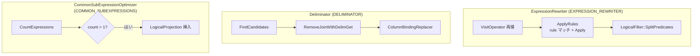

# 第13章 式の書き換え

> **本章で読むソース**
>
> - [src/optimizer/expression_rewriter.cpp](https://github.com/duckdb/duckdb/blob/v1.5.4/src/optimizer/expression_rewriter.cpp)
> - [src/optimizer/rule/constant_folding.cpp](https://github.com/duckdb/duckdb/blob/v1.5.4/src/optimizer/rule/constant_folding.cpp)
> - [src/optimizer/rule/comparison_simplification.cpp](https://github.com/duckdb/duckdb/blob/v1.5.4/src/optimizer/rule/comparison_simplification.cpp)
> - [src/optimizer/rule/distributivity.cpp](https://github.com/duckdb/duckdb/blob/v1.5.4/src/optimizer/rule/distributivity.cpp)
> - [src/optimizer/cse_optimizer.cpp](https://github.com/duckdb/duckdb/blob/v1.5.4/src/optimizer/cse_optimizer.cpp)
> - [src/optimizer/deliminator.cpp](https://github.com/duckdb/duckdb/blob/v1.5.4/src/optimizer/deliminator.cpp)

## この章の狙い

オプティマイザの pass は第10章で一覧したが、本章では式レベルの書き換えに限定して読む。
`ExpressionRewriter` と `optimizer/rule/` の簡約ルール、共通部分式抽出（`CommonSubExpressionOptimizer`）、相関サブクエリ除去（`Deliminator`）の三経路を追う。

## 前提

bound 式の型階層は第8章、`LogicalOperator` 木の構造は第9章を前提とする。
フィルタプッシュダウンや結合順序などプラン構造を変える pass は第11章、第12章で扱い、本章では式木と相関 join の整理に絞る。

## ExpressionRewriter と rule の適用

`EXPRESSION_REWRITER` pass は `Optimizer` コンストラクタで登録した `Rule` 群を `ExpressionRewriter::VisitOperator` が論理木全体へ走査する。
各演算子の式に対し `ApplyRules` がマッチしたルールを順に試し、根ノードが置き換われば同じルール集合で再帰適用する。

[src/optimizer/expression_rewriter.cpp L13-L44](https://github.com/duckdb/duckdb/blob/v1.5.4/src/optimizer/expression_rewriter.cpp#L13-L44)

```cpp
unique_ptr<Expression> ExpressionRewriter::ApplyRules(LogicalOperator &op, const vector<reference<Rule>> &rules,
                                                      unique_ptr<Expression> expr, bool &changes_made, bool is_root) {
	for (auto &rule : rules) {
		vector<reference<Expression>> bindings;
		if (rule.get().root->Match(*expr, bindings)) {
			// the rule matches! try to apply it
			bool rule_made_change = false;
			auto alias = expr->alias;
			auto result = rule.get().Apply(op, bindings, rule_made_change, is_root);
			if (result) {
				changes_made = true;
				// the base node changed: the rule applied changes
				// rerun on the new node
				if (!alias.empty()) {
					result->alias = std::move(alias);
				}
				return ExpressionRewriter::ApplyRules(op, rules, std::move(result), changes_made);
			} else if (rule_made_change) {
				changes_made = true;
				// the base node didn't change, but changes were made, rerun
				return expr;
			}
			// else nothing changed, continue to the next rule
			continue;
		}
	}
	// no changes could be made to this node
	// recursively run on the children of this node
	ExpressionIterator::EnumerateChildren(*expr, [&](unique_ptr<Expression> &child) {
		child = ExpressionRewriter::ApplyRules(op, rules, std::move(child), changes_made);
	});
	return expr;
}
```

`VisitOperator` は子演算子を先に処理し、式走査後に `LogicalFilter` なら `SplitPredicates` で AND 句を再分割する。
フィルタ簡約ルールが conjunct を結合したあと、実行向けに述語をばらすためである。

[src/optimizer/expression_rewriter.cpp L63-L78](https://github.com/duckdb/duckdb/blob/v1.5.4/src/optimizer/expression_rewriter.cpp#L63-L78)

```cpp
void ExpressionRewriter::VisitOperator(LogicalOperator &op) {
	VisitOperatorChildren(op);
	this->op = &op;

	to_apply_rules.clear();
	for (auto &rule : rules) {
		to_apply_rules.push_back(*rule);
	}

	VisitOperatorExpressions(op);

	// if it is a LogicalFilter, we split up filter conjunctions again
	if (op.type == LogicalOperatorType::LOGICAL_FILTER) {
		auto &filter = op.Cast<LogicalFilter>();
		filter.SplitPredicates();
	}
}
```

## 定数畳み込み

`ConstantFoldingRule` は `IsFoldable` な式（定数以外）にマッチし、`ExpressionExecutor::TryEvaluateScalar` でコンパイル時評価する。
成功すれば `BoundConstantExpression` に置き換え、実行時の式評価を省く。

[src/optimizer/rule/constant_folding.cpp L27-L42](https://github.com/duckdb/duckdb/blob/v1.5.4/src/optimizer/rule/constant_folding.cpp#L27-L42)

```cpp
unique_ptr<Expression> ConstantFoldingRule::Apply(LogicalOperator &op, vector<reference<Expression>> &bindings,
                                                  bool &changes_made, bool is_root) {
	auto &root = bindings[0].get();
	// the root is a scalar expression that we have to fold
	D_ASSERT(root.IsFoldable() && root.GetExpressionType() != ExpressionType::VALUE_CONSTANT);

	// use an ExpressionExecutor to execute the expression
	Value result_value;
	if (!ExpressionExecutor::TryEvaluateScalar(GetContext(), root, result_value)) {
		return nullptr;
	}
	D_ASSERT(result_value.type().InternalType() == root.return_type.InternalType());
	// now get the value from the result vector and insert it back into the plan as a constant expression
	return make_uniq<BoundConstantExpression>(result_value);
}
```

## 比較式の簡約

`ComparisonSimplificationRule` は比較式の片側が畳み込み可能な定数のとき、反対側が可逆な `BoundCast` ならその cast を外し、定数を元の型へ移す。
matcher が要求するのは片側の foldable constant であり、非定数側の child は必ずしも `BoundColumnRefExpression` ではない。
child が列参照の場合に限り、table filter や zonemap が素の列型で効きやすくなる。

[src/optimizer/rule/comparison_simplification.cpp L18-L73](https://github.com/duckdb/duckdb/blob/v1.5.4/src/optimizer/rule/comparison_simplification.cpp#L18-L73)

```cpp
unique_ptr<Expression> ComparisonSimplificationRule::Apply(LogicalOperator &op, vector<reference<Expression>> &bindings,
                                                           bool &changes_made, bool is_root) {
	auto &expr = bindings[0].get().Cast<BoundComparisonExpression>();
	auto &constant_expr = bindings[1].get();
	bool column_ref_left = expr.left.get() != &constant_expr;
	auto column_ref_expr = !column_ref_left ? expr.right.get() : expr.left.get();
	// the constant_expr is a scalar expression that we have to fold
	// use an ExpressionExecutor to execute the expression
	D_ASSERT(constant_expr.IsFoldable());
	Value constant_value;
	if (!ExpressionExecutor::TryEvaluateScalar(GetContext(), constant_expr, constant_value)) {
		return nullptr;
	}
	if (constant_value.IsNull() && !(expr.GetExpressionType() == ExpressionType::COMPARE_NOT_DISTINCT_FROM ||
	                                 expr.GetExpressionType() == ExpressionType::COMPARE_DISTINCT_FROM)) {
		// comparison with constant NULL, return NULL
		return make_uniq<BoundConstantExpression>(Value(LogicalType::BOOLEAN));
	}
	if (column_ref_expr->GetExpressionClass() == ExpressionClass::BOUND_CAST) {
		//! Here we check if we can apply the expression on the constant side
		//! We can do this if the cast itself is invertible and casting the constant is
		//! invertible in practice.
		auto &cast_expression = column_ref_expr->Cast<BoundCastExpression>();
		auto target_type = cast_expression.source_type();
		if (!BoundCastExpression::CastIsInvertible(target_type, cast_expression.return_type)) {
			return nullptr;
		}

		// Can we cast the constant at all?
		string error_message;
		Value cast_constant;
		auto new_constant =
		    constant_value.TryCastAs(rewriter.context, target_type, cast_constant, &error_message, true);
		if (!new_constant) {
			return nullptr;
		}

		// Is the constant cast invertible?
		if (!cast_constant.IsNull() &&
		    !BoundCastExpression::CastIsInvertible(cast_expression.return_type, target_type)) {
			// Cast is not invertible, so we do not rewrite this expression to ensure that the cast is executed
			return nullptr;
		}

		//! We can cast, now we change our column_ref_expression from an operator cast to a column reference
		auto child_expression = std::move(cast_expression.child);
		auto new_constant_expr = make_uniq<BoundConstantExpression>(cast_constant);
		if (column_ref_left) {
			expr.left = std::move(child_expression);
			expr.right = std::move(new_constant_expr);
		} else {
			expr.left = std::move(new_constant_expr);
			expr.right = std::move(child_expression);
		}
		changes_made = true;
	}
	return nullptr;
}
```

## 分配法則によるフィルタ分割

`DistributivityRule` は OR の各枝に共通する conjunct を抽出し、`(X AND A) OR (X AND B)` を `X AND (A OR B)` へ変形する。
マッチ対象は `CONJUNCTION_OR` で、主に `LogicalFilter` 内の述語整理に使われる。

[src/optimizer/rule/distributivity.cpp L11-L15](https://github.com/duckdb/duckdb/blob/v1.5.4/src/optimizer/rule/distributivity.cpp#L11-L15)

```cpp
DistributivityRule::DistributivityRule(ExpressionRewriter &rewriter) : Rule(rewriter) {
	// we match on an OR expression within a LogicalFilter node
	root = make_uniq<ExpressionMatcher>();
	root->expr_type = make_uniq<SpecificExpressionTypeMatcher>(ExpressionType::CONJUNCTION_OR);
}
```

`Apply` は各 OR 枝の式集合の積を取り、全枝に現れる conjunct を外へ抜き出す。

[src/optimizer/rule/distributivity.cpp L57-L84](https://github.com/duckdb/duckdb/blob/v1.5.4/src/optimizer/rule/distributivity.cpp#L57-L84)

```cpp
unique_ptr<Expression> DistributivityRule::Apply(LogicalOperator &op, vector<reference<Expression>> &bindings,
                                                 bool &changes_made, bool is_root) {
	auto &initial_or = bindings[0].get().Cast<BoundConjunctionExpression>();

	// we want to find expressions that occur in each of the children of the OR
	// i.e. (X AND A) OR (X AND B) => X occurs in all branches
	// first, for the initial child, we create an expression set of which expressions occur
	// this is our initial candidate set (in the example: [X, A])
	expression_set_t candidate_set;
	AddExpressionSet(*initial_or.children[0], candidate_set);
	// now for each of the remaining children, we create a set again and intersect them
	// in our example: the second set would be [X, B]
	// the intersection would leave [X]
	for (idx_t i = 1; i < initial_or.children.size(); i++) {
		expression_set_t next_set;
		AddExpressionSet(*initial_or.children[i], next_set);
		expression_set_t intersect_result;
		for (auto &expr : candidate_set) {
			if (next_set.find(expr) != next_set.end()) {
				intersect_result.insert(expr);
			}
		}
		candidate_set = intersect_result;
	}
	if (candidate_set.empty()) {
		// nothing found: abort
		return nullptr;
	}
```

## 共通部分式の抽出

`COMMON_SUBEXPRESSIONS` pass の `CommonSubExpressionOptimizer` は `LOGICAL_PROJECTION` と `LOGICAL_AGGREGATE_AND_GROUP_BY` だけを対象にする。
`CountExpressions` で子を持つ式の出現回数を数え、2回以上かつ volatile でなければ `PerformCSEReplacement` が式を `BoundColumnRefExpression` へ差し替える。

[src/optimizer/cse_optimizer.cpp L37-L47](https://github.com/duckdb/duckdb/blob/v1.5.4/src/optimizer/cse_optimizer.cpp#L37-L47)

```cpp
void CommonSubExpressionOptimizer::VisitOperator(LogicalOperator &op) {
	switch (op.type) {
	case LogicalOperatorType::LOGICAL_PROJECTION:
	case LogicalOperatorType::LOGICAL_AGGREGATE_AND_GROUP_BY:
		ExtractCommonSubExpresions(op);
		break;
	default:
		break;
	}
	LogicalOperatorVisitor::VisitOperator(op);
}
```

重複が見つかった場合、子の上に新しい `LogicalProjection` を挿入し、共通式を一度だけ評価する列へまとめる。

[src/optimizer/cse_optimizer.cpp L141-L174](https://github.com/duckdb/duckdb/blob/v1.5.4/src/optimizer/cse_optimizer.cpp#L141-L174)

```cpp
void CommonSubExpressionOptimizer::ExtractCommonSubExpresions(LogicalOperator &op) {
	D_ASSERT(op.children.size() == 1);

	// first we count for each expression with children how many types it occurs
	CSEReplacementState state;
	LogicalOperatorVisitor::EnumerateExpressions(
	    op, [&](unique_ptr<Expression> *child) { CountExpressions(**child, state); });
	// check if there are any expressions to extract
	bool perform_replacement = false;
	for (auto &expr : state.expression_count) {
		if (expr.second.count > 1) {
			perform_replacement = true;
			break;
		}
	}
	if (!perform_replacement) {
		// no CSEs to extract
		return;
	}
	state.projection_index = binder.GenerateTableIndex();
	// we found common subexpressions to extract
	// now we iterate over all the expressions and perform the actual CSE elimination

	LogicalOperatorVisitor::EnumerateExpressions(
	    op, [&](unique_ptr<Expression> *child) { PerformCSEReplacement(*child, state); });
	D_ASSERT(state.expressions.size() > 0);
	// create a projection node as the child of this node
	auto projection = make_uniq<LogicalProjection>(state.projection_index, std::move(state.expressions));
	if (op.children[0]->has_estimated_cardinality) {
		projection->SetEstimatedCardinality(op.children[0]->estimated_cardinality);
	}
	projection->children.push_back(std::move(op.children[0]));
	op.children[0] = std::move(projection);
}
```

`BOUND_CASE` や `BOUND_CONJUNCTION` は短絡評価のため、左端の子以外から CSE を抽出しない制御が `CountExpressions` にある。

## Deliminator による相関 join の整理

`DELIMINATOR` pass は `LogicalDelimJoin` を走査し、RHS にある不要な `LogicalDelimGet` 付き結合を候補として集める。
`RemoveJoinWithDelimGet` は等値条件で `DelimGet` 列と外側列が対応するとき、結合を外して列参照を `ColumnBindingReplacer` で張り替える。

[src/optimizer/deliminator.cpp L48-L94](https://github.com/duckdb/duckdb/blob/v1.5.4/src/optimizer/deliminator.cpp#L48-L94)

```cpp
unique_ptr<LogicalOperator> Deliminator::Optimize(unique_ptr<LogicalOperator> op) {
	root = op;

	vector<DelimCandidate> candidates;
	FindCandidates(op, candidates);

	if (candidates.empty()) {
		return op;
	}

	for (auto &candidate : candidates) {
		auto &delim_join = candidate.delim_join;

		// Sort these so the deepest are first
		std::sort(candidate.joins.begin(), candidate.joins.end(),
		          [](const JoinWithDelimGet &lhs, const JoinWithDelimGet &rhs) { return lhs.depth > rhs.depth; });

		bool all_removed = true;
		if (!candidate.joins.empty() && HasSelection(delim_join)) {
			// Keep the deepest join with DelimGet in these cases,
			// as the selection can greatly reduce the cost of the RHS child of the DelimJoin
			candidate.joins.erase(candidate.joins.begin());
			all_removed = false;
		}

		bool all_equality_conditions = true;
		for (auto &join : candidate.joins) {
			all_removed = RemoveJoinWithDelimGet(delim_join, candidate.delim_get_count, join.join.get(),
			                                     all_equality_conditions) &&
			              all_removed;
		}

		// Change type if there are no more duplicate-eliminated columns
		if (candidate.joins.size() == candidate.delim_get_count && all_removed) {
			delim_join.type = LogicalOperatorType::LOGICAL_COMPARISON_JOIN;
			delim_join.duplicate_eliminated_columns.clear();
		}

		// Only DelimJoins are ever created as SINGLE joins,
		// and we can switch from SINGLE to LEFT if the RHS is de-duplicated by an aggr
		if (delim_join.join_type == JoinType::SINGLE) {
			TrySwitchSingleToLeft(delim_join);
		}
	}

	return op;
}
```

等値結合の冗長性判定では、条件ごとに `DelimGet` 側と反対側の `BoundColumnRefExpression` を対応づけ、必要なら `IS NOT NULL` 述語をフィルタとして残す。

[src/optimizer/deliminator.cpp L202-L245](https://github.com/duckdb/duckdb/blob/v1.5.4/src/optimizer/deliminator.cpp#L202-L245)

```cpp
	// Check if joining with the DelimGet is redundant, and collect relevant column information
	ColumnBindingReplacer replacer;
	auto &replacement_bindings = replacer.replacement_bindings;
	for (auto &cond : comparison_join.conditions) {
		all_equality_conditions = all_equality_conditions && IsEqualityJoinCondition(cond);
		auto &delim_side = delim_idx == 0 ? *cond.left : *cond.right;
		auto &other_side = delim_idx == 0 ? *cond.right : *cond.left;
		if (delim_side.GetExpressionType() != ExpressionType::BOUND_COLUMN_REF ||
		    other_side.GetExpressionType() != ExpressionType::BOUND_COLUMN_REF) {
			return false;
		}
		auto &delim_colref = delim_side.Cast<BoundColumnRefExpression>();
		auto &other_colref = other_side.Cast<BoundColumnRefExpression>();
		replacement_bindings.emplace_back(delim_colref.binding, other_colref.binding);

		// Only add IS NOT NULL filter for regular equality/inequality comparisons
		// Do NOT add for DISTINCT FROM variants, as they handle NULL correctly
		if (cond.comparison != ExpressionType::COMPARE_NOT_DISTINCT_FROM &&
		    cond.comparison != ExpressionType::COMPARE_DISTINCT_FROM) {
			auto is_not_null_expr =
			    make_uniq<BoundOperatorExpression>(ExpressionType::OPERATOR_IS_NOT_NULL, LogicalType::BOOLEAN);
			is_not_null_expr->children.push_back(other_side.Copy());
			filter_expressions.push_back(std::move(is_not_null_expr));
		}
	}

	if (!all_equality_conditions &&
	    !RemoveInequalityJoinWithDelimGet(delim_join, delim_get_count, join, replacement_bindings)) {
		return false;
	}

	unique_ptr<LogicalOperator> replacement_op = std::move(comparison_join.children[1 - delim_idx]);
	if (!filter_expressions.empty()) { // Create filter if necessary
		auto new_filter = make_uniq<LogicalFilter>();
		new_filter->expressions = std::move(filter_expressions);
		new_filter->children.emplace_back(std::move(replacement_op));
		replacement_op = std::move(new_filter);
	}

	join = std::move(replacement_op);

	// TODO: Maybe go from delim join instead to save work
	replacer.VisitOperator(*root);
	return true;
```

## 処理の流れ



三経路は独立した subgraph として示し、pass 同士の矢印は張らない。
`RunBuiltInOptimizers` 上の実順は `EXPRESSION_REWRITER` →（中間 pass）→ `DELIMINATOR` →（`JOIN_ORDER` 等）→ `COMMON_SUBEXPRESSIONS` である。

## 高速化と最適化の工夫

定数畳み込みと比較簡約は、実行時に毎行評価していた式を定数またはより単純な式へ落とす。
比較簡約が可逆な `BoundCast` を外して定数を元の型へ移すと、child が列参照のときにゾーンマップや統計伝播が効く形へ述語を寄せられる。

CSE は同一式の重複評価を投影列1回にまとめ、集約や SELECT リストの式コストを線形に近づける。
`Deliminator` は相関サブクエリ展開で増えた `DelimGet` 結合を除去し、`LogicalDelimJoin` を通常の `LogicalComparisonJoin` に戻して後続 pass の探索空間を狭める。

## まとめ

式の書き換えは `ExpressionRewriter` の rule 適用、CSE による投影挿入、`Deliminator` による相関 join 整理の三層で進む。
rule はマッチャで局所パターンを捉え、CSE と deliminator は論理演算子木の形を変える。
いずれも第10章の pass パイプラインの中で、プラン構造を大きく組み替える pass より前後に配置されて効く。

## 関連する章

- 第8章（式のバインド）：rule が書き換える `Bound*Expression`
- 第10章（オプティマイザ全体像）：三経路が属する pass 名
- 第11章（フィルタプッシュダウンと統計伝播）：簡約後の述語の押し下げ
- 第12章（結合順序最適化）：結合条件式の配置
- 第17章（式実行）：畳み込みに使う `ExpressionExecutor`
