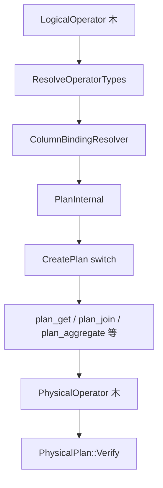

# 第14章 物理プラン生成

> **本章で読むソース**
>
> - [src/execution/physical_plan_generator.cpp](https://github.com/duckdb/duckdb/blob/v1.5.4/src/execution/physical_plan_generator.cpp)
> - [src/execution/physical_plan/plan_get.cpp](https://github.com/duckdb/duckdb/blob/v1.5.4/src/execution/physical_plan/plan_get.cpp)
> - [src/execution/physical_plan/plan_comparison_join.cpp](https://github.com/duckdb/duckdb/blob/v1.5.4/src/execution/physical_plan/plan_comparison_join.cpp)
> - [src/execution/physical_plan/plan_aggregate.cpp](https://github.com/duckdb/duckdb/blob/v1.5.4/src/execution/physical_plan/plan_aggregate.cpp)
> - [src/execution/physical_plan/plan_order.cpp](https://github.com/duckdb/duckdb/blob/v1.5.4/src/execution/physical_plan/plan_order.cpp)
> - [src/execution/physical_operator.cpp](https://github.com/duckdb/duckdb/blob/v1.5.4/src/execution/physical_operator.cpp)

## この章の狙い

第13章までで整えた論理プランは、実行可能な `PhysicalOperator` 木へ変換されなければならない。
本章では `PhysicalPlanGenerator` を入口に、型解決と `ColumnBinding` 解決の後段、`CreatePlan` の `switch` による dispatch、そして `plan_*.cpp` に分かれた個別変換ロジックを追う。
あわせて、後続章でパイプラインに分割される土台となる source、operator、sink の三役を `PhysicalOperator` 側で確認する。

## 前提

論理演算子の生成は第9章、オプティマイザによる書き換えは第10章から第13章を前提とする。
パイプラインへの分割と並列実行は第15章、第16章で扱う。

## クエリパイプライン上の位置づけ

`ClientContext` は最適化済み論理プランを `PhysicalPlanGenerator::Plan` に渡し、返された `PhysicalPlan` のルートを `Executor::Initialize` へ引き渡す。
`Plan` は `ResolveAndPlan` で前処理を済ませ、最後に `PhysicalPlan::Verify` を呼ぶ。

[src/execution/physical_plan_generator.cpp L23-L50](https://github.com/duckdb/duckdb/blob/v1.5.4/src/execution/physical_plan_generator.cpp#L23-L50)

```cpp
unique_ptr<PhysicalPlan> PhysicalPlanGenerator::Plan(unique_ptr<LogicalOperator> op) {
	auto &plan = ResolveAndPlan(std::move(op));
	plan.Verify();
	return std::move(physical_plan);
}

PhysicalOperator &PhysicalPlanGenerator::ResolveAndPlan(unique_ptr<LogicalOperator> op) {
	auto &profiler = QueryProfiler::Get(context);

	// Resolve the types of each operator.
	profiler.StartPhase(MetricType::PHYSICAL_PLANNER_RESOLVE_TYPES);
	op->ResolveOperatorTypes();
	profiler.EndPhase();

	// Resolve the column references.
	profiler.StartPhase(MetricType::PHYSICAL_PLANNER_COLUMN_BINDING);
	ColumnBindingResolver resolver;
	resolver.VisitOperator(*op);
	profiler.EndPhase();

	// Create the main physical plan.
	profiler.StartPhase(MetricType::PHYSICAL_PLANNER_CREATE_PLAN);
	physical_plan = PlanInternal(*op);
	profiler.EndPhase();

	// Return a reference to the root of this plan.
	return physical_plan->Root();
}
```

`PlanInternal` は `PhysicalPlan` を arena 付きで確保し、推定カーディナリティを物理木へ写したうえで `CreatePlan` を呼ぶ。
デバッグ設定 `DebugVerifyVectorSetting` が有効なときだけ、ルートに `PhysicalVerifyVector` を差し込む。

[src/execution/physical_plan_generator.cpp L52-L68](https://github.com/duckdb/duckdb/blob/v1.5.4/src/execution/physical_plan_generator.cpp#L52-L68)

```cpp
unique_ptr<PhysicalPlan> PhysicalPlanGenerator::PlanInternal(LogicalOperator &op) {
	if (!physical_plan) {
		physical_plan = make_uniq<PhysicalPlan>(Allocator::Get(context));
	}
	op.estimated_cardinality = op.EstimateCardinality(context);
	physical_plan->SetRoot(CreatePlan(op));
	physical_plan->Root().estimated_cardinality = op.estimated_cardinality;

	auto debug_verify_vector = Settings::Get<DebugVerifyVectorSetting>(context);
	if (debug_verify_vector != DebugVectorVerification::NONE) {
		if (debug_verify_vector != DebugVectorVerification::DICTIONARY_EXPRESSION &&
		    debug_verify_vector != DebugVectorVerification::VARIANT_VECTOR) {
			physical_plan->SetRoot(Make<PhysicalVerifyVector>(physical_plan->Root(), debug_verify_vector));
		}
	}
	return std::move(physical_plan);
}
```

`PhysicalPlan` は `unique_ptr<PhysicalPlan>` として `PhysicalPlanGenerator` が所有する。
個々の `PhysicalOperator` の実体と寿命は `PhysicalPlan::arena` が持ち、`ops` がデストラクタ呼び出しの対象を追跡する。
`children` は `ArenaLinkedList<reference<PhysicalOperator>>` であり、親子トポロジーを結ぶ非所有の参照である。
所有しているのは arena 側で、`children` は接続だけを担う。

[src/include/duckdb/execution/physical_plan_generator.hpp L25-L64](https://github.com/duckdb/duckdb/blob/v1.5.4/src/include/duckdb/execution/physical_plan_generator.hpp#L25-L64)

```cpp
class PhysicalPlan {
public:
	explicit PhysicalPlan(Allocator &allocator) : arena(allocator) {};

	~PhysicalPlan() {
		// Call the destructor of each physical operator.
		for (auto &op : ops) {
			auto &op_ref = op.get();
			op_ref.~PhysicalOperator();
		}
	}

public:
	template <class T, class... ARGS>
	PhysicalOperator &Make(ARGS &&... args) {
		static_assert(std::is_base_of<PhysicalOperator, T>::value, "T must be a physical operator");
		auto ptr = arena.Make<T>(*this, std::forward<ARGS>(args)...);
		ops.push_back(*ptr);
		return *ptr;
	}

	PhysicalOperator &Root() {
		D_ASSERT(root);
		return *root;
	}
	void SetRoot(PhysicalOperator &op) {
		root = op;
	}
	//! Get a reference to the arena.
	ArenaAllocator &ArenaRef() {
		return arena;
	}

private:
	//! The arena allocator storing the physical operator memory.
	ArenaAllocator arena;
	//! References to the physical operators.
	vector<reference<PhysicalOperator>> ops;
	//! The root of the physical plan.
	optional_ptr<PhysicalOperator> root;
};
```

[src/include/duckdb/execution/physical_operator.hpp L45-L61](https://github.com/duckdb/duckdb/blob/v1.5.4/src/include/duckdb/execution/physical_operator.hpp#L45-L61)

```cpp
	PhysicalOperator(PhysicalPlan &physical_plan, PhysicalOperatorType type, vector<LogicalType> types,
	                 idx_t estimated_cardinality);
	virtual ~PhysicalOperator() {
	}

	//! Deleted copy constructors.
	PhysicalOperator(const PhysicalOperator &other) = delete;
	PhysicalOperator &operator=(const PhysicalOperator &) = delete;

	//! The child operators.
	ArenaLinkedList<reference<PhysicalOperator>> children;
	//! The physical operator type.
	PhysicalOperatorType type;
	//! The return types.
	vector<LogicalType> types;
	//! The estimated cardinality.
	idx_t estimated_cardinality;
```

コンストラクタは `children` を `physical_plan.ArenaRef()` に結び付ける。
リストのノード自体も arena から確保されるが、指す先の演算子寿命はやはり `PhysicalPlan` 側である。

[src/execution/physical_operator.cpp L19-L23](https://github.com/duckdb/duckdb/blob/v1.5.4/src/execution/physical_operator.cpp#L19-L23)

```cpp
PhysicalOperator::PhysicalOperator(PhysicalPlan &physical_plan, PhysicalOperatorType type, vector<LogicalType> types,
                                   idx_t estimated_cardinality)
    : children(physical_plan.ArenaRef()), type(type), types(std::move(types)),
      estimated_cardinality(estimated_cardinality) {
}
```

## CreatePlan の dispatch

`CreatePlan(LogicalOperator &)` は論理ノード型ごとにオーバーロードされた `CreatePlan(LogicalXxx &)` へ振り分ける巨大な `switch` である。
実装本体は `src/execution/physical_plan/plan_*.cpp` に分散し、ジェネレータ本体は dispatch だけを担う。

[src/execution/physical_plan_generator.cpp L70-L103](https://github.com/duckdb/duckdb/blob/v1.5.4/src/execution/physical_plan_generator.cpp#L70-L103)

```cpp
PhysicalOperator &PhysicalPlanGenerator::CreatePlan(LogicalOperator &op) {
	switch (op.type) {
	case LogicalOperatorType::LOGICAL_GET:
		return CreatePlan(op.Cast<LogicalGet>());
	case LogicalOperatorType::LOGICAL_PROJECTION:
		return CreatePlan(op.Cast<LogicalProjection>());
	case LogicalOperatorType::LOGICAL_EMPTY_RESULT:
		return CreatePlan(op.Cast<LogicalEmptyResult>());
	case LogicalOperatorType::LOGICAL_FILTER:
		return CreatePlan(op.Cast<LogicalFilter>());
	case LogicalOperatorType::LOGICAL_AGGREGATE_AND_GROUP_BY:
		return CreatePlan(op.Cast<LogicalAggregate>());
	case LogicalOperatorType::LOGICAL_WINDOW:
		return CreatePlan(op.Cast<LogicalWindow>());
	case LogicalOperatorType::LOGICAL_UNNEST:
		return CreatePlan(op.Cast<LogicalUnnest>());
	case LogicalOperatorType::LOGICAL_LIMIT:
		return CreatePlan(op.Cast<LogicalLimit>());
	case LogicalOperatorType::LOGICAL_SAMPLE:
		return CreatePlan(op.Cast<LogicalSample>());
	case LogicalOperatorType::LOGICAL_ORDER_BY:
		return CreatePlan(op.Cast<LogicalOrder>());
	case LogicalOperatorType::LOGICAL_TOP_N:
		return CreatePlan(op.Cast<LogicalTopN>());
	case LogicalOperatorType::LOGICAL_COPY_TO_FILE:
		return CreatePlan(op.Cast<LogicalCopyToFile>());
	case LogicalOperatorType::LOGICAL_DUMMY_SCAN:
		return CreatePlan(op.Cast<LogicalDummyScan>());
	case LogicalOperatorType::LOGICAL_ANY_JOIN:
		return CreatePlan(op.Cast<LogicalAnyJoin>());
	case LogicalOperatorType::LOGICAL_ASOF_JOIN:
	case LogicalOperatorType::LOGICAL_DELIM_JOIN:
	case LogicalOperatorType::LOGICAL_COMPARISON_JOIN:
		return CreatePlan(op.Cast<LogicalComparisonJoin>());
	case LogicalOperatorType::LOGICAL_CROSS_PRODUCT:
		return CreatePlan(op.Cast<LogicalCrossProduct>());
	case LogicalOperatorType::LOGICAL_POSITIONAL_JOIN:
		return CreatePlan(op.Cast<LogicalPositionalJoin>());
```

`LOGICAL_EXTENSION_OPERATOR` は拡張が `CreatePlan(context, *this)` を直接呼ぶ経路があり、組み込み演算子とは別入口になる。

## LogicalGet からテーブル走査へ

`plan_get.cpp` の `CreatePlan(LogicalGet &)` は、子を持つ table-in-out 関数と通常の table function を分岐する。
プッシュダウン不能なフィルタは `PhysicalFilter` へ昇格させ、残りは `TableFilterSet` として `PhysicalTableScan` に渡す。

[src/execution/physical_plan/plan_get.cpp L101-L154](https://github.com/duckdb/duckdb/blob/v1.5.4/src/execution/physical_plan/plan_get.cpp#L101-L154)

```cpp
	if (table_filters && op.function.supports_pushdown_type) {
		vector<unique_ptr<Expression>> select_list;
		unique_ptr<Expression> unsupported_filter;
		unordered_set<idx_t> to_remove;

		virtual_column_map_t virtual_columns;
		if (op.function.get_virtual_columns) {
			virtual_columns = op.function.get_virtual_columns(context, op.bind_data.get());
		}
		for (auto &entry : table_filters->filters) {
			auto column_id = column_ids[entry.first].GetPrimaryIndex();
			if (!op.function.supports_pushdown_type(*op.bind_data, column_id)) {
				LogicalType column_type;
				if (IsVirtualColumn(column_id)) {
					auto &column = virtual_columns.at(column_id);
					column_type = column.type;
				} else {
					column_type = op.returned_types[column_id];
				}
				idx_t column_id_filter = entry.first;
				bool found_projection = false;
				for (idx_t i = 0; i < projection_ids.size(); i++) {
					if (column_ids[projection_ids[i]] == column_ids[entry.first]) {
						column_id_filter = i;
						found_projection = true;
						break;
					}
				}
				if (!found_projection) {
					projection_ids.push_back(entry.first);
					column_id_filter = projection_ids.size() - 1;
				}
				auto column = make_uniq<BoundReferenceExpression>(column_type, column_id_filter);
				select_list.push_back(entry.second->ToExpression(*column));
				to_remove.insert(entry.first);
			}
		}
		for (auto &col : to_remove) {
			table_filters->filters.erase(col);
		}

		if (!select_list.empty()) {
			vector<LogicalType> filter_types;
			for (auto &c : projection_ids) {
				auto column_id = column_ids[c].GetPrimaryIndex();
				if (IsVirtualColumn(column_id)) {
					auto &column = virtual_columns.at(column_id);
					filter_types.push_back(column.type);
				} else {
					filter_types.push_back(op.returned_types[column_id]);
				}
			}
			filter = Make<PhysicalFilter>(filter_types, std::move(select_list), op.estimated_cardinality);
		}
	}
```

`projection_pushdown` が有効な table function では、必要列だけを `PhysicalTableScan` に載せ、動的フィルタは `dynamic_filters` として物理走査へ引き継ぐ。

[src/execution/physical_plan/plan_get.cpp L206-L216](https://github.com/duckdb/duckdb/blob/v1.5.4/src/execution/physical_plan/plan_get.cpp#L206-L216)

```cpp
	auto &table_scan =
	    Make<PhysicalTableScan>(op.types, op.function, std::move(op.bind_data), op.returned_types, column_ids,
	                            op.projection_ids, op.names, std::move(table_filters), op.estimated_cardinality,
	                            std::move(op.extra_info), std::move(op.parameters), std::move(op.virtual_columns));
	auto &cast_table_scan = table_scan.Cast<PhysicalTableScan>();
	cast_table_scan.dynamic_filters = op.dynamic_filters;
	if (filter) {
		filter->children.push_back(table_scan);
		return *filter;
	}
	return table_scan;
```

## 結合演算子の物理選択

`plan_comparison_join.cpp` は左右の子プランを再帰生成したあと、等値条件の有無、レンジ条件の数、カーディナリティ、設定値に応じて `PhysicalHashJoin`、`PhysicalIEJoin`、`PhysicalPiecewiseMergeJoin`、`PhysicalNestedLoopJoin` などへ分岐する。
等値結合かつ `PreferRangeJoinsSetting` が無効なときは、この時点で `PhysicalHashJoin` を返す。
カーディナリティ閾値による merge/IEJoin 無効化とネストループへのフォールバックは、その後の非等値、range join 経路である。

[src/execution/physical_plan/plan_comparison_join.cpp L22-L63](https://github.com/duckdb/duckdb/blob/v1.5.4/src/execution/physical_plan/plan_comparison_join.cpp#L22-L63)

```cpp
PhysicalOperator &PhysicalPlanGenerator::PlanComparisonJoin(LogicalComparisonJoin &op) {
	// now visit the children
	D_ASSERT(op.children.size() == 2);
	idx_t lhs_cardinality = op.children[0]->EstimateCardinality(context);
	idx_t rhs_cardinality = op.children[1]->EstimateCardinality(context);
	auto &left = CreatePlan(*op.children[0]);
	auto &right = CreatePlan(*op.children[1]);
	left.estimated_cardinality = lhs_cardinality;
	right.estimated_cardinality = rhs_cardinality;

	if (op.conditions.empty()) {
		// no conditions: insert a cross product
		return Make<PhysicalCrossProduct>(op.types, left, right, op.estimated_cardinality);
	}

	idx_t has_range = 0;
	bool has_equality = op.HasEquality(has_range);
	bool can_merge = has_range > 0;
	bool can_iejoin = has_range >= 2 && recursive_cte_tables.empty();
	switch (op.join_type) {
	case JoinType::SEMI:
	case JoinType::ANTI:
	case JoinType::RIGHT_ANTI:
	case JoinType::RIGHT_SEMI:
	case JoinType::MARK:
		can_merge = can_merge && op.conditions.size() == 1;
		can_iejoin = false;
		break;
	default:
		break;
	}
	//	TODO: Extend PWMJ to handle all comparisons and projection maps
	bool prefer_range_joins = Settings::Get<PreferRangeJoinsSetting>(context);
	prefer_range_joins = prefer_range_joins && can_iejoin;
	if (has_equality && !prefer_range_joins) {
		// Equality join with small number of keys : possible perfect join optimization
		auto &join = Make<PhysicalHashJoin>(op, left, right, std::move(op.conditions), op.join_type,
		                                    op.left_projection_map, op.right_projection_map, std::move(op.mark_types),
		                                    op.estimated_cardinality, std::move(op.filter_pushdown));
		join.Cast<PhysicalHashJoin>().join_stats = std::move(op.join_stats);
		return join;
	}
```

等値分岐を外れたあとにだけ、`NestedLoopJoinThreshold` で merge/IEJoin を無効化し、残留した非等値条件をネストループへ落とす。
等値結合はこの判定に到達しない。

[src/execution/physical_plan/plan_comparison_join.cpp L65-L93](https://github.com/duckdb/duckdb/blob/v1.5.4/src/execution/physical_plan/plan_comparison_join.cpp#L65-L93)

```cpp
	D_ASSERT(op.left_projection_map.empty());
	idx_t nested_loop_join_threshold = Settings::Get<NestedLoopJoinThresholdSetting>(context);
	if (left.estimated_cardinality < nested_loop_join_threshold ||
	    right.estimated_cardinality < nested_loop_join_threshold) {
		can_iejoin = false;
		can_merge = false;
	}

	if (can_merge && can_iejoin) {
		idx_t merge_join_threshold = Settings::Get<MergeJoinThresholdSetting>(context);
		if (left.estimated_cardinality < merge_join_threshold || right.estimated_cardinality < merge_join_threshold) {
			can_iejoin = false;
		}
	}

	if (can_iejoin) {
		return Make<PhysicalIEJoin>(op, left, right, std::move(op.conditions), op.join_type, op.estimated_cardinality,
		                            std::move(op.filter_pushdown));
	}
	if (can_merge) {
		// range join: use piecewise merge join
		return Make<PhysicalPiecewiseMergeJoin>(op, left, right, std::move(op.conditions), op.join_type,
		                                        op.estimated_cardinality, std::move(op.filter_pushdown));
	}
	if (PhysicalNestedLoopJoin::IsSupported(op.conditions, op.join_type)) {
		// inequality join: use nested loop
		return Make<PhysicalNestedLoopJoin>(op, left, right, std::move(op.conditions), op.join_type,
		                                    op.estimated_cardinality, std::move(op.filter_pushdown));
	}
```

`LogicalComparisonJoin` 型の dispatch は `CreatePlan(LogicalComparisonJoin &)` が ASOF、DELIM、通常比較 join へ再振り分けする薄い層である。

[src/execution/physical_plan/plan_comparison_join.cpp L102-L113](https://github.com/duckdb/duckdb/blob/v1.5.4/src/execution/physical_plan/plan_comparison_join.cpp#L102-L113)

```cpp
PhysicalOperator &PhysicalPlanGenerator::CreatePlan(LogicalComparisonJoin &op) {
	switch (op.type) {
	case LogicalOperatorType::LOGICAL_ASOF_JOIN:
		return PlanAsOfJoin(op);
	case LogicalOperatorType::LOGICAL_COMPARISON_JOIN:
		return PlanComparisonJoin(op);
	case LogicalOperatorType::LOGICAL_DELIM_JOIN:
		return PlanDelimJoin(op);
	default:
		throw InternalException("Unrecognized operator type for LogicalComparisonJoin");
	}
}
```

## 集約演算子の物理選択

`plan_aggregate.cpp` はグループ有無と統計、子プラン形状から `PhysicalUngroupedAggregate`、`PhysicalPartitionedAggregate`、`PhysicalPerfectHashAggregate`、`PhysicalHashAggregate` を選ぶ。
`CanUsePartitionedAggregate` は子が `TABLE_SCAN` まで辿れ、かつソースが単一値パーティションを返すときだけ真になる。

[src/execution/physical_plan/plan_aggregate.cpp L35-L56](https://github.com/duckdb/duckdb/blob/v1.5.4/src/execution/physical_plan/plan_aggregate.cpp#L35-L56)

```cpp
static bool CanUsePartitionedAggregate(ClientContext &context, LogicalAggregate &op, PhysicalOperator &child,
                                       vector<column_t> &partition_columns) {
	if (op.grouping_sets.size() > 1 || !op.grouping_functions.empty()) {
		return false;
	}
	for (auto &expression : op.expressions) {
		auto &aggregate = expression->Cast<BoundAggregateExpression>();
		if (aggregate.IsDistinct()) {
			// distinct aggregates are not supported in partitioned hash aggregates
			return false;
		}
	}
	// check if the source is partitioned by the aggregate columns
	// figure out the columns we are grouping by
	for (auto &group_expr : op.groups) {
		// only support bound reference here
		if (group_expr->GetExpressionType() != ExpressionType::BOUND_REF) {
			return false;
		}
		auto &ref = group_expr->Cast<BoundReferenceExpression>();
		partition_columns.push_back(ref.index);
	}
```

最終的な分岐は `CreatePlan(LogicalAggregate &)` の末尾で行われる。
パーフェクトハッシュはグループキーの値域が小さく、ビット合計が `PerfectHtThresholdSetting` 以下のときだけ選ばれる。

[src/execution/physical_plan/plan_aggregate.cpp L264-L303](https://github.com/duckdb/duckdb/blob/v1.5.4/src/execution/physical_plan/plan_aggregate.cpp#L264-L303)

```cpp
	if (op.groups.empty() && op.grouping_sets.size() <= 1) {
		// no groups, check if we can use a simple aggregation
		// special case: aggregate entire columns together
		if (can_use_simple_aggregation) {
			auto &group_by = Make<PhysicalUngroupedAggregate>(op.types, std::move(op.expressions),
			                                                  op.estimated_cardinality, op.distinct_validity);
			group_by.children.push_back(plan);
			return group_by;
		}
		auto &group_by =
		    Make<PhysicalHashAggregate>(context, op.types, std::move(op.expressions), op.estimated_cardinality);
		group_by.children.push_back(plan);
		return group_by;
	}

	// groups! create a GROUP BY aggregator
	// use a partitioned or perfect hash aggregate if possible
	vector<column_t> partition_columns;
	vector<idx_t> required_bits;
	if (can_use_simple_aggregation && CanUsePartitionedAggregate(context, op, plan, partition_columns)) {
		auto &group_by =
		    Make<PhysicalPartitionedAggregate>(context, op.types, std::move(op.expressions), std::move(op.groups),
		                                       std::move(partition_columns), op.estimated_cardinality);
		group_by.children.push_back(plan);
		return group_by;
	}

	if (CanUsePerfectHashAggregate(context, op, required_bits)) {
		auto &group_by = Make<PhysicalPerfectHashAggregate>(context, op.types, std::move(op.expressions),
		                                                    std::move(op.groups), std::move(op.group_stats),
		                                                    std::move(required_bits), op.estimated_cardinality);
		group_by.children.push_back(plan);
		return group_by;
	}

	auto &group_by = Make<PhysicalHashAggregate>(context, op.types, std::move(op.expressions), std::move(op.groups),
	                                             std::move(op.grouping_sets), std::move(op.grouping_functions),
	                                             op.estimated_cardinality, group_validity, op.distinct_validity);
	group_by.children.push_back(plan);
	return group_by;
```

## ORDER BY の物理化

`plan_order.cpp` は子プランを先に生成し、ソートキーが空なら子をそのまま返す。
キーがあるときだけ `PhysicalOrder` を挿入し、`projection_map` で出力列を制御する。

[src/execution/physical_plan/plan_order.cpp L7-L27](https://github.com/duckdb/duckdb/blob/v1.5.4/src/execution/physical_plan/plan_order.cpp#L7-L27)

```cpp
PhysicalOperator &PhysicalPlanGenerator::CreatePlan(LogicalOrder &op) {
	D_ASSERT(op.children.size() == 1);

	auto &plan = CreatePlan(*op.children[0]);
	if (op.orders.empty()) {
		return plan;
	}

	vector<idx_t> projection_map;
	if (op.HasProjectionMap()) {
		projection_map = std::move(op.projection_map);
	} else {
		for (idx_t i = 0; i < plan.types.size(); i++) {
			projection_map.push_back(i);
		}
	}
	auto &order =
	    Make<PhysicalOrder>(op.types, std::move(op.orders), std::move(projection_map), op.estimated_cardinality);
	order.children.push_back(plan);
	return order;
}
```

## PhysicalOperator の三役と並列度見積り

物理演算子は `Execute`（中間 operator）、`GetData`（source）、`Sink`（sink）のうち一つ以上を実装する。
1 演算子が複数役割を兼ねることもある。
例えば `PhysicalHashJoin` は build の sink、probe の operator、source の役割を同一クラスが持つ。
`IsSource()` は capability として常に真を返し、実際に source 出力が要るかは `GetDataInternal` が実行時に決める。
デフォルト実装は `InternalException` を投げ、各派生クラスが使う役割だけを上書きする。

[src/execution/physical_operator.cpp L97-L134](https://github.com/duckdb/duckdb/blob/v1.5.4/src/execution/physical_operator.cpp#L97-L134)

```cpp
OperatorResultType PhysicalOperator::Execute(ExecutionContext &context, DataChunk &input, DataChunk &chunk,
                                             GlobalOperatorState &gstate, OperatorState &state) const {
	throw InternalException("Calling Execute on a node that is not an operator!");
}

// ... (中略) ...

SourceResultType PhysicalOperator::GetDataInternal(ExecutionContext &context, DataChunk &chunk,
                                                   OperatorSourceInput &input) const {
	throw InternalException("Calling GetDataInternal on a node that is not a source!");
}

// ... (中略) ...

SinkResultType PhysicalOperator::Sink(ExecutionContext &context, DataChunk &chunk, OperatorSinkInput &input) const {
	throw InternalException("Calling Sink on a node that is not a sink!");
}
```

`EstimatedThreadCount` は末端 source のカーディナリティから並列度を見積り、UNION では子の合計、その他では子の最大を取る。
この値は第16章のパイプライン依存追加や、スレッド飽和判定に使われる。

[src/execution/physical_operator.cpp L56-L72](https://github.com/duckdb/duckdb/blob/v1.5.4/src/execution/physical_operator.cpp#L56-L72)

```cpp
idx_t PhysicalOperator::EstimatedThreadCount() const {
	idx_t result = 0;
	if (children.empty()) {
		// Terminal operator, e.g., base table, these decide the degree of parallelism of pipelines
		result = MaxValue<idx_t>(estimated_cardinality / (DEFAULT_ROW_GROUP_SIZE * 2), 1);
	} else if (type == PhysicalOperatorType::UNION) {
		// We can run union pipelines in parallel, so we sum up the thread count of the children
		for (auto &child : children) {
			result += child.get().EstimatedThreadCount();
		}
	} else {
		// For other operators we take the maximum of the children
		for (auto &child : children) {
			result = MaxValue(child.get().EstimatedThreadCount(), result);
		}
	}
	return result;
}
```

## 処理の流れ



論理ノード型に応じて `plan_*.cpp` が呼ばれ、子は再帰的に `CreatePlan` へ戻る。
返却された参照は arena 上のノードを指し、`children` の非所有参照で親子トポロジーが接続される。

## 高速化と最適化の工夫

物理プラン段階の最適化は、実行アルゴリズムの選択そのものに現れる。
例えば `PlanComparisonJoin` は等値条件があり `PreferRangeJoinsSetting` で IEJoin を強制しないとき `PhysicalHashJoin` を返す。
`NestedLoopJoinThreshold` で merge/IEJoin を無効化しネストループへ落とすのは、等値分岐を外れたあとの非等値、range join 側である。
`CanUsePerfectHashAggregate` はグループキーの min/max 統計から必要ビット数を計算し、閾値内なら配列直引きの `PhysicalPerfectHashAggregate` を使うため、一般ハッシュ表よりプローブ コストを省ける。
`plan_get` ではスキャナが受け取れるフィルタだけを `TableFilterSet` に残し、残りを `PhysicalFilter` に逃がすことで、ストレージ層での早期絞り込みを維持する。

## まとめ

`PhysicalPlanGenerator` は型解決と列参照解決のあと、`CreatePlan` の dispatch で論理木を物理木へ写す。
実装は `plan_*.cpp` に分散し、走査、結合、集約、ソートごとに実行アルゴリズムを選ぶ。
生成された `PhysicalOperator` は source、operator、sink の役割を持ち、第16章の `BuildPipelines` でパイプラインへ分割される。

## 関連する章

- 第9章（論理演算子とプラン生成）
- 第10章（オプティマイザ全体像）
- 第15章（パイプライン実行）
- 第16章（パイプライン構築とスケジューリング）
- 第18章（テーブル走査と table function）
- 第20章（ハッシュ結合）
- 第21章（集約）
