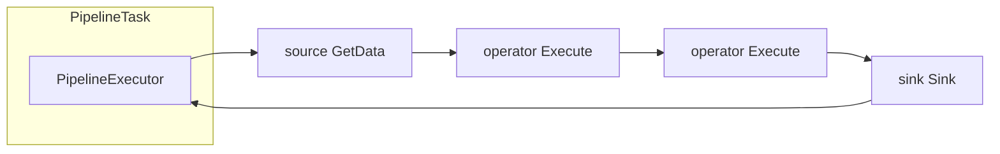

# 第15章 パイプライン実行

> **本章で読むソース**
>
> - [src/parallel/executor.cpp](https://github.com/duckdb/duckdb/blob/v1.5.4/src/parallel/executor.cpp)
> - [src/parallel/pipeline.cpp](https://github.com/duckdb/duckdb/blob/v1.5.4/src/parallel/pipeline.cpp)
> - [src/parallel/pipeline_executor.cpp](https://github.com/duckdb/duckdb/blob/v1.5.4/src/parallel/pipeline_executor.cpp)
> - [src/parallel/executor_task.cpp](https://github.com/duckdb/duckdb/blob/v1.5.4/src/parallel/executor_task.cpp)
> - [src/execution/physical_operator.cpp](https://github.com/duckdb/duckdb/blob/v1.5.4/src/execution/physical_operator.cpp)

## この章の狙い

第14章で生成した物理プランは、第16章で構築される `Pipeline` の集合として実行される。
本章では `PipelineExecutor` が `DataChunk` を operator chain へ流す本体、`PipelineTask` と `Executor::ExecuteTask` によるタスク駆動、source、operator、sink 三役の実行契約に焦点を当てる。
パイプライン木の構築や Event DAG の組み立ては第16章に委ね、ここでは「1 本のパイプラインがどう進むか」だけを追う。

## 前提

物理プラン生成は第14章、パイプライン構築とスケジューリングは第16章を前提とする。
`DataChunk` とベクトル化の基礎は第3章、第4章で扱った。

## Pipeline の中身と Ready

`Pipeline` は source、中間 operators、sink への参照を保持する。
`Ready` が呼ばれると operators ベクタが反転され、実行方向（source から sink）に並び替えられる。

[src/parallel/pipeline.cpp L244-L250](https://github.com/duckdb/duckdb/blob/v1.5.4/src/parallel/pipeline.cpp#L244-L250)

```cpp
void Pipeline::Ready() {
	if (ready) {
		return;
	}
	ready = true;
	std::reverse(operators.begin(), operators.end());
}
```

`Reset` は sink、各 operator、source の GlobalState を初期化し、`initialized` を真にする。
source の `GetGlobalSourceState` はスレッドセーフでないクライアント呼び出しがあり得るため、強制リセットは `ResetSource` の `force` 引数で制御される。

[src/parallel/pipeline.cpp L220-L242](https://github.com/duckdb/duckdb/blob/v1.5.4/src/parallel/pipeline.cpp#L220-L242)

```cpp
void Pipeline::Reset() {
	ResetSink();
	for (auto &op_ref : operators) {
		auto &op = op_ref.get();
		lock_guard<mutex> guard(op.lock);
		if (!op.op_state) {
			op.op_state = op.GetGlobalOperatorState(GetClientContext());
		}
	}
	ResetSource(false);
	// we no longer reset source here because this function is no longer guaranteed to be called by the main thread
	// source reset needs to be called by the main thread because resetting a source may call into clients like R
	initialized = true;
}

void Pipeline::ResetSource(bool force) {
	if (source && !source->IsSource()) {
		throw InternalException("Source of pipeline does not have IsSource set");
	}
	if (force || !source_state) {
		source_state = source->GetGlobalSourceState(GetClientContext());
	}
}
```

## 並列タスクの起動判断

`Pipeline::Schedule` は `ScheduleParallel` を試し、失敗したら単一 `PipelineTask` を積む。
並列化の条件は sink、source、全中間 operator がそれぞれ `ParallelSink`、`ParallelSource`、`ParallelOperator` を満たし、`MaxThreads` が 2 以上になることである。

[src/parallel/pipeline.cpp L101-L139](https://github.com/duckdb/duckdb/blob/v1.5.4/src/parallel/pipeline.cpp#L101-L139)

```cpp
bool Pipeline::ScheduleParallel(shared_ptr<Event> &event) {
	// check if the sink, source and all intermediate operators support parallelism
	if (!sink->ParallelSink()) {
		return false;
	}
	if (!source->ParallelSource()) {
		return false;
	}
	auto max_threads = source_state->MaxThreads();

	for (auto &op_ref : operators) {
		auto &op = op_ref.get();
		if (!op.ParallelOperator()) {
			return false;
		}
		max_threads = MinValue<idx_t>(max_threads, op.op_state->MaxThreads(max_threads));
	}

	auto partition_info = sink->RequiredPartitionInfo();
	if (partition_info.batch_index) {
		if (!source->SupportsPartitioning(OperatorPartitionInfo::BatchIndex())) {
			throw InternalException(
			    "Attempting to schedule a pipeline where the sink requires batch index but source does not support it");
		}
	}

	auto &scheduler = TaskScheduler::GetScheduler(executor.context);
	auto active_threads = NumericCast<idx_t>(scheduler.NumberOfThreads());
	if (max_threads > active_threads) {
		max_threads = active_threads;
	}
	if (sink && sink->sink_state) {
		max_threads = sink->sink_state->MaxThreads(max_threads);
	}
	if (max_threads > active_threads) {
		max_threads = active_threads;
	}
	return LaunchScanTasks(event, max_threads);
}
```

`LaunchScanTasks` はスレッド数ぶんの `PipelineTask` を生成し、同一 `Event` に束ねる。
各タスクは独立した `PipelineExecutor` を持ち、タスクごとの `LocalSourceState` とパイプライン共有の `GlobalSourceState`（`pipeline.source_state`）を通じて作業する。
作業単位の払い出しは source 実装に委ねられ、すべてのタスクが異なる partition を読むわけではない。
partition 情報は、sink の `RequiredPartitionInfo` が要求するときの別契約である。

[src/parallel/pipeline.cpp L179-L193](https://github.com/duckdb/duckdb/blob/v1.5.4/src/parallel/pipeline.cpp#L179-L193)

```cpp
bool Pipeline::LaunchScanTasks(shared_ptr<Event> &event, idx_t max_threads) {
	// split the scan up into parts and schedule the parts
	if (max_threads <= 1) {
		// too small to parallelize
		return false;
	}

	// launch a task for every thread
	vector<shared_ptr<Task>> tasks;
	for (idx_t i = 0; i < max_threads; i++) {
		tasks.push_back(make_uniq<PipelineTask>(*this, event));
	}
	event->SetTasks(std::move(tasks));
	return true;
}
```

## PipelineTask と ExecutorTask

`PipelineTask::ExecuteTask` は初回に `PipelineExecutor` を生成し、`PROCESS_PARTIAL` モードではチャンク予算付きで `Execute` を呼ぶ。
パイプライン完了時に `event->FinishTask` を呼び、executor を破棄する。

[src/parallel/pipeline.cpp L33-L66](https://github.com/duckdb/duckdb/blob/v1.5.4/src/parallel/pipeline.cpp#L33-L66)

```cpp
TaskExecutionResult PipelineTask::ExecuteTask(TaskExecutionMode mode) {
	if (!pipeline_executor) {
		pipeline_executor = make_uniq<PipelineExecutor>(pipeline.GetClientContext(), pipeline);
	}

	pipeline_executor->SetTaskForInterrupts(shared_from_this());

	if (mode == TaskExecutionMode::PROCESS_PARTIAL) {
		auto res = pipeline_executor->Execute(PARTIAL_CHUNK_COUNT);

		switch (res) {
		case PipelineExecuteResult::NOT_FINISHED:
			return TaskExecutionResult::TASK_NOT_FINISHED;
		case PipelineExecuteResult::INTERRUPTED:
			return TaskExecutionResult::TASK_BLOCKED;
		case PipelineExecuteResult::FINISHED:
			break;
		}
	} else {
		auto res = pipeline_executor->Execute();
		switch (res) {
		case PipelineExecuteResult::NOT_FINISHED:
			throw InternalException("Execute without limit should not return NOT_FINISHED");
		case PipelineExecuteResult::INTERRUPTED:
			return TaskExecutionResult::TASK_BLOCKED;
		case PipelineExecuteResult::FINISHED:
			break;
		}
	}

	event->FinishTask();
	pipeline_executor.reset();
	return TaskExecutionResult::TASK_FINISHED;
}
```

`ExecutorTask` はタスク登録とプロファイラ flush を担う基底クラスである。
`thread_context` がある経路では `PROCESS_PARTIAL` をループし、協調的にクエリを進める。

[src/parallel/executor_task.cpp L9-L25](https://github.com/duckdb/duckdb/blob/v1.5.4/src/parallel/executor_task.cpp#L9-L25)

```cpp
ExecutorTask::ExecutorTask(Executor &executor_p, shared_ptr<Event> event_p)
    : executor(executor_p), event(std::move(event_p)), context(executor_p.context) {
	executor.RegisterTask();
}

ExecutorTask::ExecutorTask(ClientContext &context_p, shared_ptr<Event> event_p, const PhysicalOperator &op_p)
    : executor(Executor::Get(context_p)), event(std::move(event_p)), op(&op_p), context(context_p) {
	thread_context = make_uniq<ThreadContext>(context_p);
	executor.RegisterTask();
}

ExecutorTask::~ExecutorTask() {
	if (thread_context) {
		executor.Flush(*thread_context);
	}
	executor.UnregisterTask();
}
```

`Deschedule` はタスクを `to_be_rescheduled_tasks` へ退避し、`Reschedule` でスケジューラへ戻す。
sink や source が `BLOCKED` を返したとき、この経路で実行スレッドを他タスクへ譲る。

[src/parallel/executor_task.cpp L27-L35](https://github.com/duckdb/duckdb/blob/v1.5.4/src/parallel/executor_task.cpp#L27-L35)

```cpp
void ExecutorTask::Deschedule() {
	auto this_ptr = shared_from_this();
	executor.AddToBeRescheduled(this_ptr);
}

void ExecutorTask::Reschedule() {
	auto this_ptr = shared_from_this();
	executor.RescheduleTask(this_ptr);
}
```

## PipelineExecutor の初期化

コンストラクタは sink の `LocalSinkState`、source の `LocalSourceState`、各中間 operator の `OperatorState` と `DataChunk` バッファを確保する。
partitioned sink では `RegisterNewBatchIndex` で batch index を先に取り、source と sink の契約を揃える。

[src/parallel/pipeline_executor.cpp L13-L50](https://github.com/duckdb/duckdb/blob/v1.5.4/src/parallel/pipeline_executor.cpp#L13-L50)

```cpp
PipelineExecutor::PipelineExecutor(ClientContext &context_p, Pipeline &pipeline_p)
    : pipeline(pipeline_p), thread(context_p), context(context_p, thread, &pipeline_p) {
	D_ASSERT(pipeline.source_state);
	if (pipeline.sink) {
		local_sink_state = pipeline.sink->GetLocalSinkState(context);
		required_partition_info = pipeline.sink->RequiredPartitionInfo();
		if (required_partition_info.AnyRequired()) {
			D_ASSERT(pipeline.source->SupportsPartitioning(OperatorPartitionInfo::BatchIndex()));
			auto &partition_info = local_sink_state->partition_info;
			D_ASSERT(!partition_info.batch_index.IsValid());
			// batch index is not set yet - initialize before fetching anything
			partition_info.batch_index = pipeline.RegisterNewBatchIndex();
			partition_info.min_batch_index = partition_info.batch_index;
		}
	}
	local_source_state = pipeline.source->GetLocalSourceState(context, *pipeline.source_state);

	intermediate_chunks.reserve(pipeline.operators.size());
	intermediate_states.reserve(pipeline.operators.size());
	for (idx_t i = 0; i < pipeline.operators.size(); i++) {
		auto &prev_operator = i == 0 ? *pipeline.source : pipeline.operators[i - 1].get();
		auto &current_operator = pipeline.operators[i].get();

		auto chunk = make_uniq<DataChunk>();
		chunk->Initialize(BufferAllocator::Get(context.client), prev_operator.GetTypes());
		intermediate_chunks.push_back(std::move(chunk));

		auto op_state = current_operator.GetOperatorState(context);
		intermediate_states.push_back(std::move(op_state));

		if (current_operator.IsSink() && current_operator.sink_state->state == SinkFinalizeType::NO_OUTPUT_POSSIBLE) {
			// one of the operators has already figured out no output is possible
			// we can skip executing the pipeline
			FinishProcessing();
		}
	}
	InitializeChunk(final_chunk);
}
```

## Execute ループと source から sink へ

`Execute(max_chunks)` は `ExecutionBudget` で処理量を制限しながら、source 取得、partition 更新、operator chain 実行、sink 書き込みを繰り返す。
`BLOCKED` は `INTERRUPTED` として呼び出し元へ返し、タスク再スケジュールを促す。

[src/parallel/pipeline_executor.cpp L188-L274](https://github.com/duckdb/duckdb/blob/v1.5.4/src/parallel/pipeline_executor.cpp#L188-L274)

```cpp
PipelineExecuteResult PipelineExecutor::Execute(idx_t max_chunks) {
	D_ASSERT(pipeline.sink);
	auto &source_chunk = pipeline.operators.empty() ? final_chunk : *intermediate_chunks[0];
	ExecutionBudget chunk_budget(max_chunks);
	do {
		if (context.client.interrupted) {
			throw InterruptException();
		}

		OperatorResultType result;
		if (exhausted_pipeline && done_flushing && !remaining_sink_chunk && !next_batch_blocked &&
		    in_process_operators.empty()) {
			break;
		} else if (remaining_sink_chunk) {
			// The pipeline was interrupted by the Sink. We should retry sinking the final chunk.
			result = ExecutePushInternal(final_chunk, chunk_budget);
			D_ASSERT(result != OperatorResultType::HAVE_MORE_OUTPUT);
			remaining_sink_chunk = false;
		} else if (!in_process_operators.empty() && !started_flushing) {
			// Operator(s) in the pipeline have returned `HAVE_MORE_OUTPUT` in the last Execute call
			// the operators have to be called with the same input chunk to produce the rest of the output
			D_ASSERT(source_chunk.size() > 0);
			result = ExecutePushInternal(source_chunk, chunk_budget);
		} else if (exhausted_pipeline && !next_batch_blocked && !done_flushing) {
			// The pipeline was exhausted, try flushing all operators
			auto flush_completed = TryFlushCachingOperators(chunk_budget);
			if (flush_completed) {
				done_flushing = true;
				break;
			} else {
				if (remaining_sink_chunk) {
					return PipelineExecuteResult::INTERRUPTED;
				} else {
					D_ASSERT(chunk_budget.IsDepleted());
					return PipelineExecuteResult::NOT_FINISHED;
				}
			}
		} else if (!exhausted_pipeline || next_batch_blocked) {
			SourceResultType source_result = SourceResultType::BLOCKED;
			if (!next_batch_blocked) {
				// "Regular" path: fetch a chunk from the source and push it through the pipeline
				source_chunk.Reset();
				source_result = FetchFromSource(source_chunk);
				if (source_result == SourceResultType::BLOCKED) {
					return PipelineExecuteResult::INTERRUPTED;
				}
				if (source_result == SourceResultType::FINISHED) {
					exhausted_source = true;
					exhausted_pipeline = true;
				}
			}

			if (required_partition_info.AnyRequired()) {
				auto next_batch_result = NextBatch(source_chunk, source_result == SourceResultType::HAVE_MORE_OUTPUT);
				next_batch_blocked = next_batch_result == SinkNextBatchType::BLOCKED;
				if (next_batch_blocked) {
					return PipelineExecuteResult::INTERRUPTED;
				}
			}

			if (exhausted_pipeline && source_chunk.size() == 0) {
				continue;
			}

			result = ExecutePushInternal(source_chunk, chunk_budget);
		} else {
			throw InternalException("Unexpected state reached in pipeline executor");
		}

		// SINK INTERRUPT
		if (result == OperatorResultType::BLOCKED) {
			remaining_sink_chunk = true;
			return PipelineExecuteResult::INTERRUPTED;
		}

		if (result == OperatorResultType::FINISHED) {
			D_ASSERT(in_process_operators.empty());
			exhausted_pipeline = true;
		}
	} while (chunk_budget.Next());

	if ((!exhausted_pipeline || !done_flushing) && !IsFinished()) {
		return PipelineExecuteResult::NOT_FINISHED;
	}

	return PushFinalize();
}
```

## operator chain の Execute

`ExecutePushInternal` は中間 operator を順に `Execute` し、最終 `DataChunk` を sink へ渡す。
`HAVE_MORE_OUTPUT` が返った operator は `in_process_operators` スタックに積まれ、次回同じ入力で継続される。

[src/parallel/pipeline_executor.cpp L304-L351](https://github.com/duckdb/duckdb/blob/v1.5.4/src/parallel/pipeline_executor.cpp#L304-L351)

```cpp
OperatorResultType PipelineExecutor::ExecutePushInternal(DataChunk &input, ExecutionBudget &chunk_budget,
                                                         idx_t initial_idx) {
	D_ASSERT(pipeline.sink);
	if (input.size() == 0) { // LCOV_EXCL_START
		return OperatorResultType::NEED_MORE_INPUT;
	} // LCOV_EXCL_STOP

	// this loop will continuously push the input chunk through the pipeline as long as:
	// - the OperatorResultType for the Execute is HAVE_MORE_OUTPUT
	// - the Sink doesn't block
	// - the ExecutionBudget has not been depleted
	OperatorResultType result = OperatorResultType::HAVE_MORE_OUTPUT;
	do {
		// Note: if input is the final_chunk, we don't do any executing, the chunk just needs to be sinked
		if (&input != &final_chunk) {
			final_chunk.Reset();
			// Execute and put the result into 'final_chunk'
			result = Execute(input, final_chunk, initial_idx);
			if (result == OperatorResultType::FINISHED) {
				return OperatorResultType::FINISHED;
			}
		} else {
			result = OperatorResultType::NEED_MORE_INPUT;
		}
		auto &sink_chunk = final_chunk;
		if (sink_chunk.size() > 0) {
			StartOperator(*pipeline.sink);
			D_ASSERT(pipeline.sink);
			D_ASSERT(pipeline.sink->sink_state);
			OperatorSinkInput sink_input {*pipeline.sink->sink_state, *local_sink_state, interrupt_state};

			auto sink_result = Sink(sink_chunk, sink_input);

			EndOperator(*pipeline.sink, nullptr);

			if (sink_result == SinkResultType::BLOCKED) {
				return OperatorResultType::BLOCKED;
			} else if (sink_result == SinkResultType::FINISHED) {
				FinishProcessing();
				return OperatorResultType::FINISHED;
			}
		}
		if (result == OperatorResultType::NEED_MORE_INPUT) {
			return OperatorResultType::NEED_MORE_INPUT;
		}
	} while (chunk_budget.Next());
	return result;
}
```

個々の operator 呼び出しは `PipelineExecutor::Execute(DataChunk&, DataChunk&, idx_t)` が担う。
出力が空のときは `GoToSource` で source 側へ戻り、join のように 1 入力から複数出力を生む operator は `HAVE_MORE_OUTPUT` でスタックに残る。

[src/parallel/pipeline_executor.cpp L411-L486](https://github.com/duckdb/duckdb/blob/v1.5.4/src/parallel/pipeline_executor.cpp#L411-L486)

```cpp
OperatorResultType PipelineExecutor::Execute(DataChunk &input, DataChunk &result, idx_t initial_idx) {
	if (input.size() == 0) { // LCOV_EXCL_START
		return OperatorResultType::NEED_MORE_INPUT;
	} // LCOV_EXCL_STOP
	D_ASSERT(!pipeline.operators.empty());

	idx_t current_idx;
	GoToSource(current_idx, initial_idx);
	if (current_idx == initial_idx) {
		current_idx++;
	}
	if (current_idx > pipeline.operators.size()) {
		result.Reference(input);
		return OperatorResultType::NEED_MORE_INPUT;
	}
	while (true) {
		if (context.client.interrupted) {
			throw InterruptException();
		}
		// now figure out where to put the chunk
		// if current_idx is the last possible index (>= operators.size()) we write to the result
		// otherwise we write to an intermediate chunk
		auto current_intermediate = current_idx;
		auto &current_chunk =
		    current_intermediate >= intermediate_chunks.size() ? result : *intermediate_chunks[current_intermediate];
		current_chunk.Reset();
		if (current_idx == initial_idx) {
			// we went back to the source: we need more input
			return OperatorResultType::NEED_MORE_INPUT;
		} else {
			auto &prev_chunk =
			    current_intermediate == initial_idx + 1 ? input : *intermediate_chunks[current_intermediate - 1];
			auto operator_idx = current_idx - 1;
			auto &current_operator = pipeline.operators[operator_idx].get();

			// if current_idx > source_idx, we pass the previous operators' output through the Execute of the current
			// operator
			StartOperator(current_operator);
			auto result = current_operator.Execute(context, prev_chunk, current_chunk, *current_operator.op_state,
			                                       *intermediate_states[current_intermediate - 1]);
			EndOperator(current_operator, &current_chunk);
			if (result == OperatorResultType::HAVE_MORE_OUTPUT) {
				// more data remains in this operator
				// push in-process marker
				in_process_operators.push(current_idx);
			} else if (result == OperatorResultType::FINISHED) {
				D_ASSERT(current_chunk.size() == 0);
				FinishProcessing(NumericCast<int32_t>(current_idx));
				return OperatorResultType::FINISHED;
			}
			current_chunk.Verify();
		}

		if (current_chunk.size() == 0) {
			// no output from this operator!
			if (current_idx == initial_idx) {
				// if we got no output from the scan, we are done
				break;
			} else {
				// if we got no output from an intermediate op
				// we go back and try to pull data from the source again
				GoToSource(current_idx, initial_idx);
				continue;
			}
		} else {
			// we got output! continue to the next operator
			current_idx++;
			if (current_idx > pipeline.operators.size()) {
				// if we got output and are at the last operator, we are finished executing for this output chunk
				// return the data and push it into the chunk
				break;
			}
		}
	}
	return in_process_operators.empty() ? OperatorResultType::NEED_MORE_INPUT : OperatorResultType::HAVE_MORE_OUTPUT;
}
```

## Executor がタスクを進める

`Executor::ExecuteTask` は producer からタスクを取り出し、`PROCESS_PARTIAL` で一部だけ実行する。
`TASK_BLOCKED` のときは `Deschedule` したあと task を持ち続けず、割り込み callback による `Reschedule` を待つ。
`SchedulerProcessPartialSetting` が有効なときに同じタスクを即時再投入するのは、タスクが残る `TASK_NOT_FINISHED` の経路である。

[src/parallel/executor.cpp L554-L613](https://github.com/duckdb/duckdb/blob/v1.5.4/src/parallel/executor.cpp#L554-L613)

```cpp
PendingExecutionResult Executor::ExecuteTask(bool dry_run) {
	// Only executor should return NO_TASKS_AVAILABLE
	D_ASSERT(execution_result != PendingExecutionResult::NO_TASKS_AVAILABLE);
	if (execution_result != PendingExecutionResult::RESULT_NOT_READY && ExecutionIsFinished()) {
		return execution_result;
	}
	// check if there are any incomplete pipelines
	auto &scheduler = TaskScheduler::GetScheduler(context);
	if (completed_pipelines < total_pipelines) {
		// there are! if we don't already have a task, fetch one
		auto current_task = task.get();
		if (dry_run) {
			// Pretend we have no task, we don't want to execute anything
			current_task = nullptr;
		} else {
			if (!task) {
				scheduler.GetTaskFromProducer(*producer, task);
			}
			current_task = task.get();
		}

		if (!current_task && !HasError()) {
			// there are no tasks to be scheduled and there are tasks blocked
			lock_guard<mutex> l(executor_lock);
			if (to_be_rescheduled_tasks.empty()) {
				return PendingExecutionResult::NO_TASKS_AVAILABLE;
			}
			// At least one task is blocked
			if (ResultCollectorIsBlocked()) {
				return PendingExecutionResult::RESULT_READY;
			}
			return PendingExecutionResult::BLOCKED;
		}

		if (current_task) {
			// if we have a task, partially process it
			auto result = task->Execute(TaskExecutionMode::PROCESS_PARTIAL);
			if (result == TaskExecutionResult::TASK_BLOCKED) {
				task->Deschedule();
				task.reset();
			} else if (result == TaskExecutionResult::TASK_FINISHED) {
				// if the task is finished, clean it up
				task.reset();
			} else if (result == TaskExecutionResult::TASK_ERROR) {
				if (!HasError()) {
					// This is very much unexpected, TASK_ERROR means this executor should have an Error
					throw InternalException("A task executed within Executor::ExecuteTask, from own producer, returned "
					                        "TASK_ERROR without setting error on the Executor");
				}
			}
		}
		if (!HasError()) {
			// we (partially) processed a task and no exceptions were thrown
			// give back control to the caller
			if (task && Settings::Get<SchedulerProcessPartialSetting>(context)) {
				auto &token = *task->token;
				TaskScheduler::GetScheduler(context).ScheduleTask(token, task);
				task.reset();
			}
			return PendingExecutionResult::RESULT_NOT_READY;
		}
```

ワーカスレッド側のループでも同じ区別が明示される。
`TASK_NOT_FINISHED` だけが即 `Enqueue` され、`TASK_BLOCKED` は `Deschedule` 後に解放される。

[src/parallel/task_scheduler.cpp L302-L324](https://github.com/duckdb/duckdb/blob/v1.5.4/src/parallel/task_scheduler.cpp#L302-L324)

```cpp
		if (queue->Dequeue(task)) {
			auto process_mode = TaskExecutionMode::PROCESS_ALL;
			if (Settings::Get<SchedulerProcessPartialSetting>(config)) {
				process_mode = TaskExecutionMode::PROCESS_PARTIAL;
			}
			auto execute_result = task->Execute(process_mode);

			switch (execute_result) {
			case TaskExecutionResult::TASK_FINISHED:
			case TaskExecutionResult::TASK_ERROR:
				task.reset();
				break;
			case TaskExecutionResult::TASK_NOT_FINISHED: {
				// task is not finished - reschedule immediately
				auto &token = *task->token;
				queue->Enqueue(token, std::move(task));
				break;
			}
			case TaskExecutionResult::TASK_BLOCKED:
				task->Deschedule();
				task.reset();
				break;
			}
```

パイプライン完了時の `PushFinalize` は sink の `Combine` に `LocalSinkState` だけを渡す。
`LocalSourceState` は Combine 対象ではなく、source profiling の finalize に渡される。

[src/parallel/pipeline_executor.cpp L353-L386](https://github.com/duckdb/duckdb/blob/v1.5.4/src/parallel/pipeline_executor.cpp#L353-L386)

```cpp
PipelineExecuteResult PipelineExecutor::PushFinalize() {
	if (finalized) {
		throw InternalException("Calling PushFinalize on a pipeline that has been finalized already");
	}

	D_ASSERT(local_sink_state);

	// Run the combine for the sink
	OperatorSinkCombineInput combine_input {*pipeline.sink->sink_state, *local_sink_state, interrupt_state};

#ifdef DUCKDB_DEBUG_ASYNC_SINK_SOURCE
	if (debug_blocked_combine_count < debug_blocked_target_count) {
		debug_blocked_combine_count++;

		auto &callback_state = combine_input.interrupt_state;
		std::thread rewake_thread([callback_state] {
			std::this_thread::sleep_for(std::chrono::milliseconds(1));
			callback_state.Callback();
		});
		rewake_thread.detach();

		return PipelineExecuteResult::INTERRUPTED;
	}
#endif
	auto result = pipeline.sink->Combine(context, combine_input);

	if (result == SinkCombineResultType::BLOCKED) {
		return PipelineExecuteResult::INTERRUPTED;
	}

	finalized = true;

	context.thread.profiler.FinalizeSourceProfiling(*pipeline.source_state, *local_source_state, *pipeline.source,
	                                                exhausted_source);
```

## 処理の流れ



1 タスクが 1 本のパイプラインを担当する。
source が `DataChunk` を埋め、中間 operator がベクトル演算を適用し、sink が結合 build や結果収集を行う。
並列時はタスクごとに `LocalSourceState` と `LocalSinkState` が分かれる。
`PushFinalize` が `Combine` で global へ統合するのは `LocalSinkState` だけであり、`LocalSourceState` は source の作業状態として残り、source profiling の finalize に渡される。

## 高速化と最適化の工夫

パイプライン実行のスループットは、ベクトル単位の operator chain と並列 source 分割に依存する。
`ScheduleParallel` は operator ごとの `MaxThreads` と sink の partition 要件を見て、無理な並列化を避ける。
`ExecutionBudget` と `PROCESS_PARTIAL` により 1 タスクがチャンク処理を占有せず、スケジューラが他クエリや他パイプラインへ CPU を回せる。
`CachingPhysicalOperator`（`physical_operator.cpp`）は小さな出力 chunk をバッファし `STANDARD_VECTOR_SIZE` に近づけてから下流へ渡すため、細かいフィルタ出力でもベクトル化の効率を保つ。

## まとめ

`PipelineExecutor` が source から sink まで `DataChunk` を流し、`PipelineTask` がそれをタスクとして `Event` に結び付ける。
`Executor::ExecuteTask` は部分実行と再スケジュールを繰り返し、クエリ全体を協調的に進める。
パイプラインの生成順序と依存は第16章の `MetaPipeline` と Event DAG が決める。

## 関連する章

- 第1章（アーキテクチャ全体像）
- 第14章（物理プラン生成）
- 第16章（パイプライン構築とスケジューリング）
- 第17章（式実行）
