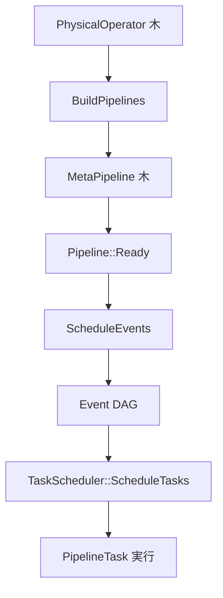

# 第16章 パイプライン構築とスケジューリング

> **本章で読むソース**
>
> - [src/execution/physical_operator.cpp](https://github.com/duckdb/duckdb/blob/v1.5.4/src/execution/physical_operator.cpp)
> - [src/execution/operator/join/physical_join.cpp](https://github.com/duckdb/duckdb/blob/v1.5.4/src/execution/operator/join/physical_join.cpp)
> - [src/parallel/meta_pipeline.cpp](https://github.com/duckdb/duckdb/blob/v1.5.4/src/parallel/meta_pipeline.cpp)
> - [src/parallel/executor.cpp](https://github.com/duckdb/duckdb/blob/v1.5.4/src/parallel/executor.cpp)
> - [src/parallel/event.cpp](https://github.com/duckdb/duckdb/blob/v1.5.4/src/parallel/event.cpp)
> - [src/parallel/task_scheduler.cpp](https://github.com/duckdb/duckdb/blob/v1.5.4/src/parallel/task_scheduler.cpp)
> - [src/parallel/pipeline.cpp](https://github.com/duckdb/duckdb/blob/v1.5.4/src/parallel/pipeline.cpp)

## この章の狙い

第15章は 1 本のパイプライン上で `DataChunk` がどう流れるかを扱った。
本章では物理木から `Pipeline` 集合を切り出す `BuildPipelines`、`MetaPipeline` による子パイプラインと依存の記録、そして `Event` DAG と `TaskScheduler` による起動順序を追う。
実行ループ本体は第15章、物理演算子の選択は第14章に分けている。

## 前提

物理プランと `PhysicalOperator` の三役は第14章、パイプライン実行は第15章を前提とする。

## BuildPipelines による分割規則

`PhysicalOperator::BuildPipelines` は再帰的に木を辿り、source、中間 operator、sink の境界でパイプラインを分ける。
子を持たないノードは source として現在のパイプラインに登録される。

[src/execution/physical_operator.cpp L214-L244](https://github.com/duckdb/duckdb/blob/v1.5.4/src/execution/physical_operator.cpp#L214-L244)

```cpp
void PhysicalOperator::BuildPipelines(Pipeline &current, MetaPipeline &meta_pipeline) {
	op_state.reset();

	auto &state = meta_pipeline.GetState();
	if (!IsSink() && children.empty()) {
		// Operator is a source.
		state.SetPipelineSource(current, *this);
		return;
	}

	if (children.size() != 1) {
		throw InternalException("Operator not supported in BuildPipelines");
	}

	if (IsSink()) {
		// Operator is a sink.
		sink_state.reset();

		// It becomes the data source of the current pipeline.
		state.SetPipelineSource(current, *this);

		// Create a new pipeline starting at the child.
		auto &child_meta_pipeline = meta_pipeline.CreateChildMetaPipeline(current, *this);
		child_meta_pipeline.Build(children[0].get());
		return;
	}

	// Recurse into the child.
	state.AddPipelineOperator(current, *this);
	children[0].get().BuildPipelines(current, meta_pipeline);
}
```

単項演算子向けの既定実装では、sink が現在パイプラインの source になり、子方向へ新しい `MetaPipeline` が生える。

結合は `PhysicalJoin::BuildPipelines` がこの既定を override する。
probe（現在）パイプラインには join を operator として載せ、RHS build 用の子 `MetaPipeline` では join を sink にする。
`PhysicalJoin::BuildJoinPipelines` は `IsSource()` が真の演算子に source 用の子パイプラインを構築する。
`PhysicalHashJoin::IsSource()` は join type や spill 状態を見ず capability として常に真を返すため、inner join の in-memory 実行でも source パイプラインは作られ、`GetDataInternal` が実行時状態に応じて出力の有無を決める。
`PhysicalPiecewiseMergeJoin` や `PhysicalNestedLoopJoin` の `IsSource()` は `PropagatesBuildSide(join_type)` であり、join 全般とハッシュ結合固有で条件が異なる。
既定実装の「sink が現在パイプラインの source になる」を、hash join の build 側の一般例として読んではいけない。

[src/execution/operator/join/physical_join.cpp L31-L86](https://github.com/duckdb/duckdb/blob/v1.5.4/src/execution/operator/join/physical_join.cpp#L31-L86)

```cpp
void PhysicalJoin::BuildJoinPipelines(Pipeline &current, MetaPipeline &meta_pipeline, PhysicalOperator &op,
                                      bool build_rhs) {
	op.op_state.reset();
	op.sink_state.reset();

	// 'current' is the probe pipeline: add this operator
	auto &state = meta_pipeline.GetState();
	state.AddPipelineOperator(current, op);

	// save the last added pipeline to set up dependencies later (in case we need to add a child pipeline)
	vector<shared_ptr<Pipeline>> pipelines_so_far;
	meta_pipeline.GetPipelines(pipelines_so_far, false);
	auto &last_pipeline = *pipelines_so_far.back();

	vector<shared_ptr<Pipeline>> dependencies;
	optional_ptr<MetaPipeline> last_child_ptr;
	if (build_rhs) {
		// on the RHS (build side), we construct a child MetaPipeline with this operator as its sink
		auto &child_meta_pipeline = meta_pipeline.CreateChildMetaPipeline(current, op, MetaPipelineType::JOIN_BUILD);
		child_meta_pipeline.Build(op.children[1]);
		if (op.children[1].get().CanSaturateThreads(current.GetClientContext())) {
			// if the build side can saturate all available threads,
			// we don't just make the LHS pipeline depend on the RHS, but recursively all LHS children too.
			// this prevents breadth-first plan evaluation
			child_meta_pipeline.GetPipelines(dependencies, false);
			last_child_ptr = meta_pipeline.GetLastChild();
		}
	}

	// continue building the current pipeline on the LHS (probe side)
	op.children[0].get().BuildPipelines(current, meta_pipeline);

	if (last_child_ptr) {
		// the pointer was set, set up the dependencies
		meta_pipeline.AddRecursiveDependencies(dependencies, *last_child_ptr);
	}

	switch (op.type) {
	case PhysicalOperatorType::POSITIONAL_JOIN:
		// Positional joins are always outer
		meta_pipeline.CreateChildPipeline(current, op, last_pipeline);
		return;
	case PhysicalOperatorType::CROSS_PRODUCT:
		return;
	default:
		break;
	}

	// Join can become a source operator if it's RIGHT/OUTER, or if the hash join goes out-of-core
	if (op.Cast<PhysicalJoin>().IsSource()) {
		meta_pipeline.CreateChildPipeline(current, op, last_pipeline);
	}
}

void PhysicalJoin::BuildPipelines(Pipeline &current, MetaPipeline &meta_pipeline) {
	PhysicalJoin::BuildJoinPipelines(current, meta_pipeline, *this);
}
```

## MetaPipeline の構築

`MetaPipeline::Build` はルート `Pipeline` を 1 本だけ持つ状態から `op.BuildPipelines` を呼ぶ。
`CreateChildMetaPipeline` は子 `MetaPipeline` を生成し、親パイプラインが子のベースパイプライン完了を待つ依存を `AddDependency` で登録する。

[src/parallel/meta_pipeline.cpp L85-L116](https://github.com/duckdb/duckdb/blob/v1.5.4/src/parallel/meta_pipeline.cpp#L85-L116)

```cpp
void MetaPipeline::Build(PhysicalOperator &op) {
	D_ASSERT(pipelines.size() == 1);
	D_ASSERT(children.empty());
	op.BuildPipelines(*pipelines.back(), *this);
}

void MetaPipeline::Ready() const {
	for (auto &pipeline : pipelines) {
		pipeline->Ready();
	}
	for (auto &child : children) {
		child->Ready();
	}
}

MetaPipeline &MetaPipeline::CreateChildMetaPipeline(Pipeline &current, PhysicalOperator &op, MetaPipelineType type) {
	children.push_back(make_shared_ptr<MetaPipeline>(executor, state, &op, type));
	auto &child_meta_pipeline = *children.back().get();
	// store the parent
	child_meta_pipeline.parent = &current;
	// child MetaPipeline must finish completely before this MetaPipeline can start
	current.AddDependency(child_meta_pipeline.GetBasePipeline());
	// child meta pipeline is part of the recursive CTE too
	child_meta_pipeline.recursive_cte = recursive_cte;
	return child_meta_pipeline;
}

Pipeline &MetaPipeline::CreatePipeline() {
	pipelines.emplace_back(make_shared_ptr<Pipeline>(executor));
	state.SetPipelineSink(*pipelines.back(), sink, next_batch_index++);
	return *pipelines.back();
}
```

`CreateUnionPipeline` は UNION の分岐用に演算子列を複製し、順序保持が必要なときは明示依存を追加する。
`AddRecursiveDependencies` はスレッド数見積りが大きいパイプライン同士にだけ追加依存を張り、小規模クエリのオーバーヘッドを抑える。

[src/parallel/meta_pipeline.cpp L157-L192](https://github.com/duckdb/duckdb/blob/v1.5.4/src/parallel/meta_pipeline.cpp#L157-L192)

```cpp
void MetaPipeline::AddRecursiveDependencies(const vector<shared_ptr<Pipeline>> &new_dependencies,
                                            const MetaPipeline &last_child) {
	if (recursive_cte) {
		return; // let's not burn our fingers on this for now
	}

	vector<shared_ptr<MetaPipeline>> child_meta_pipelines;
	this->GetMetaPipelines(child_meta_pipelines, true, false);

	// find the meta pipeline that has the same sink as 'pipeline'
	auto it = child_meta_pipelines.begin();
	for (; !RefersToSameObject(last_child, **it); it++) {
	}
	D_ASSERT(it != child_meta_pipelines.end());

	// skip over it
	it++;

	// we try to limit the performance impact of these dependencies on smaller workloads,
	// by only adding the dependencies if the source operator can likely keep all threads busy
	const auto thread_count = NumericCast<idx_t>(TaskScheduler::GetScheduler(executor.context).NumberOfThreads());
	for (; it != child_meta_pipelines.end(); it++) {
		for (auto &pipeline : it->get()->pipelines) {
			if (!PipelineExceedsThreadCount(*pipeline, thread_count)) {
				continue;
			}
			auto &pipeline_deps = pipeline_dependencies[*pipeline];
			for (auto &new_dependency : new_dependencies) {
				if (!PipelineExceedsThreadCount(*new_dependency, thread_count)) {
					continue;
				}
				pipeline_deps.push_back(*new_dependency);
			}
		}
	}
}
```

## Executor::InitializeInternal

`Executor::Initialize` は物理プランを受け取ると、`MetaPipeline` を生成して `Build` と `Ready` を呼び、スケジュール対象の meta pipeline 一覧を集める。
続けて `ScheduleEvents` で Event DAG を組み立てる。

[src/parallel/executor.cpp L388-L427](https://github.com/duckdb/duckdb/blob/v1.5.4/src/parallel/executor.cpp#L388-L427)

```cpp
void Executor::InitializeInternal(PhysicalOperator &plan) {
	auto &scheduler = TaskScheduler::GetScheduler(context);
	{
		lock_guard<mutex> elock(executor_lock);
		physical_plan = &plan;

		this->profiler = ClientData::Get(context).profiler;
		profiler->Initialize(plan);
		this->producer = scheduler.CreateProducer();

		// build and ready the pipelines
		PipelineBuildState state;
		auto root_pipeline = make_shared_ptr<MetaPipeline>(*this, state, nullptr);
		root_pipeline->Build(*physical_plan);
		root_pipeline->Ready();

		// ready recursive cte pipelines too
		for (auto &rec_cte_ref : recursive_ctes) {
			auto &rec_cte = rec_cte_ref.get().Cast<PhysicalRecursiveCTE>();
			rec_cte.recursive_meta_pipeline->Ready();
		}

		// set root pipelines, i.e., all pipelines that end in the final sink
		root_pipeline->GetPipelines(root_pipelines, false);
		root_pipeline_idx = 0;

		// collect all meta-pipelines from the root pipeline
		vector<shared_ptr<MetaPipeline>> to_schedule;
		root_pipeline->GetMetaPipelines(to_schedule, true, true);

		// number of 'PipelineCompleteEvent's is equal to the number of meta pipelines, so we have to set it here
		total_pipelines = to_schedule.size();

		// collect all pipelines from the root pipelines (recursively) for the progress bar and verify them
		root_pipeline->GetPipelines(pipelines, true);

		// finally, verify and schedule
		VerifyPipelines();
		ScheduleEvents(to_schedule);
	}
}
```

`PipelineBuildState::SetPipelineSink` は sink を共有する複数パイプラインに `base_batch_index` を割り当て、partitioned sink が batch を識別できるようにする。

[src/parallel/pipeline.cpp L340-L345](https://github.com/duckdb/duckdb/blob/v1.5.4/src/parallel/pipeline.cpp#L340-L345)

```cpp
void PipelineBuildState::SetPipelineSink(Pipeline &pipeline, optional_ptr<PhysicalOperator> op,
                                         idx_t sink_pipeline_count) {
	pipeline.sink = op;
	// set the base batch index of this pipeline based on how many other pipelines have this node as their sink
	pipeline.base_batch_index = BATCH_INCREMENT * sink_pipeline_count;
}
```

## Event DAG の組み立て

`SchedulePipeline` は各 `Pipeline` に対し initialize、execute、prepare finish、finish、complete の 5 段 Event を生成する。
ベースパイプラインの finish 完了後に子パイプラインの execute が走るよう、依存を鎖状に結ぶ。

[src/parallel/executor.cpp L75-L100](https://github.com/duckdb/duckdb/blob/v1.5.4/src/parallel/executor.cpp#L75-L100)

```cpp
void Executor::SchedulePipeline(const shared_ptr<MetaPipeline> &meta_pipeline, ScheduleEventData &event_data) {
	D_ASSERT(meta_pipeline);
	auto &events = event_data.events;
	auto &event_map = event_data.event_map;

	// create events/stack for the base pipeline
	auto base_pipeline = meta_pipeline->GetBasePipeline();
	auto base_initialize_event = make_shared_ptr<PipelineInitializeEvent>(base_pipeline);
	auto base_event = make_shared_ptr<PipelineEvent>(base_pipeline);
	auto base_prepare_finish_event = make_shared_ptr<PipelinePrepareFinishEvent>(base_pipeline);
	auto base_finish_event = make_shared_ptr<PipelineFinishEvent>(base_pipeline);
	auto base_complete_event =
	    make_shared_ptr<PipelineCompleteEvent>(base_pipeline->executor, event_data.initial_schedule);
	PipelineEventStack base_stack(*base_initialize_event, *base_event, *base_prepare_finish_event, *base_finish_event,
	                              *base_complete_event);
	events.push_back(std::move(base_initialize_event));
	events.push_back(std::move(base_event));
	events.push_back(std::move(base_prepare_finish_event));
	events.push_back(std::move(base_finish_event));
	events.push_back(std::move(base_complete_event));

	// dependencies: initialize -> event -> prepare finish -> finish -> complete
	base_stack.pipeline_event.AddDependency(base_stack.pipeline_initialize_event);
	base_stack.pipeline_prepare_finish_event.AddDependency(base_stack.pipeline_event);
	base_stack.pipeline_finish_event.AddDependency(base_stack.pipeline_prepare_finish_event);
	base_stack.pipeline_complete_event.AddDependency(base_stack.pipeline_finish_event);
```

`ScheduleEventsInternal` はパイプライン間の `dependencies` と `MetaPipeline::GetDependencies` を Event へ写し、JOIN_BUILD 子同士には Combine と Finalize の順序を強制する。
最後に依存のない Event から `Schedule` を呼ぶ。

[src/parallel/executor.cpp L205-L267](https://github.com/duckdb/duckdb/blob/v1.5.4/src/parallel/executor.cpp#L205-L267)

```cpp
	// set the dependencies for pipeline event
	for (auto &meta_pipeline : event_data.meta_pipelines) {
		for (auto &entry : meta_pipeline->GetDependencies()) {
			auto &pipeline = entry.first.get();
			auto root_entry = event_map.find(pipeline);
			D_ASSERT(root_entry != event_map.end());
			auto &pipeline_stack = root_entry->second;
			for (auto &dependency : entry.second) {
				auto event_entry = event_map.find(dependency);
				D_ASSERT(event_entry != event_map.end());
				auto &dependency_stack = event_entry->second;
				pipeline_stack.pipeline_event.AddDependency(dependency_stack.pipeline_event);
			}
		}
	}

	// these dependencies make it so that things happen in this order:
	// 1. all join build child pipelines run until Combine
	// 2. all join build child pipeline PrepareFinalize
	// 3. all join build child pipelines Finalize
	// operators communicate their memory usage through the TemporaryMemoryManger (TMM) in PrepareFinalize
	// then, when the child pipelines Finalize, all required memory is known, and TMM can make an informed decision
	for (auto &meta_pipeline : event_data.meta_pipelines) {
		vector<shared_ptr<MetaPipeline>> children;
		meta_pipeline->GetMetaPipelines(children, false, true);
		for (auto &child1 : children) {
			if (child1->Type() != MetaPipelineType::JOIN_BUILD) {
				continue; // We only want to do this for join builds
			}
			auto &child1_base = *child1->GetBasePipeline();
			auto child1_entry = event_map.find(child1_base);
			D_ASSERT(child1_entry != event_map.end());

			for (auto &child2 : children) {
				if (child2->Type() != MetaPipelineType::JOIN_BUILD || RefersToSameObject(*child1, *child2)) {
					continue; // We don't want to depend on itself
				}
				if (!RefersToSameObject(*child1->GetParent(), *child2->GetParent())) {
					continue; // Different parents, skip
				}

				auto &child2_base = *child2->GetBasePipeline();
				auto child2_entry = event_map.find(child2_base);
				D_ASSERT(child2_entry != event_map.end());

				// all children PrepareFinalize must wait until all Combine
				child1_entry->second.pipeline_prepare_finish_event.AddDependency(child2_entry->second.pipeline_event);
				// all children Finalize must wait until all PrepareFinalize
				child1_entry->second.pipeline_finish_event.AddDependency(
				    child2_entry->second.pipeline_prepare_finish_event);
			}
		}
	}

	// verify that we have no cyclic dependencies
	VerifyScheduledEvents(event_data);

	// schedule the pipelines that do not have dependencies
	for (auto &event : events) {
		if (!event->HasDependencies()) {
			event->Schedule();
		}
	}
```

## Event の依存完了とタスク投入

`Event::AddDependency` は親子関係を `parents` 弱参照で保持し、依存側の `total_dependencies` を増やす。
すべての依存が `CompleteDependency` で揃うと `Schedule` が呼ばれ、タスクが空なら即 `Finish` する。

[src/parallel/event.cpp L14-L48](https://github.com/duckdb/duckdb/blob/v1.5.4/src/parallel/event.cpp#L14-L48)

```cpp
void Event::CompleteDependency() {
	idx_t current_finished = ++finished_dependencies;
	D_ASSERT(current_finished <= total_dependencies);
	if (current_finished == total_dependencies) {
		// all dependencies have been completed: schedule the event
		D_ASSERT(total_tasks == 0);
		Schedule();
		if (total_tasks == 0) {
			Finish();
		}
	}
}

void Event::Finish() {
	D_ASSERT(!finished);
	FinishEvent();
	finished = true;
	// finished processing the pipeline, now we can schedule pipelines that depend on this pipeline
	for (auto &parent_entry : parents) {
		auto parent = parent_entry.lock();
		if (!parent) { // LCOV_EXCL_START
			continue;
		} // LCOV_EXCL_STOP
		// mark a dependency as completed for each of the parents
		parent->CompleteDependency();
	}
	FinalizeFinish();
}

void Event::AddDependency(Event &event) {
	total_dependencies++;
	event.parents.push_back(weak_ptr<Event>(shared_from_this()));
#ifdef DEBUG
	event.parents_raw.push_back(*this);
#endif
}
```

`PipelineEvent` の `Schedule` は内部で `Pipeline::Schedule` を呼び、`SetTasks` が `TaskScheduler::ScheduleTasks` へバルク投入する。

[src/parallel/event.cpp L79-L85](https://github.com/duckdb/duckdb/blob/v1.5.4/src/parallel/event.cpp#L79-L85)

```cpp
void Event::SetTasks(vector<shared_ptr<Task>> tasks) {
	auto &ts = TaskScheduler::GetScheduler(executor.context);
	D_ASSERT(total_tasks == 0);
	D_ASSERT(!tasks.empty());
	this->total_tasks = tasks.size();
	ts.ScheduleTasks(executor.GetToken(), tasks);
}
```

## TaskScheduler

`ScheduleTasks` は producer トークン付き concurrent queue へタスクを一括 enqueue し、セマフォでワーカーを起こす。
`ExecuteForever` はワーカースレッドのメインループで、待機中にアロケータ flush を挟む。

[src/parallel/task_scheduler.cpp L74-L83](https://github.com/duckdb/duckdb/blob/v1.5.4/src/parallel/task_scheduler.cpp#L74-L83)

```cpp
void ConcurrentQueue::Enqueue(ProducerToken &token, shared_ptr<Task> task) {
	lock_guard<mutex> producer_lock(token.producer_lock);
	task->token = token;
	if (q.enqueue(token.token->queue_token, std::move(task))) {
		++tasks_in_queue;
		semaphore.signal();
	} else {
		throw InternalException("Could not schedule task!");
	}
}
```

[src/parallel/task_scheduler.cpp L263-L269](https://github.com/duckdb/duckdb/blob/v1.5.4/src/parallel/task_scheduler.cpp#L263-L269)

```cpp
void TaskScheduler::ScheduleTasks(ProducerToken &producer, vector<shared_ptr<Task>> &tasks) {
	queue->EnqueueBulk(producer, tasks);
}

bool TaskScheduler::GetTaskFromProducer(ProducerToken &token, shared_ptr<Task> &task) {
	return queue->DequeueFromProducer(token, task);
}
```

[src/parallel/task_scheduler.cpp L271-L284](https://github.com/duckdb/duckdb/blob/v1.5.4/src/parallel/task_scheduler.cpp#L271-L284)

```cpp
void TaskScheduler::ExecuteForever(atomic<bool> *marker) {
#ifndef DUCKDB_NO_THREADS
	static constexpr const int64_t INITIAL_FLUSH_WAIT = 500000; // initial wait time of 0.5s (in mus) before flushing

	const auto &block_allocator = BlockAllocator::Get(db);
	const auto &config = DBConfig::GetConfig(db);

	shared_ptr<Task> task;
	// loop until the marker is set to false
	while (*marker) {
		if (!block_allocator.SupportsFlush()) {
			// allocator can't flush, just start an untimed wait
			queue->semaphore.wait();
		} else if (!queue->semaphore.wait(INITIAL_FLUSH_WAIT)) {
			// allocator can flush, we flush this threads outstanding allocations after it was idle for 0.5s
			block_allocator.ThreadFlush(allocator_background_threads, allocator_flush_threshold,
```

## 処理の流れ



物理木の sink 境界でパイプラインが分岐し、`MetaPipeline` が子木ごとの依存を保持する。
`Executor` が Event へ写像したあと、依存のない Event からタスクがワーカーへ配られる。

## 高速化と最適化の工夫

スケジューリング段階の最適化は、不要な同期とメモリピークの抑制に向けられる。
`AddRecursiveDependencies` は双方の source が `EstimatedThreadCount` でスレッド数を上回る場合にだけ、breadth-first 評価を防ぐ追加依存を張る。
小規模時はその追加依存を省略して性能影響を避けるのであり、直列化を保つための仕組みではない。
JOIN_BUILD 向けの Event 鎖は、全 build 側が Combine まで終わってから `PrepareFinalize` で一時メモリ使用量を集約し、Finalize で `TemporaryMemoryManager` が全体のメモリ配分を決められるようにする。
`TaskScheduler` の moodycamel concurrent queue と producer トークンは、クエリごとのタスク投入をロック競合少なく行う。

## まとめ

`BuildPipelines` と `MetaPipeline` が物理木をパイプライン集合へ分割し、パイプライン間依存を記録する。
`Executor::ScheduleEvents` が 5 段 Event の DAG を組み、`Event::CompleteDependency` が正しい順序でタスクを起動する。
`TaskScheduler` がワーカーへタスクを配り、第15章の `PipelineExecutor` が実際の chunk 処理を行う。

## 関連する章

- 第1章（アーキテクチャ全体像）
- 第14章（物理プラン生成）
- 第15章（パイプライン実行）
- 第20章（ハッシュ結合）
