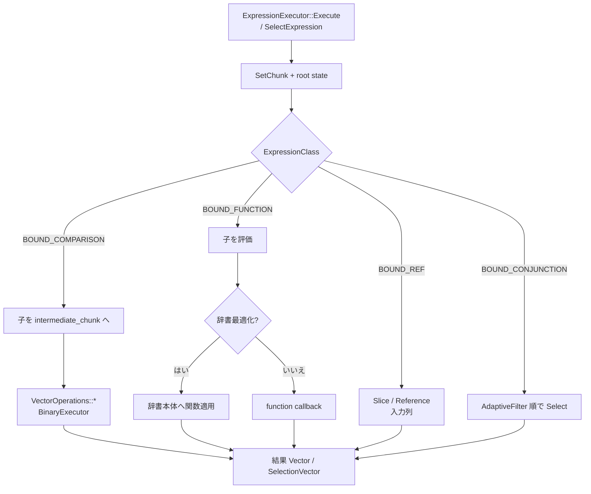

# 第17章 式実行

> **本章で読むソース**
>
> - [src/execution/expression_executor.cpp](https://github.com/duckdb/duckdb/blob/v1.5.4/src/execution/expression_executor.cpp)
> - [src/execution/expression_executor/execute_reference.cpp](https://github.com/duckdb/duckdb/blob/v1.5.4/src/execution/expression_executor/execute_reference.cpp)
> - [src/execution/expression_executor/execute_comparison.cpp](https://github.com/duckdb/duckdb/blob/v1.5.4/src/execution/expression_executor/execute_comparison.cpp)
> - [src/execution/expression_executor/execute_function.cpp](https://github.com/duckdb/duckdb/blob/v1.5.4/src/execution/expression_executor/execute_function.cpp)
> - [src/execution/expression_executor/execute_conjunction.cpp](https://github.com/duckdb/duckdb/blob/v1.5.4/src/execution/expression_executor/execute_conjunction.cpp)
> - [src/common/vector_operations/comparison_operators.cpp](https://github.com/duckdb/duckdb/blob/v1.5.4/src/common/vector_operations/comparison_operators.cpp)
> - [src/include/duckdb/common/vector_operations/binary_executor.hpp](https://github.com/duckdb/duckdb/blob/v1.5.4/src/include/duckdb/common/vector_operations/binary_executor.hpp)

## この章の狙い

パイプライン上の演算子は、投影列やフィルタ述語を評価するとき `ExpressionExecutor` に式木を渡す。
本章では式の状態初期化、`DataChunk` 入力に対するベクトル単位の `Execute` / `Select`、比較や関数呼び出しから `VectorOperations` / `BinaryExecutor` への接続を追う。

## 前提

`Bound*Expression` は第8章、`DataChunk` と `Vector` は第3章、第4章、パイプラインでの式評価の文脈は第15章を前提とする。
オプティマイザによる式簡約（第13章）のあとの実行側である。

## ExpressionExecutor の入口

`ExpressionExecutor` はコンストラクタまたは `AddExpression` で式を登録し、式ごとに `ExpressionExecutorState` を持つ。
`Execute(DataChunk *, DataChunk &)` は入力チャンクを `SetChunk` し、列ごとに `ExecuteExpression` を呼んで結果チャンクの基数を入力に合わせる。

[src/execution/expression_executor.cpp L61-L89](https://github.com/duckdb/duckdb/blob/v1.5.4/src/execution/expression_executor.cpp#L61-L89)

```cpp
void ExpressionExecutor::AddExpression(const Expression &expr) {
	expressions.push_back(&expr);
	auto state = make_uniq<ExpressionExecutorState>();
	Initialize(expr, *state);
	state->Verify();
	states.push_back(std::move(state));
}

void ExpressionExecutor::ClearExpressions() {
	states.clear();
	expressions.clear();
}

void ExpressionExecutor::Initialize(const Expression &expression, ExpressionExecutorState &state) {
	state.executor = this;
	state.root_state = InitializeState(expression, state);
}

void ExpressionExecutor::Execute(DataChunk *input, DataChunk &result) {
	SetChunk(input);
	D_ASSERT(expressions.size() == result.ColumnCount());
	D_ASSERT(!expressions.empty());

	for (idx_t i = 0; i < expressions.size(); i++) {
		ExecuteExpression(i, result.data[i]);
	}
	result.SetCardinality(input ? input->size() : 1);
	result.Verify();
}
```

`InitializeState` と実行本体の `Execute` はいずれも `ExpressionClass` で振り分ける。
状態は子式を再帰的に持つ木になり、実行時も同じ分岐で各専用 `Execute` へ降りる。

[src/execution/expression_executor.cpp L199-L284](https://github.com/duckdb/duckdb/blob/v1.5.4/src/execution/expression_executor.cpp#L199-L284)

```cpp
unique_ptr<ExpressionState> ExpressionExecutor::InitializeState(const Expression &expr,
                                                                ExpressionExecutorState &state) {
	switch (expr.GetExpressionClass()) {
	case ExpressionClass::BOUND_REF:
		return InitializeState(expr.Cast<BoundReferenceExpression>(), state);
	case ExpressionClass::BOUND_BETWEEN:
		return InitializeState(expr.Cast<BoundBetweenExpression>(), state);
	case ExpressionClass::BOUND_CASE:
		return InitializeState(expr.Cast<BoundCaseExpression>(), state);
	case ExpressionClass::BOUND_CAST:
		return InitializeState(expr.Cast<BoundCastExpression>(), state);
	case ExpressionClass::BOUND_COMPARISON:
		return InitializeState(expr.Cast<BoundComparisonExpression>(), state);
	case ExpressionClass::BOUND_CONJUNCTION:
		return InitializeState(expr.Cast<BoundConjunctionExpression>(), state);
	case ExpressionClass::BOUND_CONSTANT:
		return InitializeState(expr.Cast<BoundConstantExpression>(), state);
	case ExpressionClass::BOUND_FUNCTION:
		return InitializeState(expr.Cast<BoundFunctionExpression>(), state);
	case ExpressionClass::BOUND_OPERATOR:
		return InitializeState(expr.Cast<BoundOperatorExpression>(), state);
	case ExpressionClass::BOUND_PARAMETER:
		return InitializeState(expr.Cast<BoundParameterExpression>(), state);
	default:
		throw InternalException("Attempting to initialize state of expression of unknown type!");
	}
}

void ExpressionExecutor::Execute(const Expression &expr, ExpressionState *state, const SelectionVector *sel,
                                 idx_t count, Vector &result) {
	// ... (中略) ...

	if (count == 0) {
		return;
	}
	if (result.GetType().id() != expr.return_type.id()) {
		throw InternalException(
		    "ExpressionExecutor::Execute called with a result vector of type %s that does not match expression type %s",
		    result.GetType(), expr.return_type);
	}
	switch (expr.GetExpressionClass()) {
	case ExpressionClass::BOUND_BETWEEN:
		Execute(expr.Cast<BoundBetweenExpression>(), state, sel, count, result);
		break;
	case ExpressionClass::BOUND_REF:
		Execute(expr.Cast<BoundReferenceExpression>(), state, sel, count, result);
		break;
	// ... (中略) ...
	case ExpressionClass::BOUND_FUNCTION:
		Execute(expr.Cast<BoundFunctionExpression>(), state, sel, count, result);
		break;
	case ExpressionClass::BOUND_OPERATOR:
		Execute(expr.Cast<BoundOperatorExpression>(), state, sel, count, result);
		break;
	case ExpressionClass::BOUND_PARAMETER:
		Execute(expr.Cast<BoundParameterExpression>(), state, sel, count, result);
		break;
	default:
		throw InternalException("Attempting to execute expression of unknown type!");
	}
	Verify(expr, result, count);
}
```

フィルタ側は `SelectExpression` → `Select` で真偽行の `SelectionVector` を埋める。
比較や接続詞は専用 `Select` を持ち、それ以外はいったん boolean ベクトルを `Execute` してから `DefaultSelect` で選別する。

## 列参照と子式の評価

`BoundReferenceExpression` は入力チャンク上の列インデックスを指すだけである。
選択ベクトルがあれば `Slice`、なければ `Reference` で出力へ載せ、値の複製を避ける。

[src/execution/expression_executor/execute_reference.cpp L13-L23](https://github.com/duckdb/duckdb/blob/v1.5.4/src/execution/expression_executor/execute_reference.cpp#L13-L23)

```cpp
void ExpressionExecutor::Execute(const BoundReferenceExpression &expr, ExpressionState *state,
                                 const SelectionVector *sel, idx_t count, Vector &result) {
	D_ASSERT(expr.index != DConstants::INVALID_INDEX);
	D_ASSERT(expr.index < chunk->ColumnCount());

	if (sel) {
		result.Slice(chunk->data[expr.index], *sel, count);
	} else {
		result.Reference(chunk->data[expr.index]);
	}
}
```

比較は左右の子を `intermediate_chunk` へ再帰評価してから、演算子種別ごとに `VectorOperations` を呼ぶ。
ここが式木からベクトル演算への境界である。

[src/execution/expression_executor/execute_comparison.cpp L12-L60](https://github.com/duckdb/duckdb/blob/v1.5.4/src/execution/expression_executor/execute_comparison.cpp#L12-L60)

```cpp
unique_ptr<ExpressionState> ExpressionExecutor::InitializeState(const BoundComparisonExpression &expr,
                                                                ExpressionExecutorState &root) {
	auto result = make_uniq<ExpressionState>(expr, root);
	result->AddChild(*expr.left);
	result->AddChild(*expr.right);

	result->Finalize();
	return result;
}

void ExpressionExecutor::Execute(const BoundComparisonExpression &expr, ExpressionState *state,
                                 const SelectionVector *sel, idx_t count, Vector &result) {
	// resolve the children
	state->intermediate_chunk.Reset();
	auto &left = state->intermediate_chunk.data[0];
	auto &right = state->intermediate_chunk.data[1];

	Execute(*expr.left, state->child_states[0].get(), sel, count, left);
	Execute(*expr.right, state->child_states[1].get(), sel, count, right);

	switch (expr.GetExpressionType()) {
	case ExpressionType::COMPARE_EQUAL:
		VectorOperations::Equals(left, right, result, count);
		break;
	case ExpressionType::COMPARE_NOTEQUAL:
		VectorOperations::NotEquals(left, right, result, count);
		break;
	case ExpressionType::COMPARE_LESSTHAN:
		VectorOperations::LessThan(left, right, result, count);
		break;
	case ExpressionType::COMPARE_GREATERTHAN:
		VectorOperations::GreaterThan(left, right, result, count);
		break;
	case ExpressionType::COMPARE_LESSTHANOREQUALTO:
		VectorOperations::LessThanEquals(left, right, result, count);
		break;
	case ExpressionType::COMPARE_GREATERTHANOREQUALTO:
		VectorOperations::GreaterThanEquals(left, right, result, count);
		break;
	case ExpressionType::COMPARE_DISTINCT_FROM:
		VectorOperations::DistinctFrom(left, right, result, count);
		break;
	case ExpressionType::COMPARE_NOT_DISTINCT_FROM:
		VectorOperations::NotDistinctFrom(left, right, result, count);
		break;
	default:
		throw InternalException("Unknown comparison type!");
	}
}
```

## VectorOperations と BinaryExecutor

`VectorOperations::Equals` などは `ComparisonExecutor` に委譲し、物理型ごとに `BinaryExecutor::Execute` を呼ぶ。
ネスト型は `NestedComparisonExecutor` へ回る。

[src/common/vector_operations/comparison_operators.cpp L216-L287](https://github.com/duckdb/duckdb/blob/v1.5.4/src/common/vector_operations/comparison_operators.cpp#L216-L287)

```cpp
struct ComparisonExecutor {
private:
	template <class T, class OP>
	static inline void TemplatedExecute(Vector &left, Vector &right, Vector &result, idx_t count) {
		BinaryExecutor::Execute<T, T, bool, OP>(left, right, result, count);
	}

public:
	template <class OP>
	static inline void Execute(Vector &left, Vector &right, Vector &result, idx_t count) {
		D_ASSERT(left.GetType().InternalType() == right.GetType().InternalType() &&
		         result.GetType() == LogicalType::BOOLEAN);
		// the inplace loops take the result as the last parameter
		switch (left.GetType().InternalType()) {
		case PhysicalType::BOOL:
		case PhysicalType::INT8:
			TemplatedExecute<int8_t, OP>(left, right, result, count);
			break;
		case PhysicalType::INT16:
			TemplatedExecute<int16_t, OP>(left, right, result, count);
			break;
		case PhysicalType::INT32:
			TemplatedExecute<int32_t, OP>(left, right, result, count);
			break;
		case PhysicalType::INT64:
			TemplatedExecute<int64_t, OP>(left, right, result, count);
			break;
		// ... (中略) ...
		case PhysicalType::VARCHAR:
			TemplatedExecute<string_t, OP>(left, right, result, count);
			break;
		case PhysicalType::LIST:
		case PhysicalType::STRUCT:
		case PhysicalType::ARRAY:
			NestedComparisonExecutor<OP>(left, right, result, count);
			break;
		default:
			throw InternalException("Invalid type for comparison");
		}
	}
};
} // namespace

void VectorOperations::Equals(Vector &left, Vector &right, Vector &result, idx_t count) {
	ComparisonExecutor::Execute<duckdb::Equals>(left, right, result, count);
}
```

`BinaryExecutor` はヘッダ内テンプレートで flat / constant の組み合わせを展開する。
flat 同士のループは生ポインタと `ValidityMask` を直接歩き、行ごとの仮想呼び出しを避ける。

[src/include/duckdb/common/vector_operations/binary_executor.hpp L72-L123](https://github.com/duckdb/duckdb/blob/v1.5.4/src/include/duckdb/common/vector_operations/binary_executor.hpp#L72-L123)

```cpp
	template <class LEFT_TYPE, class RIGHT_TYPE, class RESULT_TYPE, class OPWRAPPER, class OP, class FUNC,
	          bool LEFT_CONSTANT, bool RIGHT_CONSTANT>
	static void ExecuteFlatLoop(const LEFT_TYPE *__restrict ldata, const RIGHT_TYPE *__restrict rdata,
	                            RESULT_TYPE *__restrict result_data, idx_t count, ValidityMask &mask, FUNC fun) {
		if (!LEFT_CONSTANT) {
			ASSERT_RESTRICT(ldata, ldata + count, result_data, result_data + count);
		}
		if (!RIGHT_CONSTANT) {
			ASSERT_RESTRICT(rdata, rdata + count, result_data, result_data + count);
		}

		if (!mask.AllValid()) {
			idx_t base_idx = 0;
			auto entry_count = ValidityMask::EntryCount(count);
			for (idx_t entry_idx = 0; entry_idx < entry_count; entry_idx++) {
				auto validity_entry = mask.GetValidityEntry(entry_idx);
				idx_t next = MinValue<idx_t>(base_idx + ValidityMask::BITS_PER_VALUE, count);
				if (ValidityMask::AllValid(validity_entry)) {
					// all valid: perform operation
					for (; base_idx < next; base_idx++) {
						auto lentry = ldata[LEFT_CONSTANT ? 0 : base_idx];
						auto rentry = rdata[RIGHT_CONSTANT ? 0 : base_idx];
						result_data[base_idx] =
						    OPWRAPPER::template Operation<FUNC, OP, LEFT_TYPE, RIGHT_TYPE, RESULT_TYPE>(
						        fun, lentry, rentry, mask, base_idx);
					}
				} else if (ValidityMask::NoneValid(validity_entry)) {
					// nothing valid: skip all
					base_idx = next;
					continue;
				} else {
					// partially valid: need to check individual elements for validity
					idx_t start = base_idx;
					for (; base_idx < next; base_idx++) {
						if (ValidityMask::RowIsValid(validity_entry, base_idx - start)) {
							auto lentry = ldata[LEFT_CONSTANT ? 0 : base_idx];
							auto rentry = rdata[RIGHT_CONSTANT ? 0 : base_idx];
							result_data[base_idx] =
							    OPWRAPPER::template Operation<FUNC, OP, LEFT_TYPE, RIGHT_TYPE, RESULT_TYPE>(
							        fun, lentry, rentry, mask, base_idx);
						}
					}
				}
			}
		} else {
			for (idx_t i = 0; i < count; i++) {
				auto lentry = ldata[LEFT_CONSTANT ? 0 : i];
				auto rentry = rdata[RIGHT_CONSTANT ? 0 : i];
				result_data[i] = OPWRAPPER::template Operation<FUNC, OP, LEFT_TYPE, RIGHT_TYPE, RESULT_TYPE>(
				    fun, lentry, rentry, mask, i);
			}
		}
```

## 関数式と辞書最適化

`BoundFunctionExpression` も子を `intermediate_chunk` に評価したうえで、登録済み scalar function のコールバックを呼ぶ。
辞書最適化の候補判定は `ExecuteFunctionState` のコンストラクタにある。
式が一貫で非 volatile、例外を投げず、戻り物理型が STRUCT でないときだけ子を走査し、非定数子がちょうど1本でその物理型も STRUCT でなければ `input_col_idx` を立てる。
戻り型か入力子が STRUCT ならその場で return または break し、候補にしない。

[src/execution/expression_executor/execute_function.cpp L8-L43](https://github.com/duckdb/duckdb/blob/v1.5.4/src/execution/expression_executor/execute_function.cpp#L8-L43)

```cpp
ExecuteFunctionState::ExecuteFunctionState(const Expression &expr, ExpressionExecutorState &root)
    : ExpressionState(expr, root) {
	// Check if the expression is eligible for dictionary optimization
	if (!expr.IsConsistent() || expr.IsVolatile() || expr.CanThrow()) {
		return; // Needs to be consistent, non-volatile, and non-throwing
	}

	if (expr.return_type.InternalType() == PhysicalType::STRUCT) {
		return; // FIXME: get this working for STRUCT
	}

	// Set input_col_idx accordingly, marking the expression as eligible for dictionary optimization
	switch (expr.GetExpressionClass()) {
	case ExpressionClass::BOUND_FUNCTION: {
		auto &bound_function = expr.Cast<BoundFunctionExpression>();
		auto &children = bound_function.children;
		for (idx_t child_idx = 0; child_idx < children.size(); child_idx++) {
			auto &child = *children[child_idx];
			if (child.IsFoldable()) {
				continue; // Constant
			}
			if (input_col_idx.IsValid()) {
				input_col_idx.SetInvalid(); // Found more than 1 non-constant
				break;
			}
			if (child.return_type.InternalType() == PhysicalType::STRUCT) {
				break; // FIXME
			}
			input_col_idx = child_idx;
		}
		break;
	}
	default:
		break;
	}
}
```

実行時は `Execute` が `TryExecuteDictionaryExpression` を先に試し、だめなら通常の function callback へ落ちる。
辞書最適化は入力がストレージ由来の `DICTIONARY_VECTOR` のとき、辞書本体に対して関数を一度だけ評価し、結果を再利用辞書として参照する。
チャンク全体に同じ辞書が載るスキャンでは、行数分の関数呼び出しが辞書サイズ分に縮む。

[src/execution/expression_executor/execute_function.cpp L48-L116](https://github.com/duckdb/duckdb/blob/v1.5.4/src/execution/expression_executor/execute_function.cpp#L48-L116)

```cpp
bool ExecuteFunctionState::TryExecuteDictionaryExpression(const BoundFunctionExpression &expr, DataChunk &args,
                                                          ExpressionState &state, Vector &result) {
	static constexpr idx_t MAX_DICTIONARY_SIZE_THRESHOLD = 20000;
	static constexpr double CHUNK_FILL_RATIO_THRESHOLD = 0.5;

	if (!input_col_idx.IsValid()) {
		return false; // This expression is not eligible for dictionary optimization
	}

	// Figure out if we can do the optimization
	const auto &unary_input = args.data[input_col_idx.GetIndex()];
	if (unary_input.GetVectorType() != VectorType::DICTIONARY_VECTOR) {
		return false; // Not a dictionary
	}

	const auto input_dictionary_size_opt = DictionaryVector::DictionarySize(unary_input);
	const auto &input_dictionary_id = DictionaryVector::DictionaryId(unary_input);
	if (!input_dictionary_size_opt.IsValid() || input_dictionary_id.empty()) {
		return false; // Not a dictionary that comes from storage
	}

	const auto input_dictionary_size = input_dictionary_size_opt.GetIndex();
	if (input_dictionary_size >= MAX_DICTIONARY_SIZE_THRESHOLD) {
		return false; // Dictionary is too large, bail
	}

	if (!output_dictionary || current_input_dictionary_id != input_dictionary_id) {
		// We haven't seen this dictionary before
		const auto chunk_fill_ratio = static_cast<double>(args.size()) / STANDARD_VECTOR_SIZE;
		if (input_dictionary_size > STANDARD_VECTOR_SIZE && chunk_fill_ratio <= CHUNK_FILL_RATIO_THRESHOLD) {
			// If the dictionary size is <= STANDARD_VECTOR_SIZE, we always do the optimization
			// If it's greater, we only do the optimization if the chunk is more than 50% full
			// This protects the optimization against selective filters
			return false;
		}

		// We can do dictionary optimization! Re-initialize
		output_dictionary = DictionaryVector::CreateReusableDictionary(result.GetType(), input_dictionary_size);
		current_input_dictionary_id = input_dictionary_id;

		// ... (中略) ...

	}

	// Result references the dictionary
	result.Dictionary(output_dictionary, DictionaryVector::SelVector(unary_input));

	return true;
}
```

接続詞側の状態は `AdaptiveFilter` を抱え、AND/OR の子の評価順を実行統計で並べ替える。
フィルタの選択度が偏るとき、早い子でほとんどの行を落とせる。

[src/execution/expression_executor/execute_conjunction.cpp L10-L25](https://github.com/duckdb/duckdb/blob/v1.5.4/src/execution/expression_executor/execute_conjunction.cpp#L10-L25)

```cpp
struct ConjunctionState : public ExpressionState {
	ConjunctionState(const Expression &expr, ExpressionExecutorState &root) : ExpressionState(expr, root) {
		adaptive_filter = make_uniq<AdaptiveFilter>(expr);
	}
	unique_ptr<AdaptiveFilter> adaptive_filter;
};

unique_ptr<ExpressionState> ExpressionExecutor::InitializeState(const BoundConjunctionExpression &expr,
                                                                ExpressionExecutorState &root) {
	auto result = make_uniq<ConjunctionState>(expr, root);
	for (auto &child : expr.children) {
		result->AddChild(*child);
	}

	result->Finalize();
	return std::move(result);
}
```

## 処理の流れ



## 高速化と最適化の工夫

式評価は行ループではなく、チャンク幅のベクトル演算に落とす。
比較は型分岐のあと `BinaryExecutor` が flat ポインタを直接歩き、NULL ビットマップの全有効エントリは分岐なしの密なループになる。

関数式の辞書最適化は、辞書圧縮された列にスカラー関数をかける典型パスで、行数ではなく辞書サイズにコストを寄せる。
辞書サイズが `MAX_DICTIONARY_SIZE_THRESHOLD` 以上なら見送る。
fill ratio の閾値（チャンクが半分以下なら見送る）は、未処理の dictionary id で、かつ `input_dictionary_size > STANDARD_VECTOR_SIZE` のときだけ効く。
辞書サイズが `STANDARD_VECTOR_SIZE` 以下なら fill ratio に関係なく最適化し、同じ dictionary id の `output_dictionary` を再利用する経路ではこの判定自体を通らない。

## まとめ

`ExpressionExecutor` は bound 式木を状態木に展開し、入力 `DataChunk` に対して型ごとの `Execute` / `Select` を再帰適用する。
列参照は参照共有、比較は `VectorOperations` 経由で `BinaryExecutor`、関数はコールバックまたは辞書再利用へ繋がる。
パイプライン上の投影とフィルタは、このベクトル評価経路の上に載る。

## 関連する章

- 第8章（式のバインド）：評価対象の `Bound*Expression`
- 第13章（式の書き換え）：実行前の式簡約
- 第15章（パイプライン実行）：演算子が式評価を呼び出す文脈
- 第3章（Vector とベクトル化）：結果が載る `Vector` 表現
