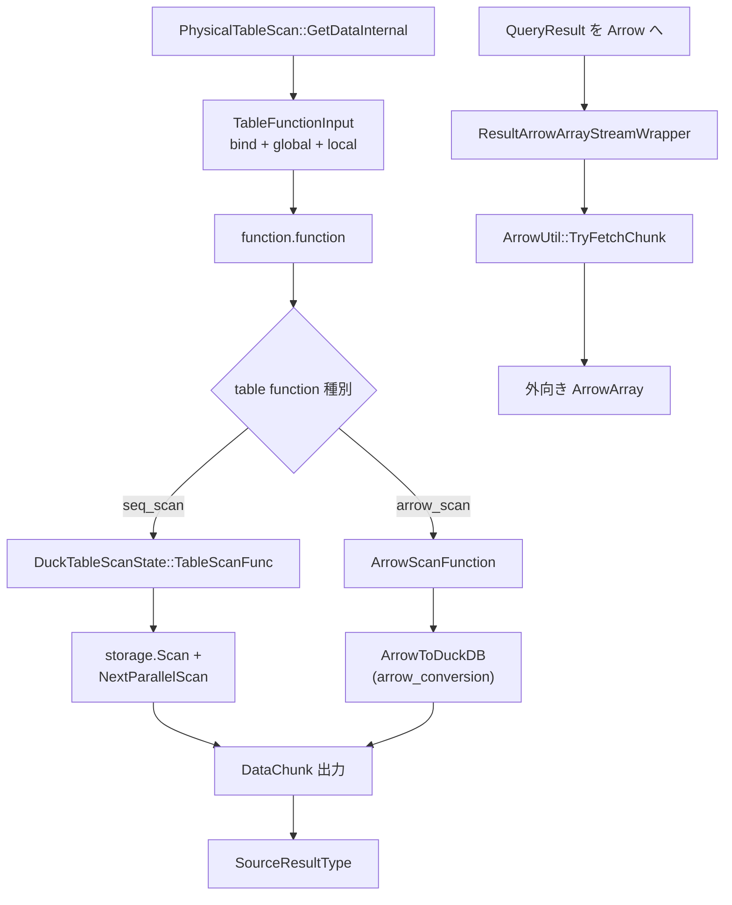

# 第18章 テーブル走査と table function

> **本章で読むソース**
>
> - [src/execution/operator/scan/physical_table_scan.cpp](https://github.com/duckdb/duckdb/blob/v1.5.4/src/execution/operator/scan/physical_table_scan.cpp)
> - [src/function/table/table_scan.cpp](https://github.com/duckdb/duckdb/blob/v1.5.4/src/function/table/table_scan.cpp)
> - [src/function/table/arrow.cpp](https://github.com/duckdb/duckdb/blob/v1.5.4/src/function/table/arrow.cpp)
> - [src/function/table/arrow_conversion.cpp](https://github.com/duckdb/duckdb/blob/v1.5.4/src/function/table/arrow_conversion.cpp)
> - [src/common/arrow/arrow_wrapper.cpp](https://github.com/duckdb/duckdb/blob/v1.5.4/src/common/arrow/arrow_wrapper.cpp)

## この章の狙い

物理プランの葉は多くの場合 `PhysicalTableScan` である。
本章では table function への橋渡し、`GlobalSourceState` / `LocalSourceState`、ネイティブ表スキャンでの投影とフィルタの押し下げ、並列 source を追う。
重点例として Arrow を取り上げ、入力 scan（`arrow.cpp` / `arrow_conversion.cpp`）とクエリ結果の Arrow 変換（`arrow_wrapper.cpp`）を別経路として区別する。

## 前提

物理プラン生成は第14章、パイプラインの source 契約は第15章を前提とする。
ストレージ上の row group 詳細は第26章に委ねる。

## PhysicalTableScan と Global / Local 状態

`PhysicalTableScan` は束ねた `TableFunction` と bind 結果、列 ID、投影 ID、table filter を保持する。
グローバル状態の構築時に `init_global` を呼び、ローカル状態は `init_local` でワーカ単位に作る。

[src/execution/operator/scan/physical_table_scan.cpp L30-L102](https://github.com/duckdb/duckdb/blob/v1.5.4/src/execution/operator/scan/physical_table_scan.cpp#L30-L102)

```cpp
class TableScanGlobalSourceState : public GlobalSourceState {
public:
	TableScanGlobalSourceState(ClientContext &context, const PhysicalTableScan &op) {
		physical_table_scan_execution_strategy = Settings::Get<DebugPhysicalTableScanExecutionStrategySetting>(context);

		if (op.dynamic_filters && op.dynamic_filters->HasFilters()) {
			table_filters = op.dynamic_filters->GetFinalTableFilters(op, op.table_filters.get());
		}

		if (op.function.init_global) {
			auto filters = table_filters ? *table_filters : GetTableFilters(op);
			TableFunctionInitInput input(op.bind_data.get(), op.column_ids, op.projection_ids, filters,
			                             op.extra_info.sample_options, &op);

			global_state = op.function.init_global(context, input);
			if (global_state) {
				max_threads = global_state->MaxThreads();
			}
		} else {
			max_threads = 1;
		}
		// ... (中略) ...
	}

	idx_t max_threads = 0;
	PhysicalTableScanExecutionStrategy physical_table_scan_execution_strategy;
	unique_ptr<GlobalTableFunctionState> global_state;
	bool in_out_final = false;
	DataChunk input_chunk;
	//! Combined table filters, if we have dynamic filters
	unique_ptr<TableFilterSet> table_filters;

	optional_ptr<TableFilterSet> GetTableFilters(const PhysicalTableScan &op) const {
		return table_filters ? table_filters.get() : op.table_filters.get();
	}
	idx_t MaxThreads() override {
		return max_threads;
	}
};

class TableScanLocalSourceState : public LocalSourceState {
public:
	TableScanLocalSourceState(ExecutionContext &context, TableScanGlobalSourceState &gstate,
	                          const PhysicalTableScan &op) {
		if (op.function.init_local) {
			TableFunctionInitInput input(op.bind_data.get(), op.column_ids, op.projection_ids,
			                             gstate.GetTableFilters(op), op.extra_info.sample_options, &op);
			local_state = op.function.init_local(context, input, gstate.global_state.get());
		}
	}

	unique_ptr<LocalTableFunctionState> local_state;
};

unique_ptr<LocalSourceState> PhysicalTableScan::GetLocalSourceState(ExecutionContext &context,
                                                                    GlobalSourceState &gstate) const {
	return make_uniq<TableScanLocalSourceState>(context, gstate.Cast<TableScanGlobalSourceState>(), *this);
}

unique_ptr<GlobalSourceState> PhysicalTableScan::GetGlobalSourceState(ClientContext &context) const {
	return make_uniq<TableScanGlobalSourceState>(context, *this);
}
```

`GetDataInternal` は `TableFunctionInput` を組み、登録された `function.function` を呼ぶ。
戻りは async 結果種別に応じて `BLOCKED` / `HAVE_MORE_OUTPUT` / `FINISHED` へ写像する。

[src/execution/operator/scan/physical_table_scan.cpp L159-L209](https://github.com/duckdb/duckdb/blob/v1.5.4/src/execution/operator/scan/physical_table_scan.cpp#L159-L209)

```cpp
SourceResultType PhysicalTableScan::GetDataInternal(ExecutionContext &context, DataChunk &chunk,
                                                    OperatorSourceInput &input) const {
	D_ASSERT(!column_ids.empty());
	auto &g_state = input.global_state.Cast<TableScanGlobalSourceState>();
	auto &l_state = input.local_state.Cast<TableScanLocalSourceState>();

	TableFunctionInput data(bind_data.get(), l_state.local_state.get(), g_state.global_state.get());

	if (function.function) {
		data.async_result = AsyncResultType::IMPLICIT;

		const auto initial_async_result = data.async_result.GetResultType();
		const auto execution_strategy = g_state.physical_table_scan_execution_strategy;
		const auto input_execution_mode = AsyncResult::ConvertToAsyncResultExecutionMode(execution_strategy);
		data.results_execution_mode = input_execution_mode;

		// Actually call the function
		function.function(context.client, data, chunk);

		const auto output_async_result = data.async_result.GetResultType();

		// Compare and check whether state before and after function.function call is compatible, will throw in case of
		// inconsistencies
		ValidateAsyncStrategyResult(execution_strategy, input_execution_mode, data.results_execution_mode,
		                            initial_async_result, output_async_result, chunk.size());

		// Handle results
		switch (output_async_result) {
		case AsyncResultType::BLOCKED: {
			D_ASSERT(data.async_result.HasTasks());
			auto guard = g_state.Lock();
			if (g_state.CanBlock(guard)) {
				data.async_result.ScheduleTasks(input.interrupt_state, context.pipeline->executor);
				return SourceResultType::BLOCKED;
			}
			return SourceResultType::FINISHED;
		}
		case AsyncResultType::IMPLICIT:
			if (chunk.size() > 0) {
				return SourceResultType::HAVE_MORE_OUTPUT;
			}
			return SourceResultType::FINISHED;
		case AsyncResultType::FINISHED:
			return SourceResultType::FINISHED;
		case AsyncResultType::HAVE_MORE_OUTPUT:
			return SourceResultType::HAVE_MORE_OUTPUT;
		default:
			throw InternalException(
			    "PhysicalTableScan::GetData call of function.function returned unexpected return '%'",
			    EnumUtil::ToChars(data.async_result.GetResultType()));
		}
```

`function.function` を持つスキャンは `ParallelSource` が真であり、パイプラインはグローバル状態の `MaxThreads` に応じて複数 `PipelineTask` を起動できる。

[src/execution/operator/scan/physical_table_scan.cpp L402-L409](https://github.com/duckdb/duckdb/blob/v1.5.4/src/execution/operator/scan/physical_table_scan.cpp#L402-L409)

```cpp
bool PhysicalTableScan::ParallelSource() const {
	if (!function.function) {
		// table in-out functions cannot be executed in parallel as part of a PhysicalTableScan
		// since they have only a single input row
		return false;
	}
	return true;
}
```

## seq_scan: 投影、フィルタ、並列走査

組み込み `seq_scan` は投影、フィルタ、サンプルの押し下げと late materialization を広告する。

[src/function/table/table_scan.cpp L911-L938](https://github.com/duckdb/duckdb/blob/v1.5.4/src/function/table/table_scan.cpp#L911-L938)

```cpp
TableFunction TableScanFunction::GetFunction() {
	TableFunction scan_function("seq_scan", {}, TableScanFunc);
	scan_function.init_local = TableScanInitLocal;
	scan_function.init_global = TableScanInitGlobal;
	scan_function.statistics_extended = TableScanStatistics;
	scan_function.dependency = TableScanDependency;
	scan_function.cardinality = TableScanCardinality;
	scan_function.get_metrics = TableScanGetMetrics;
	scan_function.pushdown_complex_filter = nullptr;
	scan_function.to_string = TableScanToString;
	scan_function.table_scan_progress = TableScanProgress;
	scan_function.get_partition_data = TableScanGetPartitionData;
	scan_function.get_partition_stats = TableScanGetPartitionStats;
	scan_function.get_bind_info = TableScanGetBindInfo;
	scan_function.projection_pushdown = true;
	scan_function.filter_pushdown = true;
	scan_function.filter_prune = true;
	scan_function.sampling_pushdown = true;
	scan_function.late_materialization = true;
	scan_function.serialize = TableScanSerialize;
	scan_function.deserialize = TableScanDeserialize;
	scan_function.pushdown_expression = TableScanPushdownExpression;
	scan_function.get_virtual_columns = TableScanGetVirtualColumns;
	scan_function.get_row_id_columns = TableScanGetRowIdColumns;
	scan_function.set_scan_order = SetScanOrder;
	scan_function.supports_pushdown_extract = TableSupportsPushdownExtract;
	return scan_function;
}
```

`TableScanInitGlobal` は `TableFilterSet` のエントリがちょうど1つで ART があるとき index scan を試し、だめなら通常の並列 table scan へ落とす。
単一である必要があるのはフィルタ集合のエントリ数であり、その1エントリが等値に限られるわけではない。
フィルタ無しや複数エントリは最初から `DuckTableScanInitGlobal` である。

[src/function/table/table_scan.cpp L684-L754](https://github.com/duckdb/duckdb/blob/v1.5.4/src/function/table/table_scan.cpp#L684-L754)

```cpp
unique_ptr<GlobalTableFunctionState> TableScanInitGlobal(ClientContext &context, TableFunctionInitInput &input) {
	D_ASSERT(input.bind_data);

	auto &bind_data = input.bind_data->Cast<TableScanBindData>();
	auto &duck_table = bind_data.table.Cast<DuckTableEntry>();
	auto &storage = duck_table.GetStorage();

	// Can't index scan without filters.
	if (!input.filters) {
		return DuckTableScanInitGlobal(context, input, storage, bind_data);
	}
	auto &filter_set = *input.filters;

	// FIXME: We currently only support scanning one ART with one filter.
	// If multiple filters exist, i.e., a = 11 AND b = 24, we need to
	// 1.	1.1. Find + scan one ART for a = 11.
	//		1.2. Find + scan one ART for b = 24.
	//		1.3. Return the intersecting row IDs.
	// 2. (Reorder and) scan a single ART with a compound key of (a, b).
	if (filter_set.filters.size() != 1) {
		return DuckTableScanInitGlobal(context, input, storage, bind_data);
	}

	auto &info = storage.GetDataTableInfo();
	auto &indexes = info->GetIndexes();
	if (indexes.Empty()) {
		return DuckTableScanInitGlobal(context, input, storage, bind_data);
	}

	// ... (中略) ...

	info->BindIndexes(context, ART::TYPE_NAME);
	for (auto &entry : indexes.IndexEntries()) {
		auto &index = *entry.index;
		if (index.GetIndexType() != ART::TYPE_NAME) {
			continue;
		}
		D_ASSERT(index.IsBound());
		auto &art = index.Cast<ART>();
		index_scan = TryScanIndex(art, entry, column_list, input, filter_set, max_count, row_ids);
		if (index_scan) {
			// found an index - break
			break;
		}
	}

	if (!index_scan) {
		return DuckTableScanInitGlobal(context, input, storage, bind_data);
	}
	return DuckIndexScanInitGlobal(context, input, bind_data, row_ids, std::move(vacuum_lock));
}
```

`TryScanIndex` は `ExtractComparisonsAndInFilters` で `ConstantFilter` と `InFilter` を式へ展開し、各式を `ART::TryInitializeScan` に渡す。
等値だけでなく、定数との比較や IN、さらに `ToExpression` 経由の比較式も受理できる。

[src/function/table/table_scan.cpp L557-L578](https://github.com/duckdb/duckdb/blob/v1.5.4/src/function/table/table_scan.cpp#L557-L578)

```cpp
vector<unique_ptr<Expression>> ExtractFilterExpressions(const ColumnDefinition &col, unique_ptr<TableFilter> &filter,
                                                        idx_t storage_idx) {
	ColumnBinding binding(0, storage_idx);
	auto bound_ref = make_uniq<BoundColumnRefExpression>(col.Name(), col.Type(), binding);

	// Extract all comparisons and IN filters from nested filters
	vector<unique_ptr<Expression>> expressions;
	vector<reference<ConstantFilter>> comparisons;
	vector<reference<InFilter>> in_filters;
	if (ExtractComparisonsAndInFilters(*filter, comparisons, in_filters)) {
		// Deduplicate/deal with conflicting filters, then convert to expressions
		ExtractExpressionsFromValues(GetUniqueValues(comparisons, in_filters), *bound_ref, expressions);
	}

	// Attempt matching the top-level filter to the index expression.
	if (expressions.empty()) {
		auto filter_expr = filter->ToExpression(*bound_ref);
		expressions.push_back(std::move(filter_expr));
	}

	return expressions;
}
```

[src/function/table/table_scan.cpp L665-L678](https://github.com/duckdb/duckdb/blob/v1.5.4/src/function/table/table_scan.cpp#L665-L678)

```cpp
	auto expressions = ExtractFilterExpressions(col, filter->second, storage_index.GetIndex());
	for (const auto &filter_expr : expressions) {
		for (auto &art_ref : arts_to_scan) {
			auto &art_to_scan = art_ref.get();
			auto scan_state = art_to_scan.TryInitializeScan(*index_expr, *filter_expr);
			if (!scan_state) {
				return false;
			}

			// Check if we can use an index scan, and already retrieve the matching row ids.
			if (!art_to_scan.Scan(*scan_state, max_count, row_ids)) {
				row_ids.clear();
				return false;
			}
		}
```

通常経路の `DuckTableScanState::TableScanFunc` は、`CanRemoveFilterColumns` が真のとき出力列とフィルタ評価用列を `all_columns` へ読み、`ReferenceColumns` で投影する。
チャンクが空なら `NextParallelScan` で次の row group 断片を取り、ワーカ間で仕事を分割する。

[src/function/table/table_scan.cpp L316-L356](https://github.com/duckdb/duckdb/blob/v1.5.4/src/function/table/table_scan.cpp#L316-L356)

```cpp
	void TableScanFunc(ClientContext &context, TableFunctionInput &data_p, DataChunk &output) override {
		auto &l_state = data_p.local_state->Cast<TableScanLocalState>();
		l_state.scan_state.options.force_fetch_row = ClientConfig::GetConfig(context).force_fetch_row;

		do {
			if (bind_data.is_create_index) {
				storage.CreateIndexScan(l_state.scan_state, output);
			} else if (CanRemoveFilterColumns()) {
				l_state.all_columns.Reset();
				storage.Scan(tx, l_state.all_columns, l_state.scan_state);
				output.ReferenceColumns(l_state.all_columns, projection_ids);
			} else {
				storage.Scan(tx, output, l_state.scan_state);
			}
			if (output.size() > 0) {
				return;
			}

			l_state.rows_in_current_row_group = storage.NextParallelScan(context, state, l_state.scan_state);
			if (l_state.rows_in_current_row_group > 0) {
				l_state.row_groups_scanned++;
			}

			if (data_p.results_execution_mode == AsyncResultsExecutionMode::TASK_EXECUTOR) {
				// We can avoid looping, and just return as appropriate
				if (l_state.rows_in_current_row_group == 0) {
					data_p.async_result = AsyncResultType::FINISHED;
				} else {
					data_p.async_result = AsyncResultType::HAVE_MORE_OUTPUT;
				}
				return;
			}
			if (l_state.rows_in_current_row_group == 0) {
				return;
			}

			// Before looping back, check if we are interrupted
			if (context.interrupted) {
				throw InterruptException();
			}
		} while (true);
	}
```

`CanRemoveFilterColumns` はグローバル状態に `projection_ids` が残っているとき真になる。
この経路は「フィルタ評価に必要な列だけ先に読む」のではない。
`column_ids`（出力列とフィルタ評価用列）を `storage.Scan` で `all_columns` へ読み、評価後に `projection_ids` でフィルタ専用列を落として出力列だけを `ReferenceColumns` する。

[src/function/table/table_scan.cpp L406-L432](https://github.com/duckdb/duckdb/blob/v1.5.4/src/function/table/table_scan.cpp#L406-L432)

```cpp
unique_ptr<GlobalTableFunctionState> DuckTableScanInitGlobal(ClientContext &context, TableFunctionInitInput &input,
                                                             DataTable &storage, const TableScanBindData &bind_data) {
	auto g_state = make_uniq<DuckTableScanState>(context, input.bind_data.get());
	if (bind_data.order_options) {
		auto transaction = TransactionData(DuckTransaction::Get(context, storage.GetAttached()));
		g_state->state.scan_state.reorderer = make_uniq<RowGroupReorderer>(*bind_data.order_options, transaction);
		g_state->state.local_state.reorderer = make_uniq<RowGroupReorderer>(*bind_data.order_options, transaction);
	}

	storage.InitializeParallelScan(context, g_state->state, input.column_indexes);
	if (!input.CanRemoveFilterColumns()) {
		return std::move(g_state);
	}

	g_state->projection_ids = input.projection_ids;
	auto &duck_table = bind_data.table.Cast<DuckTableEntry>();
	const auto &columns = duck_table.GetColumns();
	for (const auto &col_idx : input.column_indexes) {
		if (col_idx.IsRowIdColumn()) {
			g_state->scanned_types.emplace_back(LogicalType::ROW_TYPE);
		} else if (col_idx.HasType()) {
			g_state->scanned_types.push_back(col_idx.GetScanType());
		} else {
			g_state->scanned_types.push_back(columns.GetColumn(col_idx.ToLogical()).Type());
		}
	}
	return std::move(g_state);
}
```

Arrow 入力は table function `arrow_scan` として同じ `PhysicalTableScan` に載る。
グローバル状態はストリームと最大スレッド数を持ち、ローカル状態は現在の `ArrowArray` チャンクとオフセットを保持する。

[src/function/table/arrow.cpp L138-L213](https://github.com/duckdb/duckdb/blob/v1.5.4/src/function/table/arrow.cpp#L138-L213)

```cpp
unique_ptr<GlobalTableFunctionState> ArrowTableFunction::ArrowScanInitGlobal(ClientContext &context,
                                                                             TableFunctionInitInput &input) {
	auto &bind_data = input.bind_data->Cast<ArrowScanFunctionData>();
	auto result = make_uniq<ArrowScanGlobalState>();
	result->stream = ProduceArrowScan(bind_data, input.column_ids, input.filters.get());
	result->max_threads = ArrowScanMaxThreads(context, input.bind_data.get());
	if (!input.projection_ids.empty()) {
		result->projection_ids = input.projection_ids;
		for (const auto &col_idx : input.column_ids) {
			if (col_idx == COLUMN_IDENTIFIER_ROW_ID) {
				result->scanned_types.emplace_back(LogicalType::ROW_TYPE);
			} else {
				result->scanned_types.push_back(bind_data.all_types[col_idx]);
			}
		}
	}
	return std::move(result);
}

// ... (中略) ...

void ArrowTableFunction::ArrowScanFunction(ClientContext &context, TableFunctionInput &data_p, DataChunk &output) {
	if (!data_p.local_state) {
		return;
	}
	auto &data = data_p.bind_data->CastNoConst<ArrowScanFunctionData>(); // FIXME
	auto &state = data_p.local_state->Cast<ArrowScanLocalState>();
	auto &global_state = data_p.global_state->Cast<ArrowScanGlobalState>();

	//! Out of tuples in this chunk
	if (state.chunk_offset >= static_cast<idx_t>(state.chunk->arrow_array.length)) {
		if (!ArrowScanParallelStateNext(context, data_p.bind_data.get(), state, global_state)) {
			return;
		}
	}
	auto output_size =
	    MinValue<idx_t>(STANDARD_VECTOR_SIZE, NumericCast<idx_t>(state.chunk->arrow_array.length) - state.chunk_offset);
	data.lines_read += output_size;
	if (global_state.CanRemoveFilterColumns()) {
		state.all_columns.Reset();
		state.all_columns.SetCardinality(output_size);
		ArrowToDuckDB(state, data.arrow_table.GetColumns(), state.all_columns);
		output.ReferenceColumns(state.all_columns, global_state.projection_ids);
	} else {
		output.SetCardinality(output_size);
		ArrowToDuckDB(state, data.arrow_table.GetColumns(), output);
	}

	output.Verify();
	state.chunk_offset += output.size();
}
```

`ArrowToDuckDB` は Arrow 配列の物理表現（辞書、RLE、通常）ごとに変換し、ゼロコピーが可能なとき `owned_data` にチャンクへの共有所有を残す。

[src/function/table/arrow_conversion.cpp L1458-L1522](https://github.com/duckdb/duckdb/blob/v1.5.4/src/function/table/arrow_conversion.cpp#L1458-L1522)

```cpp
void ArrowTableFunction::ArrowToDuckDB(ArrowScanLocalState &scan_state, const arrow_column_map_t &arrow_convert_data,
                                       DataChunk &output, bool arrow_scan_is_projected, idx_t rowid_column_index) {
	for (idx_t idx = 0; idx < output.ColumnCount(); idx++) {
		auto col_idx = scan_state.column_ids.empty() ? idx : scan_state.column_ids[idx];

		// If projection was not pushed down into the arrow scanner, but projection pushdown is enabled on the
		// table function, we need to use original column ids here.
		auto arrow_array_idx = arrow_scan_is_projected ? idx : col_idx;

		// ... (中略) ...

		auto &parent_array = scan_state.chunk->arrow_array;
		auto &array = *scan_state.chunk->arrow_array.children[arrow_array_idx];
		if (!array.release) {
			throw InvalidInputException("arrow_scan: released array passed");
		}
		if (array.length != scan_state.chunk->arrow_array.length) {
			throw InvalidInputException("arrow_scan: array length mismatch");
		}

		D_ASSERT(arrow_convert_data.find(col_idx) != arrow_convert_data.end());
		auto &arrow_type = *arrow_convert_data.at(col_idx);
		auto &array_state = scan_state.GetState(col_idx);

		// Make sure this Vector keeps the Arrow chunk alive in case we can zero-copy the data
		if (!array_state.owned_data) {
			array_state.owned_data = scan_state.chunk;
		}
		auto array_physical_type = arrow_type.GetPhysicalType();

		switch (array_physical_type) {
		case ArrowArrayPhysicalType::DICTIONARY_ENCODED:
			ArrowToDuckDBConversion::ColumnArrowToDuckDBDictionary(output.data[idx], array, scan_state.chunk_offset,
			                                                       array_state, output.size(), arrow_type);
			break;
		case ArrowArrayPhysicalType::RUN_END_ENCODED:
			ArrowToDuckDBConversion::ColumnArrowToDuckDBRunEndEncoded(output.data[idx], array, scan_state.chunk_offset,
			                                                          array_state, output.size(), arrow_type);
			break;
		case ArrowArrayPhysicalType::DEFAULT:
			ArrowToDuckDBConversion::SetValidityMask(output.data[idx], array, scan_state.chunk_offset, output.size(),
			                                         parent_array.offset, -1);
			ArrowToDuckDBConversion::ColumnArrowToDuckDB(output.data[idx], array, scan_state.chunk_offset, array_state,
			                                             output.size(), arrow_type);
			break;
		default:
			throw NotImplementedException("ArrowArrayPhysicalType not recognized");
		}
	}
}
```

## Arrow 結果変換（入力とは別経路）

クエリ結果を Arrow に渡す経路は `ResultArrowArrayStreamWrapper` である。
`MyStreamGetNext` は `QueryResult` からチャンクを取り、`ArrowUtil::TryFetchChunk` で `ArrowArray` を埋める。
これは外部 Arrow 配列を読む `arrow_scan` とは逆方向であり、実行経路も型階層も分離されている。

[src/common/arrow/arrow_wrapper.cpp L110-L153](https://github.com/duckdb/duckdb/blob/v1.5.4/src/common/arrow/arrow_wrapper.cpp#L110-L153)

```cpp
int ResultArrowArrayStreamWrapper::MyStreamGetNext(struct ArrowArrayStream *stream, struct ArrowArray *out) {
	if (!stream->release) {
		return -1;
	}
	auto my_stream = reinterpret_cast<ResultArrowArrayStreamWrapper *>(stream->private_data);
	auto &result = *my_stream->result;
	auto &scan_state = *my_stream->scan_state;
	if (result.HasError()) {
		my_stream->last_error = result.GetErrorObject();
		return -1;
	}
	if (result.type == QueryResultType::STREAM_RESULT) {
		auto &stream_result = result.Cast<StreamQueryResult>();
		if (!stream_result.IsOpen()) {
			// Nothing to output
			out->release = nullptr;
			return 0;
		}
	}
	if (my_stream->column_types.empty()) {
		my_stream->column_types = result.types;
		my_stream->column_names = result.names;
	}

	try {
		idx_t result_count;
		ErrorData error;
		if (!ArrowUtil::TryFetchChunk(scan_state, result.client_properties, my_stream->batch_size, out, result_count,
		                              error, my_stream->extension_types)) {
			D_ASSERT(error.HasError());
			my_stream->last_error = error;
			return -1;
		}
		if (result_count == 0) {
			// Nothing to output
			out->release = nullptr;
		}
	} catch (std::exception &e) {
		my_stream->last_error = ErrorData(e);
		return -1;
	}

	return 0;
}
```

入力側の `ArrowArrayWrapper` と `ArrowArrayStreamWrapper` は、`arrow_scan` が受け取る外部 stream の RAII ラッパーである。
デストラクタが `release` コールバックを呼び、外部バッファの寿命を閉じる。

[src/common/arrow/arrow_wrapper.cpp L18-L61](https://github.com/duckdb/duckdb/blob/v1.5.4/src/common/arrow/arrow_wrapper.cpp#L18-L61)

```cpp
ArrowSchemaWrapper::~ArrowSchemaWrapper() {
	if (arrow_schema.release) {
		arrow_schema.release(&arrow_schema);
		D_ASSERT(!arrow_schema.release);
	}
}

ArrowArrayWrapper::~ArrowArrayWrapper() {
	if (arrow_array.release) {
		arrow_array.release(&arrow_array);
		D_ASSERT(!arrow_array.release);
	}
}

ArrowArrayStreamWrapper::~ArrowArrayStreamWrapper() {
	if (arrow_array_stream.release) {
		arrow_array_stream.release(&arrow_array_stream);
		D_ASSERT(!arrow_array_stream.release);
	}
}

void ArrowArrayStreamWrapper::GetSchema(ArrowSchemaWrapper &schema) {
	D_ASSERT(arrow_array_stream.get_schema);
	// LCOV_EXCL_START
	if (arrow_array_stream.get_schema(&arrow_array_stream, &schema.arrow_schema)) {
		throw InvalidInputException("arrow_scan: get_schema failed(): %s", string(GetError()));
	}
	if (!schema.arrow_schema.release) {
		throw InvalidInputException("arrow_scan: released schema passed");
	}
	if (schema.arrow_schema.n_children < 1) {
		throw InvalidInputException("arrow_scan: empty schema passed");
	}
	// LCOV_EXCL_STOP
}

shared_ptr<ArrowArrayWrapper> ArrowArrayStreamWrapper::GetNextChunk() {
	auto current_chunk = make_shared_ptr<ArrowArrayWrapper>();
	if (arrow_array_stream.get_next(&arrow_array_stream, &current_chunk->arrow_array)) { // LCOV_EXCL_START
		throw InvalidInputException("arrow_scan: get_next failed(): %s", string(GetError()));
	} // LCOV_EXCL_STOP

	return current_chunk;
}
```

結果側の `ResultArrowArrayStreamWrapper` はこれらを継承しない。
`ArrowArrayStream stream` と `unique_ptr<QueryResult>` を直接持ち、コンストラクタで `stream.release` に `MyStreamRelease` を登録する。
`MyStreamRelease` は `private_data` として載っている `ResultArrowArrayStreamWrapper` 自身を `delete` する。
入力側ラッパーのデストラクタ経路とは別物である。

[src/include/duckdb/common/arrow/result_arrow_wrapper.hpp L17-L36](https://github.com/duckdb/duckdb/blob/v1.5.4/src/include/duckdb/common/arrow/result_arrow_wrapper.hpp#L17-L36)

```cpp
class ResultArrowArrayStreamWrapper {
public:
	explicit ResultArrowArrayStreamWrapper(unique_ptr<QueryResult> result, idx_t batch_size);

public:
	ArrowArrayStream stream;
	unique_ptr<QueryResult> result;
	ErrorData last_error;
	idx_t batch_size;
	vector<LogicalType> column_types;
	vector<string> column_names;
	unique_ptr<ChunkScanState> scan_state;
	unordered_map<idx_t, const shared_ptr<ArrowTypeExtensionData>> extension_types;

private:
	static int MyStreamGetSchema(struct ArrowArrayStream *stream, struct ArrowSchema *out);
	static int MyStreamGetNext(struct ArrowArrayStream *stream, struct ArrowArray *out);
	static void MyStreamRelease(struct ArrowArrayStream *stream);
	static const char *MyStreamGetLastError(struct ArrowArrayStream *stream);
};
```

[src/common/arrow/arrow_wrapper.cpp L155-L189](https://github.com/duckdb/duckdb/blob/v1.5.4/src/common/arrow/arrow_wrapper.cpp#L155-L189)

```cpp
void ResultArrowArrayStreamWrapper::MyStreamRelease(struct ArrowArrayStream *stream) {
	if (!stream || !stream->release) {
		return;
	}
	stream->release = nullptr;
	delete reinterpret_cast<ResultArrowArrayStreamWrapper *>(stream->private_data);
}

const char *ResultArrowArrayStreamWrapper::MyStreamGetLastError(struct ArrowArrayStream *stream) {
	if (!stream->release) {
		return "stream was released";
	}
	D_ASSERT(stream->private_data);
	auto my_stream = reinterpret_cast<ResultArrowArrayStreamWrapper *>(stream->private_data);
	return my_stream->last_error.Message().c_str();
}

ResultArrowArrayStreamWrapper::ResultArrowArrayStreamWrapper(unique_ptr<QueryResult> result_p, idx_t batch_size_p)
    : result(std::move(result_p)), scan_state(make_uniq<QueryResultChunkScanState>(*result)) {
	//! We first initialize the private data of the stream
	stream.private_data = this;
	//! Ceil Approx_Batch_Size/STANDARD_VECTOR_SIZE
	if (batch_size_p == 0) {
		throw std::runtime_error("Approximate Batch Size of Record Batch MUST be higher than 0");
	}
	batch_size = batch_size_p;
	//! We initialize the stream functions
	stream.get_schema = ResultArrowArrayStreamWrapper::MyStreamGetSchema;
	stream.get_next = ResultArrowArrayStreamWrapper::MyStreamGetNext;
	stream.release = ResultArrowArrayStreamWrapper::MyStreamRelease;
	stream.get_last_error = ResultArrowArrayStreamWrapper::MyStreamGetLastError;

	extension_types =
	    ArrowTypeExtensionData::GetExtensionTypes(*result->client_properties.client_context, result->types);
}
```

## 処理の流れ



図の下段は結果変換であり、上段の入力 scan とは接続しない。

## 高速化と最適化の工夫

`seq_scan` のフィルタプッシュダウンは、ストレージ層の zonemap や圧縮セグメント走査で不必要な行を読まない前提になる。
投影プッシュダウンと `ReferenceColumns` により、フィルタ評価後に不要な列をコピーせず出力へ載せる。

並列 source は `ParallelTableScanState` と `NextParallelScan` で row group 断片をワーカに分配する。
Arrow 入力では辞書やラン長表現を直接 `Vector` に写し、ゼロコピー可能なバッファは `owned_data` で寿命だけ共有する。

## まとめ

`PhysicalTableScan` は table function の global/local 初期化と `function` 呼び出しをパイプライン source に接続する。
ネイティブ `seq_scan` は投影、フィルタ、並列 row group 分割を持ち、条件次第で ART index scan へ分岐する。
Arrow は入力変換と結果変換が別実装であり、前者は `ArrowToDuckDB`、後者は `ResultArrowArrayStreamWrapper` である。

## 関連する章

- 第14章（物理プラン生成）：`PhysicalTableScan` の生成
- 第15章（パイプライン実行）：source としての呼び出し
- 第19章（CSV スキャナ）：別の table function 実装
- 第26章（row group と列データ）：`storage.Scan` の先
- 第29章（ART インデックス）：index scan 分岐
