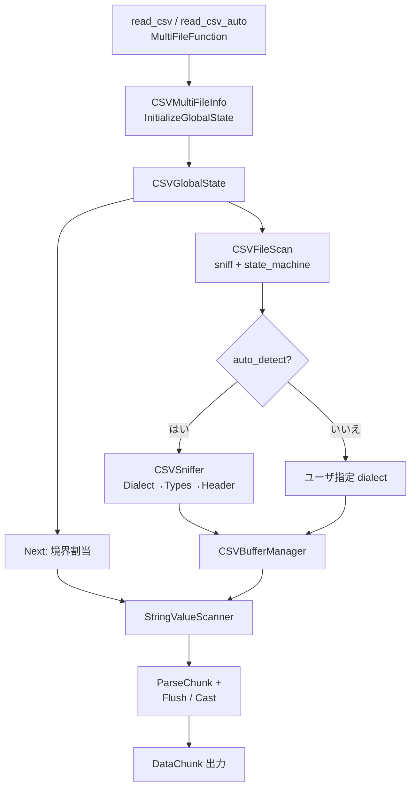

# 第19章 CSV スキャナ

> **本章で読むソース**
>
> - [src/function/table/read_csv.cpp](https://github.com/duckdb/duckdb/blob/v1.5.4/src/function/table/read_csv.cpp)
> - [src/execution/operator/csv_scanner/table_function/csv_multi_file_info.cpp](https://github.com/duckdb/duckdb/blob/v1.5.4/src/execution/operator/csv_scanner/table_function/csv_multi_file_info.cpp)
> - [src/execution/operator/csv_scanner/table_function/global_csv_state.cpp](https://github.com/duckdb/duckdb/blob/v1.5.4/src/execution/operator/csv_scanner/table_function/global_csv_state.cpp)
> - [src/execution/operator/csv_scanner/table_function/csv_file_scanner.cpp](https://github.com/duckdb/duckdb/blob/v1.5.4/src/execution/operator/csv_scanner/table_function/csv_file_scanner.cpp)
> - [src/execution/operator/csv_scanner/sniffer/csv_sniffer.cpp](https://github.com/duckdb/duckdb/blob/v1.5.4/src/execution/operator/csv_scanner/sniffer/csv_sniffer.cpp)
> - [src/execution/operator/csv_scanner/buffer_manager/csv_buffer_manager.cpp](https://github.com/duckdb/duckdb/blob/v1.5.4/src/execution/operator/csv_scanner/buffer_manager/csv_buffer_manager.cpp)
> - [src/execution/operator/csv_scanner/scanner/scanner_boundary.cpp](https://github.com/duckdb/duckdb/blob/v1.5.4/src/execution/operator/csv_scanner/scanner/scanner_boundary.cpp)
> - [src/execution/operator/csv_scanner/scanner/string_value_scanner.cpp](https://github.com/duckdb/duckdb/blob/v1.5.4/src/execution/operator/csv_scanner/scanner/string_value_scanner.cpp)
> - [src/execution/operator/csv_scanner/state_machine/csv_state_machine_cache.cpp](https://github.com/duckdb/duckdb/blob/v1.5.4/src/execution/operator/csv_scanner/state_machine/csv_state_machine_cache.cpp)

## この章の狙い

CSV 読み込みは table function として `PhysicalTableScan` に載るが、実装は専用のスキャナ群である。
本章では `MultiFileFunction` との接続、`CSVGlobalState`（`GlobalCSVState` ではない）による並列境界割当、`CSVSniffer` の dialect / 型検出、バッファ管理と状態機械、`StringValueScanner` によるチャンク生成を追う。

## 前提

第18章の table function と source 契約を前提とする。
式評価やストレージ走査とは独立した外部ファイル入力経路である。

## read_csv と MultiFileFunction

`read_csv` / `read_csv_auto` は `MultiFileFunction<CSVMultiFileInfo>` として登録される。
ファイル列挙や union by name は共通 MultiFile 層に任せ、CSV 固有の bind / 状態は `CSVMultiFileInfo` が担う。

[src/function/table/read_csv.cpp L143-L161](https://github.com/duckdb/duckdb/blob/v1.5.4/src/function/table/read_csv.cpp#L143-L161)

```cpp
TableFunction ReadCSVTableFunction::GetFunction() {
	MultiFileFunction<CSVMultiFileInfo> read_csv("read_csv");
	read_csv.serialize = CSVReaderSerialize;
	read_csv.deserialize = CSVReaderDeserialize;
	read_csv.type_pushdown = MultiFileFunction<CSVMultiFileInfo>::PushdownType;
	ReadCSVAddNamedParameters(read_csv);
	return static_cast<TableFunction>(read_csv);
}

TableFunction ReadCSVTableFunction::GetAutoFunction() {
	auto read_csv_auto = ReadCSVTableFunction::GetFunction();
	read_csv_auto.name = "read_csv_auto";
	return read_csv_auto;
}

void ReadCSVTableFunction::RegisterFunction(BuiltinFunctions &set) {
	set.AddFunction(MultiFileReader::CreateFunctionSet(ReadCSVTableFunction::GetFunction()));
	set.AddFunction(MultiFileReader::CreateFunctionSet(ReadCSVTableFunction::GetAutoFunction()));
}
```

グローバル状態は `CSVGlobalState` である。
コンストラクタはファイル数が多い（`many_csv_files`）、または `parallel` が偽のとき `single_threaded` を立てる。
これはクエリ全体を単一スレッドにするフラグではない。
`SetCurrentBoundaryToPosition` に渡り、1ファイルを複数 byte boundary に分けるかを制御する。

[src/execution/operator/csv_scanner/table_function/csv_multi_file_info.cpp L263-L286](https://github.com/duckdb/duckdb/blob/v1.5.4/src/execution/operator/csv_scanner/table_function/csv_multi_file_info.cpp#L263-L286)

```cpp
unique_ptr<GlobalTableFunctionState> CSVMultiFileInfo::InitializeGlobalState(ClientContext &context,
                                                                             MultiFileBindData &bind_data,
                                                                             MultiFileGlobalState &global_state) {
	auto &csv_data = bind_data.bind_data->Cast<ReadCSVData>();

	// Create the temporary rejects table
	if (csv_data.options.store_rejects.GetValue()) {
		CSVRejectsTable::GetOrCreate(context, csv_data.options.rejects_scan_name.GetValue(),
		                             csv_data.options.rejects_table_name.GetValue())
		    ->InitializeTable(context, csv_data);
	}
	return make_uniq<CSVGlobalState>(context, csv_data.options, bind_data.file_list->GetTotalFileCount(), bind_data);
}

struct CSVLocalState : public LocalTableFunctionState {
public:
	unique_ptr<StringValueScanner> csv_reader;
	bool done = false;
};

unique_ptr<LocalTableFunctionState> CSVMultiFileInfo::InitializeLocalState(ExecutionContext &,
                                                                           GlobalTableFunctionState &) {
	return make_uniq<CSVLocalState>();
}
```

[src/execution/operator/csv_scanner/table_function/global_csv_state.cpp L12-L21](https://github.com/duckdb/duckdb/blob/v1.5.4/src/execution/operator/csv_scanner/table_function/global_csv_state.cpp#L12-L21)

```cpp
CSVGlobalState::CSVGlobalState(ClientContext &context_p, const CSVReaderOptions &options, idx_t total_file_count,
                               const MultiFileBindData &bind_data)
    : context(context_p), bind_data(bind_data), sniffer_mismatch_error(options.sniffer_user_mismatch_error) {
	// There are situations where we only support single threaded scanning
	auto system_threads = context.db->NumberOfThreads();
	bool many_csv_files = total_file_count > 1 && total_file_count > system_threads * 2;
	single_threaded = many_csv_files || !options.parallel;
	scanner_idx = 0;
	initialized = false;
}
```

`many_csv_files` のときはファイル内並列を止め、ファイル間並列を優先する。
多ファイル時は `CSVMultiFileInfo::MaxThreads` が最大スレッドを許し、MultiFile 層がファイル単位で並列化する。
`parallel=false` も同じく per-file boundary 制御であり、こちらはユーザ指定でファイル内分割を止める。

[src/execution/operator/csv_scanner/table_function/csv_multi_file_info.cpp L248-L261](https://github.com/duckdb/duckdb/blob/v1.5.4/src/execution/operator/csv_scanner/table_function/csv_multi_file_info.cpp#L248-L261)

```cpp
optional_idx CSVMultiFileInfo::MaxThreads(const MultiFileBindData &bind_data, const MultiFileGlobalState &global_state,
                                          FileExpandResult expand_result) {
	auto &csv_data = bind_data.bind_data->Cast<ReadCSVData>();
	if (!csv_data.buffer_manager) {
		return optional_idx();
	}
	if (expand_result == FileExpandResult::MULTIPLE_FILES) {
		// always launch max threads if we are reading multiple files
		return optional_idx();
	}
	const idx_t bytes_per_thread = CSVIterator::BytesPerThread(csv_data.options);
	const idx_t file_size = csv_data.buffer_manager->file_handle->FileSize();
	return file_size / bytes_per_thread + 1;
}
```

[src/execution/operator/csv_scanner/scanner/scanner_boundary.cpp L106-L122](https://github.com/duckdb/duckdb/blob/v1.5.4/src/execution/operator/csv_scanner/scanner/scanner_boundary.cpp#L106-L122)

```cpp
void CSVIterator::SetCurrentBoundaryToPosition(bool single_threaded, const CSVReaderOptions &reader_options) {
	if (single_threaded) {
		is_set = false;
		return;
	}
	const auto bytes_per_thread = BytesPerThread(reader_options);

	boundary.buffer_idx = pos.buffer_idx;
	if (pos.buffer_pos == 0) {
		boundary.end_pos = bytes_per_thread;
	} else {
		boundary.end_pos = ((pos.buffer_pos + bytes_per_thread - 1) / bytes_per_thread) * bytes_per_thread;
	}

	boundary.buffer_pos = boundary.end_pos - bytes_per_thread;
	is_set = true;
}
```

## CSVFileScan と sniffer

`CSVFileScan` はファイルごとに `CSVBufferManager` と `CSVStateMachine` を用意する。
`auto_detect` 時は `CSVSniffer` で方言や型を決め、確定後に状態機械をキャッシュから取り出す。

[src/execution/operator/csv_scanner/table_function/csv_file_scanner.cpp L9-L50](https://github.com/duckdb/duckdb/blob/v1.5.4/src/execution/operator/csv_scanner/table_function/csv_file_scanner.cpp#L9-L50)

```cpp
CSVFileScan::CSVFileScan(ClientContext &context, const OpenFileInfo &file_p, CSVReaderOptions options_p,
                         const MultiFileOptions &file_options, const vector<string> &names,
                         const vector<LogicalType> &types, CSVSchema &file_schema, bool per_file_single_threaded,
                         shared_ptr<CSVBufferManager> buffer_manager_p, bool fixed_schema)
    : BaseFileReader(file_p), buffer_manager(std::move(buffer_manager_p)),
      error_handler(make_shared_ptr<CSVErrorHandler>(options_p.ignore_errors.GetValue())),
      options(std::move(options_p)) {
	// Initialize Buffer Manager
	if (!buffer_manager) {
		buffer_manager = make_shared_ptr<CSVBufferManager>(context, options, file, per_file_single_threaded);
	}
	// Initialize On Disk and Size of file
	on_disk_file = buffer_manager->file_handle->OnDiskFile();
	file_size = buffer_manager->file_handle->FileSize();
	// Initialize State Machine
	auto &state_machine_cache = CSVStateMachineCache::Get(context);

	SetNamesAndTypes(names, types);
	if (options.auto_detect) {
		if (fixed_schema) {
			// schema of the file is fixed - only run the sniffer
			CSVSniffer sniffer(options, file_options, buffer_manager, state_machine_cache);
			sniffer.SniffCSV();
		} else if (file_schema.Empty()) {
			throw InternalException("CSV File Scanner cannot be created without a schema");
		} else if (buffer_manager->file_handle->FileSize() > 0) {
			options.file_path = file.path;
			CSVSniffer sniffer(options, file_options, buffer_manager, state_machine_cache, false);
			auto result = sniffer.AdaptiveSniff(file_schema);
			SetNamesAndTypes(result.names, result.return_types);
		}
	}
	if (options.dialect_options.num_cols == 0) {
		// We need to define the number of columns, if the sniffer is not running this must be in the sql_type_list
		options.dialect_options.num_cols = options.sql_type_list.size();
	}
	if (options.dialect_options.state_machine_options.new_line == NewLineIdentifier::NOT_SET) {
		options.dialect_options.state_machine_options.new_line = CSVSniffer::DetectNewLineDelimiter(*buffer_manager);
	}
	state_machine = make_shared_ptr<CSVStateMachine>(
	    state_machine_cache.Get(options.dialect_options.state_machine_options), options);
}
```

フル sniff は方言検出、型検出、型 refinement、ヘッダ検出、型置換の順である。
圧縮ファイルでは seek が難しいため、バッファをリセットして先頭から読み直す。

[src/execution/operator/csv_scanner/sniffer/csv_sniffer.cpp L172-L203](https://github.com/duckdb/duckdb/blob/v1.5.4/src/execution/operator/csv_scanner/sniffer/csv_sniffer.cpp#L172-L203)

```cpp
SnifferResult CSVSniffer::SniffCSV(const bool force_match) {
	buffer_manager->sniffing = true;
	// 1. Dialect Detection
	DetectDialect();
	if (buffer_manager->file_handle->compression_type != FileCompressionType::UNCOMPRESSED &&
	    buffer_manager->IsBlockUnloaded(0)) {
		buffer_manager->ResetBufferManager();
	}
	// 2. Type Detection
	DetectTypes();
	// 3. Type Refinement
	RefineTypes();
	// 4. Header Detection
	DetectHeader();
	// 5. Type Replacement
	ReplaceTypes();

	// We reset the buffer for compressed files
	// This is done because we can't easily seek on compressed files, if a buffer goes out of scope we must read from
	// the start
	if (buffer_manager->file_handle->compression_type != FileCompressionType::UNCOMPRESSED) {
		buffer_manager->ResetBufferManager();
	}
	buffer_manager->sniffing = false;
	if (best_candidate->error_handler->AnyErrors() && !options.ignore_errors.GetValue() &&
	    best_candidate->state_machine->dialect_options.state_machine_options.strict_mode.GetValue()) {
		best_candidate->error_handler->ErrorIfTypeExists(MAXIMUM_LINE_SIZE);
	}
	D_ASSERT(best_sql_types_candidates_per_column_idx.size() == names.size());
	// We are done, Set the CSV Options in the reference. Construct and return the result.
	SetResultOptions();
	options.auto_detect = true;
```

状態機械キャッシュは区切り、引用、エスケープの組ごとに遷移表を構築する。
同一方言のファイルが続くと遷移配列の再計算を避けられる。

[src/execution/operator/csv_scanner/state_machine/csv_state_machine_cache.cpp L19-L56](https://github.com/duckdb/duckdb/blob/v1.5.4/src/execution/operator/csv_scanner/state_machine/csv_state_machine_cache.cpp#L19-L56)

```cpp
void CSVStateMachineCache::Insert(const CSVStateMachineOptions &state_machine_options) {
	D_ASSERT(state_machine_cache.find(state_machine_options) == state_machine_cache.end());
	// Initialize transition array with default values to the Standard option
	auto &transition_array = state_machine_cache[state_machine_options];

	for (uint32_t i = 0; i < StateMachine::NUM_STATES; i++) {
		const auto cur_state = static_cast<CSVState>(i);
		switch (cur_state) {
		case CSVState::MAYBE_QUOTED:
		case CSVState::QUOTED:
		case CSVState::QUOTED_NEW_LINE:
		case CSVState::ESCAPE:
			InitializeTransitionArray(transition_array, cur_state, CSVState::QUOTED);
			break;
		case CSVState::UNQUOTED:
			if (state_machine_options.strict_mode.GetValue()) {
				// If we have an unquoted state, following rfc 4180, our base state is invalid
				InitializeTransitionArray(transition_array, cur_state, CSVState::INVALID);
			} else {
				// This will allow us to accept unescaped quotes
				InitializeTransitionArray(transition_array, cur_state, CSVState::UNQUOTED);
			}
			break;
		case CSVState::COMMENT:
			InitializeTransitionArray(transition_array, cur_state, CSVState::COMMENT);
			break;
		case CSVState::CARRIAGE_RETURN:
			if (state_machine_options.strict_mode.GetValue()) {
				// If we have an unquoted state, following rfc 4180, our base state is invalid
				InitializeTransitionArray(transition_array, cur_state, CSVState::INVALID);
			} else {
				// This will allow us to accept unescaped quotes
				InitializeTransitionArray(transition_array, cur_state, CSVState::STANDARD);
			}
			break;
		default:
			InitializeTransitionArray(transition_array, cur_state, CSVState::STANDARD);
			break;
		}
```

## バッファと並列境界

`CSVBufferManager` はファイルを固定サイズのバッファへ読み、要求インデックスまで伸ばす。
seek 可能な通常ファイルでは前バッファを unpin し、メモリ圧を抑える。

[src/execution/operator/csv_scanner/buffer_manager/csv_buffer_manager.cpp L35-L80](https://github.com/duckdb/duckdb/blob/v1.5.4/src/execution/operator/csv_scanner/buffer_manager/csv_buffer_manager.cpp#L35-L80)

```cpp
bool CSVBufferManager::ReadNextAndCacheIt() {
	D_ASSERT(last_buffer);
	for (idx_t i = 0; i < 2; i++) {
		if (!last_buffer->IsCSVFileLastBuffer()) {
			auto maybe_last_buffer = last_buffer->Next(*file_handle, buffer_size, has_seeked);
			if (!maybe_last_buffer) {
				last_buffer->last_buffer = true;
				return false;
			}
			last_buffer = std::move(maybe_last_buffer);
			bytes_read += last_buffer->GetBufferSize();
			cached_buffers.emplace_back(last_buffer);
			return true;
		}
	}
	return false;
}

shared_ptr<CSVBufferHandle> CSVBufferManager::GetBuffer(const idx_t pos) {
	lock_guard<mutex> parallel_lock(main_mutex);
	if (pos == 0 && done && cached_buffers.empty()) {
		if (is_pipe) {
			throw InvalidInputException("Recursive CTEs are not allowed when using piped csv files");
		}
		// This is a recursive CTE, we have to reset out whole buffer
		done = false;
		file_handle->Reset();
		Initialize();
	}
	while (pos >= cached_buffers.size()) {
		if (done) {
			return nullptr;
		}
		if (!ReadNextAndCacheIt()) {
			done = true;
		}
	}
	if (pos != 0 && (sniffing || file_handle->CanSeek() || per_file_single_threaded)) {
		// We don't need to unpin the buffers here if we are not sniffing since we
		// control it per-thread on the scan
		if (cached_buffers[pos - 1]) {
			cached_buffers[pos - 1]->Unpin();
		}
	}
	return cached_buffers[pos]->Pin(*file_handle, has_seeked);
}
```

並列走査では `CSVGlobalState::Next` が境界を進め、それぞれに `StringValueScanner` を割り当てる。
境界は任意バイト位置へ進むため、行の途中で切れうる。
正しさはバッファまたぎと状態機械の継続だけでは足りない。
2本目以降のスキャナは開始側で部分行を飛ばし、前タスクは終了側で境界をまたぐ行を完結させる。

[src/execution/operator/csv_scanner/table_function/global_csv_state.cpp L45-L79](https://github.com/duckdb/duckdb/blob/v1.5.4/src/execution/operator/csv_scanner/table_function/global_csv_state.cpp#L45-L79)

```cpp
unique_ptr<StringValueScanner> CSVGlobalState::Next(shared_ptr<CSVFileScan> &current_file_ptr) {
	auto &current_file = *current_file_ptr;
	if (!initialized) {
		// initialize the boundary for this file
		current_boundary = current_file.start_iterator;
		current_boundary.SetCurrentBoundaryToPosition(single_threaded, current_file.options);
		if (current_boundary.done && context.client_data->debug_set_max_line_length) {
			context.client_data->debug_max_line_length =
			    MaxValue<idx_t>(context.client_data->debug_max_line_length, current_boundary.pos.buffer_pos);
		}
		current_buffer_in_use =
		    make_shared_ptr<CSVBufferUsage>(*current_file.buffer_manager, current_boundary.GetBufferIdx());
		initialized = true;
	} else {
		// produce the next boundary for this file
		if (current_boundary.done || !current_boundary.Next(*current_file.buffer_manager, current_file.options)) {
			// finished processing this file - return
			return nullptr;
		}
	}
	// create the scanner for this file
	if (current_buffer_in_use->buffer_idx != current_boundary.GetBufferIdx()) {
		current_buffer_in_use =
		    make_shared_ptr<CSVBufferUsage>(*current_file.buffer_manager, current_boundary.GetBufferIdx());
	}
	++current_file.started_tasks;
	// We first create the scanner for the current boundary
	auto csv_scanner =
	    make_uniq<StringValueScanner>(scanner_idx++, current_file.buffer_manager, current_file.state_machine,
	                                  current_file.error_handler, current_file_ptr, false, current_boundary);

	csv_scanner->buffer_tracker = current_buffer_in_use;
	// We initialize the scan
	return csv_scanner;
}
```

[src/execution/operator/csv_scanner/scanner/scanner_boundary.cpp L52-L80](https://github.com/duckdb/duckdb/blob/v1.5.4/src/execution/operator/csv_scanner/scanner/scanner_boundary.cpp#L52-L80)

```cpp
bool CSVIterator::Next(CSVBufferManager &buffer_manager, const CSVReaderOptions &reader_options) {
	if (!is_set) {
		return false;
	}
	const auto bytes_per_thread = BytesPerThread(reader_options);

	// If we are calling next this is not the first one anymore
	first_one = false;
	boundary.boundary_idx++;
	// This is our start buffer
	auto buffer = buffer_manager.GetBuffer(boundary.buffer_idx);
	if (buffer->is_last_buffer && boundary.buffer_pos + bytes_per_thread > buffer->actual_size) {
		// 1) We are done with the current file
		return false;
	} else if (boundary.buffer_pos + bytes_per_thread >= buffer->actual_size) {
		// 2) We still have data to scan in this file, we set the iterator accordingly.
		// We must move the buffer
		boundary.buffer_idx++;
		boundary.buffer_pos = 0;
		// Verify this buffer really exists
		auto next_buffer = buffer_manager.GetBuffer(boundary.buffer_idx);
		if (!next_buffer) {
			return false;
		}

	} else {
		// 3) We are not done with the current buffer, hence we just move where we start within the buffer
		boundary.buffer_pos += bytes_per_thread;
	}
```

2本目以降の `StringValueScanner`（`iterator.first_one` が偽）は `SetStart` で境界位置から `STANDARD_NEWLINE` や quoted value などを `TryRow` し、最初の完全な行開始を決める。
開始側の部分行は飛ばし、直前タスクが完結させる側へ委ねる。

[src/execution/operator/csv_scanner/scanner/string_value_scanner.cpp L1836-L1860](https://github.com/duckdb/duckdb/blob/v1.5.4/src/execution/operator/csv_scanner/scanner/string_value_scanner.cpp#L1836-L1860)

```cpp
void StringValueScanner::SetStart() {
	start_pos = iterator.GetGlobalCurrentPos();
	if (iterator.first_one) {
		if (result.store_line_size) {
			result.error_handler.NewMaxLineSize(iterator.pos.buffer_pos);
		}
		return;
	}
	if (iterator.GetEndPos() > cur_buffer_handle->actual_size) {
		iterator.SetEnd(cur_buffer_handle->actual_size);
	}
	if (!state_machine_strict) {
		// We need to initialize our strict state machine
		auto &state_machine_cache = CSVStateMachineCache::Get(buffer_manager->context);
		auto state_options = state_machine->state_machine_options;
		// To set the state machine to be strict we ensure that strict_mode is set to true
		if (!state_options.strict_mode.IsSetByUser()) {
			state_options.strict_mode = true;
		}
		state_machine_strict =
		    make_shared_ptr<CSVStateMachine>(state_machine_cache.Get(state_options), state_machine->options);
	}
	// At this point we have 3 options:
	// 1. We are at the start of a valid line
	ValidRowInfo best_row = TryRow(CSVState::STANDARD_NEWLINE, iterator.pos.buffer_pos, iterator.GetEndPos());
```

quote オプションが空文字でなければ、続けて `TryRow(CSVState::QUOTED, ...)` も試す。

[src/execution/operator/csv_scanner/scanner/string_value_scanner.cpp L1862-L1878](https://github.com/duckdb/duckdb/blob/v1.5.4/src/execution/operator/csv_scanner/scanner/string_value_scanner.cpp#L1862-L1878)

```cpp
	if (state_machine->dialect_options.state_machine_options.quote.GetValue() != '\0') {
		idx_t end_pos = iterator.GetEndPos();
		if (best_row.is_valid && best_row.end_buffer_idx == iterator.pos.buffer_idx) {
			// If we got a valid row from the standard state, we limit our search up to that.
			end_pos = best_row.end_pos;
		}
		auto quoted_row = TryRow(CSVState::QUOTED, iterator.pos.buffer_pos, end_pos);
		if (quoted_row.is_valid && (!best_row.is_valid || best_row.last_state_quote)) {
			best_row = quoted_row;
		}
		if (!best_row.is_valid && !quoted_row.is_valid && best_row.start_pos < quoted_row.start_pos) {
			best_row = quoted_row;
		}
		if (quoted_row.is_valid && quoted_row.start_pos < best_row.start_pos) {
			best_row = quoted_row;
		}
	}
```

[src/execution/operator/csv_scanner/scanner/string_value_scanner.cpp L1890-L1915](https://github.com/duckdb/duckdb/blob/v1.5.4/src/execution/operator/csv_scanner/scanner/string_value_scanner.cpp#L1890-L1915)

```cpp
	if (!best_row.is_valid) {
		bool is_this_the_end =
		    best_row.start_pos >= cur_buffer_handle->actual_size && cur_buffer_handle->is_last_buffer;
		if (is_this_the_end) {
			iterator.pos.buffer_pos = best_row.start_pos;
			iterator.done = true;
		} else {
			bool mock;
			if (!SkipUntilState(CSVState::STANDARD_NEWLINE, CSVState::RECORD_SEPARATOR, iterator, mock)) {
				iterator.CheckIfDone();
			}
		}
	} else {
		iterator.pos.buffer_pos = best_row.start_pos;
		bool is_this_the_end =
		    best_row.start_pos >= cur_buffer_handle->actual_size && cur_buffer_handle->is_last_buffer;
		if (is_this_the_end) {
			iterator.done = true;
		}
	}

	// 4. We have an error, if we have an error, we let life go on, the scanner will either ignore it
	// or throw.
	result.last_position = {iterator.pos.buffer_idx, iterator.pos.buffer_pos, result.buffer_size};
	start_pos = iterator.GetGlobalCurrentPos();
}
```

終了側は `FinalizeChunkProcess` が、境界を越えて現在行を完結させてから `iterator.done` にする。
前タスクが境界跨ぎの行を最後まで読み、次タスクの `SetStart` が同じ行の先頭を飛ばすことで、重複と欠落を避ける。

[src/execution/operator/csv_scanner/scanner/string_value_scanner.cpp L1917-L1988](https://github.com/duckdb/duckdb/blob/v1.5.4/src/execution/operator/csv_scanner/scanner/string_value_scanner.cpp#L1917-L1988)

```cpp
void StringValueScanner::FinalizeChunkProcess() {
	if (static_cast<idx_t>(result.number_of_rows) >= result.result_size || iterator.done) {
		// We are done
		if (!sniffing) {
			if (csv_file_scan) {
				csv_file_scan->bytes_read += bytes_read;
				bytes_read = 0;
			}
		}
		return;
	}
	// If we are not done we have two options.
	// 1) If a boundary is set.
	if (iterator.IsBoundarySet()) {
		bool found_error = false;
		CSVErrorType type;
		if (!result.current_errors.HasErrorType(UNTERMINATED_QUOTES) &&
		    !result.current_errors.HasErrorType(INVALID_STATE)) {
			iterator.done = true;
		} else {
			found_error = true;
			if (result.current_errors.HasErrorType(UNTERMINATED_QUOTES)) {
				type = UNTERMINATED_QUOTES;
			} else {
				type = INVALID_STATE;
			}
		}
		// We read until the next line or until we have nothing else to read.
		// Move to next buffer
		if (!cur_buffer_handle) {
			return;
		}
		bool moved = MoveToNextBuffer();
		if (cur_buffer_handle) {
			if (moved && result.cur_col_id > 0) {
				ProcessExtraRow();
			} else if (!moved) {
				ProcessExtraRow();
			}
			if (cur_buffer_handle->is_last_buffer && iterator.pos.buffer_pos >= cur_buffer_handle->actual_size) {
				MoveToNextBuffer();
			}
		}
		// ... (中略) ...
		if (!iterator.done) {
			if (iterator.pos.buffer_pos >= iterator.GetEndPos() || iterator.pos.buffer_idx > iterator.GetBufferIdx() ||
			    FinishedFile()) {
				iterator.done = true;
			}
		}
```

## StringValueScanner

`StringValueScanner::Flush` は境界内を `ParseChunk` し、文字列チャンクを目標型へキャストして出力へ載せる。
状態機械がバッファ末尾で途切れた値は、後続バッファをまたいで完結させる。

[src/execution/operator/csv_scanner/scanner/string_value_scanner.cpp L1056-L1093](https://github.com/duckdb/duckdb/blob/v1.5.4/src/execution/operator/csv_scanner/scanner/string_value_scanner.cpp#L1056-L1093)

```cpp
StringValueResult &StringValueScanner::ParseChunk() {
	result.Reset();
	ParseChunkInternal(result);
	return result;
}

void StringValueScanner::Flush(DataChunk &insert_chunk) {
	bool continue_processing;
	do {
		continue_processing = false;
		auto &process_result = ParseChunk();
		// First Get Parsed Chunk
		auto &parse_chunk = process_result.ToChunk();
		insert_chunk.Reset();
		// We have to check if we got to error
		error_handler->ErrorIfNeeded();
		if (parse_chunk.size() == 0) {
			return;
		}
		// convert the columns in the parsed chunk to the types of the table
		insert_chunk.SetCardinality(parse_chunk);

		// We keep track of the borked lines, in case we are ignoring errors
		D_ASSERT(csv_file_scan);

		auto &names = csv_file_scan->GetNames();
		// Now Do the cast-aroo
		for (idx_t i = 0; i < csv_file_scan->column_ids.size(); i++) {
			idx_t result_idx = i;
			if (!csv_file_scan->projection_ids.empty()) {
				result_idx = csv_file_scan->projection_ids[i].second;
			}
			if (i >= parse_chunk.ColumnCount()) {
				throw InvalidInputException("Mismatch between the schema of different files");
			}
			auto &parse_vector = parse_chunk.data[i];
			auto &result_vector = insert_chunk.data[result_idx];
```

## 処理の流れ



## 高速化と最適化の工夫

並列分割はファイルをバイト境界で切り、各ワーカが独立した `StringValueScanner` を持つ。
行境界に厳密に合わせない代わりに、開始側の `SetStart` が部分行を飛ばし、終了側の `FinalizeChunkProcess` が境界跨ぎの行を完結させ、あわせてバッファまたぎと状態機械の継続を引き受ける。

`CSVStateMachineCache` は方言オプションごとの遷移表を再利用し、多ファイルや再 sniff の起動コストを抑える。
sniff は既定では設定されたサンプル範囲（`sample_size_chunks`）だけで方言と型候補を決め、本番走査は確定した状態機械で密な遷移だけを回す。
`sample_size=-1` のときは `sample_size_chunks` を最大値にし、全入力を sniff 対象にする。

[src/execution/operator/csv_scanner/util/csv_reader_options.cpp L237-L250](https://github.com/duckdb/duckdb/blob/v1.5.4/src/execution/operator/csv_scanner/util/csv_reader_options.cpp#L237-L250)

```cpp
	} else if (loption == "sample_size") {
		const auto sample_size_option = ParseInteger(value, loption);
		if (sample_size_option < 1 && sample_size_option != -1) {
			throw BinderException("Unsupported parameter for SAMPLE_SIZE: cannot be smaller than 1");
		}
		if (sample_size_option == -1) {
			// If -1, we basically read the whole thing
			sample_size_chunks = NumericLimits<idx_t>().Maximum();
		} else {
			sample_size_chunks = NumericCast<idx_t>(sample_size_option / STANDARD_VECTOR_SIZE);
			if (sample_size_option % STANDARD_VECTOR_SIZE != 0) {
				sample_size_chunks++;
			}
		}

```

## まとめ

CSV 入力は `MultiFileFunction` の上に `CSVGlobalState`、`CSVFileScan`、`StringValueScanner` を積む。
dialect と型は `CSVSniffer` が決め、実行時はバッファ管理と状態機械、並列境界割当でチャンクを生成する。
クラス名は `CSVGlobalState` であり、文書や議論で `GlobalCSVState` と混同しない。

## 関連する章

- 第18章（テーブル走査と table function）：table function としての入口
- 第15章（パイプライン実行）：並列 source の起動
- 第17章（式実行）：キャストや式評価の共有層
- 第5章（文字列とネスト型）：パース直後の VARCHAR 表現
