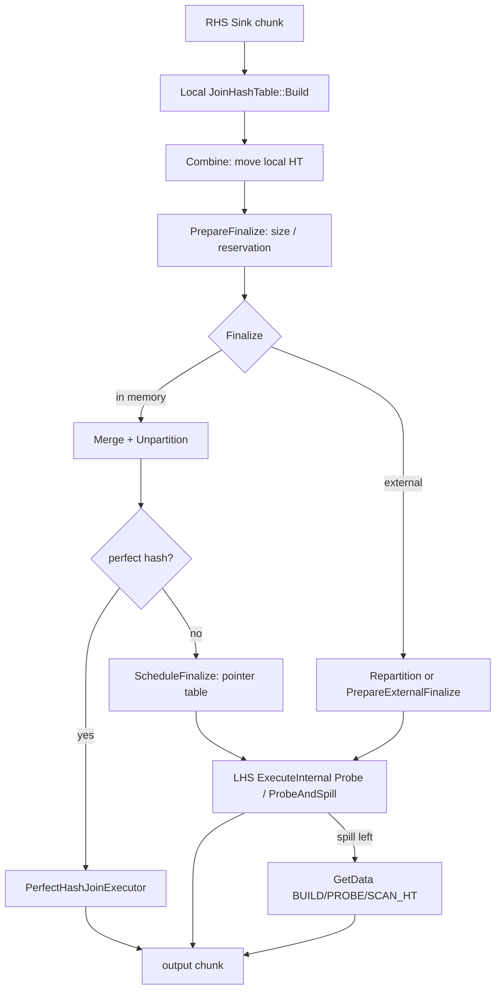

# 第20章 ハッシュ結合

> **本章で読むソース**
>
> - [src/execution/operator/join/physical_hash_join.cpp](https://github.com/duckdb/duckdb/blob/v1.5.4/src/execution/operator/join/physical_hash_join.cpp)
> - [src/execution/join_hashtable.cpp](https://github.com/duckdb/duckdb/blob/v1.5.4/src/execution/join_hashtable.cpp)
> - [src/execution/operator/join/perfect_hash_join_executor.cpp](https://github.com/duckdb/duckdb/blob/v1.5.4/src/execution/operator/join/perfect_hash_join_executor.cpp)
> - [src/execution/operator/join/physical_join.cpp](https://github.com/duckdb/duckdb/blob/v1.5.4/src/execution/operator/join/physical_join.cpp)

## この章の狙い

等値結合の主経路である `PhysicalHashJoin` を追う。
build 側の sink、`Finalize`、probe 側の operator、メモリ不足時の外部化 partition、そして RIGHT/OUTER や out-of-core 時の source 状態機械を、所有権と合わせて読む。

## 前提

物理プランでの選択は第14章、パイプライン分割は第16章を前提とする。
`PhysicalJoin::BuildPipelines` は probe パイプラインに join を operator として載せ、RHS build 用の子 `MetaPipeline` では join を sink にする。

## Global と Local のハッシュ表

`HashJoinGlobalSinkState` は全域の `JoinHashTable`（`unique_ptr`）と `TemporaryMemoryState` を持つ。
各スレッドの `HashJoinLocalSinkState` も独自の `JoinHashTable` を持ち、build 中はローカルへ追記する。
`Combine` でローカル表が `local_hash_tables` へ `move` され、グローバル表への統合は `Finalize` 側が担う。

[src/execution/operator/join/physical_hash_join.cpp L221-L255](https://github.com/duckdb/duckdb/blob/v1.5.4/src/execution/operator/join/physical_hash_join.cpp#L221-L255)

```cpp
class HashJoinLocalSinkState : public LocalSinkState {
public:
	HashJoinLocalSinkState(const PhysicalHashJoin &op, ClientContext &context, HashJoinGlobalSinkState &gstate)
	    : join_key_executor(context) {
		auto &allocator = BufferAllocator::Get(context);

		for (auto &cond : op.conditions) {
			join_key_executor.AddExpression(*cond.right);
		}
		join_keys.Initialize(allocator, op.condition_types);

		if (!op.payload_columns.col_types.empty()) {
			payload_chunk.Initialize(allocator, op.payload_columns.col_types);
		}

		hash_table = op.InitializeHashTable(context);
		hash_table->GetSinkCollection().InitializeAppendState(append_state);

		gstate.active_local_states++;

		if (op.filter_pushdown) {
			local_filter_state = op.filter_pushdown->GetLocalState(*gstate.global_filter_state);
		}
	}

public:
	PartitionedTupleDataAppendState append_state;

	ExpressionExecutor join_key_executor;
	DataChunk join_keys;

	DataChunk payload_chunk;

	//! Thread-local HT
	unique_ptr<JoinHashTable> hash_table;

	unique_ptr<JoinFilterLocalState> local_filter_state;
};
```

## build 側 Sink

RHS チャンクが来ると、条件式の右辺を `ExpressionExecutor` で評価し、payload 列を参照しつつローカル HT へ `Build` する。
フィルタプッシュダウンがあるときは、build キー上の min/max 集約も合わせて進める。

[src/execution/operator/join/physical_hash_join.cpp L331-L353](https://github.com/duckdb/duckdb/blob/v1.5.4/src/execution/operator/join/physical_hash_join.cpp#L331-L353)

```cpp
SinkResultType PhysicalHashJoin::Sink(ExecutionContext &context, DataChunk &chunk, OperatorSinkInput &input) const {
	auto &gstate = input.global_state.Cast<HashJoinGlobalSinkState>();
	auto &lstate = input.local_state.Cast<HashJoinLocalSinkState>();

	// resolve the join keys for the right chunk
	lstate.join_keys.Reset();
	lstate.join_key_executor.Execute(chunk, lstate.join_keys);

	if (filter_pushdown && !gstate.skip_filter_pushdown) {
		filter_pushdown->Sink(lstate.join_keys, *lstate.local_filter_state);
	}

	if (payload_columns.col_types.empty()) { // there are only keys: place an empty chunk in the payload
		lstate.payload_chunk.SetCardinality(chunk.size());
	} else { // there are payload columns
		lstate.payload_chunk.ReferenceColumns(chunk, payload_columns.col_idxs);
	}

	// build the HT
	lstate.hash_table->Build(lstate.append_state, lstate.join_keys, lstate.payload_chunk);

	return SinkResultType::NEED_MORE_INPUT;
}
```

`JoinHashTable::Build` はキーと payload を 1 つの source chunk に並べ、等値キーをハッシュして `sink_collection`（radix 分割された `PartitionedTupleData`）へ追記する。
この段階ではポインタ表へ挿さず、行データを蓄積するだけである。

[src/execution/join_hashtable.cpp L403-L447](https://github.com/duckdb/duckdb/blob/v1.5.4/src/execution/join_hashtable.cpp#L403-L447)

```cpp
	// build a chunk to append to the data collection [keys, payload, (optional "found" boolean), hash]
	DataChunk source_chunk;
	source_chunk.InitializeEmpty(layout_ptr->GetTypes());
	for (idx_t i = 0; i < keys.ColumnCount(); i++) {
		source_chunk.data[i].Reference(keys.data[i]);
	}
	idx_t col_offset = keys.ColumnCount();
	D_ASSERT(build_types.size() == payload.ColumnCount());
	for (idx_t i = 0; i < payload.ColumnCount(); i++) {
		source_chunk.data[col_offset + i].Reference(payload.data[i]);
	}
	col_offset += payload.ColumnCount();
	if (PropagatesBuildSide(join_type)) {
		// for FULL/RIGHT OUTER joins initialize the "found" boolean to false
		source_chunk.data[col_offset].Reference(vfound);
		col_offset++;
	}
	Vector hash_values(LogicalType::HASH);
	source_chunk.data[col_offset].Reference(hash_values);
	source_chunk.SetCardinality(keys);

	// ToUnifiedFormat the source chunk
	TupleDataCollection::ToUnifiedFormat(append_state.chunk_state, source_chunk);

	// prepare the keys for processing
	const SelectionVector *current_sel;
	SelectionVector sel(STANDARD_VECTOR_SIZE);
	idx_t added_count = PrepareKeys(keys, append_state.chunk_state.vector_data, current_sel, sel, true);
	if (added_count < keys.size()) {
		has_null = true;
	}
	if (added_count == 0) {
		return;
	}

	// hash the keys and obtain an entry in the list
	// note that we only hash the keys used in the equality comparison
	Hash(keys, *current_sel, added_count, hash_values);

	// Re-reference and ToUnifiedFormat the hash column after computing it
	source_chunk.data[col_offset].Reference(hash_values);
	hash_values.ToUnifiedFormat(source_chunk.size(), append_state.chunk_state.vector_data.back().unified);

	// We already called TupleDataCollection::ToUnifiedFormat, so we can AppendUnified here
	sink_collection->AppendUnified(append_state, source_chunk, *current_sel, added_count);
}
```

## Combine と PrepareFinalize

`Combine` はローカル HT の所有権を `gstate.local_hash_tables` へ移す。
メモリ予約の再計算はまだ行わず、`PrepareFinalize` までゼロ予約に戻すことがある。

[src/execution/operator/join/physical_hash_join.cpp L359-L379](https://github.com/duckdb/duckdb/blob/v1.5.4/src/execution/operator/join/physical_hash_join.cpp#L359-L379)

```cpp
SinkCombineResultType PhysicalHashJoin::Combine(ExecutionContext &context, OperatorSinkCombineInput &input) const {
	auto &gstate = input.global_state.Cast<HashJoinGlobalSinkState>();
	auto &lstate = input.local_state.Cast<HashJoinLocalSinkState>();

	lstate.hash_table->GetSinkCollection().FlushAppendState(lstate.append_state);
	auto guard = gstate.Lock();
	gstate.local_hash_tables.push_back(std::move(lstate.hash_table));
	if (gstate.local_hash_tables.size() == gstate.active_local_states) {
		// Set to 0 until PrepareFinalize
		gstate.temporary_memory_state->SetZero();
	}

	auto &client_profiler = QueryProfiler::Get(context.client);
	context.thread.profiler.Flush(*this);
	client_profiler.Flush(context.thread.profiler);
	if (filter_pushdown && !gstate.skip_filter_pushdown) {
		filter_pushdown->Combine(*gstate.global_filter_state, *lstate.local_filter_state);
	}

	return SinkCombineResultType::FINISHED;
}
```

`PrepareFinalize` は全ローカル表の合計サイズと最大 partition サイズを測り、probe 側の radix 作業領域も足して `TemporaryMemoryManager` に最小予約と残量を渡す。
JOIN_BUILD 同士の Event 鎖（第16章）はこの値を揃えてから Finalize へ進むために存在する。

[src/execution/operator/join/physical_hash_join.cpp L450-L465](https://github.com/duckdb/duckdb/blob/v1.5.4/src/execution/operator/join/physical_hash_join.cpp#L450-L465)

```cpp
void PhysicalHashJoin::PrepareFinalize(ClientContext &context, GlobalSinkState &global_state) const {
	auto &gstate = global_state.Cast<HashJoinGlobalSinkState>();
	const auto &ht = *gstate.hash_table;

	gstate.total_size =
	    ht.GetTotalSize(gstate.local_hash_tables, gstate.max_partition_size, gstate.max_partition_count);
	gstate.probe_side_requirement =
	    GetPartitioningSpaceRequirement(context, children[0].get().GetTypes(), ht.GetRadixBits(), gstate.num_threads);
	const auto max_partition_ht_size =
	    gstate.max_partition_size + gstate.hash_table->PointerTableSize(gstate.max_partition_count);
	gstate.temporary_memory_state->SetMinimumReservation(max_partition_ht_size + gstate.probe_side_requirement);

	bool all_constant;
	gstate.temporary_memory_state->SetMaterializationPenalty(GetTupleWidth(children[0].get().GetTypes(), all_constant));
	gstate.temporary_memory_state->SetRemainingSize(gstate.total_size);
}
```

## Finalize：インメモリと外部化

`Finalize` は予約メモリと合計サイズを比較し、足りなければ `external` を立てる。
外部化時は負荷係数を下げて再評価し、なお足りなければ radix ビットを増やして再パーティション Event を挿すか、`PrepareExternalFinalize` で一部 partition だけを本チャンク集合へ載せる。
インメモリ時はローカル表を `Merge` し、`Unpartition` したうえで perfect hash 可否を試し、だめなら通常のポインタ表構築（`ScheduleFinalize`）へ進む。

[src/execution/operator/join/physical_hash_join.cpp L920-L980](https://github.com/duckdb/duckdb/blob/v1.5.4/src/execution/operator/join/physical_hash_join.cpp#L920-L980)

```cpp
SinkFinalizeType PhysicalHashJoin::Finalize(Pipeline &pipeline, Event &event, ClientContext &context,
                                            OperatorSinkFinalizeInput &input) const {
	auto &sink = input.global_state.Cast<HashJoinGlobalSinkState>();
	auto &ht = *sink.hash_table;

	sink.temporary_memory_state->UpdateReservation(context);
	sink.external = sink.temporary_memory_state->GetReservation() < sink.total_size;
	if (sink.external) {
		// For external join we reduce the load factor, this may even prevent the external join altogether
		ht.load_factor = JoinHashTable::EXTERNAL_LOAD_FACTOR;

		idx_t temp_max_partition_size;
		idx_t temp_max_partition_count;
		idx_t temp_total_size =
		    ht.GetTotalSize(sink.local_hash_tables, temp_max_partition_size, temp_max_partition_count);

		if (temp_total_size < sink.temporary_memory_state->GetReservation()) {
			// We prevented the external join by reducing the load factor. Update the state accordingly
			sink.temporary_memory_state->SetMinimumReservation(temp_total_size);
			sink.temporary_memory_state->SetRemainingSizeAndUpdateReservation(context, temp_total_size);

			sink.total_size = temp_total_size;
			sink.max_partition_size = temp_max_partition_size;
			sink.max_partition_count = temp_max_partition_count;

			sink.external = false;
		}
	}
	DUCKDB_LOG(context, PhysicalOperatorLogType, *this, "PhysicalHashJoin", "Finalize",
	           {{"external", to_string(sink.external)}});
	if (sink.external) {
		// External Hash Join
		sink.perfect_join_executor.reset();

		const auto max_partition_ht_size = sink.max_partition_size + ht.PointerTableSize(sink.max_partition_count);
		const auto very_very_skewed = // No point in repartitioning if it's this skewed
		    static_cast<double>(max_partition_ht_size) >= 0.8 * static_cast<double>(sink.total_size);
		if (!very_very_skewed &&
		    (max_partition_ht_size + sink.probe_side_requirement) > sink.temporary_memory_state->GetReservation()) {
			// We have to repartition
			const auto radix_bits_before = ht.GetRadixBits();
			ht.SetRepartitionRadixBits(sink.temporary_memory_state->GetReservation(), sink.max_partition_size,
			                           sink.max_partition_count);
			DUCKDB_LOG(context, PhysicalOperatorLogType, *this, "PhysicalHashJoin", "Repartition",
			           {{"partitions_before", to_string(RadixPartitioning::NumberOfPartitions(radix_bits_before))},
			            {"partitions_after", to_string(RadixPartitioning::NumberOfPartitions(ht.GetRadixBits()))}});
			auto new_event = make_shared_ptr<HashJoinRepartitionEvent>(pipeline, *this, sink, sink.local_hash_tables);
			event.InsertEvent(std::move(new_event));
		} else {
			// No repartitioning!
			for (auto &local_ht : sink.local_hash_tables) {
				ht.Merge(*local_ht);
			}
			sink.local_hash_tables.clear();
			D_ASSERT(sink.temporary_memory_state->GetReservation() >= sink.probe_side_requirement);
			sink.hash_table->PrepareExternalFinalize(sink.temporary_memory_state->GetReservation() -
			                                         sink.probe_side_requirement);
			sink.ScheduleFinalize(pipeline, event);
		}
		sink.finalized = true;
		return SinkFinalizeType::READY;
	}
```

インメモリ側は続けてローカル表の統合と perfect hash 判定へ進む。

[src/execution/operator/join/physical_hash_join.cpp L983-L1025](https://github.com/duckdb/duckdb/blob/v1.5.4/src/execution/operator/join/physical_hash_join.cpp#L983-L1025)

```cpp
	// In-memory Hash Join
	for (auto &local_ht : sink.local_hash_tables) {
		ht.Merge(*local_ht);
	}
	sink.local_hash_tables.clear();
	ht.Unpartition();

	Value min;
	Value max;
	unique_ptr<DataChunk> filter_min_max = nullptr;

	if (filter_pushdown && !sink.skip_filter_pushdown && ht.Count() > 0) {
		filter_min_max = filter_pushdown->FinalizeMinMax(*sink.global_filter_state);
		min = filter_min_max->data[0].GetValue(0);
		max = filter_min_max->data[1].GetValue(0);
	} else if (TypeIsIntegral(conditions[0].right->return_type.InternalType())) {
		min = Value::MinimumValue(conditions[0].right->return_type);
		max = Value::MaximumValue(conditions[0].right->return_type);
	}

	// check for possible perfect hash table
	auto use_perfect_hash = sink.perfect_join_executor->CanDoPerfectHashJoin(*this, min, max);
	if (use_perfect_hash) {
		D_ASSERT(ht.equality_types.size() == 1);
		auto key_type = ht.equality_types[0];
		use_perfect_hash = sink.perfect_join_executor->BuildPerfectHashTable(key_type);
	}

	if (filter_min_max) {
		filter_pushdown->FinalizeFilters(context, &ht, *this, std::move(filter_min_max), use_perfect_hash,
		                                 &sink.deferred_bloom_filters);
	}

	// In case of a large build side or duplicates, use regular hash join
	if (!use_perfect_hash) {
		sink.perfect_join_executor.reset();
		sink.ScheduleFinalize(pipeline, event);
	}
	sink.finalized = true;
	if (ht.Count() == 0 && EmptyResultIfRHSIsEmpty()) {
		return SinkFinalizeType::NO_OUTPUT_POSSIBLE;
	}
	return SinkFinalizeType::READY;
}
```

ポインタ表構築本体は `JoinHashTable::Finalize` である。
チャンク範囲ごとに保存済みハッシュを読み、`InsertHashes` で配列へ鎖を張る。

[src/execution/join_hashtable.cpp L775-L796](https://github.com/duckdb/duckdb/blob/v1.5.4/src/execution/join_hashtable.cpp#L775-L796)

```cpp
void JoinHashTable::Finalize(idx_t chunk_idx_from, idx_t chunk_idx_to, bool parallel) {
	// Pointer table should be allocated
	D_ASSERT(hash_map.get());

	Vector hashes(LogicalType::HASH);
	auto hash_data = FlatVector::GetData<hash_t>(hashes);

	TupleDataChunkIterator iterator(*data_collection, TupleDataPinProperties::KEEP_EVERYTHING_PINNED, chunk_idx_from,
	                                chunk_idx_to, false);
	const auto row_locations = iterator.GetRowLocations();

	InsertState insert_state(*this);
	do {
		const auto count = iterator.GetCurrentChunkCount();
		for (idx_t i = 0; i < count; i++) {
			hash_data[i] = Load<hash_t>(row_locations[i] + pointer_offset);
		}
		TupleDataChunkState &chunk_state = iterator.GetChunkState();

		InsertHashes(hashes, count, chunk_state, insert_state, parallel);
	} while (iterator.Next());
}
```

## probe 側 Operator

probe パイプラインでは join が中間 operator になる。
空 RHS、perfect hash、通常 HT、外部化で分岐し、通常経路は `Probe` のあと `ScanStructure::Next` で結合結果チャンクを組み立てる。

[src/execution/operator/join/physical_hash_join.cpp L1080-L1134](https://github.com/duckdb/duckdb/blob/v1.5.4/src/execution/operator/join/physical_hash_join.cpp#L1080-L1134)

```cpp
OperatorResultType PhysicalHashJoin::ExecuteInternal(ExecutionContext &context, DataChunk &input, DataChunk &chunk,
                                                     GlobalOperatorState &gstate, OperatorState &state_p) const {
	auto &state = state_p.Cast<HashJoinOperatorState>();
	auto &sink = sink_state->Cast<HashJoinGlobalSinkState>();
	D_ASSERT(sink.finalized);
	D_ASSERT(!sink.scanned_data);

	if (sink.hash_table->Count() == 0) {
		if (EmptyResultIfRHSIsEmpty()) {
			return OperatorResultType::FINISHED;
		}
		state.lhs_output.ReferenceColumns(input, lhs_output_columns.col_idxs);
		ConstructEmptyJoinResult(sink.hash_table->join_type, sink.hash_table->has_null, state.lhs_output, chunk);
		return OperatorResultType::NEED_MORE_INPUT;
	}

	if (sink.perfect_join_executor) {
		D_ASSERT(!sink.external);
		state.lhs_output.ReferenceColumns(input, lhs_output_columns.col_idxs);
		return sink.perfect_join_executor->ProbePerfectHashTable(context, input, state.lhs_output, chunk,
		                                                         *state.perfect_hash_join_state);
	}

	if (sink.external && !state.initialized) {
		// some initialization for external hash join
		if (!sink.probe_spill) {
			sink.InitializeProbeSpill();
		}
		state.spill_state = sink.probe_spill->RegisterThread();
		state.initialized = true;
	}

	if (state.scan_structure.is_null) {
		// probe the HT, start by resolving the join keys for the left chunk
		state.lhs_join_keys.Reset();
		state.probe_executor.Execute(input, state.lhs_join_keys);

		// perform the actual probe
		if (sink.external) {
			sink.hash_table->ProbeAndSpill(state.scan_structure, state.lhs_join_keys, state.join_key_state,
			                               state.probe_state, input, *sink.probe_spill, state.spill_state,
			                               state.spill_chunk);
		} else {
			sink.hash_table->Probe(state.scan_structure, state.lhs_join_keys, state.join_key_state, state.probe_state);
		}
	}

	state.lhs_output.ReferenceColumns(input, lhs_output_columns.col_idxs);
	state.scan_structure.Next(state.lhs_join_keys, state.lhs_output, chunk);

	if (state.scan_structure.PointersExhausted() && chunk.size() == 0) {
		state.scan_structure.is_null = true;
		return OperatorResultType::NEED_MORE_INPUT;
	}
	return OperatorResultType::HAVE_MORE_OUTPUT;
}
```

外部化 probe では、現在ピンしている partition に入るキーだけを即時 probe し、残りは `ProbeSpill` へ退避する。

[src/execution/join_hashtable.cpp L1679-L1714](https://github.com/duckdb/duckdb/blob/v1.5.4/src/execution/join_hashtable.cpp#L1679-L1714)

```cpp
void JoinHashTable::ProbeAndSpill(ScanStructure &scan_structure, DataChunk &probe_keys, TupleDataChunkState &key_state,
                                  ProbeState &probe_state, DataChunk &probe_chunk, ProbeSpill &probe_spill,
                                  ProbeSpillLocalAppendState &spill_state, DataChunk &spill_chunk) {
	// hash all the keys
	Vector hashes(LogicalType::HASH);
	Hash(probe_keys, *FlatVector::IncrementalSelectionVector(), probe_keys.size(), hashes);

	// find out which keys we can match with the current pinned partitions
	SelectionVector true_sel(STANDARD_VECTOR_SIZE);
	SelectionVector false_sel(STANDARD_VECTOR_SIZE);
	const auto true_count =
	    RadixPartitioning::Select(hashes, FlatVector::IncrementalSelectionVector(), probe_keys.size(), radix_bits,
	                              current_partitions, &true_sel, &false_sel);
	const auto false_count = probe_keys.size() - true_count;

	// can't probe these values right now, append to spill
	spill_chunk.Reset();
	spill_chunk.Reference(probe_chunk);
	spill_chunk.data.back().Reference(hashes);
	spill_chunk.Slice(false_sel, false_count);
	probe_spill.Append(spill_chunk, spill_state);

	// slice the stuff we CAN probe right now
	hashes.Slice(true_sel, true_count);
	probe_keys.Slice(true_sel, true_count);
	probe_chunk.Slice(true_sel, true_count);

	const SelectionVector *current_sel;
	InitializeScanStructure(scan_structure, probe_keys, key_state, current_sel);
	if (scan_structure.count == 0) {
		return;
	}

	// now initialize the pointers of the scan structure based on the hashes
	GetRowPointers(probe_keys, key_state, probe_state, hashes, current_sel, scan_structure.count,
	               scan_structure.pointers, scan_structure.sel_vector, scan_structure.has_null_value_filter);
}
```

## 外部化の partition と source

`PrepareExternalFinalize` は未完了 partition をサイズ順に並べ、予約に収まるぶんだけを `data_collection` へ載せ、`current_partitions` マスクを更新する。
残りの partition は後続ラウンドで処理する。

[src/execution/join_hashtable.cpp L1617-L1676](https://github.com/duckdb/duckdb/blob/v1.5.4/src/execution/join_hashtable.cpp#L1617-L1676)

```cpp
bool JoinHashTable::PrepareExternalFinalize(const idx_t max_ht_size) {
	if (finalized) {
		Reset();
	}

	const auto num_partitions = RadixPartitioning::NumberOfPartitions(radix_bits);
	D_ASSERT(current_partitions.Capacity() == num_partitions);
	D_ASSERT(completed_partitions.Capacity() == num_partitions);
	D_ASSERT(current_partitions.CheckAllInvalid(num_partitions));

	if (completed_partitions.CheckAllValid(num_partitions)) {
		return false; // All partitions are done
	}

	// Create vector with unfinished partition indices
	auto &partitions = sink_collection->GetPartitions();
	auto min_partition_size = NumericLimits<idx_t>::Maximum();
	vector<idx_t> partition_indices;
	partition_indices.reserve(num_partitions);
	for (idx_t partition_idx = 0; partition_idx < num_partitions; partition_idx++) {
		if (completed_partitions.RowIsValidUnsafe(partition_idx)) {
			continue;
		}
		partition_indices.push_back(partition_idx);
		// Keep track of min partition size
		const auto size =
		    partitions[partition_idx]->SizeInBytes() + PointerTableSize(partitions[partition_idx]->Count());
		min_partition_size = MinValue(min_partition_size, size);
	}

	// Sort partitions by size, from small to large
	std::stable_sort(partition_indices.begin(), partition_indices.end(), [&](const idx_t &lhs, const idx_t &rhs) {
		const auto lhs_size = partitions[lhs]->SizeInBytes() + PointerTableSize(partitions[lhs]->Count());
		const auto rhs_size = partitions[rhs]->SizeInBytes() + PointerTableSize(partitions[rhs]->Count());
		// We divide by min_partition_size, effectively rouding everything down to a multiple of min_partition_size
		// Makes it so minor differences in partition sizes don't mess up the original order
		// Retaining as much of the original order as possible reduces I/O (partition idx determines eviction queue idx)
		return lhs_size / min_partition_size < rhs_size / min_partition_size;
	});

	// Determine which partitions should go next
	idx_t count = 0;
	idx_t data_size = 0;
	for (const auto &partition_idx : partition_indices) {
		D_ASSERT(!completed_partitions.RowIsValidUnsafe(partition_idx));
		const auto incl_count = count + partitions[partition_idx]->Count();
		const auto incl_data_size = data_size + partitions[partition_idx]->SizeInBytes();
		const auto incl_ht_size = incl_data_size + PointerTableSize(incl_count);
		if (count > 0 && incl_ht_size > max_ht_size) {
			break; // Always add at least one partition
		}
		count = incl_count;
		data_size = incl_data_size;
		current_partitions.SetValidUnsafe(partition_idx);     // Mark as currently active
		data_collection->Combine(*partitions[partition_idx]); // Move partition to the main data collection
		completed_partitions.SetValidUnsafe(partition_idx);   // Also already mark as done
	}
	D_ASSERT(Count() == count);

	return true;
}
```

外部結合や RIGHT/OUTER では、build 完了後に join 自身が source になる。
`GetDataInternal` は `HashJoinSourceStage`（BUILD / PROBE / SCAN_HT）を進め、タスクが尽きたら次ステージへ進むか `BlockSource` する。

[src/execution/operator/join/physical_hash_join.cpp L1540-L1576](https://github.com/duckdb/duckdb/blob/v1.5.4/src/execution/operator/join/physical_hash_join.cpp#L1540-L1576)

```cpp
SourceResultType PhysicalHashJoin::GetDataInternal(ExecutionContext &context, DataChunk &chunk,
                                                   OperatorSourceInput &input) const {
	auto &sink = sink_state->Cast<HashJoinGlobalSinkState>();
	auto &gstate = input.global_state.Cast<HashJoinGlobalSourceState>();
	auto &lstate = input.local_state.Cast<HashJoinLocalSourceState>();
	sink.scanned_data = true;

	if (!sink.external && !PropagatesBuildSide(join_type)) {
		auto guard = gstate.Lock();
		if (gstate.global_stage != HashJoinSourceStage::DONE) {
			gstate.global_stage = HashJoinSourceStage::DONE;
			sink.hash_table->Reset();
			sink.temporary_memory_state->SetZero();
		}
		return SourceResultType::FINISHED;
	}

	if (gstate.global_stage == HashJoinSourceStage::INIT) {
		gstate.Initialize(sink);
	}

	// Any call to GetData must produce tuples, otherwise the pipeline executor thinks that we're done
	// Therefore, we loop until we've produced tuples, or until the operator is actually done
	while (gstate.global_stage != HashJoinSourceStage::DONE && chunk.size() == 0) {
		if (!lstate.TaskFinished() || gstate.AssignTask(sink, lstate)) {
			lstate.ExecuteTask(sink, gstate, chunk);
		} else {
			auto guard = gstate.Lock();
			if (gstate.TryPrepareNextStage(sink) || gstate.global_stage == HashJoinSourceStage::DONE) {
				gstate.UnblockTasks(guard);
			} else {
				return gstate.BlockSource(guard, input.interrupt_state);
			}
		}
	}

	return chunk.size() == 0 ? SourceResultType::FINISHED : SourceResultType::HAVE_MORE_OUTPUT;
}
```

## 処理の流れ



RHS build が完了してから LHS probe が走るのは、第16章の `JOIN_BUILD` 依存が Event DAG に写ることによる。
外部化では probe が spill を残し、同じ演算子の source 側が partition ラウンドを回す。

## 高速化と最適化の工夫

`PerfectHashJoinExecutor` が配列直引きに切り替えるのは、条件が揃ったときだけである。
`CanDoPerfectHashJoin` は INNER join、整数型の単一等値条件、RHS に STRUCT / LIST / ARRAY がないこと、`build_range <= 1048576`、`ht.Count() <= build_range` を要求する。
これらを満たしても、`BuildPerfectHashTable` が走査中に重複キーを検出すると false を返し、通常のポインタ表構築へ戻る。

[src/execution/operator/join/perfect_hash_join_executor.cpp L66-L120](https://github.com/duckdb/duckdb/blob/v1.5.4/src/execution/operator/join/perfect_hash_join_executor.cpp#L66-L120)

```cpp
bool PerfectHashJoinExecutor::CanDoPerfectHashJoin(const PhysicalHashJoin &op, const Value &min, const Value &max) {
	if (perfect_join_statistics.is_build_small) {
		return true; // Already true based on static statistics
	}

	// We only do this optimization for inner joins with one integer equality condition
	const auto key_type = op.conditions[0].left->return_type;
	if (op.join_type != JoinType::INNER || op.conditions.size() != 1 ||
	    op.conditions[0].comparison != ExpressionType::COMPARE_EQUAL || !TypeIsInteger(key_type.InternalType())) {
		return false;
	}

	// We bail out if there are nested types on the RHS
	for (auto &type : op.children[1].get().GetTypes()) {
		switch (type.InternalType()) {
		case PhysicalType::STRUCT:
		case PhysicalType::LIST:
		case PhysicalType::ARRAY:
			return false;
		default:
			break;
		}
	}

	// And when the build range is smaller than the threshold
	perfect_join_statistics.build_min = min;
	perfect_join_statistics.build_max = max;
	hugeint_t min_value, max_value;
	if (!ExtractNumericValue(perfect_join_statistics.build_min, min_value) ||
	    !ExtractNumericValue(perfect_join_statistics.build_max, max_value)) {
		return false;
	}
	if (max_value < min_value) {
		return false; // Empty table
	}

	hugeint_t build_range;
	if (!TrySubtractOperator::Operation(max_value, min_value, build_range)) {
		return false;
	}

	// The max size our build must have to run the perfect HJ
	static constexpr idx_t MAX_BUILD_SIZE = 1048576;
	if (build_range > Hugeint::Convert(MAX_BUILD_SIZE)) {
		return false;
	}
	perfect_join_statistics.build_range = NumericCast<idx_t>(build_range);

	// If count is larger than range (duplicates), we bail out
	if (ht.Count() > perfect_join_statistics.build_range) {
		return false;
	}

	perfect_join_statistics.is_build_small = true;
	return true;
}
```

重複検出は build 走査の bitmaps による。
同じ添字が既に valid なら false を返す。

[src/execution/operator/join/perfect_hash_join_executor.cpp L211-L239](https://github.com/duckdb/duckdb/blob/v1.5.4/src/execution/operator/join/perfect_hash_join_executor.cpp#L211-L239)

```cpp
template <typename T>
bool PerfectHashJoinExecutor::TemplatedFillSelectionVectorBuild(Vector &source, SelectionVector &sel_vec,
                                                                SelectionVector &seq_sel_vec, idx_t count) {
	if (perfect_join_statistics.build_min.IsNull() || perfect_join_statistics.build_max.IsNull()) {
		return false;
	}
	auto min_value = perfect_join_statistics.build_min.GetValueUnsafe<T>();
	auto max_value = perfect_join_statistics.build_max.GetValueUnsafe<T>();
	UnifiedVectorFormat vector_data;
	source.ToUnifiedFormat(count, vector_data);
	const auto data = vector_data.GetData<T>();
	// generate the selection vector
	for (idx_t i = 0, sel_idx = 0; i < count; ++i) {
		auto data_idx = vector_data.sel->get_index(i);
		auto input_value = data[data_idx];
		// add index to selection vector if value in the range
		if (min_value <= input_value && input_value <= max_value) {
			auto idx = UnsafeNumericCast<idx_t>(input_value - min_value); // subtract min value to get the idx position
			sel_vec.set_index(sel_idx, idx);
			if (bitmap_build_idx.RowIsValidUnsafe(idx)) {
				return false;
			} else {
				bitmap_build_idx.SetValidUnsafe(idx);
				unique_keys++;
			}
			seq_sel_vec.set_index(sel_idx++, i);
		}
	}
	return true;
}
```

外部化直前に `EXTERNAL_LOAD_FACTOR` へ下げてサイズを再計算し、可能ならディスク溢れ自体を避ける。
フィルタプッシュダウンは build 時の min/max（と任意で bloom）を probe 側へ渡し、走査前に候補を絞る。

## まとめ

`PhysicalHashJoin` はローカル HT への Sink、`Combine` での所有権集約、`Finalize` でのインメモリ / 外部化分岐、probe operator、必要なら source による partition ラウンドを 1 クラスが担う。
build 行データの実体は `sink_collection` の `PartitionedTupleData` と、選択中 partition を移した `data_collection`（`TupleDataCollection`）にある。
`hash_map` のポインタ表は行データを所有せず、保存済みハッシュから行アドレスへの衝突鎖を張る索引である。
メモリ契約は `TemporaryMemoryState` が仲介する。

## 関連する章

- 第14章（物理プラン生成）
- 第15章（パイプライン実行）
- 第16章（パイプライン構築とスケジューリング）
- 第21章（集約）
