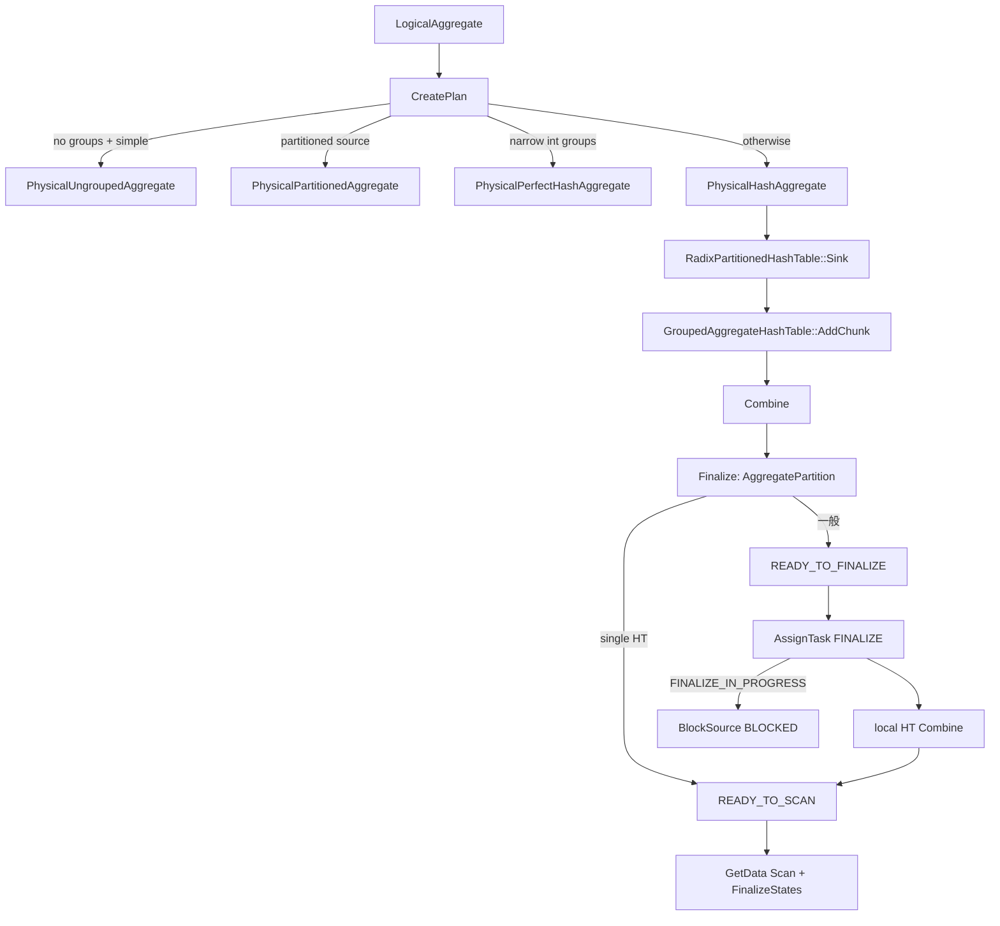

# 第21章 集約

> **本章で読むソース**
>
> - [src/execution/physical_plan/plan_aggregate.cpp](https://github.com/duckdb/duckdb/blob/v1.5.4/src/execution/physical_plan/plan_aggregate.cpp)
> - [src/execution/operator/aggregate/physical_ungrouped_aggregate.cpp](https://github.com/duckdb/duckdb/blob/v1.5.4/src/execution/operator/aggregate/physical_ungrouped_aggregate.cpp)
> - [src/execution/operator/aggregate/physical_perfecthash_aggregate.cpp](https://github.com/duckdb/duckdb/blob/v1.5.4/src/execution/operator/aggregate/physical_perfecthash_aggregate.cpp)
> - [src/execution/operator/aggregate/physical_partitioned_aggregate.cpp](https://github.com/duckdb/duckdb/blob/v1.5.4/src/execution/operator/aggregate/physical_partitioned_aggregate.cpp)
> - [src/execution/operator/aggregate/physical_hash_aggregate.cpp](https://github.com/duckdb/duckdb/blob/v1.5.4/src/execution/operator/aggregate/physical_hash_aggregate.cpp)
> - [src/execution/radix_partitioned_hashtable.cpp](https://github.com/duckdb/duckdb/blob/v1.5.4/src/execution/radix_partitioned_hashtable.cpp)
> - [src/execution/aggregate_hashtable.cpp](https://github.com/duckdb/duckdb/blob/v1.5.4/src/execution/aggregate_hashtable.cpp)

## この章の狙い

集約の物理演算子選択から実行本体までを追う。
入口は `plan_aggregate.cpp` の分岐であり、無グループ、perfect hash、パーティション前提、一般ハッシュの 4 系統に分かれる。
一般経路では `PhysicalHashAggregate` が `RadixPartitionedHashTable` を握り、行ごとの状態は `GroupedAggregateHashTable` が更新する。

## 前提

第14章で集約の物理選択の概観を見た。
本章はその分岐の実装と、選ばれた演算子の sink / source 契約を掘る。
式の評価自体は第17章の領域である。

## 物理演算子の選択

`CreatePlan(LogicalAggregate &)` は子プランを作ったあと、集約関数が simple update を持つか、グループの有無、パーティション可否、perfect hash 可否の順に演算子を選ぶ。
グループなしで simple update があれば `PhysicalUngroupedAggregate`、なければグループなしでも `PhysicalHashAggregate` になる。
グループありでは partitioned、perfect、通常ハッシュの順に試みる。

[src/execution/physical_plan/plan_aggregate.cpp L235-L303](https://github.com/duckdb/duckdb/blob/v1.5.4/src/execution/physical_plan/plan_aggregate.cpp#L235-L303)

```cpp
PhysicalOperator &PhysicalPlanGenerator::CreatePlan(LogicalAggregate &op) {
	D_ASSERT(op.children.size() == 1);

	reference<PhysicalOperator> plan = CreatePlan(*op.children[0]);
	plan = ExtractAggregateExpressions(plan, op.expressions, op.groups, op.grouping_sets);

	bool can_use_simple_aggregation = true;
	for (auto &expression : op.expressions) {
		auto &aggregate = expression->Cast<BoundAggregateExpression>();
		if (!aggregate.function.HasStateSimpleUpdateCallback()) {
			// unsupported aggregate for simple aggregation: use hash aggregation
			can_use_simple_aggregation = false;
			break;
		}
	}

	// Check if all groups are valid
	if (op.group_stats.empty()) {
		op.group_stats.resize(op.groups.size());
	}
	auto group_validity = TupleDataValidityType::CANNOT_HAVE_NULL_VALUES;
	for (const auto &stats : op.group_stats) {
		if (stats && !stats->CanHaveNull()) {
			continue;
		}
		group_validity = TupleDataValidityType::CAN_HAVE_NULL_VALUES;
		break;
	}

	if (op.groups.empty() && op.grouping_sets.size() <= 1) {
		// no groups, check if we can use a simple aggregation
		// special case: aggregate entire columns together
		if (can_use_simple_aggregation) {
			auto &group_by = Make<PhysicalUngroupedAggregate>(op.types, std::move(op.expressions),
			                                                  op.estimated_cardinality, op.distinct_validity);
			group_by.children.push_back(plan);
			return group_by;
		}
		auto &group_by =
		    Make<PhysicalHashAggregate>(context, op.types, std::move(op.expressions), op.estimated_cardinality);
		group_by.children.push_back(plan);
		return group_by;
	}

	// groups! create a GROUP BY aggregator
	// use a partitioned or perfect hash aggregate if possible
	vector<column_t> partition_columns;
	vector<idx_t> required_bits;
	if (can_use_simple_aggregation && CanUsePartitionedAggregate(context, op, plan, partition_columns)) {
		auto &group_by =
		    Make<PhysicalPartitionedAggregate>(context, op.types, std::move(op.expressions), std::move(op.groups),
		                                       std::move(partition_columns), op.estimated_cardinality);
		group_by.children.push_back(plan);
		return group_by;
	}

	if (CanUsePerfectHashAggregate(context, op, required_bits)) {
		auto &group_by = Make<PhysicalPerfectHashAggregate>(context, op.types, std::move(op.expressions),
		                                                    std::move(op.groups), std::move(op.group_stats),
		                                                    std::move(required_bits), op.estimated_cardinality);
		group_by.children.push_back(plan);
		return group_by;
	}

	auto &group_by = Make<PhysicalHashAggregate>(context, op.types, std::move(op.expressions), std::move(op.groups),
	                                             std::move(op.grouping_sets), std::move(op.grouping_functions),
	                                             op.estimated_cardinality, group_validity, op.distinct_validity);
	group_by.children.push_back(plan);
	return group_by;
}
```

`CanUsePerfectHashAggregate` は grouping set が複数、または `grouping_functions` がある場合は拒否する。
グループは整数型に限る。
min/max 統計が無いときでも、INT8 / INT16 / UINT8 / UINT16 なら型の min/max を合成して候補に残す。
それ以外の整数で統計が無ければ拒否する。
範囲からビット幅を積み上げ、`PerfectHtThresholdSetting` を超えた時点で拒否する。
distinct 集約、または state combine callback が無い集約も拒否する。

[src/execution/physical_plan/plan_aggregate.cpp L117-L159](https://github.com/duckdb/duckdb/blob/v1.5.4/src/execution/physical_plan/plan_aggregate.cpp#L117-L159)

```cpp
static bool CanUsePerfectHashAggregate(ClientContext &context, LogicalAggregate &op, vector<idx_t> &bits_per_group) {
	if (op.grouping_sets.size() > 1 || !op.grouping_functions.empty()) {
		return false;
	}
	idx_t perfect_hash_bits = 0;
	for (idx_t group_idx = 0; group_idx < op.groups.size(); group_idx++) {
		auto &group = op.groups[group_idx];
		auto &stats = op.group_stats[group_idx];

		switch (group->return_type.InternalType()) {
		case PhysicalType::INT8:
		case PhysicalType::INT16:
		case PhysicalType::INT32:
		case PhysicalType::INT64:
		case PhysicalType::UINT8:
		case PhysicalType::UINT16:
		case PhysicalType::UINT32:
		case PhysicalType::UINT64:
			break;
		default:
			// we only support simple integer types for perfect hashing
			return false;
		}
		// check if the group has stats available
		auto &group_type = group->return_type;
		if (!stats) {
			// no stats, but we might still be able to use perfect hashing if the type is small enough
			// for small types we can just set the stats to [type_min, type_max]
			switch (group_type.InternalType()) {
			case PhysicalType::INT8:
			case PhysicalType::INT16:
			case PhysicalType::UINT8:
			case PhysicalType::UINT16:
				break;
			default:
				// type is too large and there are no stats: skip perfect hashing
				return false;
			}
			// construct stats with the min and max value of the type
			stats = NumericStats::CreateUnknown(group_type).ToUnique();
			NumericStats::SetMin(*stats, Value::MinimumValue(group_type));
			NumericStats::SetMax(*stats, Value::MaximumValue(group_type));
		}
```

[src/execution/physical_plan/plan_aggregate.cpp L214-L232](https://github.com/duckdb/duckdb/blob/v1.5.4/src/execution/physical_plan/plan_aggregate.cpp#L214-L232)

```cpp
		range += 2;
		// figure out how many bits we need
		idx_t required_bits = RequiredBitsForValue(UnsafeNumericCast<uint32_t>(range));
		bits_per_group.push_back(required_bits);
		perfect_hash_bits += required_bits;
		// check if we have exceeded the bits for the hash
		if (perfect_hash_bits > Settings::Get<PerfectHtThresholdSetting>(context)) {
			// too many bits for perfect hash
			return false;
		}
	}
	for (auto &expression : op.expressions) {
		auto &aggregate = expression->Cast<BoundAggregateExpression>();
		if (aggregate.IsDistinct() || !aggregate.function.HasStateCombineCallback()) {
			// distinct aggregates are not supported in perfect hash aggregates
			return false;
		}
	}
	return true;
}
```

`CanUsePartitionedAggregate` はグループが `TABLE_SCAN` まで辿れる bound reference であり、ソースが単一値パーティションを返すときにだけ真になる。
ここで落ちると perfect / 通常ハッシュへ進む。

## 無グループ集約

`PhysicalUngroupedAggregate` はグループキーを持たず、ローカル状態へそのまま simple update を積む。
チャンクごとに `LocalUngroupedAggregateState::Sink` が `GetStateSimpleUpdateCallback` を呼び、`Combine` でグローバル状態へ畳み込む。

[src/execution/operator/aggregate/physical_ungrouped_aggregate.cpp L339-L365](https://github.com/duckdb/duckdb/blob/v1.5.4/src/execution/operator/aggregate/physical_ungrouped_aggregate.cpp#L339-L365)

```cpp
SinkResultType PhysicalUngroupedAggregate::Sink(ExecutionContext &context, DataChunk &chunk,
                                                OperatorSinkInput &input) const {
	auto &sink = input.local_state.Cast<UngroupedAggregateLocalSinkState>();

	// perform the aggregation inside the local state
	sink.execute_state.Reset();

	if (distinct_data) {
		SinkDistinct(context, chunk, input);
	}

	sink.execute_state.Sink(sink.state, chunk);
	return SinkResultType::NEED_MORE_INPUT;
}

void LocalUngroupedAggregateState::Sink(DataChunk &payload_chunk, idx_t payload_idx, idx_t aggr_idx) {
#ifdef DEBUG
	state.counts[aggr_idx] += payload_chunk.size();
#endif
	auto &aggregate = state.aggregate_expressions[aggr_idx]->Cast<BoundAggregateExpression>();
	idx_t payload_cnt = aggregate.children.size();
	D_ASSERT(payload_idx + payload_cnt <= payload_chunk.data.size());
	auto start_of_input = payload_cnt == 0 ? nullptr : &payload_chunk.data[payload_idx];
	AggregateInputData aggr_input_data(state.bind_data[aggr_idx], allocator);
	aggregate.function.GetStateSimpleUpdateCallback()(start_of_input, aggr_input_data, payload_cnt,
	                                                  state.aggregate_data[aggr_idx].get(), payload_chunk.size());
}
```

## パーティション前提集約

`PhysicalPartitionedAggregate` は入力が既に単一値パーティションである前提で動く。
`RequiredPartitionInfo` が partition columns を要求し、Sink は `local_state.partition_info` の min/max（単一値）から partition key を組み立てる。
ローカル状態は無グループ集約と同じ `LocalUngroupedAggregateState` で、パーティションごとに独立した `GlobalUngroupedAggregateState` へ畳み込む。

[src/execution/operator/aggregate/physical_partitioned_aggregate.cpp L17-L19](https://github.com/duckdb/duckdb/blob/v1.5.4/src/execution/operator/aggregate/physical_partitioned_aggregate.cpp#L17-L19)

```cpp
OperatorPartitionInfo PhysicalPartitionedAggregate::RequiredPartitionInfo() const {
	return OperatorPartitionInfo::PartitionColumns(partitions);
}
```

[src/execution/operator/aggregate/physical_partitioned_aggregate.cpp L93-L116](https://github.com/duckdb/duckdb/blob/v1.5.4/src/execution/operator/aggregate/physical_partitioned_aggregate.cpp#L93-L116)

```cpp
SinkResultType PhysicalPartitionedAggregate::Sink(ExecutionContext &context, DataChunk &chunk,
                                                  OperatorSinkInput &input) const {
	auto &gstate = input.global_state.Cast<PartitionedAggregateGlobalSinkState>();
	auto &lstate = input.local_state.Cast<PartitionedAggregateLocalSinkState>();
	if (!lstate.state) {
		// the local state is not yet initialized for this partition
		// initialize the partition
		child_list_t<Value> partition_values;
		for (idx_t partition_idx = 0; partition_idx < groups.size(); partition_idx++) {
			auto column_name = to_string(partition_idx);
			auto &partition = input.local_state.partition_info.partition_data[partition_idx];
			D_ASSERT(Value::NotDistinctFrom(partition.min_val, partition.max_val));
			partition_values.emplace_back(make_pair(std::move(column_name), partition.min_val));
		}
		lstate.current_partition = Value::STRUCT(std::move(partition_values));

		// initialize the state
		auto &global_aggregate_state = gstate.GetOrCreatePartition(context.client, lstate.current_partition);
		lstate.state = make_uniq<LocalUngroupedAggregateState>(global_aggregate_state);
	}

	// perform the aggregation
	lstate.execute_state.Sink(*lstate.state, chunk);
	return SinkResultType::NEED_MORE_INPUT;
}
```

バッチ境界と Combine は、同じ `gstate.Combine` でローカル状態を当該パーティションのグローバル状態へ統合し、ローカルを空にする。

[src/execution/operator/aggregate/physical_partitioned_aggregate.cpp L65-L74](https://github.com/duckdb/duckdb/blob/v1.5.4/src/execution/operator/aggregate/physical_partitioned_aggregate.cpp#L65-L74)

```cpp
	void Combine(ClientContext &context, PartitionedAggregateLocalSinkState &lstate) {
		if (!lstate.state) {
			// no aggregate state
			return;
		}
		auto &global_state = GetOrCreatePartition(context, lstate.current_partition);
		global_state.Combine(*lstate.state);
		// clear the local aggregate state
		lstate.state.reset();
	}
```

[src/execution/operator/aggregate/physical_partitioned_aggregate.cpp L122-L142](https://github.com/duckdb/duckdb/blob/v1.5.4/src/execution/operator/aggregate/physical_partitioned_aggregate.cpp#L122-L142)

```cpp
SinkNextBatchType PhysicalPartitionedAggregate::NextBatch(ExecutionContext &context,
                                                          OperatorSinkNextBatchInput &input) const {
	// flush the local state
	auto &gstate = input.global_state.Cast<PartitionedAggregateGlobalSinkState>();
	auto &lstate = input.local_state.Cast<PartitionedAggregateLocalSinkState>();

	// finalize and reset the current state (if any)
	gstate.Combine(context.client, lstate);
	return SinkNextBatchType::READY;
}

//===--------------------------------------------------------------------===//
// Combine
//===--------------------------------------------------------------------===//
SinkCombineResultType PhysicalPartitionedAggregate::Combine(ExecutionContext &context,
                                                            OperatorSinkCombineInput &input) const {
	auto &gstate = input.global_state.Cast<PartitionedAggregateGlobalSinkState>();
	auto &lstate = input.local_state.Cast<PartitionedAggregateLocalSinkState>();
	gstate.Combine(context.client, lstate);
	return SinkCombineResultType::FINISHED;
}
```

Finalize は各パーティション状態を確定して `ColumnDataCollection` へ追記する。
source は単一スレッドでその結果を走査する。

[src/execution/operator/aggregate/physical_partitioned_aggregate.cpp L147-L198](https://github.com/duckdb/duckdb/blob/v1.5.4/src/execution/operator/aggregate/physical_partitioned_aggregate.cpp#L147-L198)

```cpp
SinkFinalizeType PhysicalPartitionedAggregate::Finalize(Pipeline &pipeline, Event &event, ClientContext &context,
                                                        OperatorSinkFinalizeInput &input) const {
	auto &gstate = input.global_state.Cast<PartitionedAggregateGlobalSinkState>();
	ColumnDataAppendState append_state;
	gstate.aggregate_result.InitializeAppend(append_state);
	// finalize each of the partitions and append to a ColumnDataCollection
	DataChunk chunk;
	chunk.Initialize(context, types);
	for (auto &entry : gstate.aggregate_states) {
		chunk.Reset();
		// reference the partitions
		auto &partitions = StructValue::GetChildren(entry.first);
		for (idx_t partition_idx = 0; partition_idx < partitions.size(); partition_idx++) {
			chunk.data[partition_idx].Reference(partitions[partition_idx]);
		}
		// finalize the aggregates
		entry.second->Finalize(chunk, partitions.size());

		// append to the CDC
		gstate.aggregate_result.Append(append_state, chunk);
	}
	return SinkFinalizeType::READY;
}

//===--------------------------------------------------------------------===//
// Source
//===--------------------------------------------------------------------===//
class PartitionedAggregateGlobalSourceState : public GlobalSourceState {
public:
	explicit PartitionedAggregateGlobalSourceState(PartitionedAggregateGlobalSinkState &gstate) {
		gstate.aggregate_result.InitializeScan(scan_state);
	}

	ColumnDataScanState scan_state;

	idx_t MaxThreads() override {
		return 1;
	}
};

unique_ptr<GlobalSourceState> PhysicalPartitionedAggregate::GetGlobalSourceState(ClientContext &context) const {
	auto &gstate = sink_state->Cast<PartitionedAggregateGlobalSinkState>();
	return make_uniq<PartitionedAggregateGlobalSourceState>(gstate);
}

SourceResultType PhysicalPartitionedAggregate::GetDataInternal(ExecutionContext &context, DataChunk &chunk,
                                                               OperatorSourceInput &input) const {
	auto &gstate = sink_state->Cast<PartitionedAggregateGlobalSinkState>();
	auto &gsource = input.global_state.Cast<PartitionedAggregateGlobalSourceState>();
	gstate.aggregate_result.Scan(gsource.scan_state, chunk);
	return chunk.size() == 0 ? SourceResultType::FINISHED : SourceResultType::HAVE_MORE_OUTPUT;
}
```

## Perfect hash 集約

グループ列の値をビット詰めした配列添字へ写し、ハッシュ衝突なしで状態を更新する。
Sink はグループ列と集約の子列を参照チャンクに並べ、ローカル `PerfectAggregateHashTable` へ `AddChunk` する。

[src/execution/operator/aggregate/physical_perfecthash_aggregate.cpp L119-L158](https://github.com/duckdb/duckdb/blob/v1.5.4/src/execution/operator/aggregate/physical_perfecthash_aggregate.cpp#L119-L158)

```cpp
SinkResultType PhysicalPerfectHashAggregate::Sink(ExecutionContext &context, DataChunk &chunk,
                                                  OperatorSinkInput &input) const {
	auto &lstate = input.local_state.Cast<PerfectHashAggregateLocalState>();
	DataChunk &group_chunk = lstate.group_chunk;
	DataChunk &aggregate_input_chunk = lstate.aggregate_input_chunk;

	for (idx_t group_idx = 0; group_idx < groups.size(); group_idx++) {
		auto &group = groups[group_idx];
		D_ASSERT(group->GetExpressionType() == ExpressionType::BOUND_REF);
		auto &bound_ref_expr = group->Cast<BoundReferenceExpression>();
		group_chunk.data[group_idx].Reference(chunk.data[bound_ref_expr.index]);
	}
	idx_t aggregate_input_idx = 0;
	for (auto &aggregate : aggregates) {
		auto &aggr = aggregate->Cast<BoundAggregateExpression>();
		for (auto &child_expr : aggr.children) {
			D_ASSERT(child_expr->GetExpressionType() == ExpressionType::BOUND_REF);
			auto &bound_ref_expr = child_expr->Cast<BoundReferenceExpression>();
			aggregate_input_chunk.data[aggregate_input_idx++].Reference(chunk.data[bound_ref_expr.index]);
		}
	}
	for (auto &aggregate : aggregates) {
		auto &aggr = aggregate->Cast<BoundAggregateExpression>();
		if (aggr.filter) {
			auto it = filter_indexes.find(aggr.filter.get());
			D_ASSERT(it != filter_indexes.end());
			aggregate_input_chunk.data[aggregate_input_idx++].Reference(chunk.data[it->second]);
		}
	}

	group_chunk.SetCardinality(chunk.size());

	aggregate_input_chunk.SetCardinality(chunk.size());

	group_chunk.Verify();
	aggregate_input_chunk.Verify();
	D_ASSERT(aggregate_input_chunk.ColumnCount() == 0 || group_chunk.size() == aggregate_input_chunk.size());

	lstate.ht->AddChunk(group_chunk, aggregate_input_chunk);
	return SinkResultType::NEED_MORE_INPUT;
}
```

## PhysicalHashAggregate と RadixPartitionedHashTable

一般の GROUP BY は `PhysicalHashAggregate` が担当する。
grouping set ごとに `RadixPartitionedHashTable`（`grouping.table_data`）を持ち、Sink では集約の子列とフィルタ列を `aggregate_input_chunk` に並べて各表へ渡す。
distinct 集約があるときは先に distinct 用テーブルへ Sink する。

[src/execution/operator/aggregate/physical_hash_aggregate.cpp L356-L410](https://github.com/duckdb/duckdb/blob/v1.5.4/src/execution/operator/aggregate/physical_hash_aggregate.cpp#L356-L410)

```cpp
SinkResultType PhysicalHashAggregate::Sink(ExecutionContext &context, DataChunk &chunk,
                                           OperatorSinkInput &input) const {
	auto &local_state = input.local_state.Cast<HashAggregateLocalSinkState>();
	auto &global_state = input.global_state.Cast<HashAggregateGlobalSinkState>();

	if (distinct_collection_info) {
		SinkDistinct(context, chunk, input);
	}

	if (CanSkipRegularSink()) {
		return SinkResultType::NEED_MORE_INPUT;
	}

	DataChunk &aggregate_input_chunk = local_state.aggregate_input_chunk;
	auto &aggregates = grouped_aggregate_data.aggregates;
	idx_t aggregate_input_idx = 0;

	// Populate the aggregate child vectors
	for (auto &aggregate : aggregates) {
		auto &aggr = aggregate->Cast<BoundAggregateExpression>();
		for (auto &child_expr : aggr.children) {
			D_ASSERT(child_expr->GetExpressionType() == ExpressionType::BOUND_REF);
			auto &bound_ref_expr = child_expr->Cast<BoundReferenceExpression>();
			D_ASSERT(bound_ref_expr.index < chunk.data.size());
			aggregate_input_chunk.data[aggregate_input_idx++].Reference(chunk.data[bound_ref_expr.index]);
		}
	}
	// Populate the filter vectors
	for (auto &aggregate : aggregates) {
		auto &aggr = aggregate->Cast<BoundAggregateExpression>();
		if (aggr.filter) {
			auto it = filter_indexes.find(aggr.filter.get());
			D_ASSERT(it != filter_indexes.end());
			D_ASSERT(it->second < chunk.data.size());
			aggregate_input_chunk.data[aggregate_input_idx++].Reference(chunk.data[it->second]);
		}
	}

	aggregate_input_chunk.SetCardinality(chunk.size());
	aggregate_input_chunk.Verify();

	// For every grouping set there is one radix_table
	for (idx_t i = 0; i < groupings.size(); i++) {
		auto &grouping_global_state = global_state.grouping_states[i];
		auto &grouping_local_state = local_state.grouping_states[i];
		InterruptState interrupt_state;
		OperatorSinkInput sink_input {*grouping_global_state.table_state, *grouping_local_state.table_state,
		                              interrupt_state};

		auto &grouping = groupings[i];
		auto &table = grouping.table_data;
		table.Sink(context, chunk, sink_input, aggregate_input_chunk, non_distinct_filter);
	}

	return SinkResultType::NEED_MORE_INPUT;
}
```

`RadixPartitionedHashTable::Sink` は初回にローカル `GroupedAggregateHashTable` を作り、グループ列を埋めて `AddChunk` する。
スレッド数が多いときは HLL で適応し、容量閾値を超えると `Abandon` や radix 再パーティションを検討する。
ローカル HT の所有権は Sink 中ずっとローカルにあり、`Combine` でパーティション済みデータをグローバルへ引き渡す。

[src/execution/radix_partitioned_hashtable.cpp L530-L585](https://github.com/duckdb/duckdb/blob/v1.5.4/src/execution/radix_partitioned_hashtable.cpp#L530-L585)

```cpp
void RadixPartitionedHashTable::Sink(ExecutionContext &context, DataChunk &chunk, OperatorSinkInput &input,
                                     DataChunk &payload_input, const unsafe_vector<idx_t> &filter) const {
	auto &gstate = input.global_state.Cast<RadixHTGlobalSinkState>();
	auto &lstate = input.local_state.Cast<RadixHTLocalSinkState>();
	if (!lstate.ht) {
		lstate.local_sink_capacity = gstate.config.sink_capacity;
		lstate.ht = CreateHT(context.client, lstate.local_sink_capacity, gstate.config.GetRadixBits());
		if (gstate.number_of_threads > RadixHTConfig::GROW_STRATEGY_THREAD_THRESHOLD) {
			// Not using grow strategy, so we enable the HLL to potentially adapt later
			lstate.ht->EnableHLL(true);
		} else {
			// Using grow strategy, so won't ever adapt
			lstate.adapted = true;
		}
		gstate.active_threads++;
	}

	auto &group_chunk = lstate.group_chunk;
	PopulateGroupChunk(group_chunk, chunk);

	auto &ht = *lstate.ht;
	ht.AddChunk(group_chunk, payload_input, filter);

	// Decide whether we should adapt our strategy to the data
	if (!lstate.adapted && lstate.ht->GetSinkCount() >= RadixHTLocalSinkState::ADAPTIVITY_THRESHOLD) {
		DecideAdaptation(gstate, lstate);
		ht.EnableHLL(false); // Can be disabled now (costs 5-10% performance in worst case, single column distinct)
		lstate.adapted = true;
	}

	if (ht.Count() + STANDARD_VECTOR_SIZE < GroupedAggregateHashTable::ResizeThreshold(lstate.local_sink_capacity)) {
		return; // We can fit another chunk
	}

	if (gstate.number_of_threads > RadixHTConfig::GROW_STRATEGY_THREAD_THRESHOLD || gstate.external) {
		// 'Reset' the HT without taking its data, we can just keep appending to the same collection
		// This only works because we never resize the HT
		// We don't do this when running with 1 or 2 threads, it only makes sense when there's many threads
		ht.Abandon();
	}

	// Check if we need to repartition
	const auto radix_bits_before = ht.GetRadixBits();
	MaybeRepartition(context.client, gstate, lstate, false);
	const auto repartitioned = radix_bits_before != ht.GetRadixBits();

	if (repartitioned && ht.Count() != 0) {
		// We repartitioned, but we didn't clear the pointer table / reset the count because we're on 1 or 2 threads
		ht.Abandon();
		if (gstate.external) {
			ht.Resize(lstate.local_sink_capacity);
		}
	}

	// TODO: combine early and often
}
```

Finalize は各 grouping の `RadixPartitionedHashTable` を確定する。
`AggregatePartition` は生成時に `READY_TO_FINALIZE` で始まる。
単一スレッドかつ単一 HT で完結した fast path だけが、Finalize 時点で `READY_TO_SCAN` を直書きする。

[src/execution/radix_partitioned_hashtable.cpp L80-L97](https://github.com/duckdb/duckdb/blob/v1.5.4/src/execution/radix_partitioned_hashtable.cpp#L80-L97)

```cpp
enum class AggregatePartitionState : uint8_t {
	//! Can be finalized
	READY_TO_FINALIZE = 0,
	//! Finalize is in progress
	FINALIZE_IN_PROGRESS = 1,
	//! Finalized, ready to scan
	READY_TO_SCAN = 2
};

struct AggregatePartition : StateWithBlockableTasks {
	explicit AggregatePartition(unique_ptr<TupleDataCollection> data_p)
	    : state(AggregatePartitionState::READY_TO_FINALIZE), data(std::move(data_p)), progress(0) {
	}

	AggregatePartitionState state;

	unique_ptr<TupleDataCollection> data;
	atomic<double> progress;
};
```

[src/execution/operator/aggregate/physical_hash_aggregate.cpp L780-L801](https://github.com/duckdb/duckdb/blob/v1.5.4/src/execution/operator/aggregate/physical_hash_aggregate.cpp#L780-L801)

```cpp
SinkFinalizeType PhysicalHashAggregate::FinalizeInternal(Pipeline &pipeline, Event &event, ClientContext &context,
                                                         GlobalSinkState &gstate_p, bool check_distinct) const {
	auto &gstate = gstate_p.Cast<HashAggregateGlobalSinkState>();

	if (check_distinct && distinct_collection_info) {
		// There are distinct aggregates
		// If these are partitioned those need to be combined first
		// Then we Finalize again, skipping this step
		return FinalizeDistinct(pipeline, event, context, gstate_p);
	}

	for (idx_t i = 0; i < groupings.size(); i++) {
		auto &grouping = groupings[i];
		auto &grouping_gstate = gstate.grouping_states[i];
		grouping.table_data.Finalize(context, *grouping_gstate.table_state);
	}
	return SinkFinalizeType::READY;
}

SinkFinalizeType PhysicalHashAggregate::Finalize(Pipeline &pipeline, Event &event, ClientContext &context,
                                                 OperatorSinkFinalizeInput &input) const {
	return FinalizeInternal(pipeline, event, context, input.global_state, true);
}
```

[src/execution/radix_partitioned_hashtable.cpp L627-L655](https://github.com/duckdb/duckdb/blob/v1.5.4/src/execution/radix_partitioned_hashtable.cpp#L627-L655)

```cpp
void RadixPartitionedHashTable::Finalize(ClientContext &context, GlobalSinkState &gstate_p) const {
	auto &gstate = gstate_p.Cast<RadixHTGlobalSinkState>();
	auto guard = gstate.Lock();
	D_ASSERT(!gstate.finalized);

	if (gstate.uncombined_data) {
		auto &uncombined_data = *gstate.uncombined_data;
		gstate.count_before_combining = uncombined_data.Count();

		// If true there is no need to combine, it was all done by a single thread in a single HT
		const auto single_ht = !gstate.external && gstate.active_threads == 1 && gstate.number_of_threads == 1;

		auto &uncombined_partition_data = uncombined_data.GetPartitions();
		const auto n_partitions = uncombined_partition_data.size();
		gstate.partitions.reserve(n_partitions);
		for (idx_t i = 0; i < n_partitions; i++) {
			auto &partition = uncombined_partition_data[i];
			auto partition_size =
			    partition->SizeInBytes() +
			    GroupedAggregateHashTable::GetCapacityForCount(partition->Count()) * sizeof(ht_entry_t);
			gstate.max_partition_size = MaxValue(gstate.max_partition_size, partition_size);

			gstate.partitions.emplace_back(make_uniq<AggregatePartition>(std::move(partition)));
			if (single_ht) {
				gstate.finalize_done++;
				gstate.partitions.back()->progress = 1;
				gstate.partitions.back()->state = AggregatePartitionState::READY_TO_SCAN;
			}
		}
```

source 側の `AssignTask` が `READY_TO_FINALIZE` の partition に FINALIZE task を割り当てる。
ローカル `GroupedAggregateHashTable` で同じ group を `Combine` し、`READY_TO_SCAN` へ遷移させて待機 task を unblock する。
別スレッドがまだ Finalize 中の partition を拾った場合は SCAN task を受けつつ `BlockSource` で BLOCKED を返す。

[src/execution/radix_partitioned_hashtable.cpp L776-L803](https://github.com/duckdb/duckdb/blob/v1.5.4/src/execution/radix_partitioned_hashtable.cpp#L776-L803)

```cpp
SourceResultType RadixHTGlobalSourceState::AssignTask(RadixHTGlobalSinkState &sink, RadixHTLocalSourceState &lstate,
                                                      InterruptState &interrupt_state) {
	// First, try to get a partition index
	lstate.task_idx = task_idx++;
	if (finished || lstate.task_idx >= sink.partitions.size()) {
		lstate.ht.reset();
		return SourceResultType::FINISHED;
	}

	// We got a partition index
	auto &partition = *sink.partitions[lstate.task_idx];
	auto partition_guard = partition.Lock();
	switch (partition.state) {
	case AggregatePartitionState::READY_TO_FINALIZE:
		partition.state = AggregatePartitionState::FINALIZE_IN_PROGRESS;
		lstate.task = RadixHTSourceTaskType::FINALIZE;
		return SourceResultType::HAVE_MORE_OUTPUT;
	case AggregatePartitionState::FINALIZE_IN_PROGRESS:
		lstate.task = RadixHTSourceTaskType::SCAN;
		lstate.scan_status = RadixHTScanStatus::INIT;
		return partition.BlockSource(partition_guard, interrupt_state);
	case AggregatePartitionState::READY_TO_SCAN:
		lstate.task = RadixHTSourceTaskType::SCAN;
		lstate.scan_status = RadixHTScanStatus::INIT;
		return SourceResultType::HAVE_MORE_OUTPUT;
	default:
		throw InternalException("Unexpected AggregatePartitionState in RadixHTLocalSourceState::Finalize!");
	}
}
```

[src/execution/radix_partitioned_hashtable.cpp L833-L888](https://github.com/duckdb/duckdb/blob/v1.5.4/src/execution/radix_partitioned_hashtable.cpp#L833-L888)

```cpp
void RadixHTLocalSourceState::Finalize(RadixHTGlobalSinkState &sink, RadixHTGlobalSourceState &gstate) {
	D_ASSERT(task == RadixHTSourceTaskType::FINALIZE);
	D_ASSERT(scan_status != RadixHTScanStatus::IN_PROGRESS);
	auto &partition = *sink.partitions[task_idx];

	if (!ht) {
		// This capacity would always be sufficient for all data
		const auto capacity = GroupedAggregateHashTable::GetCapacityForCount(partition.data->Count());

		// However, we will limit the initial capacity so we don't do a huge over-allocation
		const auto n_threads = NumericCast<idx_t>(TaskScheduler::GetScheduler(gstate.context).NumberOfThreads());
		const auto memory_limit = BufferManager::GetBufferManager(gstate.context).GetMaxMemory();
		const idx_t thread_limit = LossyNumericCast<idx_t>(0.6 * double(memory_limit) / double(n_threads));

		const idx_t size_per_entry = partition.data->SizeInBytes() / MaxValue<idx_t>(partition.data->Count(), 1) +
		                             idx_t(GroupedAggregateHashTable::LOAD_FACTOR * sizeof(ht_entry_t));
		// but not lower than the initial capacity
		const auto capacity_limit =
		    MaxValue(NextPowerOfTwo(thread_limit / size_per_entry), GroupedAggregateHashTable::InitialCapacity());

		ht = sink.radix_ht.CreateHT(gstate.context, MinValue<idx_t>(capacity, capacity_limit), 0);
	} else {
		ht->Abandon();
	}

	// Now combine the uncombined data using this thread's HT
	ht->Combine(*partition.data, &partition.progress);
	partition.progress = 1;

	// Move the combined data back to the partition
	partition.data = make_uniq<TupleDataCollection>(BufferManager::GetBufferManager(gstate.context),
	                                                sink.radix_ht.GetLayoutPtr(), MemoryTag::HASH_TABLE);
	partition.data->Combine(*ht->AcquirePartitionedData()->GetPartitions()[0]);

	// Update thread-global state
	auto guard = sink.Lock();
	sink.stored_allocators.emplace_back(ht->GetAggregateAllocator());
	if (task_idx == sink.partitions.size()) {
		ht.reset();
	}
	const auto finalizes_done = ++sink.finalize_done;
	D_ASSERT(finalizes_done <= sink.partitions.size());
	if (finalizes_done == sink.partitions.size()) {
		// All finalizes are done, set remaining size to 0
		sink.temporary_memory_state->SetZero();
	}

	// Update partition state
	auto partition_guard = partition.Lock();
	partition.state = AggregatePartitionState::READY_TO_SCAN;
	partition.UnblockTasks(partition_guard);

	// This thread will scan the partition
	task = RadixHTSourceTaskType::SCAN;
	scan_status = RadixHTScanStatus::INIT;
}
```

`GetData` は task が終わるまで `AssignTask` と `ExecuteTask` を回す。
SCAN が走ると `RowOperations::FinalizeStates` で集約状態を出力列へ確定する。

[src/execution/radix_partitioned_hashtable.cpp L1006-L1015](https://github.com/duckdb/duckdb/blob/v1.5.4/src/execution/radix_partitioned_hashtable.cpp#L1006-L1015)

```cpp
	while (!gstate.finished && chunk.size() == 0) {
		if (lstate.TaskFinished()) {
			const auto res = gstate.AssignTask(sink, lstate, input.interrupt_state);
			if (res != SourceResultType::HAVE_MORE_OUTPUT) {
				D_ASSERT(res == SourceResultType::FINISHED || res == SourceResultType::BLOCKED);
				return res;
			}
		}
		lstate.ExecuteTask(sink, gstate, chunk);
	}
```

[src/execution/radix_partitioned_hashtable.cpp L903-L916](https://github.com/duckdb/duckdb/blob/v1.5.4/src/execution/radix_partitioned_hashtable.cpp#L903-L916)

```cpp
	if (!data_collection.Scan(scan_state, scan_chunk)) {
		if (sink.scan_pin_properties == TupleDataPinProperties::DESTROY_AFTER_DONE) {
			data_collection.Reset();
		}
		scan_status = RadixHTScanStatus::DONE;
		auto guard = sink.Lock();
		if (++gstate.task_done == sink.partitions.size()) {
			gstate.finished = true;
		}
		return;
	}

	const auto group_cols = layout.ColumnCount() - 1;
	RowOperations::FinalizeStates(row_state, layout, scan_state.chunk_state.row_locations, scan_chunk, group_cols);
```

## GroupedAggregateHashTable

`GroupedAggregateHashTable::FindOrCreateGroupsInternal` がグループキーの検索と新規作成の核である。
容量閾値を超えるとポインタ表を倍にし、グループ列とハッシュを unified format にしてからエントリを探す。
見つかれば既存状態アドレスを返し、無ければ行を追記して集約状態を初期化する。

[src/execution/aggregate_hashtable.cpp L641-L680](https://github.com/duckdb/duckdb/blob/v1.5.4/src/execution/aggregate_hashtable.cpp#L641-L680)

```cpp
idx_t GroupedAggregateHashTable::FindOrCreateGroupsInternal(DataChunk &groups, Vector &group_hashes_v,
                                                            Vector &addresses_v, SelectionVector &new_groups_out) {
	D_ASSERT(groups.ColumnCount() + 1 == layout_ptr->ColumnCount());
	D_ASSERT(group_hashes_v.GetType() == LogicalType::HASH);
	D_ASSERT(state.ht_offsets.GetVectorType() == VectorType::FLAT_VECTOR);
	D_ASSERT(state.ht_offsets.GetType() == LogicalType::UBIGINT);
	D_ASSERT(addresses_v.GetType() == LogicalType::POINTER);
	D_ASSERT(state.hash_salts.GetType() == LogicalType::HASH);

	// Need to fit the entire vector, and resize at threshold
	const auto chunk_size = groups.size();
	if (Count() + chunk_size > capacity || Count() + chunk_size > ResizeThreshold()) {
		Verify();
		Resize(capacity * 2);
	}
	D_ASSERT(capacity - Count() >= chunk_size); // we need to be able to fit at least one vector of data

	// we start out with all entries [0, 1, 2, ..., chunk_size]
	const SelectionVector *sel_vector = FlatVector::IncrementalSelectionVector();

	// Make a chunk that references the groups and the hashes and convert to unified format
	if (state.group_chunk.ColumnCount() == 0) {
		state.group_chunk.InitializeEmpty(layout_ptr->GetTypes());
	}
	D_ASSERT(state.group_chunk.ColumnCount() == layout_ptr->GetTypes().size());
	for (idx_t grp_idx = 0; grp_idx < groups.ColumnCount(); grp_idx++) {
		state.group_chunk.data[grp_idx].Reference(groups.data[grp_idx]);
	}
	state.group_chunk.data[groups.ColumnCount()].Reference(group_hashes_v);
	state.group_chunk.SetCardinality(groups);

	// convert all vectors to unified format
	TupleDataCollection::ToUnifiedFormat(state.partitioned_append_state.chunk_state, state.group_chunk);

	if (enable_hll) {
		hll.Update(group_hashes_v, group_hashes_v, groups.size());
	}

	group_hashes_v.Flatten(chunk_size);
	const auto hashes = FlatVector::GetData<hash_t>(group_hashes_v);
```

## 処理の流れ



演算子はいずれも sink で状態をため、Finalize 後に source として結果を出す。
一般ハッシュ経路では、Finalize 直後に走査できるのは単一 HT の fast path だけである。
通常は source 側の FINALIZE task を経てからスキャンに入る。
ハッシュ結合と違い、集約の「probe」はなく、ビルドした表の走査が出力になる。

## 高速化と最適化の工夫

perfect hash はグループ空間が狭いとき、ハッシュ衝突と鍵比較を配列添字へ置き換える。
`RadixPartitionedHashTable` はスレッド数とカーディナリティに応じて grow 戦略と HLL 適応を切り替え、メモリ圧迫時は radix ビットを増やして外部化へ逃す。
無グループ経路の simple update はグループ検索自体を省き、状態ポインタへ直接畳み込む。

## まとめ

集約は物理選択の段階で大きく分岐し、無グループ、perfect、パーティション、一般ハッシュの 4 系統に落ちる。
一般経路では `PhysicalHashAggregate` が grouping set ごとの `RadixPartitionedHashTable` を持ち、行の挿入と状態更新は `GroupedAggregateHashTable` が担う。

## 関連する章

- 第14章（物理プラン生成）
- 第17章（式実行）
- 第20章（ハッシュ結合）
- 第23章（ウィンドウ関数）
