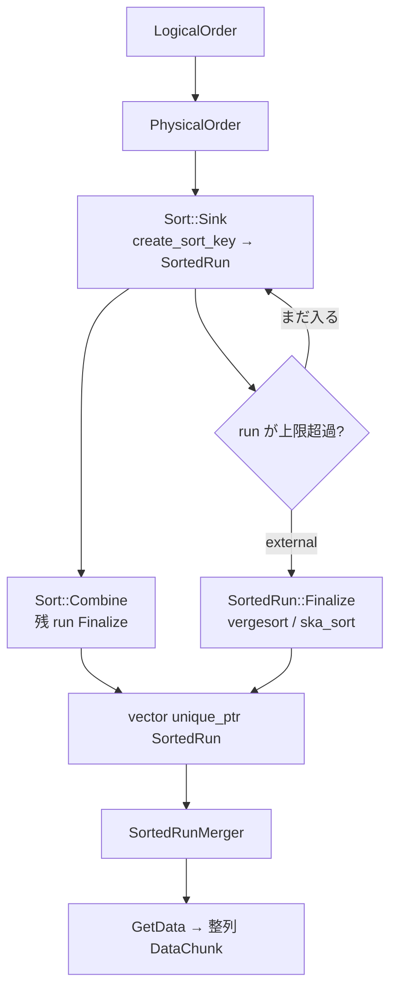

# 第22章 ソート

> **本章で読むソース**
>
> - [src/common/sort/sort.cpp](https://github.com/duckdb/duckdb/blob/v1.5.4/src/common/sort/sort.cpp)
> - [src/common/sort/sorted_run.cpp](https://github.com/duckdb/duckdb/blob/v1.5.4/src/common/sort/sorted_run.cpp)
> - [src/common/sort/sorted_run_merger.cpp](https://github.com/duckdb/duckdb/blob/v1.5.4/src/common/sort/sorted_run_merger.cpp)
> - [src/execution/operator/order/physical_order.cpp](https://github.com/duckdb/duckdb/blob/v1.5.4/src/execution/operator/order/physical_order.cpp)
> - [src/execution/physical_plan/plan_order.cpp](https://github.com/duckdb/duckdb/blob/v1.5.4/src/execution/physical_plan/plan_order.cpp)

## この章の狙い

`ORDER BY` の物理演算子 `PhysicalOrder` と、その実体である `Sort` を追う。
sink ではチャンクを `SortedRun` へ積み、足りなくなればローカルでソートして run を確定する。
source では複数の `SortedRun` を `SortedRunMerger` が合流させ、整列済みチャンクを返す。

## 前提

論理プランの `LogicalOrder` は `PhysicalPlanGenerator::CreatePlan` で `PhysicalOrder` になる。
`orders` が空なら子プランをそのまま返す。

[src/execution/physical_plan/plan_order.cpp L7-L27](https://github.com/duckdb/duckdb/blob/v1.5.4/src/execution/physical_plan/plan_order.cpp#L7-L27)

```cpp
PhysicalOperator &PhysicalPlanGenerator::CreatePlan(LogicalOrder &op) {
	D_ASSERT(op.children.size() == 1);

	auto &plan = CreatePlan(*op.children[0]);
	if (op.orders.empty()) {
		return plan;
	}

	vector<idx_t> projection_map;
	if (op.HasProjectionMap()) {
		projection_map = std::move(op.projection_map);
	} else {
		for (idx_t i = 0; i < plan.types.size(); i++) {
			projection_map.push_back(i);
		}
	}
	auto &order =
	    Make<PhysicalOrder>(op.types, std::move(op.orders), std::move(projection_map), op.estimated_cardinality);
	order.children.push_back(plan);
	return order;
}
```

パイプライン上では第16章どおり、ORDER BY は子を sink 入力に持つ独立セグメントになる。
本章の焦点はその sink / source の中身であり、構築とスケジューリングそのものではない。

## PhysicalOrder は Sort の薄いラッパー

`OrderGlobalSinkState` は `Sort` 本体と、その `GetGlobalSinkState` が返す `unique_ptr<GlobalSinkState>` を持つ。
`PhysicalOrder::Sink` / `Combine` / `Finalize` / `GetDataInternal` は、ローカル状態を遅延初期化したうえで同じ操作を `Sort` へ渡すだけである。

[src/execution/operator/order/physical_order.cpp L16-L70](https://github.com/duckdb/duckdb/blob/v1.5.4/src/execution/operator/order/physical_order.cpp#L16-L70)

```cpp
class OrderGlobalSinkState : public GlobalSinkState {
public:
	OrderGlobalSinkState(const PhysicalOrder &op, ClientContext &context)
	    : sort(context, op.orders, op.children[0].get().types, op.projections, op.is_index_sort),
	      state(sort.GetGlobalSinkState(context)) {
	}

public:
	Sort sort;
	unique_ptr<GlobalSinkState> state;
};

class OrderLocalSinkState : public LocalSinkState {
public:
	OrderLocalSinkState() {
	}

public:
	unique_ptr<LocalSinkState> state;
};

// ... (中略) ...

SinkResultType PhysicalOrder::Sink(ExecutionContext &context, DataChunk &chunk, OperatorSinkInput &input) const {
	auto &gstate = input.global_state.Cast<OrderGlobalSinkState>();
	auto &lstate = input.local_state.Cast<OrderLocalSinkState>();
	if (!lstate.state) {
		lstate.state = gstate.sort.GetLocalSinkState(context);
	}
	OperatorSinkInput sort_input {*gstate.state, *lstate.state, input.interrupt_state};
	return gstate.sort.Sink(context, chunk, sort_input);
}

SinkCombineResultType PhysicalOrder::Combine(ExecutionContext &context, OperatorSinkCombineInput &input) const {
	auto &gstate = input.global_state.Cast<OrderGlobalSinkState>();
	auto &lstate = input.local_state.Cast<OrderLocalSinkState>();
	if (!lstate.state) {
		return SinkCombineResultType::FINISHED;
	}
	OperatorSinkCombineInput sort_input {*gstate.state, *lstate.state, input.interrupt_state};
	return gstate.sort.Combine(context, sort_input);
}

SinkFinalizeType PhysicalOrder::Finalize(Pipeline &pipeline, Event &event, ClientContext &context,
                                         OperatorSinkFinalizeInput &input) const {
	auto &gstate = input.global_state.Cast<OrderGlobalSinkState>();
	OperatorSinkFinalizeInput sort_input {*gstate.state, input.interrupt_state};
	return gstate.sort.Finalize(context, sort_input);
}
```

source 側も同様で、`OrderGlobalSourceState` は sink 側の同じ `Sort` 参照を握り、`GetGlobalSourceState` で作った状態へ `GetData` を委譲する。

[src/execution/operator/order/physical_order.cpp L81-L123](https://github.com/duckdb/duckdb/blob/v1.5.4/src/execution/operator/order/physical_order.cpp#L81-L123)

```cpp
class OrderGlobalSourceState : public GlobalSourceState {
public:
	explicit OrderGlobalSourceState(ClientContext &context, OrderGlobalSinkState &sink)
	    : sort(sink.sort), state(sort.GetGlobalSourceState(context, *sink.state)) {
	}

public:
	idx_t MaxThreads() override {
		return state->MaxThreads();
	}

public:
	Sort &sort;
	unique_ptr<GlobalSourceState> state;
};

class OrderLocalSourceState : public LocalSourceState {
public:
	explicit OrderLocalSourceState(ExecutionContext &context, OrderGlobalSourceState &gstate)
	    : state(gstate.sort.GetLocalSourceState(context, *gstate.state)) {
	}

public:
	unique_ptr<LocalSourceState> state;
};

// ... (中略) ...

SourceResultType PhysicalOrder::GetDataInternal(ExecutionContext &context, DataChunk &chunk,
                                                OperatorSourceInput &input) const {
	auto &gstate = input.global_state.Cast<OrderGlobalSourceState>();
	auto &lstate = input.local_state.Cast<OrderLocalSourceState>();
	OperatorSourceInput sort_input {*gstate.state, *lstate.state, input.interrupt_state};
	return gstate.sort.GetData(context, chunk, sort_input);
}
```

所有権の軸はこうなる。
`Sort` はグローバル sink が保持し、source は参照（`Sort &`）だけを借りる。
ローカルの `unique_ptr<LocalSinkState>` / `unique_ptr<LocalSourceState>` は `Sort` 内部状態への薄皮である。

## Sort の構築とキー表現

`Sort` コンストラクタは各 `BoundOrderByNode` から `create_sort_key` と `decode_sort_key` をバインドする。
ソート比較は列ごとの比較器ではなく、まず sort key（`BIGINT` または `BLOB`）へ符号化してから行う。
projection でキーにも載る列は payload から落とし、`output_projection_columns` で出力時にキー側と payload 側のどちらから取るかを決める。

[src/common/sort/sort.cpp L17-L57](https://github.com/duckdb/duckdb/blob/v1.5.4/src/common/sort/sort.cpp#L17-L57)

```cpp
Sort::Sort(ClientContext &context_p, const vector<BoundOrderByNode> &orders, const vector<LogicalType> &input_types,
           vector<idx_t> projection_map, bool is_index_sort_p)
    : context(context_p), key_layout(make_shared_ptr<TupleDataLayout>()),
      payload_layout(make_shared_ptr<TupleDataLayout>()), is_index_sort(is_index_sort_p) {
	// Convert orders to a single "create_sort_key" expression (and corresponding "decode_sort_key")
	FunctionBinder binder(context);
	vector<unique_ptr<Expression>> create_children;
	vector<unique_ptr<Expression>> decode_children;
	child_list_t<LogicalType> decode_child_list;
	for (idx_t col_idx = 0; col_idx < orders.size(); col_idx++) {
		const auto &order = orders[col_idx];

		// Create: for each column we have two arguments: 1. the column, 2. sort specifier
		create_children.emplace_back(order.expression->Copy());
		create_children.emplace_back(make_uniq<BoundConstantExpression>(Value(order.GetOrderModifier())));

		// Avoid having unnamed structs fields (otherwise we get a parser exception while binding)
		const auto col_name = StringUtil::Format("c%llu", col_idx);
		auto col_type = order.expression->return_type;
		decode_child_list.emplace_back(col_name, col_type);
		col_type = TypeVisitor::VisitReplace(col_type, [](const LogicalType &type) {
			if (type.id() != LogicalTypeId::STRUCT) {
				return type;
			}
			child_list_t<LogicalType> internal_child_list;
			for (const auto &child : StructType::GetChildTypes(type)) {
				internal_child_list.emplace_back(StringUtil::Format("c%llu", internal_child_list.size()), child.second);
			}
			return LogicalType::STRUCT(std::move(internal_child_list));
		});

		// Decode: for each column we have two arguments: 1. col name + type, 2. sort specifier
		decode_children.emplace_back(make_uniq<BoundConstantExpression>(Value(col_name + " " + col_type.ToString())));
		decode_children.emplace_back(make_uniq<BoundConstantExpression>(order.GetOrderModifier()));
	}

	ErrorData error;
	create_sort_key = binder.BindScalarFunction(DEFAULT_SCHEMA, "create_sort_key", std::move(create_children), error);
	if (!create_sort_key) {
		throw InternalException("Unable to bind create_sort_key in Sort::Sort");
	}
```

## Sink: SortedRun への追記と局所ソート

ローカル sink は `SortedRun` を抱え、入力チャンクを sort key と payload に分けて `SortedRun::Sink` する。
run がメモリ上限を超えると、external フラグ時はロックを外してから `Finalize(true)` でソートし、グローバルへ `unique_ptr` で移譲する。

[src/common/sort/sort.cpp L268-L328](https://github.com/duckdb/duckdb/blob/v1.5.4/src/common/sort/sort.cpp#L268-L328)

```cpp
SinkResultType Sort::Sink(ExecutionContext &context, DataChunk &chunk, OperatorSinkInput &input) const {
	auto &gstate = input.global_state.Cast<SortGlobalSinkState>();
	auto &lstate = input.local_state.Cast<SortLocalSinkState>();

	if (!lstate.sorted_run) {
		lstate.InitializeSortedRun(*this, context.client);
		gstate.UpdateLocalState(lstate);
	}

	// Sink data into sorted run
	lstate.key.Reset();
	lstate.payload.Reset();
	lstate.key_executor.Execute(chunk, lstate.key);
	lstate.payload.ReferenceColumns(chunk, input_projection_map);
	lstate.sorted_run->Sink(lstate.key, lstate.payload);

	// Try to finish this call to Sink
	unique_lock<mutex> guard;
	if (TryFinishSink(gstate, lstate, guard)) {
		return SinkResultType::NEED_MORE_INPUT;
	}

	// Grab the lock, update the local state, and see if we can finish now
	guard = gstate.Lock();
	gstate.UpdateLocalState(lstate);
	if (TryFinishSink(gstate, lstate, guard)) {
		return SinkResultType::NEED_MORE_INPUT;
	}

	// Still no, this thread must try to increase the limit
	gstate.TryIncreaseReservation(context.client, lstate, is_index_sort, guard);
	gstate.UpdateLocalState(lstate);
	guard.unlock(); // Can unlock now, local state is definitely up-to-date

	// This can return false if we somehow still don't have enough memory
	// We'll likely run into an OOM exception
	TryFinishSink(gstate, lstate, guard);

	return SinkResultType::NEED_MORE_INPUT;
}

SinkCombineResultType Sort::Combine(ExecutionContext &context, OperatorSinkCombineInput &input) const {
	auto &gstate = input.global_state.Cast<SortGlobalSinkState>();
	auto &lstate = input.local_state.Cast<SortLocalSinkState>();

	if (!lstate.sorted_run) {
		return SinkCombineResultType::FINISHED;
	}

	// Set any_combined under lock
	auto guard = gstate.Lock();
	gstate.any_combined = true;
	guard.unlock();

	// Do the final local sort (lock-free)
	lstate.sorted_run->Finalize(gstate.external);

	// Append to global state (grabs lock)
	gstate.AddSortedRun(lstate);

	return SinkCombineResultType::FINISHED;
}
```

`external` の初期値は `ClientConfig::force_external` である。
動的に `external = true` にするのは `TryIncreaseReservation` だけであり、予約が前回要求未満、または今回の要求量未満のときに限る。
どちらも `!any_combined` のときだけフラグを立てる。
`Combine` が一度でも走ったあとは、予約が足りなくても `external` にはしない。
残っていたローカル run は `Finalize(gstate.external)` され、グローバルの `vector<unique_ptr<SortedRun>>` へ集約される。

[src/common/sort/sort.cpp L162-L207](https://github.com/duckdb/duckdb/blob/v1.5.4/src/common/sort/sort.cpp#L162-L207)

```cpp
	explicit SortGlobalSinkState(ClientContext &context)
	    : num_threads(NumericCast<idx_t>(TaskScheduler::GetScheduler(context).NumberOfThreads())),
	      temporary_memory_state(TemporaryMemoryManager::Get(context).Register(context)), sorted_tuples(0),
	      external(ClientConfig::GetConfig(context).force_external), any_combined(false), total_count(0),
	      partition_size(0) {
	}

public:
	void UpdateLocalState(SortLocalSinkState &lstate) const {
		lstate.maximum_run_size = temporary_memory_state->GetReservation() / num_threads;
		lstate.external = external;
	}

	void TryIncreaseReservation(ClientContext &context, SortLocalSinkState &lstate, bool is_index_sort,
	                            const unique_lock<mutex> &guard) {
		VerifyLock(guard);
		D_ASSERT(!external);

		// If we already got less than we requested last time, have to go external
		if (temporary_memory_state->GetReservation() < temporary_memory_state->GetRemainingSize()) {
			if (!any_combined) {
				external = true;
			}
			return;
		}

		// Double until it fits
		auto required = num_threads * lstate.sorted_run->SizeInBytes();
		if (is_index_sort) {
			required *= 4; // Index creation is pretty intense, so we are very conservative here
		}
		auto request = temporary_memory_state->GetRemainingSize() * 2;
		while (request < required) {
			request *= 2;
		}

		// Send the request
		temporary_memory_state->SetRemainingSizeAndUpdateReservation(context, request);

		// If we got less than we required, we have to go external
		if (temporary_memory_state->GetReservation() < required) {
			if (!any_combined) {
				external = true;
			}
		}
	}
```

`SortedRun::Sink` 自体はキーと payload の `TupleDataCollection` へ追記し、payload があるときはキー内ポインタへ payload 行を結ぶ。

[src/common/sort/sorted_run.cpp L203-L212](https://github.com/duckdb/duckdb/blob/v1.5.4/src/common/sort/sorted_run.cpp#L203-L212)

```cpp
void SortedRun::Sink(DataChunk &key, DataChunk &payload) {
	D_ASSERT(!finalized);
	key_data->Append(key_append_state, key);
	if (payload_data) {
		D_ASSERT(key.size() == payload.size());
		payload_data->Append(payload_append_state, payload);
		SetPayloadPointer(key_append_state.chunk_state.row_locations, payload_append_state.chunk_state.row_locations,
		                  key.size(), key_data->GetLayout().GetSortKeyType());
	}
}
```

## SortedRun::Finalize と比較ソート

`Finalize` は追記を閉じ、固定長キー領域を `SortSwitch` で並べ替え、external なら可変長ヒープや payload をキー順に並べ直す。

[src/common/sort/sorted_run.cpp L429-L456](https://github.com/duckdb/duckdb/blob/v1.5.4/src/common/sort/sorted_run.cpp#L429-L456)

```cpp
void SortedRun::Finalize(bool external) {
	D_ASSERT(!finalized);

	// Finalize the append
	key_data->FinalizePinState(key_append_state.pin_state);
	key_data->VerifyEverythingPinned();
	if (payload_data) {
		D_ASSERT(key_data->Count() == payload_data->Count());
		payload_data->FinalizePinState(payload_append_state.pin_state);
		payload_data->VerifyEverythingPinned();
	}

	// Sort the fixed-size portion of the keys
	SortSwitch(context, *key_data, is_index_sort);

	if (external) {
		// Reorder variable-size portion of keys and/or payload data (if necessary)
		const auto sort_key_type = key_data->GetLayout().GetSortKeyType();
		if (!SortKeyUtils::IsConstantSize(sort_key_type) || SortKeyUtils::HasPayload(sort_key_type)) {
			Reorder(context, key_data, payload_data);
		} else {
			// This ensures keys are unpinned even if they are constant size and have no payload
			key_data->Unpin();
		}
	}

	finalized = true;
}
```

中身の `TemplatedSort` は、ほぼ整列済みに強い vergesort を主経路とし、フォールバックに ska_sort を渡す。
ブロック反復子が `TupleDataCollection` 上のキーを直接並べ替えるため、行全体をコピーしてから比較する経路ではない。

[src/common/sort/sorted_run.cpp L242-L269](https://github.com/duckdb/duckdb/blob/v1.5.4/src/common/sort/sorted_run.cpp#L242-L269)

```cpp
template <SortKeyType SORT_KEY_TYPE>
static void TemplatedSort(ClientContext &context, const TupleDataCollection &key_data, const bool is_index_sort) {
	const auto &layout = key_data.GetLayout();
	D_ASSERT(SORT_KEY_TYPE == layout.GetSortKeyType());
	using SORT_KEY = SortKey<SORT_KEY_TYPE>;
	using BLOCK_ITERATOR_STATE = BlockIteratorState<BlockIteratorStateType::IN_MEMORY>;
	using BLOCK_ITERATOR = block_iterator_t<const BLOCK_ITERATOR_STATE, SORT_KEY>;

	const BLOCK_ITERATOR_STATE state(key_data);
	auto begin = BLOCK_ITERATOR(state, 0);
	auto end = BLOCK_ITERATOR(state, key_data.Count());

	const auto requires_next_sort =
	    is_index_sort ? false : !SORT_KEY::CONSTANT_SIZE || SORT_KEY::INLINE_LENGTH != sizeof(uint64_t);
	const auto ska_sort_width = MinValue<idx_t>(layout.GetSortWidth(), sizeof(uint64_t));
	const auto &sort_skippable_bytes = layout.GetSortSkippableBytes();
	auto ska_extract_key =
	    SkaExtractKey<SORT_KEY>(requires_next_sort, ska_sort_width, sort_skippable_bytes, context.interrupted);

	const auto fallback = [ska_extract_key](const BLOCK_ITERATOR &fb_begin, const BLOCK_ITERATOR &fb_end) {
		duckdb_ska_sort::ska_sort(fb_begin, fb_end, ska_extract_key);
	};
	duckdb_vergesort::vergesort(begin, end, std::less<SORT_KEY>(), fallback);

	if (context.interrupted.load(std::memory_order_relaxed)) {
		throw InterruptException();
	}
}
```

## Source: SortedRunMerger による合流

`Sort::Finalize` は run が空でなければ READY を返し、source 用の `total_count` と `partition_size` を決める。
`SortGlobalSourceState` は sink から run 列を `move` して `SortedRunMerger` を構築する。

[src/common/sort/sort.cpp L331-L349](https://github.com/duckdb/duckdb/blob/v1.5.4/src/common/sort/sort.cpp#L331-L349)

```cpp
SinkFinalizeType Sort::Finalize(ClientContext &context, OperatorSinkFinalizeInput &input) const {
	auto &gstate = input.global_state.Cast<SortGlobalSinkState>();
	if (gstate.sorted_runs.empty()) {
		return SinkFinalizeType::NO_OUTPUT_POSSIBLE;
	}

	idx_t maximum_run_count = 0;
	for (const auto &sorted_run : gstate.sorted_runs) {
		gstate.total_count += sorted_run->Count();
		maximum_run_count = MaxValue(maximum_run_count, sorted_run->Count());
	}
	if (context.config.verify_parallelism) {
		gstate.partition_size = STANDARD_VECTOR_SIZE;
	} else {
		gstate.partition_size = MinValue<idx_t>(gstate.total_count, DEFAULT_ROW_GROUP_SIZE);
	}

	return SinkFinalizeType::READY;
}
```

`SortGlobalSourceState` は sink から run 列を `move` して `SortedRunMerger` を構築する。

[src/common/sort/sort.cpp L366-L373](https://github.com/duckdb/duckdb/blob/v1.5.4/src/common/sort/sort.cpp#L366-L373)

```cpp
class SortGlobalSourceState : public GlobalSourceState {
public:
	SortGlobalSourceState(const Sort &sort, ClientContext &context, SortGlobalSinkState &sink_p)
	    : sink(sink_p), merger(sort, std::move(sink.sorted_runs), sink.partition_size, sink.external, false),
	      merger_global_state(merger.total_count == 0 ? nullptr : merger.GetGlobalSourceState(context)) {
		// TODO: we want to pass "sort.is_index_sort" instead of just "false" here
		//  so that we can do an approximate sort, but that causes issues in the ART
	}
```

[src/common/sort/sort.cpp L420-L428](https://github.com/duckdb/duckdb/blob/v1.5.4/src/common/sort/sort.cpp#L420-L428)

```cpp
SourceResultType Sort::GetData(ExecutionContext &context, DataChunk &chunk, OperatorSourceInput &input) const {
	auto &gstate = input.global_state.Cast<SortGlobalSourceState>();
	if (gstate.merger.total_count == 0) {
		return SourceResultType::FINISHED;
	}
	auto &lstate = input.local_state.Cast<SortLocalSourceState>();
	OperatorSourceInput merger_input {*gstate.merger_global_state, *lstate.merger_local_state, input.interrupt_state};
	return gstate.merger.GetData(context, chunk, merger_input);
}
```

merger のローカル状態はタスク状態機械である。
境界計算、境界取得、パーティション合流、スキャン（または materialize）の順で進み、パーティション単位で並列化する。

[src/common/sort/sorted_run_merger.cpp L343-L381](https://github.com/duckdb/duckdb/blob/v1.5.4/src/common/sort/sorted_run_merger.cpp#L343-L381)

```cpp
SourceResultType SortedRunMergerLocalState::ExecuteTask(SortedRunMergerGlobalState &gstate,
                                                        optional_ptr<DataChunk> chunk) {
	D_ASSERT(task != SortedRunMergerTask::FINISHED);
	switch (task) {
	case SortedRunMergerTask::COMPUTE_BOUNDARIES:
		ComputePartitionBoundaries(gstate, partition_idx);
		task = SortedRunMergerTask::ACQUIRE_BOUNDARIES;
		break;
	case SortedRunMergerTask::ACQUIRE_BOUNDARIES:
		AcquirePartitionBoundaries(gstate);
		task = SortedRunMergerTask::MERGE_PARTITION;
		break;
	case SortedRunMergerTask::MERGE_PARTITION:
		MergePartition(gstate);
		task = SortedRunMergerTask::SCAN_PARTITION;
		break;
	case SortedRunMergerTask::SCAN_PARTITION:
		if (chunk) {
			ScanPartition(gstate, *chunk);
		} else {
			MaterializePartition(gstate);
		}
		if (!chunk || chunk->size() == 0) {
			gstate.DestroyScannedData();
			gstate.partitions[partition_idx.GetIndex()]->scanned = true;
			//	fetch_add returns the _previous_ value!
			const auto scan_count_before_adding = gstate.total_scanned.fetch_add(merged_partition_count);
			const auto scan_count_after_adding = scan_count_before_adding + merged_partition_count;
			partition_idx = optional_idx::Invalid();
			task = SortedRunMergerTask::FINISHED;
			if (scan_count_after_adding == gstate.merger.total_count) {
				return SourceResultType::FINISHED;
			}
		}
		break;
	default:
		throw NotImplementedException("SortedRunMergerLocalState::ExecuteTask for task");
	}
	return SourceResultType::HAVE_MORE_OUTPUT;
}
```

`SortedRunMerger::GetData` はチャンクが埋まるまでタスクを進め、空なら FINISHED を返す。

[src/common/sort/sorted_run_merger.cpp L856-L875](https://github.com/duckdb/duckdb/blob/v1.5.4/src/common/sort/sorted_run_merger.cpp#L856-L875)

```cpp
SourceResultType SortedRunMerger::GetData(ExecutionContext &, DataChunk &chunk, OperatorSourceInput &input) const {
	auto &gstate = input.global_state.Cast<SortedRunMergerGlobalState>();
	auto &lstate = input.local_state.Cast<SortedRunMergerLocalState>();

	while (chunk.size() == 0) {
		if (!lstate.TaskFinished() || gstate.AssignTask(lstate)) {
			lstate.ExecuteTask(gstate, &chunk);
		} else {
			break;
		}
	}

	if (chunk.size() != 0) {
		return SourceResultType::HAVE_MORE_OUTPUT;
	}

	// Done
	lstate.Clear();
	return SourceResultType::FINISHED;
}
```

## 処理の流れ



## 高速化と最適化の工夫

比較対象を多型の列集合のままにせず、`create_sort_key` で固定幅または BLOB の sort key に畳む。
同じキー列を payload に二重保持しないので、メモリと gather コストが減る。

局所ソートは vergesort がほぼ整列済み区間を拾い、乱れた区間だけ ska_sort に落とす。
external 化は `force_external` で最初から立てるか、`TryIncreaseReservation` が予約不足かつ `!any_combined` のときだけである。
Combine 開始後は予約が足りなくてもフラグを立てず、その時点の `external` のまま run を確定し、source 側の多路 merge に仕事を寄せる。

## まとめ

`PhysicalOrder` は `Sort` を sink / source として抱え、構築とメモリ政策と run 合流は `Sort` / `SortedRun` / `SortedRunMerger` が担う。
入力は sort key と payload に分かれ、ローカル run の `Finalize` で並べ、複数 run は merger のパーティションタスクで合流する。
第23章のウィンドウは別演算子だが、partition / order の整列には同じソート基盤の戦略層を使う。

## 関連する章

- 第14章（物理プラン生成）：`LogicalOrder` から `PhysicalOrder` への変換
- 第16章（パイプライン構築とスケジューリング）：ORDER BY の sink / source 分割
- 第23章（ウィンドウ関数）：`SortStrategy` 経由の整列再利用
- 第25章（バッファマネージャ）：`TemporaryMemoryManager` と一時領域
