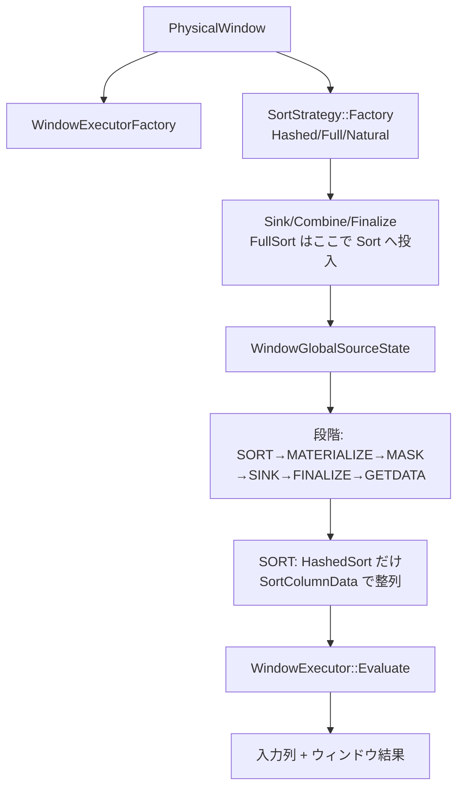

# 第23章 ウィンドウ関数

> **本章で読むソース**
>
> - [src/execution/operator/aggregate/physical_window.cpp](https://github.com/duckdb/duckdb/blob/v1.5.4/src/execution/operator/aggregate/physical_window.cpp)
> - [src/common/sort/sort_strategy.cpp](https://github.com/duckdb/duckdb/blob/v1.5.4/src/common/sort/sort_strategy.cpp)
> - [src/function/window/window_executor.cpp](https://github.com/duckdb/duckdb/blob/v1.5.4/src/function/window/window_executor.cpp)
> - [src/function/window/window_rownumber_function.cpp](https://github.com/duckdb/duckdb/blob/v1.5.4/src/function/window/window_rownumber_function.cpp)

## この章の狙い

`PhysicalWindow` はウィンドウ関数の物理演算子である。
第22章の `PhysicalOrder` とは別演算子であり、結果を単に並べ替えるのではなく、partition / order で整列した行集合の上で各ウィンドウ式を評価する。
整列には `SortStrategy::Factory` が選ぶ戦略を使い、source 側の段階タスクで `WindowLocalSourceState::Sort` から実行器の `Evaluate` まで進める。

## 前提

`PhysicalWindow` の `select_list` はすべて `BoundWindowExpression` である。
コンストラクタは orders が最長の式を `order_idx` に選び、その partitions / orders がソート戦略の基準になる。
partition も order もない式が1つでもあれば `is_order_dependent` を立てる。

[src/execution/operator/aggregate/physical_window.cpp L241-L260](https://github.com/duckdb/duckdb/blob/v1.5.4/src/execution/operator/aggregate/physical_window.cpp#L241-L260)

```cpp
PhysicalWindow::PhysicalWindow(PhysicalPlan &physical_plan, vector<LogicalType> types,
                               vector<unique_ptr<Expression>> select_list_p, idx_t estimated_cardinality,
                               PhysicalOperatorType type)
    : PhysicalOperator(physical_plan, type, std::move(types), estimated_cardinality),
      select_list(std::move(select_list_p)), order_idx(0), is_order_dependent(false) {
	idx_t max_orders = 0;
	for (idx_t i = 0; i < select_list.size(); ++i) {
		auto &expr = select_list[i];
		D_ASSERT(expr->GetExpressionClass() == ExpressionClass::BOUND_WINDOW);
		auto &bound_window = expr->Cast<BoundWindowExpression>();
		if (bound_window.partitions.empty() && bound_window.orders.empty()) {
			is_order_dependent = true;
		}

		if (bound_window.orders.size() > max_orders) {
			order_idx = i;
			max_orders = bound_window.orders.size();
		}
	}
}
```

## ウィンドウ実行器の割当

式の種類ごとに `WindowExecutor` 派生を作る。
集約は `WindowAggregateExecutor`、順位系は rank / dense / percent など、値取りは lead / lag / first / last / nth である。

[src/execution/operator/aggregate/physical_window.cpp L262-L312](https://github.com/duckdb/duckdb/blob/v1.5.4/src/execution/operator/aggregate/physical_window.cpp#L262-L312)

```cpp
static unique_ptr<WindowExecutor> WindowExecutorFactory(BoundWindowExpression &wexpr, ClientContext &client,
                                                        WindowSharedExpressions &shared, WindowAggregationMode mode) {
	switch (wexpr.GetExpressionType()) {
	case ExpressionType::WINDOW_AGGREGATE:
		return make_uniq<WindowAggregateExecutor>(wexpr, client, shared, mode);
	case ExpressionType::WINDOW_ROW_NUMBER:
		return make_uniq<WindowRowNumberExecutor>(wexpr, shared);
	case ExpressionType::WINDOW_RANK_DENSE:
		return make_uniq<WindowDenseRankExecutor>(wexpr, shared);
	case ExpressionType::WINDOW_RANK:
		return make_uniq<WindowRankExecutor>(wexpr, shared);
	case ExpressionType::WINDOW_PERCENT_RANK:
		return make_uniq<WindowPercentRankExecutor>(wexpr, shared);
	case ExpressionType::WINDOW_CUME_DIST:
		return make_uniq<WindowCumeDistExecutor>(wexpr, shared);
	case ExpressionType::WINDOW_NTILE:
		return make_uniq<WindowNtileExecutor>(wexpr, shared);
	case ExpressionType::WINDOW_LEAD:
	case ExpressionType::WINDOW_LAG:
		return make_uniq<WindowLeadLagExecutor>(wexpr, shared);
	case ExpressionType::WINDOW_FILL:
		return make_uniq<WindowFillExecutor>(wexpr, client, shared);
	case ExpressionType::WINDOW_FIRST_VALUE:
		return make_uniq<WindowFirstValueExecutor>(wexpr, shared);
	case ExpressionType::WINDOW_LAST_VALUE:
		return make_uniq<WindowLastValueExecutor>(wexpr, shared);
	case ExpressionType::WINDOW_NTH_VALUE:
		return make_uniq<WindowNthValueExecutor>(wexpr, shared);
		break;
	default:
		throw InternalException("Window aggregate type %s", ExpressionTypeToString(wexpr.GetExpressionType()));
	}
}

WindowGlobalSinkState::WindowGlobalSinkState(const PhysicalWindow &op, ClientContext &client)
    : op(op), client(client), count(0) {
	D_ASSERT(op.select_list[op.order_idx]->GetExpressionClass() == ExpressionClass::BOUND_WINDOW);
	auto &wexpr = op.select_list[op.order_idx]->Cast<BoundWindowExpression>();

	const auto mode = Settings::Get<DebugWindowModeSetting>(client);
	for (idx_t expr_idx = 0; expr_idx < op.select_list.size(); ++expr_idx) {
		D_ASSERT(op.select_list[expr_idx]->GetExpressionClass() == ExpressionClass::BOUND_WINDOW);
		auto &wexpr = op.select_list[expr_idx]->Cast<BoundWindowExpression>();
		auto wexec = WindowExecutorFactory(wexpr, client, shared, mode);
		executors.emplace_back(std::move(wexec));
	}

	sort_strategy = SortStrategy::Factory(client, wexpr.partitions, wexpr.orders, op.children[0].get().GetTypes(),
	                                      wexpr.partitions_stats, op.estimated_cardinality);
	strategy_sink = sort_strategy->GetGlobalSinkState(client);
}
```

## SortStrategy::Factory と PhysicalOrder の違い

ウィンドウは `PhysicalOrder` を子に挿すのではなく、sink 段階で `SortStrategy` を選ぶ。
partition があれば `HashedSort`、order のみなら `FullSort`、どちらもなければ入力順を保つ `NaturalSort` である。
`FullSort` / `HashedSort` の内側では第22章の `Sort` を再利用する。

[src/common/sort/sort_strategy.cpp L31-L44](https://github.com/duckdb/duckdb/blob/v1.5.4/src/common/sort/sort_strategy.cpp#L31-L44)

```cpp
unique_ptr<SortStrategy> SortStrategy::Factory(ClientContext &client,
                                               const vector<unique_ptr<Expression>> &partition_bys,
                                               const vector<BoundOrderByNode> &order_bys, const Types &payload_types,
                                               const vector<unique_ptr<BaseStatistics>> &partitions_stats,
                                               idx_t estimated_cardinality, bool require_payload) {
	if (!partition_bys.empty()) {
		return make_uniq<HashedSort>(client, partition_bys, order_bys, payload_types, partitions_stats,
		                             estimated_cardinality, require_payload);
	} else if (!order_bys.empty()) {
		return make_uniq<FullSort>(client, order_bys, payload_types, require_payload);
	} else {
		return make_uniq<NaturalSort>(payload_types);
	}
}
```

sink / combine / finalize は戦略へそのまま委譲する。
ここではまだウィンドウ値を計算せず、行を partition / order 可能な形へ集めきるだけである。

[src/execution/operator/aggregate/physical_window.cpp L317-L351](https://github.com/duckdb/duckdb/blob/v1.5.4/src/execution/operator/aggregate/physical_window.cpp#L317-L351)

```cpp
SinkResultType PhysicalWindow::Sink(ExecutionContext &context, DataChunk &chunk, OperatorSinkInput &sink) const {
	auto &gstate = sink.global_state.Cast<WindowGlobalSinkState>();
	auto &lstate = sink.local_state.Cast<WindowLocalSinkState>();
	gstate.count += chunk.size();

	OperatorSinkInput hsink {*gstate.strategy_sink, *lstate.local_group, sink.interrupt_state};
	return gstate.sort_strategy->Sink(context, chunk, hsink);
}

SinkCombineResultType PhysicalWindow::Combine(ExecutionContext &context, OperatorSinkCombineInput &combine) const {
	auto &gstate = combine.global_state.Cast<WindowGlobalSinkState>();
	auto &lstate = combine.local_state.Cast<WindowLocalSinkState>();

	OperatorSinkCombineInput hcombine {*gstate.strategy_sink, *lstate.local_group, combine.interrupt_state};
	return gstate.sort_strategy->Combine(context, hcombine);
}

unique_ptr<LocalSinkState> PhysicalWindow::GetLocalSinkState(ExecutionContext &context) const {
	auto &gstate = sink_state->Cast<WindowGlobalSinkState>();
	return make_uniq<WindowLocalSinkState>(context, gstate);
}

unique_ptr<GlobalSinkState> PhysicalWindow::GetGlobalSinkState(ClientContext &client) const {
	return make_uniq<WindowGlobalSinkState>(*this, client);
}

SinkFinalizeType PhysicalWindow::Finalize(Pipeline &pipeline, Event &event, ClientContext &client,
                                          OperatorSinkFinalizeInput &input) const {
	auto &gsink = input.global_state.Cast<WindowGlobalSinkState>();
	auto &sort_strategy = *gsink.sort_strategy;
	auto &strategy_sink = *gsink.strategy_sink;

	OperatorSinkFinalizeInput hfinalize {strategy_sink, input.interrupt_state};
	return sort_strategy.Finalize(client, hfinalize);
}
```

## Source の段階タスク

ハッシュグループごとに段階がある。
`SORT`、`MATERIALIZE`、`MASK`、`SINK`、`FINALIZE`、`GETDATA` の順である。
`TryPrepareNextStage` は各段階の完了カウンタを見て次へ進める。

[src/execution/operator/aggregate/physical_window.cpp L20-L131](https://github.com/duckdb/duckdb/blob/v1.5.4/src/execution/operator/aggregate/physical_window.cpp#L20-L131)

```cpp
enum WindowGroupStage : uint8_t { SORT, MATERIALIZE, MASK, SINK, FINALIZE, GETDATA, DONE };

struct WindowSourceTask {
	WindowSourceTask() {
	}

	WindowGroupStage stage = WindowGroupStage::DONE;
	//! The hash group
	idx_t group_idx = 0;
	//! The thread index (for local state)
	idx_t thread_idx = 0;
	//! The total block index count
	idx_t max_idx = 0;
	//! The first block index count
	idx_t begin_idx = 0;
	//! The end block index count
	idx_t end_idx = 0;
};

// ... (中略) ...

	bool TryPrepareNextStage() {
		lock_guard<mutex> prepare_guard(lock);
		switch (stage.load()) {
		case WindowGroupStage::SORT:
			if (sorted == blocks) {
				stage = WindowGroupStage::MATERIALIZE;
				return true;
			}
			return false;
		case WindowGroupStage::MATERIALIZE:
			if (materialized == blocks && rows.get()) {
				stage = WindowGroupStage::MASK;
				return true;
			}
			return false;
		case WindowGroupStage::MASK:
			if (masked == blocks) {
				stage = WindowGroupStage::SINK;
				return true;
			}
			return false;
		case WindowGroupStage::SINK:
			if (sunk == count) {
				stage = WindowGroupStage::FINALIZE;
				return true;
			}
			return false;
		case WindowGroupStage::FINALIZE:
			if (finalized == blocks) {
				stage = WindowGroupStage::GETDATA;
				return true;
			}
			return false;
		case WindowGroupStage::GETDATA:
		case WindowGroupStage::DONE:
			// never block in GETDATA
			return true;
		}

		//	Stop Linux whinging about control flow...
		return true;
	}
```

`WindowLocalSourceState::Sort` は `SortStrategy::SortColumnData` を呼ぶ。
基底実装は no-op であり、この SORT 段階で hash partition を `Sort` へ流すのは `HashedSort` の override だけである。
`FullSort` は sink で既に `Sort::Sink` / `Combine` へ投入し、`Finalize` で source を構築済みなので、ここでもう一度整列しない。
`NaturalSort` も整列不要で基底実装に落ちる。

[src/common/sort/sort_strategy.cpp L21-L24](https://github.com/duckdb/duckdb/blob/v1.5.4/src/common/sort/sort_strategy.cpp#L21-L24)

```cpp
void SortStrategy::SortColumnData(ExecutionContext &context, hash_t hash_bin, OperatorSinkFinalizeInput &finalize) {
	//	Nothing to sort
	return;
}
```

[src/execution/operator/aggregate/physical_window.cpp L709-L721](https://github.com/duckdb/duckdb/blob/v1.5.4/src/execution/operator/aggregate/physical_window.cpp#L709-L721)

```cpp
void WindowLocalSourceState::Sort(ExecutionContext &context, InterruptState &interrupt) {
	D_ASSERT(task);
	D_ASSERT(task->stage == WindowGroupStage::SORT);

	auto &gsink = gsource.gsink;
	auto &sort_strategy = *gsink.sort_strategy;
	OperatorSinkFinalizeInput finalize {*gsink.strategy_sink, interrupt};
	sort_strategy.SortColumnData(context, task_local.group_idx, finalize);

	//	Mark this range as done
	window_hash_group->sorted += (task->end_idx - task->begin_idx);
	task->begin_idx = task->end_idx;
}
```

`HashedSort::SortColumnData` は対象 partition を走査して内側の `Sort` へ sink / combine し、最後のワーカが `Finalize` と source 構築まで行う。

[src/common/sort/hashed_sort.cpp L408-L447](https://github.com/duckdb/duckdb/blob/v1.5.4/src/common/sort/hashed_sort.cpp#L408-L447)

```cpp
void HashedSort::SortColumnData(ExecutionContext &context, hash_t hash_bin, OperatorSinkFinalizeInput &finalize) {
	auto &gstate = finalize.global_state.Cast<HashedSortGlobalSinkState>();

	//	Loop over the partitions and add them to each hash group's global sort state
	auto &partitions = gstate.grouping_data->GetPartitions();
	if (hash_bin < partitions.size()) {
		auto &partition = *partitions[hash_bin];
		if (!partition.Count()) {
			return;
		}

		auto &hash_group = *gstate.hash_groups[hash_bin];
		auto &parallel_scan = hash_group.parallel_scan;

		DataChunk chunk;
		partition.InitializeScanChunk(parallel_scan.scan_state, chunk);
		TupleDataLocalScanState local_scan;
		partition.InitializeScan(local_scan);

		auto sort_local = sort->GetLocalSinkState(context);
		OperatorSinkInput sink {*hash_group.sort_global, *sort_local, finalize.interrupt_state};
		idx_t combined = 0;
		while (partition.Scan(hash_group.parallel_scan, local_scan, chunk)) {
			sort->Sink(context, chunk, sink);
			combined += chunk.size();
		}

		OperatorSinkCombineInput combine {*hash_group.sort_global, *sort_local, finalize.interrupt_state};
		sort->Combine(context, combine);
		hash_group.count += combined;

		//	Whoever finishes last can Finalize
		lock_guard<mutex> finalize_guard(hash_group.scan_lock);
		if (hash_group.count == partition.Count() && !hash_group.sort_source) {
			OperatorSinkFinalizeInput lfinalize {*hash_group.sort_global, finalize.interrupt_state};
			sort->Finalize(context.client, lfinalize);
			hash_group.sort_source = sort->GetGlobalSourceState(context.client, *hash_group.sort_global);
		}
	}
}
```

一方 `FullSort` は sink 経路で内側の `Sort` へ投入し、PhysicalWindow の sink Finalize 時点で source を用意する。

[src/common/sort/full_sort.cpp L149-L191](https://github.com/duckdb/duckdb/blob/v1.5.4/src/common/sort/full_sort.cpp#L149-L191)

```cpp
SinkResultType FullSort::Sink(ExecutionContext &context, DataChunk &input_chunk, OperatorSinkInput &sink) const {
	auto &gstate = sink.global_state.Cast<FullSortGlobalSinkState>();
	auto &lstate = sink.local_state.Cast<FullSortLocalSinkState>();
	gstate.count += input_chunk.size();

	//	Payload prefix is the input data
	auto &payload_chunk = lstate.payload_chunk;
	payload_chunk.Reset();
	for (column_t i = 0; i < input_chunk.ColumnCount(); ++i) {
		payload_chunk.data[i].Reference(input_chunk.data[i]);
	}

	//	Compute any sort columns that are not references and append them to the end of the payload
	auto &sort_chunk = lstate.sort_chunk;
	auto &sort_exec = lstate.sort_exec;
	if (!sort_exprs.empty()) {
		sort_chunk.Reset();
		sort_exec.Execute(input_chunk, sort_chunk);
		for (column_t i = 0; i < sort_chunk.ColumnCount(); ++i) {
			payload_chunk.data[input_chunk.ColumnCount() + i].Reference(sort_chunk.data[i]);
		}
	}

	//	Append a forced payload column
	if (force_payload) {
		auto &vec = payload_chunk.data[input_chunk.ColumnCount() + sort_chunk.ColumnCount()];
		D_ASSERT(vec.GetType().id() == LogicalTypeId::BOOLEAN);
		vec.SetVectorType(VectorType::CONSTANT_VECTOR);
		ConstantVector::SetNull(vec, true);
	}

	payload_chunk.SetCardinality(input_chunk);

	//	OVER(ORDER BY...)
	auto &sort_local = lstate.sort_local;
	D_ASSERT(sort_local);
	auto &hash_group = *gstate.hash_group;
	OperatorSinkInput input {*hash_group.sort_global, *sort_local, sink.interrupt_state};
	sort->Sink(context, payload_chunk, input);
	hash_group.count += payload_chunk.size();

	return SinkResultType::NEED_MORE_INPUT;
}
```

[src/common/sort/full_sort.cpp L76-L92](https://github.com/duckdb/duckdb/blob/v1.5.4/src/common/sort/full_sort.cpp#L76-L92)

```cpp
SinkFinalizeType FullSort::Finalize(ClientContext &client, OperatorSinkFinalizeInput &finalize) const {
	auto &gsink = finalize.global_state.Cast<FullSortGlobalSinkState>();

	//	Did we get any data?
	if (!gsink.count) {
		return SinkFinalizeType::NO_OUTPUT_POSSIBLE;
	}

	//	OVER(ORDER BY...)
	auto &hash_group = gsink.hash_group;
	auto &global_sink = *hash_group->sort_global;
	OperatorSinkFinalizeInput hfinalize {global_sink, finalize.interrupt_state};
	sort->Finalize(client, hfinalize);
	hash_group->sort_source = sort->GetGlobalSourceState(client, global_sink);

	return SinkFinalizeType::READY;
}
```

`ExecuteTask` が段階を振り分け、`GETDATA` だけが出力チャンクを埋める。

[src/execution/operator/aggregate/physical_window.cpp L962-L1000](https://github.com/duckdb/duckdb/blob/v1.5.4/src/execution/operator/aggregate/physical_window.cpp#L962-L1000)

```cpp
void WindowLocalSourceState::ExecuteTask(ExecutionContext &context, DataChunk &result, InterruptState &interrupt) {
	// Update the hash group
	window_hash_group = gsource.window_hash_groups[task->group_idx].get();

	// Process the new state
	switch (task->stage) {
	case WindowGroupStage::SORT:
		Sort(context, interrupt);
		D_ASSERT(TaskFinished());
		break;
	case WindowGroupStage::MATERIALIZE:
		Materialize(context, interrupt);
		D_ASSERT(TaskFinished());
		break;
	case WindowGroupStage::MASK:
		Mask(context, interrupt);
		D_ASSERT(TaskFinished());
		break;
	case WindowGroupStage::SINK:
		Sink(context, interrupt);
		D_ASSERT(TaskFinished());
		break;
	case WindowGroupStage::FINALIZE:
		Finalize(context, interrupt);
		D_ASSERT(TaskFinished());
		break;
	case WindowGroupStage::GETDATA:
		D_ASSERT(!TaskFinished());
		GetData(context, result, interrupt);
		break;
	case WindowGroupStage::DONE:
		throw InternalException("Invalid window source state.");
	}

	// Count this task as finished.
	if (TaskFinished()) {
		++gsource.finished;
	}
}
```

`SINK` 段階では整列済み行を走査し、各 `WindowExecutor::Sink` に渡す。
共有式は `WindowSharedExpressions` 経由で一度評価して実行器間で使い回す。

[src/execution/operator/aggregate/physical_window.cpp L776-L836](https://github.com/duckdb/duckdb/blob/v1.5.4/src/execution/operator/aggregate/physical_window.cpp#L776-L836)

```cpp
void WindowLocalSourceState::Sink(ExecutionContext &context, InterruptState &interrupt) {
	D_ASSERT(task);
	D_ASSERT(task->stage == WindowGroupStage::SINK);

	auto &gsink = gsource.gsink;
	const auto &executors = gsink.executors;

	// Create the global state for each function
	// These can be large so we defer building them until we are ready.
	auto &gestates = window_hash_group->GetGlobalStates(context.client);

	//	Set up the local states
	auto &local_states = window_hash_group->thread_states.at(task->thread_idx);
	if (local_states.empty()) {
		for (idx_t w = 0; w < executors.size(); ++w) {
			local_states.emplace_back(executors[w]->GetLocalState(context, *gestates[w]));
		}
	}

	//	First pass over the input without flushing
	scanner = window_hash_group->GetScanner(task->begin_idx);
	if (!scanner) {
		return;
	}
	for (; task->begin_idx < task->end_idx; ++task->begin_idx) {
		const idx_t input_idx = scanner->Scanned();
		if (!scanner->Scan()) {
			break;
		}
		auto &input_chunk = scanner->chunk;

		//	Compute fully materialised expressions
		if (coll_chunk.data.empty()) {
			coll_chunk.SetCardinality(input_chunk);
		} else {
			coll_chunk.Reset();
			coll_exec.Execute(input_chunk, coll_chunk);
			auto collection = window_hash_group->collection.get();
			if (!builder || &builder->collection != collection) {
				builder = make_uniq<WindowBuilder>(*collection);
			}

			builder->Sink(coll_chunk, input_idx);
		}

		// Compute sink expressions
		if (sink_chunk.data.empty()) {
			sink_chunk.SetCardinality(input_chunk);
		} else {
			sink_chunk.Reset();
			sink_exec.Execute(input_chunk, sink_chunk);
		}

		for (idx_t w = 0; w < executors.size(); ++w) {
			OperatorSinkInput sink {*gestates[w], *local_states[w], interrupt};
			executors[w]->Sink(context, sink_chunk, coll_chunk, input_idx, sink);
		}

		window_hash_group->sunk += input_chunk.size();
	}
	scanner.reset();
}
```

## 実行器: 境界更新から評価へ

`WindowExecutor::Evaluate` は frame / partition 境界を更新してから派生の `EvaluateInternal` を呼ぶ。
RANGE 境界があるときは order 先頭式を collection に載せ、cursor 経由で範囲を探す。

[src/function/window/window_executor.cpp L31-L58](https://github.com/duckdb/duckdb/blob/v1.5.4/src/function/window/window_executor.cpp#L31-L58)

```cpp
WindowExecutor::WindowExecutor(BoundWindowExpression &wexpr, WindowSharedExpressions &shared)
    : wexpr(wexpr),
      range_expr((WindowBoundariesState::HasPrecedingRange(wexpr) || WindowBoundariesState::HasFollowingRange(wexpr))
                     ? wexpr.orders[0].expression.get()
                     : nullptr) {
	if (range_expr) {
		range_idx = shared.RegisterCollection(wexpr.orders[0].expression, false);
	}

	boundary_start_idx = shared.RegisterEvaluate(wexpr.start_expr);
	boundary_end_idx = shared.RegisterEvaluate(wexpr.end_expr);
}

bool WindowExecutor::IgnoreNulls() const {
	return wexpr.ignore_nulls;
}

void WindowExecutor::Evaluate(ExecutionContext &context, idx_t row_idx, DataChunk &eval_chunk, Vector &result,
                              OperatorSinkInput &sink) const {
	auto &gbstate = sink.global_state.Cast<WindowExecutorGlobalState>();
	auto &lbstate = sink.local_state.Cast<WindowExecutorBoundsLocalState>();
	lbstate.UpdateBounds(gbstate, row_idx, eval_chunk, lbstate.range_cursor);

	const auto count = eval_chunk.size();
	EvaluateInternal(context, eval_chunk, result, count, row_idx, sink);

	result.Verify(count);
}
```

`GetData` は入力行を参照で残しつつ、各実行器の結果列を後ろに並べる。

[src/execution/operator/aggregate/physical_window.cpp L1002-L1044](https://github.com/duckdb/duckdb/blob/v1.5.4/src/execution/operator/aggregate/physical_window.cpp#L1002-L1044)

```cpp
void WindowLocalSourceState::GetData(ExecutionContext &context, DataChunk &result, InterruptState &interrupt) {
	D_ASSERT(window_hash_group->GetStage() == WindowGroupStage::GETDATA);

	window_hash_group->UpdateScanner(scanner, task->begin_idx);
	batch_index = window_hash_group->batch_base + task->begin_idx;

	const auto position = scanner->Scanned();
	auto &input_chunk = scanner->chunk;
	scanner->Scan();

	const auto &executors = gsource.gsink.executors;
	auto &gestates = window_hash_group->gestates;
	auto &local_states = window_hash_group->thread_states.at(task->thread_idx);
	output_chunk.Reset();
	for (idx_t expr_idx = 0; expr_idx < executors.size(); ++expr_idx) {
		auto &executor = *executors[expr_idx];
		auto &result = output_chunk.data[expr_idx];
		if (eval_chunk.data.empty()) {
			eval_chunk.SetCardinality(input_chunk);
		} else {
			eval_chunk.Reset();
			eval_exec.Execute(input_chunk, eval_chunk);
		}
		OperatorSinkInput sink {*gestates[expr_idx], *local_states[expr_idx], interrupt};
		executor.Evaluate(context, position, eval_chunk, result, sink);
	}
	output_chunk.SetCardinality(input_chunk);
	output_chunk.Verify();

	idx_t out_idx = 0;
	result.SetCardinality(input_chunk);
	for (idx_t col_idx = 0; col_idx < input_chunk.ColumnCount(); col_idx++) {
		result.data[out_idx++].Reference(input_chunk.data[col_idx]);
	}
	for (idx_t col_idx = 0; col_idx < output_chunk.ColumnCount(); col_idx++) {
		result.data[out_idx++].Reference(output_chunk.data[col_idx]);
	}

	// Move to the next chunk
	++task->begin_idx;

	result.Verify();
}
```

`PhysicalWindow::GetDataInternal` は未完了タスクがあるあいだローカルにタスクを割り当て、必要なら source をブロックする。

[src/execution/operator/aggregate/physical_window.cpp L1111-L1142](https://github.com/duckdb/duckdb/blob/v1.5.4/src/execution/operator/aggregate/physical_window.cpp#L1111-L1142)

```cpp
SourceResultType PhysicalWindow::GetDataInternal(ExecutionContext &context, DataChunk &chunk,
                                                 OperatorSourceInput &source) const {
	auto &gsource = source.global_state.Cast<WindowGlobalSourceState>();
	auto &lsource = source.local_state.Cast<WindowLocalSourceState>();

	while (gsource.HasUnfinishedTasks() && chunk.size() == 0) {
		if (!lsource.TaskFinished() || lsource.TryAssignTask()) {
			try {
				lsource.ExecuteTask(context, chunk, source.interrupt_state);
			} catch (...) {
				gsource.stopped = true;
				throw;
			}
		} else {
			auto guard = gsource.Lock();
			if (!gsource.HasMoreTasks()) {
				// no more tasks - exit
				gsource.UnblockTasks(guard);
				break;
			} else {
				// there are more tasks available, but we can't execute them yet
				// block the source
				return gsource.BlockSource(guard, source.interrupt_state);
			}
		}
	}

	if (chunk.size() == 0) {
		return SourceResultType::FINISHED;
	}
	return SourceResultType::HAVE_MORE_OUTPUT;
}
```

## 例: ROW_NUMBER

単純な `ROW_NUMBER()` は partition 先頭からのオフセットである。
`use_framing` は `arg_order_idx` が非空のときだけ立つ。
`token_tree` はオプティマイザが無効か、`arg_orders` が window orders の共有 prefix でない場合にだけ作る。
`arg_orders` が prefix なら framing 経路でも `row_idx - frame_begin + 1` で足り、通常の window frame 自体は token tree の条件ではない。

[src/function/window/window_rownumber_function.cpp L14-L40](https://github.com/duckdb/duckdb/blob/v1.5.4/src/function/window/window_rownumber_function.cpp#L14-L40)

```cpp
	WindowRowNumberGlobalState(ClientContext &client, const WindowRowNumberExecutor &executor,
	                           const idx_t payload_count, const ValidityMask &partition_mask,
	                           const ValidityMask &order_mask)
	    : WindowExecutorGlobalState(client, executor, payload_count, partition_mask, order_mask),
	      ntile_idx(executor.ntile_idx) {
		if (!executor.arg_order_idx.empty()) {
			use_framing = true;

			//	If the argument order is prefix of the partition ordering,
			//	then we can just use the partition ordering.
			auto &wexpr = executor.wexpr;
			auto &arg_orders = executor.wexpr.arg_orders;
			const auto optimize = ClientConfig::GetConfig(client).enable_optimizer;
			if (!optimize || BoundWindowExpression::GetSharedOrders(wexpr.orders, arg_orders) != arg_orders.size()) {
				//	"The ROW_NUMBER function can be computed by disambiguating duplicate elements based on their
				//	position in the input data, such that two elements never compare as equal."
				token_tree = make_uniq<WindowTokenTree>(client, executor.wexpr.arg_orders, executor.arg_order_idx,
				                                        payload_count, true);
			}
		}
	}

	//! Use framing instead of partitions (ORDER BY arguments)
	bool use_framing = false;

	//! The token tree for ORDER BY arguments
	unique_ptr<WindowTokenTree> token_tree;
```

評価側では `use_framing` と `token_tree` の有無で分岐する。

[src/function/window/window_rownumber_function.cpp L111-L136](https://github.com/duckdb/duckdb/blob/v1.5.4/src/function/window/window_rownumber_function.cpp#L111-L136)

```cpp
void WindowRowNumberExecutor::EvaluateInternal(ExecutionContext &context, DataChunk &eval_chunk, Vector &result,
                                               idx_t count, idx_t row_idx, OperatorSinkInput &sink) const {
	auto &grstate = sink.global_state.Cast<WindowRowNumberGlobalState>();
	auto &lrstate = sink.local_state.Cast<WindowRowNumberLocalState>();
	auto rdata = FlatVector::GetData<int64_t>(result);

	if (grstate.use_framing) {
		auto frame_begin = FlatVector::GetData<const idx_t>(lrstate.bounds.data[FRAME_BEGIN]);
		auto frame_end = FlatVector::GetData<const idx_t>(lrstate.bounds.data[FRAME_END]);
		if (grstate.token_tree) {
			for (idx_t i = 0; i < count; ++i, ++row_idx) {
				// Row numbers are unique ranks
				rdata[i] = UnsafeNumericCast<int64_t>(grstate.token_tree->Rank(frame_begin[i], frame_end[i], row_idx));
			}
		} else {
			for (idx_t i = 0; i < count; ++i, ++row_idx) {
				rdata[i] = UnsafeNumericCast<int64_t>(row_idx - frame_begin[i] + 1);
			}
		}
		return;
	}

	auto partition_begin = FlatVector::GetData<const idx_t>(lrstate.bounds.data[PARTITION_BEGIN]);
	for (idx_t i = 0; i < count; ++i, ++row_idx) {
		rdata[i] = UnsafeNumericCast<int64_t>(row_idx - partition_begin[i] + 1);
	}
}
```

集約ウィンドウは `WindowAggregateExecutor` が segment tree や定数集約、naive 集約などへ分岐する。
本章では入口の割当と評価経路までを押さえ、個別集約器の詳細はソース上の `window_*_aggregator.cpp` に続く。

## 処理の流れ



## 高速化と最適化の工夫

整列を `PhysicalOrder` として分離せず、partition 有無で `HashedSort` と `FullSort` を切り替える。
`FullSort` は sink 完了時点で内側 `Sort` の source まで用意し、source の SORT 段階で実作業が増えるのは `HashedSort` だけである。
複数ウィンドウ式の共通サブ式は `WindowSharedExpressions` に登録し、sink / evaluate で二重評価を避ける。

段階タスクはハッシュグループをブロック単位に分け、SORT や MASK を並列化する。
次段階に進めないワーカは `BlockSource` で待ち、無駄なスピンを抑える。

`ROW_NUMBER` は既定で境界配列上の算術で済み、`arg_order_idx` があり、かつオプティマイザ無効か `arg_orders` が window orders の prefix でないときだけ token tree の `Rank` へ落ちる。

## まとめ

`PhysicalWindow` は sink で `SortStrategy` により行を partition / order 可能に集め、source で段階タスクを経て各 `WindowExecutor` を評価する。
`PhysicalOrder` とは演算子が異なり、出力は整列そのものではなく入力列とウィンドウ結果の連結である。
実行器の本体は `src/function/window/` にあり、境界計算と関数種別ごとの `EvaluateInternal` が実装の中核になる。

## 関連する章

- 第22章（ソート）：`Sort` / `SortedRun` と、戦略内で再利用される合流
- 第21章（集約）：ウィンドウ集約との対比、グループ化との違い
- 第16章（パイプライン構築とスケジューリング）：sink / source 分割とブロッキング
- 第17章（式実行）：境界式や共有式のベクトル評価
