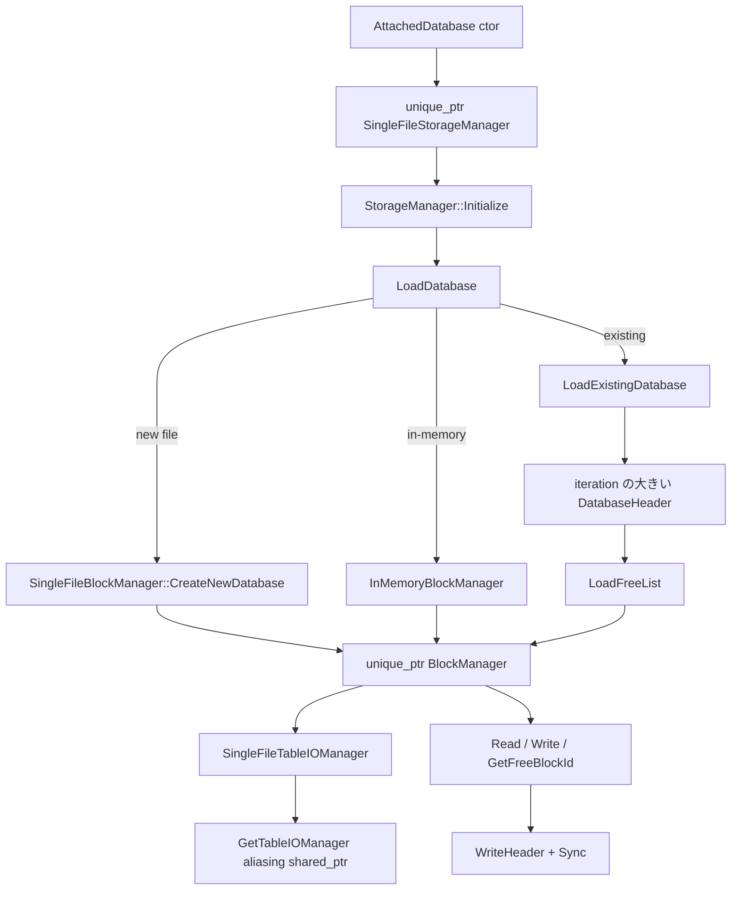

# 第24章 ストレージ全体像とブロック管理

> **本章で読むソース**
>
> - [src/main/attached_database.cpp](https://github.com/duckdb/duckdb/blob/v1.5.4/src/main/attached_database.cpp)
> - [src/storage/storage_manager.cpp](https://github.com/duckdb/duckdb/blob/v1.5.4/src/storage/storage_manager.cpp)
> - [src/include/duckdb/storage/storage_manager.hpp](https://github.com/duckdb/duckdb/blob/v1.5.4/src/include/duckdb/storage/storage_manager.hpp)
> - [src/include/duckdb/storage/table/data_table_info.hpp](https://github.com/duckdb/duckdb/blob/v1.5.4/src/include/duckdb/storage/table/data_table_info.hpp)
> - [src/storage/single_file_block_manager.cpp](https://github.com/duckdb/duckdb/blob/v1.5.4/src/storage/single_file_block_manager.cpp)

## この章の狙い

永続データベースの所有関係を、`AttachedDatabase` から `SingleFileStorageManager`、さらに `SingleFileBlockManager` まで追う。
`single_file_storage_manager.cpp` は存在せず、`SingleFileStorageManager` の実装は `storage_manager.cpp` に置かれている。
単一ファイル上のヘッダ、フリーリスト、ブロック読み書きが、以降のバッファや表データの土台になる。

## 前提

第1章で見た `DatabaseInstance` が複数の `AttachedDatabase` を持つ。
各 attached DB はカタログとトランザクションマネージャに加え、物理ストレージを `unique_ptr<StorageManager>` として所有する。
通常経路の具象型は `SingleFileStorageManager` である。

## AttachedDatabase が StorageManager を所有する

ファイル付き DB を attach すると、`AttachedDatabase` は `DuckCatalog` を作った直後に `SingleFileStorageManager` を生成する。
参照ではなく `unique_ptr` で握り、寿命は attached DB と一体である。

[src/main/attached_database.cpp L128-L147](https://github.com/duckdb/duckdb/blob/v1.5.4/src/main/attached_database.cpp#L128-L147)

```cpp
AttachedDatabase::AttachedDatabase(DatabaseInstance &db, Catalog &catalog_p, string name_p, string file_path_p,
                                   AttachOptions &options)
    : CatalogEntry(CatalogType::DATABASE_ENTRY, catalog_p, std::move(name_p)), db(db), parent_catalog(&catalog_p),
      close_lock(make_shared_ptr<mutex>()) {
	if (options.access_mode == AccessMode::READ_ONLY) {
		type = AttachedDatabaseType::READ_ONLY_DATABASE;
	} else {
		type = AttachedDatabaseType::READ_WRITE_DATABASE;
	}
	recovery_mode = options.recovery_mode;
	visibility = options.visibility;
	vacuum_rebuild_threshold = options.vacuum_rebuild_indexes_threshold;

	// We create the storage after the catalog to guarantee we allow extensions to instantiate the DuckCatalog.
	catalog = make_uniq<DuckCatalog>(*this);
	stored_database_path = std::move(options.stored_database_path);
	storage = make_uniq<SingleFileStorageManager>(*this, std::move(file_path_p), options);
	transaction_manager = make_uniq<DuckTransactionManager>(*this);
	attach_options = options.options;
	internal = true;
}
```

一時 DB でも in-memory パスで同じ `SingleFileStorageManager` を作る。
拡張が独自カタログを返す場合だけ storage 生成が分岐するが、DuckCatalog 経路では再び `SingleFileStorageManager` になる。

## SingleFileStorageManager と BlockManager

ヘッダでは、`SingleFileStorageManager` が `unique_ptr<BlockManager> block_manager` と `unique_ptr<TableIOManager> table_io_manager` を持つと宣言されている。
メタデータも行データも、同じ `BlockManager` を `SingleFileTableIOManager` 経由で見る。

[src/include/duckdb/storage/storage_manager.hpp L189-L212](https://github.com/duckdb/duckdb/blob/v1.5.4/src/include/duckdb/storage/storage_manager.hpp#L189-L212)

```cpp
//! Stores the database in a single file.
class SingleFileStorageManager : public StorageManager {
public:
	SingleFileStorageManager() = delete;
	SingleFileStorageManager(AttachedDatabase &db, string path, AttachOptions &options);

	//! The BlockManager to read from and write to blocks, both for the metadata and the data itself.
	unique_ptr<BlockManager> block_manager;
	//! The table I/O manager.
	unique_ptr<TableIOManager> table_io_manager;

public:
	bool AutomaticCheckpoint(idx_t estimated_wal_bytes) override;
	unique_ptr<StorageCommitState> GenStorageCommitState(WriteAheadLog &wal) override;
	bool IsCheckpointClean(MetaBlockPointer checkpoint_id) override;
	void CreateCheckpoint(QueryContext context, CheckpointOptions options) override;
	DatabaseSize GetDatabaseSize() override;
	vector<MetadataBlockInfo> GetMetadataInfo() override;
	shared_ptr<TableIOManager> GetTableIOManager(BoundCreateTableInfo *info) override;
	BlockManager &GetBlockManager() override;
	void Destroy() override;

protected:
	void LoadDatabase(QueryContext context) override;

	unique_ptr<CheckpointWriter> CreateCheckpointWriter(QueryContext context, CheckpointOptions options);
};
```

初期化は基底の `StorageManager::Initialize` が `LoadDatabase` を呼ぶだけである。

[src/storage/storage_manager.cpp L316-L328](https://github.com/duckdb/duckdb/blob/v1.5.4/src/storage/storage_manager.cpp#L316-L328)

```cpp
void StorageManager::Initialize(QueryContext context) {
	bool in_memory = InMemory();
	if (in_memory && read_only) {
		throw CatalogException("Cannot launch in-memory database in read-only mode!");
	}

	// Create or load the database from disk, if not in-memory mode.
	LoadDatabase(context);

	if (storage_options.encryption) {
		ClearUserKey(storage_options.user_key);
	}
}
```

## LoadDatabase の三分岐

`SingleFileStorageManager::LoadDatabase` は、メモリ上、新規ファイル作成、既存ファイル読込の三経路に分かれる。
インメモリでは `InMemoryBlockManager` を作り、ディスクでは `SingleFileBlockManager` を `unique_ptr` で生成して `CreateNewDatabase` か `LoadExistingDatabase` を呼んでからメンバへ移す。

[src/storage/storage_manager.cpp L358-L442](https://github.com/duckdb/duckdb/blob/v1.5.4/src/storage/storage_manager.cpp#L358-L442)

```cpp
void SingleFileStorageManager::LoadDatabase(QueryContext context) {
	if (InMemory()) {
		block_manager = make_uniq<InMemoryBlockManager>(BufferManager::GetBufferManager(db), DEFAULT_BLOCK_ALLOC_SIZE,
		                                                DEFAULT_BLOCK_HEADER_STORAGE_SIZE);
		table_io_manager = make_uniq<SingleFileTableIOManager>(*block_manager, DEFAULT_ROW_GROUP_SIZE);
		// in-memory databases can always use the latest storage version
		storage_version = GetSerializationVersion("latest");
		load_complete = true;
		return;
	}
	if (storage_options.compress_in_memory != CompressInMemory::AUTOMATIC) {
		throw InvalidInputException("COMPRESS can only be set for in-memory databases");
	}

	auto &fs = FileSystem::Get(db);
	auto &config = DBConfig::Get(db);

	StorageManagerOptions options;
	options.read_only = read_only;
	options.use_direct_io = config.options.use_direct_io;
	options.debug_initialize = config.options.debug_initialize;
	options.storage_version = storage_options.storage_version;

	// ... (中略) ...

	// Check if the database file already exists.
	// Note: a file can also exist if there was a ROLLBACK on a previous transaction creating that file.
	if (!read_only && !fs.FileExists(path)) {
		// file does not exist and we are in read-write mode
		// create a new file

		wal_path = GetWALPath();
		// try to remove the WAL file if it exists
		fs.TryRemoveFile(wal_path);

		// ... (中略) ...

		// Initialize the block manager before creating a new database.
		auto sf_block_manager = make_uniq<SingleFileBlockManager>(db, path, options);
		sf_block_manager->CreateNewDatabase(context);
		block_manager = std::move(sf_block_manager);
		table_io_manager = make_uniq<SingleFileTableIOManager>(*block_manager, row_group_size);
```

既存ファイル側も同様に、一時の `unique_ptr<SingleFileBlockManager>` で `LoadExistingDatabase` したあと `block_manager` へ移す。

[src/storage/storage_manager.cpp L464-L470](https://github.com/duckdb/duckdb/blob/v1.5.4/src/storage/storage_manager.cpp#L464-L470)

```cpp
		// Initialize the block manager while loading the database file.
		// We'll construct the SingleFileBlockManager with the default block allocation size,
		// and later adjust it when reading the file header.
		auto sf_block_manager = make_uniq<SingleFileBlockManager>(db, path, options);
		sf_block_manager->LoadExistingDatabase(context);
		block_manager = std::move(sf_block_manager);
		table_io_manager = make_uniq<SingleFileTableIOManager>(*block_manager, row_group_size);
```

`SingleFileTableIOManager` は参照で `BlockManager` を保持し、行データとインデックスの双方が同じ manager を返す。

[src/storage/storage_manager.cpp L330-L351](https://github.com/duckdb/duckdb/blob/v1.5.4/src/storage/storage_manager.cpp#L330-L351)

```cpp
class SingleFileTableIOManager : public TableIOManager {
public:
	explicit SingleFileTableIOManager(BlockManager &block_manager, idx_t row_group_size)
	    : block_manager(block_manager), row_group_size(row_group_size) {
	}

	BlockManager &block_manager;
	idx_t row_group_size;

public:
	BlockManager &GetIndexBlockManager() override {
		return block_manager;
	}
	BlockManager &GetBlockManagerForRowData() override {
		return block_manager;
	}
	MetadataManager &GetMetadataManager() override {
		return block_manager.GetMetadataManager();
	}
	idx_t GetRowGroupSize() const override {
		return row_group_size;
	}
};
```

## GetTableIOManager の非所有 shared_ptr

表作成時に渡す `TableIOManager` は、見た目は `shared_ptr` だが所有権を移さない。
`GetTableIOManager` は `unique_ptr` が指す生ポインタを、空の制御ブロックを持つ aliasing `shared_ptr` で包んで返す。
コメントどおり ref / deref のコストは無く、寿命は `StorageManager`（`table_io_manager` の `unique_ptr`）に従う。

[src/storage/storage_manager.cpp L782-L786](https://github.com/duckdb/duckdb/blob/v1.5.4/src/storage/storage_manager.cpp#L782-L786)

```cpp
shared_ptr<TableIOManager> SingleFileStorageManager::GetTableIOManager(BoundCreateTableInfo *info /*info*/) {
	// This is an unmanaged reference. No ref/deref overhead. Lifetime of the
	// TableIoManager follows lifetime of the StorageManager (this).
	return shared_ptr<TableIOManager>(shared_ptr<char>(nullptr), table_io_manager.get());
}
```

受け側の `DataTableInfo` もメンバ型は `shared_ptr<TableIOManager>` である。
しかしこの経路では制御ブロックが共有所有を立たせないため、`DataTable` が `shared_ptr` を握っていても `TableIOManager` の破棄タイミングは `SingleFileStorageManager` の寿命に同期する。

[src/include/duckdb/storage/table/data_table_info.hpp L18-L59](https://github.com/duckdb/duckdb/blob/v1.5.4/src/include/duckdb/storage/table/data_table_info.hpp#L18-L59)

```cpp
struct DataTableInfo {
	friend class DataTable;

public:
	DataTableInfo(AttachedDatabase &db, shared_ptr<TableIOManager> table_io_manager_p, string schema, string table);

	//! Bind unknown indexes throwing an exception if binding fails.
	//! Only binds the specified index type, or all, if nullptr.
	void BindIndexes(ClientContext &context, const char *index_type = nullptr);

	//! Whether or not the table is temporary
	bool IsTemporary() const;

	AttachedDatabase &GetDB() {
		return db;
	}

	TableIOManager &GetIOManager() {
		return *table_io_manager;
	}

	TableIndexList &GetIndexes() {
		return indexes;
	}
	//! Find and move out an IndexStorageInfo by name from the stored collection.
	IndexStorageInfo ExtractIndexStorageInfo(const string &name);
	unique_ptr<StorageLockKey> GetSharedLock() {
		return checkpoint_lock.GetSharedLock();
	}
	bool AppendRequiresNewRowGroup(RowGroupCollection &collection, transaction_t checkpoint_id);
	optional_idx CheckpointRowGroupCount(const CheckpointOptions &options) const;
	void VerifyIndexBuffers();

	string GetSchemaName();
	string GetTableName();
	void SetTableName(string name);

private:
	//! The database instance of the table
	AttachedDatabase &db;
	//! The table IO manager
	shared_ptr<TableIOManager> table_io_manager;
```

## 新規データベースのヘッダ配置

`CreateNewDatabase` はファイルを開き、MainHeader と二つの DatabaseHeader を書き込む。
内容ブロックはまだ無く、`meta_block` と `free_list` は `INVALID_BLOCK` である。
二つの DatabaseHeader はチェックポイント時の原子性のための二重ヘッダである。

[src/storage/single_file_block_manager.cpp L459-L557](https://github.com/duckdb/duckdb/blob/v1.5.4/src/storage/single_file_block_manager.cpp#L459-L557)

```cpp
void SingleFileBlockManager::CreateNewDatabase(QueryContext context) {
	auto flags = GetFileFlags(true);

	auto encryption_enabled = options.encryption_options.encryption_enabled;
	if (encryption_enabled) {
		// Check if we can read/write the encrypted database
		db.GetDatabase().GetEncryptionUtil(options.read_only);
	}

	// open the RDBMS handle
	auto &fs = FileSystem::Get(db);
	handle = fs.OpenFile(path, flags);
	header_buffer.Clear();

	options.version_number = GetVersionNumber();
	db.GetStorageManager().SetStorageVersion(options.storage_version.GetIndex());
	AddStorageVersionTag();

	MainHeader main_header = ConstructMainHeader(options.version_number.GetIndex());

	// ... (中略) ...

	// Write the main database header.
	SerializeHeaderStructure<MainHeader>(main_header, header_buffer.buffer);
	ChecksumAndWrite(context, header_buffer, 0, true);

	// write the database headers
	// initialize meta_block and free_list to INVALID_BLOCK because the database file does not contain any actual
	// content yet
	DatabaseHeader h1;
	// header 1
	h1.iteration = 0;
	h1.meta_block = idx_t(INVALID_BLOCK);
	h1.free_list = idx_t(INVALID_BLOCK);
	h1.block_count = 0;
	// We create the SingleFileBlockManager with the desired block allocation size before calling CreateNewDatabase.
	h1.block_alloc_size = GetBlockAllocSize();
	h1.vector_size = STANDARD_VECTOR_SIZE;
	h1.serialization_compatibility = options.storage_version.GetIndex();
	SerializeHeaderStructure<DatabaseHeader>(h1, header_buffer.buffer);
	ChecksumAndWrite(context, header_buffer, Storage::FILE_HEADER_SIZE);

	// header 2
	DatabaseHeader h2;
	h2.iteration = 0;
	h2.meta_block = idx_t(INVALID_BLOCK);
	h2.free_list = idx_t(INVALID_BLOCK);
	h2.block_count = 0;
	// We create the SingleFileBlockManager with the desired block allocation size before calling CreateNewDatabase.
	h2.block_alloc_size = GetBlockAllocSize();
	h2.vector_size = STANDARD_VECTOR_SIZE;
	h2.serialization_compatibility = options.storage_version.GetIndex();
	SerializeHeaderStructure<DatabaseHeader>(h2, header_buffer.buffer);
	ChecksumAndWrite(context, header_buffer, Storage::FILE_HEADER_SIZE * 2ULL);
```

## 既存データベースのロード

`LoadExistingDatabase` は MainHeader を検証したあと、ふたつの DatabaseHeader を読み、`iteration` が大きい方をアクティブにする。
選んだヘッダで `Initialize` し、続けて `LoadFreeList` で空きブロック集合を復元する。

[src/storage/single_file_block_manager.cpp L648-L669](https://github.com/duckdb/duckdb/blob/v1.5.4/src/storage/single_file_block_manager.cpp#L648-L669)

```cpp
	// read the database headers from disk
	DatabaseHeader h1;
	ReadAndChecksum(context, header_buffer, Storage::FILE_HEADER_SIZE);
	h1 = DeserializeDatabaseHeader(main_header, header_buffer.buffer);

	DatabaseHeader h2;
	ReadAndChecksum(context, header_buffer, Storage::FILE_HEADER_SIZE * 2ULL);
	h2 = DeserializeDatabaseHeader(main_header, header_buffer.buffer);

	// check the header with the highest iteration count
	if (h1.iteration > h2.iteration) {
		// h1 is active header
		active_header = 0;
		Initialize(h1, GetOptionalBlockAllocSize());
	} else {
		// h2 is active header
		active_header = 1;
		Initialize(h2, GetOptionalBlockAllocSize());
	}
	AddStorageVersionTag();
	LoadFreeList(context);
}
```

[src/storage/single_file_block_manager.cpp L764-L798](https://github.com/duckdb/duckdb/blob/v1.5.4/src/storage/single_file_block_manager.cpp#L764-L798)

```cpp
void SingleFileBlockManager::Initialize(const DatabaseHeader &header, const optional_idx block_alloc_size) {
	free_list_id = header.free_list;
	meta_block = header.meta_block;
	iteration_count = header.iteration;
	max_block = NumericCast<block_id_t>(header.block_count);
	if (options.storage_version.IsValid()) {
		// storage version specified explicity - use requested storage version
		auto requested_compat_version = options.storage_version.GetIndex();
		if (requested_compat_version < header.serialization_compatibility) {
			throw InvalidInputException(
			    "Error opening \"%s\": cannot initialize database with storage version %d - which is lower than what "
			    "the database itself uses (%d). The storage version of an existing database cannot be lowered.",
			    path, requested_compat_version, header.serialization_compatibility);
		}
	} else {
		// load storage version from header
		options.storage_version = header.serialization_compatibility;
	}
	// ... (中略) ...

	SetBlockAllocSize(header.block_alloc_size);
}
```

## フリーリストとブロック割当

空きブロックは `free_list` の先頭から再利用し、無ければ `max_block` を伸ばして新しい ID を返す。
割当後は `newly_used_blocks` に入れ、チェックポイント完了までヘッダ上のフリーリスト扱いを保つ。

[src/storage/single_file_block_manager.cpp L829-L852](https://github.com/duckdb/duckdb/blob/v1.5.4/src/storage/single_file_block_manager.cpp#L829-L852)

```cpp
block_id_t SingleFileBlockManager::GetFreeBlockIdInternal(FreeBlockType type) {
	lock_guard<mutex> lock(single_file_block_lock);
	block_id_t block_id;
	if (!free_list.empty()) {
		// The free list is not empty, so we take its first element.
		block_id = *free_list.begin();
		// erase the entry from the free list again
		free_list.erase(free_list.begin());
	} else {
		block_id = max_block++;
	}
	// add the entry to the list of newly used blocks
	if (type == FreeBlockType::NEWLY_USED_BLOCK) {
		newly_used_blocks.insert(block_id);
	}
	if (BlockIsRegistered(block_id)) {
		throw InternalException("Free block %d is already registered", block_id);
	}
	return block_id;
}

block_id_t SingleFileBlockManager::GetFreeBlockId() {
	return GetFreeBlockIdInternal(FreeBlockType::NEWLY_USED_BLOCK);
}
```

## 読み書きとヘッダ更新

ブロック本体のファイル位置は `BLOCK_START + block_id * block_alloc_size` である。
読込はチェックサム検証、書込はチェックサム計算を挟む。
チェックポイント時の `WriteHeader` は、先にフリーリストとメタデータを書き、`Sync` したあとでだけ DatabaseHeader を交替する。

[src/storage/single_file_block_manager.cpp L1089-L1150](https://github.com/duckdb/duckdb/blob/v1.5.4/src/storage/single_file_block_manager.cpp#L1089-L1150)

```cpp
idx_t SingleFileBlockManager::GetBlockLocation(block_id_t block_id) const {
	return BLOCK_START + NumericCast<idx_t>(block_id) * GetBlockAllocSize();
}

void SingleFileBlockManager::ReadBlock(data_ptr_t internal_buffer, uint64_t block_size, bool skip_block_header) const {
	//! calculate delta header bytes (if any)
	uint64_t delta = GetBlockHeaderSize() - Storage::DEFAULT_BLOCK_HEADER_SIZE;

	if (options.encryption_options.encryption_enabled && !skip_block_header) {
		EncryptionEngine::DecryptBlock(db, options.encryption_options.derived_key_id, internal_buffer, block_size,
		                               delta);
	}

	CheckChecksum(internal_buffer, delta, skip_block_header);
}

// ... (中略) ...

void SingleFileBlockManager::Read(QueryContext context, Block &block) {
	D_ASSERT(block.id >= 0);
	D_ASSERT(std::find(free_list.begin(), free_list.end(), block.id) == free_list.end());
	ReadAndChecksum(context, block, GetBlockLocation(block.id));
}

// ... (中略) ...

void SingleFileBlockManager::Write(QueryContext context, FileBuffer &buffer, block_id_t block_id) {
	D_ASSERT(block_id >= 0);
	ChecksumAndWrite(context, buffer, BLOCK_START + NumericCast<idx_t>(block_id) * GetBlockAllocSize());
}
```

[src/storage/single_file_block_manager.cpp L1249-L1317](https://github.com/duckdb/duckdb/blob/v1.5.4/src/storage/single_file_block_manager.cpp#L1249-L1317)

```cpp
void SingleFileBlockManager::WriteHeader(QueryContext context, DatabaseHeader header) {
	auto free_list_blocks = GetFreeListBlocks();

	// now handle the free list
	auto &metadata_manager = GetMetadataManager();
	// add all modified blocks to the free list: they can now be written to again
	metadata_manager.MarkBlocksAsModified();

	unique_lock<mutex> lock(single_file_block_lock);
	// set the iteration count
	header.iteration = ++iteration_count;

	set<block_id_t> all_free_blocks = free_list;
	set<block_id_t> fully_freed_blocks;
	for (auto &block : modified_blocks) {
		all_free_blocks.insert(block);
		if (AddFreeBlock(lock, block)) {
			fully_freed_blocks.insert(block);
		}
	}
	// ... (中略) ...

	lock.unlock();
	metadata_manager.Flush();

	lock.lock();
	header.block_count = NumericCast<idx_t>(max_block);
	lock.unlock();

	header.serialization_compatibility = options.storage_version.GetIndex();

	// ... (中略) ...

	// We need to fsync BEFORE we write the header to ensure that all the previous blocks are written as well
	handle->Sync();
```

## 処理の流れ



所有の軸は一貫している。
`AttachedDatabase` が `StorageManager` を、`SingleFileStorageManager` が `BlockManager` と `TableIOManager` を `unique_ptr` で持つ。
表層の I/O は参照で同じ `BlockManager` を共有し、`GetTableIOManager` が返す `shared_ptr` だけは非所有の例外である。

## 高速化と最適化の工夫

空きブロックをフリーリスト先頭から再利用し、ファイル末尾への追記を抑える。
末尾連続の空きは `Truncate` で切り詰め、物理サイズを戻す。
チェックポイントではデータとフリーリストを先に永続化し、最後に二重ヘッダの一方だけを切り替えるので、途中失敗でも古いヘッダへ戻れる。

## まとめ

ストレージの入口は `AttachedDatabase` が所有する `SingleFileStorageManager` であり、実装ファイルは `storage_manager.cpp` 内にある。
ディスク上の実体は `SingleFileBlockManager` が単一ファイルとして管理し、ヘッダ、フリーリスト、固定サイズブロックの割当とチェックサム付き I/O を担う。
`GetTableIOManager` の aliasing `shared_ptr` は型上の共有所有ではなく、寿命は `StorageManager` 側の `unique_ptr` に従う。
次章のバッファマネージャは、このブロック単位の読込をメモリ上の pin / unpin に載せる。

## 関連する章

- 第1章（アーキテクチャ全体像）
- 第25章（バッファマネージャ）
- 第26章（row group と列データ）
- 第28章（WAL とチェックポイント）
