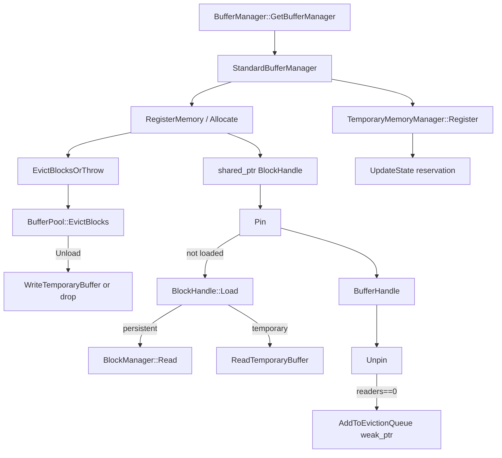

# 第25章 バッファマネージャ

> **本章で読むソース**
>
> - [src/storage/buffer_manager.cpp](https://github.com/duckdb/duckdb/blob/v1.5.4/src/storage/buffer_manager.cpp)
> - [src/storage/standard_buffer_manager.cpp](https://github.com/duckdb/duckdb/blob/v1.5.4/src/storage/standard_buffer_manager.cpp)
> - [src/storage/buffer/block_handle.cpp](https://github.com/duckdb/duckdb/blob/v1.5.4/src/storage/buffer/block_handle.cpp)
> - [src/storage/buffer/buffer_pool.cpp](https://github.com/duckdb/duckdb/blob/v1.5.4/src/storage/buffer/buffer_pool.cpp)
> - [src/storage/buffer/block_manager.cpp](https://github.com/duckdb/duckdb/blob/v1.5.4/src/storage/buffer/block_manager.cpp)
> - [src/include/duckdb/storage/block_manager.hpp](https://github.com/duckdb/duckdb/blob/v1.5.4/src/include/duckdb/storage/block_manager.hpp)
> - [src/storage/temporary_memory_manager.cpp](https://github.com/duckdb/duckdb/blob/v1.5.4/src/storage/temporary_memory_manager.cpp)

## この章の狙い

ディスクブロックと一時メモリを、プロセス内の固定上限下で受け渡すバッファ層を追う。
入口の抽象は `BufferManager`、通常経路の実装は `StandardBufferManager` である。
`BlockHandle` がブロックごとの状態を持ち、pin / unpin と eviction がメモリ契約を守る。

## 前提

第24章の `BlockManager` はファイル上のブロック ID を扱う。
実際にメモリへ載せるのはバッファマネージャであり、`DatabaseInstance` が `StandardBufferManager` を所有する。
クライアント文脈からの取得は静的ヘルパ経由である。

[src/storage/buffer_manager.cpp L16-L36](https://github.com/duckdb/duckdb/blob/v1.5.4/src/storage/buffer_manager.cpp#L16-L36)

```cpp
BufferManager &BufferManager::GetBufferManager(DatabaseInstance &db) {
	return db.GetBufferManager();
}

const BufferManager &BufferManager::GetBufferManager(const DatabaseInstance &db) {
	return db.GetBufferManager();
}

BufferManager &BufferManager::GetBufferManager(ClientContext &context) {
	auto &client_data = ClientData::Get(context);
	return *client_data.client_buffer_manager;
}

const BufferManager &BufferManager::GetBufferManager(const ClientContext &context) {
	auto &client_data = ClientData::Get(context);
	return *client_data.client_buffer_manager;
}

BufferManager &BufferManager::GetBufferManager(AttachedDatabase &db) {
	return BufferManager::GetBufferManager(db.GetDatabase());
}
```

## StandardBufferManager の構成

`StandardBufferManager` は DB 共有の `BufferPool` 参照と、一時ブロック用の `InMemoryBlockManager`（`temp_block_manager`）を持つ。
一時ディレクトリパスはコンストラクタ引数で受け取り、必要になるまで実ファイルを作らない。

[src/storage/standard_buffer_manager.cpp L65-L86](https://github.com/duckdb/duckdb/blob/v1.5.4/src/storage/standard_buffer_manager.cpp#L65-L86)

```cpp
StandardBufferManager::StandardBufferManager(DatabaseInstance &db, string tmp)
    : BufferManager(), db(db), buffer_pool(db.GetBufferPool()), temporary_id(MAXIMUM_BLOCK),
      buffer_allocator(BufferAllocatorAllocate, BufferAllocatorFree, BufferAllocatorRealloc,
                       make_uniq<BufferAllocatorData>(*this)) {
	temp_block_manager =
	    make_uniq<InMemoryBlockManager>(*this, DEFAULT_BLOCK_ALLOC_SIZE, DEFAULT_BLOCK_HEADER_STORAGE_SIZE);
	temporary_directory.path = std::move(tmp);
	for (idx_t i = 0; i < MEMORY_TAG_COUNT; i++) {
		evicted_data_per_tag[i] = 0;
	}
}

StandardBufferManager::~StandardBufferManager() {
}

BufferPool &StandardBufferManager::GetBufferPool() const {
	return buffer_pool;
}

TemporaryMemoryManager &StandardBufferManager::GetTemporaryMemoryManager() {
	return buffer_pool.GetTemporaryMemoryManager();
}
```

## メモリ登録と割当

恒久ブロック以外の一時メモリは `RegisterMemory` が作る。
先に `EvictBlocksOrThrow` で枠を確保し、再利用可能な `FileBuffer` があれば `ConstructManagedBuffer` に渡す。
返り値の型は `shared_ptr<BlockHandle>` だが、バッファ層がマップやキューで強参照を握り続けるわけではない。

[src/storage/standard_buffer_manager.cpp L119-L179](https://github.com/duckdb/duckdb/blob/v1.5.4/src/storage/standard_buffer_manager.cpp#L119-L179)

```cpp
template <typename... ARGS>
TempBufferPoolReservation StandardBufferManager::EvictBlocksOrThrow(MemoryTag tag, idx_t memory_delta,
                                                                    unique_ptr<FileBuffer> *buffer, ARGS... args) {
	auto r = buffer_pool.EvictBlocks(tag, memory_delta, buffer_pool.maximum_memory, buffer);
	if (!r.success) {
		string extra_text = StringUtil::Format(" (%s/%s used)", StringUtil::BytesToHumanReadableString(GetUsedMemory()),
		                                       StringUtil::BytesToHumanReadableString(GetMaxMemory()));
		extra_text += InMemoryWarning();
		throw OutOfMemoryException(args..., extra_text);
	}
	return std::move(r.reservation);
}

shared_ptr<BlockHandle> StandardBufferManager::RegisterTransientMemory(const idx_t size, BlockManager &block_manager) {
	D_ASSERT(size <= block_manager.GetBlockSize());

	// This comparison is the reason behind passing block_size through transient memory creation.
	// Otherwise, any non-default block size would register as small memory, causing problems when
	// trying to convert that memory to consistent blocks later on.
	if (size < block_manager.GetBlockSize()) {
		return RegisterSmallMemory(MemoryTag::IN_MEMORY_TABLE, size);
	}

	auto buffer_handle = Allocate(MemoryTag::IN_MEMORY_TABLE, &block_manager, false);
	return buffer_handle.GetBlockHandle();
}

// ... (中略) ...

shared_ptr<BlockHandle> StandardBufferManager::RegisterMemory(MemoryTag tag, idx_t block_size, idx_t block_header_size,
                                                              bool can_destroy) {
	auto alloc_size = GetAllocSize(block_size + block_header_size);

	// Evict blocks until there is enough memory to store the buffer.
	unique_ptr<FileBuffer> reusable_buffer;
	auto res = EvictBlocksOrThrow(tag, alloc_size, &reusable_buffer, "could not allocate block of size %s%s",
	                              StringUtil::BytesToHumanReadableString(alloc_size));

	// Create a new buffer and a block to hold the buffer.
	const auto file_buffer_type =
	    tag == MemoryTag::EXTERNAL_FILE_CACHE ? FileBufferType::EXTERNAL_FILE : FileBufferType::MANAGED_BUFFER;
	auto buffer = ConstructManagedBuffer(block_size, block_header_size, std::move(reusable_buffer), file_buffer_type);
	const auto destroy_buffer_upon = can_destroy ? DestroyBufferUpon::EVICTION : DestroyBufferUpon::BLOCK;
	return make_shared_ptr<BlockHandle>(*temp_block_manager, ++temporary_id, tag, std::move(buffer),
	                                    destroy_buffer_upon, alloc_size, std::move(res));
}
```

`Allocate` は登録した直後に `Pin` し、呼び出し側へ `BufferHandle` を返す。

[src/storage/standard_buffer_manager.cpp L191-L209](https://github.com/duckdb/duckdb/blob/v1.5.4/src/storage/standard_buffer_manager.cpp#L191-L209)

```cpp
BufferHandle StandardBufferManager::Allocate(MemoryTag tag, BlockManager *block_manager, bool can_destroy) {
	auto block = AllocateMemory(tag, block_manager, can_destroy);

#ifdef DUCKDB_DEBUG_DESTROY_BLOCKS
	// Initialize the memory with garbage data
	WriteGarbageIntoBuffer(*block);
#endif
	return Pin(block);
}

BufferHandle StandardBufferManager::Allocate(MemoryTag tag, idx_t block_size, bool can_destroy) {
	auto block = AllocateTemporaryMemory(tag, block_size, can_destroy);

#ifdef DUCKDB_DEBUG_DESTROY_BLOCKS
	// Initialize the memory with garbage data
	WriteGarbageIntoBuffer(*block);
#endif
	return Pin(block);
}
```

## 強参照と弱参照の境界

`BlockManager::blocks` は `weak_ptr<BlockHandle>` のマップである。
`RegisterBlock` は返す `shared_ptr` をそのまま載せず、弱参照だけを登録する。
マップがブロックを生かさないので、利用側が強参照を手放せばハンドルは消え得る。

[src/include/duckdb/storage/block_manager.hpp L190-L194](https://github.com/duckdb/duckdb/blob/v1.5.4/src/include/duckdb/storage/block_manager.hpp#L190-L194)

```cpp
private:
	//! The lock for the set of blocks
	mutex blocks_lock;
	//! A mapping of block id -> BlockHandle
	unordered_map<block_id_t, weak_ptr<BlockHandle>> blocks;
```

[src/storage/buffer/block_manager.cpp L40-L57](https://github.com/duckdb/duckdb/blob/v1.5.4/src/storage/buffer/block_manager.cpp#L40-L57)

```cpp
shared_ptr<BlockHandle> BlockManager::RegisterBlock(block_id_t block_id) {
	lock_guard<mutex> lock(blocks_lock);
	// check if the block already exists
	auto entry = blocks.find(block_id);
	if (entry != blocks.end()) {
		// already exists: check if it hasn't expired yet
		auto existing_ptr = entry->second.lock();
		if (existing_ptr) {
			//! it hasn't! return it
			return existing_ptr;
		}
	}
	// create a new block pointer for this block
	auto result = make_shared_ptr<BlockHandle>(*this, block_id, MemoryTag::BASE_TABLE);
	// register the block pointer in the set of blocks as a weak pointer
	blocks[block_id] = weak_ptr<BlockHandle>(result);
	return result;
}
```

eviction キューも同様に、`BufferEvictionNode` が `weak_ptr<BlockMemory>` だけを持つ。
`AddToEvictionQueue` は `GetMemoryWeak()` で弱い参照を積む。

[src/storage/buffer/buffer_pool.cpp L260-L282](https://github.com/duckdb/duckdb/blob/v1.5.4/src/storage/buffer/buffer_pool.cpp#L260-L282)

```cpp
bool BufferPool::AddToEvictionQueue(shared_ptr<BlockHandle> &handle) {
	auto &memory = handle->GetMemory();
	auto &queue = GetEvictionQueueForBlockMemory(memory);

	// The block handle is locked during this operation (Unpin),
	// or the block handle is still a local variable (ConvertToPersistent)
	D_ASSERT(memory.GetReaders() == 0);
	auto ts = memory.NextEvictionSequenceNumber();
	if (track_eviction_timestamps) {
		memory.SetLRUTimestamp(std::chrono::time_point_cast<std::chrono::milliseconds>(std::chrono::steady_clock::now())
		                           .time_since_epoch()
		                           .count());
	}

	if (ts != 1) {
		// we add a newer version, i.e., we kill exactly one previous version
		queue.IncrementDeadNodes();
	}

	// Get the eviction queue for the block and add it
	BufferEvictionNode node(handle->GetMemoryWeak(), ts);
	return queue.AddToEvictionQueue(std::move(node));
}
```

強参照の側は次の三者に分かれる。
第一に、`ColumnSegment` など利用側が保持する `shared_ptr<BlockHandle>` である。
第二に、pin 中の `BufferHandle` が指す `BlockHandle` である。
第三に、`BlockHandle` 自身が内部の `BlockMemory` を `shared_ptr`（`memory_p`）で強所有する関係である。
地図とキューは弱参照、実体を生かすのは利用側と pin、ページ実体の所有者は `BlockHandle`、という境界になる。

## BlockHandle と Load

`BlockHandle` は参照する `BlockManager` と、実体の `BlockMemory`（`shared_ptr`）を持つ。
`Load` は未ロードなら永続ブロックを `BlockManager::Read` でディスクから読み、一時ブロックは `ReadTemporaryBuffer` へ回す。
既に LOADED ならリーダ数だけ増やす。

[src/storage/buffer/block_handle.cpp L148-L163](https://github.com/duckdb/duckdb/blob/v1.5.4/src/storage/buffer/block_handle.cpp#L148-L163)

```cpp
BlockHandle::BlockHandle(BlockManager &block_manager, block_id_t block_id_p, MemoryTag tag_p)
    : block_manager(block_manager), block_alloc_size(block_manager.GetBlockAllocSize()),
      block_header_size(block_manager.GetBlockHeaderSize()), block_id(block_id_p),
      memory_p(make_shared_ptr<BlockMemory>(block_manager.GetBufferManager(), block_id_p, tag_p, block_alloc_size)),
      memory(*memory_p) {
}

BlockHandle::BlockHandle(BlockManager &block_manager, block_id_t block_id_p, MemoryTag tag_p,
                         unique_ptr<FileBuffer> buffer_p, DestroyBufferUpon destroy_buffer_upon_p, idx_t size_p,
                         BufferPoolReservation &&reservation)
    : block_manager(block_manager), block_alloc_size(block_manager.GetBlockAllocSize()),
      block_header_size(block_manager.GetBlockHeaderSize()), block_id(block_id_p),
      memory_p(make_shared_ptr<BlockMemory>(block_manager.GetBufferManager(), block_id_p, tag_p, std::move(buffer_p),
                                            destroy_buffer_upon_p, size_p, std::move(reservation))),
      memory(*memory_p) {
}
```

[src/storage/buffer/block_handle.cpp L211-L236](https://github.com/duckdb/duckdb/blob/v1.5.4/src/storage/buffer/block_handle.cpp#L211-L236)

```cpp
BufferHandle BlockHandle::Load(QueryContext context, unique_ptr<FileBuffer> reusable_buffer) {
	if (memory.GetState() == BlockState::BLOCK_LOADED) {
		// The block has already been loaded.
		D_ASSERT(memory.GetBuffer());
		memory.IncrementReaders();
		return BufferHandle(shared_from_this(), memory.GetBuffer());
	}

	if (BlockId() < MAXIMUM_BLOCK) {
		auto block = AllocateBlock(block_manager, std::move(reusable_buffer), block_id);
		block_manager.Read(context, *block);
		memory.GetBuffer() = std::move(block);
	} else {
		if (!memory.MustWriteToTemporaryFile()) {
			// The buffer was destroyed upon unpin/evict, so there is no temporary buffer to read.
			return BufferHandle();
		}
		auto &buffer_manager = memory.GetBufferManager();
		auto &buffer = memory.GetBuffer();
		buffer = buffer_manager.ReadTemporaryBuffer(QueryContext(), memory.GetMemoryTag(), *this,
		                                            std::move(reusable_buffer));
	}
	memory.SetState(BlockState::BLOCK_LOADED);
	memory.SetReaders(1);
	return BufferHandle(shared_from_this(), memory.GetBuffer());
}
```

unload では、破棄できない一時ブロックだけ一時ファイルへ書き戻す。

[src/storage/buffer/block_handle.cpp L105-L146](https://github.com/duckdb/duckdb/blob/v1.5.4/src/storage/buffer/block_handle.cpp#L105-L146)

```cpp
bool BlockMemory::CanUnload() const {
	if (GetState() == BlockState::BLOCK_UNLOADED) {
		// The block has already been unloaded.
		return false;
	}
	if (GetReaders() > 0) {
		// There are active readers.
		return false;
	}
	if (BlockId() >= MAXIMUM_BLOCK && MustWriteToTemporaryFile() && !GetBufferManager().HasTemporaryDirectory()) {
		// The block memory cannot be destroyed upon eviction/unpinning.
		// In order to unload this block we need to write it to a temporary buffer.
		// However, no temporary directory is specified, hence, we cannot unload.
		return false;
	}
	return true;
}

unique_ptr<FileBuffer> BlockMemory::UnloadAndTakeBlock(BlockLock &l) {
	VerifyMutex(l);

	if (GetState() == BlockState::BLOCK_UNLOADED) {
		// The block was already unloaded: nothing to do.
		return nullptr;
	}
	D_ASSERT(IsSwizzled());
	D_ASSERT(CanUnload());

	if (BlockId() >= MAXIMUM_BLOCK && MustWriteToTemporaryFile()) {
		// This is a temporary block that cannot be destroyed upon evict/unpin.
		// Thus, we write to it to a temporary file.
		buffer_manager.WriteTemporaryBuffer(GetMemoryTag(), BlockId(), *GetBuffer());
	}
	memory_charge.Resize(0);
	SetState(BlockState::BLOCK_UNLOADED);
	return std::move(GetBuffer());
}

void BlockMemory::Unload(BlockLock &l) {
	auto block = UnloadAndTakeBlock(l);
	block.reset();
}
```

## Pin と Unpin

`Pin` は、LOADED ならすぐ `Load`（リーダ増）で返し、そうでなければ eviction で枠を確保してから再ロックして読み込む。
ロック保持中に `BufferHandle` を返さないのは、デストラクタの `Unpin` とのデッドロックを避けるためである。

[src/storage/standard_buffer_manager.cpp L307-L366](https://github.com/duckdb/duckdb/blob/v1.5.4/src/storage/standard_buffer_manager.cpp#L307-L366)

```cpp
BufferHandle StandardBufferManager::Pin(const QueryContext &context, shared_ptr<BlockHandle> &handle) {
	// we need to be careful not to return the BufferHandle to this block while holding the BlockHandle's lock
	// as exiting this function's scope may cause the destructor of the BufferHandle to be called while holding the lock
	// the destructor calls Unpin, which grabs the BlockHandle's lock again, causing a deadlock
	BufferHandle buf;

	idx_t required_memory;
	auto &block_memory = handle->GetMemory();
	{
		// lock the block
		auto lock = block_memory.GetLock();
		// check if the block is already loaded
		if (block_memory.GetState() == BlockState::BLOCK_LOADED) {
			// the block is loaded, increment the reader count and set the BufferHandle
			buf = handle->Load(context);
		}
		required_memory = block_memory.GetMemoryUsage();
	}

	if (buf.IsValid()) {
		return buf; // the block was already loaded, return it without holding the BlockHandle's lock
	}

	// evict blocks until we have space for the current block
	unique_ptr<FileBuffer> reusable_buffer;
	auto reservation =
	    EvictBlocksOrThrow(block_memory.GetMemoryTag(), required_memory, &reusable_buffer,
	                       "failed to pin block of size %s%s", StringUtil::BytesToHumanReadableString(required_memory));

	// lock the handle again and repeat the check (in case anybody loaded in the meantime)
	auto lock = block_memory.GetLock();
	// check if the block is already loaded
	if (block_memory.GetState() == BlockState::BLOCK_LOADED) {
		// the block is loaded, increment the reader count and return a pointer to the handle
		reservation.Resize(0);
		buf = handle->Load(context);
	} else {
		// now we can actually load the current block
		D_ASSERT(block_memory.GetReaders() == 0);
		buf = handle->Load(context, std::move(reusable_buffer));
		if (!buf.IsValid()) {
			reservation.Resize(0);
			return buf; // Buffer was destroyed (e.g., due to DestroyBufferUpon::Eviction)
		}
		auto &memory_charge = block_memory.GetMemoryCharge(lock);
		memory_charge = std::move(reservation);
		// in the case of a variable sized block, the buffer may be smaller than a full block.
		int64_t delta = NumericCast<int64_t>(block_memory.GetBuffer(lock)->AllocSize()) -
		                NumericCast<int64_t>(block_memory.GetMemoryUsage());
		if (delta) {
			block_memory.ChangeMemoryUsage(lock, delta);
		}
		D_ASSERT(block_memory.GetMemoryUsage() == block_memory.GetBuffer(lock)->AllocSize());
	}

	// we should have a valid BufferHandle by now, either because the block was already loaded, or because we loaded it
	// return it without holding the BlockHandle's lock
	D_ASSERT(buf.IsValid());
	return buf;
}
```

`Unpin` はリーダを減らし、ゼロになったら eviction キューへ載せるか即 unload する。

[src/storage/standard_buffer_manager.cpp L396-L420](https://github.com/duckdb/duckdb/blob/v1.5.4/src/storage/standard_buffer_manager.cpp#L396-L420)

```cpp
void StandardBufferManager::Unpin(shared_ptr<BlockHandle> &handle) {
	bool purge = false;
	auto &block_memory = handle->GetMemory();
	{
		auto lock = block_memory.GetLock();
		if (!block_memory.GetBuffer(lock) || block_memory.GetBufferType() == FileBufferType::TINY_BUFFER) {
			return;
		}
		D_ASSERT(block_memory.GetReaders() > 0);
		auto new_readers = block_memory.DecrementReaders();
		if (new_readers == 0) {
			VerifyZeroReaders(lock, handle);
			if (block_memory.MustAddToEvictionQueue()) {
				purge = buffer_pool.AddToEvictionQueue(handle);
			} else {
				block_memory.Unload(lock);
			}
		}
	}

	// We do not have to keep the handle locked while purging.
	if (purge) {
		PurgeQueue(*handle);
	}
}
```

## Eviction

`BufferPool::EvictBlocks` はキューを順に試し、足りなければ object cache も落とす。
内部では unload 可能なブロックを走査し、大きさが一致すればバッファを再利用用に奪い取る。

[src/storage/buffer/buffer_pool.cpp L361-L415](https://github.com/duckdb/duckdb/blob/v1.5.4/src/storage/buffer/buffer_pool.cpp#L361-L415)

```cpp
BufferPool::EvictionResult BufferPool::EvictBlocks(MemoryTag tag, idx_t extra_memory, idx_t memory_limit,
                                                   unique_ptr<FileBuffer> *buffer) {
	for (auto &queue : queues) {
		auto block_result = EvictBlocksInternal(*queue, tag, extra_memory, memory_limit, buffer);
		if (block_result.success) {
			return block_result;
		}
	}

	// Evict object cache, which is usually used to cache metadata and configs, when flushing buffer blocks alone is not
	// enough to limit overall memory consumption.
	return EvictObjectCacheEntries(tag, extra_memory, memory_limit);
}

BufferPool::EvictionResult BufferPool::EvictBlocksInternal(EvictionQueue &queue, MemoryTag tag, idx_t extra_memory,
                                                           idx_t memory_limit, unique_ptr<FileBuffer> *buffer) {
	TempBufferPoolReservation r(tag, *this, extra_memory);
	bool found = false;

	if (memory_usage.GetUsedMemory(MemoryUsageCaches::NO_FLUSH) <= memory_limit) {
		if (extra_memory > allocator_bulk_deallocation_flush_threshold) {
			block_allocator.FlushAll(extra_memory);
		}
		return {true, std::move(r)};
	}

	queue.IterateUnloadableBlocks([&](BufferEvictionNode &, const shared_ptr<BlockMemory> &handle, BlockLock &lock) {
		// hooray, we can unload the block
		if (buffer && handle->GetBuffer(lock)->AllocSize() == extra_memory) {
			// we can re-use the memory directly
			*buffer = handle->UnloadAndTakeBlock(lock);
			found = true;
			return false;
		}

		// release the memory and mark the block as unloaded
		handle->Unload(lock);

		if (memory_usage.GetUsedMemory(MemoryUsageCaches::NO_FLUSH) <= memory_limit) {
			found = true;
			return false;
		}

		// Continue iteration
		return true;
	});

	if (!found) {
		r.Resize(0);
	} else if (extra_memory > allocator_bulk_deallocation_flush_threshold) {
		block_allocator.FlushAll(extra_memory);
	}

	return {found, std::move(r)};
}
```

## temporary memory

演算子が一時的に使う大きな作業領域は、`TemporaryMemoryManager`（`BufferPool` 所有）が予約量を調停する。
`StandardBufferManager::GetTemporaryMemoryManager` がその入口である。
第20章から第22章で見たハッシュ結合、集約、ソートの external 化判定は、ここで割り当てられる reservation を前提にする。

`Register` は状態を作り、minimum reservation を `remaining_size` と `reservation` の双方に載せ、`active_states` へ入れる。
以後の `UpdateState` が、実行時条件で reservation を上げ下げする。

[src/storage/temporary_memory_manager.cpp L108-L162](https://github.com/duckdb/duckdb/blob/v1.5.4/src/storage/temporary_memory_manager.cpp#L108-L162)

```cpp
unique_ptr<TemporaryMemoryState> TemporaryMemoryManager::Register(ClientContext &context) {
	auto guard = Lock();
	UpdateConfiguration(context);

	auto result = unique_ptr<TemporaryMemoryState>(new TemporaryMemoryState(*this, DefaultMinimumReservation()));
	SetRemainingSize(*result, result->GetMinimumReservation());
	SetReservation(*result, result->GetMinimumReservation());
	active_states.insert(*result);

	Verify();
	return result;
}

void TemporaryMemoryManager::UpdateState(ClientContext &context, TemporaryMemoryState &temporary_memory_state) {
	UpdateConfiguration(context);

	// The lower bound for the reservation of this state is either the minimum reservation or the remaining size
	const auto lower_bound =
	    MinValue(temporary_memory_state.GetMinimumReservation(), temporary_memory_state.GetRemainingSize());

	if (temporary_memory_state.GetRemainingSize() == 0) {
		// Sometimes set to 0 to denote end of state (before actually deleting the state)
		SetReservation(temporary_memory_state, 0);
	} else if (context.config.force_external) {
		// We're forcing external processing. Give it the minimum
		SetReservation(temporary_memory_state, lower_bound);
	} else if (!has_temporary_directory) {
		// We cannot offload, so we cannot limit memory usage. Set reservation equal to the remaining size
		SetReservation(temporary_memory_state, temporary_memory_state.GetRemainingSize());
	} else if (reservation - temporary_memory_state.GetReservation() + lower_bound >= memory_limit) {
		// We overshot. Set reservation equal to the minimum
		SetReservation(temporary_memory_state, lower_bound);
	} else {
		// The upper bound for the reservation of this state is the minimum of:
		// 1. Remaining size of the state
		// 2. The max memory per query
		// 3. MAXIMUM_FREE_MEMORY_RATIO * free memory
		auto upper_bound = MinValue(temporary_memory_state.GetRemainingSize(), query_max_memory);
		const auto free_memory = memory_limit - (reservation - temporary_memory_state.GetReservation());
		upper_bound = MinValue(upper_bound,
		                       LossyNumericCast<idx_t>(MAXIMUM_FREE_MEMORY_RATIO * static_cast<double>(free_memory)));
		upper_bound = MinValue(upper_bound, free_memory);

		idx_t new_reservation;
		if (lower_bound >= upper_bound) {
			new_reservation = lower_bound;
		} else {
			new_reservation = remaining_size > memory_limit ? ComputeReservation(temporary_memory_state) : upper_bound;
		}

		SetReservation(temporary_memory_state, new_reservation);
	}

	Verify();
}
```

分岐の軸は次のとおりである。
`force_external` なら下限（minimum か remaining）だけを渡す。
一時ディレクトリが無ければ offload できないので、`remaining_size` 全部を予約する。
全体の memory limit を超えそうなら再び下限へ落とす。
通常経路では remaining、クエリあたり上限、空きメモリの比率の三者で upper bound を取り、必要なら `ComputeReservation` で他状態と按分する。

状態の終了は `SetZero` で `remaining_size` と `reservation` をともに 0 にする。
`SetRemainingSizeAndUpdateReservation` は 0 を受け付けず、終わりには `SetZero` を使う契約である。

[src/storage/temporary_memory_manager.cpp L27-L38](https://github.com/duckdb/duckdb/blob/v1.5.4/src/storage/temporary_memory_manager.cpp#L27-L38)

```cpp
void TemporaryMemoryState::SetRemainingSizeAndUpdateReservation(ClientContext &context, idx_t new_remaining_size) {
	D_ASSERT(new_remaining_size != 0); // Use SetZero instead
	auto guard = temporary_memory_manager.Lock();
	temporary_memory_manager.SetRemainingSize(*this, new_remaining_size);
	temporary_memory_manager.UpdateState(context, *this);
}

void TemporaryMemoryState::SetZero() {
	auto guard = temporary_memory_manager.Lock();
	temporary_memory_manager.SetRemainingSize(*this, 0);
	temporary_memory_manager.SetReservation(*this, 0);
}
```

破棄できない一時バッファの spill 先は `WriteTemporaryBuffer` が開き、固定サイズはまとめた一時ファイル、可変サイズは個別 `.block` ファイルへ書く。

[src/storage/standard_buffer_manager.cpp L470-L512](https://github.com/duckdb/duckdb/blob/v1.5.4/src/storage/standard_buffer_manager.cpp#L470-L512)

```cpp
void StandardBufferManager::WriteTemporaryBuffer(MemoryTag tag, block_id_t block_id, FileBuffer &buffer) {
	// WriteTemporaryBuffer assumes that we never write a buffer below DEFAULT_BLOCK_ALLOC_SIZE.
	RequireTemporaryDirectory();

	// Append to a few grouped files.
	if (buffer.AllocSize() == GetBlockAllocSize()) {
		idx_t eviction_size = temporary_directory.handle->GetTempFile().WriteTemporaryBuffer(block_id, buffer);
		evicted_data_per_tag[uint8_t(tag)] += eviction_size;
		return;
	}

	// Get the path to write to.
	// These files are .block, and variable sized (larger then 256kb), as opposed to .tmp
	auto path = GetTemporaryPath(block_id);

	idx_t header_size = sizeof(idx_t) * 2;
	if (EncryptTemporaryFiles()) {
		header_size += DEFAULT_ENCRYPTED_BUFFER_HEADER_SIZE;
	}

	evicted_data_per_tag[uint8_t(tag)] += buffer.AllocSize();

	// Create the file and write the size followed by the buffer contents.
	auto &fs = FileSystem::GetFileSystem(db);
	auto handle = fs.OpenFile(path, FileFlags::FILE_FLAGS_WRITE | FileFlags::FILE_FLAGS_FILE_CREATE);
	temporary_directory.handle->GetTempFile().IncreaseSizeOnDisk(buffer.AllocSize() + sizeof(idx_t) * 2 + header_size);
	//! for very large buffers, we store the size of the buffer in plaintext.
	idx_t block_header_size = buffer.GetHeaderSize();
	handle->Write(QueryContext(), &buffer.size, sizeof(idx_t), 0);
	handle->Write(QueryContext(), &block_header_size, sizeof(idx_t), sizeof(idx_t));

	idx_t offset = sizeof(idx_t) * 2;

	if (EncryptTemporaryFiles()) {
		uint8_t encryption_metadata[DEFAULT_ENCRYPTED_BUFFER_HEADER_SIZE];
		EncryptionEngine::EncryptTemporaryBuffer(db, buffer.InternalBuffer(), buffer.AllocSize(), encryption_metadata);
		//! Write the nonce (and tag for GCM).
		handle->Write(QueryContext(), encryption_metadata, DEFAULT_ENCRYPTED_BUFFER_HEADER_SIZE, offset);
		offset += DEFAULT_ENCRYPTED_BUFFER_HEADER_SIZE;
	}

	buffer.Write(QueryContext(), *handle, offset);
}
```

## 処理の流れ



## 高速化と最適化の工夫

eviction 時に同じ大きさのバッファを再利用し、再確保のコストを省く。
`Prefetch` / `BatchRead` は連続ブロックを一括読込して個別 I/O をまとめる。
リーダが残るブロックは unload せず、ピン中のページを誤って追い出さない。
`TemporaryMemoryManager` は force_external や空き枠に応じて reservation を下限へ落とし、演算子側の external 化を促す。

## まとめ

`StandardBufferManager` は `BufferPool` 上で枠を取り、`BlockHandle` の pin / unpin で実ページの寿命を管理する。
`BlockManager::blocks` と eviction キューは弱参照だけを持ち、強参照は利用側の `shared_ptr`、pin 中の `BufferHandle`、`BlockHandle` が所有する `BlockMemory` にある。
永続ブロックは第24章の `BlockManager::Read` へ、一時ブロックは一時ディレクトリへの書出しへ分岐する。
演算子側の大きな作業領域は `TemporaryMemoryManager::Register` と `UpdateState` が reservation を調停する。

## 関連する章

- 第24章（ストレージ全体像とブロック管理）
- 第26章（row group と列データ）
- 第20章（ハッシュ結合）
- 第21章（集約）
