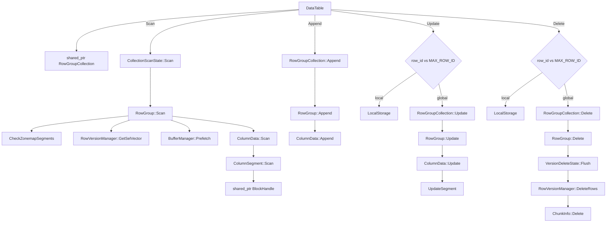

# 第26章 row group と列データ

> **本章で読むソース**
>
> - [src/storage/data_table.cpp](https://github.com/duckdb/duckdb/blob/v1.5.4/src/storage/data_table.cpp)
> - [src/storage/table/row_group_collection.cpp](https://github.com/duckdb/duckdb/blob/v1.5.4/src/storage/table/row_group_collection.cpp)
> - [src/storage/table/row_group.cpp](https://github.com/duckdb/duckdb/blob/v1.5.4/src/storage/table/row_group.cpp)
> - [src/storage/table/column_data.cpp](https://github.com/duckdb/duckdb/blob/v1.5.4/src/storage/table/column_data.cpp)
> - [src/storage/table/column_segment.cpp](https://github.com/duckdb/duckdb/blob/v1.5.4/src/storage/table/column_segment.cpp)
> - [src/storage/table/scan_state.cpp](https://github.com/duckdb/duckdb/blob/v1.5.4/src/storage/table/scan_state.cpp)
> - [src/storage/table/row_version_manager.cpp](https://github.com/duckdb/duckdb/blob/v1.5.4/src/storage/table/row_version_manager.cpp)

## この章の狙い

表データの主経路を、`DataTable` から `RowGroupCollection`、`RowGroup`、`ColumnData`、`ColumnSegment` まで降りる。
scan / append / update がどこで分岐し、削除と可視性が `RowVersionManager` へどう乗るかを押さえる。
圧縮の詳細は第27章、MVCC 全体は第30章へ譲る。

## 前提

第24章の `TableIOManager` が行データの `BlockManager` を返す。
第18章の table scan 演算子は、最終的にここで見る `DataTable::Scan` へ到達する。
ローカル変更（未コミット append）は `LocalStorage` 側にあり、本章では永続側を中心に追う。

## DataTable の所有

`DataTable` は `shared_ptr<RowGroupCollection> row_groups` を持つ。
コンストラクタは `TableIOManager` から型情報と共に collection を作り、永続データがあれば `Initialize`、無ければ `InitializeEmpty` する。

[src/storage/data_table.cpp L62-L79](https://github.com/duckdb/duckdb/blob/v1.5.4/src/storage/data_table.cpp#L62-L79)

```cpp
DataTable::DataTable(AttachedDatabase &db, shared_ptr<TableIOManager> table_io_manager_p, const string &schema,
                     const string &table, vector<ColumnDefinition> column_definitions_p,
                     unique_ptr<PersistentTableData> data)
    : db(db), info(make_shared_ptr<DataTableInfo>(db, std::move(table_io_manager_p), schema, table)),
      column_definitions(std::move(column_definitions_p)), version(DataTableVersion::MAIN_TABLE) {
	// initialize the table with the existing data from disk, if any
	auto types = GetTypes();
	auto &io_manager = TableIOManager::Get(*this);
	this->row_groups = make_shared_ptr<RowGroupCollection>(info, io_manager, types, 0);
	if (data && data->row_group_count > 0) {
		this->row_groups->Initialize(*data);
		row_groups->SetRowGroupAppendMode(RowGroupAppendMode::SUGGEST_NEW);
	} else {
		this->row_groups->InitializeEmpty();
		D_ASSERT(row_groups->GetTotalRows() == 0);
	}
	row_groups->Verify();
}
```

## Scan

`InitializeScan` は永続側とトランザクションローカル側の両方の状態を初期化する。
`Scan` はまず `state.table_state.Scan` で永続 row group を試し、空なら `LocalStorage::Scan` へ進む。

[src/storage/data_table.cpp L242-L309](https://github.com/duckdb/duckdb/blob/v1.5.4/src/storage/data_table.cpp#L242-L309)

```cpp
void DataTable::InitializeScan(ClientContext &context, DuckTransaction &transaction, TableScanState &state,
                               const vector<StorageIndex> &column_ids, optional_ptr<TableFilterSet> table_filters) {
	auto &local_storage = LocalStorage::Get(transaction);
	state.Initialize(column_ids, context, table_filters);
	row_groups->InitializeScan(context, state.table_state, column_ids, table_filters);
	local_storage.InitializeScan(*this, state.local_state, table_filters);
}

// ... (中略) ...

void DataTable::Scan(DuckTransaction &transaction, DataChunk &result, TableScanState &state) {
	// scan the persistent segments
	if (state.table_state.Scan(transaction, result)) {
		D_ASSERT(result.size() > 0);
		return;
	}

	// scan the transaction-local segments
	auto &local_storage = LocalStorage::Get(transaction);
	local_storage.Scan(state.local_state, state.GetColumnIds(), result);
}
```

`CollectionScanState::Scan` は現在の `RowGroup` を走査し、チャンクが空なら次の row group へ進む。

[src/storage/table/scan_state.cpp L220-L246](https://github.com/duckdb/duckdb/blob/v1.5.4/src/storage/table/scan_state.cpp#L220-L246)

```cpp
bool CollectionScanState::Scan(DuckTransaction &transaction, DataChunk &result) {
	while (row_group) {
		row_group->GetNode().Scan(TransactionData(transaction), *this, result);
		if (result.size() > 0) {
			return true;
		}
		if (max_row <= row_group->GetRowStart() + row_group->GetNode().count) {
			row_group = nullptr;
			return false;
		}
		do {
			row_group = GetNextRowGroup(*row_group).get();
			if (row_group) {
				if (row_group->GetRowStart() >= max_row) {
					row_group = nullptr;
					break;
				}
				bool scan_row_group = row_group->GetNode().InitializeScan(*this, *row_group);
				if (scan_row_group) {
					// scan this row group
					break;
				}
			}
		} while (row_group);
	}
	return false;
}
```

## Append

表への追記は `DataTable::Append` がそのまま `RowGroupCollection::Append` に委譲する。
collection 側は現在の row group の残容量を見て部分追記し、溢れたら新しい row group を足す。

[src/storage/data_table.cpp L1190-L1205](https://github.com/duckdb/duckdb/blob/v1.5.4/src/storage/data_table.cpp#L1190-L1205)

```cpp
void DataTable::InitializeAppend(DuckTransaction &transaction, TableAppendState &state) {
	// obtain the append lock for this table
	if (!state.append_lock) {
		throw InternalException("DataTable::AppendLock should be called before DataTable::InitializeAppend");
	}
	row_groups->InitializeAppend(transaction, state);
}

void DataTable::Append(DataChunk &chunk, TableAppendState &state) {
	D_ASSERT(IsMainTable());
	row_groups->Append(chunk, state);
}

void DataTable::FinalizeAppend(DuckTransaction &transaction, TableAppendState &state) {
	row_groups->FinalizeAppend(transaction, state);
}
```

[src/storage/table/row_group_collection.cpp L534-L571](https://github.com/duckdb/duckdb/blob/v1.5.4/src/storage/table/row_group_collection.cpp#L534-L571)

```cpp
bool RowGroupCollection::Append(DataChunk &chunk, TableAppendState &state) {
	const idx_t row_group_size = GetRowGroupSize();
	D_ASSERT(chunk.ColumnCount() == types.size());
	chunk.Verify();

	bool new_row_group = false;
	idx_t total_append_count = chunk.size();
	idx_t remaining = chunk.size();
	state.total_append_count += total_append_count;
	while (true) {
		auto current_row_group = state.row_group_append_state.row_group;
		// check how much we can fit into the current row_group
		idx_t append_count =
		    MinValue<idx_t>(remaining, row_group_size - state.row_group_append_state.offset_in_row_group);
		if (append_count > 0) {
			auto previous_allocation_size = current_row_group->GetAllocationSize();
			current_row_group->Append(state.row_group_append_state, chunk, append_count);
			allocation_size += current_row_group->GetAllocationSize() - previous_allocation_size;
			// merge the stats
			current_row_group->MergeIntoStatistics(stats);
		}
		remaining -= append_count;
		if (remaining == 0) {
			break;
		}
		// we expect max 1 iteration of this loop (i.e. a single chunk should never overflow more than one
		// row_group)
		D_ASSERT(chunk.size() == remaining + append_count);
		// slice the input chunk
		if (remaining < chunk.size()) {
			chunk.Slice(append_count, remaining);
		}
		// append a new row_group
		new_row_group = true;
		auto next_start = state.row_group_start + state.row_group_append_state.offset_in_row_group;

		auto l = state.row_groups->Lock();
		AppendRowGroup(l, next_start);
```

`RowGroup::Append` は列ごとに `ColumnData::Append` するだけである。

[src/storage/table/row_group.cpp L997-L1018](https://github.com/duckdb/duckdb/blob/v1.5.4/src/storage/table/row_group.cpp#L997-L1018)

```cpp
void RowGroup::InitializeAppend(RowGroupAppendState &append_state) {
	append_state.row_group = this;
	append_state.offset_in_row_group = this->count;
	// for each column, initialize the append state
	append_state.states = make_unsafe_uniq_array<ColumnAppendState>(GetColumnCount());
	for (idx_t i = 0; i < GetColumnCount(); i++) {
		auto &col_data = GetColumn(i);
		col_data.InitializeAppend(append_state.states[i]);
	}
}

void RowGroup::Append(RowGroupAppendState &state, DataChunk &chunk, idx_t append_count) {
	// append to the current row_group
	D_ASSERT(chunk.ColumnCount() == GetColumnCount());
	for (idx_t i = 0; i < GetColumnCount(); i++) {
		auto &col_data = GetColumn(i);
		auto prev_allocation_size = col_data.GetAllocationSize();
		col_data.Append(state.states[i], chunk.data[i], append_count);
		allocation_size += col_data.GetAllocationSize() - prev_allocation_size;
	}
	state.offset_in_row_group += append_count;
}
```

## Update

`DataTable::Update` は row id が `MAX_ROW_ID` 以上ならローカル表、未満なら永続 `row_groups->Update` へ振る。
制約検証のあと、選択ベクタで両経路を分けて実行する。

[src/storage/data_table.cpp L1714-L1765](https://github.com/duckdb/duckdb/blob/v1.5.4/src/storage/data_table.cpp#L1714-L1765)

```cpp
void DataTable::Update(TableUpdateState &state, ClientContext &context, Vector &row_ids,
                       const vector<PhysicalIndex> &column_ids, DataChunk &updates) {
	D_ASSERT(row_ids.GetType().InternalType() == ROW_TYPE);
	D_ASSERT(column_ids.size() == updates.ColumnCount());
	updates.Verify();

	auto count = updates.size();
	if (count == 0) {
		return;
	}

	if (!IsMainTable()) {
		throw TransactionException(
		    "Transaction conflict: attempting to update table \"%s\" but it has been %s by a different transaction",
		    GetTableName(), TableModification());
	}

	// first verify that no constraints are violated
	VerifyUpdateConstraints(*state.constraint_state, context, updates, column_ids);

	// now perform the actual update
	Vector max_row_id_vec(Value::BIGINT(MAX_ROW_ID));
	Vector row_ids_slice(LogicalType::BIGINT);
	DataChunk updates_slice;
	updates_slice.InitializeEmpty(updates.GetTypes());

	SelectionVector sel_local_update(count), sel_global_update(count);
	auto n_local_update = VectorOperations::GreaterThanEquals(row_ids, max_row_id_vec, nullptr, count,
	                                                          &sel_local_update, &sel_global_update);
	auto n_global_update = count - n_local_update;

	// row id > MAX_ROW_ID? transaction-local storage
	if (n_local_update > 0) {
		updates_slice.Slice(updates, sel_local_update, n_local_update);
		updates_slice.Flatten();
		row_ids_slice.Slice(row_ids, sel_local_update, n_local_update);
		row_ids_slice.Flatten(n_local_update);

		LocalStorage::Get(context, db).Update(*this, row_ids_slice, column_ids, updates_slice);
	}

	// otherwise global storage
	if (n_global_update > 0) {
		auto &transaction = DuckTransaction::Get(context, db);
		transaction.ModifyTable(*this);
		updates_slice.Slice(updates, sel_global_update, n_global_update);
		updates_slice.Flatten();
		row_ids_slice.Slice(row_ids, sel_global_update, n_global_update);
		row_ids_slice.Flatten(n_global_update);

		row_groups->Update(transaction, *this, FlatVector::GetData<row_t>(row_ids_slice), column_ids, updates_slice);
	}
}
```

永続側の `RowGroupCollection::Update` は、row id 列を同一 row group ごとの区間に分けて進める。
各区間で `RowGroup::Update` を呼び、列統計もマージする。

[src/storage/table/row_group_collection.cpp L829-L848](https://github.com/duckdb/duckdb/blob/v1.5.4/src/storage/table/row_group_collection.cpp#L829-L848)

```cpp
void RowGroupCollection::Update(TransactionData transaction, DataTable &data_table, row_t *ids,
                                const vector<PhysicalIndex> &column_ids, DataChunk &updates) {
	D_ASSERT(updates.size() >= 1);
	idx_t pos = 0;
	auto row_groups = GetRowGroups();
	do {
		idx_t start = pos;
		auto row_group = NextUpdateRowGroup(*row_groups, ids, pos, updates.size());

		auto &current_row_group = row_group->GetNode();
		current_row_group.Update(transaction, data_table, updates, ids, start, pos - start, column_ids,
		                         row_group->GetRowStart());

		auto l = stats.GetLock();
		for (idx_t i = 0; i < column_ids.size(); i++) {
			auto column_id = column_ids[i];
			stats.MergeStats(*l, column_id.index, *current_row_group.GetStatistics(column_id.index));
		}
	} while (pos < updates.size());
}
```

`RowGroup::Update` は更新対象列ごとにスライスし、`ColumnData::Update` へ渡す。

[src/storage/table/row_group.cpp L1025-L1045](https://github.com/duckdb/duckdb/blob/v1.5.4/src/storage/table/row_group.cpp#L1025-L1045)

```cpp
void RowGroup::Update(TransactionData transaction, DataTable &data_table, DataChunk &update_chunk, row_t *ids,
                      idx_t offset, idx_t count, const vector<PhysicalIndex> &column_ids, idx_t row_group_start) {
#ifdef DEBUG
	for (size_t i = offset; i < offset + count; i++) {
		D_ASSERT(ids[i] >= row_t(row_group_start) && ids[i] < row_t(row_group_start + this->count));
	}
#endif
	for (idx_t i = 0; i < column_ids.size(); i++) {
		auto column = column_ids[i];
		auto &col_data = GetColumn(column.index);
		D_ASSERT(col_data.type.id() == update_chunk.data[i].GetType().id());
		if (offset > 0) {
			Vector sliced_vector(update_chunk.data[i], offset, offset + count);
			sliced_vector.Flatten(count);
			col_data.Update(transaction, data_table, column.index, sliced_vector, ids + offset, count, row_group_start);
		} else {
			col_data.Update(transaction, data_table, column.index, update_chunk.data[i], ids, count, row_group_start);
		}
		MergeStatistics(column.index, *col_data.GetUpdateStatistics());
	}
}
```

`ColumnData::Update` はまず対象行のベース値を `FetchUpdateData` で取り、`UpdateInternal` が `UpdateSegment` を用意して MVCC 更新を置く。
ベース segment そのものを書き換えず、更新差分を別セグメントに積む経路である。

[src/storage/table/column_data.cpp L285-L294](https://github.com/duckdb/duckdb/blob/v1.5.4/src/storage/table/column_data.cpp#L285-L294)

```cpp
void ColumnData::UpdateInternal(TransactionData transaction, DataTable &data_table, idx_t column_index,
                                Vector &update_vector, row_t *row_ids, idx_t update_count, Vector &base_vector,
                                idx_t row_group_start) {
	lock_guard<mutex> update_guard(update_lock);
	if (!updates) {
		updates = make_uniq<UpdateSegment>(*this);
	}
	updates->Update(transaction, data_table, column_index, update_vector, row_ids, update_count, base_vector,
	                row_group_start);
}
```

[src/storage/table/column_data.cpp L588-L596](https://github.com/duckdb/duckdb/blob/v1.5.4/src/storage/table/column_data.cpp#L588-L596)

```cpp
void ColumnData::Update(TransactionData transaction, DataTable &data_table, idx_t column_index, Vector &update_vector,
                        row_t *row_ids, idx_t update_count, idx_t row_group_start) {
	Vector base_vector(type);
	ColumnScanState state(nullptr);
	FetchUpdateData(state, row_ids, base_vector, row_group_start);

	UpdateInternal(transaction, data_table, column_index, update_vector, row_ids, update_count, base_vector,
	               row_group_start);
}
```

## Delete

削除も update と同様に、row id が `MAX_ROW_ID` 以上ならローカル、未満なら永続 `row_groups->Delete` へ振る。
永続側では制約検証のあと、バッチ単位で collection に渡す。

[src/storage/data_table.cpp L1562-L1615](https://github.com/duckdb/duckdb/blob/v1.5.4/src/storage/data_table.cpp#L1562-L1615)

```cpp
idx_t DataTable::Delete(TableDeleteState &state, ClientContext &context, Vector &row_identifiers, idx_t count) {
	D_ASSERT(row_identifiers.GetType().InternalType() == ROW_TYPE);
	if (count == 0) {
		return 0;
	}

	auto &transaction = DuckTransaction::Get(context, db);
	auto &local_storage = LocalStorage::Get(transaction);
	auto storage = local_storage.GetStorage(*this);

	row_identifiers.Flatten(count);
	auto ids = FlatVector::GetData<row_t>(row_identifiers);

	idx_t pos = 0;
	idx_t delete_count = 0;
	while (pos < count) {
		idx_t start = pos;
		bool is_transaction_delete = ids[pos] >= MAX_ROW_ID;
		// figure out which batch of rows to delete now
		for (pos++; pos < count; pos++) {
			bool row_is_transaction_delete = ids[pos] >= MAX_ROW_ID;
			if (row_is_transaction_delete != is_transaction_delete) {
				break;
			}
		}
		idx_t current_offset = start;
		idx_t current_count = pos - start;

		Vector offset_ids(row_identifiers, current_offset, pos);

		// This is a transaction-local DELETE.
		if (is_transaction_delete) {
			if (state.has_delete_constraints) {
				// Verify any delete constraints.
				ColumnFetchState fetch_state;
				local_storage.FetchChunk(*this, offset_ids, current_count, state.col_ids, state.verify_chunk,
				                         fetch_state);
				VerifyDeleteConstraints(storage, state, context, state.verify_chunk);
			}
			delete_count += local_storage.Delete(*this, offset_ids, current_count);
			continue;
		}

		// This is a regular DELETE.
		if (state.has_delete_constraints) {
			// Verify any delete constraints.
			ColumnFetchState fetch_state;
			Fetch(transaction, state.verify_chunk, state.col_ids, offset_ids, current_count, fetch_state);
			VerifyDeleteConstraints(storage, state, context, state.verify_chunk);
		}
		delete_count += row_groups->Delete(transaction, *this, ids + current_offset, current_count);
	}
	return delete_count;
}
```

`RowGroupCollection::Delete` は id ごとに所属 row group を決め、連続する同 group 分をまとめて `RowGroup::Delete` する。

[src/storage/table/row_group_collection.cpp L768-L799](https://github.com/duckdb/duckdb/blob/v1.5.4/src/storage/table/row_group_collection.cpp#L768-L799)

```cpp
idx_t RowGroupCollection::Delete(TransactionData transaction, DataTable &table, row_t *ids, idx_t count) {
	idx_t delete_count = 0;
	// delete is in the row groups
	// we need to figure out for each id to which row group it belongs
	// usually all (or many) ids belong to the same row group
	// we iterate over the ids and check for every id if it belongs to the same row group as their predecessor
	idx_t pos = 0;
	auto row_groups = GetRowGroups();
	do {
		idx_t start = pos;
		auto row_group = row_groups->GetSegment(UnsafeNumericCast<idx_t>(ids[start]));

		auto &current_row_group = row_group->GetNode();
		auto row_start = row_group->GetRowStart();
		auto row_end = row_start + current_row_group.count;
		for (pos++; pos < count; pos++) {
			D_ASSERT(ids[pos] >= 0);
			// check if this id still belongs to this row group
			if (idx_t(ids[pos]) < row_start) {
				// id is before row_group start -> it does not
				break;
			}
			if (idx_t(ids[pos]) >= row_end) {
				// id is after row group end -> it does not
				break;
			}
		}
		delete_count += current_row_group.Delete(transaction, table, ids + start, pos - start, row_start);
	} while (pos < count);

	return delete_count;
}
```

`RowGroup::Delete` は `VersionDeleteState` に row group 内オフセットを積み、最後に `Flush` する。

[src/storage/table/row_group.cpp L1787-L1798](https://github.com/duckdb/duckdb/blob/v1.5.4/src/storage/table/row_group.cpp#L1787-L1798)

```cpp
idx_t RowGroup::Delete(TransactionData transaction, DataTable &table, row_t *ids, idx_t count, idx_t row_group_start) {
	VersionDeleteState del_state(*this, transaction, table, row_group_start);

	// obtain a write lock
	for (idx_t i = 0; i < count; i++) {
		D_ASSERT(ids[i] >= 0);
		D_ASSERT(idx_t(ids[i]) >= row_group_start && idx_t(ids[i]) < row_group_start + this->count);
		del_state.Delete(ids[i] - UnsafeNumericCast<row_t>(row_group_start));
	}
	del_state.Flush();
	return del_state.delete_count;
}
```

`DeleteRows` は version info へ委譲し、`VersionDeleteState` がベクトル単位にまとめて `Flush` する。
`Flush` は実削除件数があれば undo buffer へも積む。

[src/storage/table/row_group.cpp L1817-L1849](https://github.com/duckdb/duckdb/blob/v1.5.4/src/storage/table/row_group.cpp#L1817-L1849)

```cpp
idx_t RowGroup::DeleteRows(idx_t vector_idx, transaction_t transaction_id, row_t rows[], idx_t count) {
	return GetOrCreateVersionInfo().DeleteRows(vector_idx, transaction_id, rows, count);
}

void VersionDeleteState::Delete(row_t row_id) {
	D_ASSERT(row_id >= 0);
	idx_t vector_idx = UnsafeNumericCast<idx_t>(row_id) / STANDARD_VECTOR_SIZE;
	idx_t idx_in_vector = UnsafeNumericCast<idx_t>(row_id) - vector_idx * STANDARD_VECTOR_SIZE;
	if (current_chunk != vector_idx) {
		Flush();

		current_chunk = vector_idx;
		chunk_row = vector_idx * STANDARD_VECTOR_SIZE;
	}
	rows[count++] = UnsafeNumericCast<row_t>(idx_in_vector);
}

void VersionDeleteState::Flush() {
	if (count == 0) {
		return;
	}
	// it is possible for delete statements to delete the same tuple multiple times when combined with a USING clause
	// in the current_info->Delete, we check which tuples are actually deleted (excluding duplicate deletions)
	// this is returned in the actual_delete_count
	auto actual_delete_count = info.DeleteRows(current_chunk, transaction.transaction_id, rows, count);
	delete_count += actual_delete_count;
	if (transaction.transaction && actual_delete_count > 0) {
		// now push the delete into the undo buffer, but only if any deletes were actually performed
		transaction.transaction->PushDelete(table, info.GetOrCreateVersionInfo(), current_chunk, rows,
		                                    actual_delete_count, base_row + chunk_row);
	}
	count = 0;
}
```

`RowVersionManager::DeleteRows` は対象ベクトルの `ChunkInfo`（`ChunkVectorInfo`）を取り、そこで行の削除フラグを更新する。
走査時の `GetSelVector` は、この `ChunkInfo` を読んで可視行を返す。

[src/storage/table/row_version_manager.cpp L180-L183](https://github.com/duckdb/duckdb/blob/v1.5.4/src/storage/table/row_version_manager.cpp#L180-L183)

```cpp
idx_t RowVersionManager::DeleteRows(idx_t vector_idx, transaction_t transaction_id, row_t rows[], idx_t count) {
	lock_guard<mutex> lock(version_lock);
	return GetVectorInfo(vector_idx).Delete(transaction_id, rows, count);
}
```

## RowGroup の走査

`RowGroup::Scan` はベクトル単位で進む。
zonemap で segment を飛ばし、`GetSelVector` で可視行を決め、必要なら prefetch したうえで列を読む。
フィルタがあるときは、フィルタ列を先に読んで選択ベクタを絞ってから他列を取る。

[src/storage/table/row_group.cpp L685-L738](https://github.com/duckdb/duckdb/blob/v1.5.4/src/storage/table/row_group.cpp#L685-L738)

```cpp
void RowGroup::Scan(ScanOptions options, CollectionScanState &state, DataChunk &result) {
	const auto &column_ids = state.GetColumnIds();
	auto &filter_info = state.GetFilterInfo();
	auto &transaction = options.transaction;
	while (true) {
		if (state.vector_index * STANDARD_VECTOR_SIZE >= state.max_row_group_row) {
			// exceeded the amount of rows to scan
			return;
		}
		idx_t current_row = state.vector_index * STANDARD_VECTOR_SIZE;
		auto max_count = MinValue<idx_t>(STANDARD_VECTOR_SIZE, state.max_row_group_row - current_row);

		// check the sampling info if we have to sample this chunk
		if (state.GetSamplingInfo().do_system_sample &&
		    state.random.NextRandom() > state.GetSamplingInfo().sample_rate) {
			NextVector(state);
			continue;
		}

		//! first check the zonemap if we have to scan this partition
		if (!CheckZonemapSegments(state)) {
			continue;
		}
		auto &current_row_group = state.row_group->GetNode();

		// second, scan the version chunk manager to figure out which tuples to load for this transaction
		idx_t count = current_row_group.GetSelVector(options, state.vector_index, state.valid_sel, max_count);
		if (count == 0) {
			// nothing to scan for this vector, skip the entire vector
			NextVector(state);
			continue;
		}
		state.rows_scanned += count;

		auto &block_manager = GetBlockManager();
		if (block_manager.Prefetch()) {
			PrefetchState prefetch_state;
			for (idx_t i = 0; i < column_ids.size(); i++) {
				const auto &column = column_ids[i];
				GetColumn(column).InitializePrefetch(prefetch_state, state.column_scans[i], max_count);
			}
			auto &buffer_manager = block_manager.buffer_manager;
			buffer_manager.Prefetch(prefetch_state.blocks);
		}

		bool has_filters = filter_info.HasFilters();
		if (count == max_count && !has_filters) {
			// scan all vectors completely: full scan without deletions or table filters
			for (idx_t i = 0; i < column_ids.size(); i++) {
				const auto &column = column_ids[i];
				auto &col_data = GetColumn(column);
				state.column_scans[i].update_scan_type = options.update_type;
				col_data.Scan(transaction, state.vector_index, state.column_scans[i], result.data[i]);
			}
```

可視性は `RowVersionManager` 経由である。
バージョン情報が無ければ全行可視、あれば `ChunkInfo::GetSelVector` に委ねる。

[src/storage/table/row_group.cpp L916-L926](https://github.com/duckdb/duckdb/blob/v1.5.4/src/storage/table/row_group.cpp#L916-L926)

```cpp
idx_t RowGroup::GetSelVector(ScanOptions options, idx_t vector_idx, SelectionVector &sel_vector, idx_t max_count) {
	if (options.insert_type == InsertedScanType::ALL_ROWS &&
	    options.delete_type == DeletedScanType::INCLUDE_ALL_DELETED) {
		return max_count;
	}
	auto vinfo = GetVersionInfo();
	if (!vinfo) {
		return max_count;
	}
	return vinfo->GetSelVector(options, vector_idx, sel_vector, max_count);
}
```

[src/storage/table/row_version_manager.cpp L38-L56](https://github.com/duckdb/duckdb/blob/v1.5.4/src/storage/table/row_version_manager.cpp#L38-L56)

```cpp
idx_t RowVersionManager::GetSelVector(ScanOptions options, idx_t vector_idx, SelectionVector &sel_vector,
                                      idx_t max_count) {
	lock_guard<mutex> l(version_lock);
	auto chunk_info = GetChunkInfo(vector_idx);
	if (!chunk_info) {
		return max_count;
	}
	return chunk_info->GetSelVector(options, sel_vector, max_count);
}

bool RowVersionManager::Fetch(TransactionData transaction, idx_t row) {
	lock_guard<mutex> lock(version_lock);
	idx_t vector_index = row / STANDARD_VECTOR_SIZE;
	auto info = GetChunkInfo(vector_index);
	if (!info) {
		return true;
	}
	return info->Fetch(transaction, UnsafeNumericCast<row_t>(row - vector_index * STANDARD_VECTOR_SIZE));
}
```

## ColumnData から ColumnSegment へ

`ColumnData::Scan` は `ScanVector` を呼び、セグメント境界をまたぎながら現在の `ColumnSegment` へ `Scan` を委任する。
更新があれば、ベース走査のあとに `FetchUpdates` で重ねる。

[src/storage/table/column_data.cpp L182-L225](https://github.com/duckdb/duckdb/blob/v1.5.4/src/storage/table/column_data.cpp#L182-L225)

```cpp
idx_t ColumnData::ScanVector(ColumnScanState &state, Vector &result, idx_t remaining, ScanVectorType scan_type,
                             idx_t base_result_offset) {
	if (scan_type == ScanVectorType::SCAN_FLAT_VECTOR && result.GetVectorType() != VectorType::FLAT_VECTOR) {
		throw InternalException("ScanVector called with SCAN_FLAT_VECTOR but result is not a flat vector");
	}
	BeginScanVectorInternal(state);
	idx_t initial_remaining = remaining;
	while (remaining > 0) {
		auto &current = state.current->GetNode();
		auto current_start = state.current->GetRowStart();
		D_ASSERT(state.offset_in_column >= current_start && state.offset_in_column <= current_start + current.count);
		idx_t scan_count = MinValue<idx_t>(remaining, current_start + current.count - state.offset_in_column);
		idx_t result_offset = base_result_offset + initial_remaining - remaining;
		if (scan_count > 0) {
			if (state.scan_options && state.scan_options->force_fetch_row) {
				for (idx_t i = 0; i < scan_count; i++) {
					ColumnFetchState fetch_state;
					current.FetchRow(fetch_state, UnsafeNumericCast<row_t>(state.offset_in_column + i - current_start),
					                 result, result_offset + i);
				}
			} else {
				current.Scan(state, scan_count, result, result_offset, scan_type);
			}

			state.offset_in_column += scan_count;
			remaining -= scan_count;
		}

		if (remaining > 0) {
			auto next = data.GetNextSegment(*state.current);
			if (!next) {
				break;
			}
			state.previous_states.emplace_back(std::move(state.scan_state));
			state.current = next;
			state.current->GetNode().InitializeScan(state);
			state.segment_checked = false;
			D_ASSERT(state.offset_in_column >= state.current->GetRowStart() &&
			         state.offset_in_column <= state.current->GetRowStart() + state.current->GetNode().count);
		}
	}
	state.internal_index = state.offset_in_column;
	return initial_remaining - remaining;
}
```

[src/storage/table/column_data.cpp L296-L320](https://github.com/duckdb/duckdb/blob/v1.5.4/src/storage/table/column_data.cpp#L296-L320)

```cpp
idx_t ColumnData::ScanVector(TransactionData transaction, idx_t vector_index, ColumnScanState &state, Vector &result,
                             idx_t target_scan, ScanVectorType scan_type, UpdateScanType update_type) {
	auto scan_count = ScanVector(state, result, target_scan, scan_type);
	if (scan_type != ScanVectorType::SCAN_ENTIRE_VECTOR) {
		// if we are scanning an entire vector we cannot have updates
		FetchUpdates(transaction, vector_index, result, scan_count, update_type);
	}
	return scan_count;
}

idx_t ColumnData::ScanVector(TransactionData transaction, idx_t vector_index, ColumnScanState &state, Vector &result,
                             idx_t target_scan, UpdateScanType update_type) {
	auto scan_type = GetVectorScanType(state, target_scan, result);
	return ScanVector(transaction, vector_index, state, result, target_scan, scan_type, update_type);
}

idx_t ColumnData::Scan(TransactionData transaction, idx_t vector_index, ColumnScanState &state, Vector &result) {
	auto target_count = GetVectorCount(vector_index);
	return Scan(transaction, vector_index, state, result, target_count);
}

idx_t ColumnData::Scan(TransactionData transaction, idx_t vector_index, ColumnScanState &state, Vector &result,
                       idx_t scan_count) {
	return ScanVector(transaction, vector_index, state, result, scan_count, state.update_scan_type);
}
```

`ColumnSegment` は永続なら `BlockManager::RegisterBlock` で `shared_ptr<BlockHandle>` を握り、一時なら `RegisterTransientMemory` でバッファを取る。
実データ読込は圧縮関数（第27章）へ委譲する。

[src/storage/table/column_segment.cpp L25-L55](https://github.com/duckdb/duckdb/blob/v1.5.4/src/storage/table/column_segment.cpp#L25-L55)

```cpp
unique_ptr<ColumnSegment> ColumnSegment::CreatePersistentSegment(DatabaseInstance &db, BlockManager &block_manager,
                                                                 block_id_t block_id, idx_t offset,
                                                                 const LogicalType &type, idx_t count,
                                                                 CompressionType compression_type,
                                                                 BaseStatistics statistics,
                                                                 unique_ptr<ColumnSegmentState> segment_state) {
	auto &config = DBConfig::GetConfig(db);
	shared_ptr<BlockHandle> block;

	auto function = config.GetCompressionFunction(compression_type, type.InternalType());
	if (block_id != INVALID_BLOCK) {
		block = block_manager.RegisterBlock(block_id);
	}

	auto segment_size = block_manager.GetBlockSize();
	return make_uniq<ColumnSegment>(db, std::move(block), type, ColumnSegmentType::PERSISTENT, count, function,
	                                std::move(statistics), block_id, offset, segment_size, std::move(segment_state));
}

unique_ptr<ColumnSegment> ColumnSegment::CreateTransientSegment(DatabaseInstance &db,
                                                                const CompressionFunction &function,
                                                                const LogicalType &type, const idx_t segment_size,
                                                                BlockManager &block_manager) {
	// Allocate a buffer for the uncompressed segment.
	auto &buffer_manager = BufferManager::GetBufferManager(db);
	D_ASSERT(&buffer_manager == &block_manager.buffer_manager);
	auto block = buffer_manager.RegisterTransientMemory(segment_size, block_manager);

	return make_uniq<ColumnSegment>(db, std::move(block), type, ColumnSegmentType::TRANSIENT, 0U, function,
	                                BaseStatistics::CreateEmpty(type), INVALID_BLOCK, 0U, segment_size);
}
```

## 処理の流れ



## 高速化と最適化の工夫

segment 単位の zonemap で、フィルタに合わない範囲をディスク読込前に飛ばす。
`Prefetch` が有効なら、必要な `BlockHandle` を先にまとめてバッファへ載せる。
フィルタ列を先に評価し、落ちた行の残列を読まない。

## まとめ

`DataTable` は `RowGroupCollection` を `shared_ptr` で持ち、scan / append / update / delete の入口になる。
永続 update は row group、列、`UpdateSegment` まで降り、ベース segment を直接書き換えない。
永続 delete は `VersionDeleteState` 経由で `RowVersionManager` の `ChunkInfo` を更新し、走査時の可視性がここから決まる。
実バイトは `ColumnSegment` の `BlockHandle` が第25章のバッファへ接続する。
圧縮関数と WAL / チェックポイントは続く章で回収する。

## 関連する章

- 第18章（テーブル走査と table function）
- 第24章（ストレージ全体像とブロック管理）
- 第25章（バッファマネージャ）
- 第27章（圧縮）
- 第30章（MVCC トランザクション）
