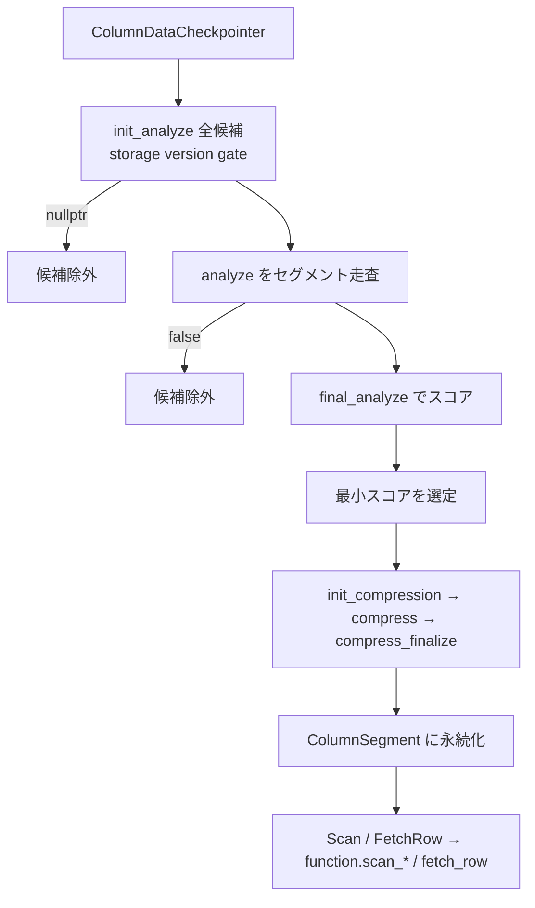

# 第27章 圧縮

> **本章で読むソース**
>
> - [src/include/duckdb/function/compression_function.hpp](https://github.com/duckdb/duckdb/blob/v1.5.4/src/include/duckdb/function/compression_function.hpp)
> - [src/storage/table/column_data_checkpointer.cpp](https://github.com/duckdb/duckdb/blob/v1.5.4/src/storage/table/column_data_checkpointer.cpp)
> - [src/storage/table/column_segment.cpp](https://github.com/duckdb/duckdb/blob/v1.5.4/src/storage/table/column_segment.cpp)
> - [src/storage/compression/rle.cpp](https://github.com/duckdb/duckdb/blob/v1.5.4/src/storage/compression/rle.cpp)
> - [src/storage/compression/bitpacking.cpp](https://github.com/duckdb/duckdb/blob/v1.5.4/src/storage/compression/bitpacking.cpp)
> - [src/storage/compression/dictionary_compression.cpp](https://github.com/duckdb/duckdb/blob/v1.5.4/src/storage/compression/dictionary_compression.cpp)
> - [src/storage/compression/fsst.cpp](https://github.com/duckdb/duckdb/blob/v1.5.4/src/storage/compression/fsst.cpp)
> - [src/storage/compression/dict_fsst.cpp](https://github.com/duckdb/duckdb/blob/v1.5.4/src/storage/compression/dict_fsst.cpp)
> - [src/storage/compression/dict_fsst/analyze.cpp](https://github.com/duckdb/duckdb/blob/v1.5.4/src/storage/compression/dict_fsst/analyze.cpp)
> - [src/storage/compression/alp/alp.cpp](https://github.com/duckdb/duckdb/blob/v1.5.4/src/storage/compression/alp/alp.cpp)

## この章の狙い

第26章の `ColumnSegment` が実際に持つ圧縮実体は、列ごと独立の `CompressionFunction` である。
本章は方式名の一覧ではなく、analyze / compress / scan / fetch の契約を軸に追う。
候補方式がスコアで競い合い、選ばれた方式だけがディスクへ書き、走査時は同じ関数表へディスパッチする流れを押さえる。

## 前提

圧縮の選定と書き換えは、変更のある列を checkpoint するときの `ColumnDataCheckpointer` で起きる。
永続セグメントの I/O 枠組みは第24章、segment 上の走査入口は第26章で見た。
本章は「どの関数ポインタに繋がるか」とその代表実装に降りる。

## CompressionFunction の契約

各方式は `CompressionFunction` に、解析、圧縮、走査用の関数ポインタを揃えて登録する。
ヘッダの説明どおり、候補方式は物理型で絞られたあと、次の三段で評価される。

[src/include/duckdb/function/compression_function.hpp L150-L158](https://github.com/duckdb/duckdb/blob/v1.5.4/src/include/duckdb/function/compression_function.hpp#L150-L158)

```cpp
//! 1. The init_analyze is called to initialize the analyze state of every candidate compression method
//! 2. The analyze method is called with all of the input data in the order in which it must be stored.
//!    analyze can return "false". In that case, the compression method is taken out of consideration early.
//! 3. The final_analyze method is called, which should return a score for the compression method

//! The system then decides which compression function to use based on the analyzed score (returned from final_analyze)
typedef unique_ptr<AnalyzeState> (*compression_init_analyze_t)(ColumnData &col_data, PhysicalType type);
typedef bool (*compression_analyze_t)(AnalyzeState &state, Vector &input, idx_t count);
typedef idx_t (*compression_final_analyze_t)(AnalyzeState &state);
```

コンストラクタが必須コールバックを束ね、任意の append / filter / serialize は既定で `nullptr` である。

[src/include/duckdb/function/compression_function.hpp L225-L274](https://github.com/duckdb/duckdb/blob/v1.5.4/src/include/duckdb/function/compression_function.hpp#L225-L274)

```cpp
class CompressionFunction {
public:
	CompressionFunction(CompressionType type, PhysicalType data_type, compression_init_analyze_t init_analyze,
	                    compression_analyze_t analyze, compression_final_analyze_t final_analyze,
	                    compression_init_compression_t init_compression, compression_compress_data_t compress,
	                    compression_compress_finalize_t compress_finalize, compression_init_segment_scan_t init_scan,
	                    compression_scan_vector_t scan_vector, compression_scan_partial_t scan_partial,
	                    compression_fetch_row_t fetch_row, compression_skip_t skip,
	                    compression_init_segment_t init_segment = nullptr,
	                    compression_init_append_t init_append = nullptr, compression_append_t append = nullptr,
	                    compression_finalize_append_t finalize_append = nullptr,
	                    compression_revert_append_t revert_append = nullptr,
	                    compression_serialize_state_t serialize_state = nullptr,
	                    compression_deserialize_state_t deserialize_state = nullptr,
	                    compression_visit_block_ids_t visit_block_ids = nullptr,
	                    compression_init_prefetch_t init_prefetch = nullptr, compression_select_t select = nullptr,
	                    compression_filter_t filter = nullptr)
	    : type(type), data_type(data_type), init_analyze(init_analyze), analyze(analyze), final_analyze(final_analyze),
	      init_compression(init_compression), compress(compress), compress_finalize(compress_finalize),
	      init_prefetch(init_prefetch), init_scan(init_scan), scan_vector(scan_vector), scan_partial(scan_partial),
	      select(select), filter(filter), fetch_row(fetch_row), skip(skip), init_segment(init_segment),
	      init_append(init_append), append(append), finalize_append(finalize_append), revert_append(revert_append),
	      serialize_state(serialize_state), deserialize_state(deserialize_state), visit_block_ids(visit_block_ids) {
	}

	//! Compression type
	CompressionType type;
	//! The data type this function can compress
	PhysicalType data_type;

	//! Analyze step: determine which compression function is the most effective
	//! init_analyze is called once to set up the analyze state
	compression_init_analyze_t init_analyze;
	//! analyze is called several times (once per vector in the row group)
	//! analyze should return true, unless compression is no longer possible with this compression method
	//! in that case false should be returned
	compression_analyze_t analyze;
	//! final_analyze should return the score of the compression function
	//! ideally this is the exact number of bytes required to store the data
	//! this is not required/enforced: it can be an estimate as well
	//! also this function can return DConstants::INVALID_INDEX to skip this compression method
	compression_final_analyze_t final_analyze;

	//! Compression step: actually compress the data
	//! init_compression is called once to set up the comperssion state
	compression_init_compression_t init_compression;
	//! compress is called several times (once per vector in the row group)
	compression_compress_data_t compress;
	//! compress_finalize is called after
	compression_compress_finalize_t compress_finalize;
```

ここで重要なのは、方式ごとのアルゴリズム本体がこの表の後ろ側にあり、呼び出し側は「小さいスコアを選ぶ」ことだけを知れば足りる点である。

## チェックポイントでの方式選定

`ColumnDataCheckpointer::DetectBestCompressionMethod` が契約の実行主体である。
`InitAnalyze` で候補ごとに状態を作り、セグメントを走査しながら `analyze` を呼ぶ。
`analyze` が `false` を返すとその候補は落とされる。

[src/storage/table/column_data_checkpointer.cpp L181-L201](https://github.com/duckdb/duckdb/blob/v1.5.4/src/storage/table/column_data_checkpointer.cpp#L181-L201)

```cpp
	InitAnalyze();

	// scan over all the segments and run the analyze step
	ScanSegments([&](Vector &scan_vector, idx_t count) {
		for (idx_t i = 0; i < checkpoint_states.size(); i++) {
			auto &functions = compression_functions[i];
			auto &states = analyze_states[i];
			for (idx_t j = 0; j < functions.size(); j++) {
				auto &state = states[j];
				auto &func = functions[j];

				if (!state) {
					continue;
				}
				if (!func->analyze(*state, scan_vector, count)) {
					state = nullptr;
					func = nullptr;
				}
			}
		}
	});
```

全データ通過後は `final_analyze` のスコア（概ね推定バイト数）を比較し、最小を採る。
`INVALID_INDEX` は「使えない」であり、強制圧縮が指定されていればその型で打ち切る。

[src/storage/table/column_data_checkpointer.cpp L215-L259](https://github.com/duckdb/duckdb/blob/v1.5.4/src/storage/table/column_data_checkpointer.cpp#L215-L259)

```cpp
		D_ASSERT(functions.size() == states.size());
		for (idx_t j = 0; j < functions.size(); j++) {
			auto &function = functions[j];
			auto &state = states[j];

			if (!state) {
				continue;
			}

			//! Check if the method type is the forced method (if forced is used)
			bool forced_method_found = function->type == forced_method;
			// now that we have passed over all the data, we need to figure out the best method
			// we do this using the final_analyze method
			auto score = function->final_analyze(*state);

			//! The finalize method can return this value from final_analyze to indicate it should not be used.
			if (score == DConstants::INVALID_INDEX) {
				continue;
			}

			if (score < best_score || forced_method_found) {
				compression_idx = j;
				best_score = score;
				chosen_state = std::move(state);
			}
			//! If we have found the forced method, we're done
			if (forced_method_found) {
				break;
			}
		}

		auto &checkpoint_state = checkpoint_states[i];
		auto &col_data = checkpoint_state.get().GetResultColumn();
		if (!chosen_state) {
			throw FatalException("No suitable compression/storage method found to store column of type %s",
			                     col_data.type.ToString());
		}
		D_ASSERT(compression_idx != DConstants::INVALID_INDEX);

		auto &best_function = *functions[compression_idx];
		DUCKDB_LOG_TRACE(db, "ColumnDataCheckpointer FinalAnalyze(%s) result for %s.%s.%d(%s): %d",
		                 EnumUtil::ToString(best_function.type), col_data.info.GetSchemaName(),
		                 col_data.info.GetTableName(), col_data.column_index, col_data.type.ToString(), best_score);
		result[i] = CheckpointAnalyzeResult(std::move(chosen_state), best_function);
	}
```

選定後の `WriteToDisk` は、勝者の `init_compression` に analyze 状態を移し、同じ走査順で `compress`、最後に `compress_finalize` する。
分析と圧縮が二パスである点が、圧縮品質の見積もりと実書き込みを分ける。

[src/storage/table/column_data_checkpointer.cpp L313-L343](https://github.com/duckdb/duckdb/blob/v1.5.4/src/storage/table/column_data_checkpointer.cpp#L313-L343)

```cpp
	// Initialize the compression for the selected function
	D_ASSERT(analyze_result.size() == checkpoint_states.size());
	vector<ColumnDataCheckpointData> checkpoint_data(checkpoint_states.size());
	vector<unique_ptr<CompressionState>> compression_states(checkpoint_states.size());
	for (idx_t i = 0; i < analyze_result.size(); i++) {
		auto &analyze_state = analyze_result[i].analyze_state;
		auto &function = analyze_result[i].function;

		auto &checkpoint_state = checkpoint_states[i];
		auto &col_data = checkpoint_state.get().GetResultColumn();

		checkpoint_data[i] =
		    ColumnDataCheckpointData(checkpoint_state, col_data, col_data.GetDatabase(), row_group, storage_manager);
		compression_states[i] = function->init_compression(checkpoint_data[i], std::move(analyze_state));
	}

	// Scan over the existing segment + changes and compress the data
	ScanSegments([&](Vector &scan_vector, idx_t count) {
		for (idx_t i = 0; i < checkpoint_states.size(); i++) {
			auto &function = analyze_result[i].function;
			auto &compression_state = compression_states[i];
			function->compress(*compression_state, scan_vector, count);
		}
	});

	// Finalize the compression
	for (idx_t i = 0; i < checkpoint_states.size(); i++) {
		auto &function = analyze_result[i].function;
		auto &compression_state = compression_states[i];
		function->compress_finalize(*compression_state);
	}
```

## 走査と fetch のディスパッチ

読み側は方式を知らない。
`ColumnSegment` が保持する `function` へ、`scan_vector` / `scan_partial` / `fetch_row` / `skip` をそのまま渡す。

[src/storage/table/column_segment.cpp L136-L157](https://github.com/duckdb/duckdb/blob/v1.5.4/src/storage/table/column_segment.cpp#L136-L157)

```cpp
void ColumnSegment::Skip(ColumnScanState &state) {
	function.get().skip(*this, state, state.offset_in_column - state.internal_index);
	state.internal_index = state.offset_in_column;
}

void ColumnSegment::Scan(ColumnScanState &state, idx_t scan_count, Vector &result) {
	function.get().scan_vector(*this, state, scan_count, result);
}

void ColumnSegment::ScanPartial(ColumnScanState &state, idx_t scan_count, Vector &result, idx_t result_offset) {
	function.get().scan_partial(*this, state, scan_count, result, result_offset);
}

//===--------------------------------------------------------------------===//
// Fetch
//===--------------------------------------------------------------------===//
void ColumnSegment::FetchRow(ColumnFetchState &state, row_t row_id, Vector &result, idx_t result_idx) {
	if (UnsafeNumericCast<idx_t>(row_id) > count) {
		throw InternalException("ColumnSegment::FetchRow - row_id out of range for segment");
	}
	function.get().fetch_row(*this, state, row_id, result, result_idx);
}
```

これで「選定時に勝った方式」と「走査時に呼ばれる方式」が同一の関数表で結ばれる。

## 比較: RLE と Bitpacking と Dictionary

ここでは候補の羅列ではなく、同じ契約に載る三方式が analyze で何を測り、どんなデータで勝つかを見る。

### RLE

RLE は値と連続長の組を数える。
`RLEFinalAnalyze` は「見たランの数 × (カウント幅 + 値幅)」をスコアにし、ランが少ないほど有利である。

[src/storage/compression/rle.cpp L92-L116](https://github.com/duckdb/duckdb/blob/v1.5.4/src/storage/compression/rle.cpp#L92-L116)

```cpp
template <class T>
unique_ptr<AnalyzeState> RLEInitAnalyze(ColumnData &col_data, PhysicalType type) {
	CompressionInfo info(col_data.GetBlockManager());
	return make_uniq<RLEAnalyzeState<T>>(info);
}

template <class T>
bool RLEAnalyze(AnalyzeState &state, Vector &input, idx_t count) {
	auto &rle_state = state.template Cast<RLEAnalyzeState<T>>();
	UnifiedVectorFormat vdata;
	input.ToUnifiedFormat(count, vdata);

	auto data = UnifiedVectorFormat::GetData<T>(vdata);
	for (idx_t i = 0; i < count; i++) {
		auto idx = vdata.sel->get_index(i);
		rle_state.state.Update(data, vdata.validity, idx);
	}
	return true;
}

template <class T>
idx_t RLEFinalAnalyze(AnalyzeState &state) {
	auto &rle_state = state.template Cast<RLEAnalyzeState<T>>();
	return (sizeof(rle_count_t) + sizeof(T)) * rle_state.state.seen_count;
}
```

圧縮パスは analyze と同じ走査順で `Append` し、セグメントへ flush する。
登録は `GetRLEFunction` が analyze / compress / scan / fetch / filter まで一度に埋める。

[src/storage/compression/rle.cpp L241-L254](https://github.com/duckdb/duckdb/blob/v1.5.4/src/storage/compression/rle.cpp#L241-L254)

```cpp
template <class T, bool WRITE_STATISTICS>
void RLECompress(CompressionState &state_p, Vector &scan_vector, idx_t count) {
	auto &state = state_p.Cast<RLECompressState<T, WRITE_STATISTICS>>();
	UnifiedVectorFormat vdata;
	scan_vector.ToUnifiedFormat(count, vdata);

	state.Append(vdata, count);
}

template <class T, bool WRITE_STATISTICS>
void RLEFinalizeCompress(CompressionState &state_p) {
	auto &state = state_p.Cast<RLECompressState<T, WRITE_STATISTICS>>();
	state.Finalize();
}
```

[src/storage/compression/rle.cpp L584-L591](https://github.com/duckdb/duckdb/blob/v1.5.4/src/storage/compression/rle.cpp#L584-L591)

```cpp
CompressionFunction GetRLEFunction(PhysicalType data_type) {
	return CompressionFunction(CompressionType::COMPRESSION_RLE, data_type, RLEInitAnalyze<T>, RLEAnalyze<T>,
	                           RLEFinalAnalyze<T>, RLEInitCompression<T, WRITE_STATISTICS>,
	                           RLECompress<T, WRITE_STATISTICS>, RLEFinalizeCompress<T, WRITE_STATISTICS>,
	                           RLEInitScan<T>, RLEScan<T>, RLEScanPartial<T>, RLEFetchRow<T>, RLESkip<T>, nullptr,
	                           nullptr, nullptr, nullptr, nullptr, nullptr, nullptr, nullptr, nullptr, RLESelect<T>,
	                           RLEFilter<T>);
}
```

### Bitpacking

Bitpacking は整数のレンジに必要なビット幅へ詰める。
ブロックに載らない見込みなら `analyze` が早期に `false` を返し、flush 失敗なら `final_analyze` が `INVALID_INDEX` を返す。
スコアは実サイズ見積もり `total_size` である。

[src/storage/compression/bitpacking.cpp L315-L347](https://github.com/duckdb/duckdb/blob/v1.5.4/src/storage/compression/bitpacking.cpp#L315-L347)

```cpp
template <class T>
bool BitpackingAnalyze(AnalyzeState &state, Vector &input, idx_t count) {
	// We use BITPACKING_METADATA_GROUP_SIZE tuples, which can exceed the block size.
	// In that case, we disable bitpacking.
	// we are conservative here by multiplying by 2
	auto type_size = GetTypeIdSize(input.GetType().InternalType());
	if (type_size * BITPACKING_METADATA_GROUP_SIZE * 2 > state.info.GetBlockSize()) {
		return false;
	}

	auto &analyze_state = state.Cast<BitpackingAnalyzeState<T>>();
	UnifiedVectorFormat vdata;
	input.ToUnifiedFormat(count, vdata);

	auto data = UnifiedVectorFormat::GetData<T>(vdata);
	for (idx_t i = 0; i < count; i++) {
		auto idx = vdata.sel->get_index(i);
		if (!analyze_state.state.template Update<EmptyBitpackingWriter>(data[idx], vdata.validity.RowIsValid(idx))) {
			return false;
		}
	}
	return true;
}

template <class T>
idx_t BitpackingFinalAnalyze(AnalyzeState &state) {
	auto &bitpacking_state = state.Cast<BitpackingAnalyzeState<T>>();
	auto flush_result = bitpacking_state.state.template Flush<EmptyBitpackingWriter>();
	if (!flush_result) {
		return DConstants::INVALID_INDEX;
	}
	return bitpacking_state.state.total_size;
}
```

RLE が「繰り返し」に強く、Bitpacking が「狭い整数レンジ」に強い、という差はアルゴリズム名ではなく、この戻り値の意味の違いとして現れる。

### Dictionary / FSST / DictFSST（と ALP）

VARCHAR 向け候補は、同じ `CompressionFunction` 枠に乗るが、どれが `init_analyze` で有効になるかは storage version で切り替わる。
旧 Dictionary / 旧 FSST の `StringInitAnalyze` は `GetStorageVersion() >= 5` のとき `nullptr` を返し、候補から外れる。
逆に `DictFSSTCompressionStorage::StringInitAnalyze` は version が 5 未満なら無効、5 以上なら有効である。
したがって現行（version 5 以降）の VARCHAR 選定では `COMPRESSION_DICT_FSST` が旧二方式の代わりに競う。

[src/storage/compression/dictionary_compression.cpp L70-L79](https://github.com/duckdb/duckdb/blob/v1.5.4/src/storage/compression/dictionary_compression.cpp#L70-L79)

```cpp
unique_ptr<AnalyzeState> DictionaryCompressionStorage::StringInitAnalyze(ColumnData &col_data, PhysicalType type) {
	auto &storage_manager = col_data.GetStorageManager();
	if (storage_manager.GetStorageVersion() >= 5) {
		// dict_fsst introduced - disable dictionary
		return nullptr;
	}

	CompressionInfo info(col_data.GetBlockManager());
	return make_uniq<DictionaryCompressionAnalyzeState>(info);
}
```

[src/storage/compression/fsst.cpp L101-L110](https://github.com/duckdb/duckdb/blob/v1.5.4/src/storage/compression/fsst.cpp#L101-L110)

```cpp
unique_ptr<AnalyzeState> FSSTStorage::StringInitAnalyze(ColumnData &col_data, PhysicalType type) {
	auto &storage_manager = col_data.GetStorageManager();
	if (storage_manager.GetStorageVersion() >= 5) {
		// dict_fsst introduced - disable fsst
		return nullptr;
	}

	CompressionInfo info(col_data.GetBlockManager());
	return make_uniq<FSSTAnalyzeState>(info);
}
```

[src/storage/compression/dict_fsst.cpp L71-L80](https://github.com/duckdb/duckdb/blob/v1.5.4/src/storage/compression/dict_fsst.cpp#L71-L80)

```cpp
unique_ptr<AnalyzeState> DictFSSTCompressionStorage::StringInitAnalyze(ColumnData &col_data, PhysicalType type) {
	auto &storage_manager = col_data.GetStorageManager();
	if (storage_manager.GetStorageVersion() < 5) {
		// dict_fsst not introduced yet, disable it
		return nullptr;
	}

	CompressionInfo info(col_data.GetBlockManager());
	return make_uniq<DictFSSTAnalyzeState>(info);
}
```

以下の旧 Dictionary / 旧 FSST のスコア説明は、互換 storage version（version が 5 未満）で両者が候補に残るときの話である。
勝敗の根拠は登録関数の並びではなく、analyze が見積もるバイト数である。

`DictionaryCompressionStorage::StringFinalAnalyze` は、未確定セグメントがあれば unique 数の最大値を更新したうえで、`current_unique_count` から bitpacking 幅を取る。
`RequiredSpace` に tuple 数、unique 数、`current_dict_size`、その幅を渡し、既存セグメント分のブロックサイズと足した `total_space` に `MINIMUM_COMPRESSION_RATIO`（1.2）を掛けて返す。
重複が多く unique が少なければ幅と辞書が小さくなり、スコアが下がって選定されやすい。

[src/storage/compression/dictionary_compression.cpp L86-L100](https://github.com/duckdb/duckdb/blob/v1.5.4/src/storage/compression/dictionary_compression.cpp#L86-L100)

```cpp
idx_t DictionaryCompressionStorage::StringFinalAnalyze(AnalyzeState &state_p) {
	auto &analyze_state = state_p.Cast<DictionaryCompressionAnalyzeState>();
	auto &state = *analyze_state.analyze_state;

	if (state.current_tuple_count != 0) {
		state.UpdateMaxUniqueCount();
	}

	auto width = BitpackingPrimitives::MinimumBitWidth(state.current_unique_count + 1);
	auto req_space = DictionaryCompression::RequiredSpace(state.current_tuple_count, state.current_unique_count,
	                                                      state.current_dict_size, width);

	const auto total_space = state.segment_count * state.info.GetBlockSize() + req_space;
	return LossyNumericCast<idx_t>(DictionaryCompression::MINIMUM_COMPRESSION_RATIO * float(total_space));
}
```

旧 FSST は同じく互換 version 向け VARCHAR 候補で、シンボル表によるバイト列圧縮を同じスロットに載せる。
`StringAnalyze` は文字列がブロック上限を超えると即 `false` で候補から外れ、それ以外では `ANALYSIS_SAMPLE_SIZE`（0.25）で標本を抽出し、符号化器用の文字列と合計バイト数を蓄える。
有効な文字列を一度も見ていないチャンクでは標本を必ず取るため、空のシンボル表を作らない。

[src/storage/compression/fsst.cpp L112-L154](https://github.com/duckdb/duckdb/blob/v1.5.4/src/storage/compression/fsst.cpp#L112-L154)

```cpp
bool FSSTStorage::StringAnalyze(AnalyzeState &state_p, Vector &input, idx_t count) {
	auto &state = state_p.Cast<FSSTAnalyzeState>();
	UnifiedVectorFormat vdata;
	input.ToUnifiedFormat(count, vdata);

	state.count += count;
	auto data = UnifiedVectorFormat::GetData<string_t>(vdata);

	// Note that we ignore the sampling in case we have not found any valid strings yet, this solves the issue of
	// not having seen any valid strings here leading to an empty fsst symbol table.
	bool sample_selected = !state.have_valid_row || state.random_engine.NextRandom() < ANALYSIS_SAMPLE_SIZE;

	for (idx_t i = 0; i < count; i++) {
		auto idx = vdata.sel->get_index(i);

		if (!vdata.validity.RowIsValid(idx)) {
			continue;
		}

		// We need to check all strings for this, otherwise we run in to trouble during compression if we miss ones
		auto string_size = data[idx].GetSize();
		if (string_size >= StringUncompressed::GetStringBlockLimit(state.info.GetBlockSize())) {
			return false;
		}

		if (!sample_selected) {
			continue;
		}

		if (string_size > 0) {
			state.have_valid_row = true;
			if (data[idx].IsInlined()) {
				state.fsst_strings.push_back(data[idx]);
			} else {
				state.fsst_strings.emplace_back(state.fsst_string_heap.AddBlob(data[idx]));
			}
			state.fsst_string_total_size += string_size;
		} else {
			state.empty_strings++;
		}
	}
	return true;
}
```

`StringFinalAnalyze` は標本で `duckdb_fsst_create` して実際に encode し、圧縮辞書サイズと最大圧縮長から offset の bitpacking 幅を決める。
標本率の逆数で全体へ外挿し、ブロック数分のシンボル表サイズを足したうえで `MINIMUM_COMPRESSION_RATIO`（1.2）を掛ける。
繰り返し部分文字列が多い列ほど `compressed_dict_size` が小さくなり、Dictionary が unique 数で勝つのに対し、FSST はバイト列の冗長性で勝つ。

[src/storage/compression/fsst.cpp L156-L210](https://github.com/duckdb/duckdb/blob/v1.5.4/src/storage/compression/fsst.cpp#L156-L210)

```cpp
idx_t FSSTStorage::StringFinalAnalyze(AnalyzeState &state_p) {
	auto &state = state_p.Cast<FSSTAnalyzeState>();

	size_t compressed_dict_size = 0;
	size_t max_compressed_string_length = 0;

	auto string_count = state.fsst_strings.size();

	if (!string_count) {
		return DConstants::INVALID_INDEX;
	}

	size_t output_buffer_size = 7 + 2 * state.fsst_string_total_size; // size as specified in fsst.h

	vector<size_t> fsst_string_sizes;
	vector<unsigned char *> fsst_string_ptrs;
	for (auto &str : state.fsst_strings) {
		fsst_string_sizes.push_back(str.GetSize());
		fsst_string_ptrs.push_back((unsigned char *)str.GetData()); // NOLINT
	}

	state.fsst_encoder = duckdb_fsst_create(string_count, &fsst_string_sizes[0], &fsst_string_ptrs[0], 0);

	// TODO: do we really need to encode to get a size estimate?
	auto compressed_ptrs = vector<unsigned char *>(string_count, nullptr);
	auto compressed_sizes = vector<size_t>(string_count, 0);
	unique_ptr<unsigned char[]> compressed_buffer(new unsigned char[output_buffer_size]);

	auto res =
	    duckdb_fsst_compress(state.fsst_encoder, string_count, &fsst_string_sizes[0], &fsst_string_ptrs[0],
	                         output_buffer_size, compressed_buffer.get(), &compressed_sizes[0], &compressed_ptrs[0]);

	if (string_count != res) {
		throw std::runtime_error("FSST output buffer is too small unexpectedly");
	}

	// Sum and and Max compressed lengths
	for (auto &size : compressed_sizes) {
		compressed_dict_size += size;
		max_compressed_string_length = MaxValue(max_compressed_string_length, size);
	}
	D_ASSERT(compressed_dict_size ==
	         (uint64_t)(compressed_ptrs[res - 1] - compressed_ptrs[0]) + compressed_sizes[res - 1]);

	auto minimum_width = BitpackingPrimitives::MinimumBitWidth(max_compressed_string_length);
	auto bitpacked_offsets_size =
	    BitpackingPrimitives::GetRequiredSize(string_count + state.empty_strings, minimum_width);

	auto estimated_base_size = double(bitpacked_offsets_size + compressed_dict_size) * (1 / ANALYSIS_SAMPLE_SIZE);
	auto num_blocks = estimated_base_size / double(state.info.GetBlockSize() - sizeof(duckdb_fsst_decoder_t));
	auto symtable_size = num_blocks * sizeof(duckdb_fsst_decoder_t);
	auto estimated_size = estimated_base_size + symtable_size;

	return LossyNumericCast<idx_t>(estimated_size * MINIMUM_COMPRESSION_RATIO);
}
```

storage version 5 以降の VARCHAR 候補は DictFSST である。
`DictFSSTAnalyzeState::Analyze` は文字列長を積算し、`STRING_SIZE_LIMIT` 以上なら即 `false` で候補から外す。
`FinalAnalyze` は実符号化せず、`total_string_length / 2` をスコアとして返す粗見積もりである。
辞書と FSST を合わせた方式であっても、選定段階では半分圧縮できる見込みとして他候補と比較される。

[src/storage/compression/dict_fsst/analyze.cpp L9-L37](https://github.com/duckdb/duckdb/blob/v1.5.4/src/storage/compression/dict_fsst/analyze.cpp#L9-L37)

```cpp
bool DictFSSTAnalyzeState::Analyze(Vector &input, idx_t count) {
	UnifiedVectorFormat vector_format;
	input.ToUnifiedFormat(count, vector_format);
	auto strings = vector_format.GetData<string_t>(vector_format);

	for (idx_t i = 0; i < count; i++) {
		auto idx = vector_format.sel->get_index(i);
		if (!vector_format.validity.RowIsValid(i)) {
			contains_nulls = true;
		} else {
			auto &str = strings[idx];
			auto str_len = str.GetSize();
			total_string_length += str_len;
			if (str_len > max_string_length) {
				max_string_length = str_len;
			}
			if (str_len >= DictFSSTCompression::STRING_SIZE_LIMIT) {
				//! This string is too long, we don't want to use DICT_FSST for this rowgroup
				return false;
			}
		}
	}
	total_count += count;
	return true;
}

idx_t DictFSSTAnalyzeState::FinalAnalyze() {
	return LossyNumericCast<idx_t>((double)total_string_length / 2.0);
}
```

ALP は `float` / `double` 向けに analyze から fetch までを専用実装で埋め、同じくスコア比較の候補として同枠に入る。
方式の中身は違うが、`ColumnDataCheckpointer` から見れば `final_analyze` の戻り値を並べて最小を取る対象が増えるだけである。

契約の用語で並べると次のようになる。

- **RLE**：`final_analyze` がラン数ベースで、反復が多い数値列ほどスコアが下がる。
- **Bitpacking**：ビット幅とグループ実装に依存し、`analyze` / `final_analyze` に途中打ち切りがある。
- **Dictionary / FSST（version 5 未満）**：互換 storage 向け VARCHAR 候補として、unique 数と辞書サイズまたは標本 encode 外挿で勝つ。
- **DictFSST（version 5 以降）**：旧 Dictionary / FSST の代わりに有効化し、長すぎる文字列で離脱し、`total_string_length / 2` で粗見積もりする。
- **ALP**：浮動小数の候補として同枠に入る。

## 処理の流れ



## 高速化と最適化の工夫

方式選定がデータを二度読む（analyze と compress）のはコストに見える。
しかし候補を実圧縮して試すより、`final_analyze` のバイト見積もりで勝者を決める方が安い。
加えて `analyze` が早めに `false` を返せるため、Bitpacking のようにブロックへ乗らない候補を途中で捨てられる。
走査時は segment が持つ一つの `CompressionFunction` へ直ディスパッチするので、方式分岐のコストは関数ポインタ呼び出しに閉じる。

## まとめ

DuckDB の列圧縮は、アルゴリズムカタログではなく `CompressionFunction` の関数表である。
checkpoint 時に analyze → スコア選定 → compress が走り、走査時は `ColumnSegment` がその表へ委譲する。
RLE と Bitpacking と VARCHAR 候補（version 5 未満は Dictionary / FSST、以降は DictFSST）および ALP は、中身が違っても同じ入口で比較され登録される。

## 関連する章

- 第26章（row group と列データ）：`ColumnSegment` と checkpoint 入口
- 第25章（バッファマネージャ）：圧縮済みブロックの pin
- 第28章（WAL とチェックポイント）：列データの永続化タイミング
