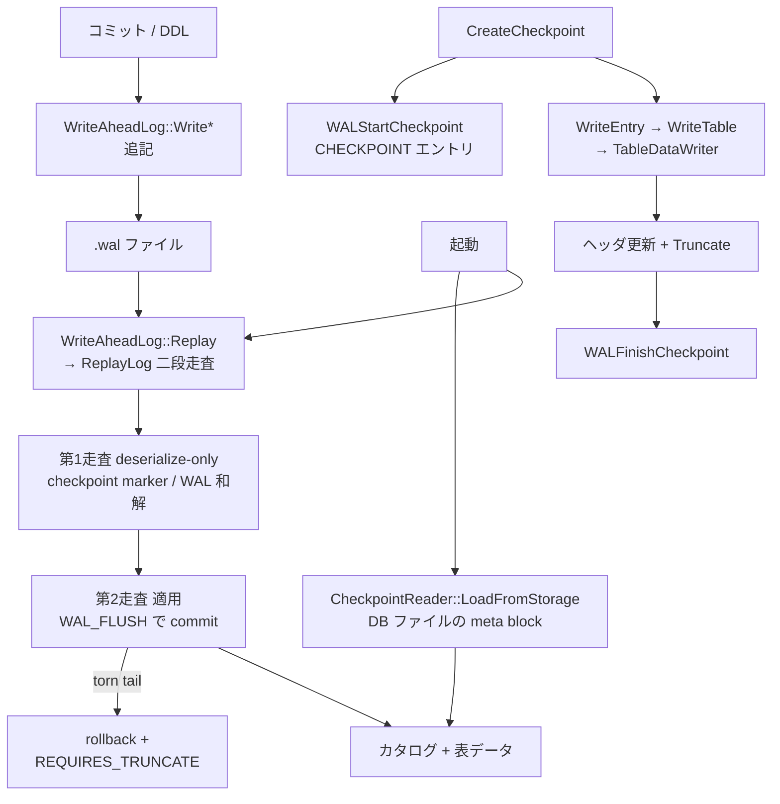

# 第28章 WAL とチェックポイント

> **本章で読むソース**
>
> - [src/storage/write_ahead_log.cpp](https://github.com/duckdb/duckdb/blob/v1.5.4/src/storage/write_ahead_log.cpp)
> - [src/storage/wal_replay.cpp](https://github.com/duckdb/duckdb/blob/v1.5.4/src/storage/wal_replay.cpp)
> - [src/storage/checkpoint_manager.cpp](https://github.com/duckdb/duckdb/blob/v1.5.4/src/storage/checkpoint_manager.cpp)
> - [src/storage/checkpoint/table_data_writer.cpp](https://github.com/duckdb/duckdb/blob/v1.5.4/src/storage/checkpoint/table_data_writer.cpp)

## この章の狙い

永続化には、互いに役割の違う二本の経路がある。
一つは **WAL** であり、コミット済み変更を追記してクラッシュ後に再適用する。
もう一つは **チェックポイント** であり、カタログと表データをデータベースファイルへ直列化して、WAL を刈り込める点まで進める。
両者を「ログに書く」一語でまとめないことが本章の目標である。

## 前提

第24章の `SingleFileStorageManager` / `BlockManager` がファイル実体を持つ。
第27章の圧縮は、チェックポイントで列を永続化するときに選ばれる。
トランザクションの可視性そのものは第30章で扱う。

## WAL 書き込み経路

`WriteAheadLog` は `BufferedFileWriter` を append モードで開き、以降のエントリをその writer へ直列化する。

[src/storage/write_ahead_log.cpp L49-L67](https://github.com/duckdb/duckdb/blob/v1.5.4/src/storage/write_ahead_log.cpp#L49-L67)

```cpp
BufferedFileWriter &WriteAheadLog::Initialize() {
	if (Initialized()) {
		return *writer;
	}
	lock_guard<mutex> lock(wal_lock);
	if (!writer) {
		writer =
		    make_uniq<BufferedFileWriter>(FileSystem::Get(GetDatabase()), wal_path,
		                                  FileFlags::FILE_FLAGS_WRITE | FileFlags::FILE_FLAGS_FILE_CREATE |
		                                      FileFlags::FILE_FLAGS_APPEND | FileFlags::FILE_FLAGS_MULTI_CLIENT_ACCESS);
		if (init_state == WALInitState::UNINITIALIZED_REQUIRES_TRUNCATE) {
			writer->Truncate(storage_manager.GetWALSize());
		} else {
			storage_manager.SetWALSize(writer->GetFileSize());
		}
		init_state = WALInitState::INITIALIZED;
	}
	return *writer;
}
```

先頭にはバージョンと DB 識別子、チェックポイント反復番号を書く。
ヘッダは checksum 対象外である。
チェックポイント開始を知らせる専用エントリは `WriteCheckpoint` であり、計画中の meta block ポインタを載せる。

[src/storage/write_ahead_log.cpp L238-L283](https://github.com/duckdb/duckdb/blob/v1.5.4/src/storage/write_ahead_log.cpp#L238-L283)

```cpp
void WriteAheadLog::WriteHeader() {
	D_ASSERT(writer);
	if (writer->GetFileSize() > 0) {
		// Already written - no need to write a header.
		return;
	}

	// Write the header containing
	// - the version marker,
	// - the header_id of the matching database file, and
	// - the checkpoint iteration of the matching database file.
	// Note that we explicitly do not checksum the header, as it contains the version entry.

	BinarySerializer serializer(*writer);
	serializer.Begin();
	serializer.WriteProperty(100, "wal_type", WALType::WAL_VERSION);

	auto &database = GetDatabase();
	auto &catalog = database.GetCatalog().Cast<DuckCatalog>();
	auto encryption_version_number =
	    catalog.GetIsEncrypted() ? idx_t(WAL_ENCRYPTED_VERSION_NUMBER) : idx_t(WAL_VERSION_NUMBER);
	serializer.WriteProperty(101, "version", encryption_version_number);

	auto &single_file_block_manager = database.GetStorageManager().GetBlockManager().Cast<SingleFileBlockManager>();
	auto file_version_number = single_file_block_manager.GetVersionNumber();
	if (file_version_number > 66) {
		auto db_identifier = single_file_block_manager.GetDBIdentifier();
		serializer.WriteList(102, "db_identifier", MainHeader::DB_IDENTIFIER_LEN,
		                     [&](Serializer::List &list, idx_t i) { list.WriteElement(db_identifier[i]); });
		idx_t current_checkpoint_iteration;
		if (checkpoint_iteration.IsValid()) {
			current_checkpoint_iteration = checkpoint_iteration.GetIndex();
		} else {
			current_checkpoint_iteration = single_file_block_manager.GetCheckpointIteration();
		}
		serializer.WriteProperty(103, "checkpoint_iteration", current_checkpoint_iteration);
	}

	serializer.End();
}

void WriteAheadLog::WriteCheckpoint(MetaBlockPointer meta_block) {
	WriteAheadLogSerializer serializer(*this, WALType::CHECKPOINT);
	serializer.WriteProperty(101, "meta_block", meta_block);
	serializer.End();
}
```

行変更はチャンク単位のエントリになる。
`INSERT_TUPLE` / `DELETE_TUPLE` / `UPDATE_TUPLE` と、大きな永続コレクション向けの `ROW_GROUP_DATA` が並ぶ。
いずれも `WriteAheadLogSerializer` が `wal_type` 付きで包む。

[src/storage/write_ahead_log.cpp L468-L511](https://github.com/duckdb/duckdb/blob/v1.5.4/src/storage/write_ahead_log.cpp#L468-L511)

```cpp
void WriteAheadLog::WriteInsert(DataChunk &chunk) {
	D_ASSERT(chunk.size() > 0);
	chunk.Verify();

	WriteAheadLogSerializer serializer(*this, WALType::INSERT_TUPLE);
	serializer.WriteProperty(101, "chunk", chunk);
	serializer.End();
}

void WriteAheadLog::WriteRowGroupData(const PersistentCollectionData &data) {
	D_ASSERT(!data.row_group_data.empty());

	WriteAheadLogSerializer serializer(*this, WALType::ROW_GROUP_DATA);
	serializer.WriteProperty(101, "row_group_data", data);
	serializer.End();

	// mark written blocks as checkpointed
	auto &block_manager = GetDatabase().GetStorageManager().GetBlockManager();
	for (auto &block_id : data.GetBlockIds()) {
		block_manager.MarkBlockAsCheckpointed(block_id);
	}
}

void WriteAheadLog::WriteDelete(DataChunk &chunk) {
	D_ASSERT(chunk.size() > 0);
	D_ASSERT(chunk.ColumnCount() == 1 && chunk.data[0].GetType() == LogicalType::ROW_TYPE);
	chunk.Verify();

	WriteAheadLogSerializer serializer(*this, WALType::DELETE_TUPLE);
	serializer.WriteProperty(101, "chunk", chunk);
	serializer.End();
}

void WriteAheadLog::WriteUpdate(DataChunk &chunk, const vector<column_t> &column_indexes) {
	D_ASSERT(chunk.size() > 0);
	D_ASSERT(chunk.ColumnCount() == 2);
	D_ASSERT(chunk.data[1].GetType().id() == LogicalType::ROW_TYPE);
	chunk.Verify();

	WriteAheadLogSerializer serializer(*this, WALType::UPDATE_TUPLE);
	serializer.WriteProperty(101, "column_indexes", column_indexes);
	serializer.WriteProperty(102, "chunk", chunk);
	serializer.End();
}
```

ここで書いた内容は「まだメイン DB ファイルの最新スナップショットではない」。
次に見る replay 経路が、起動時にそれをカタログと表へ戻す。

## WAL 再生経路

再生の入口は `WriteAheadLog::Replay` である。
ファイルが無ければ空の WAL を用意し、あれば `WriteAheadLogReplayer::ReplayLog` で中身を適用する。
再生の結果 WAL が不要と判断されれば（読み取り専用でなければ）ファイルを削除する。

[src/storage/wal_replay.cpp L295-L324](https://github.com/duckdb/duckdb/blob/v1.5.4/src/storage/wal_replay.cpp#L295-L324)

```cpp
unique_ptr<WriteAheadLog> WriteAheadLog::Replay(QueryContext context, StorageManager &storage_manager,
                                                const string &main_wal_path) {
	WriteAheadLogReplayer wal_replay(context, storage_manager, main_wal_path);
	return wal_replay.Replay();
}

WriteAheadLogReplayer::WriteAheadLogReplayer(QueryContext context, StorageManager &storage_manager,
                                             const string &main_wal_path)
    : context(context), storage_manager(storage_manager), database(storage_manager.GetAttached()),
      main_wal_path(main_wal_path), fs(FileSystem::Get(storage_manager.GetAttached())) {
}

unique_ptr<WriteAheadLog> WriteAheadLogReplayer::Replay() {
	auto handle = fs.OpenFile(main_wal_path, FileFlags::FILE_FLAGS_READ | FileFlags::FILE_FLAGS_NULL_IF_NOT_EXISTS);
	if (!handle) {
		// WAL does not exist - instantiate an empty WAL
		return make_uniq<WriteAheadLog>(storage_manager, main_wal_path);
	}

	// context is passed for metric collection purposes only!!
	auto wal_handle = ReplayLog(std::move(handle));
	if (wal_handle) {
		return wal_handle;
	}
	// replay returning NULL indicates we can nuke the WAL entirely - but only if this is not a read-only connection
	if (!storage_manager.GetAttached().IsReadOnly()) {
		fs.TryRemoveFile(main_wal_path);
	}
	return make_uniq<WriteAheadLog>(storage_manager, main_wal_path);
}
```

実際の復旧原子性は `WriteAheadLogReplayer::ReplayLog` が担う。
入口の `Replay` はファイルを開いてこの関数に渡し、戻り値が空なら WAL 全体を削除してよいと判断する。

第一走査は deserialize-only である。
エントリを適用せずに読み進め、torn WAL の serialization 例外は握りつぶす。
目的は checkpoint marker（`checkpoint_id`）の有無を知ることである。

[src/storage/wal_replay.cpp L397-L440](https://github.com/duckdb/duckdb/blob/v1.5.4/src/storage/wal_replay.cpp#L397-L440)

```cpp
unique_ptr<WriteAheadLog> WriteAheadLogReplayer::ReplayLog(unique_ptr<FileHandle> handle, WALReplayState replay_state) {
	auto &database = storage_manager.GetAttached();
	Connection con(database.GetDatabase());
	auto wal_path = handle->GetPath();
	BufferedFileReader reader(FileSystem::Get(database), std::move(handle));
	if (reader.Finished()) {
		// WAL file exists, but it is empty - we can delete the file
		return nullptr;
	}

	con.BeginTransaction();
	MetaTransaction::Get(*con.context).ModifyDatabase(database, DatabaseModificationType());

	auto &config = DBConfig::GetConfig(database.GetDatabase());
	// first deserialize the WAL to look for a checkpoint flag
	// if there is a checkpoint flag, we might have already flushed the contents of the WAL to disk
	ReplayState checkpoint_state(database, *con.context, replay_state);
	try {
		idx_t replay_entry_count = 0;
		while (true) {
			replay_entry_count++;
			// read the current entry (deserialize only)
			checkpoint_state.current_position = reader.CurrentOffset();
			auto deserializer = WriteAheadLogDeserializer::GetEntryDeserializer(checkpoint_state, reader, true);
			if (deserializer.ReplayEntry()) {
				// check if the file is exhausted
				if (reader.Finished()) {
					// we finished reading the file: break
					break;
				}
			}
		}
		auto client_context = context.GetClientContext();
		if (client_context) {
			auto &profiler = *client_context->client_data->profiler;
			profiler.AddToCounter(MetricType::WAL_REPLAY_ENTRY_COUNT, replay_entry_count);
		}
	} catch (std::exception &ex) { // LCOV_EXCL_START
		ErrorData error(ex);
		// ignore serialization exceptions - they signal a torn WAL
		if (error.Type() != ExceptionType::SERIALIZATION) {
			error.Throw("Failure while replaying WAL file \"" + wal_path + "\": ");
		}
	} // LCOV_EXCL_STOP
```

checkpoint marker があれば、main WAL と `.checkpoint.wal` を checkpoint 成否で選び直す。
成功済みで checkpoint WAL が無ければ再生は不要である。
成功済みで checkpoint WAL があれば、読み取り専用ならそれを再帰再生し、そうでなければ main WAL へ上書きしてから再帰する。
未成功で checkpoint WAL があれば、読み書き接続では両 WAL を recovery パスへ結合して再帰する。

[src/storage/wal_replay.cpp L441-L502](https://github.com/duckdb/duckdb/blob/v1.5.4/src/storage/wal_replay.cpp#L441-L502)

```cpp
	unique_ptr<FileHandle> checkpoint_handle;
	if (checkpoint_state.checkpoint_id.IsValid()) {
		if (replay_state == WALReplayState::CHECKPOINT_WAL) {
			throw InvalidInputException(
			    "Failure while replaying checkpoint WAL file \"%s\": checkpoint WAL cannot contain a checkpoint marker",
			    wal_path);
		}
		// there is a checkpoint flag
		// this means a checkpoint was on-going when we crashed
		// we need to reconcile this with what is in the data file
		// first check if there is a checkpoint WAL
		auto &manager = database.GetStorageManager();
		auto checkpoint_wal = manager.GetCheckpointWALPath();
		checkpoint_handle =
		    fs.OpenFile(checkpoint_wal, FileFlags::FILE_FLAGS_READ | FileFlags::FILE_FLAGS_NULL_IF_NOT_EXISTS);
		bool checkpoint_was_successful = manager.IsCheckpointClean(checkpoint_state.checkpoint_id);
		if (!checkpoint_handle) {
			// no checkpoint WAL - either we just need to replay this WAL, or we are done
			if (checkpoint_was_successful) {
				// the contents of the WAL have already been checkpointed and there is no checkpoint WAL - we are done
				return nullptr;
			}
		} else {
			// we have a checkpoint WAL
			if (checkpoint_was_successful) {
				// the checkpoint was successful
				// the main WAL is no longer needed, we only need to replay the checkpoint WAL
				// if this is a read-only connection then replay the checkpoint WAL directly
				if (storage_manager.GetAttached().IsReadOnly()) {
					return ReplayLog(std::move(checkpoint_handle), WALReplayState::CHECKPOINT_WAL);
				}
				// if this is not a read-only connection we need to finish the checkpoint
				// overwrite the current WAL with the checkpoint WAL
				checkpoint_handle.reset();

				fs.MoveFile(checkpoint_wal, wal_path);

				// now open the handle again and replay the checkpoint WAL
				checkpoint_handle =
				    fs.OpenFile(wal_path, FileFlags::FILE_FLAGS_READ | FileFlags::FILE_FLAGS_NULL_IF_NOT_EXISTS);
				return ReplayLog(std::move(checkpoint_handle), WALReplayState::CHECKPOINT_WAL);
			}
			// the checkpoint was unsuccessful
			// this means we need to replay both this WAL and the checkpoint WAL
			// if this is a read-only connection - replay both WAL files
			if (!storage_manager.GetAttached().IsReadOnly()) {
				// if this is not a read-only connection, then merge the two WALs and replay the merged WAL
				// we merge into the recovery WAL path
				auto recovery_path = manager.GetRecoveryWALPath();
				MergeIntoRecoveryWAL(con, checkpoint_state, reader, recovery_path, std::move(checkpoint_handle));

				// replay the (combined) recovery WAL
				auto main_handle = fs.OpenFile(wal_path, FileFlags::FILE_FLAGS_READ);
				return ReplayLog(std::move(main_handle), WALReplayState::CHECKPOINT_WAL);
			}
		}
	}
	if (checkpoint_state.expected_checkpoint_id.IsValid()) {
		// we expected a checkpoint id - but no checkpoint has happened - abort!
		auto expected_id = checkpoint_state.expected_checkpoint_id.GetIndex();
		WriteAheadLogDeserializer::ThrowVersionError(expected_id - 1, expected_id);
	}
```

第二走査では reader を先頭へ戻し、今度は適用付きで読む。
`ReplayEntry` が `true`（`WAL_FLUSH`）を返した時点で transaction を commit し、保留していた index を表へ載せ、`successful_offset` を現在位置に更新する。
それが commit 境界である。
torn / truncated tail で serialization 例外が起きれば、現 transaction を `ROLLBACK` し、`abort_on_wal_failure` でなければ例外を握りつぶす。
全エントリが成功していなければ `WALInitState::UNINITIALIZED_REQUIRES_TRUNCATE` と最後の成功 offset を持つ `WriteAheadLog` を返し、初期化時にその位置まで truncate する（本章冒頭の `Initialize`）。

[src/storage/wal_replay.cpp L504-L561](https://github.com/duckdb/duckdb/blob/v1.5.4/src/storage/wal_replay.cpp#L504-L561)

```cpp
	// we need to recover from the WAL: actually set up the replay state
	ReplayState state(database, *con.context, replay_state);

	// reset the reader - we are going to read the WAL from the beginning again
	reader.Reset();

	// replay the WAL
	// note that everything is wrapped inside a try/catch block here
	// there can be errors in WAL replay because of a corrupt WAL file
	idx_t successful_offset = 0;
	bool all_succeeded = false;
	try {
		while (true) {
			// read the current entry
			auto deserializer = WriteAheadLogDeserializer::GetEntryDeserializer(state, reader);
			if (deserializer.ReplayEntry()) {
				con.Commit();

				// Commit any outstanding indexes.
				for (auto &info : state.replay_index_infos) {
					info.index_list.get().AddIndex(std::move(info.index));
				}
				state.replay_index_infos.clear();

				successful_offset = reader.CurrentOffset();
				// check if the file is exhausted
				if (reader.Finished()) {
					// we finished reading the file: break
					all_succeeded = true;
					break;
				}
				con.BeginTransaction();
				MetaTransaction::Get(*con.context).ModifyDatabase(database, DatabaseModificationType());
			}
		}
	} catch (std::exception &ex) { // LCOV_EXCL_START
		// exception thrown in WAL replay: rollback
		con.Query("ROLLBACK");
		ErrorData error(ex);
		// serialization failure means a truncated WAL
		// these failures are ignored unless abort_on_wal_failure is true
		// other failures always result in an error
		if (config.options.abort_on_wal_failure || error.Type() != ExceptionType::SERIALIZATION) {
			error.Throw("Failure while replaying WAL file \"" + wal_path + "\": ");
		}
	} catch (...) {
		// exception thrown in WAL replay: rollback
		con.Query("ROLLBACK");
		throw;
	} // LCOV_EXCL_STOP
	if (all_succeeded && checkpoint_handle) {
		// we have successfully replayed the main WAL - but there is still a checkpoint WAL remaining
		// this can only happen in read-only mode
		// replay the checkpoint WAL and return
		return ReplayLog(std::move(checkpoint_handle), WALReplayState::CHECKPOINT_WAL);
	}
	auto init_state = all_succeeded ? WALInitState::UNINITIALIZED : WALInitState::UNINITIALIZED_REQUIRES_TRUNCATE;
	return make_uniq<WriteAheadLog>(storage_manager, wal_path, successful_offset, init_state);
```

各エントリは型タグを読み、`WAL_FLUSH` なら区切りとして戻り、それ以外は型別の `Replay*` へ分岐する。

[src/storage/wal_replay.cpp L199-L209](https://github.com/duckdb/duckdb/blob/v1.5.4/src/storage/wal_replay.cpp#L199-L209)

```cpp
	bool ReplayEntry() {
		deserializer.Begin();
		auto wal_type = deserializer.ReadProperty<WALType>(100, "wal_type");
		if (wal_type == WALType::WAL_FLUSH) {
			deserializer.End();
			return true;
		}
		ReplayEntry(wal_type);
		deserializer.End();
		return false;
	}
```

[src/storage/wal_replay.cpp L567-L647](https://github.com/duckdb/duckdb/blob/v1.5.4/src/storage/wal_replay.cpp#L567-L647)

```cpp
void WriteAheadLogDeserializer::ReplayEntry(WALType entry_type) {
	switch (entry_type) {
	case WALType::WAL_VERSION:
		ReplayVersion();
		break;
	case WALType::CREATE_TABLE:
		ReplayCreateTable();
		break;
	case WALType::DROP_TABLE:
		ReplayDropTable();
		break;
	case WALType::ALTER_INFO:
		ReplayAlter();
		break;
	case WALType::CREATE_VIEW:
		ReplayCreateView();
		break;
	case WALType::DROP_VIEW:
		ReplayDropView();
		break;
	case WALType::CREATE_SCHEMA:
		ReplayCreateSchema();
		break;
	case WALType::DROP_SCHEMA:
		ReplayDropSchema();
		break;
	case WALType::CREATE_SEQUENCE:
		ReplayCreateSequence();
		break;
	case WALType::DROP_SEQUENCE:
		ReplayDropSequence();
		break;
	case WALType::SEQUENCE_VALUE:
		ReplaySequenceValue();
		break;
	case WALType::CREATE_MACRO:
		ReplayCreateMacro();
		break;
	case WALType::DROP_MACRO:
		ReplayDropMacro();
		break;
	case WALType::CREATE_TABLE_MACRO:
		ReplayCreateTableMacro();
		break;
	case WALType::DROP_TABLE_MACRO:
		ReplayDropTableMacro();
		break;
	case WALType::CREATE_INDEX:
		ReplayCreateIndex();
		break;
	case WALType::DROP_INDEX:
		ReplayDropIndex();
		break;
	case WALType::USE_TABLE:
		ReplayUseTable();
		break;
	case WALType::INSERT_TUPLE:
		ReplayInsert();
		break;
	case WALType::ROW_GROUP_DATA:
		ReplayRowGroupData();
		break;
	case WALType::DELETE_TUPLE:
		ReplayDelete();
		break;
	case WALType::UPDATE_TUPLE:
		ReplayUpdate();
		break;
	case WALType::CHECKPOINT:
		ReplayCheckpoint();
		break;
	case WALType::CREATE_TYPE:
		ReplayCreateType();
		break;
	case WALType::DROP_TYPE:
		ReplayDropType();
		break;
	default:
		throw InternalException("Invalid WAL entry type!");
	}
}
```

タプル挿入の再適用は、現在表を決め、制約検証なしの `LocalWALAppend` へ渡す。
これは通常の SQL insert 経路ではなく、再生専用の戻しである。

[src/storage/wal_replay.cpp L1060-L1074](https://github.com/duckdb/duckdb/blob/v1.5.4/src/storage/wal_replay.cpp#L1060-L1074)

```cpp
void WriteAheadLogDeserializer::ReplayInsert() {
	DataChunk chunk;
	deserializer.ReadObject(101, "chunk", [&](Deserializer &object) { chunk.Deserialize(object); });
	if (DeserializeOnly()) {
		return;
	}
	if (!state.current_table) {
		throw InternalException("Corrupt WAL: insert without table");
	}

	// Append to the current table without constraint verification.
	vector<unique_ptr<BoundConstraint>> bound_constraints;
	auto &storage = state.current_table->GetStorage();
	storage.LocalWALAppend(*state.current_table, context, chunk, bound_constraints);
}
```

WAL 経路の要約は次のとおりである。
書き手はエントリを追記し、再生は `ReplayLog` の二段走査で checkpoint WAL を和解したうえで、型スイッチによりカタログ操作または表変更を再実行する。
`WAL_FLUSH` が commit 境界であり、torn tail は rollback と truncate で切る。
メインファイルへのカタログ直列化ではない。

## チェックポイント（serialization）経路

チェックポイントは `SingleFileCheckpointWriter::CreateCheckpoint` が担う。
メタデータ用 writer を起こし、計画中の root meta block を WAL へ `WALStartCheckpoint` で知らせてから、コミット済みカタログを依存順に並べて `BinarySerializer` へ書く。

[src/storage/checkpoint_manager.cpp L130-L209](https://github.com/duckdb/duckdb/blob/v1.5.4/src/storage/checkpoint_manager.cpp#L130-L209)

```cpp
void SingleFileCheckpointWriter::CreateCheckpoint() {
	auto &storage_manager = db.GetStorageManager().Cast<SingleFileStorageManager>();
	if (storage_manager.InMemory()) {
		return;
	}
	if (ValidChecker::IsInvalidated(db.GetDatabase())) {
		// don't checkpoint invalidated databases
		return;
	}
	// assert that the checkpoint manager hasn't been used before
	D_ASSERT(!metadata_writer);

	auto &block_manager = GetBlockManager();
	auto &metadata_manager = GetMetadataManager();

	//! Set up the writers for the checkpoints
	metadata_writer = make_uniq<MetadataWriter>(metadata_manager);
	table_metadata_writer = make_uniq<MetadataWriter>(metadata_manager);

	// get the id of the first meta block
	auto meta_block = metadata_writer->GetMetaBlockPointer();

	// write a checkpoint flag to the WAL
	// in case a crash happens during the checkpoint, we know a checkpoint was instantiated
	// we write the root meta block of the planned checkpoint to the WAL
	// during recovery we use this:
	// * if the root meta block matches the checkpoint entry, we know the checkpoint was completed
	// * if the root meta block does not match the checkpoint entry, we know the checkpoint was not completed
	// if the checkpoint was completed we don't need to replay the WAL - otherwise we need to replay the WAL
	// we also know if a checkpoint was running that we need to check for the checkpoint WAL (`.checkpoint.wal`)
	// to replay any concurrent commits that have succeeded and ensure these are not lost
	auto &transaction_manager = db.GetTransactionManager().Cast<DuckTransactionManager>();
	ActiveCheckpointWrapper active_checkpoint(transaction_manager);
	auto has_wal = storage_manager.WALStartCheckpoint(meta_block, options);

	catalog_entry_vector_t catalog_entries;
	try {
		auto checkpoint_sleep_ms = Settings::Get<DebugCheckpointSleepMsSetting>(db.GetDatabase());
		if (checkpoint_sleep_ms > 0) {
			ThreadUtil::SleepMs(checkpoint_sleep_ms);
		}

		vector<reference<SchemaCatalogEntry>> schemas;
		// we scan the set of committed schemas
		auto &catalog = Catalog::GetCatalog(db).Cast<DuckCatalog>();
		catalog.ScanSchemas([&](SchemaCatalogEntry &entry) { schemas.push_back(entry); });

		D_ASSERT(catalog.IsDuckCatalog());

		auto &dependency_manager = *catalog.GetDependencyManager();
		catalog_entries = GetCatalogEntries(schemas);
		dependency_manager.ReorderEntries(catalog_entries);

		// write the actual data into the database

		// Create a serializer to write the checkpoint data
		// The serialized format is roughly:
		/*
		    {
		        schemas: [
		            {
		                schema: <schema_info>,
		                custom_types: [ { type: <type_info> }, ... ],
		                sequences: [ { sequence: <sequence_info> }, ... ],
		                tables: [ { table: <table_info> }, ... ],
		                views: [ { view: <view_info> }, ... ],
		                macros: [ { macro: <macro_info> }, ... ],
		                table_macros: [ { table_macro: <table_macro_info> }, ... ],
		                indexes: [ { index: <index_info>, root_offset <block_ptr> }, ... ]
		            }
		        ]
		    }
		 */
		BinarySerializer serializer(*metadata_writer, SerializationOptions(db));
		serializer.Begin();
		serializer.WriteList(100, "catalog_entries", catalog_entries.size(), [&](Serializer::List &list, idx_t i) {
			auto &entry = catalog_entries[i];
			list.WriteObject([&](Serializer &obj) { WriteEntry(entry.get(), obj); });
		});
		serializer.End();
```

コメントにあるとおり、WAL 上の CHECKPOINT エントリとヘッダの meta block が一致するかどうかで「チェックポイント完了」を判断する。
一致すれば再生は省略でき、不一致なら未完了として WAL（と必要なら `.checkpoint.wal`）を追う。

エントリ種別ごとの書き込みは `CheckpointWriter::WriteEntry` が振り分ける。
表なら `WriteTable` がメタデータと行データを続けて書く。

[src/storage/checkpoint_manager.cpp L349-L392](https://github.com/duckdb/duckdb/blob/v1.5.4/src/storage/checkpoint_manager.cpp#L349-L392)

```cpp
void CheckpointWriter::WriteEntry(CatalogEntry &entry, Serializer &serializer) {
	serializer.WriteProperty(99, "catalog_type", entry.type);

	switch (entry.type) {
	case CatalogType::SCHEMA_ENTRY: {
		auto &schema = entry.Cast<SchemaCatalogEntry>();
		WriteSchema(schema, serializer);
		break;
	}
	case CatalogType::TYPE_ENTRY: {
		auto &custom_type = entry.Cast<TypeCatalogEntry>();
		WriteType(custom_type, serializer);
		break;
	}
	case CatalogType::SEQUENCE_ENTRY: {
		auto &seq = entry.Cast<SequenceCatalogEntry>();
		WriteSequence(seq, serializer);
		break;
	}
	case CatalogType::TABLE_ENTRY: {
		auto &table = entry.Cast<TableCatalogEntry>();
		WriteTable(table, serializer);
		break;
	}
	case CatalogType::VIEW_ENTRY: {
		auto &view = entry.Cast<ViewCatalogEntry>();
		WriteView(view, serializer);
		break;
	}
	case CatalogType::MACRO_ENTRY: {
		auto &macro = entry.Cast<ScalarMacroCatalogEntry>();
		WriteMacro(macro, serializer);
		break;
	}
	case CatalogType::TABLE_MACRO_ENTRY: {
		auto &macro = entry.Cast<TableMacroCatalogEntry>();
		WriteTableMacro(macro, serializer);
		break;
	}
	case CatalogType::INDEX_ENTRY: {
		auto &index = entry.Cast<IndexCatalogEntry>();
		WriteIndex(index, serializer);
		break;
	}
```

[src/storage/checkpoint_manager.cpp L585-L604](https://github.com/duckdb/duckdb/blob/v1.5.4/src/storage/checkpoint_manager.cpp#L585-L604)

```cpp
void SingleFileCheckpointWriter::WriteTable(TableCatalogEntry &table, Serializer &serializer) {
	// Write the table metadata
	serializer.WriteProperty(100, "table", &table);

	// If there is a context available, bind indexes before serialization.
	// This is necessary so that buffered index operations are replayed before we checkpoint, otherwise
	// we would lose them if there was a restart after this.
	if (context && context->transaction.HasActiveTransaction()) {
		auto &info = table.GetStorage().GetDataTableInfo();
		info->BindIndexes(*context);
	}
	// FIXME: If we do not have a context, however, the unbound indexes have to be serialized to disk.

	// Write the table data
	auto table_lock = table.GetStorage().GetCheckpointLock();
	auto writer = GetTableDataWriter(table);
	if (writer) {
		writer->WriteTableData(serializer);
	}
}
```

表データの実体は `TableDataWriter::WriteTableData` が `DataTable::Checkpoint` へ委譲する。
ここが第26章〜第27章の列セグメント書き換え（圧縮選定を含む）へ繋がる serialization 経路である。

[src/storage/checkpoint/table_data_writer.cpp L34-L37](https://github.com/duckdb/duckdb/blob/v1.5.4/src/storage/checkpoint/table_data_writer.cpp#L34-L37)

```cpp
void TableDataWriter::WriteTableData(Serializer &metadata_serializer) {
	// start scanning the table and append the data to the uncompressed segments
	table.GetStorage().Checkpoint(*this, metadata_serializer);
}
```

完了後はヘッダを更新し、ブロックを truncate し、WAL を `WALFinishCheckpoint` で刈り込む。

[src/storage/checkpoint_manager.cpp L261-L281](https://github.com/duckdb/duckdb/blob/v1.5.4/src/storage/checkpoint_manager.cpp#L261-L281)

```cpp
		// truncate the file
		block_manager.Truncate();

		if (debug_checkpoint_abort == CheckpointAbort::DEBUG_ABORT_BEFORE_WAL_FINISH) {
			throw FatalException("Checkpoint aborted before truncate because of PRAGMA checkpoint_abort flag");
		}

		// truncate the WAL
		if (has_wal) {
			unique_ptr<lock_guard<mutex>> owned_wal_lock;
			optional_ptr<lock_guard<mutex>> wal_lock;
			if (!options.wal_lock) {
				// not holding the WAL lock yet - grab it
				owned_wal_lock = storage_manager.GetWALLock();
				wal_lock = *owned_wal_lock;
			} else {
				// we already have the WAL lock - just refer to it
				wal_lock = options.wal_lock;
			}
			storage_manager.WALFinishCheckpoint(*wal_lock);
		}
```

起動時にスナップショットを読む側は、ヘッダの meta block から `SingleFileCheckpointReader::LoadFromStorage` → `LoadCheckpoint` である。
これは WAL の `ReplayEntry` スイッチとは別の deserializer である。

[src/storage/checkpoint_manager.cpp L313-L347](https://github.com/duckdb/duckdb/blob/v1.5.4/src/storage/checkpoint_manager.cpp#L313-L347)

```cpp
void CheckpointReader::LoadCheckpoint(CatalogTransaction transaction, MetadataReader &reader) {
	BinaryDeserializer deserializer(reader);
	deserializer.Set<Catalog &>(catalog);
	deserializer.Begin();
	deserializer.ReadList(100, "catalog_entries", [&](Deserializer::List &list, idx_t i) {
		return list.ReadObject([&](Deserializer &obj) { ReadEntry(transaction, obj); });
	});
	deserializer.End();
	deserializer.Unset<Catalog>();
}

MetadataManager &SingleFileCheckpointReader::GetMetadataManager() {
	return storage.block_manager->GetMetadataManager();
}

void SingleFileCheckpointReader::LoadFromStorage() {
	auto &block_manager = *storage.block_manager;
	auto &metadata_manager = GetMetadataManager();
	MetaBlockPointer meta_block(block_manager.GetMetaBlock(), 0);
	if (!meta_block.IsValid()) {
		// storage is empty
		return;
	}

	if (block_manager.Prefetch()) {
		auto metadata_blocks = metadata_manager.GetBlocks();
		auto &buffer_manager = BufferManager::GetBufferManager(storage.GetDatabase());
		buffer_manager.Prefetch(metadata_blocks);
	}

	// create the MetadataReader to read from the storage
	MetadataReader reader(metadata_manager, meta_block);
	auto transaction = CatalogTransaction::GetSystemTransaction(catalog.GetDatabase());
	LoadCheckpoint(transaction, reader);
}
```

## 両経路を混同しない

次の区別を固定する。

- **WAL 書き込み**：コミットや DDL の結果を追記ファイルへ載せる経路で、入口は `WriteAheadLog::Write*` である。
- **WAL 再生**：起動時などに追記を型スイッチで再適用する経路で、入口は `WriteAheadLog::Replay` / `ReplayEntry` である。
- **チェックポイント書き込み**：カタログと表を DB ファイルのメタブロックへ直列化する経路で、入口は `CreateCheckpoint` / `WriteEntry` / `TableDataWriter` である。
- **チェックポイント読み込み**：ヘッダの meta block からカタログを復元する経路で、入口は `LoadFromStorage` である。

WAL の `CHECKPOINT` エントリは「チェックポイント自体のペイロード」ではなく、計画中 root を復旧判断に使うマーカーである。
表データの圧縮済みセグメントはチェックポイント側の serialization が書き、WAL 側の `ROW_GROUP_DATA` は別エントリとして追記経路に載る。

## 処理の流れ



## 高速化と最適化の工夫

チェックポイントは WAL を無制限に伸ばさないための刈り込み点である。
完了判定を meta block 一致に寄せることで、完了済みなら再生を省略できる。
進行中クラッシュに備え、CHECKPOINT マーカーと `.checkpoint.wal`（同時コミット）を別途扱う。
表データ書きでは、変更のないセグメントはメタデータだけ進める経路もあり、毎回全列を作り直さない（第27章の `ColumnDataCheckpointer` 側）。

## まとめ

WAL は追記と型別再生の経路であり、チェックポイントは DB ファイルへのカタログ / 表 serialization の経路である。
再生の原子性は `ReplayLog` が担い、deserialize-only の第1走査で checkpoint WAL を和解し、第2走査では `WAL_FLUSH` ごとに commit、torn tail では rollback と truncate を返す。
起動は通常「チェックポイント読み → 必要なら WAL 再生」の順であり、CHECKPOINT エントリは完了判定用の橋渡しに過ぎない。
表の圧縮済み永続化は serialization 経路に属する。

## 関連する章

- 第24章（ストレージ全体像とブロック管理）：ファイルと BlockManager
- 第27章（圧縮）：チェックポイント時の列書き換え
- 第29章（ART インデックス）：インデックスの永続化と制約
- 第30章（MVCC トランザクション）：コミットと WAL を繋ぐ上位経路
