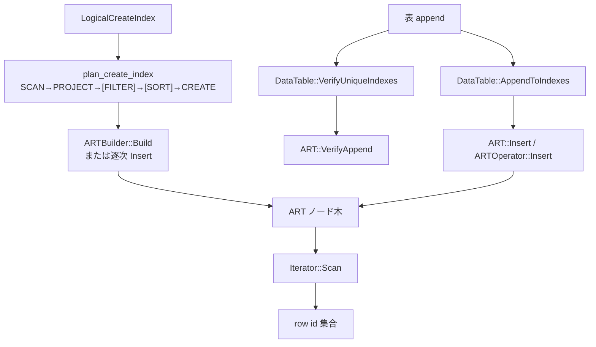

# 第29章 ART インデックス

> **本章で読むソース**
>
> - [src/execution/index/art/art.cpp](https://github.com/duckdb/duckdb/blob/v1.5.4/src/execution/index/art/art.cpp)
> - [src/execution/index/art/art_index.cpp](https://github.com/duckdb/duckdb/blob/v1.5.4/src/execution/index/art/art_index.cpp)
> - [src/execution/index/art/art_builder.cpp](https://github.com/duckdb/duckdb/blob/v1.5.4/src/execution/index/art/art_builder.cpp)
> - [src/execution/index/art/iterator.cpp](https://github.com/duckdb/duckdb/blob/v1.5.4/src/execution/index/art/iterator.cpp)
> - [src/execution/index/art/node.cpp](https://github.com/duckdb/duckdb/blob/v1.5.4/src/execution/index/art/node.cpp)
> - [src/execution/physical_plan/plan_create_index.cpp](https://github.com/duckdb/duckdb/blob/v1.5.4/src/execution/physical_plan/plan_create_index.cpp)
> - [src/storage/data_table.cpp](https://github.com/duckdb/duckdb/blob/v1.5.4/src/storage/data_table.cpp)

## この章の狙い

DuckDB の主インデックス実装である **ART**（Adaptive Radix Tree）を、ノード構造から構築、挿入、一意制約まで追う。
`CREATE INDEX` の物理プランと、`DataTable` 側の制約検証がどこで ART に接続するかを押さえる。

## 前提

第22章のソートは、インデックス構築プランでキーを並べるときに再利用されうる。
第28章のチェックポイントは、インデックスも含めてカタログへ書く。
本章は実行時の木構造と制約経路に集中する。

## ART の所有とノード

`ART` は `BoundIndex` の派生であり、キー表現可能な物理型を列挙して拒否する。
ノード本体は型別の `FixedSizeAllocator` 配列に載り、`owns_data` が真なら自分が allocator を持つ。

[src/execution/index/art/art.cpp L47-L97](https://github.com/duckdb/duckdb/blob/v1.5.4/src/execution/index/art/art.cpp#L47-L97)

```cpp
ART::ART(const string &name, const IndexConstraintType index_constraint_type, const vector<column_t> &column_ids,
         TableIOManager &table_io_manager, const vector<unique_ptr<Expression>> &unbound_expressions,
         AttachedDatabase &db,
         const shared_ptr<array<unsafe_unique_ptr<FixedSizeAllocator>, ALLOCATOR_COUNT>> &allocators_ptr,
         const IndexStorageInfo &info)
    : BoundIndex(name, ART::TYPE_NAME, index_constraint_type, column_ids, table_io_manager, unbound_expressions, db),
      allocators(allocators_ptr), owns_data(false) {
	// FIXME: Use the new byte representation function to support nested types.
	for (idx_t i = 0; i < types.size(); i++) {
		switch (types[i]) {
		case PhysicalType::BOOL:
		case PhysicalType::INT8:
		case PhysicalType::INT16:
		case PhysicalType::INT32:
		case PhysicalType::INT64:
		case PhysicalType::INT128:
		case PhysicalType::UINT8:
		case PhysicalType::UINT16:
		case PhysicalType::UINT32:
		case PhysicalType::UINT64:
		case PhysicalType::UINT128:
		case PhysicalType::FLOAT:
		case PhysicalType::DOUBLE:
		case PhysicalType::VARCHAR:
			break;
		default:
			throw InvalidTypeException(logical_types[i], "Invalid type for index key.");
		}
	}

	// Initialize the allocators.
	SetPrefixCount(info);
	if (!allocators) {
		owns_data = true;
		auto prefix_size = NumericCast<idx_t>(prefix_count) + NumericCast<idx_t>(Prefix::METADATA_SIZE);
		auto &block_manager = table_io_manager.GetIndexBlockManager();

		array<unsafe_unique_ptr<FixedSizeAllocator>, ALLOCATOR_COUNT> allocator_array = {
		    make_unsafe_uniq<FixedSizeAllocator>(prefix_size, block_manager),
		    make_unsafe_uniq<FixedSizeAllocator>(sizeof(Leaf), block_manager),
		    make_unsafe_uniq<FixedSizeAllocator>(sizeof(Node4), block_manager),
		    make_unsafe_uniq<FixedSizeAllocator>(sizeof(Node16), block_manager),
		    make_unsafe_uniq<FixedSizeAllocator>(sizeof(Node48), block_manager),
		    make_unsafe_uniq<FixedSizeAllocator>(sizeof(Node256), block_manager),
		    make_unsafe_uniq<FixedSizeAllocator>(sizeof(Node7Leaf), block_manager),
		    make_unsafe_uniq<FixedSizeAllocator>(sizeof(Node15Leaf), block_manager),
		    make_unsafe_uniq<FixedSizeAllocator>(sizeof(Node256Leaf), block_manager),
		};
		allocators =
		    make_shared_ptr<array<unsafe_unique_ptr<FixedSizeAllocator>, ALLOCATOR_COUNT>>(std::move(allocator_array));
	}
```

内部ノードは子の個数に応じて Node4 / Node16 / Node48 / Node256 へ広がり、葉側にも容量別ノードがある。
`Node::New` がその生成の単一入口である。

[src/execution/index/art/node.cpp L25-L51](https://github.com/duckdb/duckdb/blob/v1.5.4/src/execution/index/art/node.cpp#L25-L51)

```cpp
void Node::New(ART &art, Node &node, NType type) {
	switch (type) {
	case NType::NODE_7_LEAF:
		Node7Leaf::New(art, node);
		break;
	case NType::NODE_15_LEAF:
		Node15Leaf::New(art, node);
		break;
	case NType::NODE_256_LEAF:
		Node256Leaf::New(art, node);
		break;
	case NType::NODE_4:
		Node4::New(art, node);
		break;
	case NType::NODE_16:
		Node16::New(art, node);
		break;
	case NType::NODE_48:
		Node48::New(art, node);
		break;
	case NType::NODE_256:
		Node256::New(art, node);
		break;
	default:
		throw InternalException("Invalid node type for New: %d.", type);
	}
}
```

## バルク構築: ARTBuilder

既存行から木を一気に作るときは `ARTBuilder::Build` がソート済みキー区間をスタックで分割する。
先頭と末尾のキーが一致する深さまで prefix を伸ばし、葉に落ちたら UNIQUE なら row id 件数を検査する。

[src/execution/index/art/art_builder.cpp L10-L50](https://github.com/duckdb/duckdb/blob/v1.5.4/src/execution/index/art/art_builder.cpp#L10-L50)

```cpp
ARTConflictType ARTBuilder::Build() {
	while (!s.empty()) {
		// Copy the entry so we can pop it.
		auto entry = s.top();
		s.pop();

		D_ASSERT(entry.start < keys.size());
		D_ASSERT(entry.end < keys.size());
		D_ASSERT(entry.start <= entry.end);

		auto &start = keys[entry.start];
		auto &end = keys[entry.end];
		D_ASSERT(start.len != 0);

		// Increment the depth until we reach a leaf or find a mismatching byte.
		auto prefix_depth = entry.depth;
		while (start.len != entry.depth && start.ByteMatches(end, entry.depth)) {
			entry.depth++;
		}

		// True, if we reached a leaf: all bytes of start_key and end_key match.
		if (start.len == entry.depth) {
			// Get the number of row IDs in the leaf.
			auto row_id_count = entry.end - entry.start + 1;
			if (art.IsUnique() && row_id_count != 1) {
				return ARTConflictType::CONSTRAINT;
			}

			reference<Node> ref(entry.node);
			auto count = UnsafeNumericCast<idx_t>(start.len - prefix_depth);
			Prefix::New(art, ref, start, prefix_depth, count);

			// Inline the row ID.
			if (row_id_count == 1) {
				Leaf::New(ref, row_ids[entry.start].GetRowId());
				continue;
			}

			// Loop and insert the row IDs.
			// We cannot iterate into the nested leaf with the builder
			// because row IDs are not sorted.
```

`ART::Build` は builder を初期化して走らせ、DEBUG 時は全走査で件数を突き合わせる。

[src/execution/index/art/art.cpp L477-L498](https://github.com/duckdb/duckdb/blob/v1.5.4/src/execution/index/art/art.cpp#L477-L498)

```cpp
ARTConflictType ART::Build(unsafe_vector<ARTKey> &keys, unsafe_vector<ARTKey> &row_ids, const idx_t row_count) {
	ArenaAllocator arena(BufferAllocator::Get(db));
	ARTBuilder builder(arena, *this, keys, row_ids);
	builder.Init(tree, row_count - 1);

	auto result = builder.Build();
	if (result != ARTConflictType::NO_CONFLICT) {
		return result;
	}

#ifdef DEBUG
	set<row_t> row_ids_debug;
	Iterator it(*this);
	it.FindMinimum(tree);
	ARTKey empty_key = ARTKey();
	RowIdSetOutput output(row_ids_debug, NumericLimits<idx_t>().Maximum());
	it.Scan(empty_key, output, false);
	D_ASSERT(row_count == row_ids_debug.size());
#endif

	return ARTConflictType::NO_CONFLICT;
}
```

走査側の `Iterator::Scan` は上界キーと比較しつつ、インライン葉やネスト葉から row id を出力バッファへ載せる。
バッファが一杯なら `PAUSED` を返し、呼び出し側が続きを取る。

[src/execution/index/art/iterator.cpp L46-L70](https://github.com/duckdb/duckdb/blob/v1.5.4/src/execution/index/art/iterator.cpp#L46-L70)

```cpp
ARTScanResult Iterator::Scan(const ARTKey &upper_bound, Output &output, bool equal) {
	bool has_next;
	do {
		// An empty upper bound indicates that no upper bound exists.
		if (!upper_bound.Empty()) {
			if (status == GateStatus::GATE_NOT_SET || entered_nested_leaf) {
				if (current_key.GreaterThan(upper_bound, equal, nested_depth)) {
					return ARTScanResult::COMPLETED;
				}
			}
		}

		// Set the current key in the output policy.
		D_ASSERT(current_key.Size() >= nested_depth);
		auto key_len = current_key.Size() - nested_depth;
		output.SetKey(current_key, key_len);

		switch (last_leaf.GetType()) {
		case NType::LEAF_INLINED: {
			if (output.IsFull()) {
				return ARTScanResult::PAUSED;
			}
			output.Add(last_leaf.GetRowId());
			break;
		}
```

## 挿入と一意制約

オンライン挿入はチャンクから `ARTKey` を作り、`ARTOperator::Insert` を逐次呼ぶ。
途中で衝突すれば、それまでに入れたキーを巻き戻し、CONSTRAINT なら例外文字列を返す。

[src/execution/index/art/art.cpp L509-L563](https://github.com/duckdb/duckdb/blob/v1.5.4/src/execution/index/art/art.cpp#L509-L563)

```cpp
ErrorData ART::Insert(IndexLock &l, DataChunk &chunk, Vector &row_ids, IndexAppendInfo &info) {
	D_ASSERT(row_ids.GetType().InternalType() == ROW_TYPE);
	auto row_count = chunk.size();

	ArenaAllocator arena(BufferAllocator::Get(db));
	unsafe_vector<ARTKey> keys(row_count);
	unsafe_vector<ARTKey> row_id_keys(row_count);
	GenerateKeyVectors(arena, chunk, row_ids, keys, row_id_keys);

	return InsertKeys(arena, keys, row_id_keys, row_count, DeleteIndexInfo(info.delete_indexes), info.append_mode,
	                  &chunk);
}

ErrorData ART::InsertKeys(ArenaAllocator &arena, unsafe_vector<ARTKey> &keys, unsafe_vector<ARTKey> &row_id_keys,
                          idx_t row_count, const DeleteIndexInfo &delete_info, IndexAppendMode append_mode,
                          optional_ptr<DataChunk> chunk) {
	auto conflict_type = ARTConflictType::NO_CONFLICT;
	optional_idx conflict_idx;
	auto was_empty = !tree.HasMetadata();

	// Insert the entries into the index.
	for (idx_t i = 0; i < row_count; i++) {
		if (keys[i].Empty()) {
			continue;
		}
		conflict_type = ARTOperator::Insert(arena, *this, tree, keys[i], 0, row_id_keys[i], GateStatus::GATE_NOT_SET,
		                                    delete_info, append_mode);
		if (conflict_type != ARTConflictType::NO_CONFLICT) {
			conflict_idx = i;
			break;
		}
	}

	// Remove any previously inserted entries.
	if (conflict_type != ARTConflictType::NO_CONFLICT) {
		D_ASSERT(conflict_idx.IsValid());
		for (idx_t i = 0; i < conflict_idx.GetIndex(); i++) {
			if (keys[i].Empty()) {
				continue;
			}
			D_ASSERT(tree.GetGateStatus() == GateStatus::GATE_NOT_SET);
			ARTOperator::Delete(*this, tree, keys[i], row_id_keys[i]);
		}
	}

	if (was_empty) {
		// All nodes are in-memory.
		VerifyAllocationsInternal();
	}

	if (conflict_type == ARTConflictType::CONSTRAINT) {
		// chunk is only null when called from MergeCheckpointDeltas.
		auto msg = chunk ? AppendRowError(*chunk, conflict_idx.GetIndex()) : string("???");
		return ErrorData(ConstraintException("PRIMARY KEY or UNIQUE constraint violation: duplicate key \"%s\"", msg));
	}
```

挿入前の存在確認は `VerifyAppend` が `VerifyConstraint` へ委譲する。
`ConflictManager` が無ければローカルに一つ作り、append 用の存在検証モードで走らせる。

[src/execution/index/art/art.cpp L599-L606](https://github.com/duckdb/duckdb/blob/v1.5.4/src/execution/index/art/art.cpp#L599-L606)

```cpp
void ART::VerifyAppend(DataChunk &chunk, IndexAppendInfo &info, optional_ptr<ConflictManager> manager) {
	if (manager) {
		D_ASSERT(manager->GetVerifyExistenceType() == VerifyExistenceType::APPEND);
		return VerifyConstraint(chunk, info, *manager);
	}
	ConflictManager local_manager(VerifyExistenceType::APPEND, chunk.size());
	VerifyConstraint(chunk, info, local_manager);
}
```

## CREATE INDEX の物理プラン

`PhysicalPlanGenerator::CreatePlan(LogicalCreateIndex)` は、既存名の衝突や副作用付き式を弾いたうえで、index type の `create_plan` があればそれに任せる。
無ければ汎用経路 `SCAN → PROJECTION → [FILTER] → [SORT] → CREATE INDEX` を組む。

[src/execution/physical_plan/plan_create_index.cpp L96-L170](https://github.com/duckdb/duckdb/blob/v1.5.4/src/execution/physical_plan/plan_create_index.cpp#L96-L170)

```cpp
PhysicalOperator &PhysicalPlanGenerator::CreatePlan(LogicalCreateIndex &op) {
	// Early-out, if the index already exists.
	auto &schema = op.table.schema;
	auto entry = schema.GetEntry(schema.GetCatalogTransaction(context), CatalogType::INDEX_ENTRY, op.info->index_name);
	if (entry) {
		if (op.info->on_conflict != OnCreateConflict::IGNORE_ON_CONFLICT) {
			throw CatalogException("Index with name \"%s\" already exists!", op.info->index_name);
		}
		return Make<PhysicalDummyScan>(op.types, op.estimated_cardinality);
	}

	if (!op.table.IsDuckTable()) {
		throw BinderException("Indexes can only be created on DuckDB tables.");
	}

	// Ensure that all expressions contain valid scalar functions.
	// E.g., get_current_timestamp(), random(), and sequence values cannot be index keys.
	for (idx_t i = 0; i < op.unbound_expressions.size(); i++) {
		auto &expr = op.unbound_expressions[i];
		if (!expr->IsConsistent()) {
			throw BinderException("Index keys cannot contain expressions with side effects.");
		}
	}

	// If we get here and the index type is not valid index type, we throw an exception.
	const auto index_type = context.db->config.GetIndexTypes().FindByName(op.info->index_type);
	if (!index_type) {
		throw BinderException("Unknown index type: " + op.info->index_type);
	}

	// Add a dependency for the entire table on which we create the index.
	dependencies.AddDependency(op.table);
	D_ASSERT(op.info->scan_types.size() - 1 <= op.info->names.size());
	D_ASSERT(op.info->scan_types.size() - 1 <= op.info->column_ids.size());

	D_ASSERT(op.children.size() == 1);
	auto &scan = CreatePlan(*op.children[0]);

	// Index has a plan replacement function
	if (index_type->create_plan) {
		PlanIndexInput input(context, op, *this, scan, index_type->index_info);
		return index_type->create_plan(input);
	}

	// Fall back to generic index creation plan
	// SCAN -> PROJECTION -> [FILTER] -> [SORT] -> CREATE INDEX

	// "Bind" the index and determine if we need a sort.
	auto &duck_table = op.table.Cast<DuckTableEntry>();
	IndexBuildBindInput bind_input {context, duck_table, *op.info, op.unbound_expressions};
	auto bind_data = index_type->build_bind(bind_input);

	auto need_sort = false;
	if (index_type->build_sort) {
		IndexBuildSortInput sort_input {bind_data.get()};
		need_sort = index_type->build_sort(sort_input);
	}

	// Determine if this is a fresh index creation or an ALTER TABLE ADD INDEX
	auto need_filter = op.alter_table_info == nullptr;

	// Construct the plan
	auto plan = &scan;
	plan = &AddProjection(*this, op, *plan);

	if (need_filter) {
		plan = &AddFilter(*this, op, *plan);
	}
	if (need_sort) {
		plan = &AddSort(*this, op, *plan);
	}
	plan = &AddCreateIndex(*this, op, *plan, *index_type, std::move(bind_data));

	return *plan;
}
```

ART の `build_bind` は、単一キーかつ VARCHAR 以外ならソート済み構築を選ぶ。
複合キーや文字列キーではソートを要求しない（別経路で扱う）。

[src/execution/index/art/art_index.cpp L26-L43](https://github.com/duckdb/duckdb/blob/v1.5.4/src/execution/index/art/art_index.cpp#L26-L43)

```cpp
unique_ptr<IndexBuildBindData> ARTBuildBind(IndexBuildBindInput &input) {
	auto bind_data = make_uniq<ARTBuildBindData>();

	// TODO: Verify that the the ART is applicable for the given columns and types.
	bind_data->sorted = true;
	if (input.expressions.size() > 1) {
		bind_data->sorted = false;
	} else if (input.expressions[0]->return_type.InternalType() == PhysicalType::VARCHAR) {
		bind_data->sorted = false;
	}

	return std::move(bind_data);
}

bool ARTBuildSort(IndexBuildSortInput &input) {
	auto &bind_data = input.bind_data->Cast<ARTBuildBindData>();
	return bind_data.sorted;
}
```

## DataTable との制約接続

表への append 検証では、`DataTable::VerifyUniqueIndexes` が一意かつ型名が ART のインデックスだけを選び、`ART::VerifyAppend` を呼ぶ。
ローカル削除インデックスや checkpoint 中の削除デルタがあれば、`IndexAppendInfo::delete_indexes` へ載せてから検証する。

[src/storage/data_table.cpp L816-L841](https://github.com/duckdb/duckdb/blob/v1.5.4/src/storage/data_table.cpp#L816-L841)

```cpp
void DataTable::VerifyUniqueIndexes(TableIndexList &indexes, optional_ptr<LocalTableStorage> storage, DataChunk &chunk,
                                    optional_ptr<ConflictManager> manager) {
	// Verify the constraint without a conflict manager.
	if (!manager) {
		for (auto &entry : indexes.IndexEntries()) {
			auto &index = *entry.index;
			if (!index.IsUnique() || index.GetIndexType() != ART::TYPE_NAME) {
				continue;
			}
			D_ASSERT(index.IsBound());
			auto &art = index.Cast<ART>();

			lock_guard<mutex> guard(entry.lock);
			IndexAppendInfo index_append_info;
			if (storage) {
				auto delete_index = storage->delete_indexes.Find(art.GetIndexName());
				if (delete_index) {
					index_append_info.delete_indexes.push_back(*delete_index);
				}
			}
			if (entry.removed_data_during_checkpoint) {
				index_append_info.delete_indexes.push_back(*entry.removed_data_during_checkpoint);
			}
			art.VerifyAppend(chunk, index_append_info, nullptr);
		}
		return;
```

実挿入は `AppendToIndexes` が row id 列を生成し、bound なら `BoundIndex`（ART）へ、未 bind ならバッファへ積む。
`VerifyAppend` は append 前の事前検査である。
PRIMARY KEY / UNIQUE の衝突検知は Verify に限定されない。
前節の `InsertKeys` が示すとおり、`Insert` / `Append` 自身も CONSTRAINT 衝突を返し得る。
`AppendToIndexes` は checkpoint 中であれば main index ではなく `added_data_during_checkpoint` の delta index を選び、一意制約なら main 側を `lookup_index` として先に `VerifyAppend` する。
その後 `append_index->Append` で木を更新し、失敗時はそれまでに成功した `already_appended` 全 index を `Delete` して、表の複数 index 間の原子性を保つ。

[src/storage/data_table.cpp L1362-L1454](https://github.com/duckdb/duckdb/blob/v1.5.4/src/storage/data_table.cpp#L1362-L1454)

```cpp
ErrorData DataTable::AppendToIndexes(TableIndexList &indexes, optional_ptr<TableIndexList> delete_indexes,
                                     DataChunk &table_chunk, DataChunk &index_chunk,
                                     const vector<StorageIndex> &mapped_column_ids, row_t row_start,
                                     const IndexAppendMode index_append_mode, optional_idx active_checkpoint) {
	// Generate the vector of row identifiers.
	Vector row_ids(LogicalType::ROW_TYPE);
	VectorOperations::GenerateSequence(row_ids, table_chunk.size(), row_start, 1);

	vector<reference<BoundIndex>> already_appended;
	bool append_failed = false;

	// Append the entries to the indexes.
	ErrorData error;
	for (auto &entry : indexes.IndexEntries()) {
		lock_guard<mutex> guard(entry.lock);
		auto &index = *entry.index;
		if (!index.IsBound()) {
			// Buffer only the key columns, and store their mapping.
			auto &unbound_index = index.Cast<UnboundIndex>();
			unbound_index.BufferChunk(index_chunk, row_ids, mapped_column_ids, BufferedIndexReplay::INSERT_ENTRY);
			continue;
		}

		auto &bound_index = index.Cast<BoundIndex>();

		// Find the matching delete index.
		optional_ptr<BoundIndex> delete_index;
		if (bound_index.IsUnique()) {
			if (delete_indexes) {
				delete_index = delete_indexes->Find(bound_index.name);
			}
		}
		optional_ptr<BoundIndex> append_index = bound_index;
		optional_ptr<BoundIndex> lookup_index, lookup_delete_index;
		// check if there's an on-going checkpoint
		if (active_checkpoint.IsValid() && bound_index.SupportsDeltaIndexes()) {
			// there's an ongoing checkpoint - check if we need to use delta indexes or if we can write to the main
			// index
			if (!entry.last_written_checkpoint.IsValid() ||
			    entry.last_written_checkpoint.GetIndex() != active_checkpoint.GetIndex()) {
				// there's an on-going checkpoint and we haven't flushed the index yet
				// we need to append to the "added_data_during_checkpoint" instead
				// create it if it does not exist
				if (!entry.added_data_during_checkpoint) {
					entry.added_data_during_checkpoint =
					    bound_index.CreateDeltaIndex(DeltaIndexType::ADDED_DURING_CHECKPOINT);
				}
				if (bound_index.IsUnique()) {
					// before appending we still need to look-up in the main index to verify there are no conflicts
					lookup_index = bound_index;
					lookup_delete_index = delete_index;
				}
				append_index = entry.added_data_during_checkpoint;
			}
		}

		try {
			if (lookup_index) {
				// if there's a look-up index - first verify we can append to that index before actually appending to
				// the main index
				IndexAppendInfo lookup_append_info;
				if (lookup_delete_index) {
					lookup_append_info.delete_indexes.push_back(*lookup_delete_index);
				}
				if (entry.removed_data_during_checkpoint) {
					lookup_append_info.delete_indexes.push_back(*entry.removed_data_during_checkpoint);
				}
				lookup_index->VerifyAppend(table_chunk, lookup_append_info, nullptr);
			}

			// Append the mock chunk containing empty columns for non-key columns.
			IndexAppendInfo index_append_info(index_append_mode, delete_index);
			error = append_index->Append(table_chunk, row_ids, index_append_info);
		} catch (std::exception &ex) {
			error = ErrorData(ex);
		}

		if (error.HasError()) {
			append_failed = true;
			break;
		}

		already_appended.push_back(*append_index);
	}

	if (append_failed) {
		// Constraint violation: remove any appended entries from previous indexes (if any).
		for (auto index : already_appended) {
			index.get().Delete(table_chunk, row_ids);
		}
	}
	return error;
}
```

## 処理の流れ



## 高速化と最適化の工夫

ART は子の密度に応じて Node4 から Node256 へ段階的に広がるため、疎なキーでも最初から 256 スロットを確保しない。
バルク構築はソート済み区間を prefix 共有で一気に畳み、逐次 Insert よりヒープ操作が少ない。
単一の非 VARCHAR キーでは `ARTBuildSort` が真になり、第22章の Sort 経路でキー順を作ってから builder へ渡せる。

## まとめ

ART は型別 `FixedSizeAllocator` 上の可変幅 radix 木であり、構築は builder、更新は `ARTOperator::Insert`、探索は `Iterator` が担う。
`CREATE INDEX` は物理プランで表走査から CREATE までを組み、一意制約は `VerifyUniqueIndexes` による事前検査と、`AppendToIndexes` 経由の `Insert` / `Append` および失敗時の横断 `Delete` で表 append に接続する。

## 関連する章

- 第22章（ソート）：構築時のキー整列
- 第26章（row group と列データ）：表本体と index list の所有
- 第28章（WAL とチェックポイント）：インデックスの永続化
- 第30章（MVCC トランザクション）：ローカル変更と削除インデックス
