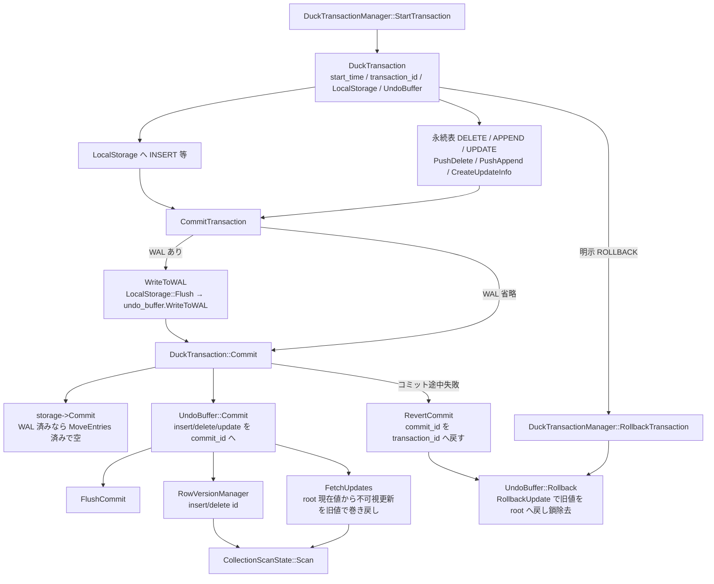

# 第30章 MVCC トランザクション

> **本章で読むソース**
>
> - [src/transaction/duck_transaction.cpp](https://github.com/duckdb/duckdb/blob/v1.5.4/src/transaction/duck_transaction.cpp)
> - [src/transaction/duck_transaction_manager.cpp](https://github.com/duckdb/duckdb/blob/v1.5.4/src/transaction/duck_transaction_manager.cpp)
> - [src/transaction/undo_buffer.cpp](https://github.com/duckdb/duckdb/blob/v1.5.4/src/transaction/undo_buffer.cpp)
> - [src/transaction/commit_state.cpp](https://github.com/duckdb/duckdb/blob/v1.5.4/src/transaction/commit_state.cpp)
> - [src/transaction/rollback_state.cpp](https://github.com/duckdb/duckdb/blob/v1.5.4/src/transaction/rollback_state.cpp)
> - [src/storage/local_storage.cpp](https://github.com/duckdb/duckdb/blob/v1.5.4/src/storage/local_storage.cpp)
> - [src/storage/table/row_version_manager.cpp](https://github.com/duckdb/duckdb/blob/v1.5.4/src/storage/table/row_version_manager.cpp)
> - [src/storage/table/chunk_info.cpp](https://github.com/duckdb/duckdb/blob/v1.5.4/src/storage/table/chunk_info.cpp)
> - [src/storage/table/scan_state.cpp](https://github.com/duckdb/duckdb/blob/v1.5.4/src/storage/table/scan_state.cpp)
> - [src/storage/table/update_segment.cpp](https://github.com/duckdb/duckdb/blob/v1.5.4/src/storage/table/update_segment.cpp)
> - [src/include/duckdb/transaction/update_info.hpp](https://github.com/duckdb/duckdb/blob/v1.5.4/src/include/duckdb/transaction/update_info.hpp)

## この章の狙い

DuckDB の **MVCC** は、行ごとの insert/delete ID、列ごとの更新版鎖（`UpdateInfo`）、トランザクション局所の変更バッファで成り立つ。
本章では `DuckTransaction` と `DuckTransactionManager` の開始、コミット、ロールバックを追い、可視性が `RowVersionManager` と `UpdateSegment` 経由でスキャンにどう効くかを説明する。

## 前提

第26章で見た `RowVersionManager` と `CollectionScanState` が、永続側の行版を保持する。
第28章の WAL は、コミット時に undo から書き出す経路の先にある。
カタログ自体の版は第31章で扱う。

## トランザクションの生成

`DuckTransaction` は `start_time`、`transaction_id`、undo バッファ、**LocalStorage** をコンストラクタで持つ。
`LocalStorage` は `unique_ptr` で所有し、未コミットの表変更をトランザクション内に閉じる。

[src/transaction/duck_transaction.cpp L32-L60](https://github.com/duckdb/duckdb/blob/v1.5.4/src/transaction/duck_transaction.cpp#L32-L60)

```cpp
DuckTransaction::DuckTransaction(DuckTransactionManager &manager, ClientContext &context_p, transaction_t start_time,
                                 transaction_t transaction_id, idx_t catalog_version_p)
    : Transaction(manager, context_p), start_time(start_time), transaction_id(transaction_id), commit_id(0),
      catalog_version(catalog_version_p), awaiting_cleanup(false), undo_buffer(*this, context_p),
      storage(make_uniq<LocalStorage>(context_p, *this)) {
}

DuckTransaction::~DuckTransaction() {
}

DuckTransaction &DuckTransaction::Get(ClientContext &context, AttachedDatabase &db) {
	return DuckTransaction::Get(context, db.GetCatalog());
}

DuckTransaction &DuckTransaction::Get(ClientContext &context, Catalog &catalog) {
	auto &transaction = Transaction::Get(context, catalog);
	if (!transaction.IsDuckTransaction()) {
		throw InternalException("DuckTransaction::Get called on non-DuckDB transaction");
	}
	return transaction.Cast<DuckTransaction>();
}

DuckTransactionManager &DuckTransaction::GetTransactionManager() {
	return manager.Cast<DuckTransactionManager>();
}

LocalStorage &DuckTransaction::GetLocalStorage() {
	return *storage;
}
```

マネージャ側の開始は、タイムスタンプとトランザクション ID を単調増加で割り振る。
`current_transaction_id` は `TRANSACTION_ID_START` から始まり、コミット済みタイムスタンプより十分大きく保つ。
未コミットの ID が他トランザクションの `start_time` より小さくならないようにしている。

[src/transaction/duck_transaction_manager.cpp L63-L91](https://github.com/duckdb/duckdb/blob/v1.5.4/src/transaction/duck_transaction_manager.cpp#L63-L91)

```cpp
Transaction &DuckTransactionManager::StartTransaction(ClientContext &context) {
	// obtain the transaction lock during this function
	auto &meta_transaction = MetaTransaction::Get(context);
	unique_ptr<lock_guard<mutex>> start_lock;
	if (!meta_transaction.IsReadOnly()) {
		start_lock = make_uniq<lock_guard<mutex>>(start_transaction_lock);
	}
	lock_guard<mutex> lock(transaction_lock);
	if (current_start_timestamp >= TRANSACTION_ID_START) { // LCOV_EXCL_START
		throw InternalException("Cannot start more transactions, ran out of "
		                        "transaction identifiers!");
	} // LCOV_EXCL_STOP

	// obtain the start time and transaction ID of this transaction
	transaction_t start_time = current_start_timestamp++;
	transaction_t transaction_id = current_transaction_id++;
	if (active_transactions.empty()) {
		lowest_active_start = start_time;
		lowest_active_id = transaction_id;
	}

	// create the actual transaction
	auto transaction = make_uniq<DuckTransaction>(*this, context, start_time, transaction_id, last_committed_version);
	auto &transaction_ref = *transaction;

	// store it in the set of active transactions
	active_transactions.push_back(std::move(transaction));
	return transaction_ref;
}
```

永続表への delete / append は、まず undo エントリを積む。
`PushDelete` は連続行なら row id 配列を省略し、`PushAppend` は `AppendInfo` だけを残す。
いずれも失敗時の巻き戻しと、コミット時の版更新の材料になる。

[src/transaction/duck_transaction.cpp L90-L131](https://github.com/duckdb/duckdb/blob/v1.5.4/src/transaction/duck_transaction.cpp#L90-L131)

```cpp
void DuckTransaction::PushDelete(DataTable &table, RowVersionManager &info, idx_t vector_idx, row_t rows[], idx_t count,
                                 idx_t base_row) {
	ModifyTable(table);
	bool is_consecutive = true;
	// check if the rows are consecutive
	for (idx_t i = 0; i < count; i++) {
		if (rows[i] != row_t(i)) {
			is_consecutive = false;
			break;
		}
	}
	idx_t alloc_size = sizeof(DeleteInfo);
	if (!is_consecutive) {
		// if rows are not consecutive we need to allocate row identifiers
		alloc_size += sizeof(uint16_t) * count;
	}

	auto undo_entry = undo_buffer.CreateEntry(UndoFlags::DELETE_TUPLE, alloc_size);
	auto delete_info = reinterpret_cast<DeleteInfo *>(undo_entry.Ptr());
	delete_info->version_info = &info;
	delete_info->vector_idx = vector_idx;
	delete_info->table = &table;
	delete_info->count = count;
	delete_info->base_row = base_row;
	delete_info->is_consecutive = is_consecutive;
	if (!is_consecutive) {
		// if rows are not consecutive
		auto delete_rows = delete_info->GetRows();
		for (idx_t i = 0; i < count; i++) {
			delete_rows[i] = NumericCast<uint16_t>(rows[i]);
		}
	}
}

void DuckTransaction::PushAppend(DataTable &table, idx_t start_row, idx_t row_count) {
	ModifyTable(table);
	auto undo_entry = undo_buffer.CreateEntry(UndoFlags::INSERT_TUPLE, sizeof(AppendInfo));
	auto append_info = reinterpret_cast<AppendInfo *>(undo_entry.Ptr());
	append_info->table = &table;
	append_info->start_row = start_row;
	append_info->count = row_count;
}
```

## Undo バッファとロールバック payload

`UndoBuffer::CreateEntry` は、型フラグと長さをヘッダに書き、その後ろへ payload を置く。
アロケータは BufferManager 経由なので、大きな undo でも一時ブロックへ逃がせる。

[src/transaction/undo_buffer.cpp L21-L38](https://github.com/duckdb/duckdb/blob/v1.5.4/src/transaction/undo_buffer.cpp#L21-L38)

```cpp
constexpr uint32_t UNDO_ENTRY_HEADER_SIZE = sizeof(UndoFlags) + sizeof(uint32_t);

UndoBuffer::UndoBuffer(DuckTransaction &transaction_p, ClientContext &context_p)
    : transaction(transaction_p), allocator(DatabaseInstance::GetDatabase(context_p).GetBufferManager()) {
}

UndoBufferReference UndoBuffer::CreateEntry(UndoFlags type, idx_t len) {
	idx_t alloc_len = AlignValue<idx_t>(len + UNDO_ENTRY_HEADER_SIZE);
	auto handle = allocator.Allocate(alloc_len);
	auto data = handle.Ptr();
	// write the undo entry metadata
	Store<UndoFlags>(type, data);
	data += sizeof(UndoFlags);
	Store<uint32_t>(UnsafeNumericCast<uint32_t>(alloc_len - UNDO_ENTRY_HEADER_SIZE), data);
	// increment the position of the header past the undo entry metadata
	handle.position += UNDO_ENTRY_HEADER_SIZE;
	return handle;
}
```

コミットは挿入順に `CommitState` を走らせ、ロールバックは逆順に `RollbackState` を走らせる。
`RevertCommit` は、コミット途中で失敗したときに、すでに進めた版だけを戻すために使う。

[src/transaction/undo_buffer.cpp L189-L216](https://github.com/duckdb/duckdb/blob/v1.5.4/src/transaction/undo_buffer.cpp#L189-L216)

```cpp
void UndoBuffer::WriteToWAL(WriteAheadLog &wal, optional_ptr<StorageCommitState> commit_state) {
	WALWriteState state(transaction, wal, commit_state);
	UndoBuffer::IteratorState iterator_state;
	IterateEntries(iterator_state, [&](UndoFlags type, data_ptr_t data) { state.CommitEntry(type, data); });
}

void UndoBuffer::Commit(UndoBuffer::IteratorState &iterator_state, CommitInfo &info) {
	active_transaction_state = info.active_transactions;

	CommitState state(transaction, info.commit_id, active_transaction_state, CommitMode::COMMIT);
	IterateEntries(iterator_state, [&](UndoFlags type, data_ptr_t data) { state.CommitEntry(type, data); });

	state.Verify();
}

void UndoBuffer::RevertCommit(UndoBuffer::IteratorState &end_state, transaction_t transaction_id) {
	CommitState state(transaction, transaction_id, active_transaction_state, CommitMode::REVERT_COMMIT);
	UndoBuffer::IteratorState start_state;
	IterateEntries(start_state, end_state, [&](UndoFlags type, data_ptr_t data) { state.RevertCommit(type, data); });

	state.Verify();
}

void UndoBuffer::Rollback() {
	// rollback needs to be performed in reverse
	RollbackState state(transaction);
	ReverseIterateEntries([&](UndoFlags type, data_ptr_t data) { state.RollbackEntry(type, data); });
}
```

## LocalStorage とコミット本体

INSERT の多くは、まず `LocalStorage` 上の `RowGroupCollection` に積む。
コミット時の `Flush` は、表が空か十分な行があるときにストレージを直接 merge し、そうでなければ一度 Rollback したうえでインデックスと表へ逐次 append する。
最後に `PushAppend` で undo へ挿入範囲を残す。

[src/storage/local_storage.cpp L584-L652](https://github.com/duckdb/duckdb/blob/v1.5.4/src/storage/local_storage.cpp#L584-L652)

```cpp
void LocalStorage::Flush(DataTable &table, LocalTableStorage &storage, optional_ptr<StorageCommitState> commit_state) {
	if (storage.is_dropped) {
		return;
	}
	if (storage.GetCollection().GetTotalRows() <= storage.deleted_rows) {
		// all rows that we added were deleted
		// rollback any partial blocks that are still outstanding
		storage.Rollback();
		return;
	}

	auto append_count = storage.GetCollection().GetTotalRows() - storage.deleted_rows;
	const auto row_group_size = storage.GetCollection().GetRowGroupSize();

	TableAppendState append_state;
	table.AppendLock(transaction, append_state);
	if ((append_state.row_start == 0 || storage.GetCollection().GetTotalRows() >= row_group_size) &&
	    storage.deleted_rows == 0) {
		// table is currently empty OR we are bulk appending: move over the storage directly
		// first flush any outstanding blocks
		storage.FlushBlocks();
		// Append to the indexes.
		storage.AppendToIndexes(transaction, append_state);
		// finally move over the row groups
		table.MergeStorage(storage.GetCollection(), commit_state);
	} else {
		// check if we have written data
		// if we have, we cannot merge to disk after all
		// so we need to revert the data we have already written
		storage.Rollback();
		// append to the indexes
		storage.AppendToIndexes(transaction, append_state);
		// after that is successful - append to the table
		storage.AppendToTable(transaction, append_state);
	}
	transaction.PushAppend(table, NumericCast<idx_t>(append_state.row_start), append_count);

#ifdef DEBUG
	// Verify that our index memory is stable.
	table.VerifyIndexBuffers();
#endif
}

void LocalStorage::Commit(optional_ptr<StorageCommitState> commit_state) {
	// commit local storage
	// iterate over all entries in the table storage map and commit them
	// after this, the local storage is no longer required and can be cleared
	auto table_storage = table_manager.MoveEntries();
	for (auto &entry : table_storage) {
		auto table = entry.first;
		auto storage = entry.second.get();
		Flush(table, *storage, commit_state);
		entry.second.reset();
	}
}

void LocalStorage::Rollback() {
	// rollback local storage
	// after this, the local storage is no longer required and can be cleared
	auto table_storage = table_manager.MoveEntries();
	for (auto &entry : table_storage) {
		auto storage = entry.second.get();
		if (!storage) {
			continue;
		}
		storage->Rollback();
		entry.second.reset();
	}
}
```

`LocalStorage::Commit` は `table_manager.MoveEntries()` で表ごとの局所ストレージを取り出し、各々 `Flush` する。
一度 Move するとマップは空になる。
したがって `storage->Commit` を二度呼んでも、二度目のループは何も flush しない。

コミット経路は WAL の有無で分岐する。

通常の WAL 経路では、マネージャが先に `DuckTransaction::WriteToWAL` を呼ぶ。
ここで `storage->Commit`（つまり LocalStorage の materialize / `Flush`）が走り、`PushAppend` で undo へ挿入範囲が載ったあと、`undo_buffer.WriteToWAL` がその undo を WAL へ直列化する。

[src/transaction/duck_transaction.cpp L214-L253](https://github.com/duckdb/duckdb/blob/v1.5.4/src/transaction/duck_transaction.cpp#L214-L253)

```cpp
ErrorData DuckTransaction::WriteToWAL(ClientContext &context, AttachedDatabase &db,
                                      unique_ptr<StorageCommitState> &commit_state) noexcept {
	ErrorData error_data;
	try {
		D_ASSERT(ShouldWriteToWAL(db));
		auto &storage_manager = db.GetStorageManager();
		auto wal = storage_manager.GetWAL();
		commit_state = storage_manager.GenStorageCommitState(*wal);

		auto &profiler = *context.client_data->profiler;
		auto commit_timer = profiler.StartTimer(MetricType::COMMIT_LOCAL_STORAGE_LATENCY);
		storage->Commit(commit_state.get());
		commit_timer.EndTimer();

		auto wal_timer = profiler.StartTimer(MetricType::WRITE_TO_WAL_LATENCY);
		undo_buffer.WriteToWAL(*wal, commit_state.get());
		if (commit_state->HasRowGroupData()) {
			// if we have optimistically written any data AND we are writing to the WAL, we have written references to
			// optimistically written blocks
			// hence we need to ensure those optimistically written blocks are persisted
			storage_manager.GetBlockManager().FileSync();
		}
		wal_timer.EndTimer();

	} catch (std::exception &ex) {
		// Call RevertCommit() outside this try-catch as it itself may throw
		error_data = ErrorData(ex);
	}

	if (commit_state && error_data.HasError()) {
		try {
			commit_state->RevertCommit();
			commit_state.reset();
		} catch (std::exception &) {
			// Ignore this error. If we fail to RevertCommit(), just return the original exception
		}
	}

	return error_data;
}
```

その後マネージャが commit ID を採番し、`DuckTransaction::Commit` に入る。
ここでも `storage->Commit` を呼ぶが、WAL 経路ではすでに `MoveEntries` 済みなので実質空である。
本体は `undo_buffer.Commit` で各版を `commit_id` へ確定し、最後に `commit_state->FlushCommit` で WAL を確定する。
例外時は `RevertCommit` と WAL の truncate で元に戻す。

WAL を省略する経路（チェックポイントへ寄せる場合や、そもそも WAL 対象外の DB）では、`WriteToWAL` が走らない。
そのとき LocalStorage の flush は `DuckTransaction::Commit` 内の `storage->Commit` が初めて担う。
順序は「materialize →（任意で）undo/WAL 直列化 → commit_id 確定 → FlushCommit」であり、WAL ありでは前半二つが `WriteToWAL` 側に寄る。

[src/transaction/duck_transaction.cpp L255-L294](https://github.com/duckdb/duckdb/blob/v1.5.4/src/transaction/duck_transaction.cpp#L255-L294)

```cpp
ErrorData DuckTransaction::Commit(AttachedDatabase &db, CommitInfo &commit_info,
                                  unique_ptr<StorageCommitState> commit_state) noexcept {
	this->commit_id = commit_info.commit_id;
	if (!ChangesMade()) {
		// no need to flush anything if we made no changes
		return ErrorData();
	}
	D_ASSERT(db.IsSystem() || db.IsTemporary() || !IsReadOnly());

	UndoBuffer::IteratorState iterator_state;
	try {
		storage->Commit(commit_state.get());
		undo_buffer.Commit(iterator_state, commit_info);
		// if (DebugForceAbortCommit()) {
		// 	throw InvalidInputException("Force revert");
		// }
		if (commit_state) {
			// if we have written to the WAL - flush after the commit has been successful
			commit_state->FlushCommit();
		}
		return ErrorData();
	} catch (std::exception &ex) {
		undo_buffer.RevertCommit(iterator_state, this->transaction_id);
		if (commit_state) {
			// if we have written to the WAL - truncate the WAL on failure
			commit_state->RevertCommit();
		}
		return ErrorData(ex);
	}
}

ErrorData DuckTransaction::Rollback() {
	try {
		storage->Rollback();
		undo_buffer.Rollback();
		return ErrorData();
	} catch (std::exception &ex) {
		return ErrorData(ex);
	}
}
```

マネージャの `CommitTransaction` は、チェックポイント可否、WAL 書き込み、commit ID 採番、実際の `Commit`、失敗時のロールバック、アクティブ集合からの除去を一本の経路で束ねる。
WAL 書き込み中はトランザクションロックを一度外し、読み取り専用トランザクションが並行開始できるようにしている。

[src/transaction/duck_transaction_manager.cpp L303-L415](https://github.com/duckdb/duckdb/blob/v1.5.4/src/transaction/duck_transaction_manager.cpp#L303-L415)

```cpp
ErrorData DuckTransactionManager::CommitTransaction(ClientContext &context, Transaction &transaction_p) {
	auto &transaction = transaction_p.Cast<DuckTransaction>();
	unique_lock<mutex> t_lock(transaction_lock);
	if (!db.IsSystem() && !db.IsTemporary()) {
		if (transaction.ChangesMade()) {
			if (transaction.IsReadOnly()) {
				throw InternalException("Attempting to commit a transaction that is read-only but has made changes - "
				                        "this should not be possible");
			}
		}
	}

	// check if we can checkpoint
	unique_ptr<StorageLockKey> lock;
	auto undo_properties = transaction.GetUndoProperties();
	auto checkpoint_decision = CanCheckpoint(transaction, lock, undo_properties);
	ErrorData error;
	unique_ptr<lock_guard<mutex>> held_wal_lock;
	unique_ptr<StorageCommitState> commit_state;
	bool skip_wal_write_due_to_checkpoint = false;
	if (checkpoint_decision.can_checkpoint) {
		// we can perform an automatic checkpoint
		// we have two options:
		// either we write to the WAL, in which case we can perform concurrent commits while running
		// OR we skip writing to the WAL, in which case we cannot perform concurrent commits
		// the reason for this is that if we don't write this transactions' changes to the WAL
		// any failure during checkpoint will cause this transactions' changes to be lost,
		// while later concurrent commits will not be
		// this can cause undefined state, as those commits were made assuming this one was already committed
		if (undo_properties.estimated_size >= Settings::Get<AutoCheckpointSkipWalThresholdSetting>(context)) {
			skip_wal_write_due_to_checkpoint = true;
		}
	}
	bool should_write_to_wal = transaction.ShouldWriteToWAL(db);
	if (should_write_to_wal) {
		auto &storage_manager = db.GetStorageManager().Cast<SingleFileStorageManager>();
		// if we are committing changes and we are not doing a "checkpoint instead of WAL write"
		// we need to write to the WAL to make the changes durable
		// since WAL writes can take a long time - we grab the WAL lock here and unlock the transaction lock
		// read-only transactions can bypass this branch and start/commit while the WAL write is happening
		// unlock the transaction lock while we write to the WAL
		// note: we can only drop the transaction lock if we are NOT checkpointing
		// if we are checkpointing, we have already made certain decisions (e.g. the CheckpointType)
		t_lock.unlock();
		// grab the WAL lock and hold it until the entire commit is finished
		held_wal_lock = storage_manager.GetWALLock();

		// Commit the changes to the WAL.
		if (!skip_wal_write_due_to_checkpoint) {
			error = transaction.WriteToWAL(context, db, commit_state);
		}

		// after we finish writing to the WAL we grab the transaction lock again
		t_lock.lock();
	}
	// ... (中略) ...
	// obtain a commit id for the transaction
	CommitInfo info;
	info.commit_id = GetCommitTimestamp();

	// commit the UndoBuffer of the transaction
	if (!error.HasError()) {
		if (HasOtherTransactions(transaction)) {
			info.active_transactions = ActiveTransactionState::OTHER_TRANSACTIONS;
		} else {
			info.active_transactions = ActiveTransactionState::NO_OTHER_TRANSACTIONS;
		}
		error = transaction.Commit(db, info, std::move(commit_state));
	}

	if (error.HasError()) {
		DUCKDB_LOG(context, TransactionLogType, db, "Rollback (after failed commit)", info.commit_id);

		// COMMIT not successful: ROLLBACK.
		checkpoint_decision = CheckpointDecision(error.Message());
		transaction.commit_id = 0;

		auto rollback_error = transaction.Rollback();
		if (rollback_error.HasError()) {
			throw FatalException(
			    "Failed to rollback transaction. Cannot continue operation.\nOriginal Error: %s\nRollback Error: %s",
			    error.Message(), rollback_error.Message());
		}
	} else {
		DUCKDB_LOG(context, TransactionLogType, db, "Commit", info.commit_id);
		last_commit = info.commit_id;

		// check if catalog changes were made
		if (transaction.catalog_version >= TRANSACTION_ID_START) {
			transaction.catalog_version = ++last_committed_version;
		}
	}
```

中略は、チェックポイント種別の再判定とインメモリ向けの WAL サイズ加算である。
成功後はアクティブ集合から外し、必要なら自動チェックポイントへ進む。

## 更新版鎖（UpdateInfo / UpdateSegment）

第26章で見た `UpdateSegment` は、ベース segment の永続バイト列を直接書き換えず、ベクタごとの `UpdateInfo` 鎖で現在値と旧値を持つ。
鎖の向きは「見える更新を結果へ重ねる」ではない。
root の dummy `UpdateInfo`（`version_number = TRANSACTION_ID_START - 1`）が常に適用される現在値を持ち、トランザクションの undo 上の `UpdateInfo` は、その更新が上書きする前の旧値を保持する。

`CreateUpdateInfo` は undo に `UPDATE_TUPLE` を確保し、`UpdateInfo::Initialize` が undo 側ノードの `version_number` に当該トランザクションの `transaction_id` を置く。

[src/transaction/duck_transaction.cpp L133-L140](https://github.com/duckdb/duckdb/blob/v1.5.4/src/transaction/duck_transaction.cpp#L133-L140)

```cpp
UndoBufferReference DuckTransaction::CreateUpdateInfo(idx_t type_size, DataTable &data_table, idx_t entries,
                                                      idx_t row_group_start) {
	idx_t alloc_size = UpdateInfo::GetAllocSize(type_size);
	auto undo_entry = undo_buffer.CreateEntry(UndoFlags::UPDATE_TUPLE, alloc_size);
	auto &update_info = UpdateInfo::Get(undo_entry);
	UpdateInfo::Initialize(update_info, data_table, transaction_id, row_group_start);
	return undo_entry;
}
```

[src/storage/table/update_segment.cpp L105-L114](https://github.com/duckdb/duckdb/blob/v1.5.4/src/storage/table/update_segment.cpp#L105-L114)

```cpp
void UpdateInfo::Initialize(UpdateInfo &info, DataTable &data_table, transaction_t transaction_id,
                            idx_t row_group_start) {
	info.max = STANDARD_VECTOR_SIZE;
	info.row_group_start = row_group_start;
	info.version_number = transaction_id;
	info.table = &data_table;
	info.segment = nullptr;
	info.prev.entry = nullptr;
	info.next.entry = nullptr;
}
```

初回更新では、segment 側 allocator に root を `TRANSACTION_ID_START - 1` で作り、undo 側に transaction ノードを作る。
`initialize_update_function` の第1引数が undo ノード、第3引数が root である。
中身は、root へ新値を書き、undo ノードへ `base_data`（上書き前）を退避する。
鎖は root の `next` が undo ノードを指し、undo の `prev` が root を指す。

[src/storage/table/update_segment.cpp L1376-L1408](https://github.com/duckdb/duckdb/blob/v1.5.4/src/storage/table/update_segment.cpp#L1376-L1408)

```cpp
	} else {
		// there is no version info yet: create the top level update info and fill it with the updates
		// allocate space for the UpdateInfo in the allocator
		idx_t alloc_size = UpdateInfo::GetAllocSize(type_size);
		auto handle = root->allocator.Allocate(alloc_size);
		auto &update_info = UpdateInfo::Get(handle);
		UpdateInfo::Initialize(update_info, data_table, TRANSACTION_ID_START - 1, row_group_start);
		update_info.column_index = column_index;

		InitializeUpdateInfo(update_info, ids, sel, count, vector_index, vector_offset);

		// now create the transaction level update info in the undo log
		unsafe_unique_array<char> update_info_data;
		UndoBufferReference node_ref;
		optional_ptr<UpdateInfo> transaction_node;
		if (transaction.transaction) {
			node_ref = transaction.transaction->CreateUpdateInfo(type_size, data_table, count, row_group_start);
			transaction_node = &UpdateInfo::Get(node_ref);
		} else {
			transaction_node =
			    CreateEmptyUpdateInfo(transaction, data_table, type_size, count, update_info_data, row_group_start);
		}

		InitializeUpdateInfo(*transaction_node, ids, sel, count, vector_index, vector_offset);

		// we write the updates in the update node data, and write the updates in the info
		initialize_update_function(*transaction_node, base_data, update_info, update_format, sel);

		update_info.next = transaction.transaction ? node_ref.GetBufferPointer() : UndoBufferPointer();
		update_info.prev = UndoBufferPointer();
		transaction_node->next = UndoBufferPointer();
		transaction_node->prev = handle.GetBufferPointer();
		transaction_node->column_index = column_index;
```

[src/storage/table/update_segment.cpp L705-L727](https://github.com/duckdb/duckdb/blob/v1.5.4/src/storage/table/update_segment.cpp#L705-L727)

```cpp
template <class T>
static void InitializeUpdateData(UpdateInfo &base_info, Vector &base_data, UpdateInfo &update_info,
                                 UnifiedVectorFormat &update, const SelectionVector &sel) {
	auto update_data = update.GetData<T>(update);
	auto tuple_data = update_info.GetData<T>();

	for (idx_t i = 0; i < update_info.N; i++) {
		auto idx = update.sel->get_index(sel.get_index(i));
		tuple_data[i] = update_data[idx];
	}

	auto base_array_data = FlatVector::GetData<T>(base_data);
	auto &base_validity = FlatVector::Validity(base_data);
	auto base_tuple_data = base_info.GetData<T>();
	auto base_tuples = base_info.GetTuples();
	for (idx_t i = 0; i < base_info.N; i++) {
		auto base_idx = base_tuples[i];
		if (!base_validity.RowIsValid(base_idx)) {
			continue;
		}
		base_tuple_data[i] = UpdateSelectElement::Operation<T>(*base_info.segment, base_array_data[base_idx]);
	}
}
```

走査時の入口は `UpdateSegment::FetchUpdates` である。
root から始め、`UpdatesForTransaction` が newest から oldest へ辿る。
`AppliesToTransaction` は root（dummy）を常に適用し、それ以外では `version_number > start_time` かつ自分の `transaction_id` ではないノードだけを選ぶ。
選ばれた undo ノードに載っているのは旧値なので、これを結果へ書くと「開始後にコミットされた更新」や「他者の未コミット更新」を打ち消し、snapshot 時点の値へ戻る。
自分の undo ノードは適用しないため、root に残った自分の最新値がそのまま見える。

[src/include/duckdb/transaction/update_info.hpp L60-L87](https://github.com/duckdb/duckdb/blob/v1.5.4/src/include/duckdb/transaction/update_info.hpp#L60-L87)

```cpp
	bool AppliesToTransaction(transaction_t start_time, transaction_t transaction_id) {
		// these tuples were either committed AFTER this transaction started or are not committed yet, use
		// tuples stored in this version
		if (version_number == TRANSACTION_ID_START - 1) {
			// dummy transaction number for the root element - should always match
			return true;
		}
		return version_number > start_time && version_number != transaction_id;
	}

	//! Loop over the update chain and execute the specified callback on all UpdateInfo's that are relevant for that
	//! transaction in-order of newest to oldest
	template <class T>
	static void UpdatesForTransaction(UpdateInfo &current, transaction_t start_time, transaction_t transaction_id,
	                                  T &&callback) {
		if (current.AppliesToTransaction(start_time, transaction_id)) {
			callback(current);
		}
		auto update_ptr = current.next;
		while (update_ptr.IsSet()) {
			auto pin = update_ptr.Pin();
			auto &info = Get(pin);
			if (info.AppliesToTransaction(start_time, transaction_id)) {
				callback(info);
			}
			update_ptr = info.next;
		}
	}
```

[src/storage/table/update_segment.cpp L159-L164](https://github.com/duckdb/duckdb/blob/v1.5.4/src/storage/table/update_segment.cpp#L159-L164)

```cpp
template <class T>
static void UpdateMergeFetch(transaction_t start_time, transaction_t transaction_id, UpdateInfo &info, Vector &result) {
	auto result_data = FlatVector::GetData<T>(result);
	UpdateInfo::UpdatesForTransaction(info, start_time, transaction_id,
	                                  [&](UpdateInfo &current) { MergeUpdateInfo<T>(current, result_data); });
}
```

[src/storage/table/update_segment.cpp L214-L224](https://github.com/duckdb/duckdb/blob/v1.5.4/src/storage/table/update_segment.cpp#L214-L224)

```cpp
void UpdateSegment::FetchUpdates(TransactionData transaction, idx_t vector_index, Vector &result) {
	auto lock_handle = lock.GetSharedLock();
	auto node = GetUpdateNode(*lock_handle, vector_index);
	if (!node.IsSet()) {
		return;
	}
	// FIXME: normalify if this is not the case... need to pass in count?
	D_ASSERT(result.GetVectorType() == VectorType::FLAT_VECTOR);
	auto pin = node.Pin();
	fetch_update_function(transaction.start_time, transaction.transaction_id, UpdateInfo::Get(pin), result);
}
```

更新を入れる直前の競合検査は `CheckForConflicts` が担う。
鎖上の各 `UpdateInfo` について、自分の版ならノード参照を残し、自 `start_time` より新しい他版ならソート済み行 ID をマージ照合し、同一行があれば `TransactionException` を投げる。

[src/storage/table/update_segment.cpp L606-L640](https://github.com/duckdb/duckdb/blob/v1.5.4/src/storage/table/update_segment.cpp#L606-L640)

```cpp
static void CheckForConflicts(UndoBufferPointer next_ptr, TransactionData transaction, row_t *ids,
                              const SelectionVector &sel, idx_t count, row_t offset, UndoBufferReference &node_ref) {
	while (next_ptr.IsSet()) {
		auto pin = next_ptr.Pin();
		auto &info = UpdateInfo::Get(pin);
		if (info.version_number == transaction.transaction_id) {
			// this UpdateInfo belongs to the current transaction, set it in the node
			node_ref = std::move(pin);
		} else if (info.version_number > transaction.start_time) {
			// potential conflict, check that tuple ids do not conflict
			// as both ids and info->tuples are sorted, this is similar to a merge join
			idx_t i = 0, j = 0;
			auto tuples = info.GetTuples();
			while (true) {
				auto id = ids[sel.get_index(i)] - offset;
				if (id == tuples[j]) {
					throw TransactionException("Conflict on update!");
				} else if (id < tuples[j]) {
					// id < the current tuple in info, move to next id
					i++;
					if (i == count) {
						break;
					}
				} else {
					// id > the current tuple, move to next tuple in info
					j++;
					if (j == info.N) {
						break;
					}
				}
			}
		}
		next_ptr = info.next;
	}
}
```

コミットと、その途中失敗の戻しは `CommitState` が担う。
`UPDATE_TUPLE` のコミットは undo ノードの `version_number` を `commit_id` へ書き換えるだけである。
`RevertCommit` は、すでに `commit_id` へ進めた版を、コミット前の `transaction_id` へ戻す処理であり、値の中身は動かさない。

[src/transaction/commit_state.cpp L282-L293](https://github.com/duckdb/duckdb/blob/v1.5.4/src/transaction/commit_state.cpp#L282-L293)

```cpp
	case UndoFlags::UPDATE_TUPLE: {
		// update:
		auto info = reinterpret_cast<UpdateInfo *>(data);
		if (!info->table->IsMainTable()) {
			auto table_name = info->table->GetTableName();
			auto table_modification = info->table->TableModification();
			throw TransactionException("Attempting to modify table %s but another transaction has %s this table",
			                           table_name, table_modification);
		}
		info->version_number = commit_id;
		break;
	}
```

[src/transaction/commit_state.cpp L336-L341](https://github.com/duckdb/duckdb/blob/v1.5.4/src/transaction/commit_state.cpp#L336-L341)

```cpp
	case UndoFlags::UPDATE_TUPLE: {
		// update:
		auto info = reinterpret_cast<UpdateInfo *>(data);
		info->version_number = transaction_id;
		break;
	}
```

通常の transaction rollback はこれとは別経路である。
`UndoBuffer::Rollback` は逆順に `RollbackState::RollbackEntry` を呼び、`UPDATE_TUPLE` では `UpdateSegment::RollbackUpdate` へ渡す。
`RollbackUpdate` は undo ノードに退避していた旧値を root の現在値へ戻し、`CleanupUpdateInternal` でそのノードを鎖から外す。

[src/transaction/rollback_state.cpp L41-L45](https://github.com/duckdb/duckdb/blob/v1.5.4/src/transaction/rollback_state.cpp#L41-L45)

```cpp
	case UndoFlags::UPDATE_TUPLE: {
		auto info = reinterpret_cast<UpdateInfo *>(data);
		info->segment->RollbackUpdate(*info);
		break;
	}
```

[src/storage/table/update_segment.cpp L564-L578](https://github.com/duckdb/duckdb/blob/v1.5.4/src/storage/table/update_segment.cpp#L564-L578)

```cpp
void UpdateSegment::RollbackUpdate(UpdateInfo &info) {
	// obtain an exclusive lock
	auto lock_handle = lock.GetExclusiveLock();

	// move the data from the UpdateInfo back into the base info
	auto entry = GetUpdateNode(*lock_handle, info.vector_index);
	if (!entry.IsSet()) {
		return;
	}
	auto pin = entry.Pin();
	rollback_update_function(UpdateInfo::Get(pin), info);

	// clean up the update chain
	CleanupUpdateInternal(*lock_handle, info);
}
```

行の生死は `RowVersionManager` の insert/delete ID、列値の版は `UpdateSegment` の現在値 root と旧値 undo 鎖、という分担になる。

## 可視性

行版の入口は `RowVersionManager` である。
スキャンは `GetSelVector`、点取得は `Fetch` を呼ぶ。
版情報がないベクタは、すべて可視とみなしてそのまま返す。

[src/storage/table/row_version_manager.cpp L38-L56](https://github.com/duckdb/duckdb/blob/v1.5.4/src/storage/table/row_version_manager.cpp#L38-L56)

```cpp
idx_t RowVersionManager::GetSelVector(ScanOptions options, idx_t vector_idx, SelectionVector &sel_vector,
                                      idx_t max_count) {
	lock_guard<mutex> l(version_lock);
	auto chunk_info = GetChunkInfo(vector_idx);
	if (!chunk_info) {
		return max_count;
	}
	return chunk_info->GetSelVector(options, sel_vector, max_count);
}

bool RowVersionManager::Fetch(TransactionData transaction, idx_t row) {
	lock_guard<mutex> lock(version_lock);
	idx_t vector_index = row / STANDARD_VECTOR_SIZE;
	auto info = GetChunkInfo(vector_index);
	if (!info) {
		return true;
	}
	return info->Fetch(transaction, UnsafeNumericCast<row_t>(row - vector_index * STANDARD_VECTOR_SIZE));
}
```

append 時は、ベクタ全体なら `ChunkConstantInfo`、部分なら `ChunkVectorInfo` に `transaction_id` を書き込む。
コミットでその ID が commit timestamp へ置き換わる。

[src/storage/table/row_version_manager.cpp L68-L125](https://github.com/duckdb/duckdb/blob/v1.5.4/src/storage/table/row_version_manager.cpp#L68-L125)

```cpp
void RowVersionManager::AppendVersionInfo(TransactionData transaction, idx_t count, idx_t row_group_start,
                                          idx_t row_group_end) {
	lock_guard<mutex> lock(version_lock);
	idx_t start_vector_idx = row_group_start / STANDARD_VECTOR_SIZE;
	idx_t end_vector_idx = (row_group_end - 1) / STANDARD_VECTOR_SIZE;

	// fill-up vector_info
	FillVectorInfo(end_vector_idx);

	// insert the version info nodes
	for (idx_t vector_idx = start_vector_idx; vector_idx <= end_vector_idx; vector_idx++) {
		idx_t vector_start =
		    vector_idx == start_vector_idx ? row_group_start - start_vector_idx * STANDARD_VECTOR_SIZE : 0;
		idx_t vector_end =
		    vector_idx == end_vector_idx ? row_group_end - end_vector_idx * STANDARD_VECTOR_SIZE : STANDARD_VECTOR_SIZE;
		if (vector_start == 0 && vector_end == STANDARD_VECTOR_SIZE) {
			// entire vector is encapsulated by append: append a single constant
			auto constant_info = make_uniq<ChunkConstantInfo>(vector_idx * STANDARD_VECTOR_SIZE);
			constant_info->insert_id = transaction.transaction_id;
			constant_info->delete_id = NOT_DELETED_ID;
			vector_info[vector_idx] = std::move(constant_info);
		} else {
			// part of a vector is encapsulated: append to that part
			optional_ptr<ChunkVectorInfo> new_info;
			if (!vector_info[vector_idx]) {
				// first time appending to this vector: create new info
				auto insert_info = make_uniq<ChunkVectorInfo>(allocator, vector_idx * STANDARD_VECTOR_SIZE);
				new_info = insert_info.get();
				vector_info[vector_idx] = std::move(insert_info);
			} else if (vector_info[vector_idx]->type == ChunkInfoType::VECTOR_INFO) {
				// use existing vector
				new_info = &vector_info[vector_idx]->Cast<ChunkVectorInfo>();
			} else {
				throw InternalException("Error in RowVersionManager::AppendVersionInfo - expected either a "
				                        "ChunkVectorInfo or no version info");
			}
			new_info->Append(vector_start, vector_end, transaction.transaction_id);
		}
	}
}

void RowVersionManager::CommitAppend(transaction_t commit_id, idx_t row_group_start, idx_t count) {
	if (count == 0) {
		return;
	}
	idx_t row_group_end = row_group_start + count;

	lock_guard<mutex> lock(version_lock);
	idx_t start_vector_idx = row_group_start / STANDARD_VECTOR_SIZE;
	idx_t end_vector_idx = (row_group_end - 1) / STANDARD_VECTOR_SIZE;
	for (idx_t vector_idx = start_vector_idx; vector_idx <= end_vector_idx; vector_idx++) {
		idx_t vstart = vector_idx == start_vector_idx ? row_group_start - start_vector_idx * STANDARD_VECTOR_SIZE : 0;
		idx_t vend =
		    vector_idx == end_vector_idx ? row_group_end - end_vector_idx * STANDARD_VECTOR_SIZE : STANDARD_VECTOR_SIZE;
		auto &info = *vector_info[vector_idx];
		info.CommitAppend(commit_id, vstart, vend);
	}
}
```

可視性判定そのものは `chunk_info.cpp` にある。
標準規則は「insert_id が自分の `transaction_id`、または自分の `start_time` より小さい」かつ「delete_id がそのどちらでもない」である。
他トランザクションの未コミット ID（`TRANSACTION_ID_START` 以上）は、通常のスキャンでは見えない。

[src/storage/table/chunk_info.cpp L12-L45](https://github.com/duckdb/duckdb/blob/v1.5.4/src/storage/table/chunk_info.cpp#L12-L45)

```cpp
struct StandardInsertOperator {
	static bool UseInsertedVersion(transaction_t start_time, transaction_t transaction_id, transaction_t id) {
		return id < start_time || id == transaction_id;
	}
};

struct IncludeAllInsertedOperator {
	static bool UseInsertedVersion(transaction_t start_time, transaction_t transaction_id, transaction_t id) {
		return true;
	}
};

struct StandardDeleteOperator {
	static bool IsDeleted(transaction_t start_time, transaction_t transaction_id, transaction_t id) {
		return StandardInsertOperator::UseInsertedVersion(start_time, transaction_id, id);
	}
};

struct CommittedDeleteOperator {
	static bool IsDeleted(transaction_t min_start_time, transaction_t min_transaction_id, transaction_t id) {
		// check if this row was deleted before the given start time
		return id < min_start_time;
	}
};

struct IncludeAllDeletedOperator {
	static bool IsDeleted(transaction_t min_start_time, transaction_t min_transaction_id, transaction_t id) {
		return false;
	}
};

static bool UseVersion(TransactionData transaction, transaction_t id) {
	return StandardInsertOperator::UseInsertedVersion(transaction.start_time, transaction.transaction_id, id);
}
```

スキャン経路では、`CollectionScanState::Scan` が `DuckTransaction` を `TransactionData` に包んで `RowGroup::Scan` へ渡す。
空チャンクが続くあいだ next row group へ進み、フィルされた結果だけを返す。

[src/storage/table/scan_state.cpp L220-L246](https://github.com/duckdb/duckdb/blob/v1.5.4/src/storage/table/scan_state.cpp#L220-L246)

```cpp
bool CollectionScanState::Scan(DuckTransaction &transaction, DataChunk &result) {
	while (row_group) {
		row_group->GetNode().Scan(TransactionData(transaction), *this, result);
		if (result.size() > 0) {
			return true;
		}
		if (max_row <= row_group->GetRowStart() + row_group->GetNode().count) {
			row_group = nullptr;
			return false;
		}
		do {
			row_group = GetNextRowGroup(*row_group).get();
			if (row_group) {
				if (row_group->GetRowStart() >= max_row) {
					row_group = nullptr;
					break;
				}
				bool scan_row_group = row_group->GetNode().InitializeScan(*this, *row_group);
				if (scan_row_group) {
					// scan this row group
					break;
				}
			}
		} while (row_group);
	}
	return false;
}
```

## 処理の流れ



## 高速化と最適化の工夫

ベクタ全体が同一トランザクションの append なら `ChunkConstantInfo` ひとつで足り、行ごとの insert/delete 配列を持たない。
古いコミット済み append は `CleanupAppend` で版ノードごと捨てられるため、定常状態のフルスキャンは版検査なしで `max_count` を返す経路へ寄る。
コミット時に変更が十分大きいと WAL を飛ばしてチェックポイントへ寄せ、追記 I/O を一回の直列化にまとめられる。
更新競合検査はソート済み行 ID のマージで行い、鎖の長さに対して線形に衝突行だけを見つける。

## まとめ

MVCC の単位は「トランザクション局所の LocalStorage」「永続行の insert/delete ID」「列更新の `UpdateInfo` 鎖（root の現在値と undo の旧値）」である。
通常の WAL コミットでは LocalStorage の materialize と undo の WAL 直列化が `WriteToWAL` で先に走り、その後の `Commit` が commit_id 確定と `FlushCommit` を担う。
WAL 省略時だけ `Commit` 内が初めて flush する。
行の可視性は `id < start_time || id == transaction_id` で決まり、更新値は root の現在値から始めて不可視ノードの旧値で snapshot へ巻き戻す。
通常 rollback は `RollbackUpdate` で旧値を root へ戻して鎖から外し、`RevertCommit` はコミット途中失敗時に `version_number` だけを `transaction_id` へ戻す。
マネージャは WAL とチェックポイントをコミット経路に織り込むが、可視性判定そのものは行版と更新版鎖の側に閉じている。

## 関連する章

- [第26章 row group と列データ](../part05-storage/26-row-group-column.md)
- [第28章 WAL とチェックポイント](../part05-storage/28-wal-checkpoint.md)
- [第31章 カタログと依存関係](./31-catalog.md)
