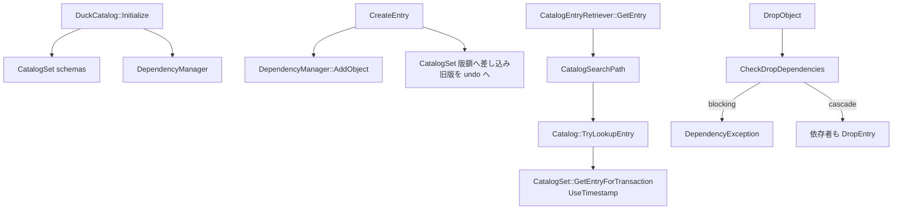

# 第31章 カタログと依存関係

> **本章で読むソース**
>
> - [src/catalog/duck_catalog.cpp](https://github.com/duckdb/duckdb/blob/v1.5.4/src/catalog/duck_catalog.cpp)
> - [src/catalog/catalog.cpp](https://github.com/duckdb/duckdb/blob/v1.5.4/src/catalog/catalog.cpp)
> - [src/catalog/catalog_set.cpp](https://github.com/duckdb/duckdb/blob/v1.5.4/src/catalog/catalog_set.cpp)
> - [src/catalog/dependency_manager.cpp](https://github.com/duckdb/duckdb/blob/v1.5.4/src/catalog/dependency_manager.cpp)
> - [src/catalog/catalog_entry_retriever.cpp](https://github.com/duckdb/duckdb/blob/v1.5.4/src/catalog/catalog_entry_retriever.cpp)
> - [src/catalog/catalog_search_path.cpp](https://github.com/duckdb/duckdb/blob/v1.5.4/src/catalog/catalog_search_path.cpp)

## この章の狙い

DuckDB のカタログは、スキーマ集合を `CatalogSet` で版管理し、依存は `DependencyManager` が別テーブルとして持つ。
本章では `DuckCatalog` の所有関係から、作成と可視性、名前解決、依存検査までを追う。

## 前提

第30章のトランザクション ID と `start_time` が、カタログエントリの `timestamp` 比較にも使われる。
第7章のバインダは、ここで見る `CatalogEntryRetriever` 経由で名前を拾う。
組み込み関数の登録は第32章で続ける。

## DuckCatalog の所有

`DuckCatalog` は `DependencyManager` と、スキーマ用の `CatalogSet` を `unique_ptr` で所有する。
システムカタログだけ `DefaultSchemaGenerator` をセットに載せる。

[src/catalog/duck_catalog.cpp L16-L46](https://github.com/duckdb/duckdb/blob/v1.5.4/src/catalog/duck_catalog.cpp#L16-L46)

```cpp
DuckCatalog::DuckCatalog(AttachedDatabase &db)
    : Catalog(db), dependency_manager(make_uniq<DependencyManager>(*this)),
      schemas(make_uniq<CatalogSet>(*this, IsSystemCatalog() ? make_uniq<DefaultSchemaGenerator>(*this) : nullptr)) {
}

DuckCatalog::~DuckCatalog() {
}

void DuckCatalog::Initialize(bool load_builtin) {
	// first initialize the base system catalogs
	// these are never written to the WAL
	// we start these at 1 because deleted entries default to 0
	auto data = CatalogTransaction::GetSystemTransaction(GetDatabase());

	// create the default schema
	CreateSchemaInfo info;
	info.schema = DEFAULT_SCHEMA;
	info.internal = true;
	info.on_conflict = OnCreateConflict::IGNORE_ON_CONFLICT;
	CreateSchema(data, info);

	if (load_builtin) {
		BuiltinFunctions builtin(data, *this);
		builtin.Initialize();

		// initialize default functions
		FunctionList::RegisterFunctions(*this, data);
	}

	Verify();
}
```

スキーマ作成は `DuckSchemaEntry` を作り、`schemas->CreateEntry` へ渡す。
衝突時は ERROR / REPLACE / IGNORE を `on_conflict` で切り替える。

[src/catalog/duck_catalog.cpp L59-L100](https://github.com/duckdb/duckdb/blob/v1.5.4/src/catalog/duck_catalog.cpp#L59-L100)

```cpp
optional_ptr<CatalogEntry> DuckCatalog::CreateSchemaInternal(CatalogTransaction transaction, CreateSchemaInfo &info) {
	LogicalDependencyList dependencies;

	if (!info.internal && DefaultSchemaGenerator::IsDefaultSchema(info.schema)) {
		return nullptr;
	}
	auto entry = make_uniq<DuckSchemaEntry>(*this, info);
	auto result = entry.get();
	if (!schemas->CreateEntry(transaction, info.schema, std::move(entry), dependencies)) {
		return nullptr;
	}
	return result;
}

optional_ptr<CatalogEntry> DuckCatalog::CreateSchema(CatalogTransaction transaction, CreateSchemaInfo &info) {
	D_ASSERT(!info.schema.empty());
	auto result = CreateSchemaInternal(transaction, info);
	if (!result) {
		switch (info.on_conflict) {
		case OnCreateConflict::ERROR_ON_CONFLICT:
			throw CatalogException::EntryAlreadyExists(CatalogType::SCHEMA_ENTRY, info.schema);
		case OnCreateConflict::REPLACE_ON_CONFLICT: {
			DropInfo drop_info;
			drop_info.type = CatalogType::SCHEMA_ENTRY;
			drop_info.catalog = info.catalog;
			drop_info.name = info.schema;
			DropSchema(transaction, drop_info);
			result = CreateSchemaInternal(transaction, info);
			if (!result) {
				throw InternalException("Failed to create schema entry in CREATE_OR_REPLACE");
			}
			break;
		}
		case OnCreateConflict::IGNORE_ON_CONFLICT:
			break;
		default:
			throw InternalException("Unsupported OnCreateConflict for CreateSchema");
		}
		return nullptr;
	}
	return result;
}
```

## CatalogSet の版鎖

エントリ作成は、依存登録のあとカタログ全体の write lock とセットの read lock を取り、鎖へ差し込む。
旧版は undo へ押し、ロールバックで鎖を戻せるようにする。
`timestamp` には作成トランザクションの ID が入る。

[src/catalog/catalog_set.cpp L169-L210](https://github.com/duckdb/duckdb/blob/v1.5.4/src/catalog/catalog_set.cpp#L169-L210)

```cpp
bool CatalogSet::CreateEntryInternal(CatalogTransaction transaction, const string &name, unique_ptr<CatalogEntry> value,
                                     unique_lock<mutex> &read_lock, bool should_be_empty) {
	auto entry_value = map.GetEntry(name);
	if (!entry_value) {
		// Add a dummy node to start the chain
		if (!StartChain(transaction, name, read_lock)) {
			return false;
		}
	} else if (should_be_empty) {
		// Verify that the entry is deleted, not altered by another transaction
		if (!VerifyVacancy(transaction, *entry_value)) {
			return false;
		}
	}

	// Finally add the new entry to the chain
	auto value_ptr = value.get();
	map.UpdateEntry(std::move(value));
	// Push the old entry in the undo buffer for this transaction, so it can be restored in the event of failure
	if (transaction.transaction) {
		DuckTransactionManager::Get(GetCatalog().GetAttached())
		    .PushCatalogEntry(*transaction.transaction, value_ptr->Child());
	}
	return true;
}

bool CatalogSet::CreateEntry(CatalogTransaction transaction, const string &name, unique_ptr<CatalogEntry> value,
                             const LogicalDependencyList &dependencies) {
	CheckCatalogEntryInvariants(*value, name);

	// Mark this entry as being created by the current active transaction
	value->timestamp = transaction.transaction_id;
	value->set = this;
	catalog.GetDependencyManager()->AddObject(transaction, *value, dependencies);

	// lock the catalog for writing
	lock_guard<mutex> write_lock(catalog.GetWriteLock());
	// lock this catalog set to disallow reading
	unique_lock<mutex> read_lock(catalog_lock);

	return CreateEntryInternal(transaction, name, std::move(value), read_lock);
}
```

読み取りは、鎖を先頭から辿り、見える版を選ぶ。
`UseTimestamp` は「自分の transaction_id」か「自分の start_time より前にコミット済み」だけを真にする。
行版の規則と同型である。

[src/catalog/catalog_set.cpp L507-L535](https://github.com/duckdb/duckdb/blob/v1.5.4/src/catalog/catalog_set.cpp#L507-L535)

```cpp
bool CatalogSet::UseTimestamp(CatalogTransaction transaction, transaction_t timestamp) {
	if (timestamp == transaction.transaction_id) {
		// we created this version
		return true;
	}
	if (timestamp < transaction.start_time) {
		// this version was commited before we started the transaction
		return true;
	}
	return false;
}

CatalogEntry &CatalogSet::GetEntryForTransaction(CatalogTransaction transaction, CatalogEntry &current) {
	bool visible;
	return GetEntryForTransaction(transaction, current, visible);
}

CatalogEntry &CatalogSet::GetEntryForTransaction(CatalogTransaction transaction, CatalogEntry &current, bool &visible) {
	reference<CatalogEntry> entry(current);
	while (entry.get().HasChild()) {
		if (UseTimestamp(transaction, entry.get().timestamp)) {
			visible = true;
			return entry.get();
		}
		entry = entry.get().Child();
	}
	visible = false;
	return entry.get();
}
```

`GetEntryDetailed` はその結果を deleted / invisible / success に振り分ける。
見つからなければ default 生成を試す。

[src/catalog/catalog_set.cpp L600-L630](https://github.com/duckdb/duckdb/blob/v1.5.4/src/catalog/catalog_set.cpp#L600-L630)

```cpp
CatalogSet::EntryLookup CatalogSet::GetEntryDetailed(CatalogTransaction transaction, const string &name) {
	unique_lock<mutex> read_lock(catalog_lock);
	auto entry_value = map.GetEntry(name);
	if (entry_value) {
		// we found an entry for this name
		// check the version numbers

		auto &catalog_entry = *entry_value;
		bool visible;
		auto &current = GetEntryForTransaction(transaction, catalog_entry, visible);
		if (current.deleted) {
			if (!visible) {
				return EntryLookup {nullptr, EntryLookup::FailureReason::INVISIBLE};
			} else {
				return EntryLookup {nullptr, EntryLookup::FailureReason::DELETED};
			}
		}
		D_ASSERT(StringUtil::CIEquals(name, current.name));
		return EntryLookup {&current, EntryLookup::FailureReason::SUCCESS};
	}
	auto default_entry = CreateDefaultEntry(transaction, name, read_lock);
	if (!default_entry) {
		return EntryLookup {default_entry, EntryLookup::FailureReason::NOT_PRESENT};
	}
	return EntryLookup {default_entry, EntryLookup::FailureReason::SUCCESS};
}

optional_ptr<CatalogEntry> CatalogSet::GetEntry(CatalogTransaction transaction, const string &name) {
	auto lookup = GetEntryDetailed(transaction, name);
	return lookup.result;
}
```

書き込み衝突は、他アクティブな transaction の未コミット版、または自分開始後にコミットされた版を検出して拒否する。
カタログは行版ほど細かい併合をせず、衝突したらトランザクション全体を諦める。

[src/catalog/catalog_set.cpp L217-L238](https://github.com/duckdb/duckdb/blob/v1.5.4/src/catalog/catalog_set.cpp#L217-L238)

```cpp
optional_ptr<CatalogEntry> CatalogSet::GetEntryInternal(CatalogTransaction transaction, const string &name) {
	auto entry_value = map.GetEntry(name);
	if (!entry_value) {
		return nullptr;
	}
	auto &catalog_entry = *entry_value;

	// Check if this entry is visible to our snapshot
	if (HasConflict(transaction, catalog_entry.timestamp)) {
		// We intend to create a new version of the entry.
		// Another transaction has already made an edit to this catalog entry, because of limitations in the Catalog we
		// can't create an edit alongside this even if the other transaction might end up getting aborted. So we have to
		// abort the transaction.
		throw TransactionException("Catalog write-write conflict on alter with \"%s\"", catalog_entry.name);
	}
	// The entry is visible to our snapshot, check if it's deleted
	if (catalog_entry.deleted) {
		return nullptr;
	}
	return &catalog_entry;
}
```

## 依存関係

`AddObject` はシステムエントリ以外について、依存リストを `CreateDependencies` へ渡す。
DROP は依存者を走査し、CASCADE なしならブロッキング依存で例外を投げる。
CASCADE なら依存者も落ち、所有していた対象もまとめて落とす。

[src/catalog/dependency_manager.cpp L286-L293](https://github.com/duckdb/duckdb/blob/v1.5.4/src/catalog/dependency_manager.cpp#L286-L293)

```cpp
void DependencyManager::AddObject(CatalogTransaction transaction, CatalogEntry &object,
                                  const LogicalDependencyList &dependencies) {
	if (IsSystemEntry(object)) {
		// Don't do anything for this
		return;
	}
	CreateDependencies(transaction, object, dependencies);
}
```

[src/catalog/dependency_manager.cpp L510-L572](https://github.com/duckdb/duckdb/blob/v1.5.4/src/catalog/dependency_manager.cpp#L510-L572)

```cpp
catalog_entry_set_t DependencyManager::CheckDropDependencies(CatalogTransaction transaction, CatalogEntry &object,
                                                             bool cascade) {
	if (IsSystemEntry(object)) {
		// Don't do anything for this
		return catalog_entry_set_t();
	}

	catalog_entry_set_t to_drop;
	catalog_entry_set_t blocking_dependents;

	auto info = GetLookupProperties(object);
	// Look through all the objects that depend on the 'object'
	ScanDependents(transaction, info, [&](DependencyEntry &dep) {
		// It makes no sense to have a schema depend on anything
		D_ASSERT(dep.EntryInfo().type != CatalogType::SCHEMA_ENTRY);
		auto entry = LookupEntry(transaction, dep);
		if (!entry) {
			return;
		}

		if (!CascadeDrop(cascade, dep.Dependent().flags)) {
			// no cascade and there are objects that depend on this object: throw error
			blocking_dependents.insert(*entry);
		} else {
			to_drop.insert(*entry);
		}
	});
	if (!blocking_dependents.empty()) {
		string error_string =
		    StringUtil::Format("Cannot drop entry \"%s\" because there are entries that depend on it.\n", object.name);
		error_string += CollectDependents(transaction, blocking_dependents, info);
		error_string += "Use DROP...CASCADE to drop all dependents.";
		throw DependencyException(error_string);
	}

	// Look through all the entries that 'object' depends on
	ScanSubjects(transaction, info, [&](DependencyEntry &dep) {
		auto flags = dep.Subject().flags;
		if (flags.IsOwnership()) {
			// We own this object, it should be dropped along with the table
			auto entry = LookupEntry(transaction, dep);
			to_drop.insert(*entry);
		}
	});
	return to_drop;
}

void DependencyManager::DropObject(CatalogTransaction transaction, CatalogEntry &object, bool cascade) {
	if (IsSystemEntry(object)) {
		// Don't do anything for this
		return;
	}

	// Check if there are any entries that block the DROP because they still depend on the object
	auto to_drop = CheckDropDependencies(transaction, object, cascade);
	CleanupDependencies(transaction, object);

	for (auto &entry : to_drop) {
		auto set = entry.get().set;
		D_ASSERT(set);
		set->DropEntry(transaction, entry.get().name, cascade);
	}
}
```

コミット直前の `VerifyCommitDrop` は、自分開始後に現れた依存を拒否する。
CASCADE で自分が落とす予定の依存は timestamp 判定で逃がし、他トランザクションが差し込んだ依存だけをはじく。

[src/catalog/dependency_manager.cpp L473-L508](https://github.com/duckdb/duckdb/blob/v1.5.4/src/catalog/dependency_manager.cpp#L473-L508)

```cpp
void DependencyManager::VerifyCommitDrop(CatalogTransaction transaction, transaction_t start_time,
                                         CatalogEntry &object) {
	if (IsSystemEntry(object)) {
		return;
	}
	auto info = GetLookupProperties(object);
	ScanDependents(transaction, info, [&](DependencyEntry &dep) {
		auto dep_committed_at = dep.timestamp.load();
		if (dep_committed_at > start_time) {
			// In the event of a CASCADE, the dependency drop has not committed yet
			// so we would be halted by the existence of a dependency we are already dropping unless we check the
			// timestamp
			//
			// Which differentiates between objects that we were already aware of (and will subsequently be dropped) and
			// objects that were introduced inbetween, which should cause this error:
			throw DependencyException(
			    "Could not commit DROP of \"%s\" because a dependency was created after the transaction started",
			    object.name);
		}
	});
	ScanSubjects(transaction, info, [&](DependencyEntry &dep) {
		auto dep_committed_at = dep.timestamp.load();
		if (!dep.Dependent().flags.IsOwnedBy()) {
			return;
		}
		D_ASSERT(dep.Subject().flags.IsOwnership());
		if (dep_committed_at > start_time) {
			// Same as above, objects that are owned by the object that is being dropped will be dropped as part of this
			// transaction. Only objects that were introduced by other transactions, that this transaction could not
			// see, should cause this error:
			throw DependencyException(
			    "Could not commit DROP of \"%s\" because a dependency was created after the transaction started",
			    object.name);
		}
	});
}
```

## 名前解決

バインダ側の入口は `CatalogEntryRetriever` である。
未修飾の探索は `Catalog::GetEntry` へ委譲し、成功時だけ任意の callback を呼ぶ。
検索パスはクライアント既定をコピーしつつ、一時的な path を前に差し込める。

[src/catalog/catalog_entry_retriever.cpp L36-L110](https://github.com/duckdb/duckdb/blob/v1.5.4/src/catalog/catalog_entry_retriever.cpp#L36-L110)

```cpp
optional_ptr<CatalogEntry> CatalogEntryRetriever::GetEntry(const string &catalog, const string &schema,
                                                           const EntryLookupInfo &lookup_info,
                                                           OnEntryNotFound on_entry_not_found) {
	return ReturnAndCallback(Catalog::GetEntry(*this, catalog, schema, lookup_info, on_entry_not_found));
}

optional_ptr<SchemaCatalogEntry> CatalogEntryRetriever::GetSchema(const string &catalog,
                                                                  const EntryLookupInfo &schema_lookup_p,
                                                                  OnEntryNotFound on_entry_not_found) {
	EntryLookupInfo schema_lookup(schema_lookup_p, at_clause);
	auto result = Catalog::GetSchema(*this, catalog, schema_lookup, on_entry_not_found);
	if (!result) {
		return result;
	}
	if (callback) {
		// Call the callback if it's set
		callback(*result);
	}
	return result;
}

optional_ptr<CatalogEntry> CatalogEntryRetriever::GetEntry(Catalog &catalog, const string &schema,
                                                           const EntryLookupInfo &lookup_info,
                                                           OnEntryNotFound on_entry_not_found) {
	return ReturnAndCallback(catalog.GetEntry(*this, schema, lookup_info, on_entry_not_found));
}

optional_ptr<CatalogEntry> CatalogEntryRetriever::ReturnAndCallback(optional_ptr<CatalogEntry> result) {
	if (!result) {
		return result;
	}
	if (callback) {
		// Call the callback if it's set
		callback(*result);
	}
	return result;
}

void CatalogEntryRetriever::Inherit(const CatalogEntryRetriever &parent) {
	this->callback = parent.callback;
	this->search_path = parent.search_path;
	this->at_clause = parent.at_clause;
}

const CatalogSearchPath &CatalogEntryRetriever::GetSearchPath() const {
	if (search_path) {
		return *search_path;
	}
	return *ClientData::Get(context).catalog_search_path;
}

void CatalogEntryRetriever::SetSearchPath(vector<CatalogSearchEntry> entries) {
	vector<CatalogSearchEntry> new_path;
	for (auto &entry : entries) {
		if (IsInvalidCatalog(entry.catalog) || entry.catalog == SYSTEM_CATALOG || entry.catalog == TEMP_CATALOG) {
			continue;
		}
		new_path.push_back(std::move(entry));
	}
	if (new_path.empty()) {
		return;
	}

	// push the set paths from the ClientContext behind the provided paths
	auto &client_search_path = *ClientData::Get(context).catalog_search_path;
	auto &set_paths = client_search_path.GetSetPaths();
	for (auto path : set_paths) {
		if (IsInvalidCatalog(path.catalog)) {
			path.catalog = DatabaseManager::GetDefaultDatabase(context);
		}
		new_path.push_back(std::move(path));
	}

	this->search_path = make_shared_ptr<CatalogSearchPath>(context, std::move(new_path));
}
```

`CatalogSearchPath::SetPathsInternal` は、ユーザー設定の前後に TEMP、デフォルト、SYSTEM、`pg_catalog` を常に足す。
未修飾名は、この固定順でスキーマをなめる。

[src/catalog/catalog_search_path.cpp L284-L296](https://github.com/duckdb/duckdb/blob/v1.5.4/src/catalog/catalog_search_path.cpp#L284-L296)

```cpp
void CatalogSearchPath::SetPathsInternal(vector<CatalogSearchEntry> new_paths) {
	this->set_paths = std::move(new_paths);

	paths.clear();
	paths.reserve(set_paths.size() + 4);
	paths.emplace_back(TEMP_CATALOG, DEFAULT_SCHEMA);
	for (auto &path : set_paths) {
		paths.push_back(path);
	}
	paths.emplace_back(INVALID_CATALOG, DEFAULT_SCHEMA);
	paths.emplace_back(SYSTEM_CATALOG, DEFAULT_SCHEMA);
	paths.emplace_back(SYSTEM_CATALOG, "pg_catalog");
}
```

スキーマ名が無効なときの実探索は `Catalog::TryLookupEntry` である。
候補スキーマを順に `TryLookupEntryInternal` し、最初に見つかったエントリを返す。

[src/catalog/catalog.cpp L789-L848](https://github.com/duckdb/duckdb/blob/v1.5.4/src/catalog/catalog.cpp#L789-L848)

```cpp
CatalogEntryLookup Catalog::TryLookupEntryInternal(CatalogTransaction transaction, const string &schema,
                                                   const EntryLookupInfo &lookup_info) {
	if (lookup_info.GetAtClause() && !SupportsTimeTravel()) {
		return {nullptr, nullptr, ErrorData(BinderException("Catalog type does not support time travel"))};
	}
	auto schema_lookup = EntryLookupInfo::SchemaLookup(lookup_info, schema);
	auto schema_entry = LookupSchema(transaction, schema_lookup, OnEntryNotFound::RETURN_NULL);
	if (!schema_entry) {
		return {nullptr, nullptr, ErrorData()};
	}
	auto entry = schema_entry->LookupEntry(transaction, lookup_info);
	if (!entry) {
		return {schema_entry, nullptr, ErrorData()};
	}
	return {schema_entry, entry, ErrorData()};
}

CatalogEntryLookup Catalog::TryLookupEntry(CatalogEntryRetriever &retriever, const string &schema,
                                           const EntryLookupInfo &lookup_info, OnEntryNotFound if_not_found) {
	auto &context = retriever.GetContext();
	reference_set_t<SchemaCatalogEntry> schemas;
	if (IsInvalidSchema(schema)) {
		// try all schemas for this catalog
		auto entries = GetCatalogEntries(retriever, GetName(), INVALID_SCHEMA);
		for (auto &entry : entries) {
			auto &candidate_schema = entry.schema;
			auto transaction = GetCatalogTransaction(context);
			auto result = TryLookupEntryInternal(transaction, candidate_schema, lookup_info);
			if (result.Found()) {
				return result;
			}
			if (result.schema) {
				schemas.insert(*result.schema);
			}
		}
	} else {
		auto transaction = GetCatalogTransaction(context);
		auto result = TryLookupEntryInternal(transaction, schema, lookup_info);
		if (result.Found()) {
			return result;
		}
		if (result.schema) {
			schemas.insert(*result.schema);
		}
	}

	if (if_not_found == OnEntryNotFound::RETURN_NULL) {
		return {nullptr, nullptr, ErrorData()};
	}
	// Check if the default database is actually attached. CreateMissingEntryException will throw binder exception
	// otherwise.
	if (!GetCatalogEntry(context, GetDefaultCatalog(retriever))) {
		auto except = CatalogException("%s with name %s does not exist!",
		                               CatalogTypeToString(lookup_info.GetCatalogType()), lookup_info.GetEntryName());
		return {nullptr, nullptr, ErrorData(except)};
	} else {
		auto except = CreateMissingEntryException(retriever, lookup_info, schemas);
		return {nullptr, nullptr, ErrorData(except)};
	}
}
```

## 処理の流れ



## 高速化と最適化の工夫

検索パスは TEMP と SYSTEM を固定で前後に置くため、一時表と組み込み関数の解決が毎回の明示修飾なしで終わる。
`CatalogSet` の読み取りはエントリ名の hash マップへ一度触れ、見え方の判定は鎖の先頭数ノードで済むことが多い。
default 生成は必要な名前に初めて触れたときにだけ起き、起動時に全組み込みを実体化しない。

## まとめ

`DuckCatalog` はスキーマ用 `CatalogSet` と `DependencyManager` を所有し、個々のエントリは timestamp 付き版鎖で MVCC する。
名前解決は `CatalogEntryRetriever` と検索パスが候補スキーマを並べ、`UseTimestamp` が行版と同じ基準で見える版を選ぶ。
依存は DROP とコミット時検証で、可視性と衝突の両方を抑える。

## 関連する章

- [第7章 バインダと名前解決](../part02-frontend/07-binder.md)
- [第30章 MVCC トランザクション](./30-mvcc.md)
- [第32章 関数バインドと拡張登録](./32-function-extension.md)
