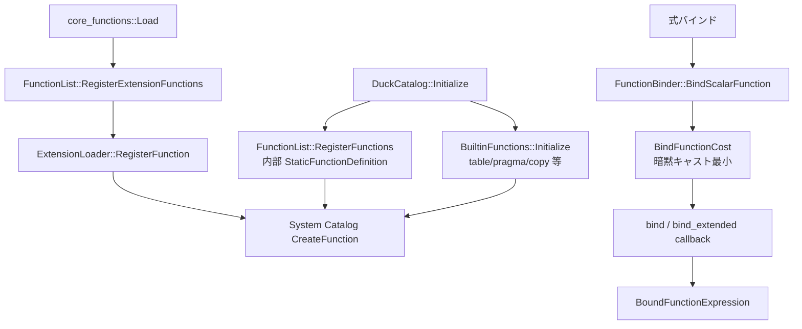

# 第32章 関数バインドと拡張登録

> **本章で読むソース**
>
> - [src/catalog/duck_catalog.cpp](https://github.com/duckdb/duckdb/blob/v1.5.4/src/catalog/duck_catalog.cpp)
> - [src/function/function.cpp](https://github.com/duckdb/duckdb/blob/v1.5.4/src/function/function.cpp)
> - [src/function/register_function_list.cpp](https://github.com/duckdb/duckdb/blob/v1.5.4/src/function/register_function_list.cpp)
> - [src/function/function_binder.cpp](https://github.com/duckdb/duckdb/blob/v1.5.4/src/function/function_binder.cpp)
> - [src/main/extension/extension_loader.cpp](https://github.com/duckdb/duckdb/blob/v1.5.4/src/main/extension/extension_loader.cpp)
> - [extension/core_functions/core_functions_extension.cpp](https://github.com/duckdb/duckdb/blob/v1.5.4/extension/core_functions/core_functions_extension.cpp)

## この章の狙い

スカラー、集約などの関数は、カタログへ載せる登録経路と、バインダがオーバーロードを選ぶ経路に分かれる。
本章では `DuckCatalog::Initialize` からの組み込み登録、`FunctionList`、拡張の `ExtensionLoader`、`FunctionBinder` の bind callback までを追う。

## 前提

第31章の `CatalogSet` とシステムカタログが、関数エントリの置き場である。
第8章の式バインドは、ここで見る `FunctionBinder` を呼び出す。
実行側の式評価は第17章である。

## カタログ初期化からの登録入口

システムカタログの初期化で、組み込みは二段に分かれる。
`BuiltinFunctions::Initialize` が table/pragma/copy など手続き寄りの関数を載せ、`FunctionList::RegisterFunctions` が静的定義のスカラー／集約を載せる。

[src/catalog/duck_catalog.cpp L24-L46](https://github.com/duckdb/duckdb/blob/v1.5.4/src/catalog/duck_catalog.cpp#L24-L46)

```cpp
void DuckCatalog::Initialize(bool load_builtin) {
	// first initialize the base system catalogs
	// these are never written to the WAL
	// we start these at 1 because deleted entries default to 0
	auto data = CatalogTransaction::GetSystemTransaction(GetDatabase());

	// create the default schema
	CreateSchemaInfo info;
	info.schema = DEFAULT_SCHEMA;
	info.internal = true;
	info.on_conflict = OnCreateConflict::IGNORE_ON_CONFLICT;
	CreateSchema(data, info);

	if (load_builtin) {
		BuiltinFunctions builtin(data, *this);
		builtin.Initialize();

		// initialize default functions
		FunctionList::RegisterFunctions(*this, data);
	}

	Verify();
}
```

`BuiltinFunctions::Initialize` は、スキャン、SQLite 互換、read、Arrow、pragma、copy、照合、拡張オーバーロードを順に登録する。
スカラー関数の巨大表はここには置かず、後続の `FunctionList` に渡す。

[src/function/function.cpp L95-L112](https://github.com/duckdb/duckdb/blob/v1.5.4/src/function/function.cpp#L95-L112)

```cpp
void BuiltinFunctions::Initialize() {
	RegisterTableScanFunctions();
	RegisterSQLiteFunctions();
	RegisterReadFunctions();
	RegisterTableFunctions();
	RegisterArrowFunctions();

	RegisterPragmaFunctions();

	RegisterCopyFunctions();

	// initialize collations
	AddCollation("nocase", LowerFun::GetFunction(), true);
	AddCollation("noaccent", StripAccentsFun::GetFunction(), true);
	AddCollation("nfc", NFCNormalizeFun::GetFunction());

	RegisterExtensionOverloads();
}
```

## FunctionList の静的登録

`StaticFunctionDefinition` の配列をなめて、スカラーか集約かを関数ポインタの有無で判別する。
カタログ直登録（`MainRegister`）と拡張登録（`ExtensionRegister`）で、衝突時方針だけが違う。
拡張側は `ALTER_ON_CONFLICT` を付け、同名へのオーバーロード追加を許す。

[src/function/register_function_list.cpp L11-L91](https://github.com/duckdb/duckdb/blob/v1.5.4/src/function/register_function_list.cpp#L11-L91)

```cpp
struct MainRegisterContext {
	MainRegisterContext(Catalog &catalog, CatalogTransaction transaction) : catalog(catalog), transaction(transaction) {
	}

	Catalog &catalog;
	CatalogTransaction transaction;
};

struct MainRegister {
	template <class T>
	static void FillExtraInfo(T &info) {
	}

	template <class T>
	static void RegisterFunction(MainRegisterContext &context, T &info) {
		context.catalog.CreateFunction(context.transaction, info);
	}
};

struct ExtensionRegister {
	template <class T>
	static void FillExtraInfo(T &info) {
		info.on_conflict = OnCreateConflict::ALTER_ON_CONFLICT;
	}

	template <class T>
	static void RegisterFunction(ExtensionLoader &loader, T &info) {
		loader.RegisterFunction(std::move(info));
	}
};

template <class OP, class T>
static void FillExtraInfo(const StaticFunctionDefinition &function, T &info) {
	info.internal = true;
	info.alias_of = function.alias_of;
	FillFunctionDescriptions(function, info);
	OP::FillExtraInfo(info);
}

template <class OP, class REGISTER_CONTEXT>
static void RegisterFunctionList(REGISTER_CONTEXT &context, const StaticFunctionDefinition *functions) {
	for (idx_t i = 0; functions[i].name; i++) {
		auto &function = functions[i];
		if (function.get_function || function.get_function_set) {
			// scalar function
			ScalarFunctionSet result;
			if (function.get_function) {
				result.AddFunction(function.get_function());
			} else {
				result = function.get_function_set();
			}
			result.name = function.name;
			CreateScalarFunctionInfo info(result);
			FillExtraInfo<OP>(function, info);
			OP::RegisterFunction(context, info);
		} else if (function.get_aggregate_function || function.get_aggregate_function_set) {
			// aggregate function
			AggregateFunctionSet result;
			if (function.get_aggregate_function) {
				result.AddFunction(function.get_aggregate_function());
			} else {
				result = function.get_aggregate_function_set();
			}
			result.name = function.name;
			CreateAggregateFunctionInfo info(result);
			FillExtraInfo<OP>(function, info);
			OP::RegisterFunction(context, info);
		} else {
			throw InternalException("Do not know how to register function of this type");
		}
	}
}

void FunctionList::RegisterExtensionFunctions(ExtensionLoader &loader, const StaticFunctionDefinition *functions) {
	RegisterFunctionList<ExtensionRegister>(loader, functions);
}

void FunctionList::RegisterFunctions(Catalog &catalog, CatalogTransaction transaction) {
	MainRegisterContext context(catalog, transaction);
	RegisterFunctionList<MainRegister>(context, FunctionList::GetInternalFunctionList());
}
```

## 拡張側の登録

`core_functions` 拡張は、独自の `CoreFunctionList` を `RegisterExtensionFunctions` へ渡すだけである。
C API 入口 `DUCKDB_CPP_EXTENSION_ENTRY` も同じ `LoadInternal` を呼ぶ。

[extension/core_functions/core_functions_extension.cpp L1-L33](https://github.com/duckdb/duckdb/blob/v1.5.4/extension/core_functions/core_functions_extension.cpp#L1-L33)

```cpp
#include "core_functions_extension.hpp"
#include "core_functions/function_list.hpp"

namespace duckdb {

static void LoadInternal(ExtensionLoader &loader) {
	FunctionList::RegisterExtensionFunctions(loader, CoreFunctionList::GetFunctionList());
}

void CoreFunctionsExtension::Load(ExtensionLoader &loader) {
	LoadInternal(loader);
}

std::string CoreFunctionsExtension::Name() {
	return "core_functions";
}

std::string CoreFunctionsExtension::Version() const {
#ifdef EXT_VERSION_CORE_FUNCTIONS
	return EXT_VERSION_CORE_FUNCTIONS;
#else
	return "";
#endif
}

} // namespace duckdb

extern "C" {

DUCKDB_CPP_EXTENSION_ENTRY(core_functions, loader) {
	duckdb::LoadInternal(loader);
}
}
```

`ExtensionLoader::RegisterFunction` は、最終的にシステムカタログの `CreateFunction` へ落ちる。
`ScalarFunction` 単体でも一度 `ScalarFunctionSet` に包み、衝突方針を `ALTER_ON_CONFLICT` に揃える。

[src/main/extension/extension_loader.cpp L22-L82](https://github.com/duckdb/duckdb/blob/v1.5.4/src/main/extension/extension_loader.cpp#L22-L82)

```cpp
ExtensionLoader::ExtensionLoader(ExtensionActiveLoad &load_info)
    : db(load_info.db), extension_name(load_info.extension_name), extension_info(load_info.info) {
}

ExtensionLoader::ExtensionLoader(DatabaseInstance &db, const string &name) : db(db), extension_name(name) {
}

DatabaseInstance &ExtensionLoader::GetDatabaseInstance() {
	return db;
}

void ExtensionLoader::SetDescription(const string &description) {
	extension_description = description;
}

void ExtensionLoader::FinalizeLoad() {
	// Set extension description, if provided
	if (!extension_description.empty() && extension_info) {
		auto info = make_uniq<ExtensionLoadedInfo>();
		info->description = extension_description;
		extension_info->load_info = std::move(info);
	}
}

void ExtensionLoader::RegisterFunction(ScalarFunction function) {
	ScalarFunctionSet set(function.name);
	set.AddFunction(std::move(function));
	RegisterFunction(std::move(set));
}

void ExtensionLoader::RegisterFunction(ScalarFunctionSet function) {
	CreateScalarFunctionInfo info(std::move(function));
	info.on_conflict = OnCreateConflict::ALTER_ON_CONFLICT;
	RegisterFunction(std::move(info));
}

void ExtensionLoader::RegisterFunction(CreateScalarFunctionInfo function) {
	D_ASSERT(!function.functions.name.empty());
	auto &system_catalog = Catalog::GetSystemCatalog(db);
	auto data = CatalogTransaction::GetSystemTransaction(db);
	system_catalog.CreateFunction(data, function);
}

void ExtensionLoader::RegisterFunction(AggregateFunction function) {
	AggregateFunctionSet set(function.name);
	set.AddFunction(std::move(function));
	RegisterFunction(std::move(set));
}

void ExtensionLoader::RegisterFunction(AggregateFunctionSet function) {
	CreateAggregateFunctionInfo info(std::move(function));
	info.on_conflict = OnCreateConflict::ALTER_ON_CONFLICT;
	RegisterFunction(std::move(info));
}

void ExtensionLoader::RegisterFunction(CreateAggregateFunctionInfo function) {
	D_ASSERT(!function.functions.name.empty());
	auto &system_catalog = Catalog::GetSystemCatalog(db);
	auto data = CatalogTransaction::GetSystemTransaction(db);
	system_catalog.CreateFunction(data, function);
}
```

## FunctionBinder とオーバーロード選択

バインドは、まずカタログから `ScalarFunctionCatalogEntry` を取り、引数型で最良オーバーロードを選ぶ。
`DEFAULT_NULL_HANDLING` なら、NULL 定数引数を返す型への定数 NULL に畳み、本体の bind を踏まない。

[src/function/function_binder.cpp L311-L357](https://github.com/duckdb/duckdb/blob/v1.5.4/src/function/function_binder.cpp#L311-L357)

```cpp
unique_ptr<Expression> FunctionBinder::BindScalarFunction(const string &schema, const string &name,
                                                          vector<unique_ptr<Expression>> children, ErrorData &error,
                                                          bool is_operator, optional_ptr<Binder> binder) {
	// bind the function
	auto &function = Catalog::GetSystemCatalog(context).GetEntry<ScalarFunctionCatalogEntry>(context, schema, name);
	D_ASSERT(function.type == CatalogType::SCALAR_FUNCTION_ENTRY);
	return BindScalarFunction(function, std::move(children), error, is_operator, binder);
}

unique_ptr<Expression> FunctionBinder::BindScalarFunction(ScalarFunctionCatalogEntry &func,
                                                          vector<unique_ptr<Expression>> children, ErrorData &error,
                                                          bool is_operator, optional_ptr<Binder> binder) {
	// bind the function
	auto best_function = BindFunction(func.name, func.functions, children, error);
	if (!best_function.IsValid()) {
		return nullptr;
	}

	// found a matching function!
	auto bound_function = func.functions.GetFunctionByOffset(best_function.GetIndex());

	// If any of the parameters are NULL, the function will just be replaced with a NULL constant.
	// We try to give the NULL constant the correct type, but we have to do this without binding the function,
	// because functions with DEFAULT_NULL_HANDLING should not have to deal with NULL inputs in their bind code.
	// Some functions may have an invalid default return type, as they must be bound to infer the return type.
	// In those cases, we default to SQLNULL.
	const auto return_type_if_null =
	    bound_function.GetReturnType().IsComplete() ? bound_function.GetReturnType() : LogicalType::SQLNULL;
	if (bound_function.GetNullHandling() == FunctionNullHandling::DEFAULT_NULL_HANDLING) {
		for (auto &child : children) {
			if (child->return_type == LogicalTypeId::SQLNULL) {
				return make_uniq<BoundConstantExpression>(Value(return_type_if_null));
			}
			if (!child->IsFoldable()) {
				continue;
			}
			Value result;
			if (!ExpressionExecutor::TryEvaluateScalar(context, *child, result)) {
				continue;
			}
			if (result.IsNull()) {
				return make_uniq<BoundConstantExpression>(Value(return_type_if_null));
			}
		}
	}
	return BindScalarFunction(bound_function, std::move(children), is_operator, binder);
}
```

候補選択は、暗黙キャストコストの最小を取る。
同点のオーバーロードが複数残ると、明示キャストを促すエラーになる。

[src/function/function_binder.cpp L50-L79](https://github.com/duckdb/duckdb/blob/v1.5.4/src/function/function_binder.cpp#L50-L79)

```cpp
optional_idx FunctionBinder::BindFunctionCost(const SimpleFunction &func, const vector<LogicalType> &arguments) {
	if (func.HasVarArgs()) {
		// special case varargs function
		return BindVarArgsFunctionCost(func, arguments);
	}
	if (func.arguments.size() != arguments.size()) {
		// invalid argument count: check the next function
		return optional_idx();
	}
	idx_t cost = 0;
	bool has_parameter = false;
	for (idx_t i = 0; i < arguments.size(); i++) {
		if (arguments[i].id() == LogicalTypeId::UNKNOWN) {
			has_parameter = true;
			continue;
		}
		int64_t cast_cost = CastFunctionSet::ImplicitCastCost(context, arguments[i], func.arguments[i]);
		if (cast_cost >= 0) {
			// we can implicitly cast, add the cost to the total cost
			cost += idx_t(cast_cost);
		} else {
			// we can't implicitly cast: throw an error
			return optional_idx();
		}
	}
	if (has_parameter) {
		// all arguments are implicitly castable and there is a parameter - return 0 as cost
		return 0;
	}
	return cost;
}
```

[src/function/function_binder.cpp L82-L127](https://github.com/duckdb/duckdb/blob/v1.5.4/src/function/function_binder.cpp#L82-L127)

```cpp
template <class T>
vector<idx_t> FunctionBinder::BindFunctionsFromArguments(const string &name, FunctionSet<T> &functions,
                                                         const vector<LogicalType> &arguments, ErrorData &error) {
	optional_idx best_function;
	idx_t lowest_cost = NumericLimits<idx_t>::Maximum();
	vector<idx_t> candidate_functions;
	for (idx_t f_idx = 0; f_idx < functions.functions.size(); f_idx++) {
		auto &func = functions.functions[f_idx];
		// check the arguments of the function
		auto bind_cost = BindFunctionCost(func, arguments);
		if (!bind_cost.IsValid()) {
			// auto casting was not possible
			continue;
		}
		auto cost = bind_cost.GetIndex();
		if (cost == lowest_cost) {
			candidate_functions.push_back(f_idx);
			continue;
		}
		if (cost > lowest_cost) {
			continue;
		}
		candidate_functions.clear();
		lowest_cost = cost;
		best_function = f_idx;
	}
	if (!best_function.IsValid()) {
		// no matching function was found, throw an error
		vector<string> candidates;
		string catalog_name;
		string schema_name;
		for (auto &f : functions.functions) {
			if (catalog_name.empty() && !f.catalog_name.empty()) {
				catalog_name = f.catalog_name;
			}
			if (schema_name.empty() && !f.schema_name.empty()) {
				schema_name = f.schema_name;
			}
			candidates.push_back(f.ToString());
		}
		error = ErrorData(BinderException::NoMatchingFunction(catalog_name, schema_name, name, arguments, candidates));
		return candidate_functions;
	}
	candidate_functions.push_back(best_function.GetIndex());
	return candidate_functions;
}
```

最終段でテンプレート型を解き、あれば bind callback / bind_extended を呼び、子供へ必要なキャストを差し、`BoundFunctionExpression` を作る。
`bind_expression` callback があれば、その結果式で置き換える。

[src/function/function_binder.cpp L645-L692](https://github.com/duckdb/duckdb/blob/v1.5.4/src/function/function_binder.cpp#L645-L692)

```cpp
unique_ptr<Expression> FunctionBinder::BindScalarFunction(ScalarFunction bound_function,
                                                          vector<unique_ptr<Expression>> children, bool is_operator,
                                                          optional_ptr<Binder> binder) {
	// Attempt to resolve template types, before we call the "Bind" callback.
	ResolveTemplateTypes(bound_function, children);

	unique_ptr<FunctionData> bind_info;

	if (bound_function.HasBindCallback()) {
		bind_info = bound_function.GetBindCallback()(context, bound_function, children);
	} else if (bound_function.HasBindExtendedCallback()) {
		if (!binder) {
			throw InternalException("Function '%s' has a 'bind_extended' but the FunctionBinder was created without "
			                        "a reference to a Binder",
			                        bound_function.name);
		}
		ScalarFunctionBindInput bind_input(*binder);
		bind_info = bound_function.GetBindExtendedCallback()(bind_input, bound_function, children);
	}

	// After the "bind" callback, we verify that all template types are bound to concrete types.
	CheckTemplateTypesResolved(bound_function);

	if (bound_function.HasModifiedDatabasesCallback() && binder) {
		auto &properties = binder->GetStatementProperties();
		FunctionModifiedDatabasesInput input(bind_info, properties);
		bound_function.GetModifiedDatabasesCallback()(context, input);
	}

	HandleCollations(context, bound_function, children);

	// check if we need to add casts to the children
	CastToFunctionArguments(bound_function, children);

	auto return_type = bound_function.GetReturnType();
	unique_ptr<Expression> result;
	auto result_func = make_uniq<BoundFunctionExpression>(std::move(return_type), std::move(bound_function),
	                                                      std::move(children), std::move(bind_info), is_operator);
	if (result_func->function.HasBindExpressionCallback()) {
		// if a bind_expression callback is registered - call it and emit the resulting expression
		FunctionBindExpressionInput input(context, result_func->bind_info.get(), result_func->children);
		result = result_func->function.GetBindExpressionCallback()(input);
	}
	if (!result) {
		result = std::move(result_func);
	}
	return result;
}
```

## 処理の流れ



## 高速化と最適化の工夫

オーバーロード選択はキャストコストの線形走査で済み、実行時ではなくバインド時に一回決める。
`DEFAULT_NULL_HANDLING` の NULL 畳み込みは、bind callback や実行器を踏まずに定数を返す。
拡張登録は既存セットへの ALTER なので、同名関数を毎回作り直さずオーバーロードだけ足せる。

## まとめ

組み込み関数は `BuiltinFunctions` と `FunctionList` の二入口からシステムカタログへ入り、拡張は `ExtensionLoader` 経由で同じ `CreateFunction` に合流する。
バインドはコスト最小のオーバーロードを選び、bind callback で `FunctionData` を作り、必要なら式自体を差し替える。
登録とバインドが分かれているため、実行パスはカタログ上の確定済み `ScalarFunction` だけを見る。

## 関連する章

- [第8章 式のバインド](../part02-frontend/08-expression-binding.md)
- [第17章 式実行](../part04-execution/17-expression-executor.md)
- [第31章 カタログと依存関係](./31-catalog.md)
