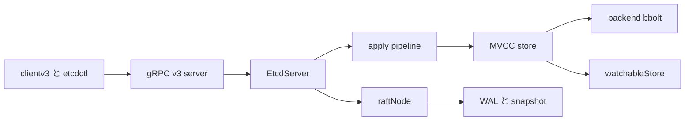

# 第1章 etcd の全体像

> 本章で読むソース
>
> - [`server/etcdserver/server.go`](https://github.com/etcd-io/etcd/blob/v3.6.12/server/etcdserver/server.go)

## この章の狙い

本章では **etcd** を、gRPC API、Raft、MVCC、backend、WAL がつながる一つのサーバーとして読む。
以後の章で個別に読む部品が、`EtcdServer` のどのフィールドと責務に対応するかを先に押さえる。

## 前提

Go の構造体、goroutine、channel の基本を前提にする。
Raft は複数ノードで同じ順序のログを合意する仕組みとして扱う。

## 全体の流れ



## サーバーを中心に読む

`EtcdServer` は合意、適用、永続化、認可、リース、watch、統計を一つの実行単位として束ねる。
構造体を見ると、Raft の進行を受ける `r`、MVCC を表す `kv`、backend を表す `be`、認可を表す `authStore` が同じサーバーに収まっている。

`EtcdServer` の前半は、Raft と読み取り通知、cluster、snapshot、MVCC、backend を同じ寿命で管理することを示す。

[server/etcdserver/server.go L211-L264](https://github.com/etcd-io/etcd/blob/v3.6.12/server/etcdserver/server.go#L211-L264)

```go
type EtcdServer struct {
	// inflightSnapshots holds count the number of snapshots currently inflight.
	inflightSnapshots int64  // must use atomic operations to access; keep 64-bit aligned.
	appliedIndex      uint64 // must use atomic operations to access; keep 64-bit aligned.
	committedIndex    uint64 // must use atomic operations to access; keep 64-bit aligned.
	term              uint64 // must use atomic operations to access; keep 64-bit aligned.
	lead              uint64 // must use atomic operations to access; keep 64-bit aligned.

	consistIndex cindex.ConsistentIndexer // consistIndex is used to get/set/save consistentIndex
	r            raftNode                 // uses 64-bit atomics; keep 64-bit aligned.

	readych chan struct{}
	Cfg     config.ServerConfig

	lgMu *sync.RWMutex
	lg   *zap.Logger

	w wait.Wait

	readMu sync.RWMutex
	// read routine notifies etcd server that it waits for reading by sending an empty struct to
	// readwaitC
	readwaitc chan struct{}
	// readNotifier is used to notify the read routine that it can process the request
	// when there is no error
	readNotifier *notifier

	// stop signals the run goroutine should shutdown.
	stop chan struct{}
	// stopping is closed by run goroutine on shutdown.
	stopping chan struct{}
	// done is closed when all goroutines from start() complete.
	done chan struct{}
	// leaderChanged is used to notify the linearizable read loop to drop the old read requests.
	leaderChanged *notify.Notifier

	errorc     chan error
	memberID   types.ID
	attributes membership.Attributes

	cluster *membership.RaftCluster

	v2store     v2store.Store
	snapshotter *snap.Snapshotter

	uberApply apply.UberApplier

	applyWait wait.WaitTime

	kv         mvcc.WatchableKV
	lessor     lease.Lessor
	bemu       sync.RWMutex
	be         backend.Backend
	beHooks    *serverstorage.BackendHooks
```

## 起動時に部品を結線する

`NewServer` は bootstrap の結果を受け取り、Raft storage、cluster、snapshotter、統計、request ID 生成器を `EtcdServer` に差し込む。
この時点でサーバーはまだ外部 API の処理そのものではなく、合意ログを適用できる実行体として構築される。

`NewServer` は `bootstrap` の戻り値から `EtcdServer` の中心フィールドを初期化する。

[server/etcdserver/server.go L304-L340](https://github.com/etcd-io/etcd/blob/v3.6.12/server/etcdserver/server.go#L304-L340)

```go
// NewServer creates a new EtcdServer from the supplied configuration. The
// configuration is considered static for the lifetime of the EtcdServer.
func NewServer(cfg config.ServerConfig) (srv *EtcdServer, err error) {
	b, err := bootstrap(cfg)
	if err != nil {
		cfg.Logger.Error("bootstrap failed", zap.Error(err))
		return nil, err
	}
	cfg.Logger.Info("bootstrap successfully")

	defer func() {
		if err != nil {
			b.Close()
		}
	}()

	sstats := stats.NewServerStats(cfg.Name, b.cluster.cl.String())
	lstats := stats.NewLeaderStats(cfg.Logger, b.cluster.nodeID.String())

	heartbeat := time.Duration(cfg.TickMs) * time.Millisecond
	srv = &EtcdServer{
		readych:               make(chan struct{}),
		Cfg:                   cfg,
		lgMu:                  new(sync.RWMutex),
		lg:                    cfg.Logger,
		errorc:                make(chan error, 1),
		v2store:               b.storage.st,
		snapshotter:           b.ss,
		r:                     *b.raft.newRaftNode(b.ss, b.storage.wal.w, b.cluster.cl),
		memberID:              b.cluster.nodeID,
		attributes:            membership.Attributes{Name: cfg.Name, ClientURLs: cfg.ClientURLs.StringSlice()},
		cluster:               b.cluster.cl,
		stats:                 sstats,
		lstats:                lstats,
		SyncTicker:            time.NewTicker(500 * time.Millisecond),
		peerRt:                b.prt,
		reqIDGen:              idutil.NewGenerator(uint16(b.cluster.nodeID), time.Now()),
```

## 最適化の工夫

`EtcdServer` は read path の `readwaitc` と `readNotifier` をサーバー内で共有し、複数のリニアライザブル read を一つの ReadIndex 確認でまとめて解放できる。

## まとめ

- etcd は gRPC handler だけでなく、Raft、MVCC、backend、lease、watch を `EtcdServer` の寿命で束ねる。
- 以後の章では、この構造体の各フィールドを下から上へ読み直す。

## 関連する章

- [embed と起動処理](02-embed-and-startup.md)
- [backend と bbolt](../part01-storage/03-backend-bbolt.md)
- [etcdserver の Raft ループ](../part03-raft/10-etcdserver-raft.md)
- [gRPC v3 server](../part05-api-auth/16-grpc-v3-server.md)
