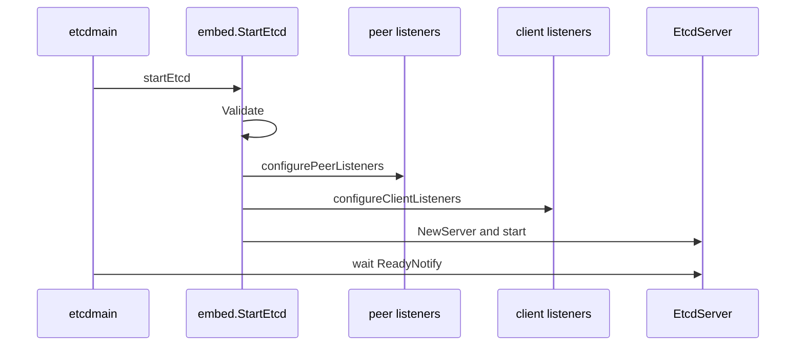

# 第2章 embed と起動処理

> 本章で読むソース
>
> - [`server/etcdmain/etcd.go`](https://github.com/etcd-io/etcd/blob/v3.6.12/server/etcdmain/etcd.go)
> - [`server/embed/etcd.go`](https://github.com/etcd-io/etcd/blob/v3.6.12/server/embed/etcd.go)

## この章の狙い

本章では `etcdmain` から `embed.StartEtcd` を経由して `EtcdServer` が起動するまでを読む。
設定の検証、listener の構成、ready 通知の待機を、起動の三段として整理する。

## 前提

前章で `EtcdServer` が複数の実行部品を束ねることを見た。
`embed` パッケージは外部プロセスとしての etcd と組み込み利用の境界を担当する。

## 全体の流れ



## standalone 起動の待機点

`etcdmain.startEtcd` は `embed.StartEtcd` を呼び、interrupt handler を登録してから `ReadyNotify` か `StopNotify` を待つ。
ここで ready を待つため、systemd など外部の監視側にはクラスタ参加前の半端な状態を成功として見せない。

`startEtcd` は `ReadyNotify` を待ってから停止 channel と error channel を返す。

[server/etcdmain/etcd.go L205-L217](https://github.com/etcd-io/etcd/blob/v3.6.12/server/etcdmain/etcd.go#L205-L217)

```go
// startEtcd runs StartEtcd in addition to hooks needed for standalone etcd.
func startEtcd(cfg *embed.Config) (<-chan struct{}, <-chan error, error) {
	e, err := embed.StartEtcd(cfg)
	if err != nil {
		return nil, nil, err
	}
	osutil.RegisterInterruptHandler(e.Close)
	select {
	case <-e.Server.ReadyNotify(): // wait for e.Server to join the cluster
	case <-e.Server.StopNotify(): // publish aborted from 'ErrStopped'
	}
	return e.Server.StopNotify(), e.Err(), nil
}
```

## listener と初期クラスタ情報を先に作る

`StartEtcd` は設定を検証し、peer listener と client listener を構成してから初期クラスタ情報を解く。
listener の構成を先に行うため、後続の cluster bootstrap は通信口が用意された状態で進む。

`StartEtcd` は設定検証、listener 構成、初期 cluster map の取得を順に実行する。

[server/embed/etcd.go L107-L180](https://github.com/etcd-io/etcd/blob/v3.6.12/server/embed/etcd.go#L107-L180)

```go
// StartEtcd launches the etcd server and HTTP handlers for client/server communication.
// The returned Etcd.Server is not guaranteed to have joined the cluster. Wait
// on the Etcd.Server.ReadyNotify() channel to know when it completes and is ready for use.
func StartEtcd(inCfg *Config) (e *Etcd, err error) {
	if err = inCfg.Validate(); err != nil {
		return nil, err
	}
	serving := false
	e = &Etcd{cfg: *inCfg, stopc: make(chan struct{})}
	cfg := &e.cfg
	defer func() {
		if e == nil || err == nil {
			return
		}
		if !serving {
			// errored before starting gRPC server for serveCtx.serversC
			for _, sctx := range e.sctxs {
				sctx.close()
			}
		}
		e.Close()
		e = nil
	}()

	if !cfg.SocketOpts.Empty() {
		cfg.logger.Info(
			"configuring socket options",
			zap.Bool("reuse-address", cfg.SocketOpts.ReuseAddress),
			zap.Bool("reuse-port", cfg.SocketOpts.ReusePort),
		)
	}
	e.cfg.logger.Info(
		"configuring peer listeners",
		zap.Strings("listen-peer-urls", e.cfg.getListenPeerURLs()),
	)
	if e.Peers, err = configurePeerListeners(cfg); err != nil {
		return e, err
	}

	e.cfg.logger.Info(
		"configuring client listeners",
		zap.Strings("listen-client-urls", e.cfg.getListenClientURLs()),
	)
	if e.sctxs, err = configureClientListeners(cfg); err != nil {
		return e, err
	}

	for _, sctx := range e.sctxs {
		e.Clients = append(e.Clients, sctx.l)
	}

	var (
		urlsmap types.URLsMap
		token   string
	)
	memberInitialized := true
	if !isMemberInitialized(cfg) {
		memberInitialized = false
		urlsmap, token, err = cfg.PeerURLsMapAndToken("etcd")
		if err != nil {
			return e, fmt.Errorf("error setting up initial cluster: %w", err)
		}
	}

	// AutoCompactionRetention defaults to "0" if not set.
	if len(cfg.AutoCompactionRetention) == 0 {
		cfg.AutoCompactionRetention = "0"
	}
	autoCompactionRetention, err := parseCompactionRetention(cfg.AutoCompactionMode, cfg.AutoCompactionRetention)
	if err != nil {
		return e, err
	}

	backendFreelistType := parseBackendFreelistType(cfg.BackendFreelistType)
```

## 最適化の工夫

`InitialElectionTickAdvance` は起動直後の election tick を前に進め、長い election timeout を使う環境でも初回 leader election の待ち時間を短くできる。

## まとめ

- `etcdmain` は standalone 実行の作法を持ち、`embed` は listener と server の寿命を管理する。
- 起動完了は listener 作成ではなく、`EtcdServer` の ready 通知で判断される。

## 関連する章

- [etcd の全体像](01-etcd-overview.md)
- [cluster bootstrap](../part03-raft/12-cluster-bootstrap.md)
- [etcdserver の Raft ループ](../part03-raft/10-etcdserver-raft.md)
