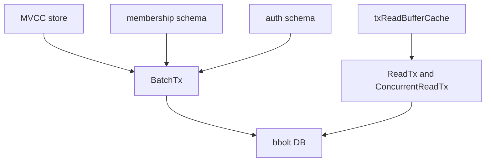

# 第3章 backend と bbolt

> 本章で読むソース
>
> - [`server/storage/backend/backend.go`](https://github.com/etcd-io/etcd/blob/v3.6.12/server/storage/backend/backend.go)
> - [`server/storage/backend/batch_tx.go`](https://github.com/etcd-io/etcd/blob/v3.6.12/server/storage/backend/batch_tx.go)

## この章の狙い

本章では **backend** が bbolt を包み、MVCC と membership の永続化を受ける境界を読む。
batch transaction、read transaction、buffer cache がどのように同じ backend に集まるかを確認する。

## 前提

起動時に `EtcdServer` は `backend.Backend` を受け取っていた。
bbolt の bucket は key と value を永続化する単位であり、etcd はその上に schema を置く。

## 全体の流れ



## backend の保持する状態

`backend` は bbolt の `DB` だけでなく、batch commit の閾値、read transaction、read buffer cache、hook を持つ。
この構造により、MVCC の書き込みと、読み取り側の snapshot 的な参照が同じ backend の中で調停される。

`backend` は bbolt DB、batch transaction、read transaction、read buffer cache を同じ構造体に持つ。

[server/storage/backend/backend.go L92-L131](https://github.com/etcd-io/etcd/blob/v3.6.12/server/storage/backend/backend.go#L92-L131)

```go
type backend struct {
	// size and commits are used with atomic operations so they must be
	// 64-bit aligned, otherwise 32-bit tests will crash

	// size is the number of bytes allocated in the backend
	size int64
	// sizeInUse is the number of bytes actually used in the backend
	sizeInUse int64
	// commits counts number of commits since start
	commits int64
	// openReadTxN is the number of currently open read transactions in the backend
	openReadTxN int64
	// mlock prevents backend database file to be swapped
	mlock bool

	mu    sync.RWMutex
	bopts *bolt.Options
	db    *bolt.DB

	batchInterval time.Duration
	batchLimit    int
	batchTx       *batchTxBuffered

	readTx *readTx
	// txReadBufferCache mirrors "txReadBuffer" within "readTx" -- readTx.baseReadTx.buf.
	// When creating "concurrentReadTx":
	// - if the cache is up-to-date, "readTx.baseReadTx.buf" copy can be skipped
	// - if the cache is empty or outdated, "readTx.baseReadTx.buf" copy is required
	txReadBufferCache txReadBufferCache

	stopc chan struct{}
	donec chan struct{}

	hooks Hooks

	// txPostLockInsideApplyHook is called each time right after locking the tx.
	txPostLockInsideApplyHook func()

	lg *zap.Logger
}
```

## bbolt を開いて read buffer を初期化する

`newBackend` は mmap、freelist、fsync、mlock の option を作って bbolt を開く。
その後、read transaction の buffer と cache を初期化し、write path と read path の共通基盤を作る。

`newBackend` は bbolt を開き、batch 設定と read buffer cache を初期化する。

[server/storage/backend/backend.go L176-L235](https://github.com/etcd-io/etcd/blob/v3.6.12/server/storage/backend/backend.go#L176-L235)

```go
func NewDefaultBackend(lg *zap.Logger, path string, opts ...BackendConfigOption) Backend {
	bcfg := DefaultBackendConfig(lg)
	bcfg.Path = path
	for _, opt := range opts {
		opt(&bcfg)
	}

	return newBackend(bcfg)
}

func newBackend(bcfg BackendConfig) *backend {
	bopts := &bolt.Options{}
	if boltOpenOptions != nil {
		*bopts = *boltOpenOptions
	}

	if bcfg.Logger == nil {
		bcfg.Logger = zap.NewNop()
	}

	bopts.InitialMmapSize = bcfg.mmapSize()
	bopts.FreelistType = bcfg.BackendFreelistType
	bopts.NoSync = bcfg.UnsafeNoFsync
	bopts.NoGrowSync = bcfg.UnsafeNoFsync
	bopts.Mlock = bcfg.Mlock
	bopts.Logger = newBoltLoggerZap(bcfg)

	db, err := bolt.Open(bcfg.Path, 0o600, bopts)
	if err != nil {
		bcfg.Logger.Panic("failed to open database", zap.String("path", bcfg.Path), zap.Error(err))
	}

	// In future, may want to make buffering optional for low-concurrency systems
	// or dynamically swap between buffered/non-buffered depending on workload.
	b := &backend{
		bopts: bopts,
		db:    db,

		batchInterval: bcfg.BatchInterval,
		batchLimit:    bcfg.BatchLimit,
		mlock:         bcfg.Mlock,

		readTx: &readTx{
			baseReadTx: baseReadTx{
				buf: txReadBuffer{
					txBuffer:   txBuffer{make(map[BucketID]*bucketBuffer)},
					bufVersion: 0,
				},
				buckets: make(map[BucketID]*bolt.Bucket),
				txWg:    new(sync.WaitGroup),
				txMu:    new(sync.RWMutex),
			},
		},
		txReadBufferCache: txReadBufferCache{
			mu:         sync.Mutex{},
			bufVersion: 0,
			buf:        nil,
		},

		stopc: make(chan struct{}),
```

`BatchTx.Unlock` は pending 件数が閾値を超えたときだけ commit する。

[server/storage/backend/batch_tx.go L109-L125](https://github.com/etcd-io/etcd/blob/v3.6.12/server/storage/backend/batch_tx.go#L109-L125)

```go
func (t *batchTx) Unlock() {
	if t.pending >= t.backend.batchLimit {
		t.commit(false)
	}
	t.Mutex.Unlock()
}

func (t *batchTx) UnsafeCreateBucket(bucket Bucket) {
	if _, err := t.tx.CreateBucketIfNotExists(bucket.Name()); err != nil {
		t.backend.lg.Fatal(
			"failed to create a bucket",
			zap.Stringer("bucket-name", bucket),
			zap.Error(err),
		)
	}
	t.pending++
}
```

## concurrent read transaction

`ConcurrentReadTx` は read buffer cache を見て、必要なときだけ buffer copy を行う。

[`server/storage/backend/backend.go` L269-L292](https://github.com/etcd-io/etcd/blob/v3.6.12/server/storage/backend/backend.go#L269-L292)

```go
func (b *backend) ConcurrentReadTx() ReadTx {
	b.readTx.RLock()
	defer b.readTx.RUnlock()
	// prevent boltdb read Tx from been rolled back until store read Tx is done. Needs to be called when holding readTx.RLock().
	b.readTx.txWg.Add(1)

	// TODO: might want to copy the read buffer lazily - create copy when A) end of a write transaction B) end of a batch interval.

	// inspect/update cache recency iff there's no ongoing update to the cache
	// this falls through if there's no cache update

	// by this line, "ConcurrentReadTx" code path is already protected against concurrent "writeback" operations
	// which requires write lock to update "readTx.baseReadTx.buf".
	// Which means setting "buf *txReadBuffer" with "readTx.buf.unsafeCopy()" is guaranteed to be up-to-date,
	// whereas "txReadBufferCache.buf" may be stale from concurrent "writeback" operations.
	// We only update "txReadBufferCache.buf" if we know "buf *txReadBuffer" is up-to-date.
	// The update to "txReadBufferCache.buf" will benefit the following "ConcurrentReadTx" creation
	// by avoiding copying "readTx.baseReadTx.buf".
	b.txReadBufferCache.mu.Lock()

	curCache := b.txReadBufferCache.buf
	curCacheVer := b.txReadBufferCache.bufVersion
	curBufVer := b.readTx.buf.bufVersion
```

buffer 付き batch transaction の commit は、進行中の read transaction が boltdb tx を閉じるまで待つ。

[`server/storage/backend/batch_tx.go` L354-L376](https://github.com/etcd-io/etcd/blob/v3.6.12/server/storage/backend/batch_tx.go#L354-L376)

```go
func (t *batchTxBuffered) commit(stop bool) {
	// all read txs must be closed to acquire boltdb commit rwlock
	t.backend.readTx.Lock()
	t.unsafeCommit(stop)
	t.backend.readTx.Unlock()
}

func (t *batchTxBuffered) unsafeCommit(stop bool) {
	if t.backend.hooks != nil {
		// gofail: var commitBeforePreCommitHook struct{}
		t.backend.hooks.OnPreCommitUnsafe(t)
		// gofail: var commitAfterPreCommitHook struct{}
	}

	if t.backend.readTx.tx != nil {
		// wait all store read transactions using the current boltdb tx to finish,
		// then close the boltdb tx
		go func(tx *bolt.Tx, wg *sync.WaitGroup) {
			wg.Wait()
			if err := tx.Rollback(); err != nil {
				t.backend.lg.Fatal("failed to rollback tx", zap.Error(err))
			}
		}(t.backend.readTx.tx, t.backend.readTx.txWg)
```

`run` は `batchInterval` ごとに pending 操作を commit し、時間ベースの flush を行う。

[`server/storage/backend/backend.go` L431-L446](https://github.com/etcd-io/etcd/blob/v3.6.12/server/storage/backend/backend.go#L431-L446)

```go
func (b *backend) run() {
	defer close(b.donec)
	t := time.NewTimer(b.batchInterval)
	defer t.Stop()
	for {
		select {
		case <-t.C:
		case <-b.stopc:
			b.batchTx.CommitAndStop()
			return
		}
		if b.batchTx.safePending() != 0 {
			b.batchTx.Commit()
		}
		t.Reset(b.batchInterval)
	}
}
```

## 最適化の工夫

`BatchTx` は操作ごとに fsync せず、`pending` が `batchLimit` に達したときに commit するため、連続する apply のディスク同期回数を減らせる。
`txReadBufferCache` は concurrent read transaction 作成時の buffer copy を省ける場合を作り、読み取りの並行性を上げる。

## まとめ

- backend は bbolt を直接見せず、BatchTx と ReadTx を通じて上位層に永続化 API を渡す。
- batch commit と read buffer cache が、etcd の読み取りと書き込みの性能境界になる。

## 関連する章

- [schema と keyspace](04-schema-keyspace.md)
- [MVCC の revision index](06-mvcc-revision-index.md)
- [MVCC の read と write](../part02-mvcc/07-mvcc-read-write.md)
