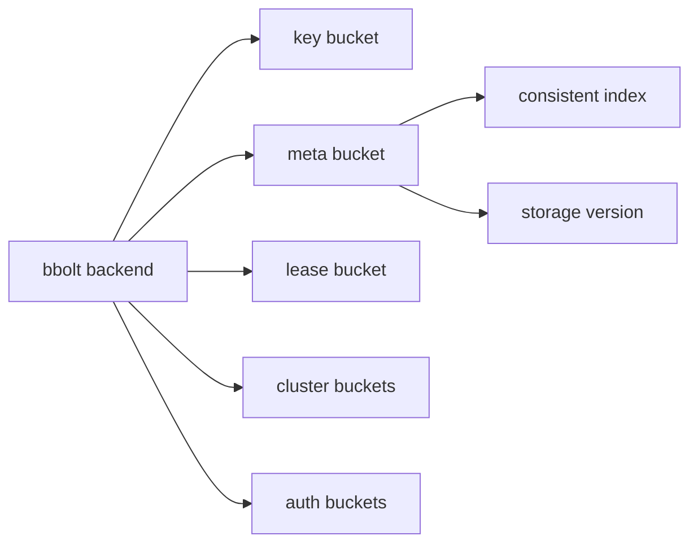

# 第4章 schema と keyspace

> 本章で読むソース
>
> - [`server/storage/schema/bucket.go`](https://github.com/etcd-io/etcd/blob/v3.6.12/server/storage/schema/bucket.go)
> - [`server/storage/schema/cindex.go`](https://github.com/etcd-io/etcd/blob/v3.6.12/server/storage/schema/cindex.go)
> - [`server/storage/schema/schema.go`](https://github.com/etcd-io/etcd/blob/v3.6.12/server/storage/schema/schema.go)

## この章の狙い

本章では bbolt 上の bucket と meta key を、etcd の永続化 schema として読む。
MVCC の key bucket、cluster 情報、auth 情報、consistent index が同じ backend に分けて格納される理由を整理する。

## 前提

前章で backend が bbolt の抽象化であることを見た。
本章の bucket は Go の map ではなく、bbolt 内の永続化領域を指す。

## 全体の流れ



## bucket を固定 ID で定義する

`schema` は bucket 名と bucket ID を一箇所で定義し、safe range bucket かどうかも bucket に持たせる。
これにより、MVCC の key bucket と、metadata 系の bucket を同じ backend API で扱いながら用途を分けられる。

`bucket.go` は key、meta、lease、cluster、auth の bucket を固定的に列挙する。

[server/storage/schema/bucket.go L24-L70](https://github.com/etcd-io/etcd/blob/v3.6.12/server/storage/schema/bucket.go#L24-L70)

```go
var (
	keyBucketName   = []byte("key")
	metaBucketName  = []byte("meta")
	leaseBucketName = []byte("lease")
	alarmBucketName = []byte("alarm")

	clusterBucketName = []byte("cluster")

	membersBucketName        = []byte("members")
	membersRemovedBucketName = []byte("members_removed")

	authBucketName      = []byte("auth")
	authUsersBucketName = []byte("authUsers")
	authRolesBucketName = []byte("authRoles")

	testBucketName = []byte("test")
)

var (
	Key     = backend.Bucket(bucket{id: 1, name: keyBucketName, safeRangeBucket: true})
	Meta    = backend.Bucket(bucket{id: 2, name: metaBucketName, safeRangeBucket: false})
	Lease   = backend.Bucket(bucket{id: 3, name: leaseBucketName, safeRangeBucket: false})
	Alarm   = backend.Bucket(bucket{id: 4, name: alarmBucketName, safeRangeBucket: false})
	Cluster = backend.Bucket(bucket{id: 5, name: clusterBucketName, safeRangeBucket: false})

	Members        = backend.Bucket(bucket{id: 10, name: membersBucketName, safeRangeBucket: false})
	MembersRemoved = backend.Bucket(bucket{id: 11, name: membersRemovedBucketName, safeRangeBucket: false})

	Auth      = backend.Bucket(bucket{id: 20, name: authBucketName, safeRangeBucket: false})
	AuthUsers = backend.Bucket(bucket{id: 21, name: authUsersBucketName, safeRangeBucket: false})
	AuthRoles = backend.Bucket(bucket{id: 22, name: authRolesBucketName, safeRangeBucket: false})

	Test = backend.Bucket(bucket{id: 100, name: testBucketName, safeRangeBucket: false})

	AllBuckets = []backend.Bucket{Key, Meta, Lease, Alarm, Cluster, Members, MembersRemoved, Auth, AuthUsers, AuthRoles}
)

type bucket struct {
	id              backend.BucketID
	name            []byte
	safeRangeBucket bool
}

func (b bucket) ID() backend.BucketID    { return b.id }
func (b bucket) Name() []byte            { return b.name }
func (b bucket) String() string          { return string(b.Name()) }
func (b bucket) IsSafeRangeBucket() bool { return b.safeRangeBucket }
```

## consistent index を meta に保存する

consistent index は、backend がどの Raft log index まで適用済みかを表す。
`UnsafeReadConsistentIndex` は `meta` bucket から index と term を読み、復旧時の再適用判断に使う値を返す。

`UnsafeReadConsistentIndex` と更新関数は `meta` bucket に index と term を保存する。

[server/storage/schema/cindex.go L40-L68](https://github.com/etcd-io/etcd/blob/v3.6.12/server/storage/schema/cindex.go#L40-L68)

```go
func UnsafeReadConsistentIndex(tx backend.UnsafeReader) (uint64, uint64) {
	_, vs := tx.UnsafeRange(Meta, MetaConsistentIndexKeyName, nil, 0)
	if len(vs) == 0 {
		return 0, 0
	}
	v := binary.BigEndian.Uint64(vs[0])
	_, ts := tx.UnsafeRange(Meta, MetaTermKeyName, nil, 0)
	if len(ts) == 0 {
		return v, 0
	}
	t := binary.BigEndian.Uint64(ts[0])
	return v, t
}

// ReadConsistentIndex loads consistent index and term from given transaction.
// returns 0 if the data are not found.
func ReadConsistentIndex(tx backend.ReadTx) (uint64, uint64) {
	tx.RLock()
	defer tx.RUnlock()
	return UnsafeReadConsistentIndex(tx)
}

func UnsafeUpdateConsistentIndexForce(tx backend.UnsafeReadWriter, index uint64, term uint64) {
	unsafeUpdateConsistentIndex(tx, index, term, true)
}

func UnsafeUpdateConsistentIndex(tx backend.UnsafeReadWriter, index uint64, term uint64) {
	unsafeUpdateConsistentIndex(tx, index, term, false)
}
```

`UnsafeMigrate` は WAL の最小バージョンを見て schema migration の可否を決める。

[server/storage/schema/schema.go L53-L79](https://github.com/etcd-io/etcd/blob/v3.6.12/server/storage/schema/schema.go#L53-L79)

```go
func Migrate(lg *zap.Logger, tx backend.BatchTx, w wal.Version, target semver.Version) error {
	tx.LockOutsideApply()
	defer tx.Unlock()
	return UnsafeMigrate(lg, tx, w, target)
}

// UnsafeMigrate is non thread-safe version of Migrate.
func UnsafeMigrate(lg *zap.Logger, tx backend.UnsafeReadWriter, w wal.Version, target semver.Version) error {
	current, err := UnsafeDetectSchemaVersion(lg, tx)
	if err != nil {
		return fmt.Errorf("cannot detect storage schema version: %w", err)
	}
	plan, err := newPlan(lg, current, target)
	if err != nil {
		return fmt.Errorf("cannot create migration plan: %w", err)
	}
	if target.LessThan(current) {
		minVersion := w.MinimalEtcdVersion()
		if minVersion != nil && target.LessThan(*minVersion) {
			// Occasionally we may see this error during downgrade test due to ClusterVersionSet,
			// which is harmless. Please read https://github.com/etcd-io/etcd/pull/13405#discussion_r1890378185.
			return fmt.Errorf("cannot downgrade storage, WAL contains newer entries, as the target version (%s) is lower than the version (%s) detected from WAL logs",
				target.String(), minVersion.String())
		}
	}
	return plan.unsafeExecute(lg, tx)
}
```

## 最適化の工夫

bucket を用途別に分けることで、MVCC の大量 key scan と membership や auth の小さな key lookup が同じ bucket 内で混ざらず、範囲読み取りの探索対象を小さく保てる。

## まとめ

- etcd の永続化 schema は、bbolt bucket と meta key の組み合わせで表現される。
- consistent index と storage version は、再起動後に安全な再適用と migration を行うための基準になる。

## 関連する章

- [backend と bbolt](03-backend-bbolt.md)
- [WAL](05-wal.md)
- [feature gate と version](../part07-ops/24-feature-version.md)
