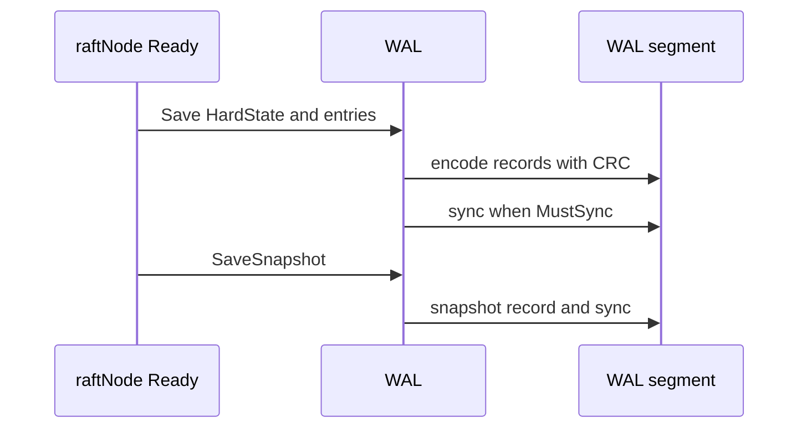

# 第5章 WAL

> 本章で読むソース
>
> - [`server/storage/wal/wal.go`](https://github.com/etcd-io/etcd/blob/v3.6.12/server/storage/wal/wal.go)
> - [`server/storage/wal/encoder.go`](https://github.com/etcd-io/etcd/blob/v3.6.12/server/storage/wal/encoder.go)

## この章の狙い

本章では **WAL** が Raft の HardState、entry、snapshot marker をどの順序で保存するかを読む。
クラッシュ後にどこから再生できるかを、segment、CRC、fsync の観点で整理する。

## 前提

WAL は MVCC の key value ではなく、Raft log と HardState の永続化である。
backend の consistent index と WAL の commit index は、復旧時に突き合わせて使われる。

## 全体の流れ



## WAL の保持状態

`WAL` は現在の HardState、読み取り開始 snapshot、encoder、locked files、file pipeline を持つ。
ファイル名が増加する複数 segment を前提にして、最後に保存した entry index を `enti` として追跡する。

`WAL` は metadata、HardState、decoder、encoder、locked files を持つ。

[server/storage/wal/wal.go L72-L100](https://github.com/etcd-io/etcd/blob/v3.6.12/server/storage/wal/wal.go#L72-L100)

```go
type WAL struct {
	lg *zap.Logger

	dir string // the living directory of the underlay files

	// dirFile is a fd for the wal directory for syncing on Rename
	dirFile *os.File

	metadata []byte           // metadata recorded at the head of each WAL
	state    raftpb.HardState // hardstate recorded at the head of WAL

	start     walpb.Snapshot // snapshot to start reading
	decoder   Decoder        // decoder to Decode records
	readClose func() error   // closer for Decode reader

	unsafeNoSync bool // if set, do not fsync

	mu      sync.Mutex
	enti    uint64   // index of the last entry saved to the wal
	encoder *encoder // encoder to encode records

	locks []*fileutil.LockedFile // the locked files the WAL holds (the name is increasing)
	fp    *filePipeline
}

// Create creates a WAL ready for appending records. The given metadata is
// recorded at the head of each WAL file, and can be retrieved with ReadAll
// after the file is Open.
func Create(lg *zap.Logger, dirpath string, metadata []byte) (*WAL, error) {
```

## entry と HardState をまとめて保存する

`Save` は空の HardState と entry を短絡し、必要な場合だけ `MustSync` の判定に従って fsync する。
segment サイズを超えた場合は `cut` に進み、長い WAL を一定サイズのファイルに分割する。

`Save` は entry、HardState、sync、segment cut を一つの排他区間で扱う。

[server/storage/wal/wal.go L955-L991](https://github.com/etcd-io/etcd/blob/v3.6.12/server/storage/wal/wal.go#L955-L991)

```go
func (w *WAL) Save(st raftpb.HardState, ents []raftpb.Entry) error {
	w.mu.Lock()
	defer w.mu.Unlock()

	// short cut, do not call sync
	if raft.IsEmptyHardState(st) && len(ents) == 0 {
		return nil
	}

	mustSync := raft.MustSync(st, w.state, len(ents))

	// TODO(xiangli): no more reference operator
	for i := range ents {
		if err := w.saveEntry(&ents[i]); err != nil {
			return err
		}
	}
	if err := w.saveState(&st); err != nil {
		return err
	}

	curOff, err := w.tail().Seek(0, io.SeekCurrent)
	if err != nil {
		return err
	}
	if curOff < SegmentSizeBytes {
		if mustSync {
			// gofail: var walBeforeSync struct{}
			err = w.sync()
			// gofail: var walAfterSync struct{}
			return err
		}
		return nil
	}

	return w.cut()
}
```

`encoder` は CRC を更新し、1 MiB buffer を使って record を marshal する。

[server/storage/wal/encoder.go L44-L90](https://github.com/etcd-io/etcd/blob/v3.6.12/server/storage/wal/encoder.go#L44-L90)

```go
func newEncoder(w io.Writer, prevCrc uint32, pageOffset int) *encoder {
	return &encoder{
		bw:  ioutil.NewPageWriter(w, walPageBytes, pageOffset),
		crc: crc.New(prevCrc, crcTable),
		// 1MB buffer
		buf:       make([]byte, 1024*1024),
		uint64buf: make([]byte, 8),
	}
}

// newFileEncoder creates a new encoder with current file offset for the page writer.
func newFileEncoder(f *os.File, prevCrc uint32) (*encoder, error) {
	offset, err := f.Seek(0, io.SeekCurrent)
	if err != nil {
		return nil, err
	}
	return newEncoder(f, prevCrc, int(offset)), nil
}

func (e *encoder) encode(rec *walpb.Record) error {
	e.mu.Lock()
	defer e.mu.Unlock()

	e.crc.Write(rec.Data)
	rec.Crc = e.crc.Sum32()
	var (
		data []byte
		err  error
		n    int
	)

	if rec.Size() > len(e.buf) {
		data, err = rec.Marshal()
		if err != nil {
			return err
		}
	} else {
		n, err = rec.MarshalTo(e.buf)
		if err != nil {
			return err
		}
		data = e.buf[:n]
	}

	data, lenField := prepareDataWithPadding(data)

	return write(e.bw, e.uint64buf, data, lenField)
```

## WAL を先頭から再生する

`ReadAll` は segment を順に decode し、HardState と entry を復元する。
snapshot 以降の entry だけを slice に載せ、破損時は panic 前にエラーを返す。

[`server/storage/wal/wal.go` L467-L499](https://github.com/etcd-io/etcd/blob/v3.6.12/server/storage/wal/wal.go#L467-L499)

```go
// ReadAll may return uncommitted yet entries, that are subject to be overridden.
// Do not apply entries that have index > state.commit, as they are subject to change.
func (w *WAL) ReadAll() (metadata []byte, state raftpb.HardState, ents []raftpb.Entry, err error) {
	w.mu.Lock()
	defer w.mu.Unlock()

	rec := &walpb.Record{}

	if w.decoder == nil {
		return nil, state, nil, ErrDecoderNotFound
	}
	decoder := w.decoder

	var match bool
	for err = decoder.Decode(rec); err == nil; err = decoder.Decode(rec) {
		switch rec.Type {
		case EntryType:
			e := MustUnmarshalEntry(rec.Data)
			// 0 <= e.Index-w.start.Index - 1 < len(ents)
			if e.Index > w.start.Index {
				// prevent "panic: runtime error: slice bounds out of range [:13038096702221461992] with capacity 0"
				offset := e.Index - w.start.Index - 1
				if offset > uint64(len(ents)) {
					// return error before append call causes runtime panic.
					// We still return the continuous WAL entries that have already been read.
					// Refer to https://github.com/etcd-io/etcd/pull/19038#issuecomment-2557414292.
					return nil, state, ents, fmt.Errorf("%w, snapshot[Index: %d, Term: %d], current entry[Index: %d, Term: %d], len(ents): %d",
						ErrSliceOutOfRange, w.start.Index, w.start.Term, e.Index, e.Term, len(ents))
				}
				// The line below is potentially overriding some 'uncommitted' entries.
				ents = append(ents[:offset], e)
			}
			w.enti = e.Index
```

segment サイズを超えたあとは `cut` で次の WAL file へ切り替える。

[`server/storage/wal/wal.go` L743-L766](https://github.com/etcd-io/etcd/blob/v3.6.12/server/storage/wal/wal.go#L743-L766)

```go
// cut first creates a temp wal file and writes necessary headers into it.
// Then cut atomically rename temp wal file to a wal file.
func (w *WAL) cut() error {
	// close old wal file; truncate to avoid wasting space if an early cut
	off, serr := w.tail().Seek(0, io.SeekCurrent)
	if serr != nil {
		return serr
	}

	if err := w.tail().Truncate(off); err != nil {
		return err
	}

	if err := w.sync(); err != nil {
		return err
	}

	fpath := filepath.Join(w.dir, walName(w.seq()+1, w.enti+1))

	// create a temp wal file with name sequence + 1, or truncate the existing one
	newTail, err := w.fp.Open()
	if err != nil {
		return err
	}
```

snapshot marker は WAL へ `SnapshotType` record として書き、index を `enti` に反映する。

[`server/storage/wal/wal.go` L993-L1011](https://github.com/etcd-io/etcd/blob/v3.6.12/server/storage/wal/wal.go#L993-L1011)

```go
func (w *WAL) SaveSnapshot(e walpb.Snapshot) error {
	if err := walpb.ValidateSnapshotForWrite(&e); err != nil {
		return err
	}

	b := pbutil.MustMarshal(&e)

	w.mu.Lock()
	defer w.mu.Unlock()

	rec := &walpb.Record{Type: SnapshotType, Data: b}
	if err := w.encoder.encode(rec); err != nil {
		return err
	}
	// update enti only when snapshot is ahead of last index
	if w.enti < e.Index {
		w.enti = e.Index
	}
	return w.sync()
}
```

## 最適化の工夫

`Save` は `raft.IsEmptyHardState` かつ entry なしの呼び出しを即時 return し、心拍中心の Ready 処理で不要な sync 判定を避ける。
`encoder` は通常の record を再利用 buffer に marshal し、大きな record のときだけ別 slice を作るため、WAL 書き込み時の割り当てを抑える。

## まとめ

- WAL は Raft の順序と耐久性を支え、backend の key value とは別の復旧軸を持つ。
- CRC と segment cut と必要時 sync が、破損検出と書き込み負荷の釣り合いを取る。

## 関連する章

- [backend と bbolt](03-backend-bbolt.md)
- [スナップショット](../part02-mvcc/09-snapshot.md)
- [etcdserver の Raft ループ](../part03-raft/10-etcdserver-raft.md)
