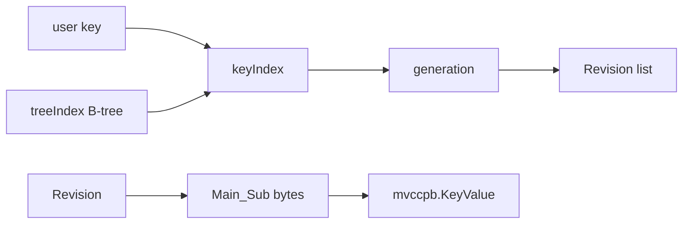

# 第6章 MVCC の revision index

> 本章で読むソース
>
> - [`server/storage/mvcc/revision.go`](https://github.com/etcd-io/etcd/blob/v3.6.12/server/storage/mvcc/revision.go)
> - [`server/storage/mvcc/index.go`](https://github.com/etcd-io/etcd/blob/v3.6.12/server/storage/mvcc/index.go)
> - [`server/storage/mvcc/key_index.go`](https://github.com/etcd-io/etcd/blob/v3.6.12/server/storage/mvcc/key_index.go)

## この章の狙い

本章では **リビジョン** を backend key と in memory index の両面から読む。
Main と Sub の二段 revision、`treeIndex`、`keyIndex`、`generation` がどの役割を分担するかを確認する。

## 前提

MVCC は同じ user key に複数の履歴を持つ。
backend の key bucket には user key ではなく、revision を byte 列にした key が格納される。

## 全体の流れ



## revision を byte key に変換する

`Revision` は atomic な変更単位を示す `Main` と、その中の個別変更を示す `Sub` を持つ。
`RevToBytes` はこの二つを backend の key に変換し、削除 marker の有無も同じ key 空間に入れる。

`Revision` と `BucketKey` は Main、Sub、tombstone を byte key に落とす。

[server/storage/mvcc/revision.go L35-L95](https://github.com/etcd-io/etcd/blob/v3.6.12/server/storage/mvcc/revision.go#L35-L95)

```go
type Revision struct {
	// Main is the main revision of a set of changes that happen atomically.
	Main int64
	// Sub is the sub revision of a change in a set of changes that happen
	// atomically. Each change has different increasing sub revision in that
	// set.
	Sub int64
}

func (a Revision) GreaterThan(b Revision) bool {
	if a.Main > b.Main {
		return true
	}
	if a.Main < b.Main {
		return false
	}
	return a.Sub > b.Sub
}

func RevToBytes(rev Revision, bytes []byte) []byte {
	return BucketKeyToBytes(newBucketKey(rev.Main, rev.Sub, false), bytes)
}

func BytesToRev(bytes []byte) Revision {
	return BytesToBucketKey(bytes).Revision
}

// BucketKey indicates modification of the key-value space.
// The set of changes that share same main revision changes the key-value space atomically.
type BucketKey struct {
	Revision
	tombstone bool
}

func newBucketKey(main, sub int64, isTombstone bool) BucketKey {
	return BucketKey{
		Revision: Revision{
			Main: main,
			Sub:  sub,
		},
		tombstone: isTombstone,
	}
}

func NewRevBytes() []byte {
	return make([]byte, revBytesLen, markedRevBytesLen)
}

func BucketKeyToBytes(rev BucketKey, bytes []byte) []byte {
	binary.BigEndian.PutUint64(bytes, uint64(rev.Main))
	bytes[8] = '_'
	binary.BigEndian.PutUint64(bytes[9:], uint64(rev.Sub))
	if rev.tombstone {
		switch len(bytes) {
		case revBytesLen:
			bytes = append(bytes, markTombstone)
		case markedRevBytesLen:
			bytes[markBytePosition] = markTombstone
		}
	}
	return bytes
```

## user key から revision を引く

`treeIndex` は user key を `keyIndex` に対応付ける B-tree である。
range read では B-tree の key 範囲を走査し、各 `keyIndex` から指定 revision 時点で有効な revision を得る。

`treeIndex.Put` は user key ごとの `keyIndex` を B-tree に登録する。

[server/storage/mvcc/index.go L39-L66](https://github.com/etcd-io/etcd/blob/v3.6.12/server/storage/mvcc/index.go#L39-L66)

```go
type treeIndex struct {
	sync.RWMutex
	tree *btree.BTreeG[*keyIndex]
	lg   *zap.Logger
}

func newTreeIndex(lg *zap.Logger) index {
	return &treeIndex{
		tree: btree.NewG(32, func(aki *keyIndex, bki *keyIndex) bool {
			return aki.Less(bki)
		}),
		lg: lg,
	}
}

func (ti *treeIndex) Put(key []byte, rev Revision) {
	keyi := &keyIndex{key: key}

	ti.Lock()
	defer ti.Unlock()
	okeyi, ok := ti.tree.Get(keyi)
	if !ok {
		keyi.put(ti.lg, rev.Main, rev.Sub)
		ti.tree.ReplaceOrInsert(keyi)
		return
	}
	okeyi.put(ti.lg, rev.Main, rev.Sub)
}
```

`treeIndex.Range` と `Compact` は B-tree を使って範囲探索と古い revision の整理を行う。

[server/storage/mvcc/index.go L158-L205](https://github.com/etcd-io/etcd/blob/v3.6.12/server/storage/mvcc/index.go#L158-L205)

```go
func (ti *treeIndex) Range(key, end []byte, atRev int64) (keys [][]byte, revs []Revision) {
	ti.RLock()
	defer ti.RUnlock()

	if end == nil {
		rev, _, _, err := ti.unsafeGet(key, atRev)
		if err != nil {
			return nil, nil
		}
		return [][]byte{key}, []Revision{rev}
	}
	ti.unsafeVisit(key, end, func(ki *keyIndex) bool {
		if rev, _, _, err := ki.get(ti.lg, atRev); err == nil {
			revs = append(revs, rev)
			keys = append(keys, ki.key)
		}
		return true
	})
	return keys, revs
}

func (ti *treeIndex) Tombstone(key []byte, rev Revision) error {
	keyi := &keyIndex{key: key}

	ti.Lock()
	defer ti.Unlock()
	ki, ok := ti.tree.Get(keyi)
	if !ok {
		return ErrRevisionNotFound
	}

	return ki.tombstone(ti.lg, rev.Main, rev.Sub)
}

func (ti *treeIndex) Compact(rev int64) map[Revision]struct{} {
	available := make(map[Revision]struct{})
	ti.lg.Info("compact tree index", zap.Int64("revision", rev))
	ti.Lock()
	clone := ti.tree.Clone()
	ti.Unlock()

	clone.Ascend(func(keyi *keyIndex) bool {
		// Lock is needed here to prevent modification to the keyIndex while
		// compaction is going on or revision added to empty before deletion
		ti.Lock()
		keyi.compact(ti.lg, rev, available)
		if keyi.isEmpty() {
			_, ok := ti.tree.Delete(keyi)
```

`keyIndex.put` は generation に revision を追加し、作成 revision と version を更新する。

[server/storage/mvcc/key_index.go L73-L103](https://github.com/etcd-io/etcd/blob/v3.6.12/server/storage/mvcc/key_index.go#L73-L103)

```go
type keyIndex struct {
	key         []byte
	modified    Revision // the main rev of the last modification
	generations []generation
}

// put puts a revision to the keyIndex.
func (ki *keyIndex) put(lg *zap.Logger, main int64, sub int64) {
	rev := Revision{Main: main, Sub: sub}

	if !rev.GreaterThan(ki.modified) {
		lg.Panic(
			"'put' with an unexpected smaller revision",
			zap.Int64("given-revision-main", rev.Main),
			zap.Int64("given-revision-sub", rev.Sub),
			zap.Int64("modified-revision-main", ki.modified.Main),
			zap.Int64("modified-revision-sub", ki.modified.Sub),
		)
	}
	if len(ki.generations) == 0 {
		ki.generations = append(ki.generations, generation{})
	}
	g := &ki.generations[len(ki.generations)-1]
	if len(g.revs) == 0 { // create a new key
		keysGauge.Inc()
		g.created = rev
	}
	g.revs = append(g.revs, rev)
	g.ver++
	ki.modified = rev
}
```

## 最適化の工夫

`treeIndex` は user key 順の B-tree なので、範囲 read は全 revision scan ではなく対象 key 範囲の `keyIndex` だけを訪問できる。
`keyIndex` は revision の履歴だけを持ち、値本体は backend に置くため、in memory index のサイズを値の大きさから切り離せる。

## まとめ

- MVCC の backend key は revision であり、user key は in memory index から revision を得るために使われる。
- B-tree と key 単位の generation が、履歴を保ちながら範囲探索を現実的な計算量に抑える。

## 関連する章

- [backend と bbolt](03-backend-bbolt.md)
- [schema と keyspace](04-schema-keyspace.md)
- [MVCC の read と write](../part02-mvcc/07-mvcc-read-write.md)
- [コンパクション](../part02-mvcc/08-compaction.md)
