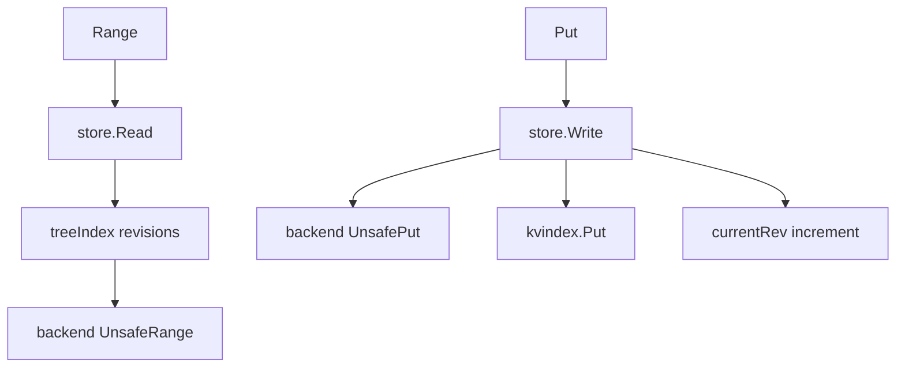

# 第7章 MVCC の read と write

> 本章で読むソース
>
> - [`server/storage/mvcc/kvstore.go`](https://github.com/etcd-io/etcd/blob/v3.6.12/server/storage/mvcc/kvstore.go)
> - [`server/storage/mvcc/kvstore_txn.go`](https://github.com/etcd-io/etcd/blob/v3.6.12/server/storage/mvcc/kvstore_txn.go)

## この章の狙い

本章では MVCC store の read transaction と write transaction を読む。
read が revision index から backend key を得る流れと、write が一つの revision を進める流れを分けて確認する。

## 前提

前章で user key から revision を引く `treeIndex` と `keyIndex` を見た。
本章ではその索引を、実際の Range、Put、DeleteRange がどう使うかを見る。

## 全体の流れ



## store の初期化

`NewStore` は backend、lease lessor、`treeIndex`、hash storage、read view、write view を結線する。
起動時には key bucket と meta bucket を作り、backend から既存状態を restore する。

`NewStore` は `treeIndex` と view を初期化し、bucket 作成後に restore する。

[server/storage/mvcc/kvstore.go L86-L134](https://github.com/etcd-io/etcd/blob/v3.6.12/server/storage/mvcc/kvstore.go#L86-L134)

```go
func NewStore(lg *zap.Logger, b backend.Backend, le lease.Lessor, cfg StoreConfig) *store {
	if lg == nil {
		lg = zap.NewNop()
	}
	if cfg.CompactionBatchLimit == 0 {
		cfg.CompactionBatchLimit = defaultCompactionBatchLimit
	}
	if cfg.CompactionSleepInterval == 0 {
		cfg.CompactionSleepInterval = defaultCompactionSleepInterval
	}
	s := &store{
		cfg:     cfg,
		b:       b,
		kvindex: newTreeIndex(lg),

		le: le,

		currentRev:     1,
		compactMainRev: -1,

		fifoSched: schedule.NewFIFOScheduler(lg),

		stopc: make(chan struct{}),

		lg: lg,
	}
	s.hashes = NewHashStorage(lg, s)
	s.ReadView = &readView{s}
	s.WriteView = &writeView{s}
	if s.le != nil {
		s.le.SetRangeDeleter(func() lease.TxnDelete { return s.Write(traceutil.TODO()) })
	}

	tx := s.b.BatchTx()
	tx.LockOutsideApply()
	tx.UnsafeCreateBucket(schema.Key)
	schema.UnsafeCreateMetaBucket(tx)
	tx.Unlock()
	s.b.ForceCommit()

	s.mu.Lock()
	defer s.mu.Unlock()
	if err := s.restore(); err != nil {
		// TODO: return the error instead of panic here?
		panic("failed to recover store from backend")
	}

	return s
}
```

## read は index から backend へ向かう

`Read` は read mode に応じて concurrent read transaction か共有 read transaction を開く。
`rangeKeys` は指定 revision を決め、`kvindex.Revisions` で revision list を得てから key bucket を読む。

`store.Read` と `rangeKeys` は revision 範囲を検証し、index 経由で backend を読む。

[server/storage/mvcc/kvstore_txn.go L45-L109](https://github.com/etcd-io/etcd/blob/v3.6.12/server/storage/mvcc/kvstore_txn.go#L45-L109)

```go
func (s *store) Read(mode ReadTxMode, trace *traceutil.Trace) TxnRead {
	s.mu.RLock()
	s.revMu.RLock()
	// For read-only workloads, we use shared buffer by copying transaction read buffer
	// for higher concurrency with ongoing blocking writes.
	// For write/write-read transactions, we use the shared buffer
	// rather than duplicating transaction read buffer to avoid transaction overhead.
	var tx backend.ReadTx
	if mode == ConcurrentReadTxMode {
		tx = s.b.ConcurrentReadTx()
	} else {
		tx = s.b.ReadTx()
	}

	tx.RLock() // RLock is no-op. concurrentReadTx does not need to be locked after it is created.
	firstRev, rev := s.compactMainRev, s.currentRev
	s.revMu.RUnlock()
	return newMetricsTxnRead(&storeTxnRead{storeTxnCommon{s, tx, firstRev, rev, trace}, tx})
}

func (tr *storeTxnCommon) FirstRev() int64 { return tr.firstRev }
func (tr *storeTxnCommon) Rev() int64      { return tr.rev }

func (tr *storeTxnCommon) Range(ctx context.Context, key, end []byte, ro RangeOptions) (r *RangeResult, err error) {
	return tr.rangeKeys(ctx, key, end, tr.Rev(), ro)
}

func (tr *storeTxnCommon) rangeKeys(ctx context.Context, key, end []byte, curRev int64, ro RangeOptions) (*RangeResult, error) {
	rev := ro.Rev
	if rev > curRev {
		return &RangeResult{KVs: nil, Count: -1, Rev: curRev}, ErrFutureRev
	}
	if rev <= 0 {
		rev = curRev
	}
	if rev < tr.s.compactMainRev {
		return &RangeResult{KVs: nil, Count: -1, Rev: 0}, ErrCompacted
	}
	if ro.Count {
		total := tr.s.kvindex.CountRevisions(key, end, rev)
		tr.trace.Step("count revisions from in-memory index tree")
		return &RangeResult{KVs: nil, Count: total, Rev: curRev}, nil
	}
	revpairs, total := tr.s.kvindex.Revisions(key, end, rev, int(ro.Limit))
	tr.trace.Step("range keys from in-memory index tree")
	if len(revpairs) == 0 {
		return &RangeResult{KVs: nil, Count: total, Rev: curRev}, nil
	}

	limit := int(ro.Limit)
	if limit <= 0 || limit > len(revpairs) {
		limit = len(revpairs)
	}

	kvs := make([]mvccpb.KeyValue, limit)
	revBytes := NewRevBytes()
	for i, revpair := range revpairs[:len(kvs)] {
		select {
		case <-ctx.Done():
			return nil, fmt.Errorf("rangeKeys: context cancelled: %w", ctx.Err())
		default:
		}
		revBytes = RevToBytes(revpair, revBytes)
		_, vs := tr.tx.UnsafeRange(schema.Key, revBytes, nil, 0)
		if len(vs) != 1 {
```

## write は一つの revision にまとめる

`Write` は apply 内で `BatchTx` を lock し、transaction 内の変更を `changes` に蓄える。
`End` は変更があったときだけ `currentRev` を進めるため、read only transaction は revision を消費しない。

`storeTxnWrite` は `beginRev + 1` を変更の revision として使い、`End` で `currentRev` を進める。

[server/storage/mvcc/kvstore_txn.go L147-L223](https://github.com/etcd-io/etcd/blob/v3.6.12/server/storage/mvcc/kvstore_txn.go#L147-L223)

```go
func (s *store) Write(trace *traceutil.Trace) TxnWrite {
	s.mu.RLock()
	tx := s.b.BatchTx()
	tx.LockInsideApply()
	tw := &storeTxnWrite{
		storeTxnCommon: storeTxnCommon{s, tx, 0, 0, trace},
		tx:             tx,
		beginRev:       s.currentRev,
		changes:        make([]mvccpb.KeyValue, 0, 4),
	}
	return newMetricsTxnWrite(tw)
}

func (tw *storeTxnWrite) Rev() int64 { return tw.beginRev }

func (tw *storeTxnWrite) Range(ctx context.Context, key, end []byte, ro RangeOptions) (r *RangeResult, err error) {
	rev := tw.beginRev
	if len(tw.changes) > 0 {
		rev++
	}
	return tw.rangeKeys(ctx, key, end, rev, ro)
}

func (tw *storeTxnWrite) DeleteRange(key, end []byte) (int64, int64) {
	if n := tw.deleteRange(key, end); n != 0 || len(tw.changes) > 0 {
		return n, tw.beginRev + 1
	}
	return 0, tw.beginRev
}

func (tw *storeTxnWrite) Put(key, value []byte, lease lease.LeaseID) int64 {
	tw.put(key, value, lease)
	return tw.beginRev + 1
}

func (tw *storeTxnWrite) End() {
	// only update index if the txn modifies the mvcc state.
	if len(tw.changes) != 0 {
		// hold revMu lock to prevent new read txns from opening until writeback.
		tw.s.revMu.Lock()
		tw.s.currentRev++
	}
	tw.tx.Unlock()
	if len(tw.changes) != 0 {
		tw.s.revMu.Unlock()
	}
	tw.s.mu.RUnlock()
}

func (tw *storeTxnWrite) put(key, value []byte, leaseID lease.LeaseID) {
	rev := tw.beginRev + 1
	c := rev
	oldLease := lease.NoLease

	// if the key exists before, use its previous created and
	// get its previous leaseID
	_, created, ver, err := tw.s.kvindex.Get(key, rev)
	if err == nil {
		c = created.Main
		oldLease = tw.s.le.GetLease(lease.LeaseItem{Key: string(key)})
		tw.trace.Step("get key's previous created_revision and leaseID")
	}
	ibytes := NewRevBytes()
	idxRev := Revision{Main: rev, Sub: int64(len(tw.changes))}
	ibytes = RevToBytes(idxRev, ibytes)

	ver = ver + 1
	kv := mvccpb.KeyValue{
		Key:            key,
		Value:          value,
		CreateRevision: c,
		ModRevision:    rev,
		Version:        ver,
		Lease:          int64(leaseID),
	}

	d, err := kv.Marshal()
```

`put` は backend へ revision key を書き、index と changes に反映する。

[`server/storage/mvcc/kvstore_txn.go` L196-L235](https://github.com/etcd-io/etcd/blob/v3.6.12/server/storage/mvcc/kvstore_txn.go#L196-L235)

```go
func (tw *storeTxnWrite) put(key, value []byte, leaseID lease.LeaseID) {
	rev := tw.beginRev + 1
	c := rev
	oldLease := lease.NoLease

	// if the key exists before, use its previous created and
	// get its previous leaseID
	_, created, ver, err := tw.s.kvindex.Get(key, rev)
	if err == nil {
		c = created.Main
		oldLease = tw.s.le.GetLease(lease.LeaseItem{Key: string(key)})
		tw.trace.Step("get key's previous created_revision and leaseID")
	}
	ibytes := NewRevBytes()
	idxRev := Revision{Main: rev, Sub: int64(len(tw.changes))}
	ibytes = RevToBytes(idxRev, ibytes)

	ver = ver + 1
	kv := mvccpb.KeyValue{
		Key:            key,
		Value:          value,
		CreateRevision: c,
		ModRevision:    rev,
		Version:        ver,
		Lease:          int64(leaseID),
	}

	d, err := kv.Marshal()
	if err != nil {
		tw.storeTxnCommon.s.lg.Fatal(
			"failed to marshal mvccpb.KeyValue",
			zap.Error(err),
		)
	}

	tw.trace.Step("marshal mvccpb.KeyValue")
	tw.tx.UnsafeSeqPut(schema.Key, ibytes, d)
	tw.s.kvindex.Put(key, idxRev)
	tw.changes = append(tw.changes, kv)
	tw.trace.Step("store kv pair into bolt db")
```

`deleteRange` は index から対象 key を集め、各 key を tombstone 付き revision として削除する。

[`server/storage/mvcc/kvstore_txn.go` L266-L279](https://github.com/etcd-io/etcd/blob/v3.6.12/server/storage/mvcc/kvstore_txn.go#L266-L279)

```go
func (tw *storeTxnWrite) deleteRange(key, end []byte) int64 {
	rrev := tw.beginRev
	if len(tw.changes) > 0 {
		rrev++
	}
	keys, _ := tw.s.kvindex.Range(key, end, rrev)
	if len(keys) == 0 {
		return 0
	}
	for _, key := range keys {
		tw.delete(key)
	}
	return int64(len(keys))
}
```

起動時の `restore` は finished compact revision を読み、key bucket を chunk 単位で index に戻す。

[`server/storage/mvcc/kvstore.go` L316-L348](https://github.com/etcd-io/etcd/blob/v3.6.12/server/storage/mvcc/kvstore.go#L316-L348)

```go
func (s *store) restore() error {
	s.setupMetricsReporter()

	min, max := NewRevBytes(), NewRevBytes()
	min = RevToBytes(Revision{Main: 1}, min)
	max = RevToBytes(Revision{Main: math.MaxInt64, Sub: math.MaxInt64}, max)

	keyToLease := make(map[string]lease.LeaseID)

	// restore index
	tx := s.b.ReadTx()
	tx.RLock()

	finishedCompact, found := UnsafeReadFinishedCompact(tx)
	if found {
		s.revMu.Lock()
		s.compactMainRev = finishedCompact

		s.lg.Info(
			"restored last compact revision",
			zap.String("meta-bucket-name-key", string(schema.FinishedCompactKeyName)),
			zap.Int64("restored-compact-revision", s.compactMainRev),
		)
		s.revMu.Unlock()
	}
	scheduledCompact, _ := UnsafeReadScheduledCompact(tx)
	// index keys concurrently as they're loaded in from tx
	keysGauge.Set(0)
	rkvc, revc := restoreIntoIndex(s.lg, s.kvindex)
	for {
		keys, vals := tx.UnsafeRange(schema.Key, min, max, int64(restoreChunkKeys))
		if len(keys) == 0 {
			break
```

## 最適化の工夫

read only workload では `ConcurrentReadTxMode` が transaction read buffer を copy して ongoing write と競合しにくくし、write を含む transaction では共有 buffer を使って余分な copy を避ける。

## まとめ

- MVCC read は index を先に引き、backend から必要な revision の値だけを読む。
- MVCC write は apply の直列化を前提に、transaction の変更を一つの Main revision にまとめる。

## 関連する章

- [MVCC の revision index](../part01-storage/06-mvcc-revision-index.md)
- [コンパクション](08-compaction.md)
- [transaction](../part04-txn-lease-watch/13-transaction.md)
- [KV Range](../part05-api-auth/17-kv-range.md)
