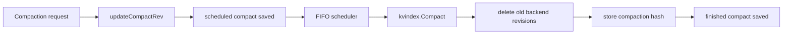

# 第8章 コンパクション

> 本章で読むソース
>
> - [`server/storage/mvcc/kvstore.go`](https://github.com/etcd-io/etcd/blob/v3.6.12/server/storage/mvcc/kvstore.go)
> - [`server/storage/mvcc/kvstore_compaction.go`](https://github.com/etcd-io/etcd/blob/v3.6.12/server/storage/mvcc/kvstore_compaction.go)
> - [`server/etcdserver/api/v3compactor/revision.go`](https://github.com/etcd-io/etcd/blob/v3.6.12/server/etcdserver/api/v3compactor/revision.go)

## この章の狙い

本章では **コンパクション** が古い revision を削除し、読み取り可能な履歴範囲を前に進める仕組みを読む。
スケジュールされた compaction revision、index compaction、backend key 削除、hash 保存の順序を確認する。

## 前提

MVCC は履歴を保持するため、放置すると key bucket が増え続ける。
コンパクションは履歴の削除であり、bbolt のファイル縮小である defrag とは別の処理である。

## 全体の流れ



## compact revision を先に永続化する

`updateCompactRev` は過去の compaction と未来 revision を検査し、`compactMainRev` を更新する。
その直後に scheduled compact を backend に保存して `ForceCommit` するため、途中で落ちても再開時に意図が残る。

`updateCompactRev` は compact revision を更新し、scheduled compact を commit する。

[server/storage/mvcc/kvstore.go L196-L220](https://github.com/etcd-io/etcd/blob/v3.6.12/server/storage/mvcc/kvstore.go#L196-L220)

```go
func (s *store) updateCompactRev(rev int64) (<-chan struct{}, int64, error) {
	s.revMu.Lock()
	if rev <= s.compactMainRev {
		ch := make(chan struct{})
		f := schedule.NewJob("kvstore_updateCompactRev_compactBarrier", func(ctx context.Context) { s.compactBarrier(ctx, ch) })
		s.fifoSched.Schedule(f)
		s.revMu.Unlock()
		return ch, 0, ErrCompacted
	}
	if rev > s.currentRev {
		s.revMu.Unlock()
		return nil, 0, ErrFutureRev
	}
	compactMainRev := s.compactMainRev
	s.compactMainRev = rev

	SetScheduledCompact(s.b.BatchTx(), rev)
	// ensure that desired compaction is persisted
	// gofail: var compactBeforeCommitScheduledCompact struct{}
	s.b.ForceCommit()
	// gofail: var compactAfterCommitScheduledCompact struct{}

	s.revMu.Unlock()

	return nil, compactMainRev, nil
```

## 削除は FIFO job と batch で進む

`compact` は FIFO scheduler に job を積み、apply path の外側で実際の削除を実行する。
`scheduleCompaction` は index から保持すべき revision を得て、key bucket を batch ごとに走査して不要な revision を削除する。

`compact` は compaction job を FIFO scheduler に積み、完了時に hash を保存する。

[server/storage/mvcc/kvstore.go L233-L282](https://github.com/etcd-io/etcd/blob/v3.6.12/server/storage/mvcc/kvstore.go#L233-L282)

```go
func (s *store) compact(trace *traceutil.Trace, rev, prevCompactRev int64, prevCompactionCompleted bool) <-chan struct{} {
	ch := make(chan struct{})
	j := schedule.NewJob("kvstore_compact", func(ctx context.Context) {
		if ctx.Err() != nil {
			s.compactBarrier(ctx, ch)
			return
		}
		hash, err := s.scheduleCompaction(rev, prevCompactRev)
		if err != nil {
			s.lg.Warn("Failed compaction", zap.Error(err))
			s.compactBarrier(context.TODO(), ch)
			return
		}
		// Only store the hash value if the previous hash is completed, i.e. this compaction
		// hashes every revision from last compaction. For more details, see #15919.
		if prevCompactionCompleted {
			s.hashes.Store(hash)
		} else {
			s.lg.Info("previous compaction was interrupted, skip storing compaction hash value")
		}
		close(ch)
	})

	s.fifoSched.Schedule(j)
	trace.Step("schedule compaction")
	return ch
}

func (s *store) compactLockfree(rev int64) (<-chan struct{}, error) {
	prevCompactionCompleted := s.checkPrevCompactionCompleted()
	ch, prevCompactRev, err := s.updateCompactRev(rev)
	if err != nil {
		return ch, err
	}

	return s.compact(traceutil.TODO(), rev, prevCompactRev, prevCompactionCompleted), nil
}

func (s *store) Compact(trace *traceutil.Trace, rev int64) (<-chan struct{}, error) {
	s.mu.Lock()
	prevCompactionCompleted := s.checkPrevCompactionCompleted()
	ch, prevCompactRev, err := s.updateCompactRev(rev)
	trace.Step("check and update compact revision")
	if err != nil {
		s.mu.Unlock()
		return ch, err
	}
	s.mu.Unlock()

	return s.compact(trace, rev, prevCompactRev, prevCompactionCompleted), nil
```

`scheduleCompaction` は key bucket を batch で走査し、不要 revision を削除する。

[server/storage/mvcc/kvstore_compaction.go L28-L98](https://github.com/etcd-io/etcd/blob/v3.6.12/server/storage/mvcc/kvstore_compaction.go#L28-L98)

```go
func (s *store) scheduleCompaction(compactMainRev, prevCompactRev int64) (KeyValueHash, error) {
	totalStart := time.Now()
	keep := s.kvindex.Compact(compactMainRev)
	indexCompactionPauseMs.Observe(float64(time.Since(totalStart) / time.Millisecond))

	totalStart = time.Now()
	defer func() { dbCompactionTotalMs.Observe(float64(time.Since(totalStart) / time.Millisecond)) }()
	keyCompactions := 0
	defer func() { dbCompactionKeysCounter.Add(float64(keyCompactions)) }()
	defer func() { dbCompactionLast.Set(float64(time.Now().Unix())) }()

	end := make([]byte, 8)
	binary.BigEndian.PutUint64(end, uint64(compactMainRev+1))

	batchNum := s.cfg.CompactionBatchLimit
	h := newKVHasher(prevCompactRev, compactMainRev, keep)
	last := make([]byte, 8+1+8)
	for {
		var rev Revision

		start := time.Now()

		tx := s.b.BatchTx()
		tx.LockOutsideApply()
		keys, values := tx.UnsafeRange(schema.Key, last, end, int64(batchNum))
		for i := range keys {
			rev = BytesToRev(keys[i])
			if _, ok := keep[rev]; !ok {
				tx.UnsafeDelete(schema.Key, keys[i])
				keyCompactions++
			}
			h.WriteKeyValue(keys[i], values[i])
		}

		if len(keys) < batchNum {
			// gofail: var compactBeforeSetFinishedCompact struct{}
			UnsafeSetFinishedCompact(tx, compactMainRev)
			tx.Unlock()
			dbCompactionPauseMs.Observe(float64(time.Since(start) / time.Millisecond))
			// gofail: var compactAfterSetFinishedCompact struct{}
			hash := h.Hash()
			size, sizeInUse := s.b.Size(), s.b.SizeInUse()
			s.lg.Info(
				"finished scheduled compaction",
				zap.Int64("compact-revision", compactMainRev),
				zap.Duration("took", time.Since(totalStart)),
				zap.Uint32("hash", hash.Hash),
				zap.Int64("current-db-size-bytes", size),
				zap.String("current-db-size", humanize.Bytes(uint64(size))),
				zap.Int64("current-db-size-in-use-bytes", sizeInUse),
				zap.String("current-db-size-in-use", humanize.Bytes(uint64(sizeInUse))),
			)
			return hash, nil
		}

		tx.Unlock()
		// update last
		last = RevToBytes(Revision{Main: rev.Main, Sub: rev.Sub + 1}, last)
		// Immediately commit the compaction deletes instead of letting them accumulate in the write buffer
		// gofail: var compactBeforeCommitBatch struct{}
		s.b.ForceCommit()
		// gofail: var compactAfterCommitBatch struct{}
		dbCompactionPauseMs.Observe(float64(time.Since(start) / time.Millisecond))

		select {
		case <-time.After(s.cfg.CompactionSleepInterval):
		case <-s.stopc:
			return KeyValueHash{}, fmt.Errorf("interrupted due to stop signal")
		}
	}
}
```

## 自動 compaction は revision 差分で起動する

revision mode の compactor は定期的に現在 revision から retention を引き、前回と違う revision だけを compact する。

`Revision.Run` は一定間隔で compaction target を計算し、重複する target を避ける。

[server/etcdserver/api/v3compactor/revision.go L62-L93](https://github.com/etcd-io/etcd/blob/v3.6.12/server/etcdserver/api/v3compactor/revision.go#L62-L93)

```go
const revInterval = 5 * time.Minute

// Run runs revision-based compactor.
func (rc *Revision) Run() {
	prev := int64(0)
	go func() {
		for {
			select {
			case <-rc.ctx.Done():
				return
			case <-rc.clock.After(revInterval):
				rc.mu.Lock()
				p := rc.paused
				rc.mu.Unlock()
				if p {
					continue
				}
			}

			rev := rc.rg.Rev() - rc.retention
			if rev <= 0 || rev == prev {
				continue
			}

			now := time.Now()
			rc.lg.Info(
				"starting auto revision compaction",
				zap.Int64("revision", rev),
				zap.Int64("revision-compaction-retention", rc.retention),
			)
			_, err := rc.c.Compact(rc.ctx, &pb.CompactionRequest{Revision: rev})
			if err == nil || errors.Is(err, mvcc.ErrCompacted) {
```

前回 compaction の完了可否は scheduled と finished compact revision の一致で判定する。

[`server/storage/mvcc/kvstore.go` L223-L231](https://github.com/etcd-io/etcd/blob/v3.6.12/server/storage/mvcc/kvstore.go#L223-L231)

```go
// checkPrevCompactionCompleted checks whether the previous scheduled compaction is completed.
func (s *store) checkPrevCompactionCompleted() bool {
	tx := s.b.ReadTx()
	tx.RLock()
	defer tx.RUnlock()
	scheduledCompact, scheduledCompactFound := UnsafeReadScheduledCompact(tx)
	finishedCompact, finishedCompactFound := UnsafeReadFinishedCompact(tx)
	return scheduledCompact == finishedCompact && scheduledCompactFound == finishedCompactFound
}
```

compaction 待ちの caller には `compactBarrier` が channel close で完了を通知する。

[`server/storage/mvcc/kvstore.go` L136-L153](https://github.com/etcd-io/etcd/blob/v3.6.12/server/storage/mvcc/kvstore.go#L136-L153)

```go
func (s *store) compactBarrier(ctx context.Context, ch chan struct{}) {
	if ctx == nil || ctx.Err() != nil {
		select {
		case <-s.stopc:
		default:
			// fix deadlock in mvcc, for more information, please refer to pr 11817.
			// s.stopc is only updated in restore operation, which is called by apply
			// snapshot call, compaction and apply snapshot requests are serialized by
			// raft, and do not happen at the same time.
			s.mu.Lock()
			f := schedule.NewJob("kvstore_compactBarrier", func(ctx context.Context) { s.compactBarrier(ctx, ch) })
			s.fifoSched.Schedule(f)
			s.mu.Unlock()
		}
		return
	}
	close(ch)
}
```

## 最適化の工夫

`scheduleCompaction` は `CompactionBatchLimit` ごとに削除して `ForceCommit` と sleep を挟むため、大きな履歴削除でも長時間 backend lock を握り続けにくい。

## まとめ

- コンパクションは compact revision の永続化、index の整理、backend key の batch 削除からなる。
- 完了時の hash は破損検査にも使われるため、単なる容量削減ではなく整合性検査の基盤にもなる。

## 関連する章

- [MVCC の revision index](../part01-storage/06-mvcc-revision-index.md)
- [MVCC の read と write](07-mvcc-read-write.md)
- [corruption check](../part07-ops/23-corruption-check.md)
