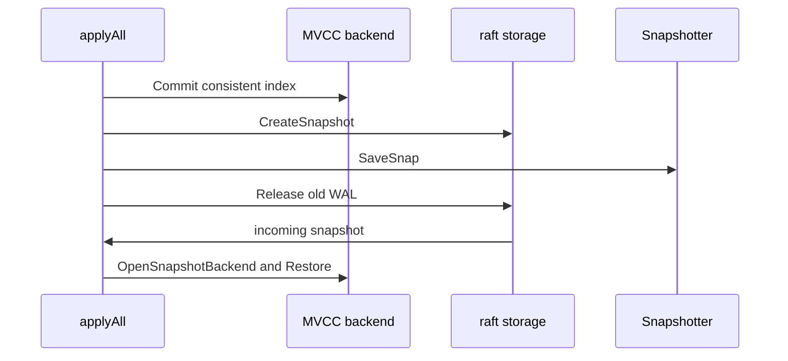

# 第9章 スナップショット

> 本章で読むソース
>
> - [`server/etcdserver/api/snap/snapshotter.go`](https://github.com/etcd-io/etcd/blob/v3.6.12/server/etcdserver/api/snap/snapshotter.go)
> - [`server/etcdserver/server.go`](https://github.com/etcd-io/etcd/blob/v3.6.12/server/etcdserver/server.go)

## この章の狙い

本章では **スナップショット** の保存と適用を読む。
Raft snapshot file、WAL snapshot entry、backend snapshot がどの順序で扱われるかを整理する。

## 前提

WAL はログを保存し、backend は適用後の状態を保存する。
スナップショットはログ再生量を抑えるための境界であり、Raft の snapshot と backend の状態を対応させる必要がある。

## 全体の流れ



## snapshot file を保存する

`Snapshotter` は term と index からファイル名を作り、snapshot protobuf に CRC を付けて fsync 付きで書く。
壊れた snapshot file は load 時に `.broken` へ rename され、次の候補を探せる形にする。

`Snapshotter.save` は snapshot を marshal し、CRC 付きの file として sync 書き込みする。

[server/etcdserver/api/snap/snapshotter.go L53-L104](https://github.com/etcd-io/etcd/blob/v3.6.12/server/etcdserver/api/snap/snapshotter.go#L53-L104)

```go
type Snapshotter struct {
	lg  *zap.Logger
	dir string
}

func New(lg *zap.Logger, dir string) *Snapshotter {
	if lg == nil {
		lg = zap.NewNop()
	}
	return &Snapshotter{
		lg:  lg,
		dir: dir,
	}
}

func (s *Snapshotter) SaveSnap(snapshot raftpb.Snapshot) error {
	if raft.IsEmptySnap(snapshot) {
		return nil
	}
	return s.save(&snapshot)
}

func (s *Snapshotter) save(snapshot *raftpb.Snapshot) error {
	start := time.Now()

	fname := fmt.Sprintf("%016x-%016x%s", snapshot.Metadata.Term, snapshot.Metadata.Index, snapSuffix)
	b := pbutil.MustMarshal(snapshot)
	crc := crc32.Update(0, crcTable, b)
	snap := snappb.Snapshot{Crc: crc, Data: b}
	d, err := snap.Marshal()
	if err != nil {
		return err
	}
	snapMarshallingSec.Observe(time.Since(start).Seconds())

	spath := filepath.Join(s.dir, fname)

	fsyncStart := time.Now()
	err = pioutil.WriteAndSyncFile(spath, d, 0o666)
	snapFsyncSec.Observe(time.Since(fsyncStart).Seconds())

	if err != nil {
		s.lg.Warn("failed to write a snap file", zap.String("path", spath), zap.Error(err))
		rerr := os.Remove(spath)
		if rerr != nil {
			s.lg.Warn("failed to remove a broken snap file", zap.String("path", spath), zap.Error(rerr))
		}
		return err
	}

	snapSaveSec.Observe(time.Since(start).Seconds())
	return nil
```

## apply 側で snapshot を作る

`snapshot` はまず `KV().Commit()` を呼び、backend の consistent index を disk snapshot 以上にしてから Raft snapshot を作る。
その後 `SaveSnap` と WAL release を実行し、古い WAL を保持し続けないようにする。

`snapshot` は backend commit、Raft snapshot 作成、disk 保存、WAL release を順に行う。

[server/etcdserver/server.go L2224-L2258](https://github.com/etcd-io/etcd/blob/v3.6.12/server/etcdserver/server.go#L2224-L2258)

```go
		// commit kv to write metadata (for example: consistent index) to disk.
		//
		// This guarantees that Backend's consistent_index is >= index of last snapshot.
		//
		// KV().commit() updates the consistent index in backend.
		// All operations that update consistent index must be called sequentially
		// from applyAll function.
		// So KV().Commit() cannot run in parallel with toApply. It has to be called outside
		// the go routine created below.
		s.KV().Commit()
	}

	// For backward compatibility, generate v2 snapshot from v3 state.
	snap, err := s.r.raftStorage.CreateSnapshot(ep.appliedi, &ep.confState, d)
	if err != nil {
		// the snapshot was done asynchronously with the progress of raft.
		// raft might have already got a newer snapshot.
		if errorspkg.Is(err, raft.ErrSnapOutOfDate) {
			return
		}
		lg.Panic("failed to create snapshot", zap.Error(err))
	}
	ep.memorySnapshotIndex = ep.appliedi

	verifyConsistentIndexIsLatest(lg, snap, s.consistIndex.ConsistentIndex())

	if toDisk {
		// SaveSnap saves the snapshot to file and appends the corresponding WAL entry.
		if err = s.r.storage.SaveSnap(snap); err != nil {
			lg.Panic("failed to save snapshot", zap.Error(err))
		}
		ep.diskSnapshotIndex = ep.appliedi
		if err = s.r.storage.Release(snap); err != nil {
			lg.Panic("failed to release wal", zap.Error(err))
		}
```

## 受信 snapshot を適用する

`applySnapshot` は Raft 側が snapshot を disk に保存するまで待ち、新しい snapshot backend を開く。
復元順序は consistent index、lessor、MVCC store の順で、lease と key の対応を壊さないようにしている。

`applySnapshot` は snapshot backend を開き、consistent index、lessor、MVCC の順で復元する。

[server/etcdserver/server.go L1006-L1089](https://github.com/etcd-io/etcd/blob/v3.6.12/server/etcdserver/server.go#L1006-L1089)

```go
func (s *EtcdServer) applySnapshot(ep *etcdProgress, toApply *toApply) {
	if raft.IsEmptySnap(toApply.snapshot) {
		return
	}
	applySnapshotInProgress.Inc()

	lg := s.Logger()
	lg.Info(
		"applying snapshot",
		zap.Uint64("current-snapshot-index", ep.diskSnapshotIndex),
		zap.Uint64("current-applied-index", ep.appliedi),
		zap.Uint64("incoming-leader-snapshot-index", toApply.snapshot.Metadata.Index),
		zap.Uint64("incoming-leader-snapshot-term", toApply.snapshot.Metadata.Term),
	)
	defer func() {
		lg.Info(
			"applied snapshot",
			zap.Uint64("current-snapshot-index", ep.diskSnapshotIndex),
			zap.Uint64("current-applied-index", ep.appliedi),
			zap.Uint64("incoming-leader-snapshot-index", toApply.snapshot.Metadata.Index),
			zap.Uint64("incoming-leader-snapshot-term", toApply.snapshot.Metadata.Term),
		)
		applySnapshotInProgress.Dec()
	}()

	if toApply.snapshot.Metadata.Index <= ep.appliedi {
		lg.Panic(
			"unexpected leader snapshot from outdated index",
			zap.Uint64("current-snapshot-index", ep.diskSnapshotIndex),
			zap.Uint64("current-applied-index", ep.appliedi),
			zap.Uint64("incoming-leader-snapshot-index", toApply.snapshot.Metadata.Index),
			zap.Uint64("incoming-leader-snapshot-term", toApply.snapshot.Metadata.Term),
		)
	}

	// wait for raftNode to persist snapshot onto the disk
	<-toApply.notifyc

	bemuUnlocked := false
	s.bemu.Lock()
	defer func() {
		if !bemuUnlocked {
			s.bemu.Unlock()
		}
	}()

	// gofail: var applyBeforeOpenSnapshot struct{}
	newbe, err := serverstorage.OpenSnapshotBackend(s.Cfg, s.snapshotter, toApply.snapshot, s.beHooks)
	if err != nil {
		lg.Panic("failed to open snapshot backend", zap.Error(err))
	}
	lg.Info("applySnapshot: opened snapshot backend")
	// gofail: var applyAfterOpenSnapshot struct{}

	// We need to set the backend to consistIndex before recovering the lessor,
	// because lessor.Recover will commit the boltDB transaction, accordingly it
	// will get the old consistent_index persisted into the db in OnPreCommitUnsafe.
	// Eventually the new consistent_index value coming from snapshot is overwritten
	// by the old value.
	s.consistIndex.SetBackend(newbe)
	verifySnapshotIndex(toApply.snapshot, s.consistIndex.ConsistentIndex())

	// always recover lessor before kv. When we recover the mvcc.KV it will reattach keys to its leases.
	// If we recover mvcc.KV first, it will attach the keys to the wrong lessor before it recovers.
	if s.lessor != nil {
		lg.Info("restoring lease store")

		s.lessor.Recover(newbe, func() lease.TxnDelete { return s.kv.Write(traceutil.TODO()) })

		lg.Info("restored lease store")
	}

	lg.Info("restoring mvcc store")

	if err := s.kv.Restore(newbe); err != nil {
		lg.Panic("failed to restore mvcc store", zap.Error(err))
	}

	newbe.SetTxPostLockInsideApplyHook(s.getTxPostLockInsideApplyHook())

	lg.Info("restored mvcc store", zap.Uint64("consistent-index", s.consistIndex.ConsistentIndex()))

	oldbe := s.be
	s.be = newbe
```

復旧時は WAL に載った snapshot metadata と一致する newest file を選ぶ。

[`server/etcdserver/api/snap/snapshotter.go` L112-L123](https://github.com/etcd-io/etcd/blob/v3.6.12/server/etcdserver/api/snap/snapshotter.go#L112-L123)

```go
// LoadNewestAvailable loads the newest snapshot available that is in walSnaps.
func (s *Snapshotter) LoadNewestAvailable(walSnaps []walpb.Snapshot) (*raftpb.Snapshot, error) {
	return s.loadMatching(func(snapshot *raftpb.Snapshot) bool {
		m := snapshot.Metadata
		for i := len(walSnaps) - 1; i >= 0; i-- {
			if m.Term == walSnaps[i].Term && m.Index == walSnaps[i].Index {
				return true
			}
		}
		return false
	})
}
```

壊れた snapshot file は `.broken` へ rename し、次の候補探索を続けられる。

[`server/etcdserver/api/snap/snapshotter.go` L140-L152](https://github.com/etcd-io/etcd/blob/v3.6.12/server/etcdserver/api/snap/snapshotter.go#L140-L152)

```go
func (s *Snapshotter) loadSnap(name string) (*raftpb.Snapshot, error) {
	fpath := filepath.Join(s.dir, name)
	snap, err := Read(s.lg, fpath)
	if err != nil {
		brokenPath := fpath + ".broken"
		s.lg.Warn("failed to read a snap file", zap.String("path", fpath), zap.Error(err))
		if rerr := os.Rename(fpath, brokenPath); rerr != nil {
			s.lg.Warn("failed to rename a broken snap file", zap.String("path", fpath), zap.String("broken-path", brokenPath), zap.Error(rerr))
		} else {
			s.lg.Warn("renamed to a broken snap file", zap.String("path", fpath), zap.String("broken-path", brokenPath))
		}
	}
	return snap, err
}
```

`Read` は file を読み、CRC 付き `snappb.Snapshot` を protobuf へ戻す。

[`server/etcdserver/api/snap/snapshotter.go` L155-L172](https://github.com/etcd-io/etcd/blob/v3.6.12/server/etcdserver/api/snap/snapshotter.go#L155-L172)

```go
// Read reads the snapshot named by snapname and returns the snapshot.
func Read(lg *zap.Logger, snapname string) (*raftpb.Snapshot, error) {
	verify.Assert(lg != nil, "the logger should not be nil")
	b, err := os.ReadFile(snapname)
	if err != nil {
		lg.Warn("failed to read a snap file", zap.String("path", snapname), zap.Error(err))
		return nil, err
	}

	if len(b) == 0 {
		lg.Warn("failed to read empty snapshot file", zap.String("path", snapname))
		return nil, ErrEmptySnapshot
	}

	var serializedSnap snappb.Snapshot
	if err = serializedSnap.Unmarshal(b); err != nil {
		lg.Warn("failed to unmarshal snappb.Snapshot", zap.String("path", snapname), zap.Error(err))
		return nil, err
	}
```

## 最適化の工夫

`Snapshotter.LoadNewestAvailable` は WAL 側に存在する snapshot metadata と一致する newest snapshot を選ぶため、復旧時に不整合な file を最後まで試す回数を減らせる。

## まとめ

- スナップショットは Raft log と backend 状態の対応を保つため、保存順序と適用順序が重要である。
- backend の consistent index は、snapshot index と再適用の境界をつなぐ値になる。

## 関連する章

- [WAL](../part01-storage/05-wal.md)
- [コンパクション](08-compaction.md)
- [etcdserver の Raft ループ](../part03-raft/10-etcdserver-raft.md)
- [apply pipeline](../part03-raft/11-apply-pipeline.md)
