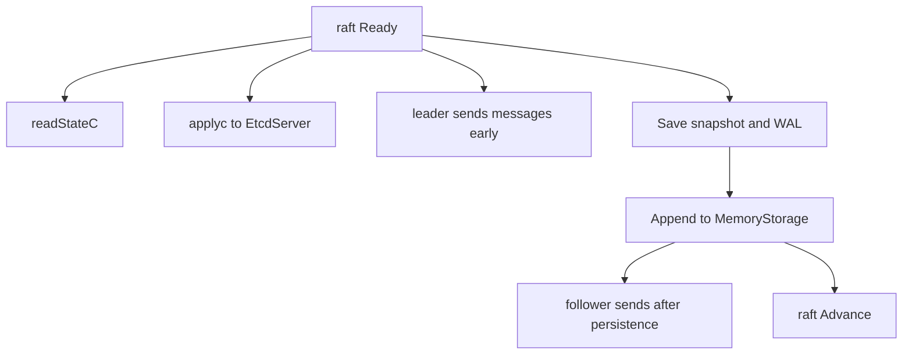

# 第10章 etcdserver の Raft ループ

> 本章で読むソース
>
> - [`server/etcdserver/raft.go`](https://github.com/etcd-io/etcd/blob/v3.6.12/server/etcdserver/raft.go)

## この章の狙い

本章では `raftNode` が Raft library の `Ready` を受け、永続化、送信、適用へ分配するループを読む。
leader と follower で送信順序が違う理由を、disk 書き込みと apply の境界から確認する。

## 前提

Raft library は `Ready` に committed entries、messages、snapshot、HardState をまとめて渡す。
etcdserver はそれをそのまま適用せず、WAL、transport、apply pipeline に順序付けて渡す。

## 全体の流れ



## raftNode の channel

`raftNode` は apply 用の `applyc`、read index 用の `readStateC`、snapshot message 用の `msgSnapC` を持つ。
この channel 分離により、read path、apply path、snapshot path を同じ Raft loop から別々に受けられる。

`raftNode` は `applyc`、`readStateC`、`msgSnapC` と Raft storage を持つ。

[server/etcdserver/raft.go L80-L145](https://github.com/etcd-io/etcd/blob/v3.6.12/server/etcdserver/raft.go#L80-L145)

```go
type raftNode struct {
	lg *zap.Logger

	tickMu *sync.RWMutex
	// timestamp of the latest tick
	latestTickTs time.Time
	raftNodeConfig

	// a chan to send/receive snapshot
	msgSnapC chan raftpb.Message

	// a chan to send out apply
	applyc chan toApply

	// a chan to send out readState
	readStateC chan raft.ReadState

	// utility
	ticker *time.Ticker
	// contention detectors for raft heartbeat message
	td *contention.TimeoutDetector

	stopped chan struct{}
	done    chan struct{}
}

type raftNodeConfig struct {
	lg *zap.Logger

	// to check if msg receiver is removed from cluster
	isIDRemoved func(id uint64) bool
	raft.Node
	raftStorage *raft.MemoryStorage
	storage     serverstorage.Storage
	heartbeat   time.Duration // for logging
	// transport specifies the transport to send and receive msgs to members.
	// Sending messages MUST NOT block. It is okay to drop messages, since
	// clients should timeout and reissue their messages.
	// If transport is nil, server will panic.
	transport rafthttp.Transporter
}

func newRaftNode(cfg raftNodeConfig) *raftNode {
	var lg raft.Logger
	if cfg.lg != nil {
		lg = NewRaftLoggerZap(cfg.lg)
	} else {
		lcfg := logutil.DefaultZapLoggerConfig
		var err error
		lg, err = NewRaftLogger(&lcfg)
		if err != nil {
			log.Fatalf("cannot create raft logger %v", err)
		}
	}
	raft.SetLogger(lg)
	r := &raftNode{
		lg:             cfg.lg,
		tickMu:         new(sync.RWMutex),
		raftNodeConfig: cfg,
		latestTickTs:   time.Now(),
		// set up contention detectors for raft heartbeat message.
		// expect to send a heartbeat within 2 heartbeat intervals.
		td:         contention.NewTimeoutDetector(2 * cfg.heartbeat),
		readStateC: make(chan raft.ReadState, 1),
		msgSnapC:   make(chan raftpb.Message, maxInFlightMsgSnap),
		applyc:     make(chan toApply),
```

## Ready から apply packet を作る

`start` は tick と `Ready` を select し、ReadState を read loop に渡し、committed entries と snapshot を `toApply` にまとめる。
その後、`applyc` に送ってから leader の message 送信や WAL 保存を進める。

`raftNode.start` は Ready を受け、ReadState と `toApply` をそれぞれの channel へ送る。

[server/etcdserver/raft.go L173-L233](https://github.com/etcd-io/etcd/blob/v3.6.12/server/etcdserver/raft.go#L173-L233)

```go
func (r *raftNode) start(rh *raftReadyHandler) {
	internalTimeout := time.Second

	go func() {
		defer r.onStop()
		islead := false

		for {
			select {
			case <-r.ticker.C:
				r.tick()
			case rd := <-r.Ready():
				if rd.SoftState != nil {
					newLeader := rd.SoftState.Lead != raft.None && rh.getLead() != rd.SoftState.Lead
					if newLeader {
						leaderChanges.Inc()
					}

					if rd.SoftState.Lead == raft.None {
						hasLeader.Set(0)
					} else {
						hasLeader.Set(1)
					}

					rh.updateLead(rd.SoftState.Lead)
					islead = rd.RaftState == raft.StateLeader
					if islead {
						isLeader.Set(1)
					} else {
						isLeader.Set(0)
					}
					rh.updateLeadership(newLeader)
					r.td.Reset()
				}

				if len(rd.ReadStates) != 0 {
					select {
					case r.readStateC <- rd.ReadStates[len(rd.ReadStates)-1]:
					case <-time.After(internalTimeout):
						r.lg.Warn("timed out sending read state", zap.Duration("timeout", internalTimeout))
					case <-r.stopped:
						return
					}
				}

				notifyc := make(chan struct{}, 1)
				raftAdvancedC := make(chan struct{}, 1)
				ap := toApply{
					entries:       rd.CommittedEntries,
					snapshot:      rd.Snapshot,
					notifyc:       notifyc,
					raftAdvancedC: raftAdvancedC,
				}

				updateCommittedIndex(&ap, rh)

				select {
				case r.applyc <- ap:
				case <-r.stopped:
					return
				}
```

`Ready` 後半では leader 送信、snapshot 保存、WAL 保存、MemoryStorage 反映、follower 送信、Advance を順に行う。

[server/etcdserver/raft.go L235-L329](https://github.com/etcd-io/etcd/blob/v3.6.12/server/etcdserver/raft.go#L235-L329)

```go
				// the leader can write to its disk in parallel with replicating to the followers and then
				// writing to their disks.
				// For more details, check raft thesis 10.2.1
				if islead {
					// gofail: var raftBeforeLeaderSend struct{}
					r.transport.Send(r.processMessages(rd.Messages))
				}

				// Must save the snapshot file and WAL snapshot entry before saving any other entries or hardstate to
				// ensure that recovery after a snapshot restore is possible.
				if !raft.IsEmptySnap(rd.Snapshot) {
					// gofail: var raftBeforeSaveSnap struct{}
					if err := r.storage.SaveSnap(rd.Snapshot); err != nil {
						r.lg.Fatal("failed to save Raft snapshot", zap.Error(err))
					}
					// gofail: var raftAfterSaveSnap struct{}
				}

				// gofail: var raftBeforeSave struct{}
				if err := r.storage.Save(rd.HardState, rd.Entries); err != nil {
					r.lg.Fatal("failed to save Raft hard state and entries", zap.Error(err))
				}
				if !raft.IsEmptyHardState(rd.HardState) {
					proposalsCommitted.Set(float64(rd.HardState.Commit))
				}
				// gofail: var raftAfterSave struct{}

				if !raft.IsEmptySnap(rd.Snapshot) {
					// Force WAL to fsync its hard state before Release() releases
					// old data from the WAL. Otherwise could get an error like:
					// panic: tocommit(107) is out of range [lastIndex(84)]. Was the raft log corrupted, truncated, or lost?
					// See https://github.com/etcd-io/etcd/issues/10219 for more details.
					if err := r.storage.Sync(); err != nil {
						r.lg.Fatal("failed to sync Raft snapshot", zap.Error(err))
					}

					// etcdserver now claim the snapshot has been persisted onto the disk
					notifyc <- struct{}{}

					// gofail: var raftBeforeApplySnap struct{}
					r.raftStorage.ApplySnapshot(rd.Snapshot)
					r.lg.Info("applied incoming Raft snapshot", zap.Uint64("snapshot-index", rd.Snapshot.Metadata.Index))
					// gofail: var raftAfterApplySnap struct{}

					if err := r.storage.Release(rd.Snapshot); err != nil {
						r.lg.Fatal("failed to release Raft wal", zap.Error(err))
					}
					// gofail: var raftAfterWALRelease struct{}
				}

				r.raftStorage.Append(rd.Entries)

				confChanged := false
				for _, ent := range rd.CommittedEntries {
					if ent.Type == raftpb.EntryConfChange {
						confChanged = true
						break
					}
				}

				if !islead {
					// finish processing incoming messages before we signal notifyc chan
					msgs := r.processMessages(rd.Messages)

					// now unblocks 'applyAll' that waits on Raft log disk writes before triggering snapshots
					notifyc <- struct{}{}

					// Candidate or follower needs to wait for all pending configuration
					// changes to be applied before sending messages.
					// Otherwise we might incorrectly count votes (e.g. votes from removed members).
					// Also slow machine's follower raft-layer could proceed to become the leader
					// on its own single-node cluster, before toApply-layer applies the config change.
					// We simply wait for ALL pending entries to be applied for now.
					// We might improve this later on if it causes unnecessary long blocking issues.

					if confChanged {
						// blocks until 'applyAll' calls 'applyWait.Trigger'
						// to be in sync with scheduled config-change job
						// (assume notifyc has cap of 1)
						select {
						case notifyc <- struct{}{}:
						case <-r.stopped:
							return
						}
					}

					// gofail: var raftBeforeFollowerSend struct{}
					r.transport.Send(msgs)
				} else {
					// leader already processed 'MsgSnap' and signaled
					notifyc <- struct{}{}
				}

				// gofail: var raftBeforeAdvance struct{}
				r.Advance()
```

## 最適化の工夫

leader は disk 書き込みと follower への送信を並行させるため、message を永続化前に送る分岐を持ち、replication の待ち時間を短くする。
follower は config change のとき apply 完了を待ってから送信し、削除済み member への vote などを避ける。

## まとめ

- `raftNode` は Raft library の Ready を、read、apply、transport、WAL の各経路に分配する。
- leader と follower の順序差は、性能と membership 安全性のために明示的に実装されている。

## 関連する章

- [WAL](../part01-storage/05-wal.md)
- [スナップショット](../part02-mvcc/09-snapshot.md)
- [apply pipeline](11-apply-pipeline.md)
- [リニアライザブル read](../part07-ops/22-linearizable-read.md)
