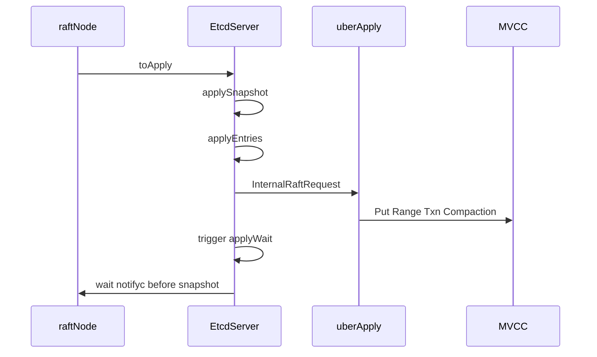

# 第11章 apply pipeline

> 本章で読むソース
>
> - [`server/etcdserver/server.go`](https://github.com/etcd-io/etcd/blob/v3.6.12/server/etcdserver/server.go)
> - [`server/etcdserver/apply/uber_applier.go`](https://github.com/etcd-io/etcd/blob/v3.6.12/server/etcdserver/apply/uber_applier.go)

## この章の狙い

本章では Raft で committed になった entry が、MVCC、lease、membership、auth へ適用される pipeline を読む。
consistent index を境界にして、再起動時の再適用を避ける仕組みを確認する。

## 前提

前章で `raftNode` が `toApply` を `applyc` に送るところまで見た。
本章では `EtcdServer.run` 側が `toApply` を受け、順序を保って apply する部分を読む。

## 全体の流れ



## applyAll が順序を作る

`applyAll` は snapshot、entries、backend consistency verification、apply wait trigger、snapshot 判定を順に実行する。
Raft routine の disk 書き込み完了を `notifyc` で待ってから snapshot 判定に進むため、applied index が storage の last index を追い越さない。

`applyAll` は snapshot と entries を適用し、apply wait を解放してから snapshot 判定を行う。

[server/etcdserver/server.go L983-L1004](https://github.com/etcd-io/etcd/blob/v3.6.12/server/etcdserver/server.go#L983-L1004)

```go
func (s *EtcdServer) applyAll(ep *etcdProgress, apply *toApply) {
	s.applySnapshot(ep, apply)
	s.applyEntries(ep, apply)
	backend.VerifyBackendConsistency(s.Backend(), s.Logger(), true, schema.AllBuckets...)

	proposalsApplied.Set(float64(ep.appliedi))
	s.applyWait.Trigger(ep.appliedi)

	// wait for the raft routine to finish the disk writes before triggering a
	// snapshot. or applied index might be greater than the last index in raft
	// storage, since the raft routine might be slower than toApply routine.
	<-apply.notifyc

	s.snapshotIfNeededAndCompactRaftLog(ep)
	select {
	// snapshot requested via send()
	case m := <-s.r.msgSnapC:
		merged := s.createMergedSnapshotMessage(m, ep.appliedt, ep.appliedi, ep.confState)
		s.sendMergedSnap(merged)
	default:
	}
}
```

`applyEntries` は未適用 entry だけを切り出し、`apply` の戻り値で progress を更新する。

[server/etcdserver/server.go L1189-L1213](https://github.com/etcd-io/etcd/blob/v3.6.12/server/etcdserver/server.go#L1189-L1213)

```go
func (s *EtcdServer) applyEntries(ep *etcdProgress, apply *toApply) {
	if len(apply.entries) == 0 {
		return
	}
	firsti := apply.entries[0].Index
	if firsti > ep.appliedi+1 {
		lg := s.Logger()
		lg.Panic(
			"unexpected committed entry index",
			zap.Uint64("current-applied-index", ep.appliedi),
			zap.Uint64("first-committed-entry-index", firsti),
		)
	}
	var ents []raftpb.Entry
	if ep.appliedi+1-firsti < uint64(len(apply.entries)) {
		ents = apply.entries[ep.appliedi+1-firsti:]
	}
	if len(ents) == 0 {
		return
	}
	var shouldstop bool
	if ep.appliedt, ep.appliedi, shouldstop = s.apply(ents, &ep.confState, apply.raftAdvancedC); shouldstop {
		go s.stopWithDelay(10*100*time.Millisecond, fmt.Errorf("the member has been permanently removed from the cluster"))
	}
}
```

## consistent index で再適用を避ける

`apply` は entry index と backend の consistent index を比べ、backend に適用すべきかを決める。
すでに backend に反映済みの entry は v2 store だけを対象にし、MVCC backend への重複適用を避ける。

`apply` は entry ごとに `shouldApplyV3` を決め、normal entry と conf change を分岐する。

[server/etcdserver/server.go L1898-L1948](https://github.com/etcd-io/etcd/blob/v3.6.12/server/etcdserver/server.go#L1898-L1948)

```go
func (s *EtcdServer) apply(
	es []raftpb.Entry,
	confState *raftpb.ConfState,
	raftAdvancedC <-chan struct{},
) (appliedt uint64, appliedi uint64, shouldStop bool) {
	s.lg.Debug("Applying entries", zap.Int("num-entries", len(es)))
	for i := range es {
		e := es[i]
		index := s.consistIndex.ConsistentIndex()
		s.lg.Debug("Applying entry",
			zap.Uint64("consistent-index", index),
			zap.Uint64("entry-index", e.Index),
			zap.Uint64("entry-term", e.Term),
			zap.Stringer("entry-type", e.Type))

		// We need to toApply all WAL entries on top of v2store
		// and only 'unapplied' (e.Index>backend.ConsistentIndex) on the backend.
		shouldApplyV3 := membership.ApplyV2storeOnly
		if e.Index > index {
			shouldApplyV3 = membership.ApplyBoth
			// set the consistent index of current executing entry
			s.consistIndex.SetConsistentApplyingIndex(e.Index, e.Term)
		}
		switch e.Type {
		case raftpb.EntryNormal:
			// gofail: var beforeApplyOneEntryNormal struct{}
			s.applyEntryNormal(&e, shouldApplyV3)
			s.setAppliedIndex(e.Index)
			s.setTerm(e.Term)

		case raftpb.EntryConfChange:
			// gofail: var beforeApplyOneConfChange struct{}
			var cc raftpb.ConfChange
			pbutil.MustUnmarshal(&cc, e.Data)
			removedSelf, err := s.applyConfChange(cc, confState, shouldApplyV3)
			s.setAppliedIndex(e.Index)
			s.setTerm(e.Term)
			shouldStop = shouldStop || removedSelf
			s.w.Trigger(cc.ID, &confChangeResponse{s.cluster.Members(), raftAdvancedC, err})

		default:
			lg := s.Logger()
			lg.Panic(
				"unknown entry type; must be either EntryNormal or EntryConfChange",
				zap.String("type", e.Type.String()),
			)
		}
		appliedi, appliedt = e.Index, e.Term
	}
	return appliedt, appliedi, shouldStop
}
```

`uberApplier` は auth、quota、corrupt alarm などのラッパーを通して backend applier へ到達する。

[server/etcdserver/apply/uber_applier.go L79-L119](https://github.com/etcd-io/etcd/blob/v3.6.12/server/etcdserver/apply/uber_applier.go#L79-L119)

```go
func newApplierV3(
	lg *zap.Logger,
	be backend.Backend,
	kv mvcc.KV,
	alarmStore *v3alarm.AlarmStore,
	authStore auth.AuthStore,
	lessor lease.Lessor,
	cluster *membership.RaftCluster,
	raftStatus RaftStatusGetter,
	snapshotServer SnapshotServer,
	consistentIndex cindex.ConsistentIndexer,
	txnModeWriteWithSharedBuffer bool,
	quotaBackendBytesCfg int64,
) applierV3 {
	applierBackend := newApplierV3Backend(lg, kv, alarmStore, authStore, lessor, cluster, raftStatus, snapshotServer, consistentIndex, txnModeWriteWithSharedBuffer)
	return newAuthApplierV3(
		authStore,
		newQuotaApplierV3(lg, quotaBackendBytesCfg, be, applierBackend),
		lessor,
	)
}

func (a *uberApplier) restoreAlarms() {
	noSpaceAlarms := len(a.alarmStore.Get(pb.AlarmType_NOSPACE)) > 0
	corruptAlarms := len(a.alarmStore.Get(pb.AlarmType_CORRUPT)) > 0
	a.applyV3 = a.applyV3base
	if noSpaceAlarms {
		a.applyV3 = newApplierV3Capped(a.applyV3)
	}
	if corruptAlarms {
		a.applyV3 = newApplierV3Corrupt(a.applyV3)
	}
}

func (a *uberApplier) Apply(r *pb.InternalRaftRequest) *Result {
	// We first execute chain of Apply() calls down the hierarchy:
	// (i.e. CorruptApplier -> CappedApplier -> Auth -> Quota -> Backend),
	// then dispatch() unpacks the request to a specific method (like Put),
	// that gets executed down the hierarchy again:
	// i.e. CorruptApplier.Put(CappedApplier.Put(...(BackendApplier.Put(...)))).
	return a.applyV3.Apply(r, a.dispatch)
```

`applyEntryNormal` は noop entry で lessor を Promote し、通常 entry を applier へ渡す。

[`server/etcdserver/server.go` L1950-L1975](https://github.com/etcd-io/etcd/blob/v3.6.12/server/etcdserver/server.go#L1950-L1975)

```go
// applyEntryNormal applies an EntryNormal type raftpb request to the EtcdServer
func (s *EtcdServer) applyEntryNormal(e *raftpb.Entry, shouldApplyV3 membership.ShouldApplyV3) {
	var ar *apply.Result
	if shouldApplyV3 {
		defer func() {
			// The txPostLockInsideApplyHook will not get called in some cases,
			// in which we should move the consistent index forward directly.
			newIndex := s.consistIndex.ConsistentIndex()
			if newIndex < e.Index {
				s.consistIndex.SetConsistentIndex(e.Index, e.Term)
			}
		}()
	}

	// raft state machine may generate noop entry when leader confirmation.
	// skip it in advance to avoid some potential bug in the future
	if len(e.Data) == 0 {
		s.firstCommitInTerm.Notify()

		// promote lessor when the local member is leader and finished
		// applying all entries from the last term.
		if s.isLeader() {
			s.lessor.Promote(s.Cfg.ElectionTimeout())
		}
		return
	}
```

apply 経路の `Txn` は MVCC の `txn.Txn` へ委譲する薄いラッパーである。

[`server/etcdserver/apply/apply.go` L167-L169](https://github.com/etcd-io/etcd/blob/v3.6.12/server/etcdserver/apply/apply.go#L167-L169)

```go
func (a *applierV3backend) Txn(rt *pb.TxnRequest) (*pb.TxnResponse, *traceutil.Trace, error) {
	return mvcctxn.Txn(context.TODO(), a.lg, rt, a.txnModeWriteWithSharedBuffer, a.kv, a.lessor)
}
```

## 最適化の工夫

`applyEntryNormal` は結果待ちが登録されておらず副作用もない request を省き、不要な read only range を transaction から外して apply の仕事量を減らす。

## まとめ

- apply pipeline は Raft の committed entry を、consistent index と applier chain を通して状態機械へ反映する。
- snapshot 判定は Raft storage の永続化完了を待つため、進行 index の逆転を避けられる。

## 関連する章

- [MVCC の read と write](../part02-mvcc/07-mvcc-read-write.md)
- [etcdserver の Raft ループ](10-etcdserver-raft.md)
- [transaction](../part04-txn-lease-watch/13-transaction.md)
- [リース](../part04-txn-lease-watch/14-lease.md)
- [auth と RBAC](../part05-api-auth/18-auth-rbac.md)
