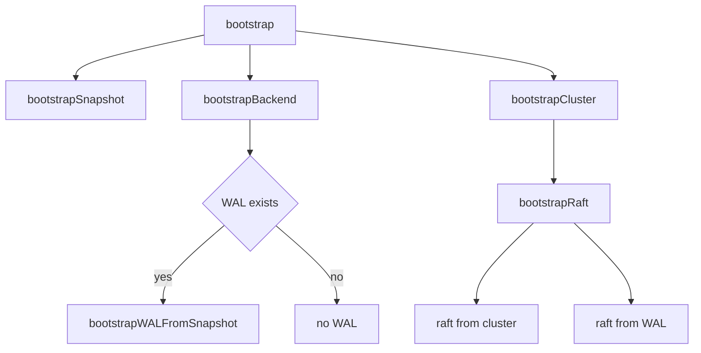

# 第12章 cluster bootstrap

> 本章で読むソース
>
> - [`server/etcdserver/bootstrap.go`](https://github.com/etcd-io/etcd/blob/v3.6.12/server/etcdserver/bootstrap.go)
> - [`server/etcdserver/api/membership/cluster.go`](https://github.com/etcd-io/etcd/blob/v3.6.12/server/etcdserver/api/membership/cluster.go)

## この章の狙い

本章では data directory、WAL、backend、membership から cluster を復元または新規作成する bootstrap を読む。
WAL がある場合、ない場合、新規 cluster の場合で Raft の初期化がどう分かれるかを整理する。

## 前提

`NewServer` は最初に `bootstrap` を呼び、その戻り値で `EtcdServer` を作った。
cluster ID と member ID は、peer URL と token から決まるため、起動時の検証対象になる。

## 全体の流れ



## bootstrap の大枠

`bootstrap` は data directory の存在確認、snapshotter、peer round tripper、backend、WAL、cluster、storage、Raft の順に組み立てる。
この関数は起動の一回限りの組み立てであり、通常運用中の request 処理とは分離されている。

`bootstrap` は data directory、snapshot、backend、cluster、storage、Raft を順に構成する。

[server/etcdserver/bootstrap.go L54-L118](https://github.com/etcd-io/etcd/blob/v3.6.12/server/etcdserver/bootstrap.go#L54-L118)

```go
func bootstrap(cfg config.ServerConfig) (b *bootstrappedServer, err error) {
	if cfg.MaxRequestBytes > recommendedMaxRequestBytes {
		cfg.Logger.Warn(
			"exceeded recommended request limit",
			zap.Uint("max-request-bytes", cfg.MaxRequestBytes),
			zap.String("max-request-size", humanize.Bytes(uint64(cfg.MaxRequestBytes))),
			zap.Int("recommended-request-bytes", recommendedMaxRequestBytes),
			zap.String("recommended-request-size", recommendedMaxRequestBytesString),
		)
	}

	if terr := fileutil.TouchDirAll(cfg.Logger, cfg.DataDir); terr != nil {
		return nil, fmt.Errorf("cannot access data directory: %w", terr)
	}

	if terr := fileutil.TouchDirAll(cfg.Logger, cfg.MemberDir()); terr != nil {
		return nil, fmt.Errorf("cannot access member directory: %w", terr)
	}
	ss := bootstrapSnapshot(cfg)
	prt, err := rafthttp.NewRoundTripper(cfg.PeerTLSInfo, cfg.PeerDialTimeout())
	if err != nil {
		return nil, err
	}

	haveWAL := wal.Exist(cfg.WALDir())
	st := v2store.New(StoreClusterPrefix, StoreKeysPrefix)
	backend, err := bootstrapBackend(cfg, haveWAL, st, ss)
	if err != nil {
		return nil, err
	}
	var bwal *bootstrappedWAL

	if haveWAL {
		if err = fileutil.IsDirWriteable(cfg.WALDir()); err != nil {
			return nil, fmt.Errorf("cannot write to WAL directory: %w", err)
		}
		cfg.Logger.Info("Bootstrapping WAL from snapshot")
		bwal = bootstrapWALFromSnapshot(cfg, backend.snapshot, backend.ci)
	}

	cfg.Logger.Info("bootstrapping cluster")
	cluster, err := bootstrapCluster(cfg, bwal, prt)
	if err != nil {
		backend.Close()
		return nil, err
	}

	cfg.Logger.Info("bootstrapping storage")
	s := bootstrapStorage(cfg, st, backend, bwal, cluster)

	if err = cluster.Finalize(cfg, s); err != nil {
		backend.Close()
		return nil, err
	}

	cfg.Logger.Info("bootstrapping raft")
	raft := bootstrapRaft(cfg, cluster, s.wal)
	return &bootstrappedServer{
		prt:     prt,
		ss:      ss,
		storage: s,
		cluster: cluster,
		raft:    raft,
	}, nil
}
```

## cluster の三分岐

`bootstrapCluster` は WAL がなく既存 cluster に参加する場合、WAL がなく新規 cluster を作る場合、WAL から復旧する場合に分岐する。
既存 cluster 参加では remote peer から cluster 情報を取得し、local cluster と ID を照合する。

`bootstrapCluster` は WAL の有無と `NewCluster` で起動経路を選ぶ。

[server/etcdserver/bootstrap.go L273-L355](https://github.com/etcd-io/etcd/blob/v3.6.12/server/etcdserver/bootstrap.go#L273-L355)

```go
func bootstrapCluster(cfg config.ServerConfig, bwal *bootstrappedWAL, prt http.RoundTripper) (c *bootstrappedCluster, err error) {
	switch {
	case bwal == nil && !cfg.NewCluster:
		c, err = bootstrapExistingClusterNoWAL(cfg, prt)
	case bwal == nil && cfg.NewCluster:
		c, err = bootstrapNewClusterNoWAL(cfg, prt)
	case bwal != nil && bwal.haveWAL:
		c, err = bootstrapClusterWithWAL(cfg, bwal.meta)
	default:
		return nil, fmt.Errorf("unsupported bootstrap config")
	}
	if err != nil {
		return nil, err
	}
	return c, nil
}

func bootstrapExistingClusterNoWAL(cfg config.ServerConfig, prt http.RoundTripper) (*bootstrappedCluster, error) {
	if err := cfg.VerifyJoinExisting(); err != nil {
		return nil, err
	}
	cl, err := membership.NewClusterFromURLsMap(cfg.Logger, cfg.InitialClusterToken, cfg.InitialPeerURLsMap, membership.WithMaxLearners(cfg.MaxLearners))
	if err != nil {
		return nil, err
	}
	existingCluster, gerr := GetClusterFromRemotePeers(cfg.Logger, getRemotePeerURLs(cl, cfg.Name), prt)
	if gerr != nil {
		return nil, fmt.Errorf("cannot fetch cluster info from peer urls: %w", gerr)
	}
	if err := membership.ValidateClusterAndAssignIDs(cfg.Logger, cl, existingCluster); err != nil {
		return nil, fmt.Errorf("error validating peerURLs %s: %w", existingCluster, err)
	}
	if !isCompatibleWithCluster(cfg.Logger, cl, cl.MemberByName(cfg.Name).ID, prt, cfg.ReqTimeout()) {
		return nil, fmt.Errorf("incompatible with current running cluster")
	}
	scaleUpLearners := false
	if err := membership.ValidateMaxLearnerConfig(cfg.MaxLearners, existingCluster.Members(), scaleUpLearners); err != nil {
		return nil, err
	}
	remotes := existingCluster.Members()
	cl.SetID(types.ID(0), existingCluster.ID())
	member := cl.MemberByName(cfg.Name)
	return &bootstrappedCluster{
		remotes: remotes,
		cl:      cl,
		nodeID:  member.ID,
	}, nil
}

func bootstrapNewClusterNoWAL(cfg config.ServerConfig, prt http.RoundTripper) (*bootstrappedCluster, error) {
	if err := cfg.VerifyBootstrap(); err != nil {
		return nil, err
	}
	cl, err := membership.NewClusterFromURLsMap(cfg.Logger, cfg.InitialClusterToken, cfg.InitialPeerURLsMap, membership.WithMaxLearners(cfg.MaxLearners))
	if err != nil {
		return nil, err
	}
	m := cl.MemberByName(cfg.Name)
	if isMemberBootstrapped(cfg.Logger, cl, cfg.Name, prt, cfg.BootstrapTimeoutEffective()) {
		return nil, fmt.Errorf("member %s has already been bootstrapped", m.ID)
	}
	if cfg.ShouldDiscover() {
		var str string
		if cfg.DiscoveryURL != "" {
			cfg.Logger.Warn("V2 discovery is deprecated!")
			str, err = v2discovery.JoinCluster(cfg.Logger, cfg.DiscoveryURL, cfg.DiscoveryProxy, m.ID, cfg.InitialPeerURLsMap.String())
		} else {
			cfg.Logger.Info("Bootstrapping cluster using v3 discovery.")
			str, err = v3discovery.JoinCluster(cfg.Logger, &cfg.DiscoveryCfg, m.ID, cfg.InitialPeerURLsMap.String())
		}
		if err != nil {
			return nil, &servererrors.DiscoveryError{Op: "join", Err: err}
		}
		var urlsmap types.URLsMap
		urlsmap, err = types.NewURLsMap(str)
		if err != nil {
			return nil, err
		}
		if config.CheckDuplicateURL(urlsmap) {
			return nil, fmt.Errorf("discovery cluster %s has duplicate url", urlsmap)
		}
		if cl, err = membership.NewClusterFromURLsMap(cfg.Logger, cfg.InitialClusterToken, urlsmap, membership.WithMaxLearners(cfg.MaxLearners)); err != nil {
			return nil, err
```

`NewClusterFromURLsMap` は URL map から member を作り、cluster ID を生成する。

[server/etcdserver/api/membership/cluster.go L82-L120](https://github.com/etcd-io/etcd/blob/v3.6.12/server/etcdserver/api/membership/cluster.go#L82-L120)

```go
func NewClusterFromURLsMap(lg *zap.Logger, token string, urlsmap types.URLsMap, opts ...ClusterOption) (*RaftCluster, error) {
	c := NewCluster(lg, opts...)
	for name, urls := range urlsmap {
		m := NewMember(name, urls, token, nil)
		if _, ok := c.members[m.ID]; ok {
			return nil, fmt.Errorf("member exists with identical ID %v", m)
		}
		if uint64(m.ID) == raft.None {
			return nil, fmt.Errorf("cannot use %x as member id", raft.None)
		}
		c.members[m.ID] = m
	}
	c.genID()
	return c, nil
}

func NewClusterFromMembers(lg *zap.Logger, id types.ID, membs []*Member, opts ...ClusterOption) *RaftCluster {
	c := NewCluster(lg, opts...)
	c.cid = id
	for _, m := range membs {
		c.members[m.ID] = m
	}
	return c
}

func NewCluster(lg *zap.Logger, opts ...ClusterOption) *RaftCluster {
	if lg == nil {
		lg = zap.NewNop()
	}
	clOpts := newClusterOpts(opts...)

	return &RaftCluster{
		lg:            lg,
		members:       make(map[types.ID]*Member),
		removed:       make(map[types.ID]bool),
		downgradeInfo: &serverversion.DowngradeInfo{Enabled: false},
		maxLearners:   clOpts.maxLearners,
	}
}
```

## Raft の初期 peer を決める

`bootstrapRaft` は WAL がない新規 cluster では peer list を渡し、WAL がある復旧では WAL の metadata から node ID を使う。
Raft config には election tick、heartbeat tick、message size、inflight 数、pre vote が入る。

`bootstrapRaft` は cluster 情報または WAL metadata から Raft node を初期化する。

[server/etcdserver/bootstrap.go L474-L535](https://github.com/etcd-io/etcd/blob/v3.6.12/server/etcdserver/bootstrap.go#L474-L535)

```go
func bootstrapRaft(cfg config.ServerConfig, cluster *bootstrappedCluster, bwal *bootstrappedWAL) *bootstrappedRaft {
	switch {
	case !bwal.haveWAL && !cfg.NewCluster:
		return bootstrapRaftFromCluster(cfg, cluster.cl, nil, bwal)
	case !bwal.haveWAL && cfg.NewCluster:
		return bootstrapRaftFromCluster(cfg, cluster.cl, cluster.cl.MemberIDs(), bwal)
	case bwal.haveWAL:
		return bootstrapRaftFromWAL(cfg, bwal)
	default:
		cfg.Logger.Panic("unsupported bootstrap config")
		return nil
	}
}

func bootstrapRaftFromCluster(cfg config.ServerConfig, cl *membership.RaftCluster, ids []types.ID, bwal *bootstrappedWAL) *bootstrappedRaft {
	member := cl.MemberByName(cfg.Name)
	peers := make([]raft.Peer, len(ids))
	for i, id := range ids {
		var ctx []byte
		ctx, err := json.Marshal((*cl).Member(id))
		if err != nil {
			cfg.Logger.Panic("failed to marshal member", zap.Error(err))
		}
		peers[i] = raft.Peer{ID: uint64(id), Context: ctx}
	}
	cfg.Logger.Info(
		"starting local member",
		zap.String("local-member-id", member.ID.String()),
		zap.String("cluster-id", cl.ID().String()),
	)
	s := bwal.MemoryStorage()
	return &bootstrappedRaft{
		lg:        cfg.Logger,
		heartbeat: time.Duration(cfg.TickMs) * time.Millisecond,
		config:    raftConfig(cfg, uint64(member.ID), s),
		peers:     peers,
		storage:   s,
	}
}

func bootstrapRaftFromWAL(cfg config.ServerConfig, bwal *bootstrappedWAL) *bootstrappedRaft {
	s := bwal.MemoryStorage()
	return &bootstrappedRaft{
		lg:        cfg.Logger,
		heartbeat: time.Duration(cfg.TickMs) * time.Millisecond,
		config:    raftConfig(cfg, uint64(bwal.meta.nodeID), s),
		storage:   s,
	}
}

func raftConfig(cfg config.ServerConfig, id uint64, s *raft.MemoryStorage) *raft.Config {
	return &raft.Config{
		ID:              id,
		ElectionTick:    cfg.ElectionTicks,
		HeartbeatTick:   1,
		Storage:         s,
		MaxSizePerMsg:   maxSizePerMsg,
		MaxInflightMsgs: maxInflightMsgs,
		CheckQuorum:     true,
		PreVote:         cfg.PreVote,
		Logger:          NewRaftLoggerZap(cfg.Logger.Named("raft")),
	}
```

`bootstrapBackend` は backend を開き、WAL がある場合は snapshot から backend を復元する。

[`server/etcdserver/bootstrap.go` L202-L228](https://github.com/etcd-io/etcd/blob/v3.6.12/server/etcdserver/bootstrap.go#L202-L228)

```go
func bootstrapBackend(cfg config.ServerConfig, haveWAL bool, st v2store.Store, ss *snap.Snapshotter) (backend *bootstrappedBackend, err error) {
	beExist := fileutil.Exist(cfg.BackendPath())
	ci := cindex.NewConsistentIndex(nil)
	beHooks := serverstorage.NewBackendHooks(cfg.Logger, ci)
	be := serverstorage.OpenBackend(cfg, beHooks)
	defer func() {
		if err != nil && be != nil {
			be.Close()
		}
	}()
	ci.SetBackend(be)
	schema.CreateMetaBucket(be.BatchTx())
	if cfg.BootstrapDefragThresholdMegabytes != 0 {
		err = maybeDefragBackend(cfg, be)
		if err != nil {
			return nil, err
		}
	}
	cfg.Logger.Info("restore consistentIndex", zap.Uint64("index", ci.ConsistentIndex()))

	// TODO(serathius): Implement schema setup in fresh storage
	var snapshot *raftpb.Snapshot
	if haveWAL {
		snapshot, be, err = recoverSnapshot(cfg, st, be, beExist, beHooks, ci, ss)
		if err != nil {
			return nil, err
		}
	}
```

WAL 復旧では snapshot と open WAL 結果を `bootstrappedWAL` に束ねる。

[`server/etcdserver/bootstrap.go` L560-L587](https://github.com/etcd-io/etcd/blob/v3.6.12/server/etcdserver/bootstrap.go#L560-L587)

```go
func bootstrapWALFromSnapshot(cfg config.ServerConfig, snapshot *raftpb.Snapshot, ci cindex.ConsistentIndexer) *bootstrappedWAL {
	wal, st, ents, snap, meta := openWALFromSnapshot(cfg, snapshot)
	bwal := &bootstrappedWAL{
		lg:       cfg.Logger,
		w:        wal,
		st:       st,
		ents:     ents,
		snapshot: snap,
		meta:     meta,
		haveWAL:  true,
	}

	if cfg.ForceNewCluster {
		consistentIndex := ci.ConsistentIndex()
		oldCommitIndex := bwal.st.Commit
		// If only `HardState.Commit` increases, HardState won't be persisted
		// to disk, even though the committed entries might have already been
		// applied. This can result in consistent_index > CommitIndex.
		//
		// When restarting etcd with `--force-new-cluster`, all uncommitted
		// entries are dropped. To avoid losing entries that were actually
		// committed, we reset Commit to max(HardState.Commit, consistent_index).
		//
		// See: https://github.com/etcd-io/raft/pull/300 for more details.
		bwal.st.Commit = max(oldCommitIndex, consistentIndex)

		// discard the previously uncommitted entries
		bwal.ents = bwal.CommitedEntries()
```

## 最適化の工夫

WAL がある場合は remote peer への cluster fetch を省き、WAL metadata と snapshot から local 状態を復旧するため、通常再起動の critical path を短くできる。

## まとめ

- bootstrap は永続状態がある再起動と、新規 cluster 作成と、既存 cluster 参加を明確に分ける。
- membership の ID 検証は、peer URL の設定ミスを Raft 開始前に止めるための安全弁になる。

## 関連する章

- [embed と起動処理](../part00-overview/02-embed-and-startup.md)
- [WAL](../part01-storage/05-wal.md)
- [etcdserver の Raft ループ](10-etcdserver-raft.md)
- [feature gate と version](../part07-ops/24-feature-version.md)
