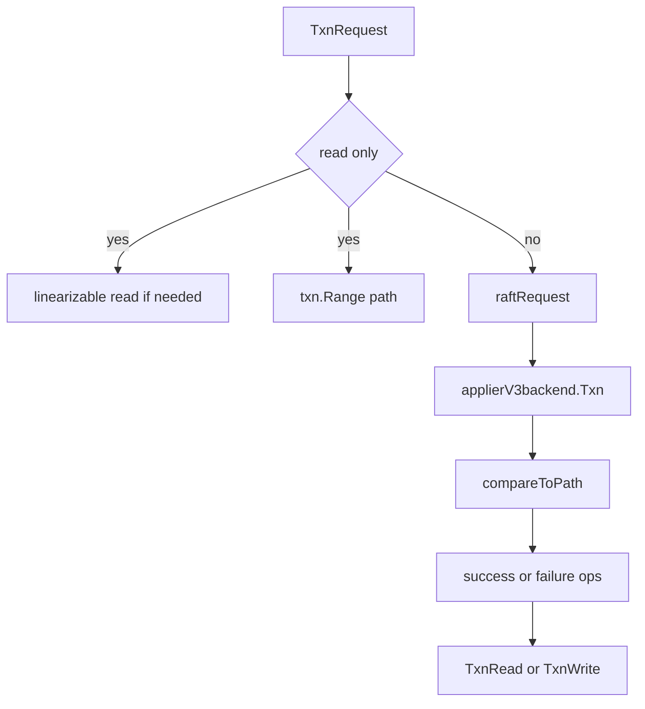

# 第13章 transaction

> 本章で読むソース
>
> - [`server/etcdserver/v3_server.go`](https://github.com/etcd-io/etcd/blob/v3.6.12/server/etcdserver/v3_server.go)
> - [`server/etcdserver/apply/apply.go`](https://github.com/etcd-io/etcd/blob/v3.6.12/server/etcdserver/apply/apply.go)
> - [`server/etcdserver/txn/txn.go`](https://github.com/etcd-io/etcd/blob/v3.6.12/server/etcdserver/txn/txn.go)

## この章の狙い

本章では gRPC の Txn request が read only か write かで経路を変え、最終的に MVCC transaction として実行される流れを読む。
compare、success path、failure path、write lock の取り方を整理する。

## 前提

第7章で MVCC の read transaction と write transaction を見た。
etcd の transaction は Raft に乗る write transaction と、ReadIndex を経由する read only transaction に分かれる。

## 全体の流れ



## server は read only transaction を分ける

`EtcdServer.Txn` は request が read only なら、必要に応じてリニアライザブル read の合意を取ってから local に処理する。
write を含む transaction は `raftRequest` に包まれ、Raft の apply pipeline で直列化される。

`EtcdServer.Txn` は read only transaction と write transaction で処理経路を分ける。

[server/etcdserver/v3_server.go L160-L223](https://github.com/etcd-io/etcd/blob/v3.6.12/server/etcdserver/v3_server.go#L160-L223)

```go
func (s *EtcdServer) Txn(ctx context.Context, r *pb.TxnRequest) (*pb.TxnResponse, error) {
	if txn.IsTxnReadonly(r) {
		trace := traceutil.New("transaction",
			s.Logger(),
			traceutil.Field{Key: "read_only", Value: true},
		)
		ctx = context.WithValue(ctx, traceutil.TraceKey{}, trace)
		if !txn.IsTxnSerializable(r) {
			err := s.linearizableReadNotify(ctx)
			trace.Step("agreement among raft nodes before linearized reading")
			if err != nil {
				return nil, err
			}
		}
		var resp *pb.TxnResponse
		var err error
		chk := func(ai *auth.AuthInfo) error {
			return apply2.CheckTxnAuth(s.authStore, ai, s.lessor, r)
		}

		defer func(start time.Time) {
			txn.WarnOfExpensiveReadOnlyTxnRequest(s.Logger(), s.Cfg.WarningApplyDuration, start, r, resp, err)
			trace.LogIfLong(traceThreshold)
		}(time.Now())

		get := func() {
			resp, _, err = txn.Txn(ctx, s.Logger(), r, s.Cfg.ServerFeatureGate.Enabled(features.TxnModeWriteWithSharedBuffer), s.KV(), s.lessor)
		}
		if serr := s.doSerialize(ctx, chk, get); serr != nil {
			return nil, serr
		}
		return resp, err
	}

	ctx = context.WithValue(ctx, traceutil.StartTimeKey{}, time.Now())
	resp, err := s.raftRequest(ctx, pb.InternalRaftRequest{Txn: r})
	if err != nil {
		return nil, err
	}
	return resp.(*pb.TxnResponse), nil
}

func (s *EtcdServer) Compact(ctx context.Context, r *pb.CompactionRequest) (*pb.CompactionResponse, error) {
	startTime := time.Now()
	result, err := s.processInternalRaftRequestOnce(ctx, pb.InternalRaftRequest{Compaction: r})
	trace := traceutil.TODO()
	if result != nil && result.Trace != nil {
		trace = result.Trace
		defer func() {
			trace.LogIfLong(traceThreshold)
		}()
		applyStart := result.Trace.GetStartTime()
		result.Trace.SetStartTime(startTime)
		trace.InsertStep(0, applyStart, "process raft request")
	}
	if r.Physical && result != nil && result.Physc != nil {
		<-result.Physc
		// The compaction is done deleting keys; the hash is now settled
		// but the data is not necessarily committed. If there's a crash,
		// the hash may revert to a hash prior to compaction completing
		// if the compaction resumes. Force the finished compaction to
		// commit so it won't resume following a crash.
		//
		// `applySnapshot` sets a new backend instance, so we need to acquire the bemu lock.
```

`applierV3backend` は Put、DeleteRange、Range、Txn を `etcdserver/txn` へ委譲する。

[server/etcdserver/apply/apply.go L155-L168](https://github.com/etcd-io/etcd/blob/v3.6.12/server/etcdserver/apply/apply.go#L155-L168)

```go
func (a *applierV3backend) Put(p *pb.PutRequest) (resp *pb.PutResponse, trace *traceutil.Trace, err error) {
	return mvcctxn.Put(context.TODO(), a.lg, a.lessor, a.kv, p)
}

func (a *applierV3backend) DeleteRange(dr *pb.DeleteRangeRequest) (*pb.DeleteRangeResponse, *traceutil.Trace, error) {
	return mvcctxn.DeleteRange(context.TODO(), a.lg, a.kv, dr)
}

func (a *applierV3backend) Range(r *pb.RangeRequest) (*pb.RangeResponse, *traceutil.Trace, error) {
	return mvcctxn.Range(context.TODO(), a.lg, a.kv, r)
}

func (a *applierV3backend) Txn(rt *pb.TxnRequest) (*pb.TxnResponse, *traceutil.Trace, error) {
	return mvcctxn.Txn(context.TODO(), a.lg, rt, a.txnModeWriteWithSharedBuffer, a.kv, a.lessor)
```

## compare の後に path を実行する

`txn.Txn` は compare を先に実行し、成功側か失敗側の operation 列を選ぶ。
write を含む場合は read transaction を閉じてから write transaction を開き、中間状態を reader に見せない。

`Txn` は read mode を選び、compare 結果に応じて path を実行する。

[server/etcdserver/txn/txn.go L251-L300](https://github.com/etcd-io/etcd/blob/v3.6.12/server/etcdserver/txn/txn.go#L251-L300)

```go
func Txn(ctx context.Context, lg *zap.Logger, rt *pb.TxnRequest, txnModeWriteWithSharedBuffer bool, kv mvcc.KV, lessor lease.Lessor) (*pb.TxnResponse, *traceutil.Trace, error) {
	trace := traceutil.Get(ctx)
	if trace.IsEmpty() {
		trace = traceutil.New("transaction", lg)
		ctx = context.WithValue(ctx, traceutil.TraceKey{}, trace)
	}
	isWrite := !IsTxnReadonly(rt)
	// When the transaction contains write operations, we use ReadTx instead of
	// ConcurrentReadTx to avoid extra overhead of copying buffer.
	var mode mvcc.ReadTxMode
	if isWrite && txnModeWriteWithSharedBuffer /*a.s.Cfg.ServerFeatureGate.Enabled(features.TxnModeWriteWithSharedBuffer)*/ {
		mode = mvcc.SharedBufReadTxMode
	} else {
		mode = mvcc.ConcurrentReadTxMode
	}
	txnRead := kv.Read(mode, trace)
	var txnPath []bool
	trace.StepWithFunction(
		func() {
			txnPath = compareToPath(txnRead, rt)
		},
		"compare",
	)
	if isWrite {
		trace.AddField(traceutil.Field{Key: "read_only", Value: false})
	}
	_, err := checkTxn(txnRead, rt, lessor, txnPath)
	if err != nil {
		txnRead.End()
		return nil, nil, err
	}
	trace.Step("check requests")
	// When executing mutable txnWrite ops, etcd must hold the txnWrite lock so
	// readers do not see any intermediate results. Since writes are
	// serialized on the raft loop, the revision in the read view will
	// be the revision of the write txnWrite.
	var txnWrite mvcc.TxnWrite
	if isWrite {
		txnRead.End()
		txnWrite = kv.Write(trace)
	} else {
		txnWrite = mvcc.NewReadOnlyTxnWrite(txnRead)
	}
	txnResp, err := txn(ctx, lg, txnWrite, rt, isWrite, txnPath)
	txnWrite.End()

	trace.AddField(
		traceutil.Field{Key: "number_of_response", Value: len(txnResp.Responses)},
		traceutil.Field{Key: "response_revision", Value: txnResp.Header.Revision},
	)
```

read only transaction 判定は success と failure の operation がすべて Range であることで行う。

[`server/etcdserver/txn/txn.go` L655-L667](https://github.com/etcd-io/etcd/blob/v3.6.12/server/etcdserver/txn/txn.go#L655-L667)

```go
func IsTxnReadonly(r *pb.TxnRequest) bool {
	for _, u := range r.Success {
		if r := u.GetRequestRange(); r == nil {
			return false
		}
	}
	for _, u := range r.Failure {
		if r := u.GetRequestRange(); r == nil {
			return false
		}
	}
	return true
}
```

`compareToPath` は compare 結果で success か failure を選び、ネストした Txn も再帰的に評価する。

[`server/etcdserver/txn/txn.go` L544-L558](https://github.com/etcd-io/etcd/blob/v3.6.12/server/etcdserver/txn/txn.go#L544-L558)

```go
func compareToPath(rv mvcc.ReadView, rt *pb.TxnRequest) []bool {
	txnPath := make([]bool, 1)
	ops := rt.Success
	if txnPath[0] = applyCompares(rv, rt.Compare); !txnPath[0] {
		ops = rt.Failure
	}
	for _, op := range ops {
		tv, ok := op.Request.(*pb.RequestOp_RequestTxn)
		if !ok || tv.RequestTxn == nil {
			continue
		}
		txnPath = append(txnPath, compareToPath(rv, tv.RequestTxn)...)
	}
	return txnPath
}
```

serializable transaction は success と failure の Range がすべて `Serializable` であるときだけ ReadIndex を省略できる。

[`server/etcdserver/txn/txn.go` L641-L653](https://github.com/etcd-io/etcd/blob/v3.6.12/server/etcdserver/txn/txn.go#L641-L653)

```go
func IsTxnSerializable(r *pb.TxnRequest) bool {
	for _, u := range r.Success {
		if r := u.GetRequestRange(); r == nil || !r.Serializable {
			return false
		}
	}
	for _, u := range r.Failure {
		if r := u.GetRequestRange(); r == nil || !r.Serializable {
			return false
		}
	}
	return true
}
```

## 最適化の工夫

`TxnModeWriteWithSharedBuffer` が有効な write transaction では compare 用 read に共有 buffer を使い、write 前の確認で transaction read buffer を余分に copy しない。
`EtcdServer.applyEntryNormal` は結果が不要な read request を write transaction から外し、Raft apply 時の無駄な Range を減らす。

## まとめ

- transaction は read only なら local read path、write を含むなら Raft apply path に入る。
- compare は path 選択だけを担い、実際の mutation は MVCC write transaction の排他区間で行われる。

## 関連する章

- [MVCC の read と write](../part02-mvcc/07-mvcc-read-write.md)
- [apply pipeline](../part03-raft/11-apply-pipeline.md)
- [KV Range](../part05-api-auth/17-kv-range.md)
- [clientv3](../part06-client/19-clientv3.md)
