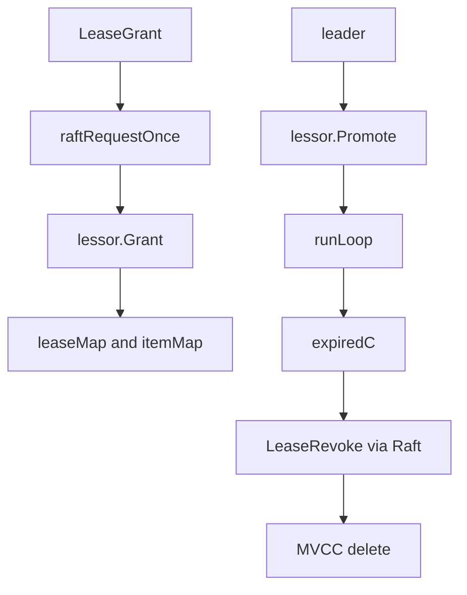

# 第14章 リース

> 本章で読むソース
>
> - [`server/lease/lessor.go`](https://github.com/etcd-io/etcd/blob/v3.6.12/server/lease/lessor.go)
> - [`server/etcdserver/v3_server.go`](https://github.com/etcd-io/etcd/blob/v3.6.12/server/etcdserver/v3_server.go)

## この章の狙い

本章では **リース** が key の自動削除と keep alive をどのように管理するかを読む。
leader だけが primary lessor として期限を進め、期限切れを Raft に乗せて削除する流れを確認する。

## 前提

リース付き key は MVCC の `Lease` フィールドを通じて lease ID と結びつく。
期限切れによる削除もクラスタ全体で同じ順序にする必要があるため、local delete ではなく合意経路に乗る。

## 全体の流れ



## lessor の責務

`Lessor` interface は Grant、Revoke、Renew、Attach、Detach、Promote、Demote、Recover を持つ。
`lessor` は `leaseMap` と `itemMap` を持ち、lease から key と key から lease の両方向を管理する。

`Lessor` は lease の作成、削除、更新、key への attach を扱う interface である。

[server/lease/lessor.go L83-L141](https://github.com/etcd-io/etcd/blob/v3.6.12/server/lease/lessor.go#L83-L141)

```go
type Lessor interface {
	// SetRangeDeleter lets the lessor create TxnDeletes to the store.
	// Lessor deletes the items in the revoked or expired lease by creating
	// new TxnDeletes.
	SetRangeDeleter(rd RangeDeleter)

	SetCheckpointer(cp Checkpointer)

	// Grant grants a lease that expires at least after TTL seconds.
	Grant(id LeaseID, ttl int64) (*Lease, error)
	// Revoke revokes a lease with given ID. The item attached to the
	// given lease will be removed. If the ID does not exist, an error
	// will be returned.
	Revoke(id LeaseID) error

	// Checkpoint applies the remainingTTL of a lease. The remainingTTL is used in Promote to set
	// the expiry of leases to less than the full TTL when possible.
	Checkpoint(id LeaseID, remainingTTL int64) error

	// Attach attaches given leaseItem to the lease with given LeaseID.
	// If the lease does not exist, an error will be returned.
	Attach(id LeaseID, items []LeaseItem) error

	// GetLease returns LeaseID for given item.
	// If no lease found, NoLease value will be returned.
	GetLease(item LeaseItem) LeaseID

	// Detach detaches given leaseItem from the lease with given LeaseID.
	// If the lease does not exist, an error will be returned.
	Detach(id LeaseID, items []LeaseItem) error

	// Promote promotes the lessor to be the primary lessor. Primary lessor manages
	// the expiration and renew of leases.
	// Newly promoted lessor renew the TTL of all lease to extend + previous TTL.
	Promote(extend time.Duration)

	// Demote demotes the lessor from being the primary lessor.
	Demote()

	// Renew renews a lease with given ID. It returns the renewed TTL. If the ID does not exist,
	// an error will be returned.
	Renew(id LeaseID) (int64, error)

	// Lookup gives the lease at a given lease id, if any
	Lookup(id LeaseID) *Lease

	// Leases lists all leases.
	Leases() []*Lease

	// ExpiredLeasesC returns a chan that is used to receive expired leases.
	ExpiredLeasesC() <-chan []*Lease

	// Recover recovers the lessor state from the given backend and RangeDeleter.
	Recover(b backend.Backend, rd RangeDeleter)

	// Stop stops the lessor for managing leases. The behavior of calling Stop multiple
	// times is undefined.
	Stop()
}
```

`newLessor` は heap、map、expired channel を初期化し、`runLoop` を開始する。

[server/lease/lessor.go L208-L247](https://github.com/etcd-io/etcd/blob/v3.6.12/server/lease/lessor.go#L208-L247)

```go
func NewLessor(lg *zap.Logger, b backend.Backend, cluster cluster, cfg LessorConfig) Lessor {
	return newLessor(lg, b, cluster, cfg)
}

func newLessor(lg *zap.Logger, b backend.Backend, cluster cluster, cfg LessorConfig) *lessor {
	checkpointInterval := cfg.CheckpointInterval
	expiredLeaseRetryInterval := cfg.ExpiredLeasesRetryInterval
	leaseRevokeRate := cfg.leaseRevokeRate
	if checkpointInterval == 0 {
		checkpointInterval = defaultLeaseCheckpointInterval
	}
	if expiredLeaseRetryInterval == 0 {
		expiredLeaseRetryInterval = defaultExpiredleaseRetryInterval
	}
	if leaseRevokeRate == 0 {
		leaseRevokeRate = defaultLeaseRevokeRate
	}
	l := &lessor{
		leaseMap:                  make(map[LeaseID]*Lease),
		itemMap:                   make(map[LeaseItem]LeaseID),
		leaseExpiredNotifier:      newLeaseExpiredNotifier(),
		leaseCheckpointHeap:       make(LeaseQueue, 0),
		b:                         b,
		minLeaseTTL:               cfg.MinLeaseTTL,
		leaseRevokeRate:           leaseRevokeRate,
		checkpointInterval:        checkpointInterval,
		expiredLeaseRetryInterval: expiredLeaseRetryInterval,
		checkpointPersist:         cfg.CheckpointPersist,
		// expiredC is a small buffered chan to avoid unnecessary blocking.
		expiredC: make(chan []*Lease, 16),
		stopC:    make(chan struct{}),
		doneC:    make(chan struct{}),
		lg:       lg,
		cluster:  cluster,
	}
	l.initAndRecover()

	go l.runLoop()

	return l
```

## grant と期限処理

`Grant` は lease ID と TTL を検証し、primary なら期限を設定して期限通知 heap に登録する。
`runLoop` は期限切れ lease と checkpoint を定期的に処理し、expired channel が詰まっている場合は次回へ回す。

`Grant` は primary のとき expiry を設定し、期限通知と checkpoint を登録する。

[server/lease/lessor.go L281-L323](https://github.com/etcd-io/etcd/blob/v3.6.12/server/lease/lessor.go#L281-L323)

```go
func (le *lessor) Grant(id LeaseID, ttl int64) (*Lease, error) {
	if id == NoLease {
		return nil, ErrLeaseNotFound
	}

	if ttl > MaxLeaseTTL {
		return nil, ErrLeaseTTLTooLarge
	}

	// TODO: when lessor is under high load, it should give out lease
	// with longer TTL to reduce renew load.
	l := NewLease(id, ttl)

	le.mu.Lock()
	defer le.mu.Unlock()

	if _, ok := le.leaseMap[id]; ok {
		return nil, ErrLeaseExists
	}

	if l.ttl < le.minLeaseTTL {
		l.ttl = le.minLeaseTTL
	}

	if le.isPrimary() {
		l.refresh(0)
	} else {
		l.forever()
	}

	le.leaseMap[id] = l
	l.persistTo(le.b)

	leaseTotalTTLs.Observe(float64(l.ttl))
	leaseGranted.Inc()

	if le.isPrimary() {
		item := &LeaseWithTime{id: l.ID, time: l.expiry}
		le.leaseExpiredNotifier.RegisterOrUpdate(item)
		le.scheduleCheckpointIfNeeded(l)
	}

	return l, nil
```

`runLoop` は期限切れ lease を rate limit 付きで `expiredC` へ送る。

[server/lease/lessor.go L620-L663](https://github.com/etcd-io/etcd/blob/v3.6.12/server/lease/lessor.go#L620-L663)

```go
func (le *lessor) runLoop() {
	defer close(le.doneC)

	delayTicker := time.NewTicker(500 * time.Millisecond)
	defer delayTicker.Stop()

	for {
		le.revokeExpiredLeases()
		le.checkpointScheduledLeases()

		select {
		case <-delayTicker.C:
		case <-le.stopC:
			return
		}
	}
}

// revokeExpiredLeases finds all leases past their expiry and sends them to expired channel for
// to be revoked.
func (le *lessor) revokeExpiredLeases() {
	var ls []*Lease

	// rate limit
	revokeLimit := le.leaseRevokeRate / 2

	le.mu.RLock()
	if le.isPrimary() {
		ls = le.findExpiredLeases(revokeLimit)
	}
	le.mu.RUnlock()

	if len(ls) != 0 {
		select {
		case <-le.stopC:
			return
		case le.expiredC <- ls:
		default:
			// the receiver of expiredC is probably busy handling
			// other stuff
			// let's try this next time after 500ms
		}
	}
}
```

## API は合意経路に入る

`EtcdServer.LeaseGrant` と `LeaseRevoke` は auth を確認し、`InternalRaftRequest` として Raft に送る。
keep alive は leader が leadership を確認し、apply index が追いつくのを待ってから lessor を更新する。

`LeaseGrant` と `LeaseRevoke` は Raft request として処理され、`LeaseRenew` は leader 確認を行う。

[server/etcdserver/v3_server.go L247-L305](https://github.com/etcd-io/etcd/blob/v3.6.12/server/etcdserver/v3_server.go#L247-L305)

```go
func (s *EtcdServer) LeaseGrant(ctx context.Context, r *pb.LeaseGrantRequest) (*pb.LeaseGrantResponse, error) {
	// no id given? choose one
	for r.ID == int64(lease.NoLease) {
		// only use positive int64 id's
		r.ID = int64(s.reqIDGen.Next() & ((1 << 63) - 1))
	}

	if err := s.requireAuthInfo(ctx); err != nil {
		return nil, err
	}

	resp, err := s.raftRequestOnce(ctx, pb.InternalRaftRequest{LeaseGrant: r})
	if err != nil {
		return nil, err
	}
	return resp.(*pb.LeaseGrantResponse), nil
}

func (s *EtcdServer) waitAppliedIndex() error {
	select {
	case <-s.ApplyWait():
	case <-s.stopping:
		return errors.ErrStopped
	case <-time.After(applyTimeout):
		return errors.ErrTimeoutWaitAppliedIndex
	}

	return nil
}

func (s *EtcdServer) LeaseRevoke(ctx context.Context, r *pb.LeaseRevokeRequest) (*pb.LeaseRevokeResponse, error) {
	if err := s.requireAuthInfo(ctx); err != nil {
		return nil, err
	}

	resp, err := s.raftRequestOnce(ctx, pb.InternalRaftRequest{LeaseRevoke: r})
	if err != nil {
		return nil, err
	}
	return resp.(*pb.LeaseRevokeResponse), nil
}

func (s *EtcdServer) LeaseRenew(ctx context.Context, id lease.LeaseID) (int64, error) {
	if s.isLeader() {
		// If s.isLeader() returns true, but we fail to ensure the current
		// member's leadership, there are a couple of possibilities:
		//   1. current member gets stuck on writing WAL entries;
		//   2. current member is in network isolation status;
		//   3. current member isn't a leader anymore (possibly due to #1 above).
		// In such case, we just return error to client, so that the client can
		// switch to another member to continue the lease keep-alive operation.
		if !s.ensureLeadership() {
			return -1, lease.ErrNotPrimary
		}
		if err := s.waitAppliedIndex(); err != nil {
			return 0, err
		}

		if err := s.checkLeaseRenew(ctx, id); err != nil {
```

## 最適化の工夫

`revokeExpiredLeases` は `leaseRevokeRate / 2` を上限に期限切れ lease を取り出し、期限切れの大量発生で apply pipeline を一度に詰まらせない。

## まとめ

- リースは leader の primary lessor が期限を管理し、削除は Raft 経由で全 member に同じ順序で適用される。
- map と heap と buffered channel の組み合わせが、lookup、期限処理、削除通知の役割を分ける。

## 関連する章

- [MVCC の read と write](../part02-mvcc/07-mvcc-read-write.md)
- [apply pipeline](../part03-raft/11-apply-pipeline.md)
- [watch](15-watch.md)
- [gRPC v3 server](../part05-api-auth/16-grpc-v3-server.md)
