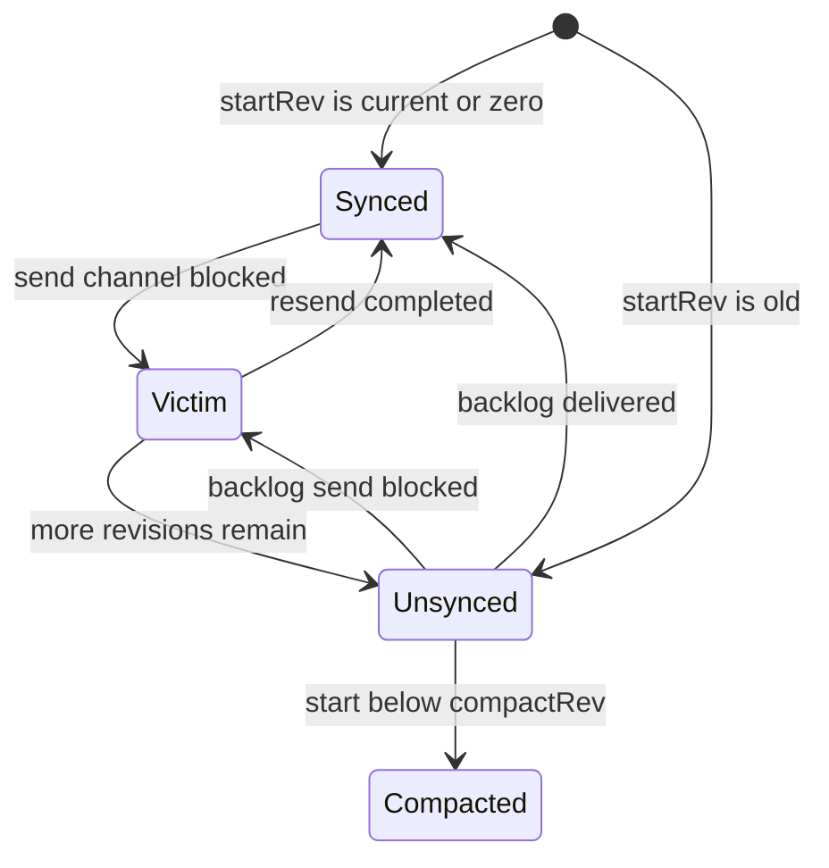

# 第15章 watch

> 本章で読むソース
>
> - [`server/storage/mvcc/watchable_store.go`](https://github.com/etcd-io/etcd/blob/v3.6.12/server/storage/mvcc/watchable_store.go)

## この章の狙い

本章では MVCC の watch が、変更 event を watcher に届ける仕組みを読む。
synced watcher、unsynced watcher、victim watcher の三分類を軸に、遅い受信者を処理から分離する方法を確認する。

## 前提

watch は指定 key 範囲の変更を revision 順に受け取る API である。
watch は MVCC の revision と compaction の影響を受けるため、start revision と compact revision の比較が必要になる。

## 全体の流れ



## watchableStore の分類

`watchableStore` は `unsynced`、`synced`、`victims` を分けて保持する。
`New` は backlog を埋める loop と、詰まった watcher を再送する loop を別 goroutine として起動する。

`watchableStore` は synced、unsynced、victims を分け、二つの同期 loop を起動する。

[server/storage/mvcc/watchable_store.go L56-L110](https://github.com/etcd-io/etcd/blob/v3.6.12/server/storage/mvcc/watchable_store.go#L56-L110)

```go
type watchableStore struct {
	*store

	// mu protects watcher groups and batches. It should never be locked
	// before locking store.mu to avoid deadlock.
	mu sync.RWMutex

	// victims are watcher batches that were blocked on the watch channel
	victims []watcherBatch
	victimc chan struct{}

	// contains all unsynced watchers that needs to sync with events that have happened
	unsynced watcherGroup

	// contains all synced watchers that are in sync with the progress of the store.
	// The key of the map is the key that the watcher watches on.
	synced watcherGroup

	stopc chan struct{}
	wg    sync.WaitGroup
}

var _ WatchableKV = (*watchableStore)(nil)

// cancelFunc updates unsynced and synced maps when running
// cancel operations.
type cancelFunc func()

func New(lg *zap.Logger, b backend.Backend, le lease.Lessor, cfg StoreConfig) WatchableKV {
	s := newWatchableStore(lg, b, le, cfg)
	s.wg.Add(2)
	go s.syncWatchersLoop()
	go s.syncVictimsLoop()
	return s
}

func newWatchableStore(lg *zap.Logger, b backend.Backend, le lease.Lessor, cfg StoreConfig) *watchableStore {
	if lg == nil {
		lg = zap.NewNop()
	}
	s := &watchableStore{
		store:    NewStore(lg, b, le, cfg),
		victimc:  make(chan struct{}, 1),
		unsynced: newWatcherGroup(),
		synced:   newWatcherGroup(),
		stopc:    make(chan struct{}),
	}
	s.store.ReadView = &readView{s}
	s.store.WriteView = &writeView{s}
	if s.le != nil {
		// use this store as the deleter so revokes trigger watch events
		s.le.SetRangeDeleter(func() lease.TxnDelete { return s.Write(traceutil.TODO()) })
	}
	return s
}
```

## 登録時に synced か unsynced を決める

`watch` は start revision が現在より後か zero なら synced に入れ、それ以外なら unsynced に入れる。
古い revision から始める watcher は過去 event を backend から読んで追いつく必要がある。

`watch` は start revision と current revision を比べて watcher group を選ぶ。

[server/storage/mvcc/watchable_store.go L128-L157](https://github.com/etcd-io/etcd/blob/v3.6.12/server/storage/mvcc/watchable_store.go#L128-L157)

```go
func (s *watchableStore) watch(key, end []byte, startRev int64, id WatchID, ch chan<- WatchResponse, fcs ...FilterFunc) (*watcher, cancelFunc) {
	wa := &watcher{
		key:      key,
		end:      end,
		startRev: startRev,
		minRev:   startRev,
		id:       id,
		ch:       ch,
		fcs:      fcs,
	}

	s.mu.Lock()
	s.revMu.RLock()
	synced := startRev > s.store.currentRev || startRev == 0
	if synced {
		wa.minRev = s.store.currentRev + 1
		if startRev > wa.minRev {
			wa.minRev = startRev
		}
		s.synced.add(wa)
	} else {
		slowWatcherGauge.Inc()
		s.unsynced.add(wa)
	}
	s.revMu.RUnlock()
	s.mu.Unlock()

	watcherGauge.Inc()

	return wa, func() { s.cancelWatcher(wa) }
```

## 遅い watcher を victim に逃がす

`syncWatchers` は unsynced watcher の backlog をまとめて読み、送信できない watcher を victim batch に移す。
`notify` も synced watcher への即時送信が詰まった場合、watcher を victim に移して main notify path を止めない。

`syncWatchers` は backlog event を作り、送信できない watcher を victims に移す。

[server/storage/mvcc/watchable_store.go L346-L405](https://github.com/etcd-io/etcd/blob/v3.6.12/server/storage/mvcc/watchable_store.go#L346-L405)

```go
func (s *watchableStore) syncWatchers() int {
	s.mu.Lock()
	defer s.mu.Unlock()

	if s.unsynced.size() == 0 {
		return 0
	}

	s.store.revMu.RLock()
	defer s.store.revMu.RUnlock()

	// in order to find key-value pairs from unsynced watchers, we need to
	// find min revision index, and these revisions can be used to
	// query the backend store of key-value pairs
	curRev := s.store.currentRev
	compactionRev := s.store.compactMainRev

	wg, minRev := s.unsynced.choose(maxWatchersPerSync, curRev, compactionRev)
	evs := rangeEvents(s.store.lg, s.store.b, minRev, curRev+1, wg)

	victims := make(watcherBatch)
	wb := newWatcherBatch(wg, evs)
	for w := range wg.watchers {
		if w.minRev < compactionRev {
			// Skip the watcher that failed to send compacted watch response due to w.ch is full.
			// Next retry of syncWatchers would try to resend the compacted watch response to w.ch
			continue
		}
		w.minRev = max(curRev+1, w.minRev)

		eb, ok := wb[w]
		if !ok {
			// bring un-notified watcher to synced
			s.synced.add(w)
			s.unsynced.delete(w)
			continue
		}

		if eb.moreRev != 0 {
			w.minRev = eb.moreRev
		}

		if w.send(WatchResponse{WatchID: w.id, Events: eb.evs, Revision: curRev}) {
			pendingEventsGauge.Add(float64(len(eb.evs)))
		} else {
			w.victim = true
		}

		if w.victim {
			victims[w] = eb
		} else {
			if eb.moreRev != 0 {
				// stay unsynced; more to read
				continue
			}
			s.synced.add(w)
		}
		s.unsynced.delete(w)
	}
	s.addVictim(victims)
```

`notify` は synced watcher への送信失敗時に victim batch を追加する。

[server/storage/mvcc/watchable_store.go L468-L503](https://github.com/etcd-io/etcd/blob/v3.6.12/server/storage/mvcc/watchable_store.go#L468-L503)

```go
func (s *watchableStore) notify(rev int64, evs []mvccpb.Event) {
	victim := make(watcherBatch)
	for w, eb := range newWatcherBatch(&s.synced, evs) {
		if eb.revs != 1 {
			s.store.lg.Panic(
				"unexpected multiple revisions in watch notification",
				zap.Int("number-of-revisions", eb.revs),
			)
		}
		if w.send(WatchResponse{WatchID: w.id, Events: eb.evs, Revision: rev}) {
			pendingEventsGauge.Add(float64(len(eb.evs)))
		} else {
			// move slow watcher to victims
			w.victim = true
			victim[w] = eb
			s.synced.delete(w)
			slowWatcherGauge.Inc()
		}
		// always update minRev
		// in case 'send' returns true and watcher stays synced, this is needed for Restore when all watchers become unsynced
		// in case 'send' returns false, this is needed for syncWatchers
		w.minRev = rev + 1
	}
	s.addVictim(victim)
}

func (s *watchableStore) addVictim(victim watcherBatch) {
	if len(victim) == 0 {
		return
	}
	s.victims = append(s.victims, victim)
	select {
	case s.victimc <- struct{}{}:
	default:
	}
}
```

新規 watcher は start revision と current revision の関係で synced か unsynced に振り分ける。

[`server/storage/mvcc/watchable_store.go` L128-L157](https://github.com/etcd-io/etcd/blob/v3.6.12/server/storage/mvcc/watchable_store.go#L128-L157)

```go
func (s *watchableStore) watch(key, end []byte, startRev int64, id WatchID, ch chan<- WatchResponse, fcs ...FilterFunc) (*watcher, cancelFunc) {
	wa := &watcher{
		key:      key,
		end:      end,
		startRev: startRev,
		minRev:   startRev,
		id:       id,
		ch:       ch,
		fcs:      fcs,
	}

	s.mu.Lock()
	s.revMu.RLock()
	synced := startRev > s.store.currentRev || startRev == 0
	if synced {
		wa.minRev = s.store.currentRev + 1
		if startRev > wa.minRev {
			wa.minRev = startRev
		}
		s.synced.add(wa)
	} else {
		slowWatcherGauge.Inc()
		s.unsynced.add(wa)
	}
	s.revMu.RUnlock()
	s.mu.Unlock()

	watcherGauge.Inc()

	return wa, func() { s.cancelWatcher(wa) }
}
```

`syncWatchersLoop` は 100ms 周期で unsynced watcher の backlog 同期を進める。

[`server/storage/mvcc/watchable_store.go` L223-L252](https://github.com/etcd-io/etcd/blob/v3.6.12/server/storage/mvcc/watchable_store.go#L223-L252)

```go
// syncWatchersLoop syncs the watcher in the unsynced map every 100ms.
func (s *watchableStore) syncWatchersLoop() {
	defer s.wg.Done()

	delayTicker := time.NewTicker(watchResyncPeriod)
	defer delayTicker.Stop()

	for {
		s.mu.RLock()
		st := time.Now()
		lastUnsyncedWatchers := s.unsynced.size()
		s.mu.RUnlock()

		unsyncedWatchers := 0
		if lastUnsyncedWatchers > 0 {
			unsyncedWatchers = s.syncWatchers()
		}
		syncDuration := time.Since(st)

		delayTicker.Reset(watchResyncPeriod)
		// more work pending?
		if unsyncedWatchers != 0 && lastUnsyncedWatchers > unsyncedWatchers {
			// be fair to other store operations by yielding time taken
			delayTicker.Reset(syncDuration)
		}

		select {
		case <-delayTicker.C:
		case <-s.stopc:
```

## 最適化の工夫

遅い watcher を `victims` に分離することで、ある client の受信 channel 詰まりが他の watcher への通知処理を直接止めない。
`syncWatchers` は `maxWatchersPerSync` で backlog 同期の対象数を制限し、一度の同期で長時間 lock を保持しない。

## まとめ

- watch は current revision に追いついた watcher と backlog を読む watcher を明確に分ける。
- victim queue は遅い受信者を隔離し、通知の head of line blocking を抑える。

## 関連する章

- [MVCC の revision index](../part01-storage/06-mvcc-revision-index.md)
- [MVCC の read と write](../part02-mvcc/07-mvcc-read-write.md)
- [コンパクション](../part02-mvcc/08-compaction.md)
- [gRPC proxy](../part06-client/21-grpcproxy.md)
