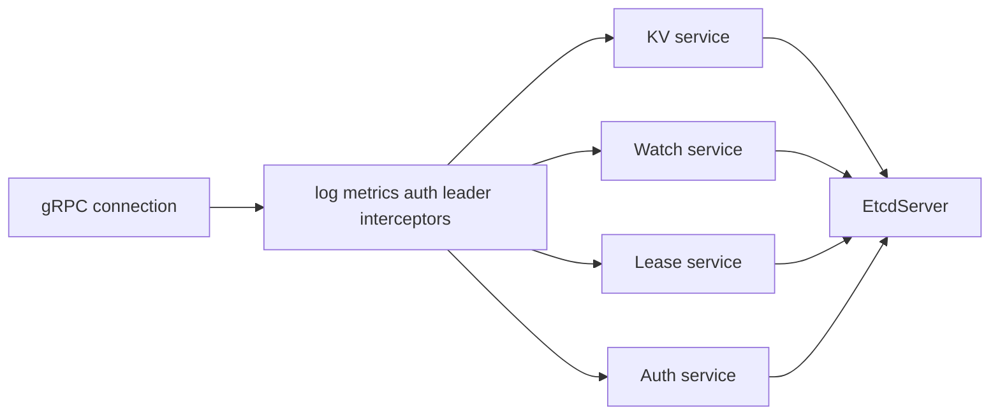

# 第16章 gRPC v3 server

> 本章で読むソース
>
> - [`server/etcdserver/api/v3rpc/grpc.go`](https://github.com/etcd-io/etcd/blob/v3.6.12/server/etcdserver/api/v3rpc/grpc.go)
> - [`server/etcdserver/api/v3rpc/interceptor.go`](https://github.com/etcd-io/etcd/blob/v3.6.12/server/etcdserver/api/v3rpc/interceptor.go)
> - [`server/etcdserver/api/v3rpc/key.go`](https://github.com/etcd-io/etcd/blob/v3.6.12/server/etcdserver/api/v3rpc/key.go)

## この章の狙い

本章では gRPC v3 server が interceptor、service 登録、message size 制限をどのように構成するかを読む。
API handler が `EtcdServer` に委譲する前に行う検証と header 補完を確認する。

## 前提

etcd v3 API は protobuf と gRPC で公開される。
handler は Raft や MVCC を直接操作せず、`EtcdServer` の interface に委譲する。

## 全体の流れ



## server option と service 登録

`Server` は custom codec、TLS credential、metrics、unary と stream interceptor、message size を設定する。
その後 KV、Watch、Lease、Cluster、Auth、Maintenance の各 service を同じ gRPC server に登録する。

`Server` は interceptor chain と service 登録をまとめて構成する。

[server/etcdserver/api/v3rpc/grpc.go L44-L95](https://github.com/etcd-io/etcd/blob/v3.6.12/server/etcdserver/api/v3rpc/grpc.go#L44-L95)

```go
func Server(s *etcdserver.EtcdServer, tls *tls.Config, interceptor grpc.UnaryServerInterceptor, gopts ...grpc.ServerOption) *grpc.Server {
	var opts []grpc.ServerOption
	opts = append(opts, grpc.CustomCodec(&codec{}))
	if tls != nil {
		opts = append(opts, grpc.Creds(credentials.NewTransportCredential(tls)))
	}

	serverMetrics := getServerMetrics(s.Cfg.Metrics, s.Cfg.Logger)

	chainUnaryInterceptors := []grpc.UnaryServerInterceptor{
		newLogUnaryInterceptor(s),
		serverMetrics.UnaryServerInterceptor(),
		newUnaryInterceptor(s),
	}
	if interceptor != nil {
		chainUnaryInterceptors = append(chainUnaryInterceptors, interceptor)
	}

	chainStreamInterceptors := []grpc.StreamServerInterceptor{
		serverMetrics.StreamServerInterceptor(),
		newStreamInterceptor(s),
	}

	if s.Cfg.EnableDistributedTracing {
		opts = append(opts, grpc.StatsHandler(otelgrpc.NewServerHandler(s.Cfg.TracerOptions...)))
	}

	opts = append(opts, grpc.ChainUnaryInterceptor(chainUnaryInterceptors...))
	opts = append(opts, grpc.ChainStreamInterceptor(chainStreamInterceptors...))

	opts = append(opts, grpc.MaxRecvMsgSize(int(s.Cfg.MaxRequestBytesWithOverhead())))
	opts = append(opts, grpc.MaxSendMsgSize(maxSendBytes))
	opts = append(opts, grpc.MaxConcurrentStreams(s.Cfg.MaxConcurrentStreams))

	grpcServer := grpc.NewServer(append(opts, gopts...)...)

	pb.RegisterKVServer(grpcServer, NewQuotaKVServer(s))
	pb.RegisterWatchServer(grpcServer, NewWatchServer(s))
	pb.RegisterLeaseServer(grpcServer, NewQuotaLeaseServer(s))
	pb.RegisterClusterServer(grpcServer, NewClusterServer(s))
	pb.RegisterAuthServer(grpcServer, NewAuthServer(s))

	hsrv := health.NewServer()
	healthNotifier := newHealthNotifier(hsrv, s)
	healthpb.RegisterHealthServer(grpcServer, hsrv)
	pb.RegisterMaintenanceServer(grpcServer, NewMaintenanceServer(s, healthNotifier))

	// set zero values for metrics registered for this grpc server
	serverMetrics.InitializeMetrics(grpcServer)

	return grpcServer
}
```

## interceptor は共通制御を先に行う

unary interceptor は metadata から API version と leader requirement を読み、leader 不在の request を handler 前に拒否できる。
log interceptor は handler 実行後に request と response の大きさを観測し、遅い request を記録する。

`newUnaryInterceptor` と log interceptor は API version、leader requirement、遅延ログを扱う。

[server/etcdserver/api/v3rpc/interceptor.go L55-L101](https://github.com/etcd-io/etcd/blob/v3.6.12/server/etcdserver/api/v3rpc/interceptor.go#L55-L101)

```go

		md, ok := metadata.FromIncomingContext(ctx)
		if ok {
			ver, vs := "unknown", md.Get(rpctypes.MetadataClientAPIVersionKey)
			if len(vs) > 0 {
				ver = vs[0]
			}
			if !utf8.ValidString(ver) {
				return nil, rpctypes.ErrGRPCInvalidClientAPIVersion
			}
			clientRequests.WithLabelValues("unary", ver).Inc()

			if ks := md[rpctypes.MetadataRequireLeaderKey]; len(ks) > 0 && ks[0] == rpctypes.MetadataHasLeader {
				if s.Leader() == types.ID(raft.None) {
					return nil, rpctypes.ErrGRPCNoLeader
				}
			}
		}

		return handler(ctx, req)
	}
}

func newLogUnaryInterceptor(s *etcdserver.EtcdServer) grpc.UnaryServerInterceptor {
	return func(ctx context.Context, req any, info *grpc.UnaryServerInfo, handler grpc.UnaryHandler) (any, error) {
		startTime := time.Now()
		resp, err := handler(ctx, req)
		lg := s.Logger()
		if lg != nil { // acquire stats if debug level is enabled or RequestInfo is expensive
			defer logUnaryRequestStats(ctx, lg, s.Cfg.WarningUnaryRequestDuration, info, startTime, req, resp)
		}
		return resp, err
	}
}

func logUnaryRequestStats(ctx context.Context, lg *zap.Logger, warnLatency time.Duration, info *grpc.UnaryServerInfo, startTime time.Time, req any, resp any) {
	duration := time.Since(startTime)
	var enabledDebugLevel, expensiveRequest bool
	if lg.Core().Enabled(zap.DebugLevel) {
		enabledDebugLevel = true
	}
	if duration > warnLatency {
		expensiveRequest = true
	}
	if !enabledDebugLevel && !expensiveRequest {
		return
	}
```

## KV handler は validation と委譲を行う

`kvServer` は request を検証し、`RaftKV` interface を通じて `EtcdServer` に委譲する。
response header は handler の最後に補完され、cluster ID や member ID の共通情報を API response に付ける。

`kvServer.Range` は request 検証、`EtcdServer.Range` 呼び出し、header 補完を行う。

[server/etcdserver/api/v3rpc/key.go L27-L54](https://github.com/etcd-io/etcd/blob/v3.6.12/server/etcdserver/api/v3rpc/key.go#L27-L54)

```go
type kvServer struct {
	hdr header
	kv  etcdserver.RaftKV
	aa  *AuthAdmin
	// maxTxnOps is the max operations per txn.
	// e.g suppose maxTxnOps = 128.
	// Txn.Success can have at most 128 operations,
	// and Txn.Failure can have at most 128 operations.
	maxTxnOps uint
}

func NewKVServer(s *etcdserver.EtcdServer) pb.KVServer {
	return &kvServer{hdr: newHeader(s), kv: s, aa: &AuthAdmin{s}, maxTxnOps: s.Cfg.MaxTxnOps}
}

func (s *kvServer) Range(ctx context.Context, r *pb.RangeRequest) (*pb.RangeResponse, error) {
	if err := checkRangeRequest(r); err != nil {
		return nil, err
	}

	resp, err := s.kv.Range(ctx, r)
	if err != nil {
		return nil, togRPCError(err)
	}

	s.hdr.fill(resp.Header)
	return resp, nil
}
```

## 最適化の工夫

`grpc.MaxRecvMsgSize` を `MaxRequestBytesWithOverhead` に合わせることで、巨大 request を handler に入る前に gRPC 層で止められる。
metrics server は package level cache で一度だけ作られ、複数 server 作成時の Prometheus registration 重複を避ける。

## まとめ

- gRPC v3 server は service の集合ではなく、interceptor による共通制御を前段に置く API 境界である。
- 各 service handler は validation と header 補完を行い、状態変更は `EtcdServer` に委譲する。

## 関連する章

- [transaction](../part04-txn-lease-watch/13-transaction.md)
- [リース](../part04-txn-lease-watch/14-lease.md)
- [watch](../part04-txn-lease-watch/15-watch.md)
- [KV Range](17-kv-range.md)
- [auth と RBAC](18-auth-rbac.md)
