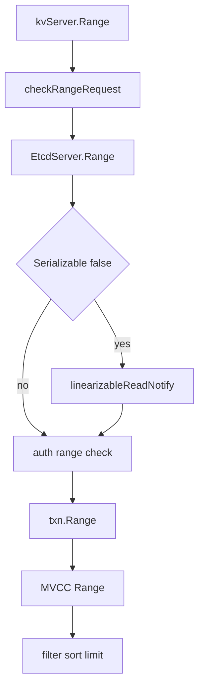

# 第17章 KV Range

> 本章で読むソース
>
> - [`server/etcdserver/api/v3rpc/key.go`](https://github.com/etcd-io/etcd/blob/v3.6.12/server/etcdserver/api/v3rpc/key.go)
> - [`server/etcdserver/v3_server.go`](https://github.com/etcd-io/etcd/blob/v3.6.12/server/etcdserver/v3_server.go)
> - [`server/etcdserver/txn/txn.go`](https://github.com/etcd-io/etcd/blob/v3.6.12/server/etcdserver/txn/txn.go)
> - [`server/storage/mvcc/kvstore_txn.go`](https://github.com/etcd-io/etcd/blob/v3.6.12/server/storage/mvcc/kvstore_txn.go)

## この章の狙い

本章では KV の Range request が gRPC handler から `EtcdServer.Range`、MVCC Range へ降りる流れを読む。
serializable read とリニアライザブル read、sort と limit、count only の処理位置を整理する。

## 前提

第16章で `kvServer.Range` が `EtcdServer.Range` に委譲することを見た。
第7章で MVCC read が index から backend を読むことを見た。

## 全体の流れ



## gRPC handler の入口

`kvServer.Range` は request の形式を検査し、`EtcdServer.Range` の error を gRPC error へ変換する。
handler は storage を直接読まず、header を補完して response を返すだけに保つ。

`kvServer` は Range、Put、DeleteRange、Txn、Compact を検証して `RaftKV` へ委譲する。

[server/etcdserver/api/v3rpc/key.go L42-L116](https://github.com/etcd-io/etcd/blob/v3.6.12/server/etcdserver/api/v3rpc/key.go#L42-L116)

```go
func (s *kvServer) Range(ctx context.Context, r *pb.RangeRequest) (*pb.RangeResponse, error) {
	if err := checkRangeRequest(r); err != nil {
		return nil, err
	}

	resp, err := s.kv.Range(ctx, r)
	if err != nil {
		return nil, togRPCError(err)
	}

	s.hdr.fill(resp.Header)
	return resp, nil
}

func (s *kvServer) Put(ctx context.Context, r *pb.PutRequest) (*pb.PutResponse, error) {
	if err := checkPutRequest(r); err != nil {
		return nil, err
	}

	resp, err := s.kv.Put(ctx, r)
	if err != nil {
		return nil, togRPCError(err)
	}

	s.hdr.fill(resp.Header)
	return resp, nil
}

func (s *kvServer) DeleteRange(ctx context.Context, r *pb.DeleteRangeRequest) (*pb.DeleteRangeResponse, error) {
	if err := checkDeleteRequest(r); err != nil {
		return nil, err
	}

	resp, err := s.kv.DeleteRange(ctx, r)
	if err != nil {
		return nil, togRPCError(err)
	}

	s.hdr.fill(resp.Header)
	return resp, nil
}

func (s *kvServer) Txn(ctx context.Context, r *pb.TxnRequest) (*pb.TxnResponse, error) {
	if err := checkTxnRequest(r, int(s.maxTxnOps)); err != nil {
		return nil, err
	}
	// check for forbidden put/del overlaps after checking request to avoid quadratic blowup
	if _, _, err := checkIntervals(r.Success); err != nil {
		return nil, err
	}
	if _, _, err := checkIntervals(r.Failure); err != nil {
		return nil, err
	}

	resp, err := s.kv.Txn(ctx, r)
	if err != nil {
		return nil, togRPCError(err)
	}

	s.hdr.fill(resp.Header)
	return resp, nil
}

func (s *kvServer) Compact(ctx context.Context, r *pb.CompactionRequest) (*pb.CompactionResponse, error) {
	if err := s.aa.isPermitted(ctx); err != nil {
		return nil, togRPCError(err)
	}

	resp, err := s.kv.Compact(ctx, r)
	if err != nil {
		return nil, togRPCError(err)
	}

	s.hdr.fill(resp.Header)
	return resp, nil
```

## Range は ReadIndex と auth を挟む

`EtcdServer.Range` は serializable でない request に対して `linearizableReadNotify` を呼び、Raft 側の現在 index を確認する。
その後、auth store の range permission を検査し、`txn.Range` を実行する。

`EtcdServer.Range` は ReadIndex、auth check、`txn.Range` を順に実行する。

[server/etcdserver/v3_server.go L103-L140](https://github.com/etcd-io/etcd/blob/v3.6.12/server/etcdserver/v3_server.go#L103-L140)

```go
func (s *EtcdServer) Range(ctx context.Context, r *pb.RangeRequest) (*pb.RangeResponse, error) {
	trace := traceutil.New("range",
		s.Logger(),
		traceutil.Field{Key: "range_begin", Value: string(r.Key)},
		traceutil.Field{Key: "range_end", Value: string(r.RangeEnd)},
	)
	ctx = context.WithValue(ctx, traceutil.TraceKey{}, trace)

	var resp *pb.RangeResponse
	var err error
	defer func(start time.Time) {
		txn.WarnOfExpensiveReadOnlyRangeRequest(s.Logger(), s.Cfg.WarningApplyDuration, start, r, resp, err)
		if resp != nil {
			trace.AddField(
				traceutil.Field{Key: "response_count", Value: len(resp.Kvs)},
				traceutil.Field{Key: "response_revision", Value: resp.Header.Revision},
			)
		}
		trace.LogIfLong(traceThreshold)
	}(time.Now())

	if !r.Serializable {
		err = s.linearizableReadNotify(ctx)
		trace.Step("agreement among raft nodes before linearized reading")
		if err != nil {
			return nil, err
		}
	}
	chk := func(ai *auth.AuthInfo) error {
		return s.authStore.IsRangePermitted(ai, r.Key, r.RangeEnd)
	}

	get := func() { resp, _, err = txn.Range(ctx, s.Logger(), s.KV(), r) }
	if serr := s.doSerialize(ctx, chk, get); serr != nil {
		err = serr
		return nil, err
	}
	return resp, err
```

## filter と sort は MVCC 結果に対して行う

`txn.Range` は MVCC から得た key value に対し、revision filter、sort、limit、keys only を適用して response を組み立てる。
key の昇順で済む場合は再 sort を避け、それ以外の sort target のときだけ sorter を作る。

`txn.Range` は filter、sort、limit、response 組み立てを行う。

[server/etcdserver/txn/txn.go L180-L249](https://github.com/etcd-io/etcd/blob/v3.6.12/server/etcdserver/txn/txn.go#L180-L249)

```go
	if r.MaxModRevision != 0 {
		f := func(kv *mvccpb.KeyValue) bool { return kv.ModRevision > r.MaxModRevision }
		pruneKVs(rr, f)
	}
	if r.MinModRevision != 0 {
		f := func(kv *mvccpb.KeyValue) bool { return kv.ModRevision < r.MinModRevision }
		pruneKVs(rr, f)
	}
	if r.MaxCreateRevision != 0 {
		f := func(kv *mvccpb.KeyValue) bool { return kv.CreateRevision > r.MaxCreateRevision }
		pruneKVs(rr, f)
	}
	if r.MinCreateRevision != 0 {
		f := func(kv *mvccpb.KeyValue) bool { return kv.CreateRevision < r.MinCreateRevision }
		pruneKVs(rr, f)
	}

	sortOrder := r.SortOrder
	if r.SortTarget != pb.RangeRequest_KEY && sortOrder == pb.RangeRequest_NONE {
		// Since current mvcc.Range implementation returns results
		// sorted by keys in lexiographically ascending order,
		// sort ASCEND by default only when target is not 'KEY'
		sortOrder = pb.RangeRequest_ASCEND
	} else if r.SortTarget == pb.RangeRequest_KEY && sortOrder == pb.RangeRequest_ASCEND {
		// Since current mvcc.Range implementation returns results
		// sorted by keys in lexiographically ascending order,
		// don't re-sort when target is 'KEY' and order is ASCEND
		sortOrder = pb.RangeRequest_NONE
	}
	if sortOrder != pb.RangeRequest_NONE {
		var sorter sort.Interface
		switch {
		case r.SortTarget == pb.RangeRequest_KEY:
			sorter = &kvSortByKey{&kvSort{rr.KVs}}
		case r.SortTarget == pb.RangeRequest_VERSION:
			sorter = &kvSortByVersion{&kvSort{rr.KVs}}
		case r.SortTarget == pb.RangeRequest_CREATE:
			sorter = &kvSortByCreate{&kvSort{rr.KVs}}
		case r.SortTarget == pb.RangeRequest_MOD:
			sorter = &kvSortByMod{&kvSort{rr.KVs}}
		case r.SortTarget == pb.RangeRequest_VALUE:
			sorter = &kvSortByValue{&kvSort{rr.KVs}}
		default:
			lg.Panic("unexpected sort target", zap.Int32("sort-target", int32(r.SortTarget)))
		}
		switch {
		case sortOrder == pb.RangeRequest_ASCEND:
			sort.Sort(sorter)
		case sortOrder == pb.RangeRequest_DESCEND:
			sort.Sort(sort.Reverse(sorter))
		}
	}

	if r.Limit > 0 && len(rr.KVs) > int(r.Limit) {
		rr.KVs = rr.KVs[:r.Limit]
		resp.More = true
	}
	trace.Step("filter and sort the key-value pairs")
	resp.Header.Revision = rr.Rev
	resp.Count = int64(rr.Count)
	resp.Kvs = make([]*mvccpb.KeyValue, len(rr.KVs))
	for i := range rr.KVs {
		if r.KeysOnly {
			rr.KVs[i].Value = nil
		}
		resp.Kvs[i] = &rr.KVs[i]
	}
	trace.Step("assemble the response")
	return resp, nil
}
```

`rangeKeys` は revision を解決し、backend key を読んで MVCC value を得る。

[server/storage/mvcc/kvstore_txn.go L72-L109](https://github.com/etcd-io/etcd/blob/v3.6.12/server/storage/mvcc/kvstore_txn.go#L72-L109)

```go
func (tr *storeTxnCommon) rangeKeys(ctx context.Context, key, end []byte, curRev int64, ro RangeOptions) (*RangeResult, error) {
	rev := ro.Rev
	if rev > curRev {
		return &RangeResult{KVs: nil, Count: -1, Rev: curRev}, ErrFutureRev
	}
	if rev <= 0 {
		rev = curRev
	}
	if rev < tr.s.compactMainRev {
		return &RangeResult{KVs: nil, Count: -1, Rev: 0}, ErrCompacted
	}
	if ro.Count {
		total := tr.s.kvindex.CountRevisions(key, end, rev)
		tr.trace.Step("count revisions from in-memory index tree")
		return &RangeResult{KVs: nil, Count: total, Rev: curRev}, nil
	}
	revpairs, total := tr.s.kvindex.Revisions(key, end, rev, int(ro.Limit))
	tr.trace.Step("range keys from in-memory index tree")
	if len(revpairs) == 0 {
		return &RangeResult{KVs: nil, Count: total, Rev: curRev}, nil
	}

	limit := int(ro.Limit)
	if limit <= 0 || limit > len(revpairs) {
		limit = len(revpairs)
	}

	kvs := make([]mvccpb.KeyValue, limit)
	revBytes := NewRevBytes()
	for i, revpair := range revpairs[:len(kvs)] {
		select {
		case <-ctx.Done():
			return nil, fmt.Errorf("rangeKeys: context cancelled: %w", ctx.Err())
		default:
		}
		revBytes = RevToBytes(revpair, revBytes)
		_, vs := tr.tx.UnsafeRange(schema.Key, revBytes, nil, 0)
		if len(vs) != 1 {
```

Range request は handler 入口で key と sort option を検証する。

[`server/etcdserver/api/v3rpc/key.go` L119-L133](https://github.com/etcd-io/etcd/blob/v3.6.12/server/etcdserver/api/v3rpc/key.go#L119-L133)

```go
func checkRangeRequest(r *pb.RangeRequest) error {
	if len(r.Key) == 0 {
		return rpctypes.ErrGRPCEmptyKey
	}

	if _, ok := pb.RangeRequest_SortOrder_name[int32(r.SortOrder)]; !ok {
		return rpctypes.ErrGRPCInvalidSortOption
	}

	if _, ok := pb.RangeRequest_SortTarget_name[int32(r.SortTarget)]; !ok {
		return rpctypes.ErrGRPCInvalidSortOption
	}

	return nil
}
```

`Put` も validation 後に `EtcdServer` へ委譲し、response header を補完する。

[`server/etcdserver/api/v3rpc/key.go` L56-L67](https://github.com/etcd-io/etcd/blob/v3.6.12/server/etcdserver/api/v3rpc/key.go#L56-L67)

```go
func (s *kvServer) Put(ctx context.Context, r *pb.PutRequest) (*pb.PutResponse, error) {
	if err := checkPutRequest(r); err != nil {
		return nil, err
	}

	resp, err := s.kv.Put(ctx, r)
	if err != nil {
		return nil, togRPCError(err)
	}

	s.hdr.fill(resp.Header)
	return resp, nil
}
```

## 最適化の工夫

`txn.Range` は sort target が `KEY` で昇順のとき、MVCC が返す key 昇順をそのまま使い、追加 sort を行わない。
count only の request は `kvindex.CountRevisions` で数だけを返し、backend value の読み出しを避ける。

## まとめ

- Range は gRPC validation、ReadIndex、auth、MVCC read、response 整形の段階に分かれる。
- serializable read は ReadIndex を省けるが、同じ MVCC Range と auth check を通る。

## 関連する章

- [MVCC の read と write](../part02-mvcc/07-mvcc-read-write.md)
- [transaction](../part04-txn-lease-watch/13-transaction.md)
- [gRPC v3 server](16-grpc-v3-server.md)
- [リニアライザブル read](../part07-ops/22-linearizable-read.md)
