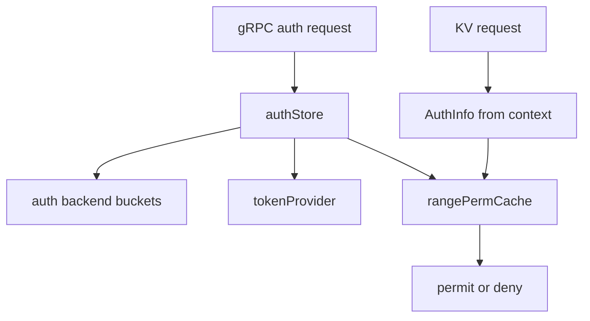

# 第18章 auth と RBAC

> 本章で読むソース
>
> - [`server/auth/store.go`](https://github.com/etcd-io/etcd/blob/v3.6.12/server/auth/store.go)
> - [`server/auth/range_perm_cache.go`](https://github.com/etcd-io/etcd/blob/v3.6.12/server/auth/range_perm_cache.go)

## この章の狙い

本章では auth store が user、role、permission、token をどのように管理するかを読む。
認証の有効化、password check、range permission cache の役割を確認する。

## 前提

gRPC handler は request ごとに auth 情報を context から取り出す。
auth の永続化は backend の auth bucket 群に保存される。

## 全体の流れ



## AuthStore の表面

`AuthStore` interface は user と role の管理だけでなく、KV request の permission check も担当する。
API layer はこの interface に依存するため、認証の有効無効や token の種類を handler から切り離せる。

`AuthStore` は認証、user と role 管理、permission check、token、revision を扱う。

[server/auth/store.go L91-L185](https://github.com/etcd-io/etcd/blob/v3.6.12/server/auth/store.go#L91-L185)

```go
type AuthStore interface {
	// AuthEnable turns on the authentication feature
	AuthEnable() error

	// AuthDisable turns off the authentication feature
	AuthDisable()

	// IsAuthEnabled returns true if the authentication feature is enabled.
	IsAuthEnabled() bool

	// Authenticate does authentication based on given user name and password
	Authenticate(ctx context.Context, username, password string) (*pb.AuthenticateResponse, error)

	// Recover recovers the state of auth store from the given backend
	Recover(be AuthBackend)

	// UserAdd adds a new user
	UserAdd(r *pb.AuthUserAddRequest) (*pb.AuthUserAddResponse, error)

	// UserDelete deletes a user
	UserDelete(r *pb.AuthUserDeleteRequest) (*pb.AuthUserDeleteResponse, error)

	// UserChangePassword changes a password of a user
	UserChangePassword(r *pb.AuthUserChangePasswordRequest) (*pb.AuthUserChangePasswordResponse, error)

	// UserGrantRole grants a role to the user
	UserGrantRole(r *pb.AuthUserGrantRoleRequest) (*pb.AuthUserGrantRoleResponse, error)

	// UserGet gets the detailed information of a users
	UserGet(r *pb.AuthUserGetRequest) (*pb.AuthUserGetResponse, error)

	// UserRevokeRole revokes a role of a user
	UserRevokeRole(r *pb.AuthUserRevokeRoleRequest) (*pb.AuthUserRevokeRoleResponse, error)

	// RoleAdd adds a new role
	RoleAdd(r *pb.AuthRoleAddRequest) (*pb.AuthRoleAddResponse, error)

	// RoleGrantPermission grants a permission to a role
	RoleGrantPermission(r *pb.AuthRoleGrantPermissionRequest) (*pb.AuthRoleGrantPermissionResponse, error)

	// RoleGet gets the detailed information of a role
	RoleGet(r *pb.AuthRoleGetRequest) (*pb.AuthRoleGetResponse, error)

	// RoleRevokePermission gets the detailed information of a role
	RoleRevokePermission(r *pb.AuthRoleRevokePermissionRequest) (*pb.AuthRoleRevokePermissionResponse, error)

	// RoleDelete gets the detailed information of a role
	RoleDelete(r *pb.AuthRoleDeleteRequest) (*pb.AuthRoleDeleteResponse, error)

	// UserList gets a list of all users
	UserList(r *pb.AuthUserListRequest) (*pb.AuthUserListResponse, error)

	// RoleList gets a list of all roles
	RoleList(r *pb.AuthRoleListRequest) (*pb.AuthRoleListResponse, error)

	// IsPutPermitted checks put permission of the user
	IsPutPermitted(authInfo *AuthInfo, key []byte) error

	// IsRangePermitted checks range permission of the user
	IsRangePermitted(authInfo *AuthInfo, key, rangeEnd []byte) error

	// IsDeleteRangePermitted checks delete-range permission of the user
	IsDeleteRangePermitted(authInfo *AuthInfo, key, rangeEnd []byte) error

	// IsAdminPermitted checks admin permission of the user
	IsAdminPermitted(authInfo *AuthInfo) error

	// GenTokenPrefix produces a random string in a case of simple token
	// in a case of JWT, it produces an empty string
	GenTokenPrefix() (string, error)

	// Revision gets current revision of authStore
	Revision() uint64

	// CheckPassword checks a given pair of username and password is correct
	CheckPassword(username, password string) (uint64, error)

	// Close does cleanup of AuthStore
	Close() error

	// AuthInfoFromCtx gets AuthInfo from gRPC's context
	AuthInfoFromCtx(ctx context.Context) (*AuthInfo, error)

	// AuthInfoFromTLS gets AuthInfo from TLS info of gRPC's context
	AuthInfoFromTLS(ctx context.Context) *AuthInfo

	// WithRoot generates and installs a token that can be used as a root credential
	WithRoot(ctx context.Context) context.Context

	// HasRole checks that user has role
	HasRole(user, role string) bool

	// BcryptCost gets strength of hashing bcrypted auth password
	BcryptCost() int
}
```

## 有効化と password check

`AuthEnable` は root user と root role を確認してから auth enabled flag を保存し、token provider を有効化する。
`CheckPassword` は backend lock 内で user と auth revision だけを読み、bcrypt の重い比較は lock の外で行う。

`AuthEnable` と `CheckPassword` は auth flag、token provider、bcrypt 比較を扱う。

[server/auth/store.go L266-L395](https://github.com/etcd-io/etcd/blob/v3.6.12/server/auth/store.go#L266-L395)

```go
func (as *authStore) AuthEnable() error {
	as.enabledMu.Lock()
	defer as.enabledMu.Unlock()
	if as.enabled {
		as.lg.Info("authentication is already enabled; ignored auth enable request")
		return nil
	}
	tx := as.be.BatchTx()
	tx.Lock()
	defer func() {
		tx.Unlock()
		as.be.ForceCommit()
	}()

	u := tx.UnsafeGetUser(rootUser)
	if u == nil {
		return ErrRootUserNotExist
	}

	if !hasRootRole(u) {
		return ErrRootRoleNotExist
	}

	tx.UnsafeSaveAuthEnabled(true)
	as.enabled = true
	as.tokenProvider.enable()

	as.refreshRangePermCache(tx)

	as.setRevision(tx.UnsafeReadAuthRevision())

	as.lg.Info("enabled authentication")
	return nil
}

func (as *authStore) AuthDisable() {
	as.enabledMu.Lock()
	defer as.enabledMu.Unlock()
	if !as.enabled {
		return
	}
	b := as.be

	tx := b.BatchTx()
	tx.Lock()
	tx.UnsafeSaveAuthEnabled(false)
	as.commitRevision(tx)
	tx.Unlock()

	b.ForceCommit()

	as.enabled = false
	as.tokenProvider.disable()

	as.lg.Info("disabled authentication")
}

func (as *authStore) Close() error {
	as.enabledMu.Lock()
	defer as.enabledMu.Unlock()
	if !as.enabled {
		return nil
	}
	as.tokenProvider.disable()
	return nil
}

func (as *authStore) Authenticate(ctx context.Context, username, password string) (*pb.AuthenticateResponse, error) {
	if !as.IsAuthEnabled() {
		return nil, ErrAuthNotEnabled
	}
	user := as.be.GetUser(username)
	if user == nil {
		return nil, ErrAuthFailed
	}

	if user.Options != nil && user.Options.NoPassword {
		return nil, ErrAuthFailed
	}

	// Password checking is already performed in the API layer, so we don't need to check for now.
	// Staleness of password can be detected with OCC in the API layer, too.

	token, err := as.tokenProvider.assign(ctx, username, as.Revision())
	if err != nil {
		return nil, err
	}

	if ce := as.lg.Check(zap.DebugLevel, "authenticated a user"); ce != nil {
		tokenFingerprint := redactToken(token)
		ce.Write(zap.String("user-name", username), zap.String("token-fingerprint", tokenFingerprint))
	}
	return &pb.AuthenticateResponse{Token: token}, nil
}

func (as *authStore) CheckPassword(username, password string) (uint64, error) {
	if !as.IsAuthEnabled() {
		return 0, ErrAuthNotEnabled
	}

	var user *authpb.User
	// CompareHashAndPassword is very expensive, so we use closures
	// to avoid putting it in the critical section of the tx lock.
	revision, err := func() (uint64, error) {
		tx := as.be.ReadTx()
		tx.RLock()
		defer tx.RUnlock()

		user = tx.UnsafeGetUser(username)
		if user == nil {
			return 0, ErrAuthFailed
		}

		if user.Options != nil && user.Options.NoPassword {
			return 0, ErrNoPasswordUser
		}

		return tx.UnsafeReadAuthRevision(), nil
	}()
	if err != nil {
		return 0, err
	}

	if bcrypt.CompareHashAndPassword(user.Password, []byte(password)) != nil {
		as.lg.Info("invalid password", zap.String("user-name", username))
		return 0, ErrAuthFailed
	}
	return revision, nil
}
```

`NewAuthStore` は bcrypt cost を検証し、auth buckets と revision を初期化する。

[server/auth/store.go L944-L980](https://github.com/etcd-io/etcd/blob/v3.6.12/server/auth/store.go#L944-L980)

```go
func NewAuthStore(lg *zap.Logger, be AuthBackend, tp TokenProvider, bcryptCost int) AuthStore {
	if lg == nil {
		lg = zap.NewNop()
	}

	if bcryptCost < bcrypt.MinCost || bcryptCost > bcrypt.MaxCost {
		lg.Warn(
			"use default bcrypt cost instead of the invalid given cost",
			zap.Int("min-cost", bcrypt.MinCost),
			zap.Int("max-cost", bcrypt.MaxCost),
			zap.Int("default-cost", bcrypt.DefaultCost),
			zap.Int("given-cost", bcryptCost),
		)
		bcryptCost = bcrypt.DefaultCost
	}

	be.CreateAuthBuckets()
	tx := be.BatchTx()
	// We should call LockOutsideApply here, but the txPostLockHoos isn't set
	// to EtcdServer yet, so it's OK.
	tx.Lock()
	enabled := tx.UnsafeReadAuthEnabled()
	as := &authStore{
		revision:       tx.UnsafeReadAuthRevision(),
		lg:             lg,
		be:             be,
		enabled:        enabled,
		rangePermCache: make(map[string]*unifiedRangePermissions),
		tokenProvider:  tp,
		bcryptCost:     bcryptCost,
	}

	if enabled {
		as.tokenProvider.enable()
	}

	if as.Revision() == 0 {
```

## auth の有効化

`AuthEnable` は root user と root role を確認してから auth を有効化し、range permission cache を更新する。

[`server/auth/store.go` L266-L293](https://github.com/etcd-io/etcd/blob/v3.6.12/server/auth/store.go#L266-L293)

```go
func (as *authStore) AuthEnable() error {
	as.enabledMu.Lock()
	defer as.enabledMu.Unlock()
	if as.enabled {
		as.lg.Info("authentication is already enabled; ignored auth enable request")
		return nil
	}
	tx := as.be.BatchTx()
	tx.Lock()
	defer func() {
		tx.Unlock()
		as.be.ForceCommit()
	}()

	u := tx.UnsafeGetUser(rootUser)
	if u == nil {
		return ErrRootUserNotExist
	}

	if !hasRootRole(u) {
		return ErrRootRoleNotExist
	}

	tx.UnsafeSaveAuthEnabled(true)
	as.enabled = true
	as.tokenProvider.enable()

	as.refreshRangePermCache(tx)
```

`isOpPermitted` は user の permission を cache から引き、range と point の両方を判定する。

[`server/auth/store.go` L859-L899](https://github.com/etcd-io/etcd/blob/v3.6.12/server/auth/store.go#L859-L899)

```go
func (as *authStore) isOpPermitted(userName string, revision uint64, key, rangeEnd []byte, permTyp authpb.Permission_Type) error {
	// TODO(mitake): this function would be costly so we need a caching mechanism
	if !as.IsAuthEnabled() {
		return nil
	}

	// only gets rev == 0 when passed AuthInfo{}; no user given
	if revision == 0 {
		return ErrUserEmpty
	}
	rev := as.Revision()
	if revision < rev {
		as.lg.Warn("request auth revision is less than current node auth revision",
			zap.Uint64("current node auth revision", rev),
			zap.Uint64("request auth revision", revision),
			zap.ByteString("request key", key),
			zap.Error(ErrAuthOldRevision))
		return ErrAuthOldRevision
	}

	tx := as.be.ReadTx()
	tx.RLock()
	defer tx.RUnlock()

	user := tx.UnsafeGetUser(userName)
	if user == nil {
		as.lg.Error("cannot find a user for permission check", zap.String("user-name", userName))
		return ErrPermissionDenied
	}

	// root role should have permission on all ranges
	if hasRootRole(user) {
		return nil
	}

	if as.isRangeOpPermitted(userName, key, rangeEnd, permTyp) {
		return nil
	}

	return ErrPermissionDenied
}
```

## 範囲権限を cache する

range permission cache は user ごとの read interval と write interval をまとめ、KV request 時に interval containment を見る。
role と permission を毎回 backend から読み直さず、auth revision 更新時に cache を更新する形で使う。

`checkKeyInterval` と `checkKeyPoint` は cached permission interval に対して read と write の許可を判定する。

[server/auth/range_perm_cache.go L73-L120](https://github.com/etcd-io/etcd/blob/v3.6.12/server/auth/range_perm_cache.go#L73-L120)

```go
func checkKeyInterval(
	lg *zap.Logger,
	cachedPerms *unifiedRangePermissions,
	key, rangeEnd []byte,
	permtyp authpb.Permission_Type,
) bool {
	if isOpenEnded(rangeEnd) {
		rangeEnd = nil
		// nil rangeEnd will be converetd to []byte{}, the largest element of BytesAffineComparable,
		// in NewBytesAffineInterval().
	}

	ivl := adt.NewBytesAffineInterval(key, rangeEnd)
	switch permtyp {
	case authpb.READ:
		return cachedPerms.readPerms.Contains(ivl)
	case authpb.WRITE:
		return cachedPerms.writePerms.Contains(ivl)
	default:
		lg.Panic("unknown auth type", zap.String("auth-type", permtyp.String()))
	}
	return false
}

func checkKeyPoint(lg *zap.Logger, cachedPerms *unifiedRangePermissions, key []byte, permtyp authpb.Permission_Type) bool {
	pt := adt.NewBytesAffinePoint(key)
	switch permtyp {
	case authpb.READ:
		return cachedPerms.readPerms.Intersects(pt)
	case authpb.WRITE:
		return cachedPerms.writePerms.Intersects(pt)
	default:
		lg.Panic("unknown auth type", zap.String("auth-type", permtyp.String()))
	}
	return false
}

func (as *authStore) isRangeOpPermitted(userName string, key, rangeEnd []byte, permtyp authpb.Permission_Type) bool {
	// assumption: tx is Lock()ed
	as.rangePermCacheMu.RLock()
	defer as.rangePermCacheMu.RUnlock()

	rangePerm, ok := as.rangePermCache[userName]
	if !ok {
		as.lg.Error(
			"user doesn't exist",
			zap.String("user-name", userName),
		)
```

## 最適化の工夫

`CheckPassword` は bcrypt 比較を backend read lock の外で実行するため、CPU 負荷の高い password check が他の auth read を長く塞ぎにくい。
range permission cache は role の permission list を interval tree に畳み込み、request ごとの permission 判定を cache lookup に近づける。

## まとめ

- auth store は user と role の管理だけでなく、KV request の認可判定を一手に担う。
- token と permission cache は、認証の安全性と request path の軽さを両立するための補助構造である。

## 関連する章

- [schema と keyspace](../part01-storage/04-schema-keyspace.md)
- [gRPC v3 server](16-grpc-v3-server.md)
- [KV Range](17-kv-range.md)
- [clientv3](../part06-client/19-clientv3.md)
