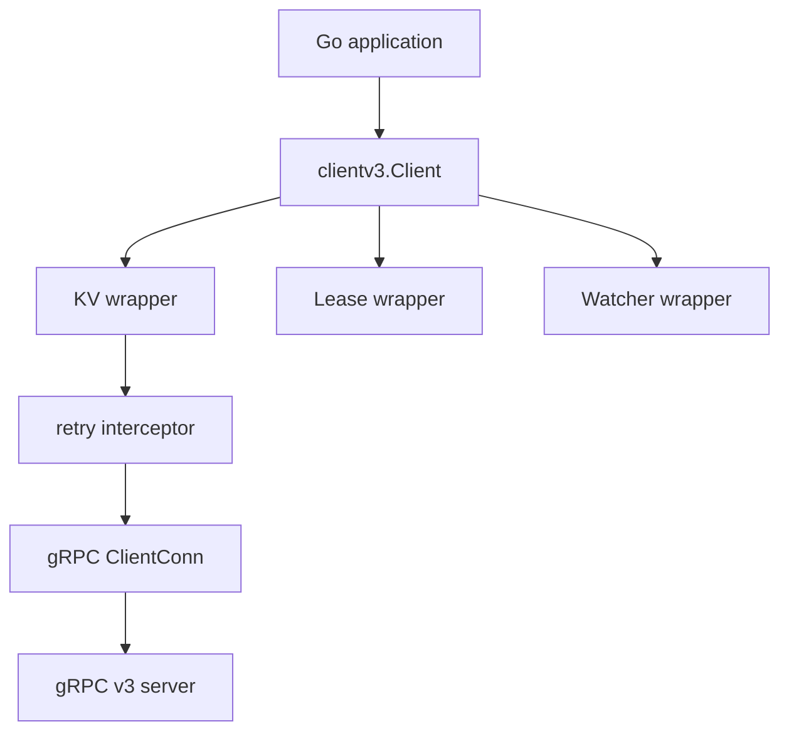

# 第19章 clientv3

> 本章で読むソース
>
> - [`client/v3/client.go`](https://github.com/etcd-io/etcd/blob/v3.6.12/client/v3/client.go)
> - [`client/v3/kv.go`](https://github.com/etcd-io/etcd/blob/v3.6.12/client/v3/kv.go)
> - [`client/v3/retry_interceptor.go`](https://github.com/etcd-io/etcd/blob/v3.6.12/client/v3/retry_interceptor.go)

## この章の狙い

本章では `client/v3` が gRPC connection、service wrapper、retry interceptor をどのように束ねるかを読む。
利用者が呼ぶ `Get` や `Put` が protobuf request と retry 付き gRPC call に変換される流れを確認する。

## 前提

server 側の v3 API は gRPC service として提供される。
clientv3 はその service を Go から扱いやすい interface に包む。

## 全体の流れ



## Client は service wrapper を埋め込む

`Client` は `KV`、`Lease`、`Watcher`、`Auth`、`Maintenance` を field として持つ。
この形により、利用者は同じ connection と endpoint 管理の上で複数 API を呼べる。

`Client` は service interface と gRPC connection と endpoint 管理を同じ構造体に持つ。

[client/v3/client.go L49-L88](https://github.com/etcd-io/etcd/blob/v3.6.12/client/v3/client.go#L49-L88)

```go
type Client struct {
	Cluster
	KV
	Lease
	Watcher
	Auth
	Maintenance

	conn *grpc.ClientConn

	cfg      Config
	creds    grpccredentials.TransportCredentials
	resolver *resolver.EtcdManualResolver

	epMu      *sync.RWMutex
	endpoints []string

	ctx    context.Context
	cancel context.CancelFunc

	// Username is a user name for authentication.
	Username string
	// Password is a password for authentication.
	Password        string
	authTokenBundle credentials.PerRPCCredentialsBundle

	callOpts []grpc.CallOption

	lgMu *sync.RWMutex
	lg   *zap.Logger
}

// New creates a new etcdv3 client from a given configuration.
func New(cfg Config) (*Client, error) {
	if len(cfg.Endpoints) == 0 {
		return nil, ErrNoAvailableEndpoints
	}

	return newClient(&cfg)
}
```

## newClient が connection と service を作る

`newClient` は TLS、logger、auth token bundle、message size、resolver、endpoints を設定して gRPC connection を張る。
connection 確立後に `NewKV`、`NewLease`、`NewWatcher` などを差し込み、client の表面 API を完成させる。

`newClient` は config から connection と service wrapper を初期化する。

[client/v3/client.go L370-L459](https://github.com/etcd-io/etcd/blob/v3.6.12/client/v3/client.go#L370-L459)

```go
func newClient(cfg *Config) (*Client, error) {
	if cfg == nil {
		cfg = &Config{}
	}
	var creds grpccredentials.TransportCredentials
	if cfg.TLS != nil {
		creds = credentials.NewTransportCredential(cfg.TLS)
	}

	// use a temporary skeleton client to bootstrap first connection
	baseCtx := context.TODO()
	if cfg.Context != nil {
		baseCtx = cfg.Context
	}

	ctx, cancel := context.WithCancel(baseCtx)
	client := &Client{
		conn:     nil,
		cfg:      *cfg,
		creds:    creds,
		ctx:      ctx,
		cancel:   cancel,
		epMu:     new(sync.RWMutex),
		callOpts: defaultCallOpts,
		lgMu:     new(sync.RWMutex),
	}

	var err error
	if cfg.Logger != nil {
		client.lg = cfg.Logger
	} else if cfg.LogConfig != nil {
		client.lg, err = cfg.LogConfig.Build()
	} else {
		client.lg, err = logutil.CreateDefaultZapLogger(etcdClientDebugLevel())
		if client.lg != nil {
			client.lg = client.lg.Named("etcd-client")
		}
	}
	if err != nil {
		return nil, err
	}

	if cfg.Username != "" && cfg.Password != "" {
		client.Username = cfg.Username
		client.Password = cfg.Password
		client.authTokenBundle = credentials.NewPerRPCCredentialBundle()
	}
	if cfg.MaxCallSendMsgSize > 0 || cfg.MaxCallRecvMsgSize > 0 {
		if cfg.MaxCallRecvMsgSize > 0 && cfg.MaxCallSendMsgSize > cfg.MaxCallRecvMsgSize {
			return nil, fmt.Errorf("gRPC message recv limit (%d bytes) must be greater than send limit (%d bytes)", cfg.MaxCallRecvMsgSize, cfg.MaxCallSendMsgSize)
		}
		callOpts := []grpc.CallOption{
			defaultWaitForReady,
			defaultMaxCallSendMsgSize,
			defaultMaxCallRecvMsgSize,
		}
		if cfg.MaxCallSendMsgSize > 0 {
			callOpts[1] = grpc.MaxCallSendMsgSize(cfg.MaxCallSendMsgSize)
		}
		if cfg.MaxCallRecvMsgSize > 0 {
			callOpts[2] = grpc.MaxCallRecvMsgSize(cfg.MaxCallRecvMsgSize)
		}
		client.callOpts = callOpts
	}

	client.resolver = resolver.New(cfg.Endpoints...)

	if len(cfg.Endpoints) < 1 {
		client.cancel()
		return nil, errors.New("at least one Endpoint is required in client config")
	}
	client.SetEndpoints(cfg.Endpoints...)

	// Use a provided endpoint target so that for https:// without any tls config given, then
	// grpc will assume the certificate server name is the endpoint host.
	conn, err := client.dialWithBalancer()
	if err != nil {
		client.cancel()
		client.resolver.Close()
		// TODO: Error like `fmt.Errorf(dialing [%s] failed: %v, strings.Join(cfg.Endpoints, ";"), err)` would help with debugging a lot.
		return nil, err
	}
	client.conn = conn

	client.Cluster = NewCluster(client)
	client.KV = NewKV(client)
	client.Lease = NewLease(client)
	client.Watcher = NewWatcher(client)
	client.Auth = NewAuth(client)
	client.Maintenance = NewMaintenance(client)
```

## KV wrapper と retry

`KV` wrapper は `Op` を protobuf request に変換し、remote client の Range、Put、DeleteRange、Txn を呼ぶ。
retry interceptor は retry 無効時に短絡し、context error、token refresh、安全でない retry を個別に判定する。

`KV` wrapper は user API を protobuf request に変換して remote service を呼ぶ。

[client/v3/kv.go L101-L180](https://github.com/etcd-io/etcd/blob/v3.6.12/client/v3/kv.go#L101-L180)

```go
func NewKV(c *Client) KV {
	api := &kv{remote: RetryKVClient(c)}
	if c != nil {
		api.callOpts = c.callOpts
	}
	return api
}

func NewKVFromKVClient(remote pb.KVClient, c *Client) KV {
	api := &kv{remote: remote}
	if c != nil {
		api.callOpts = c.callOpts
	}
	return api
}

func (kv *kv) Put(ctx context.Context, key, val string, opts ...OpOption) (*PutResponse, error) {
	r, err := kv.Do(ctx, OpPut(key, val, opts...))
	return r.put, ContextError(ctx, err)
}

func (kv *kv) Get(ctx context.Context, key string, opts ...OpOption) (*GetResponse, error) {
	r, err := kv.Do(ctx, OpGet(key, opts...))
	return r.get, ContextError(ctx, err)
}

func (kv *kv) Delete(ctx context.Context, key string, opts ...OpOption) (*DeleteResponse, error) {
	r, err := kv.Do(ctx, OpDelete(key, opts...))
	return r.del, ContextError(ctx, err)
}

func (kv *kv) Compact(ctx context.Context, rev int64, opts ...CompactOption) (*CompactResponse, error) {
	resp, err := kv.remote.Compact(ctx, OpCompact(rev, opts...).toRequest(), kv.callOpts...)
	if err != nil {
		return nil, ContextError(ctx, err)
	}
	return (*CompactResponse)(resp), err
}

func (kv *kv) Txn(ctx context.Context) Txn {
	return &txn{
		kv:       kv,
		ctx:      ctx,
		callOpts: kv.callOpts,
	}
}

func (kv *kv) Do(ctx context.Context, op Op) (OpResponse, error) {
	var err error
	switch op.t {
	case tRange:
		if op.IsSortOptionValid() {
			var resp *pb.RangeResponse
			resp, err = kv.remote.Range(ctx, op.toRangeRequest(), kv.callOpts...)
			if err == nil {
				return OpResponse{get: (*GetResponse)(resp)}, nil
			}
		} else {
			err = rpctypes.ErrInvalidSortOption
		}
	case tPut:
		var resp *pb.PutResponse
		r := &pb.PutRequest{Key: op.key, Value: op.val, Lease: int64(op.leaseID), PrevKv: op.prevKV, IgnoreValue: op.ignoreValue, IgnoreLease: op.ignoreLease}
		resp, err = kv.remote.Put(ctx, r, kv.callOpts...)
		if err == nil {
			return OpResponse{put: (*PutResponse)(resp)}, nil
		}
	case tDeleteRange:
		var resp *pb.DeleteRangeResponse
		r := &pb.DeleteRangeRequest{Key: op.key, RangeEnd: op.end, PrevKv: op.prevKV}
		resp, err = kv.remote.DeleteRange(ctx, r, kv.callOpts...)
		if err == nil {
			return OpResponse{del: (*DeleteResponse)(resp)}, nil
		}
	case tTxn:
		var resp *pb.TxnResponse
		resp, err = kv.remote.Txn(ctx, op.toTxnRequest(), kv.callOpts...)
		if err == nil {
			return OpResponse{txn: (*TxnResponse)(resp)}, nil
		}
```

unary retry interceptor は retry 回数、context error、auth token refresh、安全性を見て再試行する。

[client/v3/retry_interceptor.go L46-L100](https://github.com/etcd-io/etcd/blob/v3.6.12/client/v3/retry_interceptor.go#L46-L100)

```go
		var p peer.Peer
		grpcOpts = append(grpcOpts, grpc.Peer(&p))
		callOpts := reuseOrNewWithCallOptions(intOpts, retryOpts)
		// short circuit for simplicity, and avoiding allocations.
		if callOpts.max == 0 {
			return invoker(ctx, method, req, reply, cc, grpcOpts...)
		}
		var lastErr error
		for attempt := uint(0); attempt < callOpts.max; attempt++ {
			if err := waitRetryBackoff(ctx, attempt, callOpts); err != nil {
				return err
			}
			c.GetLogger().Debug(
				"retrying of unary invoker",
				zap.String("target", cc.Target()),
				zap.String("method", method),
				zap.Uint("attempt", attempt),
			)
			lastErr = invoker(ctx, method, req, reply, cc, grpcOpts...)
			if lastErr == nil {
				return nil
			}
			c.GetLogger().Warn(
				"retrying of unary invoker failed",
				zap.String("target", cc.Target()),
				zap.String("peer", p.String()),
				zap.String("method", method),
				zap.Uint("attempt", attempt),
				zap.Error(lastErr),
			)
			if isContextError(lastErr) {
				if ctx.Err() != nil {
					// its the context deadline or cancellation.
					return lastErr
				}
				// its the callCtx deadline or cancellation, in which case try again.
				continue
			}
			if c.shouldRefreshToken(lastErr, callOpts) {
				gtErr := c.refreshToken(ctx)
				if gtErr != nil {
					c.GetLogger().Warn(
						"retrying of unary invoker failed to fetch new auth token",
						zap.String("target", cc.Target()),
						zap.Error(gtErr),
					)
					return gtErr // lastErr must be invalid auth token
				}
				continue
			}
			if !isSafeRetry(c, lastErr, callOpts) {
				return lastErr
			}
		}
		return lastErr
```

`New` は endpoint 検証後に `newClient` で接続と service stub を組み立てる。

[`client/v3/client.go` L81-L88](https://github.com/etcd-io/etcd/blob/v3.6.12/client/v3/client.go#L81-L88)

```go
// New creates a new etcdv3 client from a given configuration.
func New(cfg Config) (*Client, error) {
	if len(cfg.Endpoints) == 0 {
		return nil, ErrNoAvailableEndpoints
	}

	return newClient(&cfg)
}
```

client 側 watch は `watchRequest` を組み立て、server との gRPC stream へ送る。

[`client/v3/watch.go` L297-L320](https://github.com/etcd-io/etcd/blob/v3.6.12/client/v3/watch.go#L297-L320)

```go
// Watch posts a watch request to run() and waits for a new watcher channel
func (w *watcher) Watch(ctx context.Context, key string, opts ...OpOption) WatchChan {
	ow := opWatch(key, opts...)

	var filters []pb.WatchCreateRequest_FilterType
	if ow.filterPut {
		filters = append(filters, pb.WatchCreateRequest_NOPUT)
	}
	if ow.filterDelete {
		filters = append(filters, pb.WatchCreateRequest_NODELETE)
	}

	wr := &watchRequest{
		ctx:            ctx,
		createdNotify:  ow.createdNotify,
		key:            string(ow.key),
		end:            string(ow.end),
		rev:            ow.rev,
		progressNotify: ow.progressNotify,
		fragment:       ow.fragment,
		filters:        filters,
		prevKV:         ow.prevKV,
		retc:           make(chan chan WatchResponse, 1),
	}
```

## 最適化の工夫

retry interceptor は `max == 0` の場合に option 処理後すぐ invoker を呼ぶため、通常の retry 無効経路で loop と backoff の余分な処理を避ける。
message size の call option は client 作成時に組み立てられ、各 KV call では既存 slice を再利用できる。

## まとめ

- clientv3 は gRPC connection と service wrapper を一つの `Client` にまとめ、Go 向け API に変換する。
- retry と token refresh は interceptor に閉じ込められ、KV wrapper は request 変換に集中できる。

## 関連する章

- [gRPC v3 server](../part05-api-auth/16-grpc-v3-server.md)
- [KV Range](../part05-api-auth/17-kv-range.md)
- [etcdctl](20-etcdctl.md)
- [gRPC proxy](21-grpcproxy.md)
