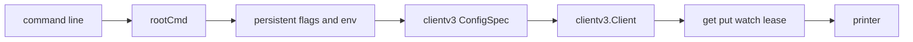

# 第20章 etcdctl

> 本章で読むソース
>
> - [`etcdctl/ctlv3/ctl.go`](https://github.com/etcd-io/etcd/blob/v3.6.12/etcdctl/ctlv3/ctl.go)
> - [`etcdctl/ctlv3/command/global.go`](https://github.com/etcd-io/etcd/blob/v3.6.12/etcdctl/ctlv3/command/global.go)
> - [`etcdctl/ctlv3/command/get_command.go`](https://github.com/etcd-io/etcd/blob/v3.6.12/etcdctl/ctlv3/command/get_command.go)
> - [`etcdctl/ctlv3/command/put_command.go`](https://github.com/etcd-io/etcd/blob/v3.6.12/etcdctl/ctlv3/command/put_command.go)

## この章の狙い

本章では `etcdctl` が Cobra command、環境変数、clientv3 config、表示器をどう結線するかを読む。
get と put を代表に、CLI 入力が clientv3 call へ変換される流れを確認する。

## 前提

前章で clientv3 が Go API を gRPC call に変換することを見た。
etcdctl は clientv3 の上に CLI flag、環境変数、出力 format を重ねる薄い層である。

## 全体の流れ



## root command に全 command を登録する

`ctlv3` の `init` は endpoint、TLS、auth、timeout、message size などの persistent flag を定義する。
その後、get、put、txn、watch、lease、member、snapshot、auth などの subcommand を root に登録する。

`rootCmd` は persistent flag と subcommand を初期化し、`Start` で実行される。

[etcdctl/ctlv3/ctl.go L41-L112](https://github.com/etcd-io/etcd/blob/v3.6.12/etcdctl/ctlv3/ctl.go#L41-L112)

```go
	rootCmd     = &cobra.Command{
		Use:        cliName,
		Short:      cliDescription,
		SuggestFor: []string{"etcdctl"},
	}
)

func init() {
	rootCmd.PersistentFlags().StringSliceVar(&globalFlags.Endpoints, "endpoints", []string{"127.0.0.1:2379"}, "gRPC endpoints")
	rootCmd.PersistentFlags().BoolVar(&globalFlags.Debug, "debug", false, "enable client-side debug logging")

	rootCmd.PersistentFlags().StringVarP(&globalFlags.OutputFormat, "write-out", "w", "simple", "set the output format (fields, json, protobuf, simple, table)")
	rootCmd.PersistentFlags().BoolVar(&globalFlags.IsHex, "hex", false, "print byte strings as hex encoded strings")
	rootCmd.RegisterFlagCompletionFunc("write-out", func(_ *cobra.Command, _ []string, _ string) ([]string, cobra.ShellCompDirective) {
		return []string{"fields", "json", "protobuf", "simple", "table"}, cobra.ShellCompDirectiveDefault
	})

	rootCmd.PersistentFlags().DurationVar(&globalFlags.DialTimeout, "dial-timeout", defaultDialTimeout, "dial timeout for client connections")
	rootCmd.PersistentFlags().DurationVar(&globalFlags.CommandTimeOut, "command-timeout", defaultCommandTimeOut, "timeout for short running command (excluding dial timeout)")
	rootCmd.PersistentFlags().DurationVar(&globalFlags.KeepAliveTime, "keepalive-time", defaultKeepAliveTime, "keepalive time for client connections")
	rootCmd.PersistentFlags().DurationVar(&globalFlags.KeepAliveTimeout, "keepalive-timeout", defaultKeepAliveTimeOut, "keepalive timeout for client connections")
	rootCmd.PersistentFlags().IntVar(&globalFlags.MaxCallSendMsgSize, "max-request-bytes", 0, "client-side request send limit in bytes (if 0, it defaults to 2.0 MiB (2 * 1024 * 1024).)")
	rootCmd.PersistentFlags().IntVar(&globalFlags.MaxCallRecvMsgSize, "max-recv-bytes", 0, "client-side response receive limit in bytes (if 0, it defaults to \"math.MaxInt32\")")

	// TODO: secure by default when etcd enables secure gRPC by default.
	rootCmd.PersistentFlags().BoolVar(&globalFlags.Insecure, "insecure-transport", true, "disable transport security for client connections")
	rootCmd.PersistentFlags().BoolVar(&globalFlags.InsecureDiscovery, "insecure-discovery", true, "accept insecure SRV records describing cluster endpoints")
	rootCmd.PersistentFlags().BoolVar(&globalFlags.InsecureSkipVerify, "insecure-skip-tls-verify", false, "skip server certificate verification (CAUTION: this option should be enabled only for testing purposes)")
	rootCmd.PersistentFlags().StringVar(&globalFlags.TLS.CertFile, "cert", "", "identify secure client using this TLS certificate file")
	rootCmd.PersistentFlags().StringVar(&globalFlags.TLS.KeyFile, "key", "", "identify secure client using this TLS key file")
	rootCmd.PersistentFlags().StringVar(&globalFlags.TLS.TrustedCAFile, "cacert", "", "verify certificates of TLS-enabled secure servers using this CA bundle")
	rootCmd.PersistentFlags().StringVar(&globalFlags.User, "user", "", "username[:password] for authentication (prompt if password is not supplied)")
	rootCmd.PersistentFlags().StringVar(&globalFlags.Password, "password", "", "password for authentication (if this option is used, --user option shouldn't include password)")
	rootCmd.PersistentFlags().StringVarP(&globalFlags.TLS.ServerName, "discovery-srv", "d", "", "domain name to query for SRV records describing cluster endpoints")
	rootCmd.PersistentFlags().StringVarP(&globalFlags.DNSClusterServiceName, "discovery-srv-name", "", "", "service name to query when using DNS discovery")

	rootCmd.AddCommand(
		command.NewGetCommand(),
		command.NewPutCommand(),
		command.NewDelCommand(),
		command.NewTxnCommand(),
		command.NewCompactionCommand(),
		command.NewAlarmCommand(),
		command.NewDefragCommand(),
		command.NewEndpointCommand(),
		command.NewMoveLeaderCommand(),
		command.NewWatchCommand(),
		command.NewVersionCommand(),
		command.NewLeaseCommand(),
		command.NewMemberCommand(),
		command.NewSnapshotCommand(),
		command.NewMakeMirrorCommand(),
		command.NewLockCommand(),
		command.NewElectCommand(),
		command.NewAuthCommand(),
		command.NewUserCommand(),
		command.NewRoleCommand(),
		command.NewCheckCommand(),
		command.NewCompletionCommand(),
		command.NewDowngradeCommand(),
	)
}

func usageFunc(c *cobra.Command) error {
	return cobrautl.UsageFunc(c, version.Version, version.APIVersion)
}

func Start() error {
	rootCmd.SetUsageFunc(usageFunc)
	// Make help just show the usage
	rootCmd.SetHelpTemplate(`{{.UsageString}}`)
	return rootCmd.Execute()
```

## flag と環境変数から client config を作る

`clientConfigFromCmd` は `ETCDCTL` prefix の環境変数を flag に反映し、endpoint、timeout、TLS、auth を `ConfigSpec` に入れる。
`mustClient` は `ConfigSpec` から `clientv3.Config` を作り、接続失敗を CLI の終了コードに変換する。

`clientConfigFromCmd` と `mustClient` は Cobra flag から clientv3 config と client を作る。

[etcdctl/ctlv3/command/global.go L93-L170](https://github.com/etcd-io/etcd/blob/v3.6.12/etcdctl/ctlv3/command/global.go#L93-L170)

```go
func clientConfigFromCmd(cmd *cobra.Command) *clientv3.ConfigSpec {
	lg, err := logutil.CreateDefaultZapLogger(zap.InfoLevel)
	if err != nil {
		cobrautl.ExitWithError(cobrautl.ExitError, err)
	}
	fs := cmd.InheritedFlags()
	if strings.HasPrefix(cmd.Use, "watch") {
		// silence "pkg/flags: unrecognized environment variable ETCDCTL_WATCH_KEY=foo" warnings
		// silence "pkg/flags: unrecognized environment variable ETCDCTL_WATCH_RANGE_END=bar" warnings
		fs.AddFlag(&pflag.Flag{Name: "watch-key", Value: &discardValue{}})
		fs.AddFlag(&pflag.Flag{Name: "watch-range-end", Value: &discardValue{}})
	}
	flags.SetPflagsFromEnv(lg, "ETCDCTL", fs)

	debug, err := cmd.Flags().GetBool("debug")
	if err != nil {
		cobrautl.ExitWithError(cobrautl.ExitError, err)
	}
	if debug {
		grpclog.SetLoggerV2(grpclog.NewLoggerV2WithVerbosity(os.Stderr, os.Stderr, os.Stderr, 4))
		fs.VisitAll(func(f *pflag.Flag) {
			fmt.Fprintf(os.Stderr, "%s=%v\n", flags.FlagToEnv("ETCDCTL", f.Name), f.Value)
		})
	} else {
		// WARNING logs contain important information like TLS misconfirugation, but spams
		// too many routine connection disconnects to turn on by default.
		//
		// See https://github.com/etcd-io/etcd/pull/9623 for background
		grpclog.SetLoggerV2(grpclog.NewLoggerV2(io.Discard, io.Discard, os.Stderr))
	}

	cfg := &clientv3.ConfigSpec{}
	cfg.Endpoints, err = endpointsFromCmd(cmd)
	if err != nil {
		cobrautl.ExitWithError(cobrautl.ExitError, err)
	}

	cfg.DialTimeout = dialTimeoutFromCmd(cmd)
	cfg.KeepAliveTime = keepAliveTimeFromCmd(cmd)
	cfg.KeepAliveTimeout = keepAliveTimeoutFromCmd(cmd)
	cfg.MaxCallSendMsgSize = maxCallSendMsgSizeFromCmd(cmd)
	cfg.MaxCallRecvMsgSize = maxCallRecvMsgSizeFromCmd(cmd)

	cfg.Secure = secureCfgFromCmd(cmd)
	cfg.Auth = authCfgFromCmd(cmd)

	initDisplayFromCmd(cmd)
	return cfg
}

func mustClientCfgFromCmd(cmd *cobra.Command) *clientv3.Config {
	cc := clientConfigFromCmd(cmd)
	lg, _ := logutil.CreateDefaultZapLogger(zap.InfoLevel)
	cfg, err := clientv3.NewClientConfig(cc, lg)
	if err != nil {
		cobrautl.ExitWithError(cobrautl.ExitBadArgs, err)
	}
	return cfg
}

func mustClientFromCmd(cmd *cobra.Command) *clientv3.Client {
	cfg := clientConfigFromCmd(cmd)
	return mustClient(cfg)
}

func mustClient(cc *clientv3.ConfigSpec) *clientv3.Client {
	lg, _ := logutil.CreateDefaultZapLogger(zap.InfoLevel)
	cfg, err := clientv3.NewClientConfig(cc, lg)
	if err != nil {
		cobrautl.ExitWithError(cobrautl.ExitBadArgs, err)
	}

	client, err := clientv3.New(*cfg)
	if err != nil {
		cobrautl.ExitWithError(cobrautl.ExitBadConnection, err)
	}

	return client
```

## 個別 command は入力変換と表示に集中する

`getCommandFunc` は引数と flag から `OpOption` を作り、client の `Get` を呼んで printer に渡す。
`putCommandFunc` も key、value、option を取り出し、client の `Put` と表示だけを行う。

`get` command は flag 定義、client call、表示を担当する。

[etcdctl/ctlv3/command/get_command.go L44-L104](https://github.com/etcd-io/etcd/blob/v3.6.12/etcdctl/ctlv3/command/get_command.go#L44-L104)

```go
// NewGetCommand returns the cobra command for "get".
func NewGetCommand() *cobra.Command {
	cmd := &cobra.Command{
		Use:   "get [options] <key> [range_end]",
		Short: "Gets the key or a range of keys",
		Run:   getCommandFunc,
	}

	cmd.Flags().StringVar(&getConsistency, "consistency", "l", "Linearizable(l) or Serializable(s)")
	cmd.Flags().StringVar(&getSortOrder, "order", "", "Order of results; ASCEND or DESCEND (ASCEND by default)")
	cmd.Flags().StringVar(&getSortTarget, "sort-by", "", "Sort target; CREATE, KEY, MODIFY, VALUE, or VERSION")
	cmd.Flags().Int64Var(&getLimit, "limit", 0, "Maximum number of results")
	cmd.Flags().BoolVar(&getPrefix, "prefix", false, "Get keys with matching prefix")
	cmd.Flags().BoolVar(&getFromKey, "from-key", false, "Get keys that are greater than or equal to the given key using byte compare")
	cmd.Flags().Int64Var(&getRev, "rev", 0, "Specify the kv revision")
	cmd.Flags().BoolVar(&getKeysOnly, "keys-only", false, "Get only the keys")
	cmd.Flags().BoolVar(&getCountOnly, "count-only", false, "Get only the count")
	cmd.Flags().BoolVar(&printValueOnly, "print-value-only", false, `Only write values when using the "simple" output format`)
	cmd.Flags().Int64Var(&getMinCreateRev, "min-create-rev", 0, "Minimum create revision")
	cmd.Flags().Int64Var(&getMaxCreateRev, "max-create-rev", 0, "Maximum create revision")
	cmd.Flags().Int64Var(&getMinModRev, "min-mod-rev", 0, "Minimum modification revision")
	cmd.Flags().Int64Var(&getMaxModRev, "max-mod-rev", 0, "Maximum modification revision")

	cmd.RegisterFlagCompletionFunc("consistency", func(_ *cobra.Command, _ []string, _ string) ([]string, cobra.ShellCompDirective) {
		return []string{"l", "s"}, cobra.ShellCompDirectiveDefault
	})
	cmd.RegisterFlagCompletionFunc("order", func(_ *cobra.Command, _ []string, _ string) ([]string, cobra.ShellCompDirective) {
		return []string{"ASCEND", "DESCEND"}, cobra.ShellCompDirectiveDefault
	})
	cmd.RegisterFlagCompletionFunc("sort-by", func(_ *cobra.Command, _ []string, _ string) ([]string, cobra.ShellCompDirective) {
		return []string{"CREATE", "KEY", "MODIFY", "VALUE", "VERSION"}, cobra.ShellCompDirectiveDefault
	})

	return cmd
}

// getCommandFunc executes the "get" command.
func getCommandFunc(cmd *cobra.Command, args []string) {
	key, opts := getGetOp(args)
	ctx, cancel := commandCtx(cmd)
	resp, err := mustClientFromCmd(cmd).Get(ctx, key, opts...)
	cancel()
	if err != nil {
		cobrautl.ExitWithError(cobrautl.ExitError, err)
	}

	if getCountOnly {
		if _, fields := display.(*fieldsPrinter); !fields {
			cobrautl.ExitWithError(cobrautl.ExitBadArgs, fmt.Errorf("--count-only is only for `--write-out=fields`"))
		}
	}

	if printValueOnly {
		dp, simple := (display).(*simplePrinter)
		if !simple {
			cobrautl.ExitWithError(cobrautl.ExitBadArgs, fmt.Errorf("print-value-only is only for `--write-out=simple`"))
		}
		dp.valueOnly = true
	}
	display.Get(*resp)
}
```

`put` command は key と value を取り出して clientv3 の `Put` を呼ぶ。

[etcdctl/ctlv3/command/put_command.go L35-L79](https://github.com/etcd-io/etcd/blob/v3.6.12/etcdctl/ctlv3/command/put_command.go#L35-L79)

```go
// NewPutCommand returns the cobra command for "put".
func NewPutCommand() *cobra.Command {
	cmd := &cobra.Command{
		Use:   "put [options] <key> <value> (<value> can also be given from stdin)",
		Short: "Puts the given key into the store",
		Long: `
Puts the given key into the store.

When <value> begins with '-', <value> is interpreted as a flag.
Insert '--' for workaround:

$ put <key> -- <value>
$ put -- <key> <value>

If <value> isn't given as a command line argument and '--ignore-value' is not specified,
this command tries to read the value from standard input.

If <lease> isn't given as a command line argument and '--ignore-lease' is not specified,
this command tries to read the value from standard input.

For example,
$ cat file | put <key>
will store the content of the file to <key>.
`,
		Run: putCommandFunc,
	}
	cmd.Flags().StringVar(&leaseStr, "lease", "0", "lease ID (in hexadecimal) to attach to the key")
	cmd.Flags().BoolVar(&putPrevKV, "prev-kv", false, "return the previous key-value pair before modification")
	cmd.Flags().BoolVar(&putIgnoreVal, "ignore-value", false, "updates the key using its current value")
	cmd.Flags().BoolVar(&putIgnoreLease, "ignore-lease", false, "updates the key using its current lease")
	return cmd
}

// putCommandFunc executes the "put" command.
func putCommandFunc(cmd *cobra.Command, args []string) {
	key, value, opts := getPutOp(args)

	ctx, cancel := commandCtx(cmd)
	resp, err := mustClientFromCmd(cmd).Put(ctx, key, value, opts...)
	cancel()
	if err != nil {
		cobrautl.ExitWithError(cobrautl.ExitError, err)
	}
	display.Put(*resp)
}
```

## 最適化の工夫

`clientConfigFromCmd` は watch command 用の環境変数警告を dummy flag で吸収し、通常の flag parser と同じ経路で環境変数を処理できる。
debug でない場合は gRPC logger の info 出力を discard し、CLI の通常実行で不要な接続ログを抑える。

## まとめ

- etcdctl は Cobra と clientv3 の橋渡しをし、API の意味は clientv3 と server に委譲する。
- global flag と `ConfigSpec` の変換が、全 command に共通する接続設定の中心になる。

## 関連する章

- [clientv3](19-clientv3.md)
- [KV Range](../part05-api-auth/17-kv-range.md)
- [リース](../part04-txn-lease-watch/14-lease.md)
- [gRPC proxy](21-grpcproxy.md)
