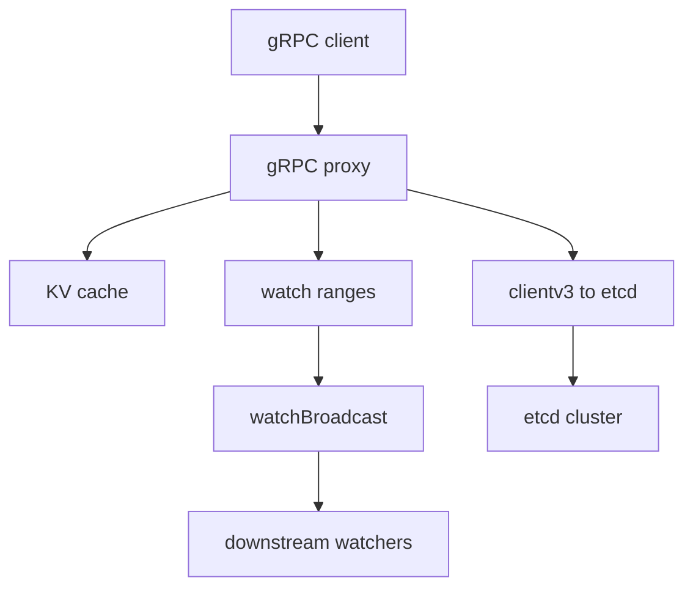

# 第21章 gRPC proxy

> 本章で読むソース
>
> - [`server/proxy/grpcproxy/kv.go`](https://github.com/etcd-io/etcd/blob/v3.6.12/server/proxy/grpcproxy/kv.go)
> - [`server/proxy/grpcproxy/watch.go`](https://github.com/etcd-io/etcd/blob/v3.6.12/server/proxy/grpcproxy/watch.go)
> - [`server/proxy/grpcproxy/watch_broadcast.go`](https://github.com/etcd-io/etcd/blob/v3.6.12/server/proxy/grpcproxy/watch_broadcast.go)
> - [`server/proxy/grpcproxy/register.go`](https://github.com/etcd-io/etcd/blob/v3.6.12/server/proxy/grpcproxy/register.go)

## この章の狙い

本章では gRPC proxy が clientv3 と server interface の間に立ち、read cache と watch broadcast を提供する仕組みを読む。
serializable Range の cache、mutation 時の invalidation、watch の集約を確認する。

## 前提

gRPC proxy は etcd server そのものではなく、clientv3 を使って背後の cluster へ request を流す。
proxy は読み取りと watch の fan out を軽くするが、書き込みの合意は背後の etcd cluster に任せる。

## 全体の流れ



## KV proxy は serializable read を cache する

`kvProxy.Range` は request が serializable のとき cache を先に見て、hit すれば upstream call を省く。
linearizable read の response も serializable として cache に入れ、次の serializable read で再利用できる。

`kvProxy.Range` は serializable request の cache lookup と upstream call を分ける。

[server/proxy/grpcproxy/kv.go L26-L68](https://github.com/etcd-io/etcd/blob/v3.6.12/server/proxy/grpcproxy/kv.go#L26-L68)

```go
type kvProxy struct {
	kv    clientv3.KV
	cache cache.Cache
}

func NewKvProxy(c *clientv3.Client) (pb.KVServer, <-chan struct{}) {
	kv := &kvProxy{
		kv:    c.KV,
		cache: cache.NewCache(cache.DefaultMaxEntries),
	}
	donec := make(chan struct{})
	close(donec)
	return kv, donec
}

func (p *kvProxy) Range(ctx context.Context, r *pb.RangeRequest) (*pb.RangeResponse, error) {
	if r.Serializable {
		resp, err := p.cache.Get(r)
		switch {
		case err == nil:
			cacheHits.Inc()
			return resp, nil
		case errors.Is(err, cache.ErrCompacted):
			cacheHits.Inc()
			return nil, err
		}

		cachedMisses.Inc()
	}

	resp, err := p.kv.Do(ctx, RangeRequestToOp(r))
	if err != nil {
		return nil, err
	}

	// cache linearizable as serializable
	req := *r
	req.Serializable = true
	gresp := (*pb.RangeResponse)(resp.Get())
	p.cache.Add(&req, gresp)
	cacheKeys.Set(float64(p.cache.Size()))

	return gresp, nil
```

`Txn` は compare 範囲を invalidate し、response に含まれる Range を cache に反映する。

[server/proxy/grpcproxy/kv.go L103-L135](https://github.com/etcd-io/etcd/blob/v3.6.12/server/proxy/grpcproxy/kv.go#L103-L135)

```go
func (p *kvProxy) Txn(ctx context.Context, r *pb.TxnRequest) (*pb.TxnResponse, error) {
	op := TxnRequestToOp(r)
	opResp, err := p.kv.Do(ctx, op)
	if err != nil {
		return nil, err
	}
	resp := opResp.Txn()

	// txn may claim an outdated key is updated; be safe and invalidate
	for _, cmp := range r.Compare {
		p.cache.Invalidate(cmp.Key, cmp.RangeEnd)
	}
	// update any fetched keys
	if resp.Succeeded {
		p.txnToCache(r.Success, resp.Responses)
	} else {
		p.txnToCache(r.Failure, resp.Responses)
	}

	cacheKeys.Set(float64(p.cache.Size()))

	return (*pb.TxnResponse)(resp), nil
}

func (p *kvProxy) Compact(ctx context.Context, r *pb.CompactionRequest) (*pb.CompactionResponse, error) {
	var opts []clientv3.CompactOption
	if r.Physical {
		opts = append(opts, clientv3.WithCompactPhysical())
	}

	resp, err := p.kv.Compact(ctx, r.Revision, opts...)
	if err == nil {
		p.cache.Compact(r.Revision)
```

## watch は upstream をまとめる

`watchProxy` は leader 監視、watch range 管理、downstream stream の wait group を持つ。
`watchBroadcast` は一つの upstream watch response を複数 receiver に配り、同じ範囲の watch を集約する。

`NewWatchProxy` は leader、range 管理、shutdown の寿命を構成する。

[server/proxy/grpcproxy/watch.go L32-L78](https://github.com/etcd-io/etcd/blob/v3.6.12/server/proxy/grpcproxy/watch.go#L32-L78)

```go
type watchProxy struct {
	cw  clientv3.Watcher
	ctx context.Context

	leader *leader

	ranges *watchRanges

	// mu protects adding outstanding watch servers through wg.
	mu sync.Mutex

	// wg waits until all outstanding watch servers quit.
	wg sync.WaitGroup

	// kv is used for permission checking
	kv clientv3.KV
	lg *zap.Logger
}

func NewWatchProxy(ctx context.Context, lg *zap.Logger, c *clientv3.Client) (pb.WatchServer, <-chan struct{}) {
	cctx, cancel := context.WithCancel(ctx)
	wp := &watchProxy{
		cw:     c.Watcher,
		ctx:    cctx,
		leader: newLeader(cctx, c.Watcher),

		kv: c.KV, // for permission checking
		lg: lg,
	}
	wp.ranges = newWatchRanges(wp)
	ch := make(chan struct{})
	go func() {
		defer close(ch)
		<-wp.leader.stopNotify()
		wp.mu.Lock()
		select {
		case <-wp.ctx.Done():
		case <-wp.leader.disconnectNotify():
			cancel()
		}
		<-wp.ctx.Done()
		wp.mu.Unlock()
		wp.wg.Wait()
		wp.ranges.stop()
	}()
	return wp, ch
}
```

`watchBroadcast` は upstream watch を receiver set に broadcast する。

[server/proxy/grpcproxy/watch_broadcast.go L29-L93](https://github.com/etcd-io/etcd/blob/v3.6.12/server/proxy/grpcproxy/watch_broadcast.go#L29-L93)

```go
type watchBroadcast struct {
	// cancel stops the underlying etcd server watcher and closes ch.
	cancel context.CancelFunc
	donec  chan struct{}

	// mu protects rev and receivers.
	mu sync.RWMutex
	// nextrev is the minimum expected next revision of the watcher on ch.
	nextrev int64
	// receivers contains all the client-side watchers to serve.
	receivers map[*watcher]struct{}
	// responses counts the number of responses
	responses int
	lg        *zap.Logger
}

func newWatchBroadcast(lg *zap.Logger, wp *watchProxy, w *watcher, update func(*watchBroadcast)) *watchBroadcast {
	cctx, cancel := context.WithCancel(wp.ctx)
	wb := &watchBroadcast{
		cancel:    cancel,
		nextrev:   w.nextrev,
		receivers: make(map[*watcher]struct{}),
		donec:     make(chan struct{}),
		lg:        lg,
	}
	wb.add(w)
	go func() {
		defer close(wb.donec)

		opts := []clientv3.OpOption{
			clientv3.WithRange(w.wr.end),
			clientv3.WithProgressNotify(),
			clientv3.WithRev(wb.nextrev),
			clientv3.WithPrevKV(),
			clientv3.WithCreatedNotify(),
		}

		cctx = withClientAuthToken(cctx, w.wps.stream.Context())

		wch := wp.cw.Watch(cctx, w.wr.key, opts...)
		wp.lg.Debug("watch", zap.String("key", w.wr.key))

		for wr := range wch {
			wb.bcast(wr)
			update(wb)
		}
	}()
	return wb
}

func (wb *watchBroadcast) bcast(wr clientv3.WatchResponse) {
	wb.mu.Lock()
	defer wb.mu.Unlock()
	// watchers start on the given revision, if any; ignore header rev on create
	if wb.responses > 0 || wb.nextrev == 0 {
		wb.nextrev = wr.Header.Revision + 1
	}
	wb.responses++
	for r := range wb.receivers {
		r.send(wr)
	}
	if len(wb.receivers) > 0 {
		eventsCoalescing.Add(float64(len(wb.receivers) - 1))
	}
}
```

## proxy 自身の発見情報を lease で登録する

`Register` は lease 付き session を作り、endpoint manager に proxy address を登録する。
session が切れた場合は rate limiter の待ちを挟んで再登録し、network partition 後に復帰できるようにする。

`Register` は session と lease を使って proxy endpoint を登録し直す。

[server/proxy/grpcproxy/register.go L35-L87](https://github.com/etcd-io/etcd/blob/v3.6.12/server/proxy/grpcproxy/register.go#L35-L87)

```go
func Register(lg *zap.Logger, c *clientv3.Client, prefix string, addr string, ttl int) <-chan struct{} {
	rm := rate.NewLimiter(rate.Limit(registerRetryRate), registerRetryRate)

	donec := make(chan struct{})
	go func() {
		defer close(donec)

		for rm.Wait(c.Ctx()) == nil {
			ss, err := registerSession(lg, c, prefix, addr, ttl)
			if err != nil {
				lg.Warn("failed to create a session", zap.Error(err))
				continue
			}
			select {
			case <-c.Ctx().Done():
				ss.Close()
				return

			case <-ss.Done():
				lg.Warn("session expired; possible network partition or server restart")
				lg.Warn("creating a new session to rejoin")
				continue
			}
		}
	}()

	return donec
}

func registerSession(lg *zap.Logger, c *clientv3.Client, prefix string, addr string, ttl int) (*concurrency.Session, error) {
	ss, err := concurrency.NewSession(c, concurrency.WithTTL(ttl))
	if err != nil {
		return nil, err
	}

	em, err := endpoints.NewManager(c, prefix)
	if err != nil {
		ss.Close()
		return nil, err
	}
	endpoint := endpoints.Endpoint{Addr: addr, Metadata: getMeta()}
	if err = em.AddEndpoint(c.Ctx(), prefix+"/"+addr, endpoint, clientv3.WithLease(ss.Lease())); err != nil {
		ss.Close()
		return nil, err
	}

	lg.Info(
		"registered session with lease",
		zap.String("addr", addr),
		zap.Int("lease-ttl", ttl),
	)
	return ss, nil
}
```

Range cache は mutation 後に交差する entry を LRU から削除する。

[`server/proxy/grpcproxy/cache/store.go` L132-L155](https://github.com/etcd-io/etcd/blob/v3.6.12/server/proxy/grpcproxy/cache/store.go#L132-L155)

```go
// Invalidate invalidates the cache entries that intersecting with the given range from key to endkey.
func (c *cache) Invalidate(key, endkey []byte) {
	c.mu.Lock()
	defer c.mu.Unlock()

	var (
		ivs []*adt.IntervalValue
		ivl adt.Interval
	)
	if len(endkey) == 0 {
		ivl = adt.NewStringAffinePoint(string(key))
	} else {
		ivl = adt.NewStringAffineInterval(string(key), string(endkey))
	}

	ivs = c.cachedRanges.Stab(ivl)
	for _, iv := range ivs {
		keys := iv.Val.(map[string]struct{})
		for key := range keys {
			c.lru.Remove(key)
		}
	}
	// delete after removing all keys since it is destructive to 'ivs'
	c.cachedRanges.Delete(ivl)
```

proxy は `__lostleader` key の watch で upstream leader 喪失を検知する。

[`server/proxy/grpcproxy/leader.go` L42-L67](https://github.com/etcd-io/etcd/blob/v3.6.12/server/proxy/grpcproxy/leader.go#L42-L67)

```go
func newLeader(ctx context.Context, w clientv3.Watcher) *leader {
	l := &leader{
		ctx:      clientv3.WithRequireLeader(ctx),
		w:        w,
		leaderc:  make(chan struct{}),
		disconnc: make(chan struct{}),
		donec:    make(chan struct{}),
	}
	// begin assuming leader is lost
	close(l.leaderc)
	go l.recvLoop()
	return l
}

func (l *leader) recvLoop() {
	defer close(l.donec)

	limiter := rate.NewLimiter(rate.Limit(retryPerSecond), retryPerSecond)
	rev := int64(math.MaxInt64 - 2)
	for limiter.Wait(l.ctx) == nil {
		wch := l.w.Watch(l.ctx, lostLeaderKey, clientv3.WithRev(rev), clientv3.WithCreatedNotify())
		cresp, ok := <-wch
		if !ok {
			l.loseLeader()
			continue
		}
		if cresp.Err() != nil {
			l.loseLeader()
```

## 最適化の工夫

serializable Range cache は背後 cluster への read request を減らし、mutation のたびに対象範囲を invalidate して古い値の露出を抑える。
watch broadcast は同じ範囲の downstream watch を一つの upstream watch にまとめ、server 側の watcher 数と network stream 数を減らす。

## まとめ

- gRPC proxy は clientv3 を使う中継層であり、cache と broadcast によって read と watch の負荷を下げる。
- write と compaction は upstream に委譲し、cache invalidation と compact だけを proxy 側で反映する。

## 関連する章

- [watch](../part04-txn-lease-watch/15-watch.md)
- [KV Range](../part05-api-auth/17-kv-range.md)
- [clientv3](19-clientv3.md)
- [etcdctl](20-etcdctl.md)
