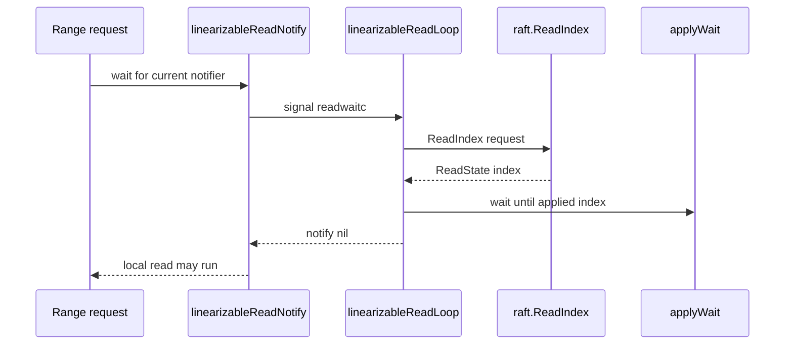

# 第22章 リニアライザブル read

> 本章で読むソース
>
> - [`server/etcdserver/v3_server.go`](https://github.com/etcd-io/etcd/blob/v3.6.12/server/etcdserver/v3_server.go)

## この章の狙い

本章では **リニアライザブル read** が ReadIndex と apply wait を使って、leader の合意済み位置まで local state を追いつかせる仕組みを読む。
Range だけでなく membership read も同じ通知経路を使うことを確認する。

## 前提

serializable read は local state を読むが、リニアライザブル read は Raft の現在 index を確認する。
ReadIndex は log entry を追加せずに leader の commit 位置を確認する Raft の機構である。

## 全体の流れ



## Range は ReadIndex を要求する

`EtcdServer.Range` は serializable でない request に対して `linearizableReadNotify` を呼ぶ。
この時点ではまだ backend を読まず、Raft 側の現在 index と local apply の進行を先にそろえる。

`Range` は serializable でない request だけ `linearizableReadNotify` を実行する。

[server/etcdserver/v3_server.go L103-L130](https://github.com/etcd-io/etcd/blob/v3.6.12/server/etcdserver/v3_server.go#L103-L130)

```go
func (s *EtcdServer) Range(ctx context.Context, r *pb.RangeRequest) (*pb.RangeResponse, error) {
	trace := traceutil.New("range",
		s.Logger(),
		traceutil.Field{Key: "range_begin", Value: string(r.Key)},
		traceutil.Field{Key: "range_end", Value: string(r.RangeEnd)},
	)
	ctx = context.WithValue(ctx, traceutil.TraceKey{}, trace)

	var resp *pb.RangeResponse
	var err error
	defer func(start time.Time) {
		txn.WarnOfExpensiveReadOnlyRangeRequest(s.Logger(), s.Cfg.WarningApplyDuration, start, r, resp, err)
		if resp != nil {
			trace.AddField(
				traceutil.Field{Key: "response_count", Value: len(resp.Kvs)},
				traceutil.Field{Key: "response_revision", Value: resp.Header.Revision},
			)
		}
		trace.LogIfLong(traceThreshold)
	}(time.Now())

	if !r.Serializable {
		err = s.linearizableReadNotify(ctx)
		trace.Step("agreement among raft nodes before linearized reading")
		if err != nil {
			return nil, err
		}
	}
```

## read loop は複数 read をまとめて解放する

`linearizableReadLoop` は `readwaitc` を受けると notifier を差し替え、現在の ReadIndex を取得する。
applied index が confirmed index より小さい場合は `applyWait` で待ち、追いついたら古い notifier をまとめて notify する。

`linearizableReadLoop` は ReadIndex と applied index を確認し、notifier を解放する。

[server/etcdserver/v3_server.go L902-L948](https://github.com/etcd-io/etcd/blob/v3.6.12/server/etcdserver/v3_server.go#L902-L948)

```go
func (s *EtcdServer) linearizableReadLoop() {
	for {
		leaderChangedNotifier := s.leaderChanged.Receive()
		select {
		case <-leaderChangedNotifier:
			continue
		case <-s.readwaitc:
		case <-s.stopping:
			return
		}

		// as a single loop is can unlock multiple reads, it is not very useful
		// to propagate the trace from Txn or Range.
		trace := traceutil.New("linearizableReadLoop", s.Logger())

		nextnr := newNotifier()
		s.readMu.Lock()
		nr := s.readNotifier
		s.readNotifier = nextnr
		s.readMu.Unlock()

		confirmedIndex, err := s.requestCurrentIndex(leaderChangedNotifier)
		if isStopped(err) {
			return
		}
		if err != nil {
			nr.notify(err)
			continue
		}

		trace.Step("read index received")

		trace.AddField(traceutil.Field{Key: "readStateIndex", Value: confirmedIndex})

		appliedIndex := s.getAppliedIndex()
		trace.AddField(traceutil.Field{Key: "appliedIndex", Value: strconv.FormatUint(appliedIndex, 10)})

		if appliedIndex < confirmedIndex {
			select {
			case <-s.applyWait.Wait(confirmedIndex):
			case <-s.stopping:
				return
			}
		}
		// unblock all l-reads requested at indices before confirmedIndex
		nr.notify(nil)
		trace.Step("applied index is now lower than readState.Index")
```

`requestCurrentIndex` は request ID を付けて ReadIndex を送り、古い response と timeout を処理する。

[server/etcdserver/v3_server.go L958-L1055](https://github.com/etcd-io/etcd/blob/v3.6.12/server/etcdserver/v3_server.go#L958-L1055)

```go
func (s *EtcdServer) requestCurrentIndex(leaderChangedNotifier <-chan struct{}) (uint64, error) {
	requestIDs := map[uint64]struct{}{}
	requestID := s.reqIDGen.Next()
	requestIDs[requestID] = struct{}{}
	err := s.sendReadIndex(requestID)
	if err != nil {
		return 0, err
	}

	lg := s.Logger()
	errorTimer := time.NewTimer(s.Cfg.ReqTimeout())
	defer errorTimer.Stop()
	retryTimer := time.NewTimer(readIndexRetryTime)
	defer retryTimer.Stop()

	firstCommitInTermNotifier := s.firstCommitInTerm.Receive()

	for {
		select {
		case rs := <-s.r.readStateC:
			// Check again if leader changed as when multiple channels are ready, select picks randomly.
			select {
			case <-leaderChangedNotifier:
				readIndexFailed.Inc()
				return 0, errors.ErrLeaderChanged
			default:
			}
			responseID := uint64(0)
			if len(rs.RequestCtx) == 8 {
				responseID = binary.BigEndian.Uint64(rs.RequestCtx)
			}
			if _, ok := requestIDs[responseID]; !ok {
				// a previous request might time out. now we should ignore the response of it and
				// continue waiting for the response of the current requests.
				lg.Warn(
					"ignored out-of-date read index response; local node read indexes queueing up and waiting to be in sync with leader",
					zap.Uint64("received-request-id", responseID),
				)
				slowReadIndex.Inc()
				continue
			}
			return rs.Index, nil
		case <-leaderChangedNotifier:
			readIndexFailed.Inc()
			// return a retryable error.
			return 0, errors.ErrLeaderChanged
		case <-firstCommitInTermNotifier:
			firstCommitInTermNotifier = s.firstCommitInTerm.Receive()
			lg.Info("first commit in current term: resending ReadIndex request")
			requestID = s.reqIDGen.Next()
			requestIDs[requestID] = struct{}{}
			err := s.sendReadIndex(requestID)
			if err != nil {
				return 0, err
			}
			retryTimer.Reset(readIndexRetryTime)
			continue
		case <-retryTimer.C:
			lg.Warn(
				"waiting for ReadIndex response took too long, retrying",
				zap.Uint64("sent-request-id", requestID),
				zap.Duration("retry-timeout", readIndexRetryTime),
			)
			requestID = s.reqIDGen.Next()
			requestIDs[requestID] = struct{}{}
			err := s.sendReadIndex(requestID)
			if err != nil {
				return 0, err
			}
			retryTimer.Reset(readIndexRetryTime)
			continue
		case <-errorTimer.C:
			lg.Warn(
				"timed out waiting for read index response (local node might have slow network)",
				zap.Duration("timeout", s.Cfg.ReqTimeout()),
			)
			slowReadIndex.Inc()
			return 0, errors.ErrTimeout
		case <-s.stopping:
			return 0, errors.ErrStopped
		}
	}
}

func uint64ToBigEndianBytes(number uint64) []byte {
	byteResult := make([]byte, 8)
	binary.BigEndian.PutUint64(byteResult, number)
	return byteResult
}

func (s *EtcdServer) sendReadIndex(requestIndex uint64) error {
	ctxToSend := uint64ToBigEndianBytes(requestIndex)

	cctx, cancel := context.WithTimeout(context.Background(), s.Cfg.ReqTimeout())
	err := s.r.ReadIndex(cctx, ctxToSend)
	cancel()
	if errorspkg.Is(err, raft.ErrStopped) {
		return err
```

## 通知の入口は non blocking

`linearizableReadNotify` は `readwaitc` への送信を non blocking にし、すでに loop が起動済みなら追加 signal を積まない。
このため、短時間に複数の read が来ても一つの ReadIndex で同じ notifier を待つ request を解放できる。

`linearizableReadNotify` は current notifier を取得し、`readwaitc` に signal して完了を待つ。

[server/etcdserver/v3_server.go L1066-L1090](https://github.com/etcd-io/etcd/blob/v3.6.12/server/etcdserver/v3_server.go#L1066-L1090)

```go
func (s *EtcdServer) LinearizableReadNotify(ctx context.Context) error {
	return s.linearizableReadNotify(ctx)
}

func (s *EtcdServer) linearizableReadNotify(ctx context.Context) error {
	s.readMu.RLock()
	nc := s.readNotifier
	s.readMu.RUnlock()

	// signal linearizable loop for current notify if it hasn't been already
	select {
	case s.readwaitc <- struct{}{}:
	default:
	}

	// wait for read state notification
	select {
	case <-nc.c:
		return nc.err
	case <-ctx.Done():
		return ctx.Err()
	case <-s.done:
		return errors.ErrStopped
	}
}
```

`requestCurrentIndex` は ReadIndex を送り、`readStateC` から confirmed index を受け取る。

[`server/etcdserver/v3_server.go` L958-L984](https://github.com/etcd-io/etcd/blob/v3.6.12/server/etcdserver/v3_server.go#L958-L984)

```go
func (s *EtcdServer) requestCurrentIndex(leaderChangedNotifier <-chan struct{}) (uint64, error) {
	requestIDs := map[uint64]struct{}{}
	requestID := s.reqIDGen.Next()
	requestIDs[requestID] = struct{}{}
	err := s.sendReadIndex(requestID)
	if err != nil {
		return 0, err
	}

	lg := s.Logger()
	errorTimer := time.NewTimer(s.Cfg.ReqTimeout())
	defer errorTimer.Stop()
	retryTimer := time.NewTimer(readIndexRetryTime)
	defer retryTimer.Stop()

	firstCommitInTermNotifier := s.firstCommitInTerm.Receive()

	for {
		select {
		case rs := <-s.r.readStateC:
			// Check again if leader changed as when multiple channels are ready, select picks randomly.
			select {
			case <-leaderChangedNotifier:
				readIndexFailed.Inc()
				return 0, errors.ErrLeaderChanged
			default:
			}
			responseID := uint64(0)
```

`Authenticate` も KV Range と同様に `linearizableReadNotify` を先に呼ぶ。

[`server/etcdserver/v3_server.go` L611-L614](https://github.com/etcd-io/etcd/blob/v3.6.12/server/etcdserver/v3_server.go#L611-L614)

```go
func (s *EtcdServer) Authenticate(ctx context.Context, r *pb.AuthenticateRequest) (*pb.AuthenticateResponse, error) {
	if err := s.linearizableReadNotify(ctx); err != nil {
		return nil, err
	}
```

## 最適化の工夫

`readwaitc` は buffer size 1 で、送信側は default branch を持つため、read request の急増時に ReadIndex request を request 数だけ発行せず、同じ notifier にまとめられる。
ReadIndex を使うため、read のたびに Raft log entry を追加せずに leader の確認を取れる。

## まとめ

- リニアライザブル read は ReadIndex の確認と applied index の待機を組み合わせる。
- notifier 差し替えと buffered signal により、複数 read を一つの確認で解放できる。

## 関連する章

- [etcdserver の Raft ループ](../part03-raft/10-etcdserver-raft.md)
- [apply pipeline](../part03-raft/11-apply-pipeline.md)
- [KV Range](../part05-api-auth/17-kv-range.md)
- [corruption check](23-corruption-check.md)
