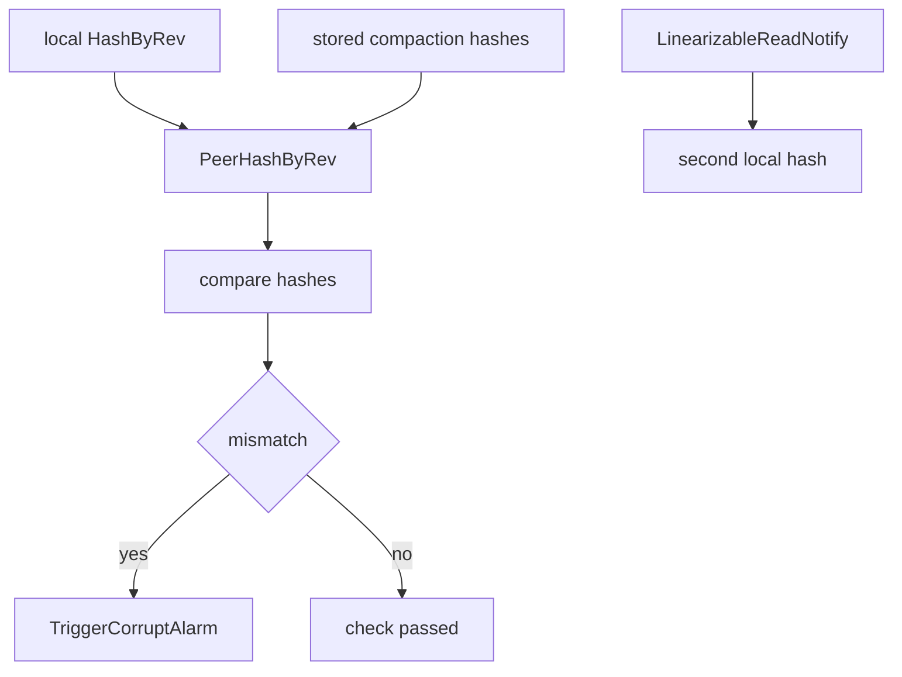

# 第23章 corruption check

> 本章で読むソース
>
> - [`server/etcdserver/corrupt.go`](https://github.com/etcd-io/etcd/blob/v3.6.12/server/etcdserver/corrupt.go)
> - [`server/storage/mvcc/hash.go`](https://github.com/etcd-io/etcd/blob/v3.6.12/server/storage/mvcc/hash.go)

## この章の狙い

本章では corruption check が local hash と peer hash を比較し、破損 alarm を上げる仕組みを読む。
初期検査、周期検査、compaction hash 検査の違いを整理する。

## 前提

MVCC hash は backend の key bucket と revision 範囲に依存する。
peer 間で hash を比べるには、比較する revision と compact revision をそろえる必要がある。

## 全体の流れ



## checker の依存 interface

`corruptionChecker` は `HashStorage`、peer hash 取得、リニアライザブル read、alarm 起動を `Hasher` interface として受ける。
この分離により、checker は `EtcdServer` の全機能を直接知るのではなく、検査に必要な機能だけを使う。

`CorruptionChecker` と `Hasher` は hash、peer hash、ReadIndex、alarm の依存を表す。

[server/etcdserver/corrupt.go L39-L101](https://github.com/etcd-io/etcd/blob/v3.6.12/server/etcdserver/corrupt.go#L39-L101)

```go
type CorruptionChecker interface {
	InitialCheck() error
	PeriodicCheck() error
	CompactHashCheck()
}

type corruptionChecker struct {
	lg *zap.Logger

	hasher Hasher

	mux                   sync.RWMutex
	latestRevisionChecked int64
}

type Hasher interface {
	mvcc.HashStorage
	ReqTimeout() time.Duration
	MemberID() types.ID
	PeerHashByRev(int64) []*peerHashKVResp
	LinearizableReadNotify(context.Context) error
	TriggerCorruptAlarm(types.ID)
}

func newCorruptionChecker(lg *zap.Logger, s *EtcdServer, storage mvcc.HashStorage) *corruptionChecker {
	return &corruptionChecker{
		lg:     lg,
		hasher: hasherAdapter{s, storage},
	}
}

type hasherAdapter struct {
	*EtcdServer
	mvcc.HashStorage
}

func (h hasherAdapter) ReqTimeout() time.Duration {
	return h.EtcdServer.Cfg.ReqTimeout()
}

func (h hasherAdapter) PeerHashByRev(rev int64) []*peerHashKVResp {
	return h.EtcdServer.getPeerHashKVs(rev)
}

func (h hasherAdapter) TriggerCorruptAlarm(memberID types.ID) {
	h.EtcdServer.triggerCorruptAlarm(memberID)
}

// InitialCheck compares initial hash values with its peers
// before serving any peer/client traffic. Only mismatch when hashes
// are different at requested revision, with same compact revision.
func (cm *corruptionChecker) InitialCheck() error {
	cm.lg.Info(
		"starting initial corruption check",
		zap.String("local-member-id", cm.hasher.MemberID().String()),
		zap.Duration("timeout", cm.hasher.ReqTimeout()),
	)

	h, _, err := cm.hasher.HashByRev(0)
	if err != nil {
		return fmt.Errorf("%s failed to fetch hash (%w)", cm.hasher.MemberID(), err)
	}
	peers := cm.hasher.PeerHashByRev(h.Revision)
```

## 周期検査は ReadIndex を挟む

`PeriodicCheck` は最初に local hash と peer hash を取り、次にリニアライザブル read を待ってから local hash をもう一度取る。
同じ revision と compact revision で hash が変わる場合は local 側の状態変化として alarm の候補になる。

`PeriodicCheck` は peer hash と ReadIndex を挟んで二度の local hash を比較する。

[server/etcdserver/corrupt.go L179-L210](https://github.com/etcd-io/etcd/blob/v3.6.12/server/etcdserver/corrupt.go#L179-L210)

```go
func (cm *corruptionChecker) PeriodicCheck() error {
	h, _, err := cm.hasher.HashByRev(0)
	if err != nil {
		return err
	}
	peers := cm.hasher.PeerHashByRev(h.Revision)

	ctx, cancel := context.WithTimeout(context.Background(), cm.hasher.ReqTimeout())
	err = cm.hasher.LinearizableReadNotify(ctx)
	cancel()
	if err != nil {
		return err
	}

	h2, rev2, err := cm.hasher.HashByRev(0)
	if err != nil {
		return err
	}

	alarmed := false
	mismatch := func(id types.ID) {
		if alarmed {
			return
		}
		alarmed = true
		cm.hasher.TriggerCorruptAlarm(id)
	}

	if h2.Hash != h.Hash && h2.Revision == h.Revision && h.CompactRevision == h2.CompactRevision {
		cm.lg.Warn(
			"found hash mismatch",
			zap.Int64("revision-1", h.Revision),
```

## compaction hash を再利用する

`CompactHashCheck` は compaction 時に保存された hash を新しい順に取り、peer の hash と比較する。
`HashStorage.Store` は hash list を revision 昇順に保ち、最大件数を超えた古い hash を落とす。

`CompactHashCheck` は保存済み compaction hash を peer hash と比較する。

[server/etcdserver/corrupt.go L277-L325](https://github.com/etcd-io/etcd/blob/v3.6.12/server/etcdserver/corrupt.go#L277-L325)

```go
func (cm *corruptionChecker) CompactHashCheck() {
	cm.lg.Info("starting compact hash check",
		zap.String("local-member-id", cm.hasher.MemberID().String()),
		zap.Duration("timeout", cm.hasher.ReqTimeout()),
	)
	hashes := cm.uncheckedRevisions()
	// Assume that revisions are ordered from largest to smallest
	for i, hash := range hashes {
		peers := cm.hasher.PeerHashByRev(hash.Revision)
		if len(peers) == 0 {
			continue
		}
		if cm.checkPeerHashes(hash, peers) {
			cm.lg.Info("finished compaction hash check", zap.Int("number-of-hashes-checked", i+1))
			return
		}
	}
	cm.lg.Info("finished compaction hash check", zap.Int("number-of-hashes-checked", len(hashes)))
}

// check peers hash and raise alarms if detected corruption.
// return a bool indicate whether to check next hash.
//
//	true: successfully checked hash on whole cluster or raised alarms, so no need to check next hash
//	false: skipped some members, so need to check next hash
func (cm *corruptionChecker) checkPeerHashes(leaderHash mvcc.KeyValueHash, peers []*peerHashKVResp) bool {
	leaderID := cm.hasher.MemberID()
	hash2members := map[uint32]types.IDSlice{leaderHash.Hash: {leaderID}}

	peersChecked := 0
	// group all peers by hash
	for _, peer := range peers {
		skipped := false
		reason := ""

		if peer.resp == nil {
			skipped = true
			reason = "no response"
		} else if peer.resp.CompactRevision != leaderHash.CompactRevision {
			skipped = true
			reason = fmt.Sprintf("the peer's CompactRevision %d doesn't match leader's CompactRevision %d",
				peer.resp.CompactRevision, leaderHash.CompactRevision)
		}
		if skipped {
			cm.lg.Warn("Skipped peer's hash", zap.Int("number-of-peers", len(peers)),
				zap.String("leader-id", leaderID.String()),
				zap.String("peer-id", peer.id.String()),
				zap.String("reason", reason))
			continue
```

`HashStorage` は指定 revision の保存済み hash を返し、保存数を上限内に保つ。

[server/storage/mvcc/hash.go L139-L170](https://github.com/etcd-io/etcd/blob/v3.6.12/server/storage/mvcc/hash.go#L139-L170)

```go
func (s *hashStorage) HashByRev(rev int64) (KeyValueHash, int64, error) {
	s.hashMu.RLock()
	for _, h := range s.hashes {
		if rev == h.Revision {
			s.hashMu.RUnlock()

			s.store.revMu.RLock()
			currentRev := s.store.currentRev
			s.store.revMu.RUnlock()
			return h, currentRev, nil
		}
	}
	s.hashMu.RUnlock()

	return s.store.hashByRev(rev)
}

func (s *hashStorage) Store(hash KeyValueHash) {
	s.lg.Info("storing new hash",
		zap.Uint32("hash", hash.Hash),
		zap.Int64("revision", hash.Revision),
		zap.Int64("compact-revision", hash.CompactRevision),
	)
	s.hashMu.Lock()
	defer s.hashMu.Unlock()
	s.hashes = append(s.hashes, hash)
	sort.Slice(s.hashes, func(i, j int) bool {
		return s.hashes[i].Revision < s.hashes[j].Revision
	})
	if len(s.hashes) > hashStorageMaxSize {
		s.hashes = s.hashes[len(s.hashes)-hashStorageMaxSize:]
	}
```

## 最適化の工夫

compaction hash を保存しておくことで、破損検査のたびに古い revision 範囲を再 hash せず、既に compaction 時に計算した hash を再利用できる。
peer hash を compact revision 不一致で skip するため、比較不能な状態を mismatch と誤判定しにくい。

## まとめ

- corruption check は revision と compact revision をそろえた hash 比較で破損を検出する。
- ReadIndex と compaction hash cache が、比較時点の整合性と検査コストの両方を支える。

## 関連する章

- [コンパクション](../part02-mvcc/08-compaction.md)
- [リニアライザブル read](22-linearizable-read.md)
- [feature gate と version](24-feature-version.md)
