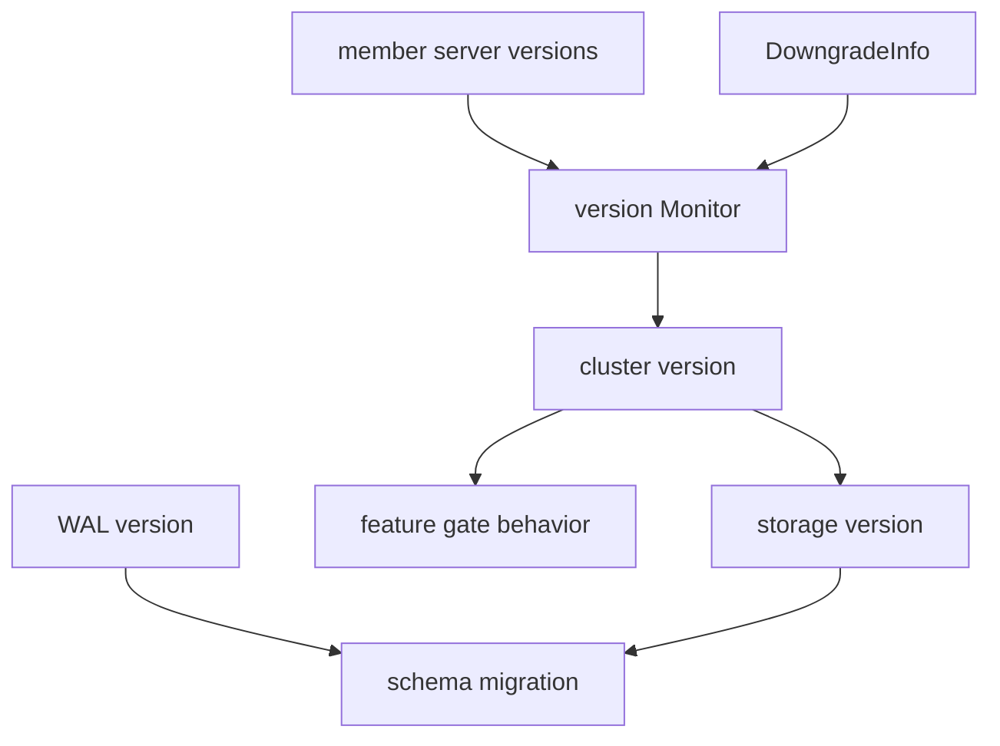

# 第24章 feature gate と version

> 本章で読むソース
>
> - [`server/etcdserver/version/monitor.go`](https://github.com/etcd-io/etcd/blob/v3.6.12/server/etcdserver/version/monitor.go)
> - [`server/etcdserver/version/downgrade.go`](https://github.com/etcd-io/etcd/blob/v3.6.12/server/etcdserver/version/downgrade.go)
> - [`server/features/etcd_features.go`](https://github.com/etcd-io/etcd/blob/v3.6.12/server/features/etcd_features.go)
> - [`server/storage/schema/schema.go`](https://github.com/etcd-io/etcd/blob/v3.6.12/server/storage/schema/schema.go)

## この章の狙い

本章では cluster version、storage version、feature gate、downgrade 情報がどう連動するかを読む。
member の最小 server version から cluster version を決め、storage schema migration へつなげる流れを確認する。

## 前提

etcd は複数 member が段階的に upgrade されるため、local binary version だけで機能を有効にできない。
storage schema は WAL の最小 version と cluster version の制約を受ける。

## 全体の流れ



## Monitor が cluster version を決める

`Monitor.UpdateClusterVersionIfNeeded` は member の最小 server version と downgrade 情報から新しい cluster version を決める。
cluster version が storage version と違う場合は、major と minor だけを取り出して storage version を更新する。

`Monitor` は cluster version と storage version の更新条件を判断する。

[server/etcdserver/version/monitor.go L47-L132](https://github.com/etcd-io/etcd/blob/v3.6.12/server/etcdserver/version/monitor.go#L47-L132)

```go
func NewMonitor(lg *zap.Logger, storage Server) *Monitor {
	return &Monitor{
		lg: lg,
		s:  storage,
	}
}

// UpdateClusterVersionIfNeeded updates the cluster version.
func (m *Monitor) UpdateClusterVersionIfNeeded() error {
	newClusterVersion, err := m.decideClusterVersion()
	if newClusterVersion != nil {
		newClusterVersion = &semver.Version{Major: newClusterVersion.Major, Minor: newClusterVersion.Minor}
		m.s.UpdateClusterVersion(newClusterVersion.String())
	}
	return err
}

// decideClusterVersion decides whether to change cluster version and its next value.
// New cluster version is based on the members versions server and whether cluster is downgrading.
// Returns nil if cluster version should be left unchanged.
func (m *Monitor) decideClusterVersion() (*semver.Version, error) {
	clusterVersion := m.s.GetClusterVersion()
	minimalServerVersion := m.membersMinimalServerVersion()
	if clusterVersion == nil {
		if minimalServerVersion != nil {
			return minimalServerVersion, nil
		}
		return semver.New(version.MinClusterVersion), nil
	}
	if minimalServerVersion == nil {
		return nil, nil
	}
	downgrade := m.s.GetDowngradeInfo()
	if downgrade != nil && downgrade.Enabled {
		if downgrade.GetTargetVersion().Equal(*clusterVersion) {
			return nil, nil
		}
		if !isValidDowngrade(clusterVersion, downgrade.GetTargetVersion()) {
			m.lg.Error("Cannot downgrade from cluster-version to downgrade-target",
				zap.String("downgrade-target", downgrade.TargetVersion),
				zap.String("cluster-version", clusterVersion.String()),
			)
			return nil, errors.New("invalid downgrade target")
		}
		if !isValidDowngrade(minimalServerVersion, downgrade.GetTargetVersion()) {
			m.lg.Error("Cannot downgrade from minimal-server-version to downgrade-target",
				zap.String("downgrade-target", downgrade.TargetVersion),
				zap.String("minimal-server-version", minimalServerVersion.String()),
			)
			return nil, errors.New("invalid downgrade target")
		}
		return downgrade.GetTargetVersion(), nil
	}
	if clusterVersion.LessThan(*minimalServerVersion) && IsValidClusterVersionChange(clusterVersion, minimalServerVersion) {
		return minimalServerVersion, nil
	}
	return nil, nil
}

// UpdateStorageVersionIfNeeded updates the storage version if it differs from cluster version.
func (m *Monitor) UpdateStorageVersionIfNeeded() {
	cv := m.s.GetClusterVersion()
	if cv == nil || cv.String() == version.MinClusterVersion {
		return
	}
	sv := m.s.GetStorageVersion()

	if sv == nil || sv.Major != cv.Major || sv.Minor != cv.Minor {
		if sv != nil {
			m.lg.Info("cluster version differs from storage version.", zap.String("cluster-version", cv.String()), zap.String("storage-version", sv.String()))
		}
		err := m.s.UpdateStorageVersion(semver.Version{Major: cv.Major, Minor: cv.Minor})
		if err != nil {
			m.lg.Error("failed to update storage version", zap.String("cluster-version", cv.String()), zap.Error(err))
			return
		}
		d := m.s.GetDowngradeInfo()
		if d != nil && d.Enabled {
			m.lg.Info(
				"The server is ready to downgrade",
				zap.String("target-version", d.TargetVersion),
				zap.String("server-version", version.Version),
			)
		}
	}
}
```

## downgrade は minor 一段を許す

`DowngradeInfo` は target version と enabled flag を持ち、`isValidDowngrade` は一つ下の minor だけを許可する。
`MustDetectDowngrade` は local server version が確定済み cluster version より低い場合に panic し、非対応 binary の参加を止める。

`DowngradeInfo` と downgrade 判定は minor version 単位で比較する。

[server/etcdserver/version/downgrade.go L24-L76](https://github.com/etcd-io/etcd/blob/v3.6.12/server/etcdserver/version/downgrade.go#L24-L76)

```go
type DowngradeInfo struct {
	// TargetVersion is the target downgrade version, if the cluster is not under downgrading,
	// the targetVersion will be an empty string
	TargetVersion string `json:"target-version"`
	// Enabled indicates whether the cluster is enabled to downgrade
	Enabled bool `json:"enabled"`
}

func (d *DowngradeInfo) GetTargetVersion() *semver.Version {
	return semver.Must(semver.NewVersion(d.TargetVersion))
}

// isValidDowngrade verifies whether the cluster can be downgraded from verFrom to verTo
func isValidDowngrade(verFrom *semver.Version, verTo *semver.Version) bool {
	return verTo.Equal(*allowedDowngradeVersion(verFrom))
}

// MustDetectDowngrade will detect local server joining cluster that doesn't support it's version.
func MustDetectDowngrade(lg *zap.Logger, sv, cv *semver.Version) {
	// only keep major.minor version for comparison against cluster version
	sv = &semver.Version{Major: sv.Major, Minor: sv.Minor}

	// if the cluster disables downgrade, check local version against determined cluster version.
	// the validation passes when local version is not less than cluster version
	if cv != nil && sv.LessThan(*cv) {
		lg.Panic(
			"invalid downgrade; server version is lower than determined cluster version",
			zap.String("current-server-version", sv.String()),
			zap.String("determined-cluster-version", version.Cluster(cv.String())),
		)
	}
}

func allowedDowngradeVersion(ver *semver.Version) *semver.Version {
	// Todo: handle the case that downgrading from higher major version(e.g. downgrade from v4.0 to v3.x)
	return &semver.Version{Major: ver.Major, Minor: ver.Minor - 1}
}

// IsValidClusterVersionChange checks the two scenario when version is valid to change:
// 1. Downgrade: cluster version is 1 minor version higher than local version,
// cluster version should change.
// 2. Cluster start: when not all members version are available, cluster version
// is set to MinVersion(3.0), when all members are at higher version, cluster version
// is lower than minimal server version, cluster version should change
func IsValidClusterVersionChange(verFrom *semver.Version, verTo *semver.Version) bool {
	verFrom = &semver.Version{Major: verFrom.Major, Minor: verFrom.Minor}
	verTo = &semver.Version{Major: verTo.Major, Minor: verTo.Minor}

	if isValidDowngrade(verFrom, verTo) || (verFrom.Major == verTo.Major && verFrom.LessThan(*verTo)) {
		return true
	}
	return false
}
```

## feature gate と storage migration

`DefaultEtcdServerFeatureGates` は v3.6 の alpha と beta feature の default を列挙する。
`UnsafeMigrate` は現在 schema version と target version から plan を作り、downgrade 時は WAL が新しい entry を含まないことを確認する。

`etcd_features.go` は server feature gate と legacy experimental flag の対応を定義する。

[server/features/etcd_features.go L42-L106](https://github.com/etcd-io/etcd/blob/v3.6.12/server/features/etcd_features.go#L42-L106)

```go
	StopGRPCServiceOnDefrag featuregate.Feature = "StopGRPCServiceOnDefrag"
	// TxnModeWriteWithSharedBuffer enables the write transaction to use a shared buffer in its readonly check operations.
	// owner: @wilsonwang371
	// beta: v3.5
	// main PR: https://github.com/etcd-io/etcd/pull/12896
	TxnModeWriteWithSharedBuffer featuregate.Feature = "TxnModeWriteWithSharedBuffer"
	// InitialCorruptCheck enable to check data corruption before serving any client/peer traffic.
	// owner: @serathius
	// alpha: v3.6
	// main PR: https://github.com/etcd-io/etcd/pull/10524
	InitialCorruptCheck featuregate.Feature = "InitialCorruptCheck"
	// CompactHashCheck enables leader to periodically check followers compaction hashes.
	// owner: @serathius
	// alpha: v3.6
	// main PR: https://github.com/etcd-io/etcd/pull/14120
	CompactHashCheck featuregate.Feature = "CompactHashCheck"
	// LeaseCheckpoint enables leader to send regular checkpoints to other members to prevent reset of remaining TTL on leader change.
	// owner: @serathius
	// alpha: v3.6
	// main PR: https://github.com/etcd-io/etcd/pull/13508
	LeaseCheckpoint featuregate.Feature = "LeaseCheckpoint"
	// LeaseCheckpointPersist enables persisting remainingTTL to prevent indefinite auto-renewal of long lived leases. Always enabled in v3.6. Should be used to ensure smooth upgrade from v3.5 clusters with this feature enabled.
	// Requires EnableLeaseCheckpoint featuragate to be enabled.
	// TODO: Delete in v3.7
	// owner: @serathius
	// alpha: v3.6
	// main PR: https://github.com/etcd-io/etcd/pull/13508
	// Deprecated: Enabled by default in v3.6, to be removed in v3.7.
	LeaseCheckpointPersist featuregate.Feature = "LeaseCheckpointPersist"
	// SetMemberLocalAddr enables using the first specified and non-loopback local address from initial-advertise-peer-urls as the local address when communicating with a peer.
	// Requires SetMemberLocalAddr featuragate to be enabled.
	// owner: @flawedmatrix
	// alpha: v3.6
	// main PR: https://github.com/etcd-io/etcd/pull/17661
	SetMemberLocalAddr featuregate.Feature = "SetMemberLocalAddr"
)

var (
	DefaultEtcdServerFeatureGates = map[featuregate.Feature]featuregate.FeatureSpec{
		StopGRPCServiceOnDefrag:      {Default: false, PreRelease: featuregate.Alpha},
		InitialCorruptCheck:          {Default: false, PreRelease: featuregate.Alpha},
		CompactHashCheck:             {Default: false, PreRelease: featuregate.Alpha},
		TxnModeWriteWithSharedBuffer: {Default: true, PreRelease: featuregate.Beta},
		LeaseCheckpoint:              {Default: false, PreRelease: featuregate.Alpha},
		LeaseCheckpointPersist:       {Default: false, PreRelease: featuregate.Alpha},
		SetMemberLocalAddr:           {Default: false, PreRelease: featuregate.Alpha},
	}
	// ExperimentalFlagToFeatureMap is the map from the cmd line flags of experimental features
	// to their corresponding feature gates.
	// Deprecated: Only add existing experimental features here. DO NOT use for new features.
	ExperimentalFlagToFeatureMap = map[string]featuregate.Feature{
		"experimental-stop-grpc-service-on-defrag":       StopGRPCServiceOnDefrag,
		"experimental-initial-corrupt-check":             InitialCorruptCheck,
		"experimental-compact-hash-check-enabled":        CompactHashCheck,
		"experimental-txn-mode-write-with-shared-buffer": TxnModeWriteWithSharedBuffer,
		"experimental-enable-lease-checkpoint":           LeaseCheckpoint,
		"experimental-enable-lease-checkpoint-persist":   LeaseCheckpointPersist,
	}
)

func NewDefaultServerFeatureGate(name string, lg *zap.Logger) featuregate.FeatureGate {
	fg := featuregate.New(fmt.Sprintf("%sServerFeatureGate", name), lg)
	if err := fg.Add(DefaultEtcdServerFeatureGates); err != nil {
		panic(err)
	}
```

`UnsafeMigrate` は WAL の最小 etcd version と target storage version を照合する。

[server/storage/schema/schema.go L53-L79](https://github.com/etcd-io/etcd/blob/v3.6.12/server/storage/schema/schema.go#L53-L79)

```go
func Migrate(lg *zap.Logger, tx backend.BatchTx, w wal.Version, target semver.Version) error {
	tx.LockOutsideApply()
	defer tx.Unlock()
	return UnsafeMigrate(lg, tx, w, target)
}

// UnsafeMigrate is non thread-safe version of Migrate.
func UnsafeMigrate(lg *zap.Logger, tx backend.UnsafeReadWriter, w wal.Version, target semver.Version) error {
	current, err := UnsafeDetectSchemaVersion(lg, tx)
	if err != nil {
		return fmt.Errorf("cannot detect storage schema version: %w", err)
	}
	plan, err := newPlan(lg, current, target)
	if err != nil {
		return fmt.Errorf("cannot create migration plan: %w", err)
	}
	if target.LessThan(current) {
		minVersion := w.MinimalEtcdVersion()
		if minVersion != nil && target.LessThan(*minVersion) {
			// Occasionally we may see this error during downgrade test due to ClusterVersionSet,
			// which is harmless. Please read https://github.com/etcd-io/etcd/pull/13405#discussion_r1890378185.
			return fmt.Errorf("cannot downgrade storage, WAL contains newer entries, as the target version (%s) is lower than the version (%s) detected from WAL logs",
				target.String(), minVersion.String())
		}
	}
	return plan.unsafeExecute(lg, tx)
}
```

## 最適化の工夫

cluster version と storage version を major と minor に丸めて比較するため、patch version の違いで schema migration や feature 判定を不要に揺らさない。
feature gate は map で default と pre release state を持つため、flag parsing 後の判定は feature 名 lookup に集約できる。

## まとめ

- version 管理は member version、cluster version、storage version、feature gate を分けて扱う。
- downgrade と migration は WAL に残る新しい entry を考慮し、storage だけを先に古くしないようにする。

## 関連する章

- [schema と keyspace](../part01-storage/04-schema-keyspace.md)
- [cluster bootstrap](../part03-raft/12-cluster-bootstrap.md)
- [corruption check](23-corruption-check.md)
