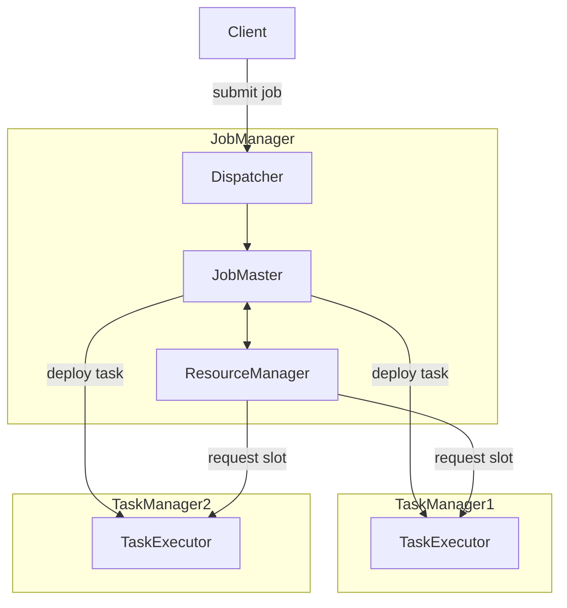
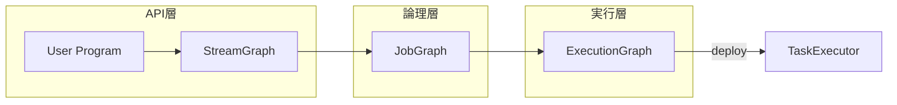

# 第1章 Flink とは何か：アーキテクチャと実行モデル

> **本章で読むソース**
>
> - [`StreamGraph.java`](https://github.com/apache/flink/blob/release-2.3.0/flink-runtime/src/main/java/org/apache/flink/streaming/api/graph/StreamGraph.java)
> - [`JobGraph.java`](https://github.com/apache/flink/blob/release-2.3.0/flink-runtime/src/main/java/org/apache/flink/runtime/jobgraph/JobGraph.java)
> - [`ExecutionGraph.java`](https://github.com/apache/flink/blob/release-2.3.0/flink-runtime/src/main/java/org/apache/flink/runtime/executiongraph/ExecutionGraph.java)
> - [`TaskExecutor.java`](https://github.com/apache/flink/blob/release-2.3.0/flink-runtime/src/main/java/org/apache/flink/runtime/taskexecutor/TaskExecutor.java)
> - [`MemorySegment.java`](https://github.com/apache/flink/blob/release-2.3.0/flink-core/src/main/java/org/apache/flink/core/memory/MemorySegment.java)
> - [`Dispatcher.java`](https://github.com/apache/flink/blob/release-2.3.0/flink-runtime/src/main/java/org/apache/flink/runtime/dispatcher/Dispatcher.java)
> - [`ResourceManager.java`](https://github.com/apache/flink/blob/release-2.3.0/flink-runtime/src/main/java/org/apache/flink/runtime/resourcemanager/ResourceManager.java)
> - [`JobMaster.java`](https://github.com/apache/flink/blob/release-2.3.0/flink-runtime/src/main/java/org/apache/flink/runtime/jobmaster/JobMaster.java)
> - [`RuntimeExecutionMode.java`](https://github.com/apache/flink/blob/release-2.3.0/flink-core-api/src/main/java/org/apache/flink/api/common/RuntimeExecutionMode.java)

## この章の狙い

**Apache Flink** は、データを有限のバッチとしても無限のストリームとしても同じエンジンで処理する、分散データ処理システムである。
本章の狙いは、これから読み進める個々のクラスがシステム全体のどこに位置するかを把握することにある。

Flink のソースコードは、JobManager 側とTaskManager 側のプロセス構成、そしてユーザープログラムを3段階の内部表現へ変換していくグラフ構造という、二つの軸で読み解ける。
この地図を先に持っておくと、第2部以降で個々のクラスを読むときに迷わない。

## 前提

以降の説明では、Flink のプログラムが `DataStream` API や `Table` API を使って書かれ、演算子（operator）の連なりとして表現されることを前提にする。
演算子とは、レコードを受け取って処理し、次の演算子へ渡す処理単位のことである。
並列度（parallelism）とは、一つの演算子を何個の並列インスタンスに分割して実行するかを表す値である。

## プロセス構成：JobManager と TaskManager

Flink クラスターは、大きく二種類のプロセスから構成される。
**JobManager** はジョブの受付、スケジューリング、調整を担うプロセスであり、**TaskManager** は実際の演算子を実行するプロセスである。

JobManager プロセスの内部は、さらに三つのコンポーネントに分かれる。
**Dispatcher** はジョブ投入の窓口であり、ジョブごとに JobMaster を起動する役割を持つ。
`Dispatcher` のクラス冒頭のコメントは、この役割を次のように述べている。

[`Dispatcher.java` L162-L166](https://github.com/apache/flink/blob/release-2.3.0/flink-runtime/src/main/java/org/apache/flink/runtime/dispatcher/Dispatcher.java#L162-L166)

```java
/**
 * Base class for the Dispatcher component. The Dispatcher component is responsible for receiving
 * job submissions, persisting them, spawning JobManagers to execute the jobs and to recover them in
 * case of a master failure. Furthermore, it knows about the state of the Flink session cluster.
 */
```

**ResourceManager** は、クラスター内のスロット（TaskManager が提供する実行スロット）を管理し、JobMaster からの要求に応じて割り当てる役割を持つ。

[`ResourceManager.java` L111-L120](https://github.com/apache/flink/blob/release-2.3.0/flink-runtime/src/main/java/org/apache/flink/runtime/resourcemanager/ResourceManager.java#L111-L120)

```java
/**
 * ResourceManager implementation. The resource manager is responsible for resource de-/allocation
 * and bookkeeping.
 *
 * <p>It offers the following methods as part of its rpc interface to interact with him remotely:
 *
 * <ul>
 *   <li>{@link #registerJobMaster(JobMasterId, ResourceID, String, JobID, Duration)} registers a
 *       {@link JobMaster} at the resource manager
 * </ul>
 */
```

**JobMaster** は、一つのジョブの実行を担当するコンポーネントである。
Dispatcher が起動し、ResourceManager からスロットを受け取り、TaskManager へタスクをデプロイして実行状態を追跡する。

[`JobMaster.java` L144-L152](https://github.com/apache/flink/blob/release-2.3.0/flink-runtime/src/main/java/org/apache/flink/runtime/jobmaster/JobMaster.java#L144-L152)

```java
/**
 * JobMaster implementation. The job master is responsible for the execution of a single {@link
 * ExecutionPlan}.
 *
 * <p>It offers the following methods as part of its rpc interface to interact with the JobMaster
 * remotely:
 *
 * <ul>
 *   <li>{@link #updateTaskExecutionState} updates the task execution state for given task
 * </ul>
 */
```

TaskManager プロセスの実体は **TaskExecutor** である。
`TaskExecutor` のクラス冒頭のコメントは、その役割を一文で示す。

[`TaskExecutor.java` L199-L202](https://github.com/apache/flink/blob/release-2.3.0/flink-runtime/src/main/java/org/apache/flink/runtime/taskexecutor/TaskExecutor.java#L199-L202)

```java
/**
 * TaskExecutor implementation. The task executor is responsible for the execution of multiple
 * {@link Task}.
 */
```

TaskExecutor は一つ以上のスロットを持ち、それぞれのスロットに演算子のサブタスクが配置される。
複数のジョブが同じ TaskManager を共有することもあるため、TaskExecutor はスロットの割り当てとリソースの分離を管理する。

以上の構成を図にすると次のようになる。



## 実行モデル：Source から Sink までの演算子グラフ

Flink のプログラムは、Source（データの入り口）から Sink（データの出口）までを演算子でつなぐ有向グラフとして表現される。
プログラムがコンパイルされる過程で、各演算子は並列度ぶんのサブタスクに展開され、サブタスク間はネットワークまたはローカルのチャンネルで接続される。

この展開を経ることで、同じプログラムの記述が、並列度を変えるだけでクラスター全体に分散して実行できるようになる。
たとえば並列度が4の `map` 演算子は、実行時には4個の独立したサブタスクとして各 TaskManager のスロットに配置される。

## 3層のグラフ表現

ユーザープログラムから実際の実行までの間には、三つの段階のグラフ表現が存在する。
それぞれが対応するレイヤーを持ち、上位から下位へ順に変換されていく。

**StreamGraph** は、DataStream API が組み立てる最初の内部表現であり、ユーザーが記述した演算子と、その間のデータ交換方法をそのまま保持する。

[`StreamGraph.java` L123-L126](https://github.com/apache/flink/blob/release-2.3.0/flink-runtime/src/main/java/org/apache/flink/streaming/api/graph/StreamGraph.java#L123-L126)

```java
/**
 * Class representing the streaming topology. It contains all the information necessary to build the
 * jobgraph for the execution.
 */
```

**JobGraph** は、StreamGraph を最適化した論理的な実行計画である。
複数の演算子を一つのタスクにまとめるオペレーターチェインは、この段階で行われる。

[`JobGraph.java` L59-L67](https://github.com/apache/flink/blob/release-2.3.0/flink-runtime/src/main/java/org/apache/flink/runtime/jobgraph/JobGraph.java#L59-L67)

```java
/**
 * The JobGraph represents a Flink dataflow program, at the low level that the JobManager accepts.
 * All programs from higher level APIs are transformed into JobGraphs.
 *
 * <p>The JobGraph is a graph of vertices and intermediate results that are connected together to
 * form a DAG. Note that iterations (feedback edges) are currently not encoded inside the JobGraph
 * but inside certain special vertices that establish the feedback channel amongst themselves.
 *
 * <p>The JobGraph defines the job-wide configuration settings, while each vertex and intermediate
 * result define the characteristics of the concrete operation and intermediate data.
 */
```

**ExecutionGraph** は、JobGraph の各頂点（`JobVertex`）を並列度ぶんに展開した、実行時の並行状態を表すグラフである。
2.3.0 では `ExecutionGraph` はインターフェースであり、実装の詳細は `DefaultExecutionGraph` 等に分離されている。
インターフェース宣言のコメントは、構成要素を次のように説明する。

[`ExecutionGraph.java` L58-L78](https://github.com/apache/flink/blob/release-2.3.0/flink-runtime/src/main/java/org/apache/flink/runtime/executiongraph/ExecutionGraph.java#L58-L78)

```java
/**
 * The execution graph is the central data structure that coordinates the distributed execution of a
 * data flow. It keeps representations of each parallel task, each intermediate stream, and the
 * communication between them.
 *
 * <p>The execution graph consists of the following constructs:
 *
 * <ul>
 *   <li>The {@link ExecutionJobVertex} represents one vertex from the JobGraph (usually one
 *       operation like "map" or "join") during execution. It holds the aggregated state of all
 *       parallel subtasks. The ExecutionJobVertex is identified inside the graph by the {@link
 *       JobVertexID}, which it takes from the JobGraph's corresponding JobVertex.
 *   <li>The {@link ExecutionVertex} represents one parallel subtask. For each ExecutionJobVertex,
 *       there are as many ExecutionVertices as the parallelism. The ExecutionVertex is identified
 *       by the ExecutionJobVertex and the index of the parallel subtask
 *   <li>The {@link Execution} is one attempt to execute a ExecutionVertex. There may be multiple
 *       Executions for the ExecutionVertex, in case of a failure, or in the case where some data
 *       needs to be recomputed because it is no longer available when requested by later
 *       operations. An Execution is always identified by an {@link ExecutionAttemptID}. All
 *       messages between the JobManager and the TaskManager about deployment of tasks and updates
 *       in the task status always use the ExecutionAttemptID to address the message receiver.
 * </ul>
 */
```

`JobVertex` が JobGraph 上の一つの演算子（またはチェインされた演算子群）を表すのに対し、`ExecutionVertex` はその並列度ぶんに展開された一つのサブタスクを表す。
`Execution` はさらにその実行試行一つ一つを表す単位であり、失敗時の再実行のたびに新しい `Execution` が作られる。

三つのグラフとプロセス構成の対応を図にすると次のようになる。



StreamGraph の構築は第7章、JobGraph へのオペレーターチェインは第9章の直前の章、ExecutionGraph の構築とスケジューリングは第9章で詳しく扱う。

## ストリームとバッチの統一実行

Flink は、有限のバッチデータと無限のストリームデータを同じ演算子と同じエンジンで処理する。
この実行モードの切り替えは `RuntimeExecutionMode` で表現される。

[`RuntimeExecutionMode.java` L22-L47](https://github.com/apache/flink/blob/release-2.3.0/flink-core-api/src/main/java/org/apache/flink/api/common/RuntimeExecutionMode.java#L22-L47)

```java
/**
 * Runtime execution mode of DataStream programs. Among other things, this controls task scheduling,
 * network shuffle behavior, and time semantics. Some operations will also change their record
 * emission behaviour based on the configured execution mode.
 *
 * @see <a
 *     href="https://cwiki.apache.org/confluence/display/FLINK/FLIP-134%3A+Batch+execution+for+the+DataStream+API">
 *     https://cwiki.apache.org/confluence/display/FLINK/FLIP-134%3A+Batch+execution+for+the+DataStream+API</a>
 */
@PublicEvolving
public enum RuntimeExecutionMode {

    /**
     * The Pipeline will be executed with Streaming Semantics. All tasks will be deployed before
     * execution starts, checkpoints will be enabled, and both processing and event time will be
     * fully supported.
     */
    STREAMING,

    /**
     * The Pipeline will be executed with Batch Semantics. Tasks will be scheduled gradually based
     * on the scheduling region they belong, shuffles between regions will be blocking, watermarks
     * are assumed to be "perfect" i.e. no late data, and processing time is assumed to not advance
     * during execution.
     */
    BATCH,

    /**
     * Flink will set the execution mode to {@link RuntimeExecutionMode#BATCH} if all sources are
     * bounded, or {@link RuntimeExecutionMode#STREAMING} if there is at least one source which is
     * unbounded.
     */
    AUTOMATIC
}
```

`STREAMING` モードでは全タスクを起動前にデプロイし、シャッフルはパイプライン的に流れる。
`BATCH` モードではスケジューリング領域ごとに段階的にタスクを起動し、シャッフルはブロッキングになる。
同じ演算子の実装を両モードで共有できるのは、演算子が「レコードを受け取って処理する」という抽象の上に書かれており、デプロイのタイミングやシャッフルの方式はエンジン側の責務として分離されているためである。

## メモリ管理の基盤：MemorySegment

演算子がレコードを処理する際、Flink は JVM のヒープに任せきりにするのではなく、独自のメモリ管理層を持つ。
その最小単位が **`MemorySegment`** である。

[`MemorySegment.java` L42-L68](https://github.com/apache/flink/blob/release-2.3.0/flink-core/src/main/java/org/apache/flink/core/memory/MemorySegment.java#L42-L68)

```java
/**
 * This class represents a piece of memory managed by Flink.
 *
 * <p>The memory can be on-heap, off-heap direct or off-heap unsafe. This is transparently handled
 * by this class.
 *
 * <p>This class fulfills conceptually a similar purpose as Java's {@link java.nio.ByteBuffer}. We
 * add this specialized class for various reasons:
 *
 * <ul>
 *   <li>It offers additional binary compare, swap, and copy methods.
 *   <li>It uses collapsed checks for range check and memory segment disposal.
 *   <li>It offers absolute positioning methods for bulk put/get methods, to guarantee thread safe
 *       use.
 *   <li>It offers explicit big-endian / little-endian access methods, rather than tracking
 *       internally a byte order.
 *   <li>It transparently and efficiently moves data between on-heap and off-heap variants.
 * </ul>
 *
 * <p><i>Comments on the implementation</i>: We make heavy use of operations that are supported by
 * native instructions, to achieve a high efficiency. Multi byte types (int, long, float, double,
 * ...) are read and written with "unsafe" native commands.
 *
 * <p><i>Note on efficiency</i>: For best efficiency, we do not separate implementations of
 * different memory types with inheritance, to avoid the overhead from looking for concrete
 * implementations on invocations of abstract methods.
 */
```

`MemorySegment` の詳細な実装とマネージドメモリの割り当ては第3章で扱う。

## オペレーターチェインという最適化

3層のグラフのうち、StreamGraph から JobGraph への変換では、隣接する演算子をまとめて一つのタスクとして実行する**オペレーターチェイン**という最適化が行われる。
チェインされた演算子どうしは、同じスレッド内で関数呼び出しとしてレコードを受け渡すため、ネットワークやスレッド間のシリアライゼーションを経由しない。
サブタスク間をまたぐ通信には必ずシリアライゼーションとバッファリングのコストがかかるため、チェインによってこのコストを避けられる箇所は避けることが、スループットを高める基本的な機構になっている。
この変換の詳細は第8章で扱う。

## まとめ

Flink のクラスターは、Dispatcher、ResourceManager、JobMaster から成る JobManager と、TaskExecutor が動く TaskManager 群で構成される。
ユーザープログラムは Source から Sink までの演算子グラフとして書かれ、StreamGraph、JobGraph、ExecutionGraph という3層の内部表現を経て、並列度ぶんのサブタスクに展開されたうえで TaskManager に配置される。
`RuntimeExecutionMode` によってストリームとバッチを同じエンジンと同じ演算子で切り替えられる点、そして `MemorySegment` によって JVM ヒープに依存しないメモリ管理を行っている点も、以降の章を読み進めるうえでの土台になる。

## 関連する章

- 第2章 [クラスターのエントリーポイント](02-cluster-entrypoint.md)
- 第7章 [StreamGraph の構築](../part02-graph/07-streamgraph.md)
- 第9章 [ExecutionGraph とスケジューリング](../part02-graph/09-executiongraph.md)
- 第13章 [StreamTask と mailbox モデル](../part04-task-execution/13-streamtask-mailbox.md)
