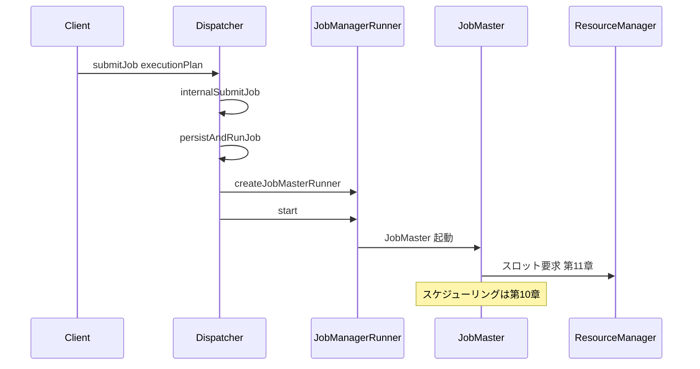

# 第2章 クラスタ起動とジョブ投入：ClusterEntrypoint と Dispatcher

> **本章で読むソース**
>
> - [`ClusterEntrypoint.java`](https://github.com/apache/flink/blob/release-2.3.0/flink-runtime/src/main/java/org/apache/flink/runtime/entrypoint/ClusterEntrypoint.java)
> - [`Dispatcher.java`](https://github.com/apache/flink/blob/release-2.3.0/flink-runtime/src/main/java/org/apache/flink/runtime/dispatcher/Dispatcher.java)
> - [`DispatcherGateway.java`](https://github.com/apache/flink/blob/release-2.3.0/flink-runtime/src/main/java/org/apache/flink/runtime/dispatcher/DispatcherGateway.java)
> - [`ResourceManager.java`](https://github.com/apache/flink/blob/release-2.3.0/flink-runtime/src/main/java/org/apache/flink/runtime/resourcemanager/ResourceManager.java)
> - [`RpcGateway.java`](https://github.com/apache/flink/blob/release-2.3.0/flink-rpc/flink-rpc-core/src/main/java/org/apache/flink/runtime/rpc/RpcGateway.java)
> - [`RpcService.java`](https://github.com/apache/flink/blob/release-2.3.0/flink-rpc/flink-rpc-core/src/main/java/org/apache/flink/runtime/rpc/RpcService.java)
> - [`SessionDispatcherLeaderProcess.java`](https://github.com/apache/flink/blob/release-2.3.0/flink-runtime/src/main/java/org/apache/flink/runtime/dispatcher/runner/SessionDispatcherLeaderProcess.java)
> - [`ApplicationClusterEntryPoint.java`](https://github.com/apache/flink/blob/release-2.3.0/flink-clients/src/main/java/org/apache/flink/client/deployment/application/ApplicationClusterEntryPoint.java)

## この章の狙い

第1章では、Flink がストリームとバッチを共通の実行基盤で扱う分散処理システムであることを見た。

本章では、その実行基盤を構成する **JobManager** プロセスが起動してからジョブを受け付けるまでの経路をたどる。

具体的には、プロセス起動の入口である `ClusterEntrypoint`、ジョブ submission の受付窓口である `Dispatcher`、そしてコンポーネント間通信を支える RPC 基盤の3つを扱う。

## 前提

Flink のクラスタは大きく2種類のプロセスからなる。

- **JobManager**：ジョブの受付とスケジューリングを担うプロセス（`ClusterEntrypoint` はこのプロセスの起動入口である）
- **TaskManager**：実際の演算を実行するプロセス（実体は `TaskExecutor` であり、第12章で扱う）

JobManager プロセス内部にも役割の異なるコンポーネントがいくつも同居する。

`Dispatcher` はジョブ submission を受け付ける窓口であり、ジョブごとに `JobMaster` を生成する。

`ResourceManager` は `TaskExecutor` の登録とスロットの仲介を担う。

これらのコンポーネントは同一プロセス内の別スレッドで動作し、直接メソッドを呼び合うのではなく、後述する RPC の仕組みを介して通信する。

## ClusterEntrypoint の起動シーケンス

`ClusterEntrypoint` は JobManager プロセスの `main` メソッドから呼ばれる起動処理の起点である。

`startCluster` メソッドが最初のエントリポイントであり、セキュリティコンテキストの構築を挟んで `runCluster` を呼ぶ。

[`ClusterEntrypoint.java` L223-L240](https://github.com/apache/flink/blob/release-2.3.0/flink-runtime/src/main/java/org/apache/flink/runtime/entrypoint/ClusterEntrypoint.java#L223-L240)

```java
public void startCluster() throws ClusterEntrypointException {
    LOG.info("Starting {}.", getClass().getSimpleName());

    try {
        FlinkSecurityManager.setFromConfiguration(configuration);
        PluginManager pluginManager =
                PluginUtils.createPluginManagerFromRootFolder(configuration);
        configureFileSystems(configuration, pluginManager);

        SecurityContext securityContext = installSecurityContext(configuration);

        ClusterEntrypointUtils.configureUncaughtExceptionHandler(configuration);
        securityContext.runSecured(
                (Callable<Void>)
                        () -> {
                            runCluster(configuration, pluginManager);

                            return null;
```

`runCluster` は `initializeServices` で共通サービス（RPC サービス、HA サービス、BLOB サーバーなど）を立ち上げたうえで、`DispatcherResourceManagerComponentFactory` に `Dispatcher` と `ResourceManager` の生成を委ねる。

[`ClusterEntrypoint.java` L293-L308](https://github.com/apache/flink/blob/release-2.3.0/flink-runtime/src/main/java/org/apache/flink/runtime/entrypoint/ClusterEntrypoint.java#L293-L308)

```java
            final DispatcherResourceManagerComponentFactory
                    dispatcherResourceManagerComponentFactory =
                            createDispatcherResourceManagerComponentFactory(configuration);

            clusterComponent =
                    dispatcherResourceManagerComponentFactory.create(
                            configuration,
                            resourceId.unwrap(),
                            ioExecutor,
                            commonRpcService,
                            haServices,
                            blobServer,
                            heartbeatServices,
                            delegationTokenManager,
                            metricRegistry,
                            archivedApplicationStore,
                            new RpcMetricQueryServiceRetriever(
                                    metricRegistry.getMetricQueryServiceRpcService()),
                            failureEnrichers,
                            this);
```

`initializeServices` では、`RpcService` の生成に始まり、HA サービス（`haServices`）、BLOB サーバー、ハートビートサービス、メトリクスレジストリの初期化までを1つの `synchronized (lock)` ブロックの中で順に行う。

[`ClusterEntrypoint.java` L334-L363](https://github.com/apache/flink/blob/release-2.3.0/flink-runtime/src/main/java/org/apache/flink/runtime/entrypoint/ClusterEntrypoint.java#L334-L363)

```java
    protected void initializeServices(Configuration configuration, PluginManager pluginManager)
            throws Exception {

        LOG.info("Initializing cluster services.");

        synchronized (lock) {
            resourceId =
                    configuration
                            .getOptional(JobManagerOptions.JOB_MANAGER_RESOURCE_ID)
                            .map(
                                    value ->
                                            DeterminismEnvelope.deterministicValue(
                                                    new ResourceID(value)))
                            .orElseGet(
                                    () ->
                                            DeterminismEnvelope.nondeterministicValue(
                                                    ResourceID.generate()));

            LOG.debug(
                    "Initialize cluster entrypoint {} with resource id {}.",
                    getClass().getSimpleName(),
                    resourceId);

            workingDirectory =
                    ClusterEntrypointUtils.createJobManagerWorkingDirectory(
                            configuration, resourceId);

            LOG.info("Using working directory: {}.", workingDirectory);

            rpcSystem = RpcSystem.load(configuration);

            commonRpcService =
                    RpcUtils.createRemoteRpcService(
```

`createDispatcherResourceManagerComponentFactory` は抽象メソッドであり、実際にどの `Dispatcher`、`ResourceManager` の実装を組み立てるかはサブクラスに委ねられている。

`ClusterEntrypoint` を継承するクラスは、クラスタの運用形態ごとに用意されている。

Session クラスタでは `SessionClusterEntrypoint`（`StandaloneSessionClusterEntrypoint` や `YarnSessionClusterEntrypoint` など）が使われ、複数のジョブを同じクラスタに順次 submit できる。

Application クラスタでは `ApplicationClusterEntryPoint` が使われ、クラスタの起動と1つのアプリケーションの実行がライフサイクルを共にする。

Session クラスタでは、`Dispatcher` の実装をリーダー選出のたびに生成し直す仕組みが `SessionDispatcherLeaderProcess` にある。

Application クラスタでは、起動時に指定された `main` メソッドを実行してジョブをただちに submit する `ApplicationDispatcherLeaderProcessFactoryFactory`（`ApplicationClusterEntryPoint` の `createDispatcherResourceManagerComponentFactory` から生成される）が使われる。

両者の違いは、ジョブを外部クライアントから逐次受け付けるか、起動と同時に決まったジョブを実行するかという submission のトリガーの違いに集約される。

## RPC 基盤：RpcService と RpcGateway

`Dispatcher` や `ResourceManager` は、互いに直接メソッドを呼び出すのではなく、`RpcEndpoint` として RPC サーバーに登録され、`RpcGateway` インターフェース越しに呼び出される。

`RpcGateway` はエンドポイントのアドレスとホスト名だけを規定する最小のインターフェースである。

[`RpcGateway.java` L20-L33](https://github.com/apache/flink/blob/release-2.3.0/flink-rpc/flink-rpc-core/src/main/java/org/apache/flink/runtime/rpc/RpcGateway.java#L20-L33)

```java
public interface RpcGateway {

    /**
     * Returns the fully qualified address under which the associated rpc endpoint is reachable.
     *
     * @return Fully qualified (RPC) address under which the associated rpc endpoint is reachable
     */
    String getAddress();

    /**
     * Returns the fully qualified hostname under which the associated rpc endpoint is reachable.
     *
     * @return Fully qualified hostname under which the associated rpc endpoint is reachable
     */
    String getHostname();
}
```

コンポーネント間で通信したい側は、`RpcService.connect` にアドレスとゲートウェイの型を渡し、対応する `RpcGateway` を取得する。

[`RpcService.java` L76-L76](https://github.com/apache/flink/blob/release-2.3.0/flink-rpc/flink-rpc-core/src/main/java/org/apache/flink/runtime/rpc/RpcService.java#L76-L76)

```java
    <C extends RpcGateway> CompletableFuture<C> connect(String address, Class<C> clazz);
```

`ResourceManager` が `TaskExecutor` を登録するときも、`registerTaskExecutor` の内部でこの `connect` を呼び、`TaskExecutorGateway` を取得してから応答を返す。

[`ResourceManager.java` L475-L488](https://github.com/apache/flink/blob/release-2.3.0/flink-runtime/src/main/java/org/apache/flink/runtime/resourcemanager/ResourceManager.java#L475-L488)

```java
    public CompletableFuture<RegistrationResponse> registerTaskExecutor(
            final TaskExecutorRegistration taskExecutorRegistration, final Duration timeout) {

        CompletableFuture<TaskExecutorGateway> taskExecutorGatewayFuture =
                getRpcService()
                        .connect(
                                taskExecutorRegistration.getTaskExecutorAddress(),
                                TaskExecutorGateway.class);
        taskExecutorGatewayFutures.put(
                taskExecutorRegistration.getResourceId(), taskExecutorGatewayFuture);

        return taskExecutorGatewayFuture.handleAsync(
                (TaskExecutorGateway taskExecutorGateway, Throwable throwable) -> {
                    final ResourceID resourceId = taskExecutorRegistration.getResourceId();
```

`ResourceManager` の役割は、この登録処理と、`JobMaster` からのスロット要求を `TaskExecutor` の空きスロットへ仲介することに絞られる。

登録済みの `TaskExecutor` をどう追跡し、スロットの割り当てをどう決めるかは第11章で扱う。

このように、Dispatcher、ResourceManager、TaskExecutor はすべて `RpcGateway` を介して疎結合に呼び合う。

呼び出す側は相手が同一プロセス内にいるか別ホストにいるかを意識せずにすむ。

Flink はこの分散透過性を、Pekko（旧 Akka）を基盤とした RPC システムの上に実装しており、ローカルとリモートで同じ `RpcGateway` インターフェースを使い回せる。

## Dispatcher によるジョブ受付

クライアントから submit されたジョブは、`DispatcherGateway` の `submitJob` を通じて `Dispatcher` に届く。

[`DispatcherGateway.java` L40-L48](https://github.com/apache/flink/blob/release-2.3.0/flink-runtime/src/main/java/org/apache/flink/runtime/dispatcher/DispatcherGateway.java#L40-L48)

```java
    /**
     * Submit a job to the dispatcher.
     *
     * @param executionPlan ExecutionPlan to submit
     * @param timeout RPC timeout
     * @return A future acknowledge if the submission succeeded
     */
    CompletableFuture<Acknowledge> submitJob(
            ExecutionPlan executionPlan, @RpcTimeout Duration timeout);
```

`Dispatcher` の実装である `submitJob` は、まず同じ `jobId` のジョブがすでに終了状態か、登録済みかを確認する。

いずれの条件にも当たらなければ `internalSubmitJob` に処理を渡す。

[`Dispatcher.java` L835-L864](https://github.com/apache/flink/blob/release-2.3.0/flink-runtime/src/main/java/org/apache/flink/runtime/dispatcher/Dispatcher.java#L835-L864)

```java
    public CompletableFuture<Acknowledge> submitJob(ExecutionPlan executionPlan, Duration timeout) {
        final JobID jobID = executionPlan.getJobID();
        try (MdcCloseable ignored = MdcUtils.withContext(MdcUtils.asContextData(jobID))) {
            log.info("Received job submission '{}' ({}).", executionPlan.getName(), jobID);
        }
        return isInGloballyTerminalState(jobID)
                .thenComposeAsync(
                        isTerminated -> {
                            if (isTerminated) {
                                log.warn(
                                        "Ignoring job submission '{}' ({}) because the job already "
                                                + "reached a globally-terminal state (i.e. {}) in a "
                                                + "previous execution.",
                                        executionPlan.getName(),
                                        jobID,
                                        Arrays.stream(JobStatus.values())
                                                .filter(JobStatus::isGloballyTerminalState)
                                                .map(JobStatus::name)
                                                .collect(Collectors.joining(", ")));
                                return FutureUtils.completedExceptionally(
                                        DuplicateJobSubmissionException.ofGloballyTerminated(
                                                jobID));
                            } else if (jobManagerRunnerRegistry.isRegistered(jobID)
                                    || submittedAndWaitingTerminationJobIDs.contains(jobID)
                                    || suspendedJobs.containsKey(jobID)) {
                                // job with the given jobID is not terminated, yet
                                return FutureUtils.completedExceptionally(
                                        DuplicateJobSubmissionException.of(jobID));
                            } else {
                                return internalSubmitJob(executionPlan);
                            }
                        },
                        getMainThreadExecutor(jobID));
    }
```

`internalSubmitJob` は、submission 中のジョブを一時的な集合に加えたうえで、`persistAndRunJob` を実行し、完了後にその集合からジョブを取り除く。

[`Dispatcher.java` L1270-L1291](https://github.com/apache/flink/blob/release-2.3.0/flink-runtime/src/main/java/org/apache/flink/runtime/dispatcher/Dispatcher.java#L1270-L1291)

```java
    private CompletableFuture<Acknowledge> internalSubmitJob(ExecutionPlan executionPlan) {
        if (executionPlan instanceof JobGraph) {
            applyParallelismOverrides((JobGraph) executionPlan);
        }

        final JobID jobId = executionPlan.getJobID();
        final String jobName = executionPlan.getName();
        final ApplicationID applicationId = executionPlan.getApplicationId().orElse(null);

        log.info(
                "Submitting job '{}' ({}) with associated application ({}).",
                jobName,
                jobId,
                applicationId);

        // track as an outstanding job
        submittedAndWaitingTerminationJobIDs.add(jobId);

        return waitForTerminatingJob(jobId, executionPlan, this::persistAndRunJob)
                .handle((ignored, throwable) -> handleTermination(jobId, throwable))
                .thenCompose(Function.identity())
                .whenComplete(
                        (ignored, throwable) ->
                                // job is done processing, whether failed or finished
                                submittedAndWaitingTerminationJobIDs.remove(jobId));
    }
```

`persistAndRunJob` はジョブの実行計画を永続化したあと、`createJobMasterRunner` で作った `JobManagerRunner` を `runJob` に渡す。

[`Dispatcher.java` L1338-L1368](https://github.com/apache/flink/blob/release-2.3.0/flink-runtime/src/main/java/org/apache/flink/runtime/dispatcher/Dispatcher.java#L1338-L1368)

```java
    private void persistAndRunJob(ExecutionPlan executionPlan) throws Exception {
        executionPlanWriter.putExecutionPlan(executionPlan);
        initJobClientExpiredTime(executionPlan);
        runJob(
                createJobMasterRunner(executionPlan),
                ExecutionType.SUBMISSION,
                executionPlan.getApplicationId().orElse(null));
    }

    private JobManagerRunner createJobMasterRunner(ExecutionPlan executionPlan) throws Exception {
        checkState(!jobManagerRunnerRegistry.isRegistered(executionPlan.getJobID()));

        JobStatusListener jobStatusListener = null;
        Optional<AbstractApplication> optionalApplication =
                executionPlan.getApplicationId().map(applications::get);
        if (optionalApplication.isPresent()) {
            AbstractApplication application = optionalApplication.get();
            if (application instanceof SingleJobApplication) {
                jobStatusListener = (JobStatusListener) application;
            }
        }

        return jobManagerRunnerFactory.createJobManagerRunner(
                executionPlan,
                configuration,
                getRpcService(),
                highAvailabilityServices,
                heartbeatServices,
                jobManagerSharedServices,
                new DefaultJobManagerJobMetricGroupFactory(jobManagerMetricGroup),
                fatalErrorHandler,
                failureEnrichers,
                jobStatusListener,
                System.currentTimeMillis());
    }
```

`runJob` は `JobManagerRunner` を起動し、その内部に保持される `JobMaster`（第10章で詳しく扱う）にジョブのスケジューリングを委ねる。

[`Dispatcher.java` L1386-L1400](https://github.com/apache/flink/blob/release-2.3.0/flink-runtime/src/main/java/org/apache/flink/runtime/dispatcher/Dispatcher.java#L1386-L1400)

```java
    private void runJob(
            JobManagerRunner jobManagerRunner,
            ExecutionType executionType,
            ApplicationID applicationId,
            boolean associateJobWithApplication)
            throws Exception {
        jobManagerRunner.start();
        jobManagerRunnerRegistry.register(jobManagerRunner);

        final JobID jobId = jobManagerRunner.getJobID();

        jobCreateDirtyResultFutures.put(jobId, new CompletableFuture<>());
        jobMarkResultCleanFutures.put(jobId, new CompletableFuture<>());
        jobIdsToApplicationIds.put(jobId, applicationId);
```

## ジョブ投入の流れ

ここまでの経路をまとめると、クライアントが submit したジョブは次の図のように進む。



`Dispatcher` はジョブ実行計画の受付とライフサイクル管理に専念し、実際のスケジューリングやタスク配置は `JobManagerRunner` の内部にある `JobMaster` が担う。

この分離が、`Dispatcher` を実行モデルの詳細から切り離す設計上の要点である。

## ジョブごとに JobMaster を分離することの障害隔離効果

`Dispatcher` はジョブごとに専用の `JobManagerRunner`（ひいては `JobMaster`）を生成し、`jobManagerRunnerRegistry` に登録して管理する。

これは、単一の巨大なコンポーネントで全ジョブのスケジューリングを扱う設計との対比で捉えるとわかりやすい。

もし1つの `JobMaster` が複数ジョブを共有していれば、あるジョブのスケジューリング処理での例外や、状態管理のバグが他ジョブの実行に波及しかねない。

`runJob` が `jobManagerRunner.getResultFuture()` の完了を個別に監視し、ジョブ単位で結果をハンドリングしている構造は、ジョブの成功と失敗が他のジョブの実行状態に影響しない設計を反映している。

`Dispatcher` はこのジョブ単位のライフサイクルを `jobManagerRunnerRegistry` で一元管理しつつ、実際の実行はジョブごとに独立した `JobManagerRunner` へ委譲する。

障害の影響範囲をジョブ単位に閉じ込めることで、1つのジョブの異常終了がクラスタ全体を止めない構造になっている。

## まとめ

`ClusterEntrypoint` は JobManager プロセスの起動入口であり、`startCluster` から `runCluster`、`initializeServices` を経て、`DispatcherResourceManagerComponentFactory` が `Dispatcher` と `ResourceManager` を組み立てる。

Session クラスタと Application クラスタの違いは、この組み立てをリーダー選出のたびに繰り返すか、起動時の1回に固定するかという submission のトリガーに現れる。

`Dispatcher` は `submitJob` でジョブを受け付け、ジョブごとに `JobManagerRunner`（内部に `JobMaster` を保持する）を生成して実行を委ねる。

コンポーネント間の通信は、すべて `RpcGateway` インターフェース越しに行われ、呼び出し元は相手がローカルかリモートかを意識しない。

ジョブごとに実行主体を分離する設計は、1つのジョブの異常がクラスタ全体の可用性を損なわない障害隔離の仕組みでもある。

## 関連する章

- [第1章 Flink とは何か](01-what-is-flink.md)
- [第10章 JobMaster とスケジューリング](../part03-scheduling/10-jobmaster-scheduler.md)
- [第11章 スロットと ResourceManager](../part03-scheduling/11-slot-resourcemanager.md)
