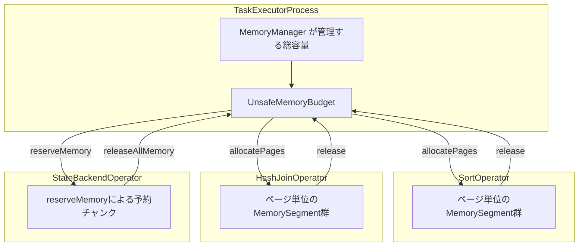

# 第3章 メモリ管理：MemorySegment とマネージドメモリ

> **本章で読むソース**
>
> - [`MemorySegment.java`](https://github.com/apache/flink/blob/release-2.3.0/flink-core/src/main/java/org/apache/flink/core/memory/MemorySegment.java)
> - [`MemorySegmentFactory.java`](https://github.com/apache/flink/blob/release-2.3.0/flink-core/src/main/java/org/apache/flink/core/memory/MemorySegmentFactory.java)
> - [`MemoryManager.java`](https://github.com/apache/flink/blob/release-2.3.0/flink-runtime/src/main/java/org/apache/flink/runtime/memory/MemoryManager.java)

## この章の狙い

第1章では、Flink が JVM ヒープに依存しないメモリ管理層を持つことに触れた。
本章では、その基盤である `MemorySegment` の実装と、`MemorySegment` を束ねて演算子に配分する `MemoryManager` を読み、なぜ Flink が独自のメモリ管理を必要とするのかを機構レベルで説明する。

## 前提

Flink のソート、ハッシュ結合、状態バックエンドといった演算子は、大量のレコードをメモリ上に保持して処理する。
これらのレコードを Java オブジェクトのまま大量に保持すると、二つの問題が起きる。

一つは GC の圧力である。
生存期間の長いオブジェクトが大量にヒープを占めると、フルGC の一時停止時間が伸び、スループットが不安定になる。
もう一つは OOM の予防である。
JVM ヒープの使用量は演算子が抱えるレコード数に依存して変動するため、上限を正確に見積もりにくく、ヒープを使い切って `OutOfMemoryError` に至る危険がある。

Flink はこの二つの問題を避けるため、レコードをシリアライズしたバイト列として、あらかじめ確保しておいた固定サイズのメモリ領域に格納する。
この領域の単位が `MemorySegment` であり、`MemorySegment` を必要な数だけ演算子に配分する役割を `MemoryManager` が担う。

## MemorySegment：ヒープとヒープ外を統一的に扱う抽象

`MemorySegment` は、Flink が管理する一片のメモリを表すクラスである。
クラス冒頭のコメントは、その役割と `java.nio.ByteBuffer` との違いを次のように述べている。

[`MemorySegment.java` L42-L68](https://github.com/apache/flink/blob/release-2.3.0/flink-core/src/main/java/org/apache/flink/core/memory/MemorySegment.java#L42-L68)

```java
/**
 * This class represents a piece of memory managed by Flink.
 *
 * <p>The memory can be on-heap, off-heap direct or off-heap unsafe. This is transparently handled
 * by this class.
 *
 * <p>This class fulfills conceptually a similar purpose as Java's {@link java.nio.ByteBuffer}. We
 * add this specialized class for various reasons:
 *
 * <ul>
 *   <li>It offers additional binary compare, swap, and copy methods.
 *   <li>It uses collapsed checks for range check and memory segment disposal.
 *   <li>It offers absolute positioning methods for bulk put/get methods, to guarantee thread safe
 *       use.
 *   <li>It offers explicit big-endian / little-endian access methods, rather than tracking
 *       internally a byte order.
 *   <li>It transparently and efficiently moves data between on-heap and off-heap variants.
 * </ul>
 *
 * <p><i>Comments on the implementation</i>: We make heavy use of operations that are supported by
 * native instructions, to achieve a high efficiency. Multi byte types (int, long, float, double,
 * ...) are read and written with "unsafe" native commands.
 *
 * <p><i>Note on efficiency</i>: For best efficiency, we do not separate implementations of
 * different memory types with inheritance, to avoid the overhead from looking for concrete
 * implementations on invocations of abstract methods.
 */
```

`MemorySegment` は、`byte[]` によるヒープ上のメモリと、`ByteBuffer` によるヒープ外の直接メモリの両方を、同じ API で扱える。
コンストラクタは用途に応じて二種類あり、`heapMemory` フィールドの有無でどちらの種類かを判別する。

[`MemorySegment.java` L152-L208](https://github.com/apache/flink/blob/release-2.3.0/flink-core/src/main/java/org/apache/flink/core/memory/MemorySegment.java#L152-L208)

```java
    MemorySegment(@Nonnull byte[] buffer, @Nullable Object owner) {
        this.heapMemory = buffer;
        this.offHeapBuffer = null;
        this.size = buffer.length;
        this.address = BYTE_ARRAY_BASE_OFFSET;
        this.addressLimit = this.address + this.size;
        this.owner = owner;
        this.allowWrap = true;
        this.cleaner = null;
        this.isFreedAtomic = new AtomicBoolean(false);
    }

    // ... (中略) ...

    MemorySegment(
            @Nonnull ByteBuffer buffer,
            @Nullable Object owner,
            boolean allowWrap,
            @Nullable Runnable cleaner) {
        this.heapMemory = null;
        this.offHeapBuffer = buffer;
        this.size = buffer.capacity();
        this.address = getByteBufferAddress(buffer);
        this.addressLimit = this.address + this.size;
        this.owner = owner;
        this.allowWrap = allowWrap;
        this.cleaner = cleaner;
        this.isFreedAtomic = new AtomicBoolean(false);
    }
```

ヒープメモリの場合、`address` は `byte[]` オブジェクトの先頭からのオフセット（`BYTE_ARRAY_BASE_OFFSET`）になる。
ヒープ外メモリの場合、`address` は `ByteBuffer` が指す絶対アドレスになる。
どちらの場合も、以降の `get`/`put` メソッドは `address` を起点とした相対位置でアクセスするため、呼び出し側は二つの種類を区別する必要がない。

コンストラクタがパッケージプライベートであることからわかるように、アプリケーションコードは `MemorySegment` を直接 `new` しない。
生成は次に見る `MemorySegmentFactory` を経由する。

## 境界チェックと `sun.misc.Unsafe` によるアクセス

`MemorySegment` の `get`/`put` メソッドは `sun.misc.Unsafe` を使って直接メモリへアクセスする。
1バイトの読み書きは次のとおりである。

[`MemorySegment.java` L381-L411](https://github.com/apache/flink/blob/release-2.3.0/flink-core/src/main/java/org/apache/flink/core/memory/MemorySegment.java#L381-L411)

```java
    public byte get(int index) {
        final long pos = address + index;
        if (index >= 0 && pos < addressLimit) {
            return UNSAFE.getByte(heapMemory, pos);
        } else if (address > addressLimit) {
            throw new IllegalStateException("segment has been freed");
        } else {
            // index is in fact invalid
            throw new IndexOutOfBoundsException();
        }
    }

    public void put(int index, byte b) {
        final long pos = address + index;
        if (index >= 0 && pos < addressLimit) {
            UNSAFE.putByte(heapMemory, pos, b);
        } else if (address > addressLimit) {
            throw new IllegalStateException("segment has been freed");
        } else {
            // index is in fact invalid
            throw new IndexOutOfBoundsException();
        }
    }
```

境界チェックの実装には工夫がある。
クラス冒頭近くのコメントは、チェックをできる限り一つの条件式に集約すること、そして減算を使うことで安全性を保つことを述べている。

[`MemorySegment.java` L362-L371](https://github.com/apache/flink/blob/release-2.3.0/flink-core/src/main/java/org/apache/flink/core/memory/MemorySegment.java#L362-L371)

```java
    // ------------------------------------------------------------------------
    // Notes on the implementation: We try to collapse as many checks as
    // possible. We need to obey the following rules to make this safe
    // against segfaults:
    //
    //  - Grab mutable fields onto the stack before checking and using. This
    //    guards us against concurrent modifications which invalidate the
    //    pointers
    //  - Use subtractions for range checks, as they are tolerant
    // ------------------------------------------------------------------------
```

`get(int index)` は `index >= 0 && pos < addressLimit` という一つの条件で、範囲外アクセスと解放済みセグメントへのアクセスの両方を弾く。
条件が満たされないときにはじめて、解放済みかどうかを分岐で区別してより詳しい例外を投げる。
正常系の1回のアクセスにつき比較を一度で済ませることで、頻繁に呼ばれる `get`/`put` のオーバーヘッドを抑えている。

`free()` はこのチェックと連動する形で実装されている。

[`MemorySegment.java` L240-L256](https://github.com/apache/flink/blob/release-2.3.0/flink-core/src/main/java/org/apache/flink/core/memory/MemorySegment.java#L240-L256)

```java
    public void free() {
        if (isFreedAtomic.getAndSet(true)) {
            // the segment has already been freed
            if (checkMultipleFree) {
                throw new IllegalStateException("MemorySegment can be freed only once!");
            }
        } else {
            // this ensures we can place no more data and trigger
            // the checks for the freed segment
            address = addressLimit + 1;
            offHeapBuffer = null; // to enable GC of unsafe memory
            if (cleaner != null) {
                cleaner.run();
                cleaner = null;
            }
        }
    }
```

`free()` は `address` を `addressLimit + 1` に書き換えるだけであり、この一行によって以後のすべての `get`/`put` が `address > addressLimit` の分岐に落ち、解放済みであることが検出される。
専用の `isFreed` フラグをチェックの主経路に加えるのではなく、既存の範囲チェックに解放済み状態を埋め込むことで、正常系のチェックを一つの比較に保っている。

## リトルエンディアン最適化

`MemorySegment` は `getInt`/`putInt` のようにシステムのネイティブバイトオーダーで読み書きするメソッドと、`getIntLittleEndian`/`getIntBigEndian` のように特定のバイトオーダーを明示するメソッドを両方持つ。

[`MemorySegment.java` L793-L845](https://github.com/apache/flink/blob/release-2.3.0/flink-core/src/main/java/org/apache/flink/core/memory/MemorySegment.java#L793-L845)

```java
    public int getInt(int index) {
        final long pos = address + index;
        if (index >= 0 && pos <= addressLimit - 4) {
            return UNSAFE.getInt(heapMemory, pos);
        } else if (address > addressLimit) {
            throw new IllegalStateException("segment has been freed");
        } else {
            // index is in fact invalid
            throw new IndexOutOfBoundsException();
        }
    }

    public int getIntLittleEndian(int index) {
        if (LITTLE_ENDIAN) {
            return getInt(index);
        } else {
            return Integer.reverseBytes(getInt(index));
        }
    }

    public int getIntBigEndian(int index) {
        if (LITTLE_ENDIAN) {
            return Integer.reverseBytes(getInt(index));
        } else {
            return getInt(index);
        }
    }
```

`LITTLE_ENDIAN` は実行環境のネイティブバイトオーダーを表す `boolean` の定数であり、クラス冒頭で次のように宣言される。

[`MemorySegment.java` L87-L92](https://github.com/apache/flink/blob/release-2.3.0/flink-core/src/main/java/org/apache/flink/core/memory/MemorySegment.java#L87-L92)

```java
    /**
     * Constant that flags the byte order. Because this is a boolean constant, the JIT compiler can
     * use this well to aggressively eliminate the non-applicable code paths.
     */
    private static final boolean LITTLE_ENDIAN =
            (ByteOrder.nativeOrder() == ByteOrder.LITTLE_ENDIAN);
```

`LITTLE_ENDIAN` は `static final` の `boolean` であるため、JIT コンパイラはこの値を実行時に不変な定数として扱い、到達しない側の分岐をインライン展開の段階で削除できる。
`getIntLittleEndian` を大半のプラットフォーム（リトルエンディアンの x86/ARM）で呼び出すと、`Integer.reverseBytes` を呼ぶ側の分岐はコンパイル後のコードから消え、実質的に `getInt` と同じ命令列に帰着する。
バイトオーダーの分岐をメソッドの外側（呼び出し側でオーダーを判定するコード）に置かず、`static final boolean` 一つに集約したことが、この最適化を可能にしている。

## バイト列どうしの直接比較

`MemorySegment` は、二つのセグメントの内容をバイト列のまま比較する `compare` メソッドを持つ。

[`MemorySegment.java` L1517-L1542](https://github.com/apache/flink/blob/release-2.3.0/flink-core/src/main/java/org/apache/flink/core/memory/MemorySegment.java#L1517-L1542)

```java
    public int compare(MemorySegment seg2, int offset1, int offset2, int len) {
        while (len >= 8) {
            long l1 = this.getLongBigEndian(offset1);
            long l2 = seg2.getLongBigEndian(offset2);

            if (l1 != l2) {
                return (l1 < l2) ^ (l1 < 0) ^ (l2 < 0) ? -1 : 1;
            }

            offset1 += 8;
            offset2 += 8;
            len -= 8;
        }
        while (len > 0) {
            int b1 = this.get(offset1) & 0xff;
            int b2 = seg2.get(offset2) & 0xff;
            int cmp = b1 - b2;
            if (cmp != 0) {
                return cmp;
            }
            offset1++;
            offset2++;
            len--;
        }
        return 0;
    }
```

この `compare` は、比較のたびにバイト列をオブジェクトへデシリアライズすることをしない。
シリアライズ済みのバイト列を `MemorySegment` に載せたまま、8バイト単位の `long` 比較へ落とし込むことで、1バイトずつの比較よりも少ない命令回数で大小関係を確定させる。
8バイト未満の端数だけを、末尾のループで1バイトずつ比較する。
ソートや結合のように大量のレコードを比較する処理では、比較のたびにオブジェクトを生成しないこの方式が、GC の対象になるオブジェクトの生成を避ける効果を持つ。
これが、本章で説明する最適化の要点である。
すなわち、`MemorySegment` はメモリの確保先を切り替える器であるだけでなく、シリアライズ済みのバイト列に対してソートや結合に必要な演算を直接行える演算の単位でもある。

## MemorySegmentFactory：セグメントの生成

`MemorySegment` のコンストラクタはパッケージプライベートであり、外部からの生成は `MemorySegmentFactory` の静的メソッド経由で行う。

[`MemorySegmentFactory.java` L39-L67](https://github.com/apache/flink/blob/release-2.3.0/flink-core/src/main/java/org/apache/flink/core/memory/MemorySegmentFactory.java#L39-L67)

```java
    /**
     * Creates a new memory segment that targets the given heap memory region.
     *
     * <p>This method should be used to turn short lived byte arrays into memory segments.
     *
     * @param buffer The heap memory region.
     * @return A new memory segment that targets the given heap memory region.
     */
    public static MemorySegment wrap(byte[] buffer) {
        return new MemorySegment(buffer, null);
    }

    /**
     * Copies the given heap memory region and creates a new memory segment wrapping it.
     *
     * @param bytes The heap memory region.
     * @param start starting position, inclusive
     * @param end end position, exclusive
     * @return A new memory segment that targets a copy of the given heap memory region.
     * @throws IllegalArgumentException if start > end or end > bytes.length
     */
    public static MemorySegment wrapCopy(byte[] bytes, int start, int end)
            throws IllegalArgumentException {
        checkArgument(end >= start);
        checkArgument(end <= bytes.length);
        MemorySegment copy = allocateUnpooledSegment(end - start);
        copy.put(0, bytes, start, copy.size());
        return copy;
    }
```

`wrap` は既存の `byte[]` をそのままヒープ上のセグメントにする一方、`allocateUnpooledOffHeapMemory` や `allocateOffHeapUnsafeMemory` はヒープ外に新しくメモリを確保してセグメントにする。

[`MemorySegmentFactory.java` L112-L127](https://github.com/apache/flink/blob/release-2.3.0/flink-core/src/main/java/org/apache/flink/core/memory/MemorySegmentFactory.java#L112-L127)

```java
    public static MemorySegment allocateUnpooledOffHeapMemory(int size) {
        return allocateUnpooledOffHeapMemory(size, null);
    }

    /**
     * Allocates some unpooled off-heap memory and creates a new memory segment that represents that
     * memory.
     *
     * @param size The size of the off-heap memory segment to allocate.
     * @param owner The owner to associate with the off-heap memory segment.
     * @return A new memory segment, backed by unpooled off-heap memory.
     */
    public static MemorySegment allocateUnpooledOffHeapMemory(int size, Object owner) {
        ByteBuffer memory = allocateDirectMemory(size);
        return new MemorySegment(memory, owner);
    }
```

用途に応じて生成方法を分けることで、`MemorySegment` 自身は生成の詳細を気にせず、統一された `get`/`put` の API だけを提供する形になっている。

## MemoryManager：マネージドメモリのページ配分

`MemorySegment` 単体はメモリの一片を表すに過ぎない。
ソート、ハッシュ結合、状態バックエンドといった演算子に対して、決められた総量の中からページ単位で `MemorySegment` を配分し、使用量を追跡する役割を持つのが `MemoryManager` である。
クラス冒頭のコメントは、この役割を次のように述べている。

[`MemoryManager.java` L49-L58](https://github.com/apache/flink/blob/release-2.3.0/flink-runtime/src/main/java/org/apache/flink/runtime/memory/MemoryManager.java#L49-L58)

```java
/**
 * The memory manager governs the memory that Flink uses for sorting, hashing, caching or off-heap
 * state backends (e.g. RocksDB). Memory is represented either in {@link MemorySegment}s of equal
 * size or in reserved chunks of certain size. Operators allocate the memory either by requesting a
 * number of memory segments or by reserving chunks. Any allocated memory has to be released to be
 * reused later.
 *
 * <p>The memory segments are represented as off-heap unsafe memory regions (both via {@link
 * MemorySegment}). Releasing a memory segment will make it re-claimable by the garbage collector,
 * but does not necessarily immediately releases the underlying memory.
 */
```

`MemoryManager` は、演算子（`owner`）ごとに割り当て済みの `MemorySegment` の集合と、予約済みの容量を管理する。

[`MemoryManager.java` L60-L110](https://github.com/apache/flink/blob/release-2.3.0/flink-runtime/src/main/java/org/apache/flink/runtime/memory/MemoryManager.java#L60-L110)

```java
public class MemoryManager {

    private static final Logger LOG = LoggerFactory.getLogger(MemoryManager.class);

    /** The default memory page size. Currently set to 32 KiBytes. */
    public static final int DEFAULT_PAGE_SIZE = 32 * 1024;

    /** The minimal memory page size. Currently set to 4 KiBytes. */
    public static final int MIN_PAGE_SIZE = 4 * 1024;

    // ------------------------------------------------------------------------

    /** Memory segments allocated per memory owner. */
    private final Map<Object, Set<MemorySegment>> allocatedSegments;

    /** Reserved memory per memory owner. */
    private final Map<Object, Long> reservedMemory;

    private final long pageSize;

    private final long totalNumberOfPages;

    private final UnsafeMemoryBudget memoryBudget;

    private final SharedResources sharedResources;

    /** Flag whether the close() has already been invoked. */
    private volatile boolean isShutDown;

    /**
     * Creates a memory manager with the given capacity and given page size.
     *
     * @param memorySize The total size of the off-heap memory to be managed by this memory manager.
     * @param pageSize The size of the pages handed out by the memory manager.
     */
    MemoryManager(long memorySize, int pageSize) {
        sanityCheck(memorySize, pageSize);

        this.pageSize = pageSize;
        this.memoryBudget = new UnsafeMemoryBudget(memorySize);
        this.totalNumberOfPages = memorySize / pageSize;
        this.allocatedSegments = new ConcurrentHashMap<>();
        this.reservedMemory = new ConcurrentHashMap<>();
        this.sharedResources = new SharedResources();
        verifyIntTotalNumberOfPages(memorySize, totalNumberOfPages);

        LOG.debug(
                "Initialized MemoryManager with total memory size {} and page size {}.",
                memorySize,
                pageSize);
    }
```

`pageSize` はデフォルトで32KiB（`DEFAULT_PAGE_SIZE`）に固定されている。
`totalNumberOfPages` は総メモリ量を `pageSize` で割った値であり、`MemoryManager` は個々のバイト数ではなくページの個数で容量を管理する。
容量の予約と解放そのものは `UnsafeMemoryBudget`（`memoryBudget`）に委譲され、`MemoryManager` は「誰にどのページを渡したか」の帳簿を `allocatedSegments` と `reservedMemory` の二つのマップで持つ。

ページ単位の割り当ては `allocatePages` で行う。

[`MemoryManager.java` L212-L254](https://github.com/apache/flink/blob/release-2.3.0/flink-runtime/src/main/java/org/apache/flink/runtime/memory/MemoryManager.java#L212-L254)

```java
    public void allocatePages(Object owner, Collection<MemorySegment> target, int numberOfPages)
            throws MemoryAllocationException {
        // sanity check
        Preconditions.checkNotNull(owner, "The memory owner must not be null.");
        Preconditions.checkState(!isShutDown, "Memory manager has been shut down.");
        Preconditions.checkArgument(
                numberOfPages <= totalNumberOfPages,
                "Cannot allocate more segments %s than the max number %s",
                numberOfPages,
                totalNumberOfPages);

        // reserve array space, if applicable
        if (target instanceof ArrayList) {
            ((ArrayList<MemorySegment>) target).ensureCapacity(numberOfPages);
        }

        long memoryToReserve = numberOfPages * pageSize;
        try {
            memoryBudget.reserveMemory(memoryToReserve);
        } catch (MemoryReservationException e) {
            throw new MemoryAllocationException(
                    String.format("Could not allocate %d pages", numberOfPages), e);
        }

        Runnable pageCleanup = this::releasePage;
        allocatedSegments.compute(
                owner,
                (o, currentSegmentsForOwner) -> {
                    Set<MemorySegment> segmentsForOwner =
                            currentSegmentsForOwner == null
                                    ? CollectionUtil.newHashSetWithExpectedSize(numberOfPages)
                                    : currentSegmentsForOwner;
                    for (long i = numberOfPages; i > 0; i--) {
                        MemorySegment segment =
                                allocateOffHeapUnsafeMemory(getPageSize(), owner, pageCleanup);
                        target.add(segment);
                        segmentsForOwner.add(segment);
                    }
                    return segmentsForOwner;
                });

        Preconditions.checkState(!isShutDown, "Memory manager has been concurrently shut down.");
    }
```

`allocatePages` はまず要求されたページ数ぶんの容量を `memoryBudget` から予約し、予約に成功してからページ数ぶんの `MemorySegment` を生成して `owner` の集合に登録する。
各セグメントには `pageCleanup`（`releasePage`）が結び付けられており、セグメントが解放されるたびに `memoryBudget` の空き容量が1ページぶん戻る。
容量の予約を先に行い、失敗したら `MemoryAllocationException` に変換して呼び出し側へ伝える構成により、総量を超えるページを演算子に渡すことがない。

ページ単位ではなく任意サイズのチャンクを確保したい演算子（RocksDB のような off-heap 状態バックエンドなど）向けには、`reserveMemory`/`releaseMemory` がある。

[`MemoryManager.java` L405-L427](https://github.com/apache/flink/blob/release-2.3.0/flink-runtime/src/main/java/org/apache/flink/runtime/memory/MemoryManager.java#L405-L427)

```java
    /**
     * Reserves a memory chunk of a certain size for an owner from this memory manager.
     *
     * @param owner The owner to associate with the memory reservation, for the fallback release.
     * @param size size of memory to reserve.
     * @throws MemoryReservationException Thrown, if this memory manager does not have the requested
     *     amount of memory any more.
     */
    public void reserveMemory(Object owner, long size) throws MemoryReservationException {
        checkMemoryReservationPreconditions(owner, size);
        if (size == 0L) {
            return;
        }

        memoryBudget.reserveMemory(size);

        reservedMemory.compute(
                owner,
                (o, memoryReservedForOwner) ->
                        memoryReservedForOwner == null ? size : memoryReservedForOwner + size);

        Preconditions.checkState(!isShutDown, "Memory manager has been concurrently shut down.");
    }
```

`reserveMemory` は `MemorySegment` を生成せず、`memoryBudget` の容量だけを減らして `reservedMemory` に記録する。
状態バックエンドが RocksDB のようにメモリを自前で管理する場合、`MemoryManager` はページを配らずに使用量の上限だけを共有する形で協調する。

演算子が終了するときは、`owner` を鍵にまとめて解放できる。

[`MemoryManager.java` L481-L487](https://github.com/apache/flink/blob/release-2.3.0/flink-runtime/src/main/java/org/apache/flink/runtime/memory/MemoryManager.java#L481-L487)

```java
    public void releaseAllMemory(Object owner) {
        checkMemoryReservationPreconditions(owner, 0L);
        Long memoryReservedForOwner = reservedMemory.remove(owner);
        if (memoryReservedForOwner != null) {
            memoryBudget.releaseMemory(memoryReservedForOwner);
        }
    }
```

同様に、ページ単位で割り当てたセグメントも `shutdown()` で一括して解放される。

[`MemoryManager.java` L141-L156](https://github.com/apache/flink/blob/release-2.3.0/flink-runtime/src/main/java/org/apache/flink/runtime/memory/MemoryManager.java#L141-L156)

```java
    public void shutdown() {
        if (!isShutDown) {
            // mark as shutdown and release memory
            isShutDown = true;
            reservedMemory.clear();

            // go over all allocated segments and release them
            for (Set<MemorySegment> segments : allocatedSegments.values()) {
                for (MemorySegment seg : segments) {
                    seg.free();
                }
                segments.clear();
            }
            allocatedSegments.clear();
        }
    }
```

`owner` に紐づく解放経路を用意しておくことで、演算子が例外で異常終了した場合でも `MemoryManager` 側からまとめて後始末できる。
個々の演算子がすべてのセグメントを漏れなく解放する責務を負わずに済む点が、この帳簿方式の利点である。

## メモリ階層の全体像

`MemorySegment` と `MemoryManager` の関係を図にすると、次のようになる。



一つの `MemoryManager` インスタンスが `UnsafeMemoryBudget` を通じて総容量を一元管理し、ソートとハッシュ結合のようにページ単位でメモリを使う演算子には `allocatePages` でページを配り、状態バックエンドのように任意サイズを使う演算子には `reserveMemory` でチャンクぶんの容量だけを分け与える。
どちらの経路も同じ `memoryBudget` を経由するため、演算子の種類が混在していても総使用量が総容量を超えることはない。

## まとめ

`MemorySegment` は、ヒープ上の `byte[]` とヒープ外の直接メモリを同じ `get`/`put` の API で扱う抽象であり、境界チェックを一つの比較式に集約すること、`LITTLE_ENDIAN` を `static final boolean` にして JIT に不要な分岐を消させること、そしてバイト列のまま8バイト単位で比較することで、シリアライズされたレコードに対する高頻度な操作を高速化している。
`MemoryManager` は、この `MemorySegment` をページという単位で束ね、`owner` ごとの帳簿を保ちながら演算子へ配分と回収を行う。
レコードを Java オブジェクトのままヒープに保持せず、シリアライズ済みのバイト列を `MemorySegment` 上で直接操作することが、GC の圧力を抑えつつメモリ使用量の上限を正確に管理できる理由になっている。

## 関連する章

- 第1章 [Flink とは何か：アーキテクチャと実行モデル](../part00-overview/01-what-is-flink.md)
- 第4章 [型システムとシリアライゼーション](04-type-serialization.md)
- 第16章 [ResultPartition と InputGate](../part05-network/16-resultpartition-inputgate.md)
- 第19章 [状態バックエンド](../part06-state-checkpoint/19-state-backend.md)
