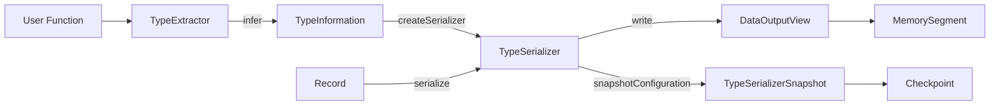

# 第4章 型システムとシリアライゼーション

> **本章で読むソース**
>
> - [`TypeInformation.java`](https://github.com/apache/flink/blob/release-2.3.0/flink-core/src/main/java/org/apache/flink/api/common/typeinfo/TypeInformation.java)
> - [`TypeSerializer.java`](https://github.com/apache/flink/blob/release-2.3.0/flink-core/src/main/java/org/apache/flink/api/common/typeutils/TypeSerializer.java)
> - [`TypeSerializerSnapshot.java`](https://github.com/apache/flink/blob/release-2.3.0/flink-core/src/main/java/org/apache/flink/api/common/typeutils/TypeSerializerSnapshot.java)
> - [`IntSerializer.java`](https://github.com/apache/flink/blob/release-2.3.0/flink-core/src/main/java/org/apache/flink/api/common/typeutils/base/IntSerializer.java)
> - [`PojoSerializer.java`](https://github.com/apache/flink/blob/release-2.3.0/flink-core/src/main/java/org/apache/flink/api/java/typeutils/runtime/PojoSerializer.java)

## この章の狙い

Flink はレコードを演算子間で受け渡すたびに、そのレコードをバイト列へ変換する。
ネットワーク越しの転送、`MemorySegment` 上のバッファへの書き込み、チェックポイントへの状態の書き出しは、すべてこのバイト列変換を経由する。
本章の狙いは、この変換を担う**型システム**の骨格である `TypeInformation` と `TypeSerializer` を読み、Flink が Java 標準の `Serializable` に頼らず独自のシリアライゼーション機構を持つ理由を理解することにある。

## 前提

第3章で見た `MemorySegment` は、バイト列を格納する器である。
本章で扱う `TypeSerializer` は、その器にレコードをどう詰めるかを定めるロジックであり、両者は「入れ物」と「詰め方」の関係にある。
以降では、ユーザープログラムで扱われる一つのデータ型を単に「型」と呼び、その型の値一個を「レコード」と呼ぶ。

## TypeInformation：型情報の中心抽象

**`TypeInformation`** は、Flink の型システムの中心となる抽象クラスである。
クラス冒頭のコメントは、その役割を次のように述べる。

[`TypeInformation.java` L35-L37](https://github.com/apache/flink/blob/release-2.3.0/flink-core/src/main/java/org/apache/flink/api/common/typeinfo/TypeInformation.java#L35-L37)

```java
 * TypeInformation is the core class of Flink's type system. Flink requires a type information for
 * all types that are used as input or return type of a user function. This type information class
 * acts as the tool to generate serializers and comparators, and to perform semantic checks such as
```

ユーザー関数の入力と出力として使われる型はすべて、対応する `TypeInformation` を持つ。
`TypeInformation` は型そのものではなく、型に関するメタ情報を保持するオブジェクトであり、フィールド数（`arity`）や、その型がキーとして使えるかどうかといった情報を提供する。
そして、この型情報から実際にバイト列変換を行うオブジェクトを取り出す入口が `createSerializer` メソッドである。

[`TypeInformation.java` L170-L177](https://github.com/apache/flink/blob/release-2.3.0/flink-core/src/main/java/org/apache/flink/api/common/typeinfo/TypeInformation.java#L170-L177)

```java
    /**
     * Creates a serializer for the type. The serializer may use the ExecutionConfig for
     * parameterization.
     *
     * @param config The config used to parameterize the serializer.
     * @return A serializer for this type.
     */
    @PublicEvolving
    public abstract TypeSerializer<T> createSerializer(SerializerConfig config);
```

`DataStream` プログラムを組み立てる際、Flink は `TypeExtractor` を使ってユーザー関数のシグネチャからこの `TypeInformation` を推論する。
推論された `TypeInformation` は StreamGraph、JobGraph を通じてジョブに埋め込まれ、実行時に各演算子が `createSerializer` を呼び出すことで、その演算子専用の `TypeSerializer` インスタンスが作られる。

## TypeSerializer：バイト列変換の実体

**`TypeSerializer`** は、レコードとバイト列を相互変換するロジックを持つ抽象クラスである。
中心となるメソッドは、書き込みを行う `serialize` と、読み出しを行う `deserialize` である。

[`TypeSerializer.java` L128-L149](https://github.com/apache/flink/blob/release-2.3.0/flink-core/src/main/java/org/apache/flink/api/common/typeutils/TypeSerializer.java#L128-L149)

```java
    /**
     * Serializes the given record to the given target output view.
     *
     * @param record The record to serialize.
     * @param target The output view to write the serialized data to.
     * @throws IOException Thrown, if the serialization encountered an I/O related error. Typically
     *     raised by the output view, which may have an underlying I/O channel to which it
     *     delegates.
     */
    public abstract void serialize(T record, DataOutputView target) throws IOException;

    /**
     * De-serializes a record from the given source input view.
     *
     * @param source The input view from which to read the data.
     * @return The deserialized element.
     * @throws IOException Thrown, if the de-serialization encountered an I/O related error.
     *     Typically raised by the input view, which may have an underlying I/O channel from which
     *     it reads.
     */
    public abstract T deserialize(DataInputView source) throws IOException;
```

`serialize` と `deserialize` は、`byte[]` や `OutputStream` を直接受け取るのではなく、`DataOutputView` と `DataInputView` というインターフェースを介してバイト列を読み書きする。
これらのインターフェースは第3章の `MemorySegment` を抽象化した書き込み口であり、`TypeSerializer` はバッファがヒープ上にあるかオフヒープにあるかを意識せずにレコードを詰められる。

`TypeSerializer` にはもう一つ、`copy(DataInputView source, DataOutputView target)` というメソッドがある。

[`TypeSerializer.java` L159-L169](https://github.com/apache/flink/blob/release-2.3.0/flink-core/src/main/java/org/apache/flink/api/common/typeutils/TypeSerializer.java#L159-L169)

```java
    /**
     * Copies exactly one record from the source input view to the target output view. Whether this
     * operation works on binary data or partially de-serializes the record to determine its length
     * (such as for records of variable length) is up to the implementer. Binary copies are
     * typically faster. A copy of a record containing two integer numbers (8 bytes total) is most
     * efficiently implemented as {@code target.write(source, 8);}.
     *
     * @param source The input view from which to read the record.
     * @param target The target output view to which to write the record.
     * @throws IOException Thrown if any of the two views raises an exception.
     */
    public abstract void copy(DataInputView source, DataOutputView target) throws IOException;
```

このメソッドは、レコードをいったんオブジェクトへ復元してから書き戻すのではなく、バイト列のまま転記することを許す設計になっている。
固定長の型であれば、ヘッダーやレコード長を読み取ってバイト数さえ分かればよく、逐一デシリアライズする必要がない。
シャッフルの中継やソートで大量のレコードを右から左へ移すだけの場面では、この二値コピーがオブジェクト生成とフィールドコピーのコストを丸ごと避ける経路になる。

## 基本型シリアライザ：反射を避けた固定レイアウト

`org.apache.flink.api.common.typeutils.base` パッケージには、`int`、`long`、`String` など基本型ごとに特化したシリアライザが並ぶ。
`IntSerializer` はその代表例である。

[`IntSerializer.java` L28-L95](https://github.com/apache/flink/blob/release-2.3.0/flink-core/src/main/java/org/apache/flink/api/common/typeutils/base/IntSerializer.java#L28-L95)

```java
/** Type serializer for {@code Integer} (and {@code int}, via auto-boxing). */
@Internal
public final class IntSerializer extends TypeSerializerSingleton<Integer> {

    private static final long serialVersionUID = 1L;

    /** Sharable instance of the IntSerializer. */
    public static final IntSerializer INSTANCE = new IntSerializer();

    private static final Integer ZERO = 0;

    @Override
    public boolean isImmutableType() {
        return true;
    }

    @Override
    public Integer createInstance() {
        return ZERO;
    }

    @Override
    public Integer copy(Integer from) {
        return from;
    }

    @Override
    public Integer copy(Integer from, Integer reuse) {
        return from;
    }

    @Override
    public int getLength() {
        return 4;
    }

    @Override
    public void serialize(Integer record, DataOutputView target) throws IOException {
        target.writeInt(record);
    }

    @Override
    public Integer deserialize(DataInputView source) throws IOException {
        return source.readInt();
    }

    @Override
    public Integer deserialize(Integer reuse, DataInputView source) throws IOException {
        return deserialize(source);
    }

    @Override
    public void copy(DataInputView source, DataOutputView target) throws IOException {
        target.writeInt(source.readInt());
    }

    @Override
    public TypeSerializerSnapshot<Integer> snapshotConfiguration() {
        return new IntSerializerSnapshot();
    }
```

`serialize` の実体は `target.writeInt(record)` の一行であり、`getLength()` は常に4バイトを返す。
リフレクションによるフィールド走査もフォーマット判定も行わず、4バイト固定のレイアウトを直接読み書きするだけである。
`Integer` の値をアンボクシングして4バイトを書き込むだけの処理は、Java 標準の `ObjectOutputStream` がクラス情報やオブジェクトグラフをたどりながらシリアライズするのに比べて、命令数もバイト長も大幅に小さい。

## PojoSerializer：フィールドごとの合成

ユーザー定義の POJO クラス（フィールドが public か getter/setter を持つ通常の Java クラス）には `PojoSerializer` が使われる。
`PojoSerializer` はフィールドの型ごとに専用の `TypeSerializer` を束ねて持ち、`serialize` の中でフィールドを一つずつ処理する。

[`PojoSerializer.java` L372-L398](https://github.com/apache/flink/blob/release-2.3.0/flink-core/src/main/java/org/apache/flink/api/java/typeutils/runtime/PojoSerializer.java#L372-L398)

```java
    public void serialize(T value, DataOutputView target) throws IOException {
        int flags = 0;
        // handle null values
        if (value == null) {
            flags |= IS_NULL;
            target.writeByte(flags);
            return;
        }

        Integer subclassTag = -1;
        Class<?> actualClass = value.getClass();
        TypeSerializer subclassSerializer = null;
        if (clazz != actualClass) {
            subclassTag = registeredClasses.get(actualClass);
            if (subclassTag != null) {
                flags |= IS_TAGGED_SUBCLASS;
                subclassSerializer = registeredSerializers[subclassTag];
            } else {
                flags |= IS_SUBCLASS;
                subclassSerializer = getSubclassSerializer(actualClass);
            }
        } else {
            flags |= NO_SUBCLASS;
        }

        target.writeByte(flags);
```

続く本体では、サブクラスでない通常のケース（`NO_SUBCLASS`）において、各フィールドを `fieldSerializers[i]` に委譲して書き込む。

[`PojoSerializer.java` L406-L419](https://github.com/apache/flink/blob/release-2.3.0/flink-core/src/main/java/org/apache/flink/api/java/typeutils/runtime/PojoSerializer.java#L406-L419)

```java
        if ((flags & NO_SUBCLASS) != 0) {
            try {
                for (int i = 0; i < numFields; i++) {
                    Object o = (fields[i] != null) ? fields[i].get(value) : null;
                    if (o == null) {
                        target.writeBoolean(true); // null field handling
                    } else {
                        target.writeBoolean(false);
                        fieldSerializers[i].serialize(o, target);
                    }
                }
            } catch (IllegalAccessException e) {
                throw new RuntimeException(
                        "Error during POJO copy, this should not happen since we check the fields before.",
                        e);
            }
        }
```

フィールドへのアクセスには `java.lang.reflect.Field` を使っているものの、フィールドの一覧と、各フィールドに対応する `TypeSerializer` の対応表は、コンストラクタの時点で一度だけ構築され、インスタンスに保持される。
`serialize` を呼ぶたびにクラス構造を調べ直すことはなく、各フィールドは対応する専用シリアライザ（`IntSerializer` や `StringSerializer` など）へ委譲される。
`TupleSerializer` も同様に、要素ごとのシリアライザを配列で保持し、`serialize` の中でフィールドを順に処理する構造を持つ。
複合型のシリアライザが末端まで型ごとの専用シリアライザへ委譲する構造になっていることで、複合型であっても各フィールドは基本型シリアライザと同じ固定レイアウトの書き込みに帰着する。

## TypeSerializerSnapshot：状態の互換性を管理する

チェックポイントやセーブポイントに書き込まれた状態は、ジョブの再起動後に別のバージョンの `TypeSerializer` で読み直されることがある。
この互換性を管理するのが **`TypeSerializerSnapshot`** である。

[`TypeSerializerSnapshot.java` L27-L49](https://github.com/apache/flink/blob/release-2.3.0/flink-core/src/main/java/org/apache/flink/api/common/typeutils/TypeSerializerSnapshot.java#L27-L49)

```java
/**
 * A {@code TypeSerializerSnapshot} is a point-in-time view of a {@link TypeSerializer}'s
 * configuration. The configuration snapshot of a serializer is persisted within checkpoints as a
 * single source of meta information about the schema of serialized data in the checkpoint. This
 * serves three purposes:
 *
 * <ul>
 *   <li><strong>Capturing serializer parameters and schema:</strong> a serializer's configuration
 *       snapshot represents information about the parameters, state, and schema of a serializer.
 *       This is explained in more detail below.
 *   <li><strong>Compatibility checks for new serializers:</strong> when new serializers are
 *       available, they need to be checked whether or not they are compatible to read the data
 *       written by the previous serializer. This is performed by providing the new serializer
 *       snapshots to resolve the compatibility with the corresponding previous serializer snapshots
 *       in checkpoints.
 *   <li><strong>Factory for a read serializer when schema conversion is required:</strong> in the
 *       case that new serializers are not compatible to read previous data, a schema conversion
 *       process executed across all data is required before the new serializer can be continued to
 *       be used. This conversion process requires a compatible read serializer to restore
 *       serialized bytes as objects, and then written back again using the new serializer. In this
 *       scenario, the serializer configuration snapshots in checkpoints doubles as a factory for
 *       the read serializer of the conversion process.
 * </ul>
```

`TypeSerializer` は `snapshotConfiguration()` を通じて自分自身の設定のスナップショットをチェックポイントに残す。
ジョブを再起動して新しいバージョンの `TypeSerializer` を使う場合、Flink はこのスナップショットと新しいシリアライザを突き合わせて互換性を判定し、必要ならスキーマ変換を行う。
POJO にフィールドを追加した場合など、状態のスキーマが進化してもチェックポイントから復元できるのは、この仕組みが働くためである。

## TypeInformation から バイト列化までの流れ

`TypeInformation` の推論からレコードのバイト列化までを図にすると、次のようになる。



ユーザー関数から推論された `TypeInformation` は、ジョブのグラフに埋め込まれて実行時まで運ばれる。
実行時に各演算子はこの `TypeInformation` から `TypeSerializer` を一度だけ生成し、以降流れてくるレコードをすべてこの同じインスタンスで `serialize` する。
書き込み先の `DataOutputView` は、実体としては第3章の `MemorySegment` 上のバッファであり、ここでレコードがバイト列として確定する。

## まとめ

Flink の型システムは、`TypeInformation` が型の情報を保持し、そこから `TypeSerializer` を生成するという二段構えになっている。
`TypeSerializer` は `DataOutputView` と `DataInputView` を介してレコードをバイト列化し、基本型シリアライザは反射を使わず固定バイト数のレイアウトを直接読み書きする。
`PojoSerializer` や `TupleSerializer` のような複合型のシリアライザも、コンストラクタ時点でフィールドごとの専用シリアライザを組み立てておくことで、実行時はその委譲だけで済む。
Java 標準の `Serializable` を使わずこの機構を独自に持つ理由は、クラス情報やオブジェクトグラフの走査を伴わない固定レイアウトの読み書きによって高速化とバイト列の圧縮を両立させ、`MemorySegment` 上のバッファへ直接書き込めるようにするためである。
さらに `TypeSerializerSnapshot` によって、チェックポイントに書かれたデータの型の互換性を管理し、状態のスキーマ進化を扱える。

## 関連する章

- 第3章 [MemorySegment とメモリ管理](03-memory-segment.md)
- 第16章 [ResultPartition と InputGate](../part05-network/16-resultpartition-inputgate.md)
- 第19章 [状態バックエンド](../part06-state-checkpoint/19-state-backend.md)
