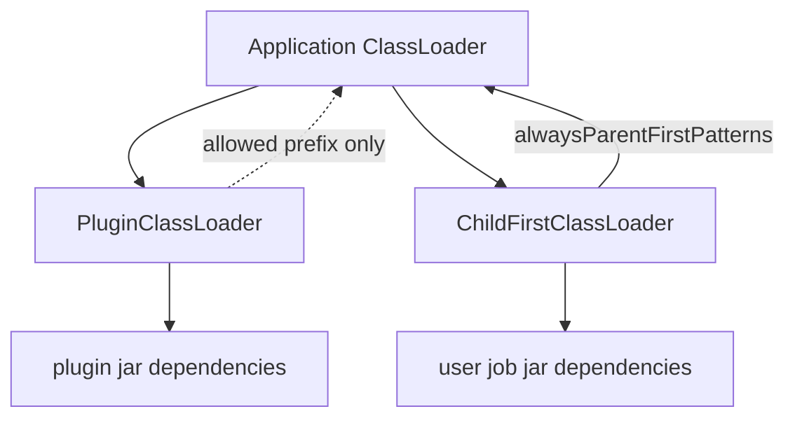

# 第5章 設定、プラグイン、クラスローダー

> **本章で読むソース**
>
> - [`Configuration.java`](https://github.com/apache/flink/blob/release-2.3.0/flink-core/src/main/java/org/apache/flink/configuration/Configuration.java)
> - [`ConfigOption.java`](https://github.com/apache/flink/blob/release-2.3.0/flink-core/src/main/java/org/apache/flink/configuration/ConfigOption.java)
> - [`CoreOptions.java`](https://github.com/apache/flink/blob/release-2.3.0/flink-core/src/main/java/org/apache/flink/configuration/CoreOptions.java)
> - [`PluginManager.java`](https://github.com/apache/flink/blob/release-2.3.0/flink-core/src/main/java/org/apache/flink/core/plugin/PluginManager.java)
> - [`DefaultPluginManager.java`](https://github.com/apache/flink/blob/release-2.3.0/flink-core/src/main/java/org/apache/flink/core/plugin/DefaultPluginManager.java)
> - [`PluginLoader.java`](https://github.com/apache/flink/blob/release-2.3.0/flink-core/src/main/java/org/apache/flink/core/plugin/PluginLoader.java)
> - [`FlinkUserCodeClassLoaders.java`](https://github.com/apache/flink/blob/release-2.3.0/flink-core/src/main/java/org/apache/flink/util/FlinkUserCodeClassLoaders.java)
> - [`ChildFirstClassLoader.java`](https://github.com/apache/flink/blob/release-2.3.0/flink-core/src/main/java/org/apache/flink/util/ChildFirstClassLoader.java)

## この章の狙い

第2章で見た `ClusterEntrypoint` の起動や、第3章と第4章で扱うメモリ管理、シリアライゼーションは、すべて何らかの設定値を読み取って動作を決めている。
本章では、その設定値の受け渡し方式である `Configuration` と `ConfigOption` を読んだうえで、Flink がファイルシステムやメトリクスレポーターといった外部依存の大きいコンポーネントを、どのようにクラスローダーごと隔離してロードしているかを追う。

プラグイン機構とユーザーコードのクラスロードは、いずれも「Flink 本体の依存関係と、外部から持ち込まれる依存関係を衝突させない」という同じ課題への解答である。
この課題意識を先に持っておくと、`PluginManager` と `FlinkUserCodeClassLoaders` が別々のクラスでありながら、なぜよく似た形をしているかが理解しやすくなる。

## 前提

Java の `ClassLoader` は親子関係を持ち、あるクラスをロードする際にまず親に委譲し、親が見つけられなければ自分自身で探すのが標準の挙動である（親優先、parent-first）。
Flink はこの標準の挙動をそのまま使う場面と、あえて逆転させて自分自身を先に探す場面（子優先、child-first）を使い分ける。
以降ではこの2つの語を、Java の一般的な意味のまま使う。

## 型付き設定キー：ConfigOption と Configuration

Flink の設定は文字列キーと文字列値の単純なマップではなく、`ConfigOption` という型付きのキーを介してアクセスする。
`ConfigOption` のクラス冒頭のコメントは、その役割を次のように説明する。

[`ConfigOption.java` L30-38](https://github.com/apache/flink/blob/release-2.3.0/flink-core/src/main/java/org/apache/flink/configuration/ConfigOption.java#L30-L38)

```java
/**
 * A {@code ConfigOption} describes a configuration parameter. It encapsulates the configuration
 * key, deprecated older versions of the key, and an optional default value for the configuration
 * parameter.
 *
 * <p>{@code ConfigOptions} are built via the {@link ConfigOptions} class. Once created, a config
 * option is immutable.
 *
 * @param <T> The type of value associated with the configuration option.
 */
```

`ConfigOption<T>` は、設定キー文字列（`key`）、後方互換のための旧キー一覧（`fallbackKeys`）、デフォルト値（`defaultValue`）、そして値の型情報（`clazz`）を1つのオブジェクトにまとめている。
`CoreOptions` の `CLASSLOADER_RESOLVE_ORDER` は、この `ConfigOption` の典型的な定義例である。

[`CoreOptions.java` L67-L74](https://github.com/apache/flink/blob/release-2.3.0/flink-core/src/main/java/org/apache/flink/configuration/CoreOptions.java#L67-L74)

```java
    public static final ConfigOption<String> CLASSLOADER_RESOLVE_ORDER =
            ConfigOptions.key("classloader.resolve-order")
                    .stringType()
                    .defaultValue("child-first")
                    .withDescription(
                            "Defines the class resolution strategy when loading classes from user code, meaning whether to"
                                    + " first check the user code jar (\"child-first\") or the application classpath (\"parent-first\")."
                                    + " The default settings indicate to load classes first from the user code jar, which means that user code"
                                    + " jars can include and load different dependencies than Flink uses (transitively).");
```

`ConfigOptions.key(...)` から始まるビルダー呼び出しの連なりによって、キー名、型、デフォルト値、説明文が1箇所にまとまり、`ConfigOption<String>` という不変オブジェクトが生成される。
コード中で設定を参照する側は、この `CLASSLOADER_RESOLVE_ORDER` という定数を直接使うため、キー文字列の綴りを間違える余地がない。

実際の値の読み取りは `Configuration` クラスが担う。

[`Configuration.java` L51-L52](https://github.com/apache/flink/blob/release-2.3.0/flink-core/src/main/java/org/apache/flink/configuration/Configuration.java#L51-L52)

```java
/** Lightweight configuration object which stores key/value pairs. */
@Public
```

`Configuration` は内部的にキーと値のマップを保持する軽量なオブジェクトであり、`get` メソッドで `ConfigOption` を渡すと対応する値を取り出せる。

[`Configuration.java` L347-L350](https://github.com/apache/flink/blob/release-2.3.0/flink-core/src/main/java/org/apache/flink/configuration/Configuration.java#L347-L350)

```java
    @Override
    public <T> T get(ConfigOption<T> option) {
        return getOptional(option).orElseGet(option::defaultValue);
    }
```

`get` の実装は、マップに値が明示的に設定されていれば `getOptional` がそれを返し、設定されていなければ `ConfigOption` 自身が保持するデフォルト値（`option::defaultValue`）へフォールバックする。
デフォルト値がキーの定義側に埋め込まれているため、`Configuration` 側は値の有無だけを気にすればよく、呼び出し側は常に何らかの値を受け取れる。

## プラグインの隔離ロード：PluginManager と PluginLoader

Flink はファイルシステム実装やメトリクスレポーターなど、依存する外部ライブラリのバージョンが利用者ごとに異なりやすいコンポーネントを、コア本体とは別のクラスローダーでロードする。
この仕組みの入り口が `PluginManager` である。

[`PluginManager.java` L23-L27](https://github.com/apache/flink/blob/release-2.3.0/flink-core/src/main/java/org/apache/flink/core/plugin/PluginManager.java#L23-L27)

```java
/**
 * PluginManager is responsible for managing cluster plugins which are loaded using separate class
 * loaders so that their dependencies don't interfere with Flink's dependencies.
 */
public interface PluginManager {
```

インターフェース宣言のコメントが明言する通り、`PluginManager` の存在理由はプラグインの依存関係を Flink 本体の依存関係と干渉させないことにある。
実装である `DefaultPluginManager` は、プラグインごとに `PluginLoader` を1つずつ保持し、`load` が呼ばれるとプラグインの一覧を巡回してサービス実装を集める。

[`DefaultPluginManager.java` L94-L118](https://github.com/apache/flink/blob/release-2.3.0/flink-core/src/main/java/org/apache/flink/core/plugin/DefaultPluginManager.java#L94-L118)

```java
    @Override
    public <P> Iterator<P> load(Class<P> service) {
        ArrayList<Iterator<P>> combinedIterators = new ArrayList<>(pluginDescriptors.size());
        for (PluginDescriptor pluginDescriptor : pluginDescriptors) {
            PluginLoader pluginLoader;
            String pluginId = pluginDescriptor.getPluginId();
            pluginLoadersLock.lock();
            try {
                if (pluginLoaders.containsKey(pluginId)) {
                    LOG.info("Plugin loader with ID found, reusing it: {}", pluginId);
                    pluginLoader = pluginLoaders.get(pluginId);
                } else {
                    LOG.info("Plugin loader with ID not found, creating it: {}", pluginId);
                    pluginLoader =
                            PluginLoader.create(
                                    pluginDescriptor, parentClassLoader, alwaysParentFirstPatterns);
                    pluginLoaders.putIfAbsent(pluginId, pluginLoader);
                }
            } finally {
                pluginLoadersLock.unlock();
            }
            combinedIterators.add(pluginLoader.load(service));
        }
        return Iterators.concat(combinedIterators.iterator());
    }
```

`pluginDescriptors` は、プラグインごとのディレクトリから収集された jar の情報（プラグイン ID とリソース URL）の一覧である。
`load` はまずプラグイン ID に対応する `PluginLoader` が既に作られていないか調べ、なければ `PluginLoader.create` で新規に作る。
一度作った `PluginLoader` を `pluginLoaders` マップに保持して使い回す点は、後述する `PluginClassLoader` の生成コストを避けるためのキャッシュとみなせる。

`PluginLoader` は `Java` 標準の `ServiceLoader`（SPI: Service Provider Interface の仕組み）を、専用のクラスローダーの上で動かすラッパーである。

[`PluginLoader.java` L86-L101](https://github.com/apache/flink/blob/release-2.3.0/flink-core/src/main/java/org/apache/flink/core/plugin/PluginLoader.java#L86-L101)

```java
    /**
     * Returns in iterator over all available implementations of the given service interface (SPI)
     * for the plugin.
     *
     * @param service the service interface (SPI) for which implementations are requested.
     * @param <P> Type of the requested plugin service.
     * @return An iterator of all implementations of the given service interface that could be
     *     loaded from the plugin.
     */
    public <P> Iterator<P> load(Class<P> service) {
        try (TemporaryClassLoaderContext ignored =
                TemporaryClassLoaderContext.of(pluginClassLoader)) {
            return new ContextClassLoaderSettingIterator<>(
                    ServiceLoader.load(service, pluginClassLoader).iterator(), pluginClassLoader);
        }
    }
```

`ServiceLoader.load(service, pluginClassLoader)` の第二引数に、プラグイン専用の `pluginClassLoader` を明示的に渡している点が要である。
`ServiceLoader` は指定されたクラスローダーの `META-INF/services` からサービス実装を探すため、この呼び出しによって Flink 本体の依存関係ではなく、プラグイン jar 内に同梱された依存関係を使って実装クラスがロードされる。

`pluginClassLoader` の実体は `PluginClassLoader` であり、内部で `ComponentClassLoader` を継承して構成される。

[`PluginLoader.java` L142-L162](https://github.com/apache/flink/blob/release-2.3.0/flink-core/src/main/java/org/apache/flink/core/plugin/PluginLoader.java#L142-L162)

```java
    /**
     * Loads all classes from the plugin jar except for explicitly white-listed packages
     * (org.apache.flink, logging).
     *
     * <p>No class/resource in the system class loader (everything in lib/) can be seen in the
     * plugin except those starting with a whitelist prefix.
     */
    private static final class PluginClassLoader extends ComponentClassLoader {

        PluginClassLoader(
                URL[] pluginResourceURLs,
                ClassLoader flinkClassLoader,
                String[] allowedFlinkPackages) {
            super(
                    pluginResourceURLs,
                    flinkClassLoader,
                    allowedFlinkPackages,
                    new String[0],
                    Collections.emptyMap());
        }
    }
```

コメントが述べる通り、`PluginClassLoader` はプラグイン jar のクラスを優先してロードし、Flink 本体側のクラスパス（`lib/` 配下）は明示的に許可されたパッケージ（`org.apache.flink` やロギング関連）以外は見えないようにしている。
これにより、プラグインが内部で使っている依存ライブラリのバージョンが、たとえ Flink 本体のバージョンと衝突していても、互いに影響しない。

## ユーザーコードのクラスロード順序：child-first と parent-first

プラグインと似た課題は、ユーザーが投入するジョブの jar（ユーザーコード）にも存在する。
ユーザーコードが Flink 本体と異なるバージョンのライブラリを使っていると、クラスロードの順序次第でバージョン衝突が起きる。
この順序を制御するのが `FlinkUserCodeClassLoaders` である。

[`FlinkUserCodeClassLoaders.java` L80-L103](https://github.com/apache/flink/blob/release-2.3.0/flink-core/src/main/java/org/apache/flink/util/FlinkUserCodeClassLoaders.java#L80-L103)

```java
    public static MutableURLClassLoader create(
            ResolveOrder resolveOrder,
            URL[] urls,
            ClassLoader parent,
            String[] alwaysParentFirstPatterns,
            Consumer<Throwable> classLoadingExceptionHandler,
            boolean checkClassLoaderLeak) {

        switch (resolveOrder) {
            case CHILD_FIRST:
                return childFirst(
                        urls,
                        parent,
                        alwaysParentFirstPatterns,
                        classLoadingExceptionHandler,
                        checkClassLoaderLeak);
            case PARENT_FIRST:
                return parentFirst(
                        urls, parent, classLoadingExceptionHandler, checkClassLoaderLeak);
            default:
                throw new IllegalArgumentException(
                        "Unknown class resolution order: " + resolveOrder);
        }
    }
```

`ResolveOrder` は前節の `CoreOptions.CLASSLOADER_RESOLVE_ORDER`（デフォルト値 `"child-first"`）から決まり、`CHILD_FIRST` と `PARENT_FIRST` のいずれかのクラスローダーを生成する。
`ChildFirstClassLoader` の実装を見ると、ロード順序の逆転がどう実現されているかがわかる。

[`ChildFirstClassLoader.java` L54-L81](https://github.com/apache/flink/blob/release-2.3.0/flink-core/src/main/java/org/apache/flink/util/ChildFirstClassLoader.java#L54-L81)

```java
    @Override
    protected Class<?> loadClassWithoutExceptionHandling(String name, boolean resolve)
            throws ClassNotFoundException {

        // First, check if the class has already been loaded
        Class<?> c = findLoadedClass(name);

        if (c == null) {
            // check whether the class should go parent-first
            for (String alwaysParentFirstPattern : alwaysParentFirstPatterns) {
                if (name.startsWith(alwaysParentFirstPattern)) {
                    return super.loadClassWithoutExceptionHandling(name, resolve);
                }
            }

            try {
                // check the URLs
                c = findClass(name);
            } catch (ClassNotFoundException e) {
                // let URLClassLoader do it, which will eventually call the parent
                c = super.loadClassWithoutExceptionHandling(name, resolve);
            }
        } else if (resolve) {
            resolveClass(c);
        }

        return c;
    }
```

`ChildFirstClassLoader` は、クラス名が `alwaysParentFirstPatterns` に一致しない限り、まず自分自身（ユーザーコード jar の URL、`findClass`）からクラスを探し、見つからなかった場合にだけ親クラスローダーへ委譲する。
Java 標準の `ClassLoader` は逆に親を先に探すため、この実装によって優先順位が子（ユーザーコード）優先へ入れ替わる。

`alwaysParentFirstPatterns` に含まれるパッケージだけは常に親（Flink 本体側）からロードされる。
`ALWAYS_PARENT_FIRST_LOADER_PATTERNS` のデフォルト一覧には、`java.`、`scala.`、`org.apache.flink.` などが含まれる。

[`CoreOptions.java` L90-L99](https://github.com/apache/flink/blob/release-2.3.0/flink-core/src/main/java/org/apache/flink/configuration/CoreOptions.java#L90-L99)

```java
     * <p>The following classes are loaded parent-first, to avoid any duplication:
     *
     * <ul>
     *   <li>All core Java classes (java.*), because they must never be duplicated.
     *   <li>All core Scala classes (scala.*). Currently Scala is used in the Flink runtime and in
     *       the user code, and some Scala classes cross the boundary, such as the <i>FunctionX</i>
     *       classes. That may change if Scala eventually lives purely as part of the user code.
     *   <li>All Flink classes (org.apache.flink.*). Note that this means that connectors and
     *       formats (flink-avro, etc) are loaded parent-first as well if they are in the core
     *       classpath.
```

コメントが述べる理由は明快である。
`java.*` のような JVM の基盤クラスは複数のクラスローダーで別々にロードされると同一性が崩れるため常に共有が必要であり、`org.apache.flink.*` のような Flink 本体のクラスは、ランタイムとユーザーコードの間でオブジェクトをやり取りする際に同じクラスとして扱われないと `ClassCastException` を起こすため、親から一貫してロードする必要がある。

## なぜクラスローダーを分離するのか

ここまでで見た `PluginClassLoader` と `ChildFirstClassLoader` は、隔離の方向がちょうど逆である。
`PluginClassLoader` はプラグイン jar 側を優先してロードしつつ Flink 本体のクラスは明示的な許可リストだけを通す一方、`ChildFirstClassLoader` はユーザーコード jar 側を優先し、Flink 本体のクラスだけを `alwaysParentFirstPatterns` で親から通す。
どちらも「境界をまたいでやり取りされるクラス（Flink 本体の API やインターフェース）だけは単一の定義に統一し、それ以外の依存ライブラリは互いに衝突させない」という同じ設計方針の表れである。



図の破線と実線は、それぞれのクラスローダーが親（Application ClassLoader）に委譲する経路を示す。
`PluginClassLoader` は許可リストに載ったパッケージだけを親から探すのに対し、`ChildFirstClassLoader` は `alwaysParentFirstPatterns` に一致したクラスだけを親から探す。
両者とも、ロードの起点を子（プラグインまたはユーザーコード）に置くことで、外部から持ち込まれる依存ライブラリのバージョンが Flink 本体側のクラスパスに一切現れないようにしている。

この隔離が最適化として効くのは、依存関係の衝突がクラスローダー単位で解消されるため、Flink 本体のバージョンアップやプラグインの追加が、ユーザーコードや他のプラグインの依存ライブラリのバージョン選択に影響を与えない点にある。
複数のプラグインやユーザージョブが同じ TaskManager プロセス上で動いていても、それぞれが独立したクラスローダー配下で異なるバージョンのライブラリを読み込めるため、依存関係の調整をジョブやプラグインの外側で強制する必要がなくなる。

## まとめ

`ConfigOption` は設定キーに型、デフォルト値、説明を1箇所にまとめ、`Configuration.get` はこの情報を使って値の欠落を自動的にデフォルト値へフォールバックさせる。
`PluginManager` は `PluginLoader` を介してプラグインごとに専用のクラスローダーを割り当て、`ServiceLoader` の探索先をそのクラスローダーに固定することで、プラグインの依存ライブラリを Flink 本体から隔離する。
`FlinkUserCodeClassLoaders` はユーザーコードに対して同じ課題を解き、`ChildFirstClassLoader` はデフォルトのロード順序を子優先へ反転させつつ、`alwaysParentFirstPatterns` で Flink 本体のクラスだけは一貫して親からロードする。
いずれも、境界をまたいでやり取りされるクラスだけを共有し、それ以外の依存関係をクラスローダー単位で隔離するという設計が土台になっている。

## 関連する章

- 第1章 [Flink とは何か：アーキテクチャと実行モデル](../part00-overview/01-what-is-flink.md)
- 第2章 [クラスター起動とジョブ投入](../part00-overview/02-cluster-entrypoint.md)
- 第12章 [TaskExecutor とタスクのデプロイ](../part03-scheduling/12-taskexecutor-deploy.md)
