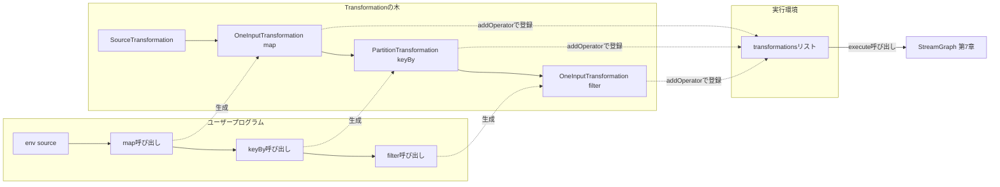

# 第6章 DataStream API と Transformation

> **本章で読むソース**
>
> - [`DataStream.java`](https://github.com/apache/flink/blob/release-2.3.0/flink-runtime/src/main/java/org/apache/flink/streaming/api/datastream/DataStream.java)
> - [`KeyedStream.java`](https://github.com/apache/flink/blob/release-2.3.0/flink-runtime/src/main/java/org/apache/flink/streaming/api/datastream/KeyedStream.java)
> - [`StreamExecutionEnvironment.java`](https://github.com/apache/flink/blob/release-2.3.0/flink-runtime/src/main/java/org/apache/flink/streaming/api/environment/StreamExecutionEnvironment.java)
> - [`Transformation.java`](https://github.com/apache/flink/blob/release-2.3.0/flink-core/src/main/java/org/apache/flink/api/dag/Transformation.java)
> - [`OneInputTransformation.java`](https://github.com/apache/flink/blob/release-2.3.0/flink-runtime/src/main/java/org/apache/flink/streaming/api/transformations/OneInputTransformation.java)
> - [`PartitionTransformation.java`](https://github.com/apache/flink/blob/release-2.3.0/flink-runtime/src/main/java/org/apache/flink/streaming/api/transformations/PartitionTransformation.java)

## この章の狙い

**DataStream** は、Flink のストリーム処理プログラムをユーザーが記述するときの入り口となるクラスである。
`map` や `filter` のようなメソッドを呼び出すたびに、内部では **Transformation** というノードが一つずつ積み上がっていく。
本章の狙いは、ユーザーが書いた演算子の連なりが、実行前にどのような内部構造として保持されるかを追うことにある。
`env.execute()` を呼び出すまで、ここで積み上がった Transformation は実際のグラフには変換されない。
その変換の詳細は第7章で扱う。

## 前提

第1章で述べたとおり、ユーザープログラムは StreamGraph、JobGraph、ExecutionGraph という3層の内部表現を経て実行される。
本章が扱うのは、その最初の層である StreamGraph が組み立てられる前段階、つまり `DataStream` API の呼び出しが記録されていく過程である。
Transformation という語は、この章ではクラス名としての `Transformation` と、ユーザープログラムに現れる「変換」という一般的な操作の両方を指す。
以降、クラスを指すときは `Transformation` とコードフォントで、操作一般を指すときは「変換」と書く。

## DataStream は Transformation を包む薄いラッパー

`DataStream` のクラス冒頭のコメントは、その役割を「変換を適用できるストリーム」と一文で述べている。

[`DataStream.java` L99-L111](https://github.com/apache/flink/blob/release-2.3.0/flink-runtime/src/main/java/org/apache/flink/streaming/api/datastream/DataStream.java#L99-L111)

```java
/**
 * A DataStream represents a stream of elements of the same type. A DataStream can be transformed
 * into another DataStream by applying a transformation as for example:
 *
 * <ul>
 *   <li>{@link DataStream#map}
 *   <li>{@link DataStream#filter}
 * </ul>
 *
 * @param <T> The type of the elements in this stream.
 */
@Public
public class DataStream<T> {
```

`DataStream` のフィールドは実行環境（`StreamExecutionEnvironment`）と、自身の出所を表す `Transformation<T>` の二つだけである。
このフィールド構成が示すとおり、`DataStream` はレコードを保持するコンテナではない。
`map` や `filter` を呼んだ時点でレコードが流れ始めるわけではなく、単に「この `DataStream` はどの `Transformation` から生まれたか」という参照を持ち回っているだけである。

## map と filter が Transformation の木を積む

`map` を呼び出すと、最終的に `transform` メソッドを経由して新しい `Transformation` が一つ作られる。

[`DataStream.java` L422-L429](https://github.com/apache/flink/blob/release-2.3.0/flink-runtime/src/main/java/org/apache/flink/streaming/api/datastream/DataStream.java#L422-L429)

```java
    public <R> SingleOutputStreamOperator<R> map(MapFunction<T, R> mapper) {

        TypeInformation<R> outType =
                TypeExtractor.getMapReturnTypes(
                        clean(mapper), getType(), Utils.getCallLocationName(), true);

        return map(mapper, outType);
    }
```

`filter` も同じ経路をたどる。
出力型を入力型と同じに保ったまま、演算子名として `"Filter"` を渡して `transform` を呼ぶだけである。

[`DataStream.java` L545-L547](https://github.com/apache/flink/blob/release-2.3.0/flink-runtime/src/main/java/org/apache/flink/streaming/api/datastream/DataStream.java#L545-L547)

```java
    public SingleOutputStreamOperator<T> filter(FilterFunction<T> filter) {
        return transform("Filter", getType(), new StreamFilter<>(clean(filter)));
    }
```

両者が合流する先が `doTransform` である。
ここで実際に `OneInputTransformation` が生成され、現在の `DataStream` が持つ `transformation` を入力として渡す。

[`DataStream.java` L823-L847](https://github.com/apache/flink/blob/release-2.3.0/flink-runtime/src/main/java/org/apache/flink/streaming/api/datastream/DataStream.java#L823-L847)

```java
    protected <R> SingleOutputStreamOperator<R> doTransform(
            String operatorName,
            TypeInformation<R> outTypeInfo,
            StreamOperatorFactory<R> operatorFactory) {

        // read the output type of the input Transform to coax out errors about MissingTypeInfo
        transformation.getOutputType();

        OneInputTransformation<T, R> resultTransform =
                new OneInputTransformation<>(
                        this.transformation,
                        operatorName,
                        operatorFactory,
                        outTypeInfo,
                        environment.getParallelism(),
                        false);

        @SuppressWarnings({"unchecked", "rawtypes"})
        SingleOutputStreamOperator<R> returnStream =
                new SingleOutputStreamOperator(environment, resultTransform);

        getExecutionEnvironment().addOperator(resultTransform);

        return returnStream;
    }
```

`new OneInputTransformation<>(this.transformation, ...)` の一行が、この章の核心にあたる。
呼び出し元の `DataStream` が持っていた `Transformation` が、新しく作る `Transformation` の入力として渡される。
`map` を三回連鎖させれば、`Transformation` が三つ、入力を介して鎖のようにつながった状態になる。
そして `doTransform` は最後に、生成した `resultTransform` を新しい `SingleOutputStreamOperator`（`DataStream` のサブクラス）に包んで返す。
ユーザーから見れば `dataStream.map(f).filter(g)` という素直なメソッドチェーンだが、その裏では呼び出しのたびに `Transformation` が一段ずつ積まれ、直前の `Transformation` を入力として指し続けるツリー構造ができあがっている。

`getExecutionEnvironment().addOperator(resultTransform)` は、生成した `Transformation` を実行環境が持つリストに登録する処理である。
`StreamExecutionEnvironment` はこのリストをフィールドとして保持する。

[`StreamExecutionEnvironment.java` L2130-L2134](https://github.com/apache/flink/blob/release-2.3.0/flink-runtime/src/main/java/org/apache/flink/streaming/api/environment/StreamExecutionEnvironment.java#L2130-L2134)

```java
    @Internal
    public void addOperator(Transformation<?> transformation) {
        Preconditions.checkNotNull(transformation, "transformation must not be null.");
        this.transformations.add(transformation);
    }
```

この登録によって、実行環境は「どの演算子が実行対象か」を把握できる。
`Transformation` どうしは入力の参照だけで木構造をなしているが、木の根（Source から見て最も出力側にある演算子）だけを見ていては、途中で枝分かれした演算子や、出力を使われない演算子を取りこぼす。
`transformations` リストに全てのノードを平らに登録しておくことで、`StreamGraph` を作る側は木をたどる代わりにこのリストを起点に走査すればよくなる。

## keyBy は物理演算子を作らない Transformation

`keyBy` は `map` とは異なる種類の `Transformation` を作る。
`KeyedStream` のコンストラクタは、`PartitionTransformation` を生成してから `DataStream` のコンストラクタに渡している。

[`KeyedStream.java` L127-L138](https://github.com/apache/flink/blob/release-2.3.0/flink-runtime/src/main/java/org/apache/flink/streaming/api/datastream/KeyedStream.java#L127-L138)

```java
    public KeyedStream(
            DataStream<T> dataStream,
            KeySelector<T, KEY> keySelector,
            TypeInformation<KEY> keyType) {
        this(
                dataStream,
                new PartitionTransformation<>(
                        dataStream.getTransformation(),
                        new KeyGroupStreamPartitioner<>(
                                keySelector,
                                StreamGraphGenerator.DEFAULT_LOWER_BOUND_MAX_PARALLELISM)),
                keySelector,
                keyType);
    }
```

`PartitionTransformation` のクラスコメントは、この種の `Transformation` が持つ性質を明言している。

[`PartitionTransformation.java` L32-L38](https://github.com/apache/flink/blob/release-2.3.0/flink-runtime/src/main/java/org/apache/flink/streaming/api/transformations/PartitionTransformation.java#L32-L38)

```java
/**
 * This transformation represents a change of partitioning of the input elements.
 *
 * <p>This does not create a physical operation, it only affects how upstream operations are
 * connected to downstream operations.
 *
 * @param <T> The type of the elements that result from this {@link PartitionTransformation}
 */
```

`map` が生成する `OneInputTransformation` はユーザー定義の演算子を保持し、実行時に一つのタスクとして動く物理的な単位に対応する。
一方で `PartitionTransformation` はレコードの送り先をどう振り分けるかという情報だけを持ち、それ自体は演算子として実行されない。
`keyBy` を呼んでも新しいスレッドや新しいタスクが生まれるわけではなく、後続の演算子への接続方法（キーによるハッシュパーティショニング）が記録されるだけである。
この区別は、Transformation の木がそのまま実行時のタスク数と一致しないことを意味する。
物理的な演算子に対応する `Transformation` と、論理的な接続情報だけを表す `Transformation` が同じ木の中に混在している。

## Transformation という抽象

`OneInputTransformation` や `PartitionTransformation` は、いずれも `flink-core` の `Transformation` を継承する。
`Transformation` のクラスコメントは、ユーザー API の呼び出しが作る木構造と、実行時に対応するグラフとの違いを図で示している。

[`Transformation.java` L49-L60](https://github.com/apache/flink/blob/release-2.3.0/flink-core/src/main/java/org/apache/flink/api/dag/Transformation.java#L49-L60)

```java
/**
 * A {@code Transformation} represents the operation that creates a DataStream. Every DataStream has
 * an underlying {@code Transformation} that is the origin of said DataStream.
 *
 * <p>API operations such as DataStream#map create a tree of {@code Transformation}s underneath.
 * When the stream program is to be executed this graph is translated to a StreamGraph using
 * StreamGraphGenerator.
 *
 * <p>A {@code Transformation} does not necessarily correspond to a physical operation at runtime.
 * Some operations are only logical concepts. Examples of this are union, split/select data stream,
 * partitioning.
```

コメントが示す例（union、split/select、partitioning）は、いずれも `keyBy` の `PartitionTransformation` と同じ性質を持つ。
これらは実行時に単独のタスクとして走るのではなく、上流と下流の演算子を接続する方法をエッジ側の情報として StreamGraph に反映される。
`Transformation` の木を実際の実行単位のグラフへ変換する処理が `StreamGraphGenerator` であり、その詳細は第7章で扱う。

各 `Transformation` は入力を「木構造」で保持しているが、その入力を取り出す方法は具象クラスごとに異なる。
`Transformation` 自身は入力を取得する抽象メソッドを持つだけで、フィールドとしての入力は持たない。

[`Transformation.java` L641-L645](https://github.com/apache/flink/blob/release-2.3.0/flink-core/src/main/java/org/apache/flink/api/dag/Transformation.java#L641-L645)

```java
    /**
     * Returns the {@link Transformation transformations} that are the immediate predecessors of the
     * current transformation in the transformation graph.
     */
    public abstract List<Transformation<?>> getInputs();
```

`OneInputTransformation` はこの抽象メソッドを実装し、コンストラクタで受け取った一つの入力をそのまま返す。

[`OneInputTransformation.java` L179-L182](https://github.com/apache/flink/blob/release-2.3.0/flink-runtime/src/main/java/org/apache/flink/streaming/api/transformations/OneInputTransformation.java#L179-L182)

```java
    @Override
    public List<Transformation<?>> getInputs() {
        return Collections.singletonList(input);
    }
```

入力を複数持つ `TwoInputTransformation`（`connect` で作られる join や co-map 用）や、入力を持たない `SourceTransformation` も同じ抽象メソッドを実装する。
入力の個数は具象クラスごとに異なっても、`getInputs()` という統一されたインターフェースを介して木をたどれるため、`StreamGraphGenerator` は具象クラスの違いを意識せずに `Transformation` の木を再帰的に走査できる。

## execute までの流れ：遅延構築という最適化

ここまでに見た `map`、`filter`、`keyBy` の呼び出しは、いずれもオブジェクトを作って `transformations` リストへ登録するだけで、実際のジョブ実行やグラフ生成を一切引き起こさない。
`StreamExecutionEnvironment` は、ユーザーが `execute` を呼んだ時点で初めて、蓄積された `Transformation` のリストから `StreamGraph` を生成する。

[`StreamExecutionEnvironment.java` L2034-L2045](https://github.com/apache/flink/blob/release-2.3.0/flink-runtime/src/main/java/org/apache/flink/streaming/api/environment/StreamExecutionEnvironment.java#L2034-L2045)

```java
    public StreamGraph getStreamGraph(boolean clearTransformations) {
        final StreamGraph streamGraph = getStreamGraph(transformations);
        if (clearTransformations) {
            transformations.clear();
        }
        return streamGraph;
    }

    private StreamGraph getStreamGraph(List<Transformation<?>> transformations) {
        synchronizeClusterDatasetStatus();
        return getStreamGraphGenerator(transformations).generate();
    }
```

この構成が、本章で扱う最適化の要点にあたる。
ユーザー API の呼び出しをその場で実行に移すのではなく、`Transformation` という中間表現に一旦記録しておき、`execute` の直前にまとめて `StreamGraph` へ変換する。
遅延構築にしておくことで、`StreamGraphGenerator` はプログラム全体の `Transformation` の木を見渡してから変換を行える。
オペレーターチェインの判定（第8章）のように隣接するノードの組み合わせを見て決める最適化は、呼び出しのたびに逐次実行していては行えず、木全体が出そろって初めて成立する。
`map` を呼んだ瞬間にすぐ演算子を起動する設計であったなら、後から追加される `filter` との組み合わせを見てチェインするかどうかを決めることはできなかっただろう。

## 新しい DataStream API v2 との関係

Flink 2.x では、`flink-datastream-api` モジュールに `org.apache.flink.datastream.api` という新しい API 群が用意されている。
`ExecutionEnvironment` インターフェースはその入り口であり、`@Experimental` の注釈が示すとおり本稿執筆時点ではまだ実験的な位置づけである。

[`ExecutionEnvironment.java` L28-L33](https://github.com/apache/flink/blob/release-2.3.0/flink-datastream-api/src/main/java/org/apache/flink/datastream/api/ExecutionEnvironment.java#L28-L33)

```java
/**
 * This is the context in which a program is executed.
 *
 * <p>The environment provides methods to create a DataStream and control the job execution.
 */
@Experimental
public interface ExecutionEnvironment {
```

新 API は `NonKeyedPartitionStream` や `KeyedPartitionStream` といった型でストリームを表現し、本章で見た `flink-streaming-java` 系の `DataStream` とはクラス階層が異なる。
本章では旧来の `DataStream` API（`org.apache.flink.streaming.api.datastream` パッケージ）を主な対象として扱い、新 API の詳細な設計には立ち入らない。

## 呼び出しから StreamGraph までの全体像

ここまでの流れを図にすると次のようになる。
ユーザーの API 呼び出しが `Transformation` の木を積み上げ、`execute` の呼び出しで初めてその木がまとめて StreamGraph に変換される。



## まとめ

`DataStream` は実行環境と `Transformation` への参照を持つだけの薄いラッパーであり、`map` と `filter` のようなメソッド呼び出しのたびに新しい `Transformation` を生成して、直前の `Transformation` を入力として鎖状につなげる。
`keyBy` が作る `PartitionTransformation` のように、物理的な演算子を持たず接続方法だけを表す `Transformation` も同じ木の中に混在する。
生成された `Transformation` は `StreamExecutionEnvironment` の `transformations` リストへ登録されるだけで、`execute` が呼ばれるまでグラフへの変換は起こらない。
この遅延構築によって、`StreamGraphGenerator` はプログラム全体の `Transformation` の木を見渡してから StreamGraph を組み立てられる。

## 関連する章

- 第1章 [Flink とは何か：アーキテクチャと実行モデル](../part00-overview/01-what-is-flink.md)
- 第7章 StreamGraph の構築（`StreamGraphGenerator` による Transformation から StreamGraph への変換）
- 第8章 JobGraph とオペレーターチェイン
